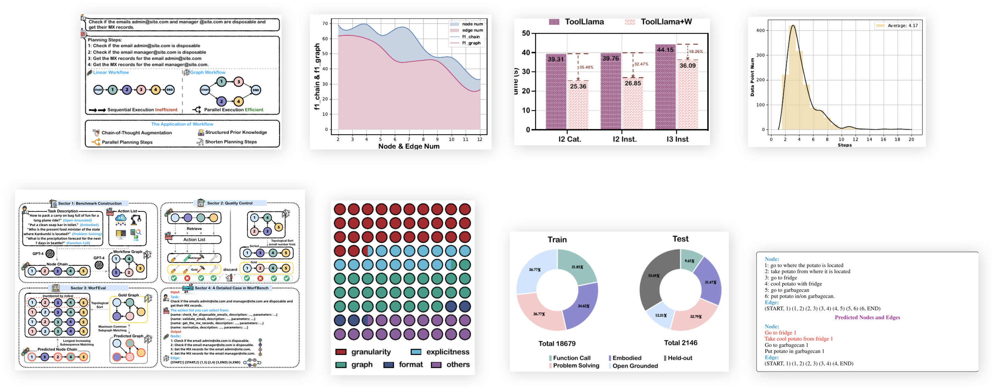

# Paper Reviewer

## Models
- Gemini 1.5 Flash 002: Image cropping, image description, section details, references
- Gemini 1.5 Flash 8B: double-checking the cropped images
- Upstage's Document Parse: Image cropping

## Instructions
### Setup dependencies

```bash
# SETUP API KEYS
$ export GEMINI_API_KEY="..."
$ export UPSTAGE_API_KEY="..." # optional, only if you want to use Upstage's Document Parse

$ pip install -r requirements.txt

# poppler is required to convert pdf to images
# for Ubuntu, use apt install poppler-utils 
$ brew install poppler
```

### Run the pipeline

```bash
$ python main.py --arxiv_id <arxiv_id> --use-upstage --workers <num_workers>
```

## Intermediate results

Currently testing each component of the pipeline separately. Below shows the intermediate results from the paper with arXiv ID `2410.07869`.

### Cropped images



### Image descriptions

```json
[
  {
    "figure_path": "2410.07869/figure_0_0.png",
    "description": "The image is a figure illustrating different workflow structures and their applications. The top section presents a task: checking if two emails are disposable and obtaining their MX records, followed by a breakdown of this task into four sequential planning steps.  Below this, two workflow representations are shown: a linear workflow depicting sequential task execution and a graph workflow demonstrating parallel execution. The linear workflow shows four steps executed sequentially, represented by numbered boxes connected with arrows, labeled as \"Sequential Execution Inefficient\". In contrast, the graph workflow visualizes two parallel execution branches, represented by numbered boxes and connections, labelled as \"Parallel Execution Efficient\". The final section highlights the applications of workflows, listing four key benefits: Chain-of-Thought Augmentation, Structured Prior Knowledge, Parallel Planning Steps, and Shorten Planning Steps, each represented with a corresponding icon.",
    "section": "1 INTRODUCTION"
  },
  {
    "figure_path": "2410.07869/figure_2_0.png",
    "description": "The image is a flowchart illustrating the framework of WORFBENCH, a unified workflow generation benchmark.  The flowchart is divided into four sectors. Sector 1 depicts the benchmark construction process, beginning with a task description and an action list, and generating a node chain and workflow graph using GPT-4. Sector 2 shows the quality control process, involving topological sorting of the workflow graph to ensure consistency and filtering out low-quality data points. Sector 3 details the workflow evaluation protocol WORFEVAL, which uses subsequence and subgraph matching algorithms to compare the generated workflow against the gold standard. Sector 4 provides a detailed example showcasing a specific task, its action list, the gold standard workflow graph, and the predicted workflow graph generated by an LLM agent. The figure visually represents the entire process from task formulation to evaluation, highlighting the complexity and multi-faceted aspects of workflow generation.",
    "section": "2 WORFBENCH"
  },
  {
    "figure_path": "2410.07869/figure_6_0.png",
    "description": "The figure presents a graph illustrating the performance distribution of GPT-4 across different workflow complexities.  The x-axis represents the number of nodes and edges in the workflow, indicating the complexity of the task. The y-axis shows two key metrics: the number of nodes and edges, and the F1 scores for both node chains (linear planning) and workflow graphs (graph planning).  The shaded area represents the range of performance, highlighting that the performance decreases as the number of nodes and edges increases, which indicates that the model's ability to correctly predict more complex workflows diminishes.  The lines illustrate the trend of the F1 scores for node chains and graphs, which both generally decrease as workflow complexity increases, demonstrating that the planning ability of the model struggles with increased complexity.",
    "section": "3.2 Main Results"
  },
  {
    "figure_path": "2410.07869/figure_6_1.png",
    "description": "The figure is a bar chart illustrating the distribution of error types in workflow generation by GPT-4.  The chart displays the frequency of four main error categories: granularity, explicitness, graph, and format.  A fifth category, 'others,' is also included.  Granularity errors are the most frequent, followed by explicitness, and then graph errors.  Format and other errors occur less often.  Each category is represented by a unique color, and the bars are arranged vertically to provide a clear visual comparison of error type frequencies.",
    "section": "Granularity of LLM Agents: Exploits"
  },
  {
    "figure_path": "2410.07869/figure_8_0.png",
    "description": "The figure is a bar chart comparing the average task execution time of ToolLlama and ToolLlama+W across three different task categories: I2 Cat, I2 Inst, and I3 Inst.  ToolLlama+W represents ToolLlama augmented with workflow information. For each category, two bars are displayed, one for ToolLlama and one for ToolLlama+W.  The chart shows that ToolLlama+W consistently outperforms ToolLlama, achieving significant time reductions in all three task categories.  Numerical values indicating the average time (in seconds) are provided above each bar, and percentage differences between ToolLlama and ToolLlama+W are shown next to the ToolLlama+W bars.  The chart's visual elements, including bar colors and patterns, clearly distinguish between the two models being compared.",
    "section": "4.2 REDUCE END-TO-END INFERENCE-TIME"
  },
  {
    "figure_path": "2410.07869/figure_21_0.png",
    "description": "The image presents a pair of donut charts, one labeled \"Train\" and the other \"Test\", illustrating the distribution of data points across different task categories within a workflow generation benchmark.  The \"Train\" chart shows a relatively balanced distribution across four categories: \"Function Call\" (26.77%), \"Problem Solving\" (26.77%), \"Embodied\" (24.62%), and \"Open Grounded\" (21.85%). The total number of data points in the training set is 18679. In contrast, the \"Test\" chart reveals a different distribution, with \"Held-out\" tasks comprising the largest portion (33.69%), followed by \"Embodied\" (21.67%), \"Open Grounded\" (22.79%), and \"Function Call\" (12.21%). The total for the test set is 2146. This disparity likely reflects a deliberate strategy to evaluate model generalization on unseen data.",
    "section": "2.2 BENCHMARK CONSTRUCTION"
  },
  {
    "figure_path": "2410.07869/figure_21_1.png",
    "description": "The figure is a histogram illustrating the distribution of workflow steps in the WORFBENCH benchmark. The x-axis represents the number of steps in a workflow, ranging from 0 to 20. The y-axis shows the number of data points (workflow instances) for each step count.  The histogram reveals a right-skewed distribution, with a peak around 4 steps. This indicates that most workflows in the dataset involve a relatively small number of steps. A smooth black curve is overlaid on the histogram to highlight the overall trend of the distribution.  A beige fill is used to visually represent the data points.",
    "section": "A.3 BENCHMARK STATISTICS"
  },
  {
    "figure_path": "2410.07869/figure_23_0.png",
    "description": "The figure is a schematic overview of the WORFBENCH benchmark framework.  It is divided into four sectors. Sector 1 shows the benchmark construction process, beginning with a task description and action list.  The LLM then generates a node chain, which is then filtered and used to create the workflow graph. Sector 2 shows the quality control measures, ensuring that the generated workflows meet certain quality standards.  These steps involve topological sorting to check for consistency, and human evaluation to verify accuracy. Sector 3 illustrates the WORFEVAL evaluation process, showing how subsequence and subgraph matching algorithms are used to evaluate how well the predicted workflow matches the gold standard workflow. Sector 4 provides a detailed example of how the benchmark and evaluation work in practice, using a task of checking email addresses and retrieving MX records. The figure visually represents the transformation of a task description into a workflow graph, incorporating quality control and quantitative evaluation.",
    "section": "2 WORFBENCH"
  }
]
```

### Section details

```json
[
  {
    "page_end_idx": 1,
    "page_start_idx": 1,
    "section_number": 1,
    "section_title": "INTRODUCTION",
    "details": {
      "details": "The remarkable progress in Large Language Models (LLMs) has opened up exciting possibilities for tackling complex real-world problems.  A critical capability for LLM agents to achieve practical deployment is the ability to decompose complex problems into smaller, executable subtasks, forming what is called a workflow.  Workflows, essentially sequences or graphs of subtasks with execution dependencies, act as an intermediate state bridging tasks and executable actions.  This approach enhances the agent’s debuggability and interpretability.  Existing research has explored LLM's potential for automatic workflow generation but suffers from limitations such as restricted scenario coverage, simplistic workflow structures, and lax evaluation standards. These limitations highlight the need for a more comprehensive benchmark and evaluation framework, capable of assessing the workflow generation capabilities of LLMs across diverse and intricate scenarios, thereby filling a crucial gap in the field.",
      "first_cons": "Existing workflow evaluation frameworks suffer from limitations such as restricted scenario coverage and simplistic workflow structures.",
      "first_pros": "LLMs show significant promise in tackling complex real-world problems by decomposing them into executable workflows.",
      "keypoints": [
        "LLMs are advancing the ability to solve complex real-world problems.",
        "Workflows (sequences or graphs of subtasks with execution dependencies) are crucial for LLM agent success.",
        "Current evaluation frameworks are inadequate, lacking comprehensive scenario coverage and detailed evaluation standards."
      ],
      "second_cons": "The current benchmarks predominantly focus on function call tasks and linear relationships, overlooking real-world scenarios' complexity.",
      "second_pros": "Explicit workflows improve the debuggability and interpretability of LLM agents, thereby facilitating better human-machine interaction.",
      "summary": "Large Language Models (LLMs) are increasingly capable of solving complex problems, but require the ability to break down those problems into manageable workflows of subtasks. Current evaluation methods for LLM workflow generation are limited in scope and rigor, necessitating a more comprehensive benchmark to accurately measure their capabilities in diverse and complex scenarios."
    }
  },
  {
    "page_end_idx": 4,
    "page_start_idx": 2,
    "section_number": 2,
    "section_title": "WORFBENCH",
    "details": {
      "details": "The WORFBENCH section details the creation of a unified workflow generation benchmark for Large Language Models (LLMs).  It emphasizes addressing limitations of existing benchmarks, such as limited scenario coverage and simplistic workflow structures.  WORFBENCH introduces multi-faceted scenarios (problem-solving, function calling, embodied planning, and open-grounded planning), modeling workflows as complex Directed Acyclic Graphs (DAGs) to capture serial and parallel structures.  The benchmark includes 18k training samples, 2146 test samples, and 723 held-out tasks for evaluating generalization capabilities.  Strict quality control, including an intermediary node chain structure and topological sorting, ensures data quality. The section also introduces WORFEVAL, a quantitative evaluation protocol using subsequence and subgraph matching algorithms to accurately assess LLM workflow generation abilities.",
      "first_cons": "The reliance on GPT-4 for generating workflows and edges introduces a potential bias and limits the independence of the benchmark from a specific LLM.",
      "first_pros": "The use of complex DAG structures to represent workflows is a significant improvement over previous benchmarks that primarily focused on linear sequences. This more accurately reflects real-world task complexities.",
      "keypoints": [
        "Multi-faceted scenarios: problem-solving, function calling, embodied planning, and open-grounded planning.",
        "Complex workflow structures: modeled as Directed Acyclic Graphs (DAGs).",
        "Large dataset: 18k training samples, 2146 test samples, and 723 held-out tasks.",
        "Strict quality control: Utilizing node chain structure and topological sorting.",
        "Quantitative evaluation: WORFEVAL uses subsequence and subgraph matching algorithms."
      ],
      "second_cons": "The data filtering process, while aiming for quality, might inadvertently remove valuable data points, potentially impacting the benchmark's representativeness.",
      "second_pros": "The introduction of WORFEVAL provides a more rigorous and quantitative approach to evaluating LLM workflow generation, moving beyond simple accuracy metrics.",
      "summary": "WORFBENCH is a new benchmark for evaluating LLM workflow generation that addresses limitations of existing methods by using multi-faceted scenarios, complex DAG workflow structures, a large dataset, strict quality control, and a quantitative evaluation protocol (WORFEVAL) based on subgraph and subsequence matching.  It aims to accurately assess LLMs' abilities in generating realistic and complex workflows."
    }
  },
  {
    "page_end_idx": 7,
    "page_start_idx": 5,
    "section_number": 3,
    "section_title": "EXPERIMENTS",
    "details": {
      "details": "This section details the experimental setup and results of evaluating 18 different LLMs on the WORFBENCH benchmark.  The models are categorized into closed-source (GPT-3.5, GPT-4, Claude-3.5) and open-source models (various sizes, from 7B to 72B parameters).  The evaluation focuses on two aspects: linear planning (node chain) and graph planning (workflow graph) capabilities.  Results show that even the most powerful model, GPT-4, only achieves 52.47% accuracy in graph planning, highlighting a significant gap between linear and graph planning abilities.  Further analysis investigates scaling laws, comparing performance across different model sizes, and assesses the models’ generalization capabilities on held-out tasks.  Two open-source models are fine-tuned, and their performance on held-out datasets is compared with baselines. The study also explores the benefits of using generated workflows to improve downstream task performance and reduce inference time, showing workflows can enhance downstream tasks.  The analysis also includes investigating typical errors in workflow generation by GPT-4, categorized as granularity, explicitness, graph structure, and format issues. ",
      "first_cons": "The evaluation focuses primarily on the performance of LLMs on specific benchmarks, which might not fully capture their real-world applicability and generalizability. The limited scope of scenarios and the benchmark's reliance on GPT-4 for parts of the process may introduce biases that affect the results and interpretation.",
      "first_pros": "The study uses a comprehensive set of 18 models to provide a solid comparative analysis of their workflow generation capabilities. The use of both closed-source and open-source models allows for a wider perspective on the strengths and weaknesses of different model architectures.",
      "keypoints": [
        "GPT-4 achieves only 52.47% accuracy on graph planning, highlighting a significant gap between linear and graph planning abilities.",
        "There's a noticeable performance disparity between closed-source and open-source models, especially in graph planning tasks.",
        "Scaling laws are not perfectly manifested; smaller models sometimes outperform larger models due to training data quality and recency.",
        "Using generated workflows enhances downstream tasks, improving both performance and efficiency (reducing inference time by parallelization)."
      ],
      "second_cons": "The error analysis of GPT-4's workflow generation is qualitative and based on a limited number of manually analyzed samples; this may not represent the full spectrum of errors and their underlying causes.",
      "second_pros": "The study thoroughly investigates the impact of workflow generation on downstream task performance and inference time, showing that using workflows leads to significant improvements in both. The comprehensive analysis of different model scales and architectures provides valuable insights into the relationship between model size, architectural design, and performance on complex workflow generation tasks.",
      "summary": "This experimental study evaluates 18 LLMs (both closed-source and open-source) on a new workflow generation benchmark, WORFBENCH.  The results reveal a substantial gap between linear and graph workflow generation capabilities, with even GPT-4 showing only 52.47% accuracy on graph planning.  Further analysis investigates scaling laws, generalization abilities, and the benefits of using generated workflows to enhance downstream tasks, highlighting the challenges and opportunities in developing robust LLM-based agents that excel in complex planning tasks. Error analysis of GPT-4 reveals common issues like granularity and structural problems in workflow generation."
    }
  },
  {
    "page_end_idx": 9,
    "page_start_idx": 8,
    "section_number": 4,
    "section_title": "THE ROLE OF WORKFLOW FOR AGENT PLANNING",
    "details": {
      "details": "This section explores how incorporating structured workflows into agent planning enhances performance and efficiency.  It focuses on two main ways workflows are beneficial: as structured prior knowledge to guide LLM agents and as Chain-of-Thought (CoT) augmentation to improve efficiency and reduce errors. Using a trained Qwen-2-7B model as the workflow generator, experiments show that workflows significantly improve the end-to-end performance of various LLMs on tasks like ALFWorld and WebShop, with performance boosts reaching up to 15.57% and 1.60% respectively.  The structured nature of workflows also allows for parallel execution of subtasks, reducing average task completion time by roughly one-third in some cases.  Workflows can also shorten the planning steps required by the LLM agents, leading to more efficient task completion and less reliance on random trial-and-error. The section also provides a case study using OpenAI's o1 model, illustrating how the lack of environmental knowledge or overly vague subtasks can lead to errors in workflow generation and highlighting the importance of accurate, detailed subtask descriptions.  The main point is that workflows provide a structured approach to complex task planning that helps LLMs avoid errors and improve efficiency.",
      "first_cons": "The analysis in this section primarily relies on a single trained model (Qwen-2-7B) as the workflow generator.  Using other models or different training methods might yield different results, limiting the generalizability of the findings.",
      "first_pros": "The section provides quantitative results demonstrating the clear benefits of using workflows in agent planning, including substantial improvements in accuracy (up to 15.57%) and speed (up to two-thirds reduction in time).",
      "keypoints": [
        "Workflows significantly improve LLM agent performance (up to 15.57% accuracy improvement and two-thirds reduction in time).",
        "Workflows act as structured prior knowledge guiding planning and reducing trial-and-error.",
        "Workflows enable parallel task execution leading to significant time savings.",
        "Lack of environmental knowledge leads to errors in workflow generation (OpenAI's o1 model case study)."
      ],
      "second_cons": "The section focuses on relatively specific tasks and environments (ALFWorld, WebShop).  The extent to which these findings generalize to other complex real-world scenarios is unclear and requires further investigation.",
      "second_pros": "The section offers valuable insights into the challenges of LLM agent planning and proposes a concrete solution (using workflows) with a clear explanation of its mechanisms and benefits.  The case study with OpenAI's o1 model provides a practical illustration of the benefits and shortcomings of the proposed approach.",
      "summary": "This section investigates the role of structured workflows in enhancing LLM agent planning. It demonstrates that integrating workflows as structured prior knowledge and utilizing them for parallel task execution leads to substantial improvements in both accuracy and efficiency. A case study highlights the impact of insufficient environmental knowledge on workflow generation, emphasizing the importance of comprehensive subtask descriptions."
    }
  },
  {
    "page_end_idx": 10,
    "page_start_idx": 10,
    "section_number": 5,
    "section_title": "RELATED WORK",
    "details": {
      "details": "This section reviews existing research on large language models (LLMs) and their application as agents, focusing particularly on workflow generation and evaluation.  It begins by highlighting the recent surge in LLM-driven agents tackling various complex real-world problems, emphasizing the importance of workflow decomposition in this process. The review then analyzes existing workflow evaluation frameworks, pointing out their limitations such as restricted scenario coverage, simplistic workflow structures, and lax evaluation standards.  The discussion shifts to the three main approaches to workflow generation and evaluation: human-designed workflows, automatically generated workflows, and quantitative evaluation methods using metrics like semantic similarity or GPT-4 scoring.  The review critiques the limitations of each approach, specifically noting the lack of flexibility, scalability, and the inherent challenges posed by LLMs' tendency towards hallucinations. Finally, it concludes by emphasizing the need for more comprehensive benchmarks that account for the limitations of existing frameworks, particularly highlighting the need to move beyond simplistic linear workflows to encompass more intricate graph-structured workflows.",
      "first_cons": "The review's focus remains relatively high-level, lacking a deep dive into the technical specifics of different quantitative evaluation metrics and their performance characteristics. This makes it difficult for readers to assess the effectiveness and comparative strengths of different existing methods.",
      "first_pros": "The section effectively summarizes the current state-of-the-art research in LLM-driven agents and workflow generation, providing a valuable overview for readers unfamiliar with the field.  It correctly identifies critical limitations in existing methods.",
      "keypoints": [
        "Existing workflow evaluation frameworks suffer from limitations in scenario coverage, workflow structure, and evaluation standards.",
        "Three main approaches to workflow generation and evaluation are reviewed: human-designed workflows, automatically generated workflows, and quantitative evaluation methods.",
        "Limitations of these approaches are discussed, including the challenge of addressing LLMs' propensity for hallucinations.",
        "The review emphasizes the need for benchmarks that encompass more realistic and complex graph-structured workflows, moving beyond simplistic linear representations to more effectively assess agent capabilities and address existing limitations in the field.  This is an important point highlighting the need to address existing shortcomings in the field to improve future development of LLM agents and their workflow generation capabilities."
      ],
      "second_cons": "The discussion of different workflow generation approaches lacks specific examples or case studies to help illustrate the practical application of the different methodologies.",
      "second_pros": "The section effectively highlights the need for more comprehensive and realistic benchmarks to assess LLM agent capabilities in workflow generation, advocating for a shift towards graph-structured workflows.  This focus on the limitations of existing work and the future direction of research is a valuable contribution.",
      "summary": "This section provides a comprehensive overview of research on Large Language Model (LLM) agents and workflow generation, highlighting the limitations of existing evaluation frameworks and the need for more robust benchmarks that incorporate complex graph structures. The discussion covers human-designed workflows, automatically generated workflows, and quantitative evaluation methods, critically evaluating their strengths and weaknesses while emphasizing the need for a shift towards more nuanced and realistic approaches in future research to effectively evaluate the full potential of LLM agents in complex problem-solving tasks.  The review is valuable for identifying key gaps in the literature and suggesting areas for improvement, particularly advocating for a move towards more realistic and complex graph-structured workflows to more accurately represent real-world problem-solving scenarios.  The section highlights the importance of addressing LLMs' propensity for hallucinations in evaluating workflow generation, as well as the need for more comprehensive and sophisticated evaluation methods capable of assessing real-world performance and scalability rather than solely focusing on end-to-end task performance metrics."
    }
  },
  {
    "page_end_idx": 11,
    "page_start_idx": 11,
    "section_number": 6,
    "section_title": "LIMITATIONS",
    "details": {
      "details": "The limitations section of the paper acknowledges several shortcomings in their work.  Firstly, they admit that while strict quality control was implemented, some queries themselves may have inherent quality issues, and the synthesis of complex queries remains an area for future improvement. Secondly, the dataset, while comprehensive, inevitably lacks coverage of scenarios not present in the source datasets used.  Thirdly, they acknowledge the limitation of their workflow representation, currently only focusing on natural language and not including code-based workflows (e.g., PDDL). Their current workflow is also one-pass and not iterative. Finally, they highlight the assumption that all nodes in a workflow are always traversed, overlooking scenarios with uncertainty where the traversal of each node is probabilistic. This section provides a self-critical assessment of the study, highlighting the scope for future improvements and acknowledging the limitations inherent in their current approach. The authors demonstrate a good level of self-awareness and provide several insightful directions for future work, which increases the trustworthiness and overall quality of the paper.",
      "first_cons": "The dataset lacks coverage of scenarios not present in their source datasets, limiting the generalizability of findings.",
      "first_pros": "The authors show a high level of self-awareness and acknowledge the limitations in their current method and approach.",
      "keypoints": [
        "The study's quality control, while strict, does not eliminate the possibility of inherent quality issues within some queries.",
        "The current workflow representation only considers natural language and excludes other forms, such as code-based workflows (e.g., PDDL).",
        "The workflow is currently a one-pass process, not an iterative one.",
        "The study does not consider uncertain scenarios where the traversal of nodes is probabilistic, not deterministic."
      ],
      "second_cons": "The current workflow model assumes all nodes in the workflow are always traversed, which is not always true in real-world scenarios.",
      "second_pros": "The limitations section provides several insightful directions for future work, enhancing the paper's trustworthiness and overall value.",
      "summary": "This section identifies key limitations of the study:  the inherent quality issues in some queries despite quality control; a lack of coverage of scenarios not present in source data, limiting generalizability;  the exclusive use of natural language for workflow representation, ignoring code-based methods;  the non-iterative workflow generation; and the assumption that all workflow nodes are always traversed.  These acknowledged limitations offer valuable insight into areas for future research and strengthen the paper's reliability."
    }
  }
]
```

### References

```json
{
  "references": [
    {
      " publication_date": "2024",
      "fullname_first_author": "Shuofei Qiao",
      "paper_title": "BENCHMARKING AGENTIC WORKFLOW GENERATION",
      "reason": "This is the main paper of the study. It introduces WORFBENCH and WORFEVAL, which are the core contributions of the work. The paper presents a comprehensive evaluation of various LLMs on the proposed benchmark, showing the gap in linear and graph planning abilities and the role of workflows in agent planning. The detailed analysis and experiments make it the most important paper.",
      "section_number": 1
    },
    {
      " publication_date": "2024",
      "fullname_first_author": "Marah I Abdin",
      "paper_title": "Phi-3 technical report: A highly capable language model locally on your phone.",
      "reason": "This paper introduces a highly capable open-source language model, Phi-3, which was used in the experiments.  Its performance in workflow generation is compared to other LLMs, making it an important reference for the comparative analysis.",
      "section_number": 3
    },
    {
      " publication_date": "2024",
      "fullname_first_author": "Anthropic",
      "paper_title": "Claude 3.5 sonnet",
      "reason": "Claude-3.5, another strong closed-source language model, was included in the experiments. Its performance and comparison to other models are key to the study's findings and conclusions.",
      "section_number": 3
    },
    {
      " publication_date": "2023",
      "fullname_first_author": "Jinze Bai",
      "paper_title": "Qwen technical report",
      "reason": "This paper details the Qwen series of open-source language models. Several models from this series were used in the experiments to study scaling laws in workflow generation.",
      "section_number": 3
    },
    {
      " publication_date": "2024",
      "fullname_first_author": "Abhimanyu Dubey",
      "paper_title": "The llama 3 herd of models",
      "reason": "This paper introduces the Llama 3 series of open-source LLMs, which were included in the experimental evaluation to analyze the effect of model size and architectural differences on workflow generation.",
      "section_number": 3
    },
    {
      " publication_date": "2020",
      "fullname_first_author": "Jared Kaplan",
      "paper_title": "Scaling laws for neural language models",
      "reason": "This paper is foundational for understanding the scaling laws in large language models. The experiments in this paper investigate the scaling laws of workflow generation capabilities.",
      "section_number": 3
    },
    {
      " publication_date": "2018",
      "fullname_first_author": "Mahnaz Koupaee",
      "paper_title": "Wikihow: A large scale text summarization dataset",
      "reason": "The WikiHow dataset was used to provide open-grounded planning scenarios for the workflow generation benchmark. Its inclusion is vital for demonstrating the capabilities of the benchmark across diverse scenarios.",
      "section_number": 2
    },
    {
      " publication_date": "2023",
      "fullname_first_author": "Woosuk Kwon",
      "paper_title": "Efficient memory management for large language model serving with pagedattention",
      "reason": "This paper provides background on efficient memory management techniques relevant to the experiments using large language models.",
      "section_number": 3
    },
    {
      " publication_date": "2023",
      "fullname_first_author": "Chengshu Li",
      "paper_title": "Chain of code: Reasoning with a language model-augmented code emulator",
      "reason": "This paper relates to the broader area of code generation, which is a relevant context for the study of LLM capabilities in planning and workflow creation.",
      "section_number": 1
    },
    {
      " publication_date": "2024",
      "fullname_first_author": "Junkai Li",
      "paper_title": "Internlm2 technical report",
      "reason": "This paper introduces the InternLM language models, which were included in the experimental evaluation to analyze their workflow generation capabilities and compare their performance to other LLMs.",
      "section_number": 3
    },
    {
      " publication_date": "2023",
      "fullname_first_author": "Zehui Chen",
      "paper_title": "T-eval: Evaluating the tool utilization capability of large language models step by step",
      "reason": "This paper provides a related evaluation methodology focusing on tool utilization capabilities of LLMs. It's relevant to the broader research context and helps contextualize the importance of evaluating workflow generation using comprehensive methods.",
      "section_number": 1
    },
    {
      " publication_date": "2023",
      "fullname_first_author": "Anna Dawid",
      "paper_title": "Introduction to latent variable energy-based models: A path towards autonomous machine intelligence",
      "reason": "This work offers theoretical background on energy-based models, which is relevant to understanding the underlying principles and challenges in building LLMs capable of workflow generation.",
      "section_number": 1
    },
    {
      " publication_date": "2024",
      "fullname_first_author": "Xiang Deng",
      "paper_title": "Mind2web: Towards a generalist agent for the web",
      "reason": "This paper provides context on generalist agents for the web, which is a relevant area of research when discussing LLM agent capabilities and their applications in diverse, real-world scenarios.",
      "section_number": 1
    },
    {
      " publication_date": "2024",
      "fullname_first_author": "Abhimanyu Dubey",
      "paper_title": "The llama 3 herd of models",
      "reason": "This paper provides detailed information on the Llama 3 family of LLMs.  The study utilizes several Llama 3 models, and this paper is vital for understanding their architecture and capabilities in relation to workflow generation.",
      "section_number": 3
    },
    {
      " publication_date": "2024",
      "fullname_first_author": "Zane Durante",
      "paper_title": "Agent AI: surveying the horizons of multimodal interaction",
      "reason": "This paper surveys the current state of multimodal interaction for AI agents, contextualizing the challenges and opportunities in complex workflow generation and its importance in LLM agents.",
      "section_number": 1
    },
    {
      " publication_date": "2024",
      "fullname_first_author": "Jian Guan",
      "paper_title": "AMOR: A recipe for building adaptable modular knowledge agents through process feedback",
      "reason": "This paper discusses building adaptable modular knowledge agents, which is closely related to the overall goal of developing robust LLM-based agents that can effectively generate and utilize workflows for complex task completion.",
      "section_number": 1
    },
    {
      " publication_date": "2024",
      "fullname_first_author": "Nitzan Bitton Guetta",
      "paper_title": "Visual riddles: a commonsense and world knowledge challenge for large vision and language models",
      "reason": "This study focuses on vision and language models, which is a relevant area of study when considering embodied agents and their ability to solve complex tasks requiring both reasoning and interaction with the environment, which is crucial for realistic workflow generation.",
      "section_number": 1
    },
    {
      " publication_date": "2024",
      "fullname_first_author": "Zhicheng Guo",
      "paper_title": "Stabletoolbench: Towards stable large-scale benchmarking on tool learning of large language models",
      "reason": "This paper introduces a relevant benchmark for tool learning, which is a significant aspect of workflow generation. The comparison to this benchmark helps to understand the unique contributions of WORFBENCH.",
      "section_number": 2
    },
    {
      " publication_date": "2023",
      "fullname_first_author": "Shibo Hao",
      "paper_title": "Reasoning with language model is planning with world model",
      "reason": "This paper establishes a connection between reasoning and planning using language models and world models. This theoretical understanding is important for the context of workflow generation and planning in LLM agents.",
      "section_number": 1
    },
    {
      " publication_date": "2024",
      "fullname_first_author": "Sirui Hong",
      "paper_title": "Metagpt: Meta programming for A multi-agent collaborative framework",
      "reason": "This paper explores multi-agent collaborative frameworks using meta-programming, which provides a contrasting approach to the workflow generation methods studied. The comparison with this paper helps to highlight the advantages and limitations of the proposed methodology.",
      "section_number": 1
    }
  ]
}
```
