### TL;DR



The research introduces HART, a novel autoregressive model for visual generation.  Unlike previous methods relying solely on discrete or continuous representations, HART uses a hybrid approach, combining discrete tokens (for the big picture) and continuous residual tokens (for fine details). This hybrid tokenizer, combined with a lightweight residual diffusion module, enables the generation of high-quality 1024x1024 images. The model's efficiency is significantly higher than state-of-the-art diffusion models, achieving 4.5-7.7x higher throughput and 3.1-5.9x lower latency on A100 GPUs while maintaining competitive image quality in terms of FID and CLIP scores.  The researchers also employed several training strategies to enhance efficiency and quality, such as alternating training and token subsampling.  The code has been open-sourced, making the model accessible for broader use and research.  The results show that HART significantly outperforms existing autoregressive models and can rival diffusion models in image quality while providing substantial efficiency gains.




 &nbsp; read the paper on arXiv


#### Why does it matter?
To provide a concise summary of the research paper on HART (Hybrid Autoregressive Transformer) for efficient visual generation, highlighting its key contributions, methods, and implications for researchers.
#### Key Takeaways


 HART achieves image generation quality comparable to diffusion models but with significantly improved efficiency (4.5-7.7x higher throughput, 3.1-5.9x lower latency). 



 The hybrid tokenizer in HART combines discrete and continuous tokenization, enabling it to capture both overall image structure and fine details, overcoming limitations of existing autoregressive models. 



 HART's scalable architecture and efficiency enhancements make it suitable for high-resolution image generation at a significantly lower computational cost than diffusion models. 


------
#### Visual Insights

, and 6.9-13.4× lower MACs compared to state-of-the-art diffusion models. Check out our online demo and video.")

> Figure 1 is a comparison of HART's performance against other state-of-the-art diffusion and autoregressive models in terms of image generation quality and efficiency.

> The chart compares the performance of HART and MAR models in terms of Inception Score and FID, showing that HART achieves better results with fewer training steps and sampling steps.


<table id='2' style='font-size:20px'><tr><td>Haotian Tang1 *</td><td>Yecheng Wu1,3* Shang Yang1</td><td>Enze Xie2</td><td>Junsong Chen2</td></tr><tr><td>Junyu Chen1,3</td><td>Zhuoyang Zhang1 Han Cai2</td><td>Yao Lu2</td><td>Song Han 1,2</td></tr><tr><td>MIT1 NVIDIA2</td><td>Tsinghua University3</td><td></td><td></td></tr></table>

> Table 2 compares the performance of HART against state-of-the-art diffusion and autoregressive models on multiple image generation benchmarks, showing HART achieves comparable performance with fewer parameters.

### More visual insights

More on figures

, PixArt-Σ (Chen et al., 2024a), and SDXL (Podell et al., 2023) while being 4.6-5.6× faster.")

> Figure 2 shows a comparison of image generation results from HART and other state-of-the-art diffusion models for various prompts, highlighting HART's comparable image quality and significantly improved speed.

 are reflected in the residual tokens, which is modeled by residual diffusion (introduced in Section 3.2).")

> The figure illustrates how HART combines discrete tokens representing the overall image structure with continuous residual tokens representing fine details, which are modeled by a residual diffusion model.

 are reflected in the residual tokens, which is modeled by residual diffusion (introduced in Section 3.2).")

> The figure shows how HART uses discrete tokens to capture the overall image structure and residual tokens to model fine details, combining autoregressive and diffusion models.

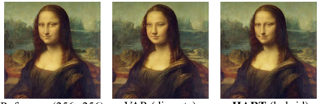

> The figure shows a comparison of reconstruction quality between VAR's discrete tokenizer and HART's hybrid tokenizer on the Mona Lisa image, highlighting HART's improved reconstruction detail.

> The figure shows a comparison of reconstruction quality between VAR's discrete tokenizer and HART's hybrid tokenizer, highlighting HART's improved detail preservation.

.")

> The figure illustrates the hybrid tokenizer in HART, which decomposes continuous latents into discrete and continuous tokens for better image reconstruction.

 a series of discrete tokens modeled by a scalable-resolution (up to 1024px) autoregressive transformer, and 2) residual tokens modeled by a lightweight residual diffusion (37M parameters and 8 steps) module. The final image representation is the sum of these two components.")

> The figure illustrates HART's framework, decomposing continuous image tokens into discrete tokens processed by a scalable autoregressive transformer and residual tokens handled by a lightweight residual diffusion module, then combining them for image generation.

> Figure 8 shows the comparison of image generation results of different models at different resolutions with different numbers of steps.

> The figure compares the image generation results of the official VAR and HART models at different resolutions, showcasing the improved scalability of HART.

 image generation yields significantly more detailed results compared to low-resolution (512x512) generation.")

> The figure shows a comparison of image generation results at 1024x1024 resolution and 512x512 resolution, highlighting the increased detail in higher resolution images.

, PixArt-Σ (Chen et al., 2024a), and SDXL (Podell et al., 2023) while being 4.6-5.6× faster.")

> The figure shows a comparison of image generation results between HART and other state-of-the-art diffusion models for various prompts, highlighting HART's comparable quality and superior speed.

, and 6.9-13.4× lower MACs compared to state-of-the-art diffusion models. Check out our online demo and video.")

> Figure 1 shows a comparison of HART's image generation quality and efficiency against state-of-the-art diffusion models, highlighting HART's superior throughput, lower latency, and reduced MACs.

, PixArt-Σ (Chen et al., 2024a), and SDXL (Podell et al., 2023) while being 4.6-5.6× faster.")

> Figure 2 shows image generation results comparing HART with other state-of-the-art models for several different prompts.

> Figure 11 shows additional examples of 1024x1024 images generated by HART, showcasing its ability to generate high-quality and detailed images from complex text prompts.

, PixArt-Σ (Chen et al., 2024a), and SDXL (Podell et al., 2023) while being 4.6-5.6× faster.")

> Figure 2 shows a comparison of images generated by HART and several state-of-the-art diffusion models for different prompts, demonstrating HART's comparable image quality and significantly faster generation speed.

, PixArt-Σ (Chen et al., 2024a), and SDXL (Podell et al., 2023) while being 4.6-5.6× faster.")

> Figure 2 shows a comparison of image generation results between HART and other state-of-the-art diffusion models for several different prompts, demonstrating HART's ability to generate high-quality 1024x1024 images efficiently.

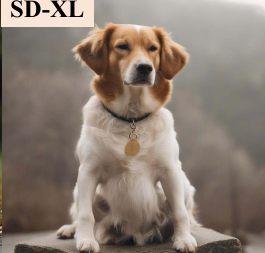

> Figure 11 shows additional examples of 1024x1024 images generated by HART, demonstrating its ability to produce high-quality images comparable to state-of-the-art diffusion models from various text prompts.

, and 6.9-13.4× lower MACs compared to state-of-the-art diffusion models. Check out our online demo and video.")

> Figure 1 shows a comparison of HART's image generation quality and efficiency against state-of-the-art diffusion models, highlighting HART's superior performance in terms of throughput, latency, and MACs.

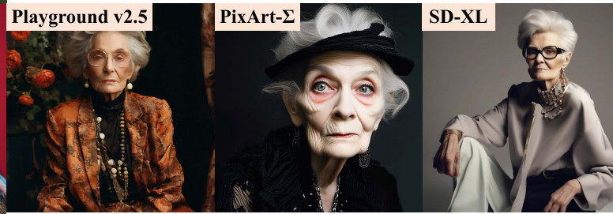

> The figure shows reconstruction quality comparison between VAR and HART tokenizers, highlighting how HART's hybrid tokenization solves detail loss and distortion issues present in VAR's discrete tokenizer.

, and 6.9-13.4× lower MACs compared to state-of-the-art diffusion models. Check out our online demo and video.")

> The figure compares the efficiency and image quality of HART with several state-of-the-art diffusion models, demonstrating HART's superior performance.

.")

> Figure 13 shows 256x256 class-conditional generation results from HART on the ImageNet dataset.

More on tables


<table id='1' style='font-size:16px'><tr><td rowspan="2">Type</td><td rowspan="2">Model</td><td rowspan="2">#Params</td><td rowspan="2">Resolution</td><td colspan="2">MJHQ-30K</td><td>GenEval</td><td>DPG-Bench</td></tr><tr><td>FID↓</td><td>CLIP-Score↑</td><td>Overall↑</td><td>Average↑</td></tr><tr><td>Diff.</td><td>SD v2.1</td><td>860M</td><td>768x768</td><td>26.96</td><td>25.90</td><td>0.50</td><td>68.09</td></tr><tr><td>Diff.</td><td>SD-XL</td><td>2.6B</td><td>1024x 1024</td><td>8.76</td><td>28.60</td><td>0.55</td><td>74.65</td></tr><tr><td>Diff.</td><td>PixArt-�</td><td>630M</td><td>512x512</td><td>6.14</td><td>27.55</td><td>0.48</td><td>71.11</td></tr><tr><td>Diff.</td><td>PixArt-�</td><td>630M</td><td>1024x 1024</td><td>6.34</td><td>27.62</td><td>0.52</td><td>79.46</td></tr><tr><td>Diff.</td><td>Playground v2.5</td><td>2B</td><td>1024x 1024</td><td>6.84</td><td>29.39</td><td>0.56</td><td>76.75</td></tr><tr><td>Diff.</td><td>SD3-medium</td><td>2B</td><td>1024x 1024</td><td>11.92</td><td>27.83</td><td>0.62</td><td>85.80</td></tr><tr><td>AR</td><td>LlamaGen</td><td>775M</td><td>512x512</td><td>25.59</td><td>23.03</td><td>0.32</td><td>65.16</td></tr><tr><td>AR</td><td>Show-o</td><td>1.3B</td><td>256x256</td><td>14.99</td><td>27.02</td><td>0.53</td><td>67.48</td></tr><tr><td rowspan="2">AR</td><td rowspan="2">HART</td><td rowspan="2">732M</td><td>512x512</td><td>5.22</td><td>29.01</td><td>0.56</td><td>80.72</td></tr><tr><td>1024x 1024</td><td>5.38</td><td>29.09</td><td>0.56</td><td>80.89</td></tr></table>

> Table 2 compares the performance of HART against other open-source diffusion and autoregressive models on three benchmark datasets, showing that HART achieves comparable performance to state-of-the-art diffusion models with fewer parameters.


<table id='3' style='font-size:14px'><tr><td rowspan="2">Model</td><td rowspan="2">#Params</td><td rowspan="2">#Steps</td><td colspan="3">512x512</td><td colspan="3">1024x 1024</td></tr><tr><td>Latency (s)</td><td>Throughput (image/s)</td><td>MACs (T)</td><td>Latency (s)</td><td>Throughput (image/s)</td><td>MACs (T)</td></tr><tr><td rowspan="2">SDXL</td><td rowspan="2">2.6B</td><td>20</td><td>1.4</td><td>2.1</td><td>30.7</td><td>2.3</td><td>0.49</td><td>120</td></tr><tr><td>40</td><td>2.5</td><td>1.4</td><td>61.4</td><td>4.3</td><td>0.25</td><td>239</td></tr><tr><td>PixArt-�</td><td>630M</td><td>20</td><td>1.2</td><td>1.7</td><td>21.7</td><td>2.7</td><td>0.4</td><td>86.2</td></tr><tr><td rowspan="2">Playground v2.5</td><td rowspan="2">2B</td><td>20</td><td>-</td><td>-</td><td>-</td><td>2.3</td><td>0.49</td><td>120</td></tr><tr><td>50</td><td>-</td><td>-</td><td>-</td><td>5.3</td><td>0.21</td><td>239</td></tr><tr><td>SD3-medium</td><td>2B</td><td>28</td><td>1.4</td><td>1.1</td><td>51.4</td><td>4.4</td><td>0.29</td><td>168</td></tr><tr><td>LlamaGen</td><td>775M</td><td>1024</td><td>37.7</td><td>0.4</td><td>1.5</td><td>-</td><td>-</td><td>-</td></tr><tr><td rowspan="2">HART</td><td rowspan="2">732M</td><td>10</td><td>0.3</td><td>10.6</td><td>3.2</td><td>-</td><td>-</td><td>-</td></tr><tr><td>14</td><td>一</td><td>一</td><td>一</td><td>0.75</td><td>2.23</td><td>12.5</td></tr></table>

> This table compares the efficiency of HART with state-of-the-art diffusion models in terms of latency, throughput and MACs at 512x512 and 1024x1024 resolutions.


 <table id='8' style='font-size:16px'><tr><td rowspan="2">Method</td><td colspan="3">MJHQ-30K rFID↓</td><td colspan="2">ImageNet rFID↓</td></tr><tr><td>256px</td><td>512px</td><td>1024px</td><td>256px</td><td>512px</td></tr><tr><td>VAR</td><td>1.42</td><td>1.19</td><td>2.11</td><td>0.92</td><td>0.58</td></tr><tr><td>SDXL</td><td>1.08</td><td>0.54</td><td>0.27</td><td>0.69</td><td>0.28</td></tr><tr><td>Ours (dis.)</td><td>1.70</td><td>1.64</td><td>1.09</td><td>1.04</td><td>0.89</td></tr><tr><td>Ours</td><td>0.78</td><td>0.67</td><td>0.30</td><td>0.41</td><td>0.33</td></tr></table>

> Table 2 compares the performance of HART with other autoregressive and diffusion models on various image generation benchmarks, showing HART achieves competitive results with significantly fewer parameters.


<table id='1' style='font-size:14px'><tr><td>Type</td><td>Model</td><td>FID↓</td><td>IS↑</td><td>#Params</td><td>#Step</td><td>MACs</td><td>Inference Time (s)</td></tr><tr><td>Diff.</td><td>DiT-XL/2</td><td>2.27</td><td>278.2</td><td>675M</td><td>250</td><td>57.2T</td><td>113</td></tr><tr><td>AR</td><td>VAR-d20</td><td>2.57</td><td>302.6</td><td>600M</td><td>10</td><td>412G</td><td>1.3</td></tr><tr><td>AR</td><td>VAR-d24</td><td>2.09</td><td>312.9</td><td>1.0B</td><td>10</td><td>709G</td><td>1.7</td></tr><tr><td>AR</td><td>VAR-d30</td><td>1.92</td><td>323.1</td><td>2.0B</td><td>10</td><td>1.4T</td><td>2.6</td></tr><tr><td>AR</td><td>MAR-B</td><td>2.31</td><td>281.7</td><td>208M</td><td>64</td><td>7.0T</td><td>26.1</td></tr><tr><td>AR</td><td>MAR-L</td><td>1.78</td><td>296.0</td><td>479M</td><td>64</td><td>16.0T</td><td>34.9</td></tr><tr><td>AR</td><td>HART-d20</td><td>2.39</td><td>316.4</td><td>649M</td><td>10</td><td>579G</td><td>1.5</td></tr><tr><td>AR</td><td>HART-d24</td><td>2.00</td><td>331.5</td><td>1.0B</td><td>10</td><td>858G</td><td>1.9</td></tr><tr><td>AR</td><td>HART-d30</td><td>1.77</td><td>330.3</td><td>2.0B</td><td>10</td><td>1.5T</td><td>2.7</td></tr></table>

> This table compares the performance of HART against other autoregressive models (VAR and MAR) on class-conditioned image generation, highlighting HART's superior efficiency and comparable FID (Fréchet Inception Distance).


<table id='6' style='font-size:14px'><tr><td>Depth</td><td>Res. tokens</td><td>FID↓</td><td>IS↑</td><td>Time (s)</td></tr><tr><td>20</td><td>X</td><td>2.67</td><td>297.3</td><td>1.3</td></tr><tr><td>20</td><td>V</td><td>2.39</td><td>316.4</td><td>1.5</td></tr><tr><td>24</td><td>X</td><td>2.23</td><td>312.7</td><td>1.7</td></tr><tr><td>24</td><td>V</td><td>2.00</td><td>331.5</td><td>1.9</td></tr><tr><td>30</td><td>X</td><td>2.00</td><td>311.8</td><td>2.5</td></tr><tr><td>30</td><td>V</td><td>1.77</td><td>330.3</td><td>2.7</td></tr></table>

> Table 4 compares HART's class-conditional image generation performance against other autoregressive models (MAR and VAR) in terms of FID, Inception Score, parameters, number of steps, MACs and inference time.


 <table id='7' style='font-size:16px'><tr><td>Resolution</td><td>Res. tokens</td><td>FID↓</td><td>CLIP↑</td><td>Time (s)</td></tr><tr><td>256px</td><td>X</td><td>6.11</td><td>27.96</td><td>2.23</td></tr><tr><td>256px</td><td></td><td>5.52</td><td>28.03</td><td>2.42</td></tr><tr><td>512px</td><td>X</td><td>6.29</td><td>28.91</td><td>5.62</td></tr><tr><td>512px</td><td></td><td>5.22</td><td>29.01</td><td>6.04</td></tr><tr><td>1024px</td><td>X</td><td>5.73</td><td>29.08</td><td>25.9</td></tr><tr><td>1024px*</td><td>X</td><td>7.85</td><td>28.85</td><td>25.9</td></tr><tr><td>1024px</td><td>V</td><td>5.38</td><td>29.09</td><td>28.7</td></tr></table>

> Table 5 shows the ablation study results of HART, demonstrating the impact of residual tokens and other design choices on image generation performance.

### Full paper


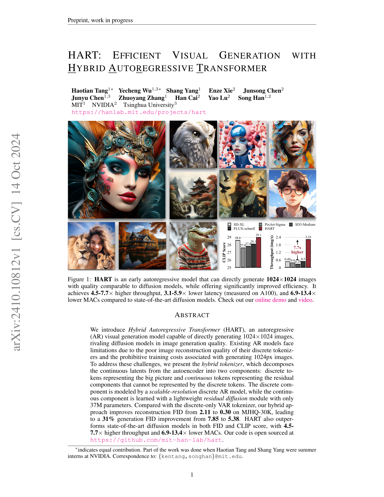

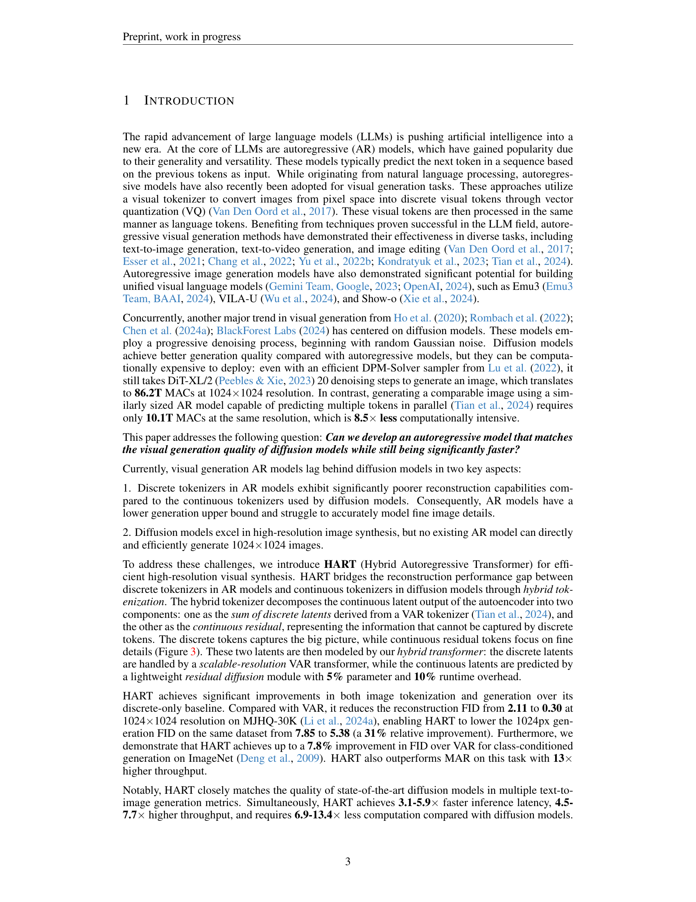

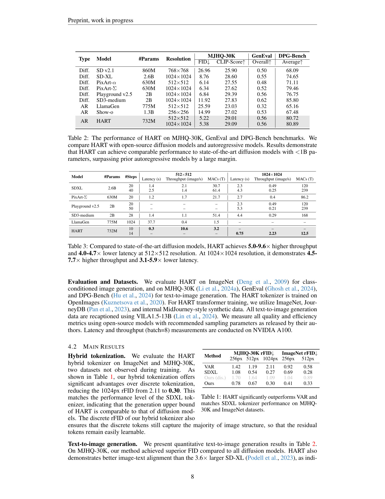
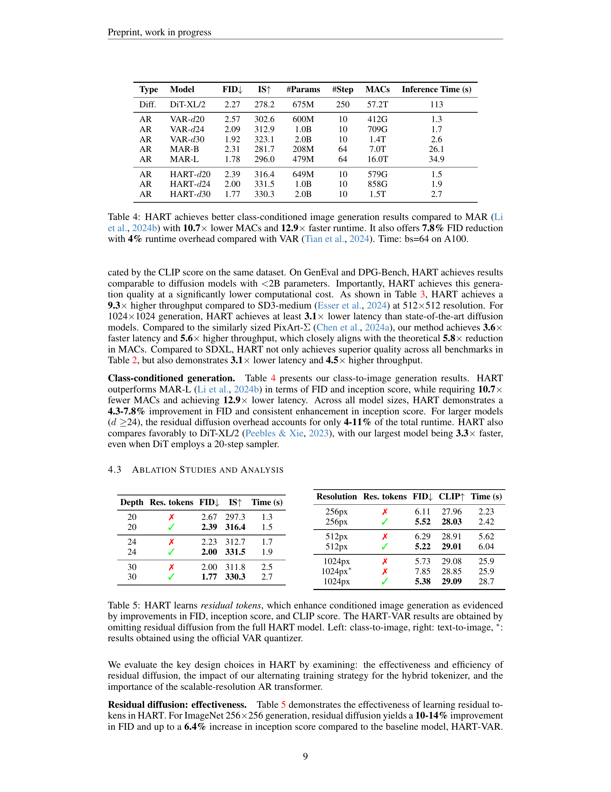
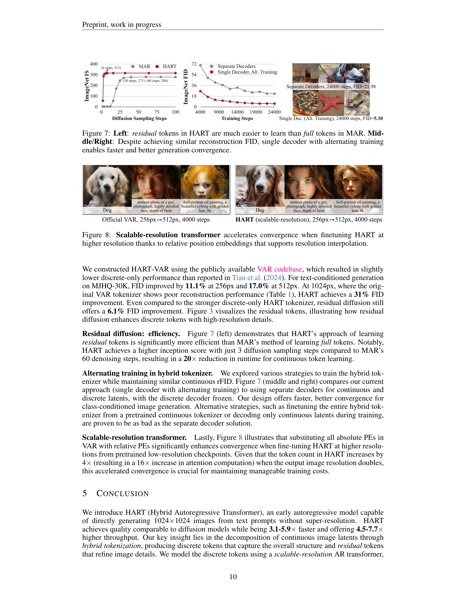

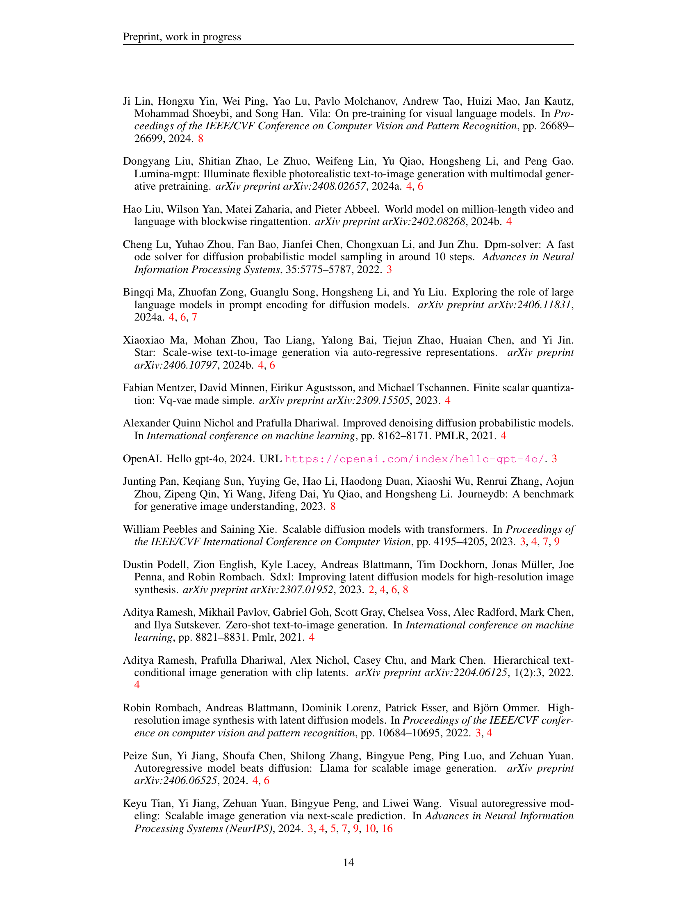
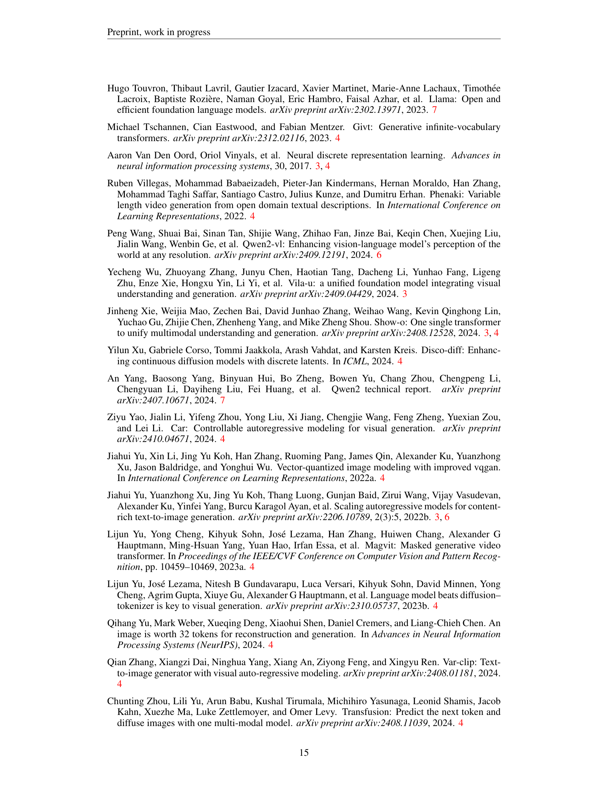
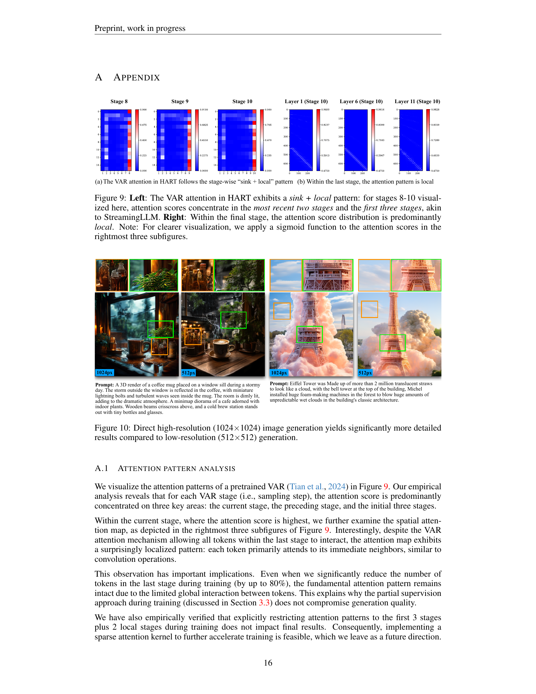

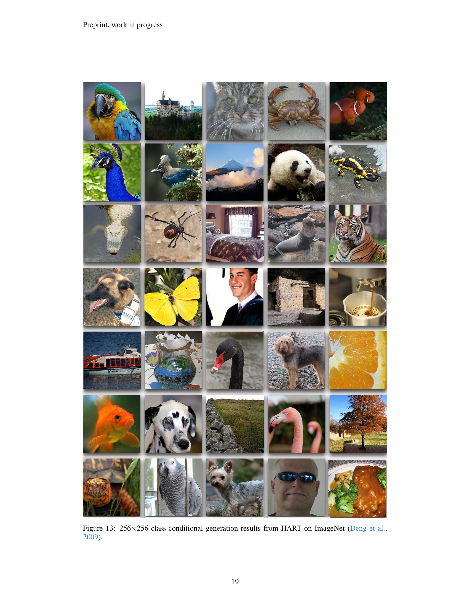
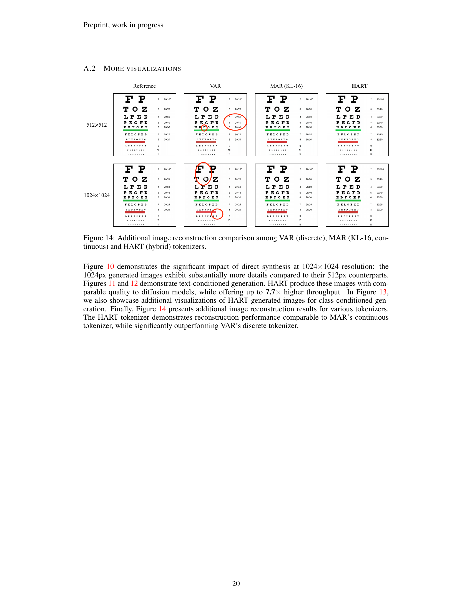
