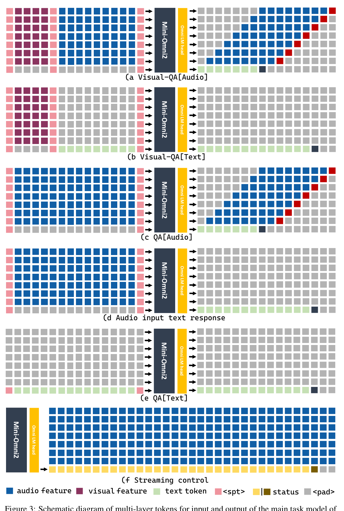
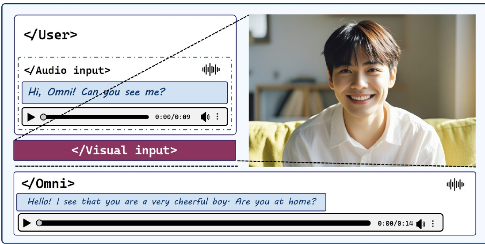
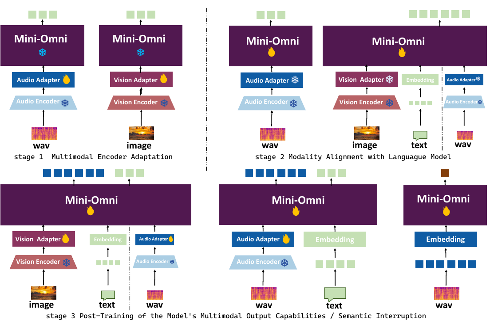
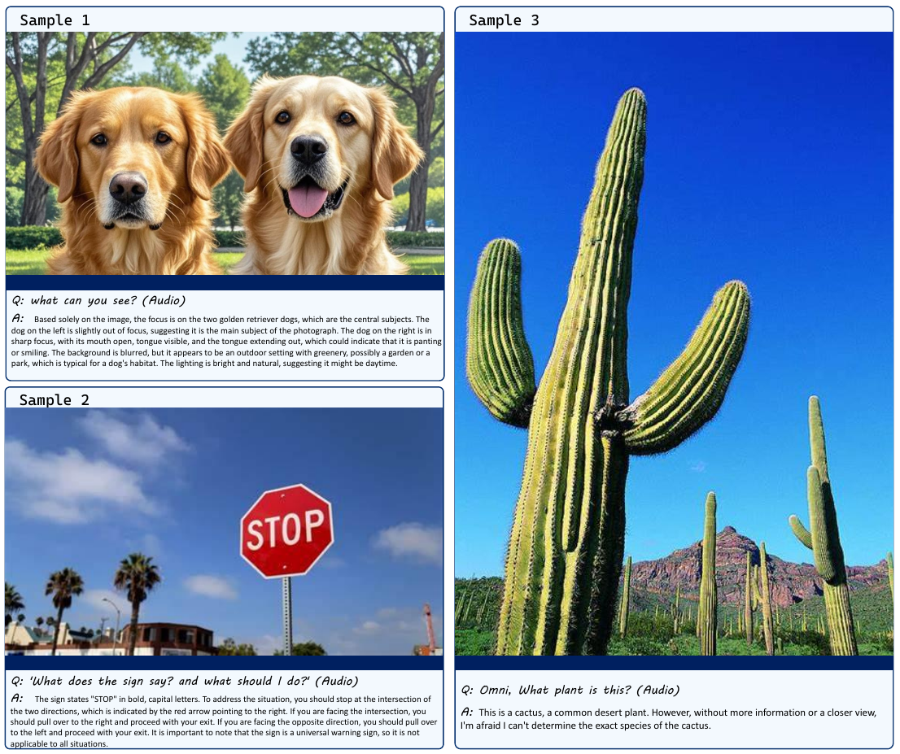
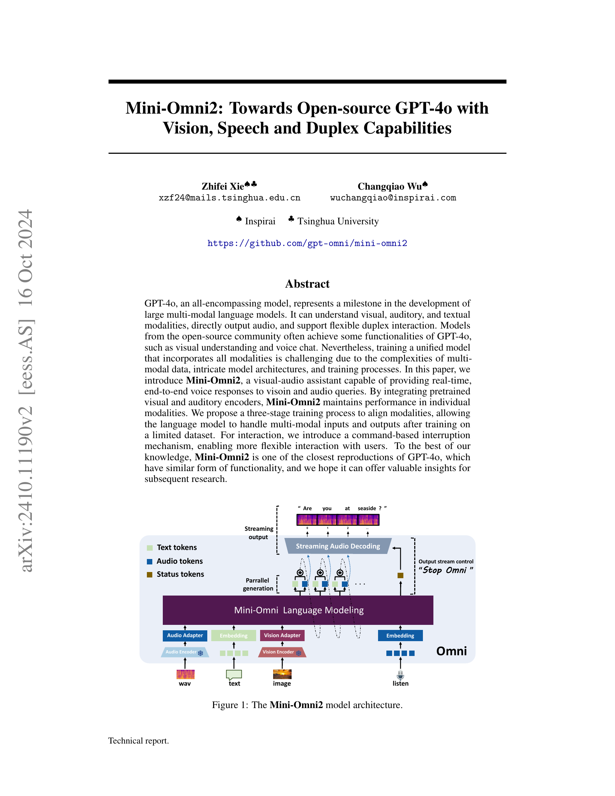
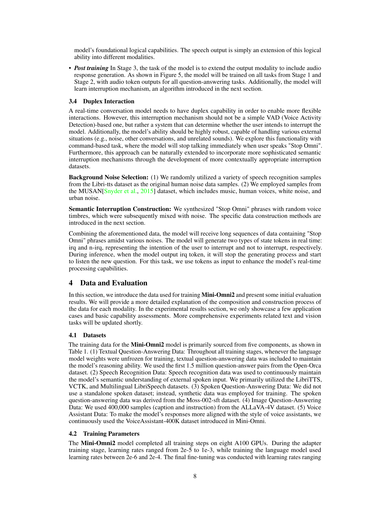
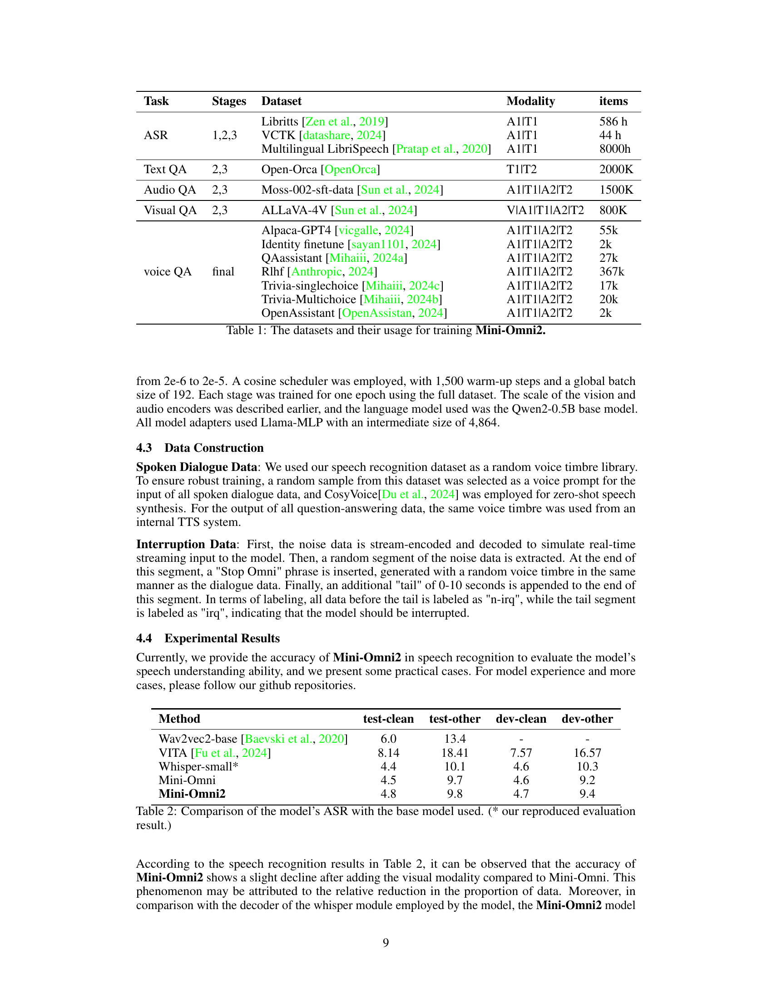

### TL;DR



Mini-Omni2 is a new open-source, multi-modal language model designed to mimic the capabilities of the closed-source GPT-40.  It excels at understanding and responding to visual, audio, and text inputs, and can even engage in real-time, two-way conversations. The researchers achieved this by integrating pre-trained visual and audio encoders with a language model, training it in three stages.  Stage one focuses on adapting the encoders; stage two aligns the different modalities; and stage three refines the model's ability to handle multi-modal output and interruptions.  The model uses a novel command-based interruption mechanism allowing for more natural conversations.  This is a significant step towards open-source multi-modal models, offering valuable insight into training methods and capabilities for the field.  The team hopes the model will spur further research and development in open multi-modal AI.




 &nbsp; read the paper on arXiv


#### Why does it matter?
Mini-Omni2 is an open-source, multi-modal language model that closely replicates GPT-40's capabilities, offering valuable insights for future research.
#### Key Takeaways


 Mini-Omni2 is a close open-source reproduction of GPT-40's multi-modal functionality. 



 A three-stage training process efficiently aligns multiple modalities with limited data. 



 A command-based interruption mechanism allows for flexible, real-time user interaction. 


------
#### Visual Insights

> The figure illustrates the architecture of Mini-Omni2, showing how visual, audio, and text modalities are processed and integrated to produce real-time speech and text responses.

> The chart illustrates the input and output token configurations for various multimodal tasks handled by the Mini-Omni2 model, showing the arrangement of audio, visual, and text tokens in different scenarios.


<table id='1' style='font-size:14px'><tr><td></td><td></td><td></td><td></td><td></td><td></td><td></td><td></td><td>vocabsize</td></tr><tr><td>0</td><td>152000</td><td>156160</td><td>160320</td><td>164480</td><td>168640</td><td>172800</td><td>176960</td><td>181120</td></tr></table>

> The table lists the datasets used for training the Mini-Omni2 model, categorized by task, stage, modality, and number of items.

### More visual insights

More on figures

> The figure shows a screenshot of the Mini-Omni2 model interacting with a user, providing streaming speech responses to both image and audio inputs.

> The figure illustrates the three-stage training process of the Mini-Omni2 model, showing how the model is progressively trained to handle multimodal inputs and outputs.

> The figure shows the architecture of Mini-Omni2, illustrating how visual, audio, and text inputs are processed by their respective encoders and adapters before being integrated into a language model to generate text and audio outputs.

More on tables


<table id='0' style='font-size:20px'><tr><td>Task</td><td>Stages</td><td>Dataset</td><td>Modality</td><td>items</td></tr><tr><td rowspan="3">ASR</td><td rowspan="3">1,2,3</td><td>Libritts [Zen et al., 2019]</td><td>A1|T1</td><td>586 h</td></tr><tr><td>VCTK [datashare, 2024]</td><td>A1|T1</td><td>44 h</td></tr><tr><td>Multilingual LibriSpeech [Pratap et al., 2020]</td><td>A1|T1</td><td>8000h</td></tr><tr><td>Text QA</td><td>2,3</td><td>Open-Orca [OpenOrca]</td><td>T1|T2</td><td>2000K</td></tr><tr><td>Audio QA</td><td>2,3</td><td>Moss-002-sft-data [Sun et al., 2024]</td><td>A1|T1|A2|T2</td><td>1500K</td></tr><tr><td>Visual QA</td><td>2,3</td><td>ALLaVA-4V [Sun et al., 2024]</td><td>VIA1|T1|A2|T2</td><td>800K</td></tr><tr><td rowspan="7">voice QA</td><td rowspan="7">final</td><td>Alpaca-GPT4 [vicgalle, 2024]</td><td>A1|T1|A2|T2</td><td>55k</td></tr><tr><td>Identity finetune [sayan1101, 2024]</td><td>A1|T1|A2|T2</td><td>2k</td></tr><tr><td>QAassistant [Mihaiii, 2024a]</td><td>A1|T1|A2|T2</td><td>27k</td></tr><tr><td>Rlhf [Anthropic, 2024]</td><td>A1|T1|A2|T2</td><td>367k</td></tr><tr><td>Trivia-singlechoice [Mihaiii, 2024c]</td><td>A1|T1|A2IT2</td><td>17k</td></tr><tr><td>Trivia-Multichoice [Mihaiii, 2024b]</td><td>A1|T1|A2|T2</td><td>20k</td></tr><tr><td>OpenAssistant [OpenAssistan, 2024]</td><td>A1|T1|A2|T2</td><td>2k</td></tr></table>

> The table lists the datasets used for training Mini-Omni2, categorized by task (ASR, Text QA, Audio QA, Visual QA, voice QA), training stage, dataset name, modality, and number of items.


<table id='8' style='font-size:14px'><tr><td>Method</td><td>test-clean</td><td>test-other</td><td>dev-clean</td><td>dev-other</td></tr><tr><td>Wav2vec2-base [Baevski et al., 2020]</td><td>6.0</td><td>13.4</td><td>-</td><td>-</td></tr><tr><td>VITA [Fu et al., 2024]</td><td>8.14</td><td>18.41</td><td>7.57</td><td>16.57</td></tr><tr><td>Whisper-small*</td><td>4.4</td><td>10.1</td><td>4.6</td><td>10.3</td></tr><tr><td>Mini-Omni</td><td>4.5</td><td>9.7</td><td>4.6</td><td>9.2</td></tr><tr><td>Mini-Omni2</td><td>4.8</td><td>9.8</td><td>4.7</td><td>9.4</td></tr></table>

> Table 2 compares the accuracy of Mini-Omni2's Automatic Speech Recognition (ASR) with Wav2vec2-base, VITA, and Whisper-small, showing a slight performance improvement over Whisper-small.

### Full paper



