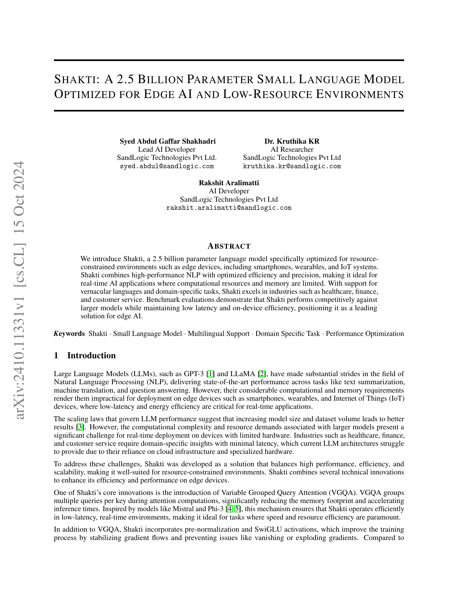
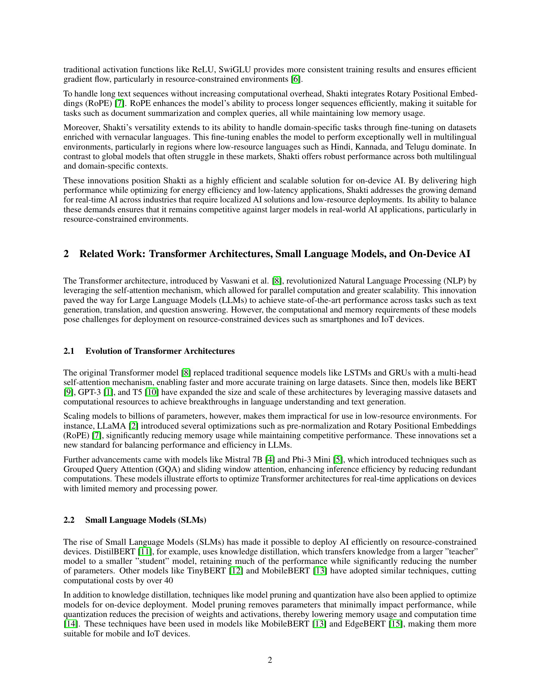
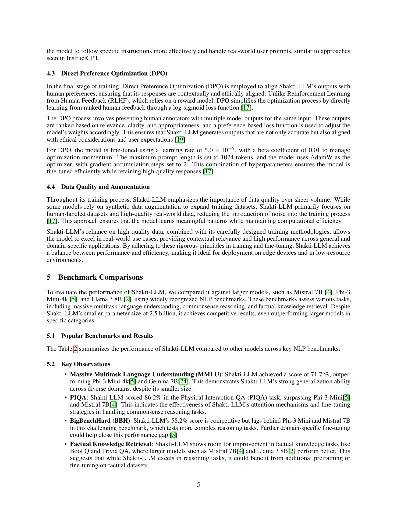
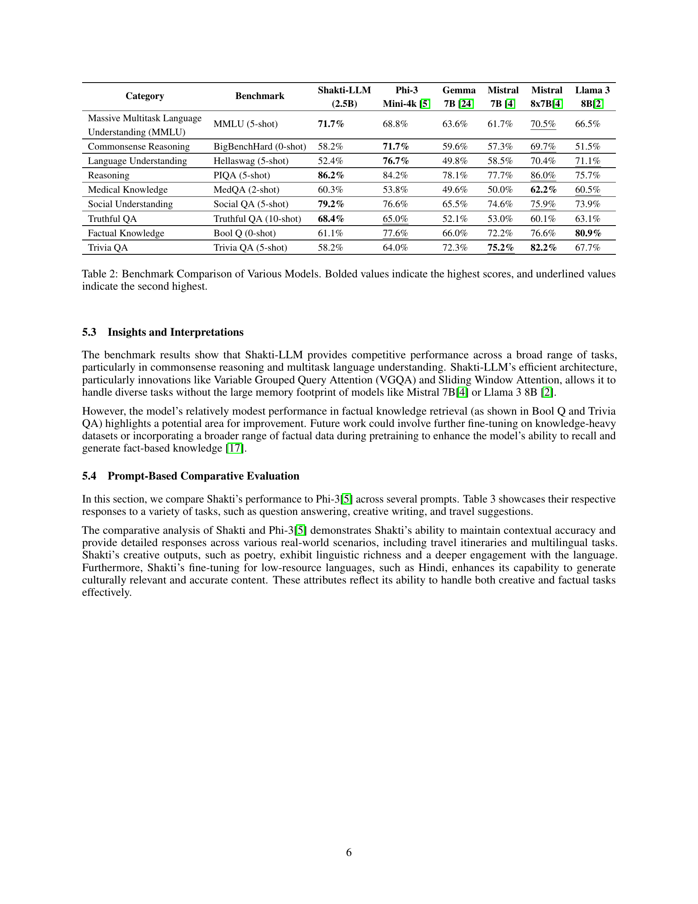
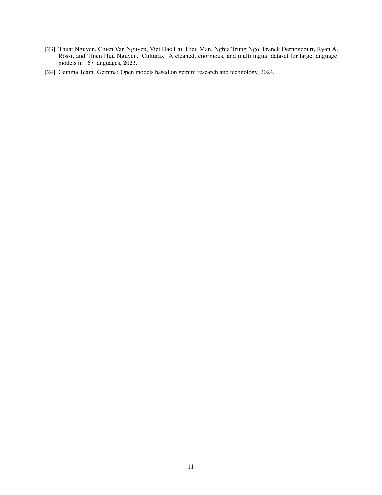

### TL;DR



Shakti is a new 2.5 billion parameter language model designed for use on devices with limited resources such as smartphones and IoT systems.  It's optimized for speed and efficiency, making it suitable for real-time applications where larger language models are impractical.  Key features include Variable Grouped Query Attention (VGQA) which reduces memory usage and speeds up processing, and SwiGLU activations to improve training.  Shakti also supports multiple languages and can be fine-tuned for specific tasks. Benchmark tests show it performs competitively against much larger models in various tests while maintaining low latency.  The researchers suggest several future directions, including multimodal integration and expanding its capabilities to address code generation and other tasks.  This model addresses the critical need for efficient AI solutions for edge computing and low-resource settings.




 &nbsp; read the paper on arXiv


#### Why does it matter?
Summarizing the research paper on Shakti, a 2.5 billion parameter small language model optimized for edge AI and low-resource environments.
#### Key Takeaways


 Shakti achieves competitive performance against larger models while maintaining low latency and on-device efficiency. 



 Shakti's novel VGQA, pre-normalization, and SwiGLU activations significantly improve training and inference efficiency. 



 Shakti excels in multilingual support and domain-specific tasks, addressing the needs of resource-constrained environments. 


------
#### Visual Insights


<table id='2' style='font-size:18px'><tr><td>Syed Abdul Gaffar Shakhadri</td><td>Dr. Kruthika KR</td></tr><tr><td>Lead AI Developer</td><td>AI Researcher</td></tr><tr><td>SandLogic Technologies Pvt Ltd.</td><td>SandLogic Technologies Pvt Ltd</td></tr><tr><td>syed. abdul @sandlogic · com</td><td>kruthika. kr@sandlogic · com</td></tr></table>

> Table 1 presents the specifications of the Shakti-LLM, including model parameters, dimensions, and hyperparameters.

### More visual insights

More on tables


<table id='0' style='font-size:18px'><tr><td>Features</td><td>Shakti-LLM Specification</td></tr><tr><td>Model Parameters</td><td>2.5 Billion</td></tr><tr><td>Layers</td><td>16</td></tr><tr><td>Model Dimension</td><td>4096</td></tr><tr><td>FFN Dimension</td><td>4096</td></tr><tr><td>Attention Heads</td><td>32</td></tr><tr><td>Key/Value Heads</td><td>8</td></tr><tr><td>Peak Learning Rate</td><td>3.6e-5</td></tr><tr><td>Activation Function</td><td>SwiGLU</td></tr><tr><td>Vocabulary Size</td><td>128256</td></tr><tr><td>Positional Embeddings</td><td>RoPE (0 = 500,000)</td></tr><tr><td>GPU Consumption (Raw)</td><td>9 GB</td></tr><tr><td>GPU Consumption (Quantized)</td><td>4 GB</td></tr></table>

> Table 1 provides a detailed specification of the Shakti-LLM model, outlining its key architectural features and resource requirements.


<table id='0' style='font-size:14px'><tr><td>Category</td><td>Benchmark</td><td>Shakti-LLM (2.5B)</td><td>Phi-3 Mini-4k 5</td><td>Gemma 7B 24</td><td>Mistral 7B 4</td><td>Mistral 8x7B 4</td><td>Llama 3 8B 2</td></tr><tr><td>Massive Multitask Language Understanding (MMLU)</td><td>MMLU (5-shot)</td><td>71.7%</td><td>68.8%</td><td>63.6%</td><td>61.7%</td><td>70.5%</td><td>66.5%</td></tr><tr><td>Commonsense Reasoning</td><td>BigBenchHard (0-shot)</td><td>58.2%</td><td>71.7%</td><td>59.6%</td><td>57.3%</td><td>69.7%</td><td>51.5%</td></tr><tr><td>Language Understanding</td><td>Hellaswag (5-shot)</td><td>52.4%</td><td>76.7%</td><td>49.8%</td><td>58.5%</td><td>70.4%</td><td>71.1%</td></tr><tr><td>Reasoning</td><td>PIQA (5-shot)</td><td>86.2 %</td><td>84.2%</td><td>78.1%</td><td>77.7%</td><td>86.0%</td><td>75.7%</td></tr><tr><td>Medical Knowledge</td><td>MedQA (2-shot)</td><td>60.3%</td><td>53.8%</td><td>49.6%</td><td>50.0%</td><td>62.2%</td><td>60.5%</td></tr><tr><td>Social Understanding</td><td>Social QA (5-shot)</td><td>79.2%</td><td>76.6%</td><td>65.5%</td><td>74.6%</td><td>75.9%</td><td>73.9%</td></tr><tr><td>Truthful QA</td><td>Truthful QA (10-shot)</td><td>68.4%</td><td>65.0%</td><td>52.1%</td><td>53.0%</td><td>60.1%</td><td>63.1%</td></tr><tr><td>Factual Knowledge</td><td>Bool Q (0-shot)</td><td>61.1%</td><td>77.6%</td><td>66.0%</td><td>72.2%</td><td>76.6%</td><td>80.9%</td></tr><tr><td>Trivia QA</td><td>Trivia QA (5-shot)</td><td>58.2%</td><td>64.0%</td><td>72.3%</td><td>75.2%</td><td>82.2%</td><td>67.7%</td></tr></table>

> Table 2 summarizes the performance of Shakti-LLM compared to other models across key NLP benchmarks.


<table id='0' style='font-size:14px'><tr><td>Prompt</td><td>Shakti Response</td><td>Phi-3[5] Response</td></tr><tr><td>1. What word is used to classify a group or family of related living organisms? Two examples being Clytostoma from tropical America and Syneilesis from East Asia.</td><td>The word used to classify a group or family of related living organisms is "genus." Two examples mentioned are Clytostoma from tropical America and Syneilesis from East Asia.</td><td>The word used to classify a group or family of related living organisms is "genus." In the given examples, Clytostoma and Syneilesis are both genera of plants. Clytostoma is a genus of woody-stemmed vines from tropical America, while Syneilesis is a genus of East Asian plants.</td></tr><tr><td>2. Write a short poem that is hard to sing.</td><td>"In silken threads of twilight's hue / A thousand midnights confluence anew / Echoes of forgotten melodies / Whisper secrets to the wind's sighs / Moonlit shadows writhe and twist / To claim the silence as their own / As the stars conspire to atone / For moments left untold"</td><td>"In twilight's realm, where shadows dwell /A labyrinth of whispers none can tell / Thoughts tangle, rhythms burn / Melodies that twist and turn / Verses hard to sing, yet yearn."</td></tr><tr><td>3. What are some must-do activities in Houston, TX area with 11-year-old kids?</td><td>Highlights include Space Center Houston, Houston Zoo, Museum of Natural Science, Kemah Boardwalk, and Moody Gardens. Other options are Buffalo Bayou Park and the Houston Arboretum for outdoor fun.</td><td>Top recommendations include Space Center Houston, Houston Zoo, Kemah Boardwalk, Buffalo Bayou Park, and Discovery Green. It also suggests visiting The Children's Museum of Houston and the Houston Arboretum.</td></tr><tr><td>4. Write a title for a paper where each letter starts with "P" on a very small language model that is more powerful than bigger ones.</td><td>Pioneering Precise Predictions: Proving Phenomenal Performance in Puny yet Powerful Processing</td><td>Pioneering Performance: Proving Power of Petite Preeminent Language Models</td></tr><tr><td>5. Suggest an itinerary for a 3-day trip during the 2026 Winter Olympic Games.</td><td>Day 1: Explore Milan, visiting the Duomo di Milano, Galleria Vittorio Emanuele II, and Castello Sforzesco. Day 2: Travel to Cortina d'Ampezzo, visiting the Olympic Museum and Mount Faloria. Day 3: Attend an Olympic event and explore the Olympic Village in Milan.</td><td>Day 1: Visit the Olympic Park Milano and attend an ice hockey game. Day 2: Travel to Cortina d' Ampezzo, watch alpine skiing events, and explore the Olympic Museum. Day 3: Day trip to Lake Garda, enjoy scenic views, and return to Cortina.</td></tr><tr><td>6. Write a poem about water (Hindi).</td><td>qrfi す ��� / 地 Any 급 agr 층 / PIM AR of / thou す will tykr 중 / 항공제 Sp2f, 地 salvid</td><td>urt す MR 201, thip 时 er / Plift す ����, clot chart dc / Warl す glue,unin 司 2층 / 코리 Hart Mc2, flat 时 ippyk</td></tr><tr><td>7. Share a riddle and answer in Hindi. Shakti</td><td>ucell: " IN be 地 커피 usi tlur, Mill 급 mudi �� tirri ず Cla: 당신의 (kivid Aibl viravia 时 ther 言, 여행에 Airan A'bl 时 uct ipplur)| Table Comparative and Phi-3</td><td>hell: "## pill⌀ 에 ��� Ad clu 希望 Cデマ: PE AR elimi (kilith 국 all 에너머 급 등록 gld 콩)| 3: of</td></tr></table>

> Table 3 compares the performance of different quantized language models across various hardware platforms, showing inference speeds in tokens per second for GPU, CPU, and Mac systems.


 <table id='2' style='font-size:22px'><tr><td>Model</td><td>Quantized Type</td><td>Model Size</td><td>GPU (tokens/sec)</td><td>CPU (tokens/sec)</td><td>Mac (tokens/sec)</td></tr><tr><td>Shakti Q4_KM</td><td>Q4_KM</td><td>1.5 GB</td><td>331.09</td><td>18.93</td><td>128</td></tr><tr><td>Shakti Q5 _KM</td><td>Q5 _KM</td><td>1.71 GB</td><td>305.89</td><td>15.90</td><td>110</td></tr><tr><td>Phi-3.1-mini-4k-instruct Q5 _KM 5</td><td>Q5 KM</td><td>2.82 GB</td><td>163.17</td><td>8.44</td><td>74</td></tr><tr><td>Phi-3.1-mini-4k-instruct Q4 KM 5</td><td>Q4 KM</td><td>2.39 GB</td><td>180.4</td><td>10.72</td><td>88.21</td></tr></table>

> Table 3 presents a performance comparison of different quantized language models across various hardware platforms, showing model names, quantization types, sizes, and inference speeds.


<table id='0' style='font-size:18px'><tr><td></td><td>Tom Henighan, Rewon Child, Aditya Ramesh, Daniel M. Ziegler, Jeffrey Wu, Clemens Winter, Christopher Hesse, Mark Chen, Eric Sigler, Mateusz Litwin, Scott Gray, Benjamin Chess, Jack Clark, Christopher Berner, Sam McCandlish, Alec Radford, Ilya Sutskever, and Dario Amodei. Language models are few-shot learners, 2020.</td></tr><tr><td>[2]</td><td>Hugo Touvron, Thibaut Lavril, Gautier Izacard, Xavier Martinet, Marie-Anne Lachaux, Timothee Lacroix, Baptiste Roziere, Naman Goyal, Eric Hambro, Faisal Azhar, Aurelien Rodriguez, Armand Joulin, Edouard Grave, and Guillaume Lample. Llama: Open and efficient foundation language models, 2023.</td></tr><tr><td>[3]</td><td>Jordan Hoffmann, Sebastian Borgeaud, Arthur Mensch, Elena Buchatskaya, Trevor Cai, Eliza Rutherford, Diego de Las Casas, Lisa Anne Hendricks, Johannes Welbl, Aidan Clark, Tom Hennigan, Eric Noland, Katie Millican, George van den Driessche, Bogdan Damoc, Aurelia Guy, Simon Osindero, Karen Simonyan, Erich Elsen, Jack W. Rae, Oriol Vinyals, and Laurent Sifre. Training compute-optimal large language models, 2022.</td></tr><tr><td>[4]</td><td>Albert Q. Jiang, Alexandre Sablayrolles, Arthur Mensch, Chris Bamford, Devendra Singh Chaplot, Diego de las Casas, Florian Bressand, Gianna Lengyel, Guillaume Lample, Lucile Saulnier, Lelio Renard Lavaud, Marie-Anne Lachaux, Pierre Stock, Teven Le Scao, Thibaut Lavril, Thomas Wang, Timothee Lacroix, and William El Sayed. Mistral 7b, 2023.</td></tr><tr><td>[5]</td><td>Marah Abdin, Jyoti Aneja, Hany Awadalla, and Ahmed Awadallah. Phi-3 technical report: A highly capable language model locally on your phone, 2024.</td></tr><tr><td>[6]</td><td>Noam Shazeer. Glu variants improve transformer, 2020.</td></tr><tr><td>[7]</td><td>Jianlin Su, Yu Lu, Shengfeng Pan, Ahmed Murtadha, Bo Wen, and Yunfeng Liu. Roformer: Enhanced transformer with rotary position embedding, 2023.</td></tr><tr><td>[8]</td><td>Ashish Vaswani, Noam Shazeer, Niki Parmar, Jakob Uszkoreit, Llion Jones, Aidan N. Gomez, Lukasz Kaiser, and Illia Polosukhin. Attention is all you need, 2023.</td></tr><tr><td>[9]</td><td>Jacob Devlin, Ming-Wei Chang, Kenton Lee, and Kristina Toutanova. Bert: Pre-training of deep bidirectional transformers for language understanding, 2019.</td></tr><tr><td>[10]</td><td>Colin Raffel, Noam Shazeer, Adam Roberts, Katherine Lee, Sharan Narang, Michael Matena, Yanqi Zhou, Wei Li, and Peter J. Liu. Exploring the limits of transfer learning with a unified text-to-text transformer, 2023.</td></tr><tr><td>[11]</td><td>Victor Sanh, Lysandre Debut, Julien Chaumond, and Thomas Wolf. Distilbert, a distilled version of bert: smaller, faster, cheaper and lighter, 2020.</td></tr><tr><td>[12]</td><td>Xiaoqi Jiao, Yichun Yin, Lifeng Shang, Xin Jiang, Xiao Chen, Linlin Li, Fang Wang, and Qun Liu. Tinybert: Distilling bert for natural language understanding, 2020.</td></tr><tr><td>[13]</td><td>Zhiqing Sun, Hongkun Yu, Xiaodan Song, Renjie Liu, Yiming Yang, and Denny Zhou. Mobilebert: a compact task-agnostic bert for resource-limited devices, 2020.</td></tr><tr><td>[14]</td><td>Song Han, Huizi Mao, and William J. Dally. Deep compression: Compressing deep neural networks with pruning, trained quantization and huffman coding, 2016.</td></tr><tr><td>[15]</td><td>Thierry Tambe, Coleman Hooper, Lillian Pentecost, Tianyu Jia, En-Yu Yang, Marco Donato, Victor Sanh, Paul N. Whatmough, Alexander M. Rush, David Brooks, and Gu- Yeon Wei. Edgebert: Sentence-level energy optimizations for latency-aware multi-task nlp inference, 2021.</td></tr><tr><td>[16]</td><td>Leon Bergen, Timothy J. O'Donnell, and Dzmitry Bahdanau. Systematic generalization with edge transformers, 2021.</td></tr><tr><td>[17]</td><td>Rafael Rafailov, Archit Sharma, Eric Mitchell, Stefano Ermon, Christopher D. Manning, and Chelsea Finn. Direct preference optimization: Your language model is secretly a reward model, 2024.</td></tr><tr><td>[18]</td><td>Leandro von Werra Rasul, Younes Belkada. Fine-tune llama 2 with dpo. https : //huggingface.co/blog/ dpo-trl 2023. Accessed: 2024-09-26.</td></tr><tr><td>[19]</td><td>Long Ouyang, Jeff Wu, Xu Jiang, Diogo Almeida, Carroll L. Wainwright, Pamela Mishkin, Chong Zhang, Sandhini Agarwal, Katarina Slama, Alex Ray, John Schulman, Jacob Hilton, Fraser Kelton, Luke Miller, Maddie Simens, Amanda Askell, Peter Welinder, Paul Christiano, Jan Leike, and Ryan Lowe. Training language models to follow instructions with human feedback, 2022.</td></tr><tr><td>[20]</td><td>Guillaume Wenzek, Marie-Anne Lachaux, Alexis Conneau, Vishrav Chaudhary, Francisco Guzman, Armand Joulin, and Edouard Grave. Ccnet: Extracting high quality monolingual datasets from web crawl data, 2019.</td></tr><tr><td>[21]</td><td>Wikimedia Foundation. Wikimedia downloads.</td></tr><tr><td>[22]</td><td>Mohammed Safi Ur Rahman Khan, Priyam Mehta, Ananth Sankar, Umashankar Kumaravelan, Sumanth Dod- dapaneni, Suriyaprasaad G, Varun Balan G, Sparsh Jain, Anoop Kunchukuttan, Pratyush Kumar, Raj Dabre, and Mitesh M. Khapra. Indicllmsuite: A blueprint for creating pre-training and fine-tuning datasets for indian languages, 2024.</td></tr></table>

> Table 3 compares the performance of different quantized language models across various hardware platforms, showing their inference speeds in tokens per second.

### Full paper



