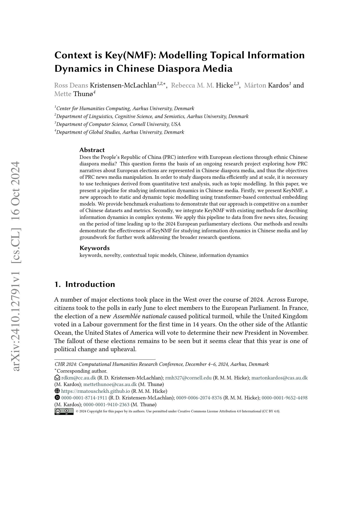
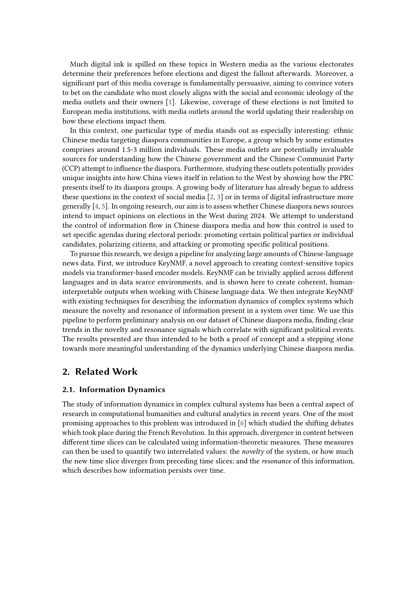
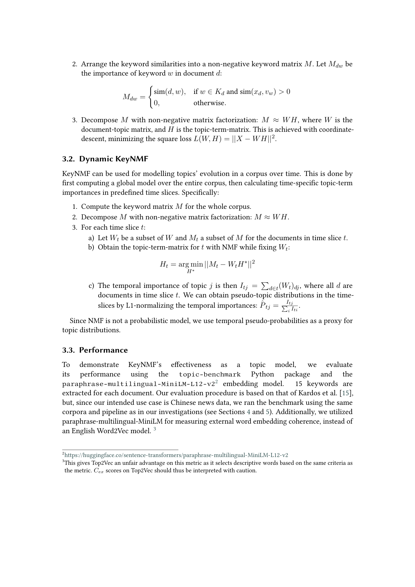
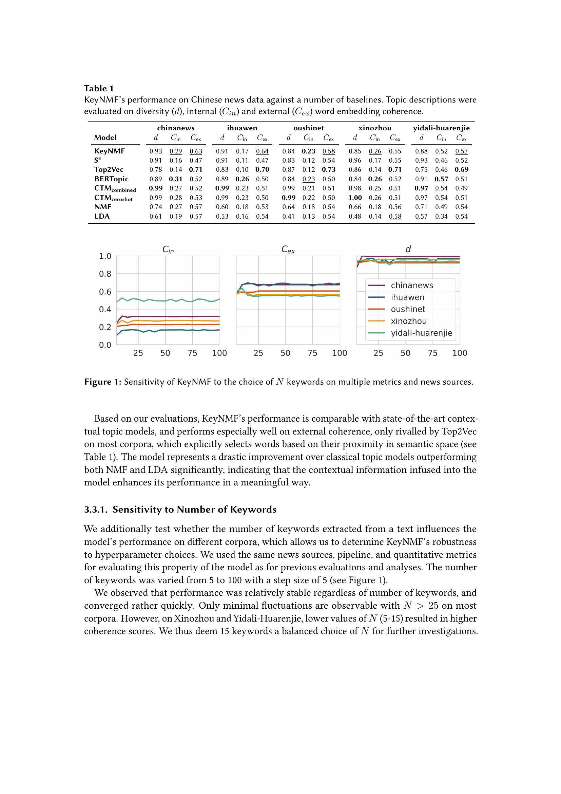
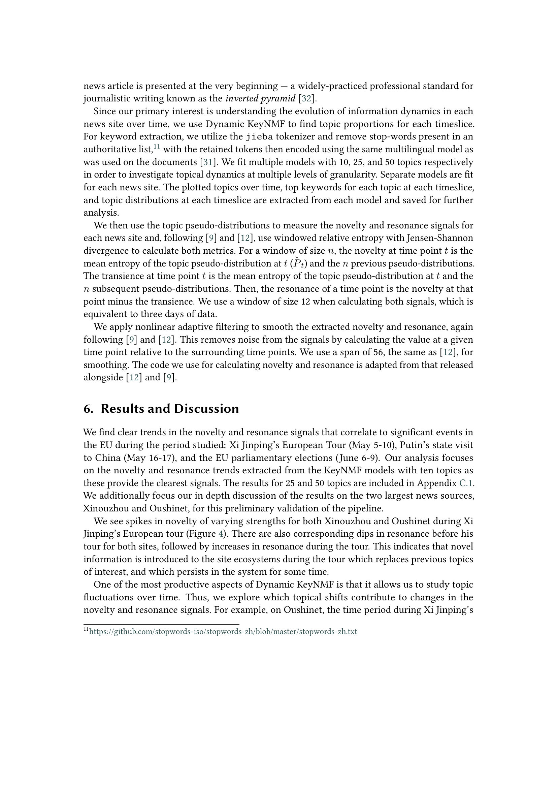
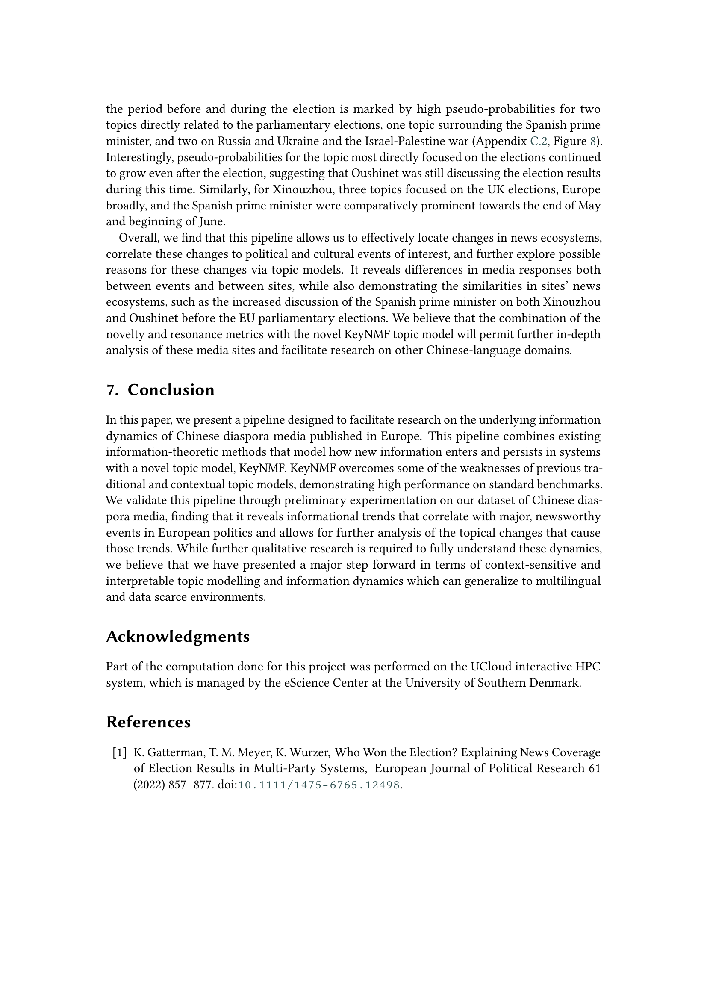
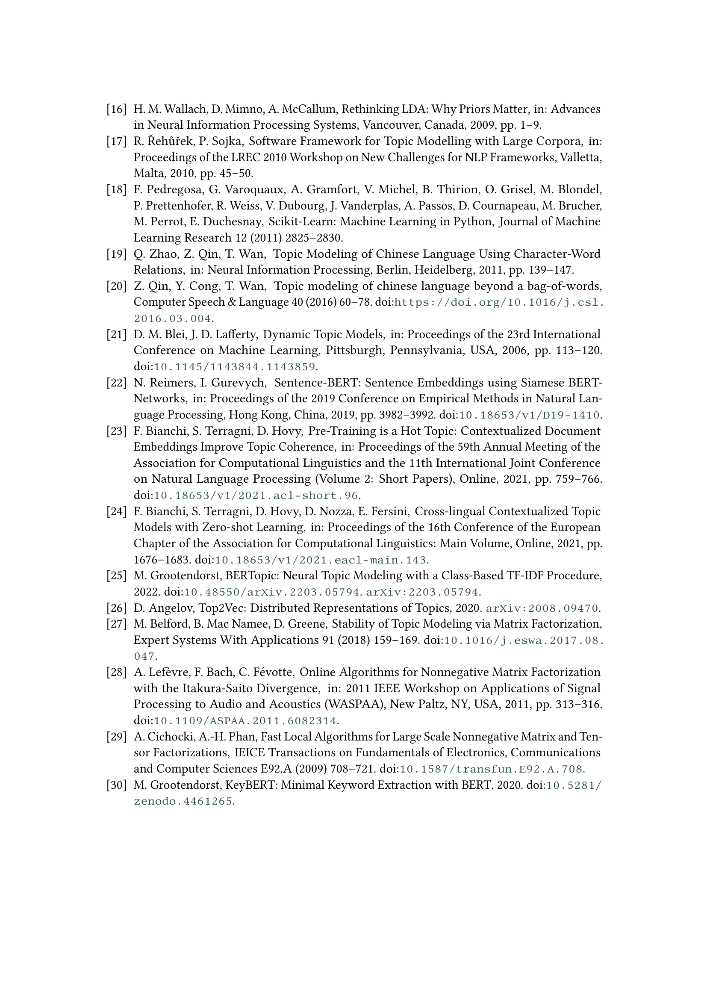
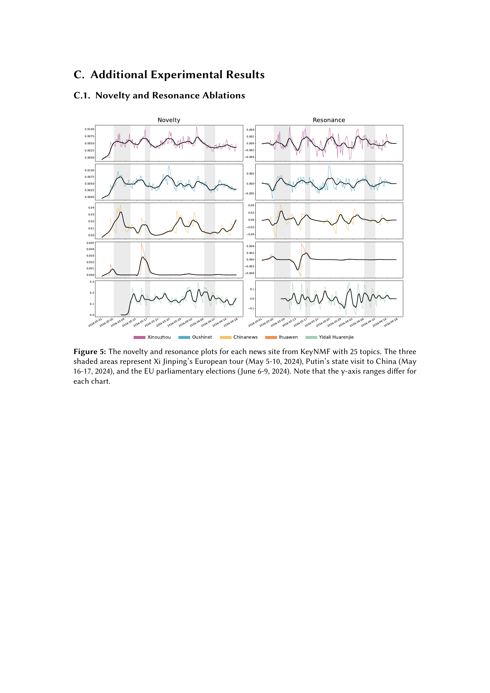
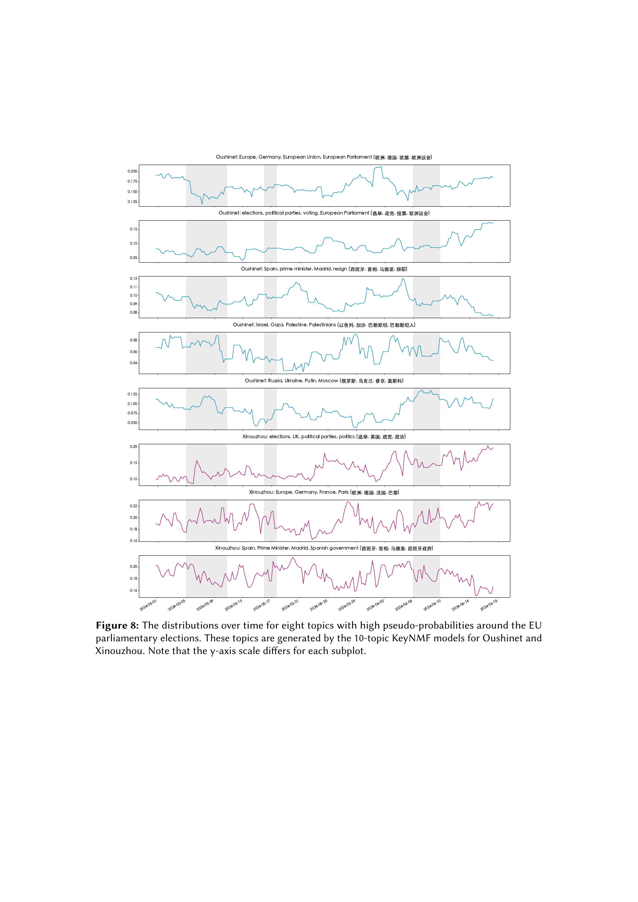

### TL;DR



This research introduces KeyNMF, a novel approach to topic modeling that leverages transformer-based contextual embeddings for improved accuracy and interpretability, particularly in multilingual and data-scarce environments.  It's benchmarked against other methods on Chinese datasets, demonstrating competitive performance.  The researchers then integrate KeyNMF into a pipeline for analyzing information dynamics, specifically focusing on novelty and resonance (how new and persistent information is within a system). This pipeline is applied to five Chinese news sites in the lead-up to the 2024 European parliamentary elections. The results reveal clear correlations between information dynamics and significant political events, such as the Xi Jinping's European tour and the EU parliamentary elections. The study highlights the effectiveness of KeyNMF for understanding information flows in complex media systems and lays groundwork for further research into media manipulation and political influence. The researchers released their implementation of KeyNMF as part of the Turftopic Python package, making their work reproducible and accessible to other researchers.  The findings contribute to understanding political communication in Chinese diaspora media and the impact of global events.




 &nbsp; read the paper on arXiv


#### Why does it matter?
To provide a concise and informative summary of the research paper on modelling topical information dynamics in Chinese diaspora media using KeyNMF.
#### Key Takeaways


 KeyNMF effectively models topic dynamics in multilingual datasets, outperforming traditional methods. 



 Analysis of Chinese diaspora media revealed clear trends correlating information novelty and resonance with major political events. 



 The developed pipeline provides a valuable tool for researching information dynamics in complex cultural systems. 


------
#### Visual Insights

> Figure 3 shows the number of new articles collected at each time point for five different Chinese diaspora news websites.

> The chart displays the sensitivity of KeyNMF's performance to the number of keywords used across multiple metrics and news sources.


 <table id='2' style='font-size:14px'><tr><td></td><td colspan="3">chinanews</td><td colspan="3">ihuawen</td><td colspan="3">oushinet</td><td colspan="3">xinozhou</td><td colspan="3">yidali-huarenjie</td></tr><tr><td>Model</td><td>d</td><td>Cin</td><td>Cex</td><td>d</td><td>Cin</td><td>Cex</td><td>d</td><td>Cin</td><td>Cex</td><td>d</td><td>Cin</td><td>Cex</td><td>d</td><td>Cin</td><td>Cex</td></tr><tr><td>KeyNMF</td><td>0.93</td><td>0.29</td><td>0.63</td><td>0.91</td><td>0.17</td><td>0.64</td><td>0.84</td><td>0.23</td><td>0.58</td><td>0.85</td><td>0.26</td><td>0.55</td><td>0.88</td><td>0.52</td><td>0.57</td></tr><tr><td>S3</td><td>0.91</td><td>0.16</td><td>0.47</td><td>0.91</td><td>0.11</td><td>0.47</td><td>0.83</td><td>0.12</td><td>0.54</td><td>0.96</td><td>0.17</td><td>0.55</td><td>0.93</td><td>0.46</td><td>0.52</td></tr><tr><td>Top2Vec</td><td>0.78</td><td>0.14</td><td>0.71</td><td>0.83</td><td>0.10</td><td>0.70</td><td>0.87</td><td>0.12</td><td>0.73</td><td>0.86</td><td>0.14</td><td>0.71</td><td>0.75</td><td>0.46</td><td>0.69</td></tr><tr><td>BERTopic</td><td>0.89</td><td>0.31</td><td>0.52</td><td>0.89</td><td>0.26</td><td>0.50</td><td>0.84</td><td>0.23</td><td>0.50</td><td>0.84</td><td>0.26</td><td>0.52</td><td>0.91</td><td>0.57</td><td>0.51</td></tr><tr><td>CTMcombined</td><td>0.99</td><td>0.27</td><td>0.52</td><td>0.99</td><td>0.23</td><td>0.51</td><td>0.99</td><td>0.21</td><td>0.51</td><td>0.98</td><td>0.25</td><td>0.51</td><td>0.97</td><td>0.54</td><td>0.49</td></tr><tr><td>CTMzeroshot</td><td>0.99</td><td>0.28</td><td>0.53</td><td>0.99</td><td>0.23</td><td>0.50</td><td>0.99</td><td>0.22</td><td>0.50</td><td>1.00</td><td>0.26</td><td>0.51</td><td>0.97</td><td>0.54</td><td>0.51</td></tr><tr><td>NMF</td><td>0.74</td><td>0.27</td><td>0.57</td><td>0.60</td><td>0.18</td><td>0.53</td><td>0.64</td><td>0.18</td><td>0.54</td><td>0.66</td><td>0.18</td><td>0.56</td><td>0.71</td><td>0.49</td><td>0.54</td></tr><tr><td>LDA</td><td>0.61</td><td>0.19</td><td>0.57</td><td>0.53</td><td>0.16</td><td>0.54</td><td>0.41</td><td>0.13</td><td>0.54</td><td>0.48</td><td>0.14</td><td>0.58</td><td>0.57</td><td>0.34</td><td>0.54</td></tr></table>

> Table 1 presents KeyNMF's performance against other topic modeling baselines, evaluated across multiple metrics on various Chinese news datasets.

### More visual insights

More on figures

> Figure 7 shows the change in topic distributions over time for two topics in Oushinet news before Putin's visit to China, highlighting the shift in focus.

> The figure shows the pseudo-probability distributions over time for five topics with high pseudo-probabilities during Xi Jinping's European tour, generated by the 10-topic KeyNMF models for Oushinet and Xinouzhou.

### Full paper



