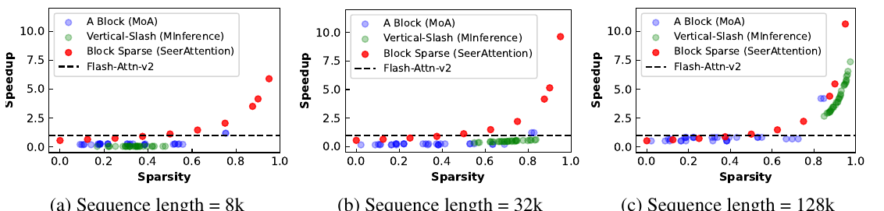
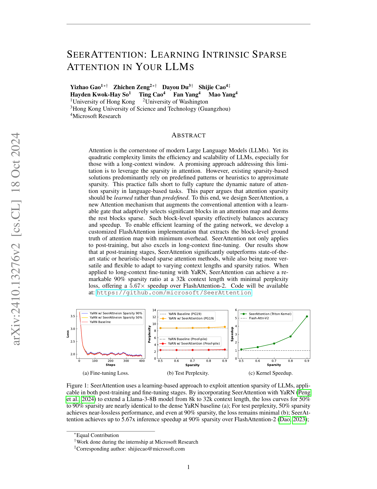
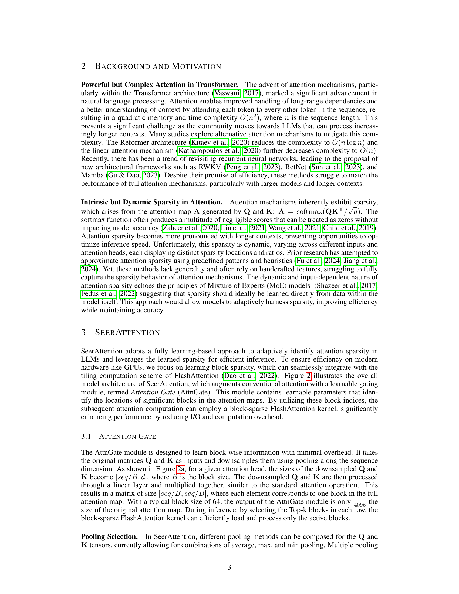
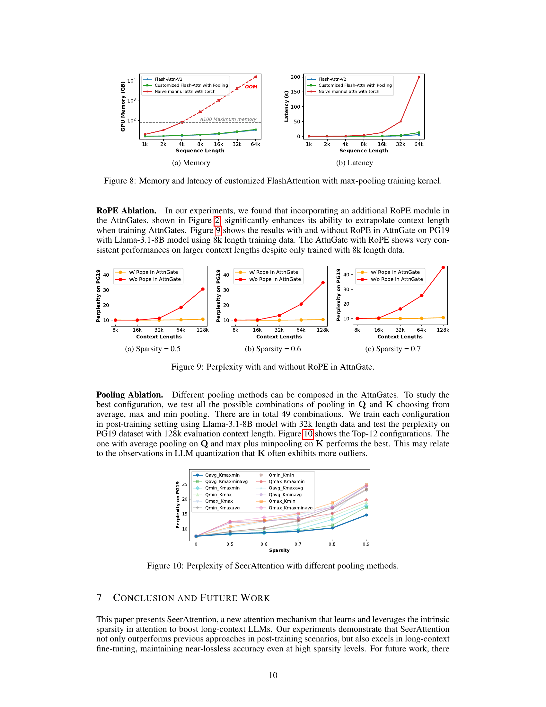
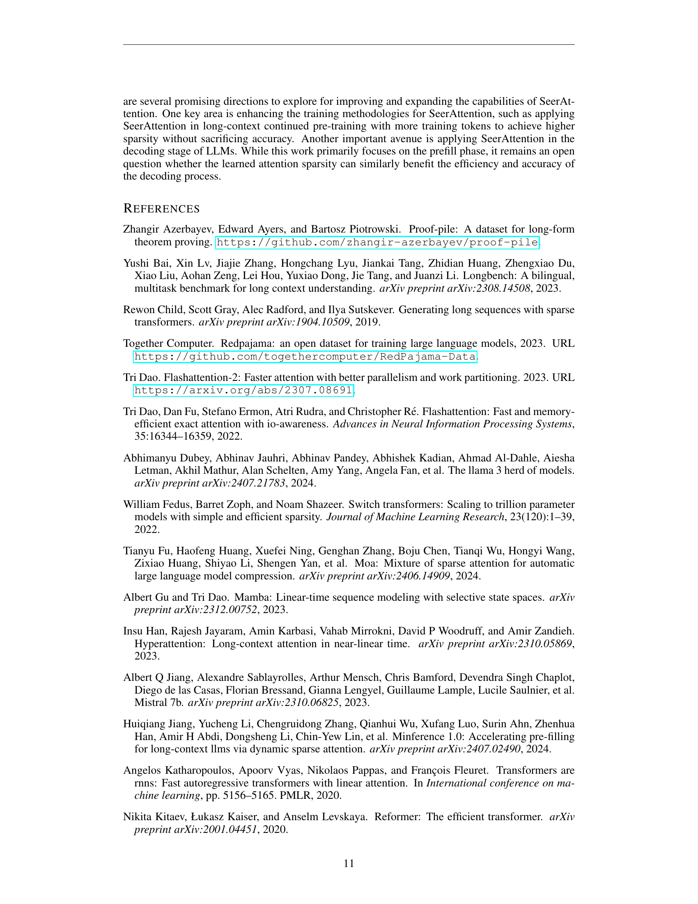
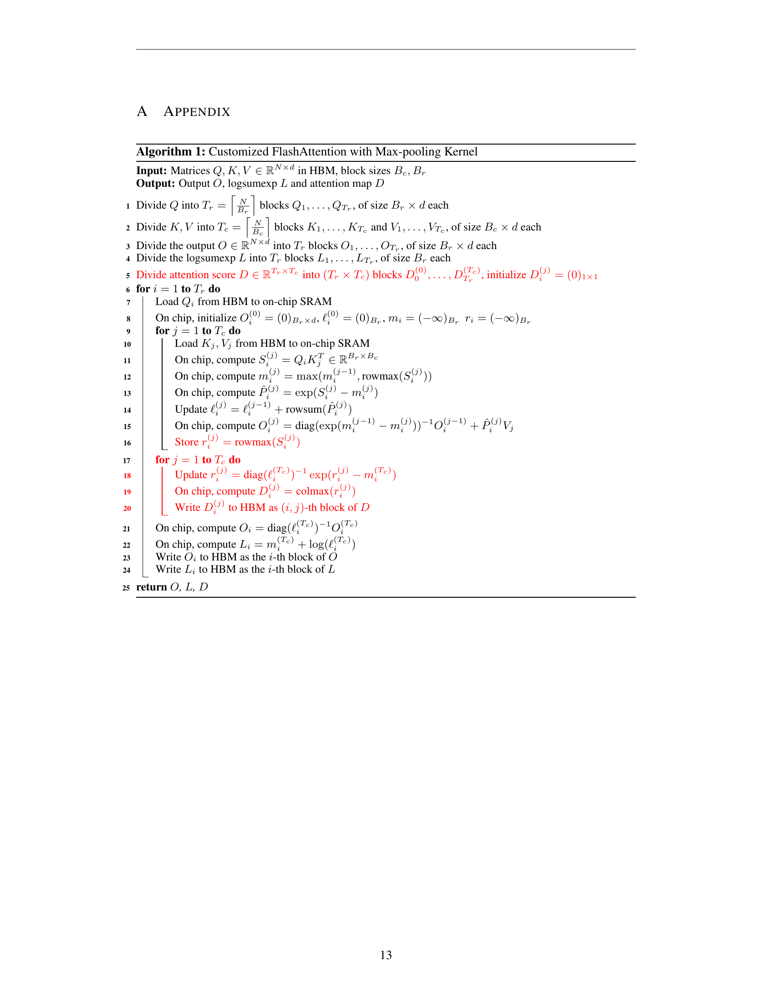

### TL;DR



Large Language Models (LLMs) heavily rely on attention mechanisms, but their quadratic complexity limits efficiency, especially with long contexts.  This paper introduces SeerAttention, a novel attention mechanism that addresses this limitation by learning the inherent sparsity within attention maps. Unlike previous methods that use predefined patterns or heuristics, SeerAttention uses a learnable gate to dynamically select significant blocks in the attention map, treating the rest as sparse.  This block-level sparsity effectively balances accuracy and speed. To facilitate efficient training, the authors developed a customized FlashAttention implementation that extracts the block-level ground truth with minimal overhead.  Experiments demonstrate SeerAttention's superiority over existing sparse attention methods in both post-training and long-context fine-tuning settings, achieving remarkable speedups (up to 5.67x) with minimal perplexity increase even at high sparsity ratios (90%).  The learned sparsity patterns were also found to be diverse and adaptive, showcasing the method's versatility and robustness.




 &nbsp; read the paper on arXiv


#### Why does it matter?
Summarizing the academic paper on SeerAttention: Learning Intrinsic Sparse Attention in Your LLMs.
#### Key Takeaways


 SeerAttention learns attention sparsity instead of relying on predefined patterns, resulting in improved accuracy and speed. 



 A customized FlashAttention implementation efficiently extracts block-level attention sparsity for effective training. 



 SeerAttention shows significant performance gains in both post-training and long-context fine-tuning scenarios. 


------
#### Visual Insights

 to extend a Llama-3-8B model from 8k to 32k context length, the loss curves for 50% to 90% sparsity are nearly identical to the dense YaRN baseline (a); For test perplexity, 50% sparsity achieves near-lossless performance, and even at 90% sparsity, the loss remains minimal (b); SeerAttention achieves up to 5.67x inference speedup at 90% sparsity over FlashAttention-2 (Dao, 2023);")

> Figure 1 shows the results of applying SeerAttention to extend the context length of a language model, demonstrating near-lossless performance with high sparsity and significant speedup.

 to extend a Llama-3-8B model from 8k to 32k context length, the loss curves for 50% to 90% sparsity are nearly identical to the dense YaRN baseline (a); For test perplexity, 50% sparsity achieves near-lossless performance, and even at 90% sparsity, the loss remains minimal (b); SeerAttention achieves up to 5.67x inference speedup at 90% sparsity over FlashAttention-2 (Dao, 2023);")

> The chart shows the fine-tuning loss, test perplexity, and kernel speedup of SeerAttention with varying sparsity ratios, demonstrating its effectiveness in improving efficiency and maintaining accuracy in both post-training and fine-tuning scenarios.


<table id='2' style='font-size:14px'><tr><td rowspan="2"></td><td rowspan="2">Sparsity s</td><td rowspan="2">8k</td><td colspan="4">Evaluation Context Length</td></tr><tr><td>16k</td><td>32k</td><td>64k</td><td>128k</td></tr><tr><td>Original</td><td>0.0</td><td>10.03</td><td>9.88</td><td>9.92</td><td>9.97</td><td>10.03</td></tr><tr><td>MoA</td><td>0.35</td><td>10.07</td><td>9.97</td><td>10.02</td><td>10.13</td><td>OOM</td></tr><tr><td>MInference</td><td></td><td>10.12 s = 0.37</td><td>10.06 s = 0.55</td><td>10.24 s = 0.69</td><td>10.43 s = 0.80</td><td>10.89 s = 0.9</td></tr><tr><td rowspan="6">SeerAttention</td><td>0.4</td><td>10.06</td><td>9.92</td><td>9.96</td><td>10.10</td><td>10.29</td></tr><tr><td>0.5</td><td>10.08</td><td>9.94</td><td>9.99</td><td>10.15</td><td>10.38</td></tr><tr><td>0.6</td><td>10.12</td><td>9.96</td><td>10.04</td><td>10.21</td><td>10.50</td></tr><tr><td>0.7</td><td>10.18</td><td>10.01</td><td>10.10</td><td>10.29</td><td>10.71</td></tr><tr><td>0.8</td><td>10.30</td><td>10.07</td><td>10.18</td><td>10.39</td><td>11.18</td></tr><tr><td>0.9</td><td>10.75</td><td>10.24</td><td>10.30</td><td>10.56</td><td>13.20</td></tr></table>

> Table 1 compares the perplexity of SeerAttention at post-training with MoA and MInference, using the Llama-3.1-8B-Instruct model on the PG19 dataset, showing the impact of different sparsity levels on model performance.

### More visual insights

More on charts

> Figure 4 shows that SeerAttention only slightly increases perplexity as the sparsity ratio increases, compared to full attention, and longer context lengths allow for greater sparsity with minimal accuracy degradation.

> The chart shows the kernel-level latency breakdown of SeerAttention compared to FlashAttention-2 at various sequence lengths and sparsity ratios, demonstrating minimal overhead for AttnGate and Top-k operations and significant speedup with block-sparse attention.

> The chart displays the speedup of SeerAttention's block-sparse FlashAttention kernel compared to FlashAttention-2, MoA, and MInference across various sparsity ratios and sequence lengths.

 to extend a Llama-3-8B model from 8k to 32k context length, the loss curves for 50% to 90% sparsity are nearly identical to the dense YaRN baseline (a); For test perplexity, 50% sparsity achieves near-lossless performance, and even at 90% sparsity, the loss remains minimal (b); SeerAttention achieves up to 5.67x inference speedup at 90% sparsity over FlashAttention-2 (Dao, 2023);")

> The chart displays the fine-tuning loss, test perplexity, and kernel speedup of SeerAttention with YaRN at various sparsity levels, demonstrating its effectiveness in both post-training and fine-tuning stages.

> The chart compares the GPU memory usage and latency of three different FlashAttention implementations: the original FlashAttention-V2, a customized version with max-pooling for training, and a naive manual implementation using PyTorch, across varying sequence lengths.

> The chart displays the perplexity results on PG19 dataset for Llama-3.1-8B model with different context lengths and sparsity ratios, comparing the performance with and without RoPE (Rotary Position Embedding) in the AttnGate module.

> Figure 10 shows the perplexity of SeerAttention on the PG19 dataset with different combinations of pooling methods for Q and K at various sparsity levels.

More on tables


<table id='5' style='font-size:14px'><tr><td rowspan="2">Model</td><td rowspan="2">Attention</td><td rowspan="2">Sparsity s</td><td colspan="3">LongBench</td></tr><tr><td>0-4k</td><td>4-8k</td><td>8k+</td></tr><tr><td rowspan="7">Llama-3.1-8B-Instruct</td><td>Original</td><td>0.0</td><td>55.32</td><td>53.98</td><td>52.90</td></tr><tr><td>MoA</td><td>0.35</td><td>50.74</td><td>49.84</td><td>51.89</td></tr><tr><td rowspan="2">MInference</td><td rowspan="2"></td><td>55.23</td><td>53.87</td><td>52.18</td></tr><tr><td>s = 0.06</td><td>s = 0.25</td><td>s = 0.45</td></tr><tr><td rowspan="3">SeerAttention</td><td>0.1</td><td>55.91</td><td>54.32</td><td>53.28</td></tr><tr><td>0.25</td><td>55.00</td><td>54.09</td><td>52.22</td></tr><tr><td>0.5</td><td>52.40</td><td>52.85</td><td>52.43</td></tr></table>

> Table 2 compares the accuracy of SeerAttention against MoA and MInference on the LongBench benchmark at various sparsity levels.


<table id='1' style='font-size:16px'><tr><td rowspan="2">Sparsity</td><td>YaRN</td><td colspan="5">Post-training SeerAttention after YaRN</td><td colspan="5">YaRN with SeerAttention</td></tr><tr><td>0.0</td><td>0.5</td><td>0.6</td><td>0.7</td><td>0.8</td><td>0.9</td><td>0.5</td><td>0.6</td><td>0.7</td><td>0.8</td><td>0.9</td></tr><tr><td>PG19</td><td>8.79</td><td>9.16</td><td>9.30</td><td>9.48</td><td>9.73</td><td>10.18</td><td>8.81</td><td>8.82</td><td>8.85</td><td>8.93</td><td>9.16</td></tr><tr><td>Proof-pile</td><td>2.46</td><td>2.53</td><td>2.57</td><td>2.61</td><td>2.68</td><td>2.85</td><td>2.47</td><td>2.47</td><td>2.48</td><td>2.51</td><td>2.60</td></tr></table>

> Table 3 presents the perplexity scores on the PG19 and ProofPile datasets for three different model setups: YaRN baseline, SeerAttention applied after YaRN, and YaRN integrated with SeerAttention, each evaluated at various sparsity ratios (0.0, 0.5, 0.6, 0.7, 0.8, 0.9).


<table id='3' style='font-size:16px'><tr><td rowspan="2">Latency (Sparsity)</td><td colspan="5">Evaluation Context Length</td></tr><tr><td>8k</td><td>16k</td><td>32k</td><td>64k</td><td>128k</td></tr><tr><td>FlashAttn-2</td><td>0.90 (0)</td><td>1.95 (0)</td><td>4.63 (0)</td><td>10.09 (0)</td><td>35.54 (0)</td></tr><tr><td>MoA</td><td>1.29 (0.35)</td><td>3.44 (0.35)</td><td>10.34 (0.35)</td><td>36.34 (0.35)</td><td>OOM</td></tr><tr><td>MInference</td><td>2.33 (0.37)</td><td>3.10 (0.65)</td><td>4.68 (0.77)</td><td>8.21 (0.86)</td><td>14.38 (0.95)</td></tr><tr><td>SeerAttention</td><td>0.78 (0.50)</td><td>1.65 (0.60)</td><td>3.60 (0.70)</td><td>7.69 (0.80)</td><td>13.37 (0.95)</td></tr></table>

> The table compares the time to first token (TTFT) latency in seconds of SeerAttention against FlashAttention-2, MoA, and MInference across different context lengths and sparsity ratios.

### Full paper



