### TL;DR



Current text-to-image models struggle with precise control over visual concepts. This paper introduces "component-controllable personalization," a new task aiming to modify specific parts (components) of a concept during personalization.  This is challenging due to "semantic pollution" (unwanted elements corrupting the concept) and "semantic imbalance" (uneven learning of concept and component). To tackle this, the researchers propose MagicTailor, a framework with two key techniques: Dynamic Masked Degradation (DM-Deg) dynamically perturbs undesired elements, and Dual-Stream Balancing (DS-Bal) balances learning between the concept and component.  Experiments show MagicTailor significantly outperforms existing methods in this challenging task, generating images with both accurate concept representation and precise component control.  It also shows promise in various applications and collaborations with other generative tools.




 &nbsp; read the paper on arXiv


#### Why does it matter?
MagicTailor enhances text-to-image diffusion models by enabling component-controllable personalization, addressing challenges like semantic pollution and imbalance to achieve superior image generation.
#### Key Takeaways


 MagicTailor introduces component-controllable personalization for text-to-image diffusion models, allowing fine-grained control over visual concepts. 



 Dynamic Masked Degradation (DM-Deg) and Dual-Stream Balancing (DS-Bal) effectively address semantic pollution and imbalance, respectively. 



 MagicTailor achieves state-of-the-art performance and exhibits potential for various applications, including collaboration with other generative tools. 


------
#### Visual Insights

 Illustration of personalization, demonstrating how text-to-image (T2I) diffusion models can learn and reproduce a visual concept from given reference images. (b) Illustration of component-controllable personalization, depicting a newly formulated task that aims to modify a specific component of a visual concept during personalization. (c) Example images generated by MagicTailor, showcasing the effectiveness of the proposed MagicTailor, a novel framework that adapts T2I diffusion models for component-controllable personalization. For clarity, the red and blue circles are used to highlight the target concept and component, respectively.")

> The figure illustrates the concept of personalization and component-controllable personalization in text-to-image diffusion models, showing example images generated by the proposed MagicTailor framework.

. For reference, we also present the results of the second-best method in Table 1, highlighting our robustness on loss weights.")

> The chart displays the ablation study of loss weights (λpres and λattn) on two metrics: CLIP-T (text alignment) and DreamSim (identity fidelity), comparing MagicTailor's performance with the second-best method.


<table id='2' style='font-size:16px'><tr><td rowspan="2">Methods</td><td colspan="4">Automatic Metrics</td><td colspan="3">User Study</td></tr><tr><td>CLIP-T↑</td><td>CLIP-I ↑</td><td>DINO ↑</td><td>DreamSim ↓</td><td>Text Align. ↑</td><td>Id. Fidelity ↑</td><td>Gen. Quality ↑</td></tr><tr><td>Textual Inversion (Gal et al., 2022)</td><td>0.236</td><td>0.742</td><td>0.620</td><td>0.558</td><td>5.8%</td><td>2.5%</td><td>5.2%</td></tr><tr><td>DreamBooth (Ruiz et al., 2023)</td><td>0.266</td><td>0.841</td><td>0.798</td><td>0.323</td><td>15.3%</td><td>14.7%</td><td>12.5%</td></tr><tr><td>Custom Diffusion (Kumari et al., 2023)</td><td>0.251</td><td>0.797</td><td>0.750</td><td>0.407</td><td>7.1%</td><td>7.7%</td><td>9.8%</td></tr><tr><td>Break-A-Scene (Avrahami et al., 2023)</td><td>0.259</td><td>0.840</td><td>0.780</td><td>0.338</td><td>10.8%</td><td>12.1%</td><td>22.8%</td></tr><tr><td>CLiC (Safaee et al., 2024)</td><td>0.263</td><td>0.764</td><td>0.663</td><td>0.499</td><td>4.5%</td><td>5.1%</td><td>6.2%</td></tr><tr><td>MagicTailor (Ours)</td><td>0.270</td><td>0.854</td><td>0.813</td><td>0.279</td><td>56.5%</td><td>57.9%</td><td>43.4%</td></tr></table>

> Table 1 quantitatively compares MagicTailor's performance against state-of-the-art methods in personalization using automatic metrics and a user study.

### More visual insights

More on figures

 Semantic pollution: (i) Undesired visual elements may inadvertently disturb the personalized concept. (ii) A simple mask-out strategy is ineffective and causes unintended compositions, whereas (iii) our DM-Deg effectively suppresses unwanted visual semantics, preventing such pollution. (b) Semantic imbalance: (i) Simultaneously learning the concept and component can lead to imbalance, resulting in concept or component distortion (here we present a case for the former). (ii) Our DS-Bal ensures balanced learning, enhancing personalization performance.")

> Figure 2 illustrates the two main challenges in component-controllable personalization: semantic pollution and semantic imbalance, showcasing how the proposed DM-Deg and DS-Bal methods address these issues.

 Illustration of personalization, demonstrating how text-to-image (T2I) diffusion models can learn and reproduce a visual concept from given reference images. (b) Illustration of component-controllable personalization, depicting a newly formulated task that aims to modify a specific component of a visual concept during personalization. (c) Example images generated by MagicTailor, showcasing the effectiveness of the proposed MagicTailor, a novel framework that adapts T2I diffusion models for component-controllable personalization. For clarity, the red and blue circles are used to highlight the target concept and component, respectively.")

> Figure 1 illustrates personalization and component-controllable personalization tasks, and provides example images generated by the proposed MagicTailor framework.

 and Dual-Stream Balancing (DS-Bal, see Section 3.3), address the challenges of semantic pollution and semantic imbalance, respectively. For clarity, only one image per concept/component is presented and the warm-up stage is not depicted.")

> The figure illustrates the MagicTailor pipeline, which uses reference images to fine-tune a text-to-image diffusion model, incorporating DM-Deg and DS-Bal to address semantic pollution and imbalance.

 Illustration of personalization, demonstrating how text-to-image (T2I) diffusion models can learn and reproduce a visual concept from given reference images. (b) Illustration of component-controllable personalization, depicting a newly formulated task that aims to modify a specific component of a visual concept during personalization. (c) Example images generated by MagicTailor, showcasing the effectiveness of the proposed MagicTailor, a novel framework that adapts T2I diffusion models for component-controllable personalization. For clarity, the red and blue circles are used to highlight the target concept and component, respectively.")

> This figure illustrates the concept of personalization and component-controllable personalization in text-to-image diffusion models, along with example images generated by the proposed MagicTailor framework.

 Illustration of personalization, demonstrating how text-to-image (T2I) diffusion models can learn and reproduce a visual concept from given reference images. (b) Illustration of component-controllable personalization, depicting a newly formulated task that aims to modify a specific component of a visual concept during personalization. (c) Example images generated by MagicTailor, showcasing the effectiveness of the proposed MagicTailor, a novel framework that adapts T2I diffusion models for component-controllable personalization. For clarity, the red and blue circles are used to highlight the target concept and component, respectively.")

> Figure 1 illustrates personalization and component-controllable personalization in text-to-image diffusion models, showing how MagicTailor modifies a visual concept's specific component.

 The vanilla learning paradigm lapses into overemphasizing the easier one. (b) DS-Bal effectively balances the learning of the concept and component.")

> Figure 5 visualizes how the Dual-Stream Balancing (DS-Bal) method effectively balances the learning of visual semantics for both concept and component, resolving the semantic imbalance issue.

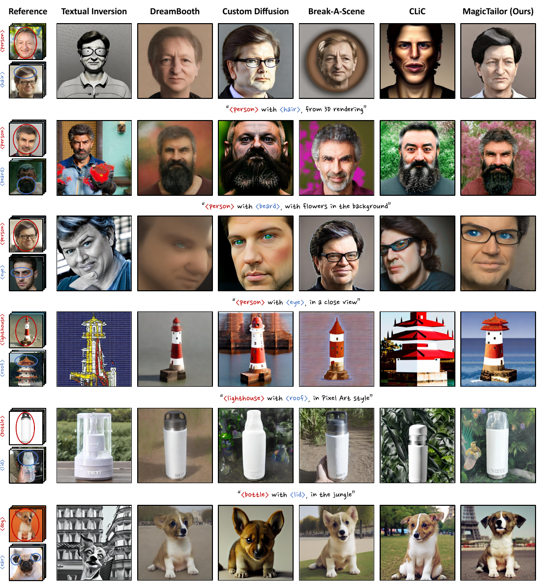

> Figure 6 shows a qualitative comparison of images generated by MagicTailor and other state-of-the-art methods across various domains, highlighting MagicTailor's superior performance in text alignment, identity preservation, and overall image quality.

 Illustration of personalization, demonstrating how text-to-image (T2I) diffusion models can learn and reproduce a visual concept from given reference images. (b) Illustration of component-controllable personalization, depicting a newly formulated task that aims to modify a specific component of a visual concept during personalization. (c) Example images generated by MagicTailor, showcasing the effectiveness of the proposed MagicTailor, a novel framework that adapts T2I diffusion models for component-controllable personalization. For clarity, the red and blue circles are used to highlight the target concept and component, respectively.")

> Figure 1 illustrates the concept of personalization in text-to-image diffusion models, showcasing how MagicTailor modifies a specific component of a visual concept during the process.

 Illustration of personalization, demonstrating how text-to-image (T2I) diffusion models can learn and reproduce a visual concept from given reference images. (b) Illustration of component-controllable personalization, depicting a newly formulated task that aims to modify a specific component of a visual concept during personalization. (c) Example images generated by MagicTailor, showcasing the effectiveness of the proposed MagicTailor, a novel framework that adapts T2I diffusion models for component-controllable personalization. For clarity, the red and blue circles are used to highlight the target concept and component, respectively.")

> The figure illustrates the task of personalization, component-controllable personalization, and example images generated by the proposed MagicTailor framework.

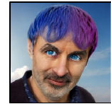

> Figure 6 shows a qualitative comparison of images generated by MagicTailor and other state-of-the-art methods across various domains, highlighting MagicTailor's superior text alignment, identity preservation, and image quality.

 and Dual-Stream Balancing (DS-Bal, see Section 3.3), address the challenges of semantic pollution and semantic imbalance, respectively. For clarity, only one image per concept/component is presented and the warm-up stage is not depicted.")

> The figure illustrates the pipeline of MagicTailor, a framework that adapts T2I diffusion models for component-controllable personalization, highlighting its key techniques: Dynamic Masked Degradation (DM-Deg) and Dual-Stream Balancing (DS-Bal).

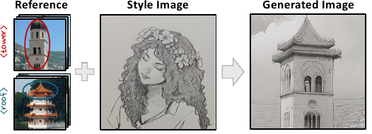

> The figure shows how MagicTailor can be integrated with other generative tools like ControlNet, CSGO, and InstantMesh to enhance their capabilities by adding component-controllable personalization.

 Illustration of personalization, demonstrating how text-to-image (T2I) diffusion models can learn and reproduce a visual concept from given reference images. (b) Illustration of component-controllable personalization, depicting a newly formulated task that aims to modify a specific component of a visual concept during personalization. (c) Example images generated by MagicTailor, showcasing the effectiveness of the proposed MagicTailor, a novel framework that adapts T2I diffusion models for component-controllable personalization. For clarity, the red and blue circles are used to highlight the target concept and component, respectively.")

> Figure 1 illustrates the concept of personalization and component-controllable personalization, showing how text-to-image diffusion models can learn and reproduce visual concepts, modify specific components, and generate example images using the proposed MagicTailor framework.

 Illustration of personalization, demonstrating how text-to-image (T2I) diffusion models can learn and reproduce a visual concept from given reference images. (b) Illustration of component-controllable personalization, depicting a newly formulated task that aims to modify a specific component of a visual concept during personalization. (c) Example images generated by MagicTailor, showcasing the effectiveness of the proposed MagicTailor, a novel framework that adapts T2I diffusion models for component-controllable personalization. For clarity, the red and blue circles are used to highlight the target concept and component, respectively.")

> Figure 1 illustrates the personalization and component-controllable personalization tasks, and shows example images generated by the proposed MagicTailor framework.

 Illustration of personalization, demonstrating how text-to-image (T2I) diffusion models can learn and reproduce a visual concept from given reference images. (b) Illustration of component-controllable personalization, depicting a newly formulated task that aims to modify a specific component of a visual concept during personalization. (c) Example images generated by MagicTailor, showcasing the effectiveness of the proposed MagicTailor, a novel framework that adapts T2I diffusion models for component-controllable personalization. For clarity, the red and blue circles are used to highlight the target concept and component, respectively.")

> Figure 1 illustrates personalization and component-controllable personalization, and provides example images generated by MagicTailor, highlighting the target concept and component.

 Decoupled generation. MagicTailor can also separately generate the target concept and component, enriching prospective combinations. (b) Controlling multiple components. MagicTailor shows the potential to handle more than one component, highlighting its effectiveness.")

> Figure 8 demonstrates MagicTailor's ability to generate concepts and components separately and to control multiple components simultaneously.

 Fixed intensity (ad = 0.5 here) could cause noisy generated images. (b) Our dynamic intensity helps to mitigate noise memorization.")

> The figure illustrates the benefit of using dynamic intensity in the DM-Deg process to mitigate noise memorization during image generation.

 Illustration of personalization, demonstrating how text-to-image (T2I) diffusion models can learn and reproduce a visual concept from given reference images. (b) Illustration of component-controllable personalization, depicting a newly formulated task that aims to modify a specific component of a visual concept during personalization. (c) Example images generated by MagicTailor, showcasing the effectiveness of the proposed MagicTailor, a novel framework that adapts T2I diffusion models for component-controllable personalization. For clarity, the red and blue circles are used to highlight the target concept and component, respectively.")

> The figure illustrates the concept of personalization and component-controllable personalization in text-to-image diffusion models, showing how MagicTailor modifies a specific component of a visual concept during personalization.

 Illustration of personalization, demonstrating how text-to-image (T2I) diffusion models can learn and reproduce a visual concept from given reference images. (b) Illustration of component-controllable personalization, depicting a newly formulated task that aims to modify a specific component of a visual concept during personalization. (c) Example images generated by MagicTailor, showcasing the effectiveness of the proposed MagicTailor, a novel framework that adapts T2I diffusion models for component-controllable personalization. For clarity, the red and blue circles are used to highlight the target concept and component, respectively.")

> Figure 1 illustrates personalization, component-controllable personalization, and example images generated by MagicTailor to showcase its effectiveness in adapting text-to-image diffusion models for component-controllable personalization.

 Illustration of personalization, demonstrating how text-to-image (T2I) diffusion models can learn and reproduce a visual concept from given reference images. (b) Illustration of component-controllable personalization, depicting a newly formulated task that aims to modify a specific component of a visual concept during personalization. (c) Example images generated by MagicTailor, showcasing the effectiveness of the proposed MagicTailor, a novel framework that adapts T2I diffusion models for component-controllable personalization. For clarity, the red and blue circles are used to highlight the target concept and component, respectively.")

> Figure 1 illustrates the concept of personalization in text-to-image diffusion models and introduces a new task, component-controllable personalization, showing examples of images generated by the proposed MagicTailor framework.

 Illustration of personalization, demonstrating how text-to-image (T2I) diffusion models can learn and reproduce a visual concept from given reference images. (b) Illustration of component-controllable personalization, depicting a newly formulated task that aims to modify a specific component of a visual concept during personalization. (c) Example images generated by MagicTailor, showcasing the effectiveness of the proposed MagicTailor, a novel framework that adapts T2I diffusion models for component-controllable personalization. For clarity, the red and blue circles are used to highlight the target concept and component, respectively.")

> Figure 1 illustrates personalization, component-controllable personalization, and example images generated by the MagicTailor model, highlighting its effectiveness in component-controllable personalization.

 Illustration of personalization, demonstrating how text-to-image (T2I) diffusion models can learn and reproduce a visual concept from given reference images. (b) Illustration of component-controllable personalization, depicting a newly formulated task that aims to modify a specific component of a visual concept during personalization. (c) Example images generated by MagicTailor, showcasing the effectiveness of the proposed MagicTailor, a novel framework that adapts T2I diffusion models for component-controllable personalization. For clarity, the red and blue circles are used to highlight the target concept and component, respectively.")

> The figure illustrates the tasks of personalization and component-controllable personalization in text-to-image diffusion models and shows example images generated by the proposed MagicTailor framework.

 Illustration of personalization, demonstrating how text-to-image (T2I) diffusion models can learn and reproduce a visual concept from given reference images. (b) Illustration of component-controllable personalization, depicting a newly formulated task that aims to modify a specific component of a visual concept during personalization. (c) Example images generated by MagicTailor, showcasing the effectiveness of the proposed MagicTailor, a novel framework that adapts T2I diffusion models for component-controllable personalization. For clarity, the red and blue circles are used to highlight the target concept and component, respectively.")

> The figure illustrates the concepts of personalization and component-controllable personalization in text-to-image diffusion models, and shows example images generated by the proposed MagicTailor framework.

 Illustration of personalization, demonstrating how text-to-image (T2I) diffusion models can learn and reproduce a visual concept from given reference images. (b) Illustration of component-controllable personalization, depicting a newly formulated task that aims to modify a specific component of a visual concept during personalization. (c) Example images generated by MagicTailor, showcasing the effectiveness of the proposed MagicTailor, a novel framework that adapts T2I diffusion models for component-controllable personalization. For clarity, the red and blue circles are used to highlight the target concept and component, respectively.")

> Figure 1 illustrates personalization, component-controllable personalization, and example images generated by MagicTailor, highlighting its effectiveness in adapting T2I diffusion models for component-controllable personalization.

 Illustration of personalization, demonstrating how text-to-image (T2I) diffusion models can learn and reproduce a visual concept from given reference images. (b) Illustration of component-controllable personalization, depicting a newly formulated task that aims to modify a specific component of a visual concept during personalization. (c) Example images generated by MagicTailor, showcasing the effectiveness of the proposed MagicTailor, a novel framework that adapts T2I diffusion models for component-controllable personalization. For clarity, the red and blue circles are used to highlight the target concept and component, respectively.")

> Figure 1 illustrates personalization, component-controllable personalization, and example images generated by MagicTailor to demonstrate its effectiveness in adapting T2I diffusion models for component-controllable personalization.

 Illustration of personalization, demonstrating how text-to-image (T2I) diffusion models can learn and reproduce a visual concept from given reference images. (b) Illustration of component-controllable personalization, depicting a newly formulated task that aims to modify a specific component of a visual concept during personalization. (c) Example images generated by MagicTailor, showcasing the effectiveness of the proposed MagicTailor, a novel framework that adapts T2I diffusion models for component-controllable personalization. For clarity, the red and blue circles are used to highlight the target concept and component, respectively.")

> The figure illustrates the concept of personalization in text-to-image diffusion models, showing how to modify a specific component of a visual concept using reference images, and provides example images generated by the proposed MagicTailor framework.

 Illustration of personalization, demonstrating how text-to-image (T2I) diffusion models can learn and reproduce a visual concept from given reference images. (b) Illustration of component-controllable personalization, depicting a newly formulated task that aims to modify a specific component of a visual concept during personalization. (c) Example images generated by MagicTailor, showcasing the effectiveness of the proposed MagicTailor, a novel framework that adapts T2I diffusion models for component-controllable personalization. For clarity, the red and blue circles are used to highlight the target concept and component, respectively.")

> The figure illustrates the concept of personalization and component-controllable personalization in text-to-image diffusion models, showing example images generated by the proposed MagicTailor framework.

 Illustration of personalization, demonstrating how text-to-image (T2I) diffusion models can learn and reproduce a visual concept from given reference images. (b) Illustration of component-controllable personalization, depicting a newly formulated task that aims to modify a specific component of a visual concept during personalization. (c) Example images generated by MagicTailor, showcasing the effectiveness of the proposed MagicTailor, a novel framework that adapts T2I diffusion models for component-controllable personalization. For clarity, the red and blue circles are used to highlight the target concept and component, respectively.")

> Figure 1 illustrates personalization, component-controllable personalization, and example images generated by the proposed MagicTailor framework.

 Illustration of personalization, demonstrating how text-to-image (T2I) diffusion models can learn and reproduce a visual concept from given reference images. (b) Illustration of component-controllable personalization, depicting a newly formulated task that aims to modify a specific component of a visual concept during personalization. (c) Example images generated by MagicTailor, showcasing the effectiveness of the proposed MagicTailor, a novel framework that adapts T2I diffusion models for component-controllable personalization. For clarity, the red and blue circles are used to highlight the target concept and component, respectively.")

> The figure illustrates the concept of personalization and component-controllable personalization in text-to-image diffusion models, showing examples of images generated by the proposed MagicTailor framework.

 Illustration of personalization, demonstrating how text-to-image (T2I) diffusion models can learn and reproduce a visual concept from given reference images. (b) Illustration of component-controllable personalization, depicting a newly formulated task that aims to modify a specific component of a visual concept during personalization. (c) Example images generated by MagicTailor, showcasing the effectiveness of the proposed MagicTailor, a novel framework that adapts T2I diffusion models for component-controllable personalization. For clarity, the red and blue circles are used to highlight the target concept and component, respectively.")

> Figure 1 illustrates the concept of personalization in text-to-image diffusion models, showing how to modify specific components of a visual concept using reference images and the results generated by the proposed MagicTailor framework.

 Illustration of personalization, demonstrating how text-to-image (T2I) diffusion models can learn and reproduce a visual concept from given reference images. (b) Illustration of component-controllable personalization, depicting a newly formulated task that aims to modify a specific component of a visual concept during personalization. (c) Example images generated by MagicTailor, showcasing the effectiveness of the proposed MagicTailor, a novel framework that adapts T2I diffusion models for component-controllable personalization. For clarity, the red and blue circles are used to highlight the target concept and component, respectively.")

> The figure illustrates the concept of personalization and component-controllable personalization in text-to-image diffusion models, showing examples of images generated by the proposed MagicTailor framework.

 Illustration of personalization, demonstrating how text-to-image (T2I) diffusion models can learn and reproduce a visual concept from given reference images. (b) Illustration of component-controllable personalization, depicting a newly formulated task that aims to modify a specific component of a visual concept during personalization. (c) Example images generated by MagicTailor, showcasing the effectiveness of the proposed MagicTailor, a novel framework that adapts T2I diffusion models for component-controllable personalization. For clarity, the red and blue circles are used to highlight the target concept and component, respectively.")

> Figure 1 illustrates the concept of personalization in text-to-image diffusion models, showing how to modify specific components of a visual concept during personalization using the proposed MagicTailor framework.

 Illustration of personalization, demonstrating how text-to-image (T2I) diffusion models can learn and reproduce a visual concept from given reference images. (b) Illustration of component-controllable personalization, depicting a newly formulated task that aims to modify a specific component of a visual concept during personalization. (c) Example images generated by MagicTailor, showcasing the effectiveness of the proposed MagicTailor, a novel framework that adapts T2I diffusion models for component-controllable personalization. For clarity, the red and blue circles are used to highlight the target concept and component, respectively.")

> Figure 1 illustrates personalization and component-controllable personalization in text-to-image diffusion models, and shows example images generated by the proposed MagicTailor framework.

 and Dual-Stream Balancing (DS-Bal, see Section 3.3), address the challenges of semantic pollution and semantic imbalance, respectively. For clarity, only one image per concept/component is presented and the warm-up stage is not depicted.")

> The figure illustrates the MagicTailor pipeline, which fine-tunes a text-to-image diffusion model to learn and integrate a target concept and its component using Dynamic Masked Degradation and Dual-Stream Balancing to address semantic pollution and imbalance.

 Illustration of personalization, demonstrating how text-to-image (T2I) diffusion models can learn and reproduce a visual concept from given reference images. (b) Illustration of component-controllable personalization, depicting a newly formulated task that aims to modify a specific component of a visual concept during personalization. (c) Example images generated by MagicTailor, showcasing the effectiveness of the proposed MagicTailor, a novel framework that adapts T2I diffusion models for component-controllable personalization. For clarity, the red and blue circles are used to highlight the target concept and component, respectively.")

> Figure 1 illustrates personalization and component-controllable personalization in text-to-image diffusion models, including examples of images generated by MagicTailor.

 Illustration of personalization, demonstrating how text-to-image (T2I) diffusion models can learn and reproduce a visual concept from given reference images. (b) Illustration of component-controllable personalization, depicting a newly formulated task that aims to modify a specific component of a visual concept during personalization. (c) Example images generated by MagicTailor, showcasing the effectiveness of the proposed MagicTailor, a novel framework that adapts T2I diffusion models for component-controllable personalization. For clarity, the red and blue circles are used to highlight the target concept and component, respectively.")

> The figure illustrates the concept of personalization and component-controllable personalization in text-to-image diffusion models, showing examples of images generated by the proposed MagicTailor framework.

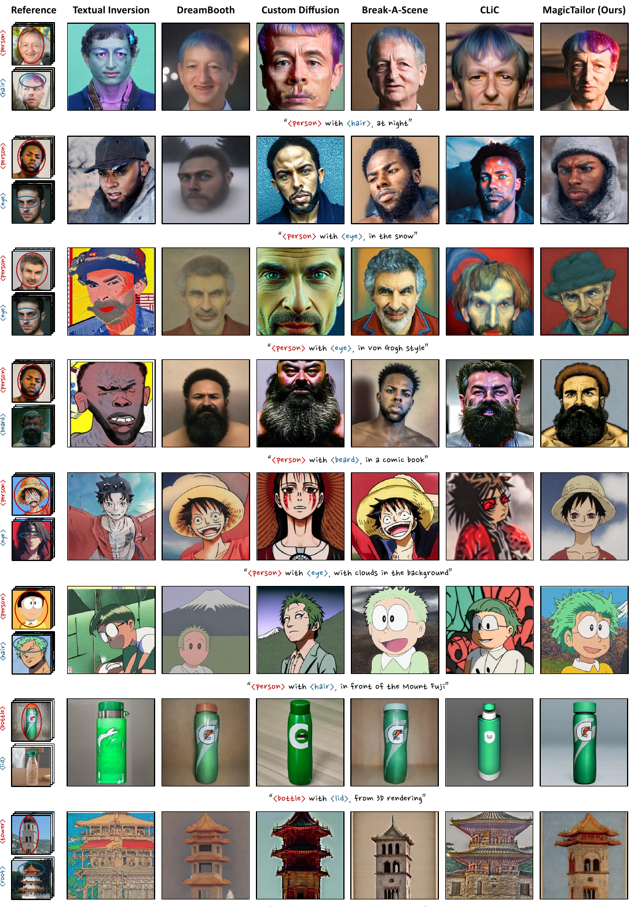

> Figure 14 presents a qualitative comparison of image generation results from MagicTailor and other state-of-the-art methods across various domains, showcasing MagicTailor's superior performance in terms of text alignment, identity preservation, and overall image quality.

More on tables


<table id='1' style='font-size:18px'><tr><td colspan="11">Table 2: Ablation of key techniques. Our DM- Table 4: Ablation of DM-Deg. We compare Deg and DS-Bal effectively contribute to a supe- DM-Deg with its variants and the mask-out strat- rior performance trade-off. egy. Our DM-Deg attains superior overall perfor-</td></tr><tr><td>DM-Deg DS-Bal</td><td></td><td>CLIP-T↑</td><td>CLIP-I ↑</td><td colspan="2">DINO ↑ DreamSim ↓</td><td>mance on text alignment and identity fidelity.</td><td></td><td></td><td></td><td></td></tr><tr><td></td><td>0.275</td><td>0.837</td><td>0.798</td><td colspan="2">0.317</td><td>Intensity Variants</td><td>CLIP-T↑</td><td>CLIP-I↑</td><td>DINO ↑</td><td>DreamSim ↓</td></tr><tr><td></td><td>0.276</td><td>0.848</td><td>0.809</td><td colspan="2">0.294</td><td>Mask-Out Startegy</td><td>0.270</td><td>0.818</td><td>0.760</td><td>0.375</td></tr><tr><td></td><td>0.270</td><td>0.845</td><td>0.802</td><td colspan="2">0.304</td><td></td><td></td><td></td><td></td><td></td></tr><tr><td>V</td><td>0.270</td><td>0.854</td><td>0.813</td><td colspan="2">0.279</td><td>Fixed (a = 0.4)</td><td>0.270 0.271</td><td>0.849</td><td>0.800</td><td>0.297 0.310</td></tr><tr><td colspan="6">Table 3: Ablation of DS-Bal. We compare DS- Bal with its variants, showing its excellence.</td><td>Fixed (a = 0.6)</td><td>0.271</td><td>0.845 0.846</td><td>0.794 0.796</td><td>0.305</td></tr><tr><td colspan="6"></td><td>Fixed (a = 0.8) Linear (Ascent)</td><td>0.270</td><td>0.846</td><td>0.797</td><td>0.307</td></tr><tr><td>U-Net Variants</td><td>CLIP-T↑</td><td>CLIP-I ↑</td><td>DINO ↑</td><td colspan="2">DreamSim ↓</td><td>Linear (Descent)</td><td>0.261</td><td>0.851</td><td>0.802</td><td>0.300</td></tr><tr><td>Fixed (B = 0)</td><td>0.268</td><td>0.850</td><td>0.803</td><td colspan="2">0.293</td><td>Dynamic (Y = 8)</td><td>0.266</td><td>0.850</td><td>0.806</td><td>0.289</td></tr><tr><td>Fixed (B = 1)</td><td>0.270</td><td>0.851</td><td>0.808</td><td colspan="2">0.286</td><td></td><td></td><td></td><td></td><td></td></tr><tr><td>Momentum (B = 0.5)</td><td>0.268</td><td>0.850</td><td>0.805</td><td colspan="2">0.290</td><td>Dynamic (Y = 16)</td><td>0.268</td><td>0.854</td><td>0.813</td><td>0.282</td></tr><tr><td>Momentum (B = 0.9)</td><td>0.269</td><td>0.850</td><td>0.808</td><td colspan="2">0.288</td><td>Dynamic (Y = 64)</td><td>0.271</td><td>0.852</td><td>0.812</td><td>0.283</td></tr><tr><td>Momentum (Ours)</td><td>0.270</td><td>0.854</td><td>0.813</td><td colspan="2">0.279</td><td>Dynamic (Ours)</td><td>0.270</td><td>0.854</td><td>0.813</td><td>0.279</td></tr></table>

> Table 1 quantitatively compares MagicTailor against state-of-the-art methods for personalization using both automatic metrics and a user study.


<table id='2' style='font-size:14px'><tr><td>Recontextualization</td><td>Restylization</td></tr><tr><td>' <placeholder>, on the beach" ' ' <placeholder>, in the snow" " <placeholder>, at night" <placeholder>, in autumn"</td><td>"<placeholder>, watercolor painting" · <placeholder>, Ukiyo-e painting" ' <placeholder>, in Pixel Art style" "<placeholder>, in Von Gogh style" ' ' <placeholder>, in a comic book"</td></tr><tr><td>' <placeholder>, in the jungle" Interaction</td><td>Property Modification</td></tr><tr><td><placeholder>, with clouds in the background" <placeholder>, with flowers in the background"</td><td>"<placeholder>, from 3D rendering" "<placeholder>, in a far view" in a close view"</td></tr><tr><td><placeholder>, near the Eiffel Tower" <placeholder>, on top of water" <placeholder>, in front of the Mount Fuji"</td><td><placeholder>, <placeholder>, made of clay" <placeholder>, made of plastic"</td></tr></table>

> Table 1 quantitatively compares MagicTailor's performance against other state-of-the-art personalization methods using automatic metrics and a user study.


<table id='22' style='font-size:18px'><tr><td>Warm-up Variants</td><td>CLIP-T↑</td><td>CLIP-I↑</td><td>DINO ↑</td><td>DreamSim ↓</td></tr><tr><td>w/o Warm-up</td><td>0.272</td><td>0.844</td><td>0.793</td><td>0.320</td></tr><tr><td>w/ Warm-up (Ours)</td><td>0.270</td><td>0.854</td><td>0.813</td><td>0.279</td></tr></table>

> Table 2 shows the ablation study of the two key techniques, Dynamic Masked Degradation (DM-Deg) and Dual-Stream Balancing (DS-Bal), demonstrating their effectiveness in improving the performance of the MagicTailor model.

### Full paper



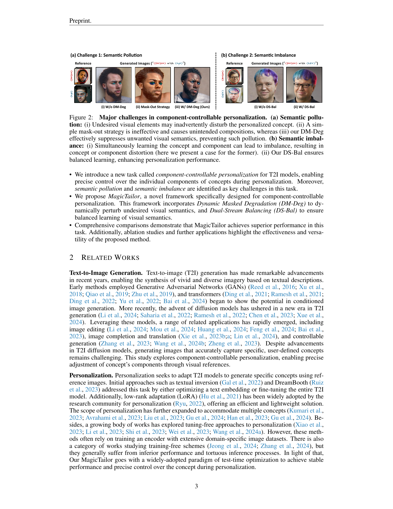
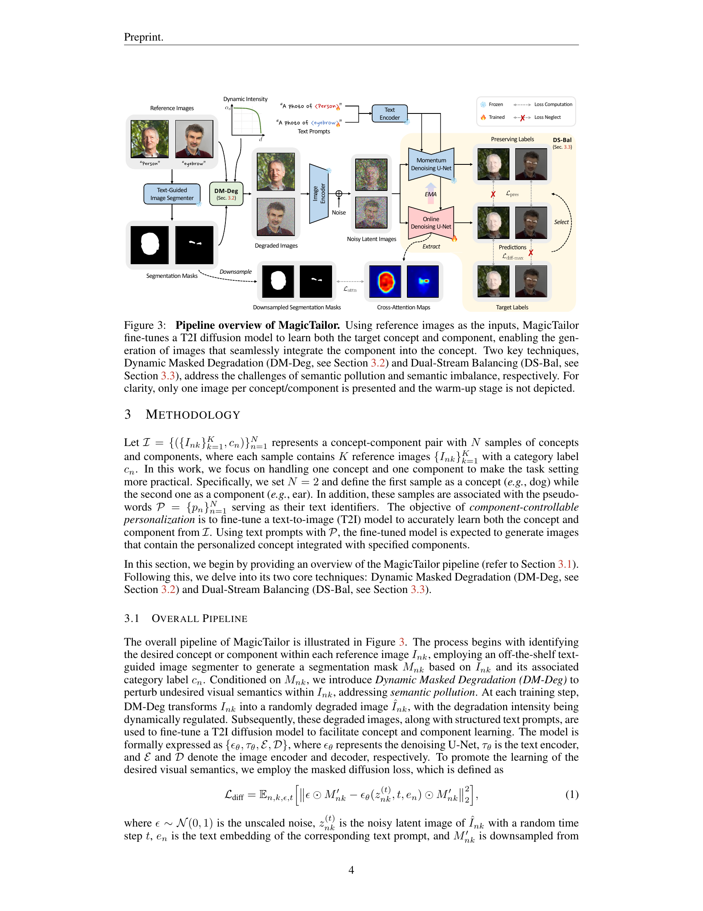

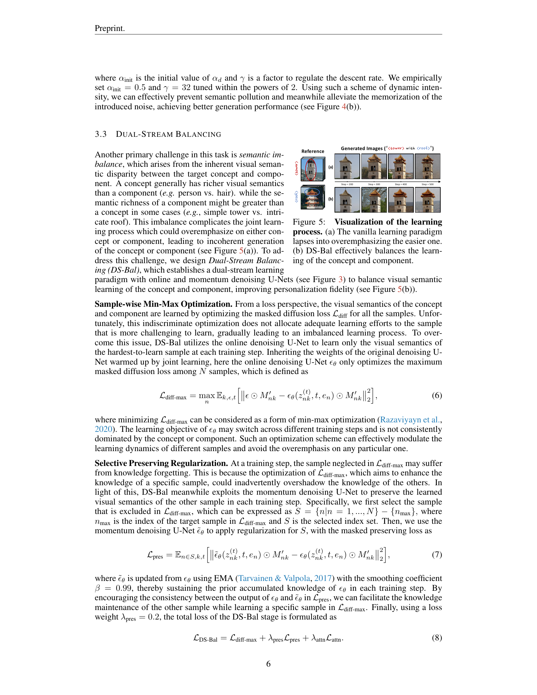
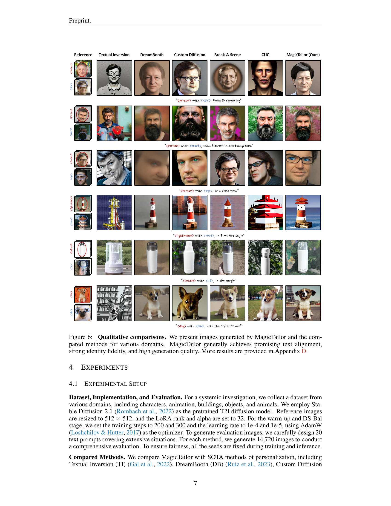
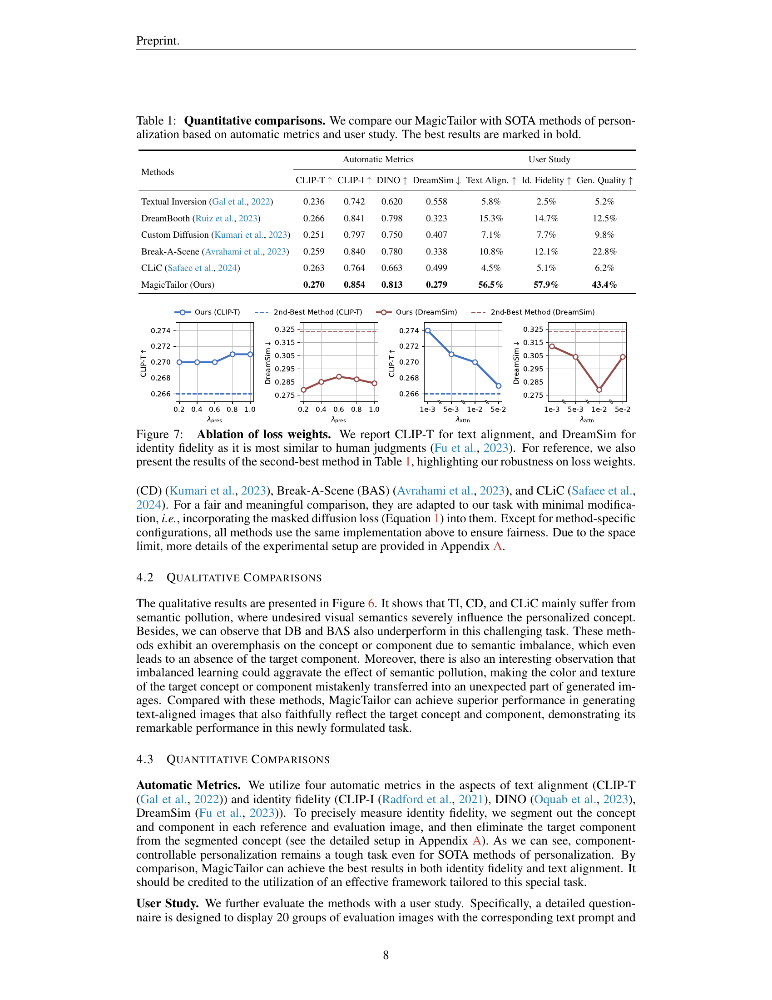
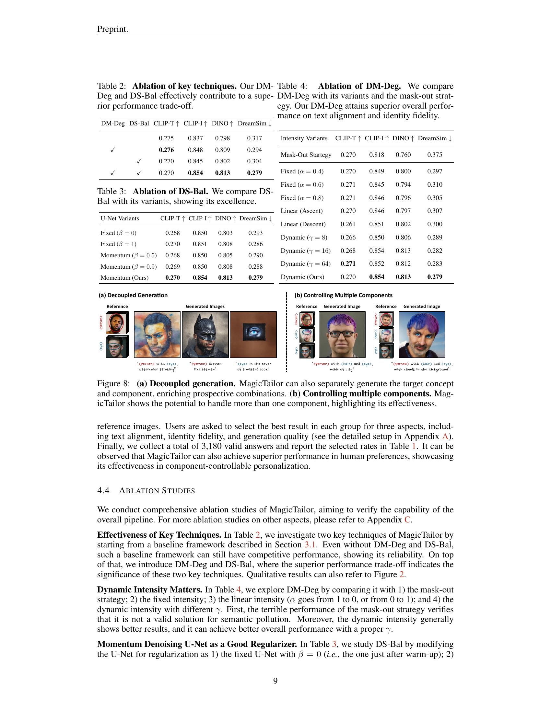
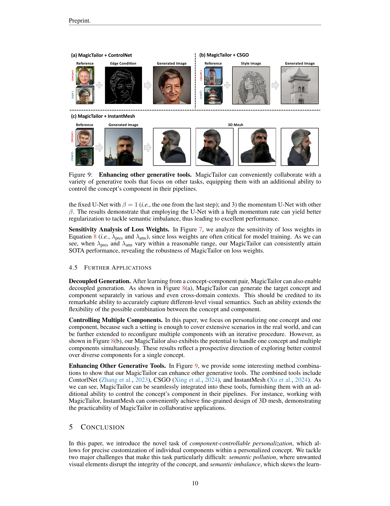

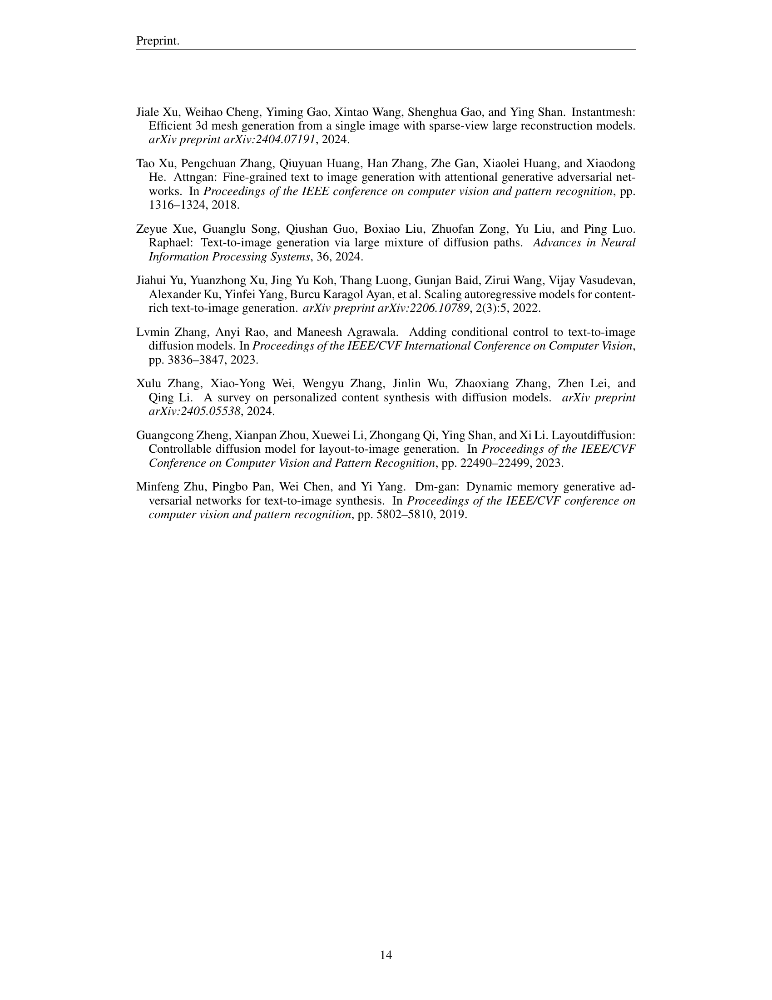
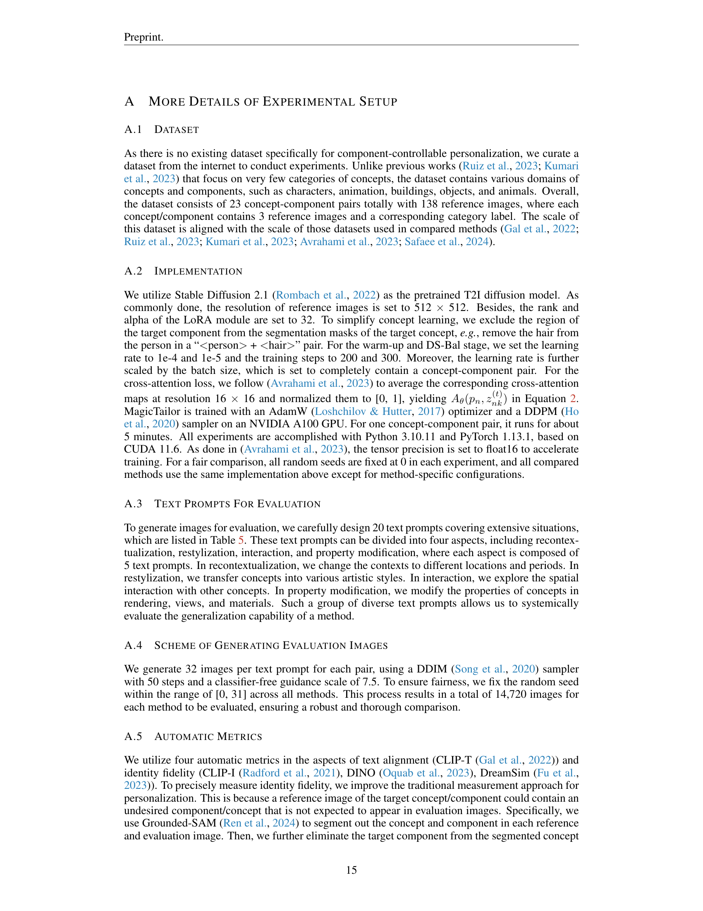

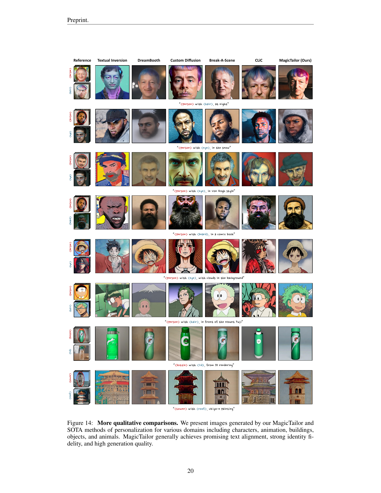
