### TL;DR



The research introduces MedINST, a massive new dataset containing 133 biomedical natural language processing (NLP) tasks and over 7 million training samples.  This makes it the largest biomedical instruction dataset available. The researchers used this dataset to create a challenging benchmark, MedINST32, which they used to test the ability of large language models (LLMs) to adapt to new, unseen tasks. They found that fine-tuning LLMs on MedINST significantly improved their performance and ability to generalize across different tasks within the biomedical domain.  The findings highlight the importance of large, well-annotated datasets for training robust and adaptable LLMs in the complex field of medical analysis. The study also emphasizes that instruction fine-tuning is a more effective strategy than pre-training alone for adapting LLMs to the biomedical field.  The MedINST dataset and the MedINST32 benchmark are publicly available, allowing other researchers to further explore these findings and contribute to the advancement of biomedical NLP.




 &nbsp; read the paper on arXiv


#### Why does it matter?
To provide a concise and informative summary of the MedINST research paper for researchers.
#### Key Takeaways


 MedINST is the largest biomedical instruction dataset, enabling improved LLM performance. 



 MedINST32 benchmark evaluates LLMs' cross-task generalization abilities. 



 Instruction-tuned LLMs on MedINST show enhanced cross-task generalization on MEDINST32. 


------
#### Visual Insights

> The figure shows a treemap of the MEDINST dataset, illustrating the composition of tasks and the number of samples in each category.

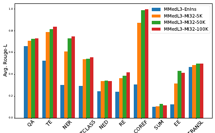

> The chart displays the performance of various models with different training data sizes and model parameters across different task categories.


<table id='0' style='font-size:14px'><tr><td>Resource</td><td>MEDINST (this work)</td><td>SUP-NATINST (Wang et al., 2022) (Biomedicine)</td><td>BoX (Parmar et al., 2022)</td><td>BLURB (Gu et al., 2021)</td></tr><tr><td>Has task instructions?</td><td></td><td></td><td></td><td>x</td></tr><tr><td>Has multi-task datasets?</td><td></td><td></td><td></td><td>x</td></tr><tr><td>Has examples?</td><td></td><td></td><td></td><td>x</td></tr><tr><td>Is public?</td><td></td><td></td><td></td><td></td></tr><tr><td>Number of tasks</td><td>133</td><td>30</td><td>32</td><td>13</td></tr><tr><td>Number of instructions</td><td>133</td><td>30</td><td>32</td><td>-</td></tr><tr><td>Number of annotated task types</td><td>12</td><td>-</td><td>9</td><td>6</td></tr><tr><td>Avg. task definition length (words)</td><td>45.98</td><td>56.6</td><td>-</td><td>-</td></tr></table>

> Table 1 compares MEDINST with other biomedical datasets, highlighting key differences in features like the presence of task instructions, multi-task datasets, examples, and the number of tasks and samples.

### More visual insights

More on tables


<table id='5' style='font-size:16px'><tr><td colspan="3"></td><td>NER</td><td>RE</td><td>NED</td><td>QA</td><td>COREF</td><td>EE</td><td>TE</td><td>STS</td><td>TXTCLASS</td><td>TRANSL</td><td>SUM</td><td>TEXTPAIRCLASS</td><td>ALL</td></tr><tr><td rowspan="6">Dataset #</td><td rowspan="3">MEDINST</td><td>Train</td><td>56</td><td>24</td><td>21</td><td>13</td><td>13</td><td>10</td><td>8</td><td>7</td><td>5</td><td>3</td><td>2</td><td>1</td><td>163</td></tr><tr><td>Dev</td><td>30</td><td>11</td><td>10</td><td>8</td><td>10</td><td>7</td><td>5</td><td>1</td><td>4</td><td>1</td><td>1</td><td>-</td><td>88</td></tr><tr><td>Test</td><td>37</td><td>9</td><td>12</td><td>10</td><td>2</td><td>1</td><td>8</td><td>1</td><td>5</td><td>1</td><td>1</td><td>-</td><td>87</td></tr><tr><td rowspan="3">MEDINST32</td><td>Train</td><td>43</td><td>21</td><td>19</td><td>10</td><td>11</td><td>9</td><td>5</td><td>6</td><td>3</td><td>2</td><td>1</td><td>1</td><td>131</td></tr><tr><td>Dev</td><td>19</td><td>9</td><td>9</td><td>6</td><td>8</td><td>6</td><td>5</td><td>-</td><td>2</td><td>-</td><td>-</td><td>-</td><td>64</td></tr><tr><td>Test</td><td>13</td><td>3</td><td>2</td><td>3</td><td>2</td><td>1</td><td>3</td><td>1</td><td>2</td><td>1</td><td>1</td><td>-</td><td>32</td></tr><tr><td colspan="3"># Instruction/Task</td><td>49</td><td>23</td><td>19</td><td>9</td><td>7</td><td>9</td><td>3</td><td>3</td><td>5</td><td>3</td><td>2</td><td>1</td><td>133</td></tr></table>

> The table presents a summary of the MEDINST dataset, showing the number of datasets, instructions, and tasks within each of the 12 categories.


 <table id='3' style='font-size:14px'><tr><td>Method</td><td>An</td><td>CK</td><td>CB</td><td>CM</td><td>MG</td><td>PM</td><td>Avg.</td></tr><tr><td>BioMistral</td><td>48.89</td><td>66.42</td><td>63.19</td><td>58.38</td><td>70.00</td><td>58.46</td><td>60.88</td></tr><tr><td>MMedL3</td><td>65.19</td><td>70.19</td><td>72.22</td><td>55.49</td><td>74.00</td><td>66.91</td><td>67.03</td></tr><tr><td>MMedL3-EnIns</td><td>68.15</td><td>64.91</td><td>71.52</td><td>59.53</td><td>76.00</td><td>72.79</td><td>68.32</td></tr><tr><td>LLaMA3</td><td>67.41</td><td>76.60</td><td>80.56</td><td>67.63</td><td>82.00</td><td>72.06</td><td>73.92</td></tr><tr><td>MMedL3-MI (Ours)</td><td>64.44</td><td>67.92</td><td>71.53</td><td>58.96</td><td>74.00</td><td>66.54</td><td>66.76</td></tr><tr><td>LLaMA3-MI (Ours)</td><td>68.15</td><td>75.47</td><td>75.00</td><td>67.63</td><td>83.00</td><td>77.21</td><td>74.38</td></tr></table>

> Table 4 presents the multiple-choice accuracy of various models on six medical subtasks of the MMLU benchmark, comparing their performance across different medical subjects.


<table id='6' style='font-size:16px'><tr><td>Dataset Name</td><td>Sample Size</td></tr><tr><td>NCBI-disease</td><td>100</td></tr><tr><td>BC5CDR</td><td>100</td></tr><tr><td>BioNLP-2011-GE</td><td>100</td></tr><tr><td>tm Var-v3</td><td>100</td></tr><tr><td>MeDAL</td><td>1000</td></tr><tr><td>ParaMed</td><td>200</td></tr><tr><td>Multi-XScience</td><td>200</td></tr></table>

> Table 1 compares MEDINST with other datasets in the biomedical field across several criteria, such as the presence of task instructions and multi-task datasets.


<table id='0' style='font-size:14px'><tr><td>QA Given a question and context, select the correct answer from the provided options.</td></tr><tr><td>TE Given a pair of texts, consisting of a claim and the evidence, determine whether the evidence supports, refutes, or is neutral regarding the claim. Respond with one of the following: 'Supports' , 'Refutes' , or 'Neutral'.</td></tr><tr><td>NER Given a sentence, label each disease, disease class and symptom entity using the BIO format. In BIO format, 'B' indicates the beginning of an entity, T indicates the inside of an entity, and 'O' indicates a token not part of any entity. Label each word in the format: 'word [LABEL]'.</td></tr><tr><td>TXTCLASS You are provided with a citation context. Classify the intent of the citation within this context. Intents are: [background, method, result].</td></tr><tr><td>NED You are provided with a text. Your objective is to identify and extract all chemical and disease entities mentioned in the text, maintaining the order in which they appear. For each entity, provide its corresponding database identifier from MESH. The entities should be presented in the format: [entity1 <db_name/db_id>].</td></tr><tr><td>RE Given a text, identify and extract specified relations between anatomical entities mentioned within it. The specified relation types are [frag, Part-of]. Relation explanation: frag: Frag relation marking coordination with ellipsis; Part-of: Part-of relation marking entity mention spanning a prepositional phrase. Present each relation in format as follows: [<entity1> <relation> <entity2>].</td></tr><tr><td>COREF Given a text and a specified anatomical entity, identify and extract all co-references to that entity within the text. Present each co-reference entity in the following format: [co-reference entity].</td></tr><tr><td>STS Given two texts, evaluate their similarity and provide an integer score ranging from 0 to 5, where 0 indicates no similarity and 5 indicates high similarity.</td></tr><tr><td>EE Given a text, identify and extract the epecified types of bio-molecular events along with their primary arguments. The event type can be [Binding, Positive_regulation, Phosphorylation, Regulation, Transcription, Localization, Gene_expression, Protein_ catabolism, Negative_regulation]. Present each event in the format as follows: [<type> <trigger> <theme entity>].</td></tr><tr><td>TRANSL Translate the text from Chinese to English.</td></tr><tr><td>TEXTPAIRCLASS You are given a drug name and a piece of text. Analyze the sentiment in the text and determine whether the sentiment towards the drug is positive, negative, or neutral. Answer with 'Positive', 'Negative', or 'Neutral'.</td></tr><tr><td>SUM Writing the related-work section of a paper based on its abstract and the articles it references.</td></tr></table>

> Table 11 lists all the datasets employed in MEDINST, categorized by task and showing the number of training, development, and test samples.


<table id='5' style='font-size:16px'><tr><td>Example 1</td><td>Instrcution:</td><td>You are provided with a text. Your objective is to identify, extract and classify all gene and protein entities mentioned in the text, maintaining the order in which they appear. Types are [Gene, DomainMotif, Family- Name]. The entities should be presented in the following format: [entity <type>].</td></tr><tr><td></td><td>Input:</td><td>Cloning, expression and localization of an RNA helicase gene from a human lymphoid cell .. ... cell line from a diffuse large B-cell lymphoma.</td></tr><tr><td></td><td>Output:</td><td>[RNA helicase <FamilyName>] [RNA helicase <FamilyName>] [p54 <Gene>] [RNA helicase <FamilyName>] [ME31B <Gene>] [ME31B <Gene>]</td></tr><tr><td>Example 2</td><td>Instrcution:</td><td>You are provided with a text. Your objective is to identify, extract and classify all gene variant entities mentioned in the text, maintaining the order in which they appear. Types are [DNAMutation, SNP, ProteinMu- tation]. The entities should be presented in the following format: [entity <type>].</td></tr><tr><td></td><td>Input:</td><td>A novel multidrug-resistance protein 2 gene mutation identifies a ... ... heterozygous mutation was significantly associated with the presence of pruritus.</td></tr><tr><td></td><td>Output:</td><td>[V1188E <ProteinMutation>]</td></tr><tr><td>Query</td><td>Instrcution:</td><td>You are provided with a text. Your objective is to identify, extract and clas- sify all gene variant entities mentioned in the text, maintaining the order in which they appear. Types are [OtherMutation, Species, DNAAllele, DNAMutation, CellLine, SNP, ProteinMutation, ProteinAllele, Gene, AcidChange]. The entities should be presented in the following format: [entity <type>].</td></tr><tr><td></td><td>Input:</td><td>A novel single-nucleotide substitution, Glu 4 Lys ... ... Thus, our results suggest that Glu 4 Lys in the LTC4S might be associated with allergic diseases.</td></tr></table>

> Table 11 presents the dataset employed in MEDINST, showing the train, dev, and test set sizes for each task.

{{< table-caption caption="🔽 Table 3: Test results of various models on MEDINST32. † indicates that the training sets of LLaMA3-MI includes the corresponding training sets of the datasets used by MEDINST32, whereas other models have not seen the MEDINST32 dataset. ↓ represents that a lower score is better, while for other metrics, a higher score is better. The best and second-best results for each row are highlighted in bold and underlined, respectively. For the baselines, we use a few-shot prompt, providing two examples in the instruction. For the fine-tuned models, we use a zero-shot prompt." >}}
<table id='0' style='font-size:14px'><tr><td>Model</td><td>BERTScore</td><td>METEOR Score</td></tr><tr><td>LLaMA3</td><td>0.7467</td><td>0.1758</td></tr><tr><td>BioMistral</td><td>0.7253</td><td>0.1152</td></tr><tr><td>MMEDL3-EnIns</td><td>0.7314</td><td>0.1185</td></tr><tr><td>GPT-4o</td><td>0.8317</td><td>0.2333</td></tr><tr><td>LLaMA3-MI32 (ours)</td><td>0.7951</td><td>0.1566</td></tr><tr><td>MMEDL3-MI32 (ours)</td><td>0.7963</td><td>0.1220</td></tr><tr><td>LLaMA3-MI (ours)</td><td>0.8203</td><td>0.1592</td></tr></table>

> Table 3 presents the evaluation results of various models on the MEDINST32 benchmark, highlighting the performance of different models across various difficulty levels of tasks.


<table id='2' style='font-size:14px'><tr><td>Model</td><td>BERTScore</td><td>METEOR Score</td></tr><tr><td>LLaMA3</td><td>0.9000</td><td>0.3776</td></tr><tr><td>BioMistral</td><td>0.9101</td><td>0.3670</td></tr><tr><td>MMEDL3-EnIns</td><td>0.8888</td><td>0.3625</td></tr><tr><td>GPT-4o</td><td>0.9291</td><td>0.4661</td></tr><tr><td>LLaMA3-MI32 (ours)</td><td>0.9115</td><td>0.3933</td></tr><tr><td>MMEDL3-MI32 (ours)</td><td>0.9080</td><td>0.3781</td></tr><tr><td>LLaMA3-MI (ours)</td><td>0.9379</td><td>0.6126</td></tr></table>

> Table 1 compares MEDINST to other biomedical datasets based on the presence of task instructions, multi-task datasets, examples, public availability, number of tasks, number of instructions, number of annotated task types, and average task definition length.


 <table id='1' style='font-size:18px'><tr><td>Dataset</td><td>Task</td><td>Train</td><td>Dev</td><td>Test</td></tr><tr><td>BioASQ-Task-B-yesno</td><td>QA</td><td>15,568</td><td>0</td><td>813</td></tr><tr><td>BioASQ-Task-B-list</td><td>QA</td><td>11,687</td><td>0</td><td>1,000</td></tr><tr><td>BioASQ-Task-B-factoid</td><td>QA</td><td>16,389</td><td>0</td><td>724</td></tr><tr><td>BioASQ-Task-B-summary</td><td>QA</td><td>13,151</td><td>0</td><td>824</td></tr><tr><td>BiologyHow WhyCorpus</td><td>QA</td><td>1,269</td><td>0</td><td>0</td></tr><tr><td>BIOMRC</td><td>QA</td><td>700,000</td><td>50,000</td><td>62,707</td></tr><tr><td>Evidence-Inference-2.0</td><td>QA</td><td>10,056</td><td>1,233</td><td>1,222</td></tr><tr><td>MedQA</td><td>QA</td><td>10,178</td><td>1,273</td><td>1,272</td></tr><tr><td>MedHop</td><td>QA</td><td>1,620</td><td>342</td><td>0</td></tr><tr><td>MEDIQA-QA</td><td>QA</td><td>312</td><td>25</td><td>150</td></tr><tr><td>PubMedQA-artificial</td><td>QA</td><td>200,000</td><td>11,269</td><td>0</td></tr><tr><td>PubMedQA-labeled</td><td>QA</td><td>450</td><td>50</td><td>500</td></tr><tr><td>SciQ</td><td>QA</td><td>11,679</td><td>1,000</td><td>1,000</td></tr><tr><td>FEVER</td><td>TE</td><td>145,449</td><td>9,999</td><td>9,999</td></tr><tr><td>HealthVer</td><td>TE</td><td>10,590</td><td>1,917</td><td>1,823</td></tr><tr><td>PubHealth</td><td>TE</td><td>9,804</td><td>1,214</td><td>1,233</td></tr><tr><td>SciFact</td><td>TE</td><td>868</td><td>0</td><td>1,189</td></tr><tr><td>ManConCorpus</td><td>TE</td><td>0</td><td>0</td><td>2,775</td></tr><tr><td>CoVERt</td><td>TE</td><td>0</td><td>0</td><td>212</td></tr><tr><td>MEDIQA-RQE</td><td>TE</td><td>8,588</td><td>302</td><td>230</td></tr><tr><td>SciTail</td><td>TE</td><td>23,596</td><td>2,126</td><td>1,304</td></tr><tr><td>NCBI-disease</td><td>NER</td><td>5,432</td><td>923</td><td>942</td></tr><tr><td>BC2GM</td><td>NER</td><td>12,632</td><td>2,531</td><td>5,065</td></tr><tr><td>CHEMDNER-BIO</td><td>NER</td><td>30,884</td><td>30,841</td><td>26,561</td></tr><tr><td>BC5CDR</td><td>NER</td><td>4,560</td><td>4,581</td><td>4,797</td></tr><tr><td>Linnaeus</td><td>NER</td><td>12,004</td><td>4,086</td><td>7,181</td></tr><tr><td>JNLPBA-DNA</td><td>NER</td><td>4,699</td><td>552</td><td>622</td></tr><tr><td>JNLPBA-RNA</td><td>NER</td><td>721</td><td>89</td><td>102</td></tr><tr><td>JNLPBA-CT</td><td>NER</td><td>4,792</td><td>420</td><td>1,422</td></tr><tr><td>JNLPBA-CL</td><td>NER</td><td>2,596</td><td>284</td><td>377</td></tr><tr><td>AnatEM</td><td>NER</td><td>5,861</td><td>2,118</td><td>3,830</td></tr><tr><td>AnEM</td><td>NER</td><td>164</td><td>137</td><td>30</td></tr><tr><td>BioInfer</td><td>NER</td><td>894</td><td>0</td><td>206</td></tr><tr><td>BioNLP-2009</td><td>NER</td><td>756</td><td>260</td><td>150</td></tr><tr><td>BioNLP-2011-EPI</td><td>NER</td><td>600</td><td>200</td><td>0</td></tr><tr><td>BioNLP-2011-GE</td><td>NER</td><td>856</td><td>0</td><td>338</td></tr><tr><td>BioNLP-2011-ID</td><td>NER</td><td>151</td><td>46</td><td>117</td></tr><tr><td>BioNLP-2011-REL</td><td>NER</td><td>756</td><td>150</td><td>260</td></tr><tr><td>BioNLP-2013-CG</td><td>NER</td><td>300</td><td>100</td><td>200</td></tr><tr><td>BioNLP-2013-GE</td><td>NER</td><td>194</td><td>212</td><td>256</td></tr><tr><td>BioNLP-2013-GRO</td><td>NER NER</td><td>150</td><td>50</td><td>100</td></tr><tr><td>BioNLP-2013-PC BioNLP-2019-BB</td><td>NER</td><td>132</td><td>90 66</td><td>175</td></tr><tr><td></td><td></td><td></td><td></td><td></td></tr><tr><td></td><td></td><td>260</td><td></td><td>0 100</td></tr><tr><td>BioRED BioRelEx</td><td>NER NER</td><td>400 1,402</td><td>100 201</td><td>0</td></tr><tr><td>CellFinder</td><td>NER</td><td>5</td><td>0</td><td>5</td></tr><tr><td>CHEBI</td><td>NER</td><td>476</td><td>0</td><td>0</td></tr><tr><td>CHEMDNER</td><td>NER</td><td>2,915</td><td>2,906</td><td>2,477</td></tr></table>

> Table 11 shows the dataset statistics, including the number of training, development, and test samples for each task in the MEDINST dataset.


 <table id='1' style='font-size:18px'><tr><td>Dataset</td><td>Task</td><td>Train</td><td>Dev</td><td>Test</td></tr><tr><td>ChemProt</td><td>NER</td><td>1,020</td><td>612</td><td>800</td></tr><tr><td>CHIA</td><td>NER</td><td>1,932</td><td>0</td><td>0</td></tr><tr><td>CPI</td><td>NER</td><td>1,808</td><td>0</td><td>0</td></tr><tr><td>DDI</td><td>NER</td><td>673</td><td>0</td><td>279</td></tr><tr><td>DrugProt</td><td>NER</td><td>3,500</td><td>750</td><td>0</td></tr><tr><td>EBM-NLP</td><td>NER</td><td>4,735</td><td>0</td><td>187</td></tr><tr><td>EU-ADR</td><td>NER</td><td>299</td><td>0</td><td>0</td></tr><tr><td>GENETAG</td><td>NER</td><td>3,875</td><td>1,311</td><td>2,567</td></tr><tr><td>PTM-Events</td><td>NER</td><td>112</td><td>0</td><td>0</td></tr><tr><td>GENIA-Term</td><td>NER</td><td>2,000</td><td>0</td><td>0</td></tr><tr><td>GNormPlus</td><td>NER</td><td>418</td><td>0</td><td>261</td></tr><tr><td>HPRD50</td><td>NER</td><td>34</td><td>0</td><td>9</td></tr><tr><td>MedMentions</td><td>NER</td><td>2,635</td><td>878</td><td>879</td></tr><tr><td>miRNA</td><td>NER</td><td>201</td><td>0</td><td>100</td></tr><tr><td>MLEE</td><td>NER</td><td>130</td><td>44</td><td>87</td></tr><tr><td>NLM-Gene</td><td>NER</td><td>450</td><td>0</td><td>100</td></tr><tr><td>NLM-Chem</td><td>NER</td><td>80</td><td>20</td><td>50</td></tr><tr><td>OSIRIS</td><td>NER</td><td>105</td><td>0</td><td>0</td></tr><tr><td>PDR</td><td>NER</td><td>179</td><td>0</td><td>0</td></tr><tr><td>PICO-Annotation</td><td>NER</td><td>361</td><td>0</td><td>0</td></tr><tr><td>ProGene</td><td>NER</td><td>20,055</td><td>1,109</td><td>2,414</td></tr><tr><td>SCAI-Chemical</td><td>NER</td><td>67</td><td>0</td><td>0</td></tr><tr><td>SCAI-Disease</td><td>NER</td><td>330</td><td>0</td><td>0</td></tr><tr><td>SETH</td><td>NER</td><td>433</td><td>0</td><td>0</td></tr><tr><td>SPL-ADR</td><td>NER</td><td>101</td><td>0</td><td>0</td></tr><tr><td>tmVar-v1</td><td>NER</td><td>213</td><td>0</td><td>101</td></tr><tr><td>tmVar-v2</td><td>NER</td><td>158</td><td>0</td><td>0</td></tr><tr><td>tmVar-v3</td><td>NER</td><td>0</td><td>0</td><td>493</td></tr><tr><td>Verspoor-2013</td><td>NER</td><td>117</td><td>0</td><td>0</td></tr><tr><td>MedDialog</td><td>TXTCLASS</td><td>981</td><td>126</td><td>122</td></tr><tr><td>SciCite</td><td>TXTCLASS</td><td>8,243</td><td>916</td><td>1,861</td></tr><tr><td>Hallmarks-of-Cancer</td><td>TXTCLASS</td><td>12,119</td><td>1,798</td><td>3,547</td></tr><tr><td>GEOKhoj-v1</td><td>TXTCLASS</td><td>25,000</td><td>0</td><td>5,000</td></tr><tr><td>BC7-LitCovid</td><td>TXTCLASS</td><td>24,960</td><td>2,500</td><td>6,239</td></tr><tr><td>AskAPatient-NED</td><td>NED</td><td>15,612</td><td>845</td><td>867</td></tr><tr><td>BC5CDR-NED</td><td>NED</td><td>500</td><td>500</td><td>500</td></tr><tr><td>Bio-ID</td><td>NED</td><td>11,366</td><td>0</td><td>0</td></tr><tr><td>BioNLP-2019-BB-NED</td><td>NED</td><td>132</td><td>66</td><td>0</td></tr><tr><td>BioRED-NED</td><td>NED</td><td>400</td><td>100</td><td>100</td></tr><tr><td>BioRelEx-NED</td><td>NED</td><td>1,402</td><td>201</td><td>0</td></tr><tr><td>CPI-NED</td><td>NED</td><td>1,808</td><td>0</td><td>0</td></tr><tr><td>GNormPlus-NED</td><td>NED</td><td>418 95</td><td>0</td><td>261</td></tr><tr><td>Linnaeus-NED MeDAL</td><td>NED NED</td><td></td><td>0 1,000,000</td><td>0</td></tr><tr><td></td><td></td><td></td><td></td><td>1,000,000</td></tr><tr><td></td><td></td><td>3,000,000 2,635</td><td>878</td><td>879</td></tr><tr><td>MedMentions-NED miRNA-NED</td><td>NED NED</td><td>201</td><td>0</td><td>100</td></tr><tr><td>MuchMore-NED</td><td>NED</td><td>7,820</td><td>0</td><td>0</td></tr><tr><td>NCBI-disease-NED</td><td>NED</td><td>592</td><td>100</td><td>100</td></tr><tr><td>NLM-Gene-NED</td><td>NED</td><td>450</td><td>0</td><td>100</td></tr></table>

> This table lists all the datasets employed in MEDINST, showing the task, train, dev, and test set sizes for each.


 <table id='1' style='font-size:18px'><tr><td>Dataset</td><td>Task</td><td>Train</td><td>Dev</td><td>Test</td></tr><tr><td>NLM-Chem-NED</td><td>NED</td><td>80</td><td>20</td><td>50</td></tr><tr><td>OSIRIS-NED</td><td>NED</td><td>105</td><td>0</td><td>0</td></tr><tr><td>SPL-ADR-NED</td><td>NED</td><td>101</td><td>0</td><td>0</td></tr><tr><td>tmVar-v2-NED</td><td>NED</td><td>158</td><td>0</td><td>0</td></tr><tr><td>tmVar-v3-NED</td><td>NED</td><td>0</td><td>0</td><td>493</td></tr><tr><td>TwADR-L-NED</td><td>NED</td><td>4,816</td><td>115</td><td>143</td></tr><tr><td>AnEM-RE</td><td>RE</td><td>22</td><td>5</td><td>13</td></tr><tr><td>BC5CDR-RE</td><td>RE</td><td>500</td><td>500</td><td>500</td></tr><tr><td>BioInfer-RE</td><td>RE</td><td>642</td><td>0</td><td>142</td></tr><tr><td>BioNLP-2011-REL-RE</td><td>RE</td><td>378</td><td>92</td><td>0</td></tr><tr><td>BioNLP-2013-GE-RE</td><td>RE</td><td>40</td><td>41</td><td>0</td></tr><tr><td>BioNLP-2013-GRO-RE</td><td>RE</td><td>149</td><td>48</td><td>0</td></tr><tr><td>BioNLP-2019-BB-RE</td><td>RE</td><td>121</td><td>59</td><td>0</td></tr><tr><td>BioRED-RE</td><td>RE</td><td>395</td><td>97</td><td>100</td></tr><tr><td>BioRelEx-RE</td><td>RE</td><td>1,263</td><td>178</td><td>0</td></tr><tr><td>CHEBI-RE</td><td>RE</td><td>415</td><td>0</td><td>0</td></tr><tr><td>ChemProt-RE</td><td>RE</td><td>767</td><td>443</td><td>620</td></tr><tr><td>CHIA-RE</td><td>RE</td><td>1,876</td><td>0</td><td>0</td></tr><tr><td>CPI-RE</td><td>RE</td><td>1,246</td><td>0</td><td>0</td></tr><tr><td>DDI-RE</td><td>RE</td><td>510</td><td>0</td><td>191</td></tr><tr><td>DrugProt-RE</td><td>RE</td><td>2,433</td><td>542</td><td>0</td></tr><tr><td>EU-ADR-RE</td><td>RE</td><td>253</td><td>0</td><td>0</td></tr><tr><td>HPRD50-RE</td><td>RE</td><td>28</td><td>0</td><td>8</td></tr><tr><td>IEPA</td><td>RE</td><td>114</td><td>0</td><td>26</td></tr><tr><td>LLL05</td><td>RE</td><td>77</td><td>0</td><td>0</td></tr><tr><td>MLEE-RE</td><td>RE</td><td>32</td><td>11</td><td>16</td></tr><tr><td>MuchMore-RE</td><td>RE</td><td>7,734</td><td>0</td><td>0</td></tr><tr><td>SETH-RE</td><td>RE</td><td>212</td><td>0</td><td>0</td></tr><tr><td>SPL-ADR-RE</td><td>RE</td><td>96</td><td>0</td><td>0</td></tr><tr><td>Verspoor-2013-RE</td><td>RE</td><td>114</td><td>0</td><td>0</td></tr><tr><td>AnEM-COREF</td><td>COREF</td><td>10</td><td>2</td><td>14</td></tr><tr><td>BioNLP-2009-COREF</td><td>COREF</td><td>536</td><td>110</td><td>0</td></tr><tr><td>BioNLP-2011-EPI-COREF</td><td>COREF</td><td>440</td><td>168</td><td>0</td></tr><tr><td>BioNLP-2011-GE-COREF</td><td>COREF</td><td>571</td><td>0</td><td>0</td></tr><tr><td>BioNLP-2011-ID-COREF</td><td>COREF</td><td>170</td><td>31</td><td>0</td></tr><tr><td>BioNLP-2011-REL-COREF</td><td>COREF</td><td>535</td><td>110</td><td>0</td></tr><tr><td>BioNLP-2013-CG-COREF</td><td>COREF</td><td>466</td><td>176</td><td>0</td></tr><tr><td>BioNLP-2013-GE-COREF</td><td>COREF</td><td>53</td><td>41</td><td>0</td></tr><tr><td>BioNLP-2013-PC-COREF</td><td>COREF</td><td>455</td><td>128</td><td>0</td></tr><tr><td>BioRelEx-COREF</td><td>COREF</td><td>1,143</td><td>167</td><td>0</td></tr><tr><td>PTM-Events-COREF</td><td>COREF</td><td>25</td><td>0</td><td>0</td></tr><tr><td>MLEE-COREF</td><td>COREF</td><td>198</td><td>57</td><td>113</td></tr><tr><td>PDR-COREF</td><td>COREF</td><td>19</td><td>0</td><td>0</td></tr><tr><td></td><td></td><td></td><td></td><td>0</td></tr><tr><td>Bio-SimVerb</td><td>STS STS</td><td>1,000 988</td><td>0 0</td><td>0</td></tr><tr><td>Bio-SimLex BIOSSES</td><td>STS</td><td>64</td><td>16</td><td>20</td></tr><tr><td>EHR-Rel</td><td>STS</td><td>3,741</td><td>0</td><td>0</td></tr><tr><td>MayoSRS</td><td>STS</td><td>101</td><td>0</td><td>0</td></tr><tr><td>MQP</td><td>STS</td><td>3,048</td><td>0</td><td>0</td></tr></table>

> This table presents the 133 biomedical NLP tasks included in the MEDINST dataset, categorized by task type, and shows the number of training, development, and test samples for each task.


 <table id='1' style='font-size:18px'><tr><td>Dataset</td><td>Task</td><td>Train</td><td>Dev</td><td>Test</td></tr><tr><td>UMNSRS</td><td>STS</td><td>1,153</td><td>0</td><td>0</td></tr><tr><td>BioNLP-2009-EE</td><td>EE</td><td>695</td><td>150</td><td>0</td></tr><tr><td>BioNLP-2011-EPI-EE</td><td>EE</td><td>383</td><td>121</td><td>0</td></tr><tr><td>BioNLP-2011-GE-EE</td><td>EE</td><td>765</td><td>0</td><td>0</td></tr><tr><td>BioNLP-2011-ID-EE</td><td>EE</td><td>110</td><td>30</td><td>0</td></tr><tr><td>BioNLP-2013-CG-EE</td><td>EE</td><td>299</td><td>100</td><td>0</td></tr><tr><td>BioNLP-2013-GE-EE</td><td>EE</td><td>149</td><td>157</td><td>0</td></tr><tr><td>BioNLP-2013-PC-EE</td><td>EE</td><td>257</td><td>90</td><td>0</td></tr><tr><td>PTM-Events-EE</td><td>EE</td><td>111</td><td>0</td><td>0</td></tr><tr><td>MLEE-EE</td><td>EE</td><td>127</td><td>44</td><td>87</td></tr><tr><td>PDR-EE</td><td>EE</td><td>167</td><td>0</td><td>0</td></tr><tr><td>MuchMore-TRANSL</td><td>TRANSL</td><td>6,374</td><td>0</td><td>0</td></tr><tr><td>ParaMed</td><td>TRANSL</td><td>62,127</td><td>2,036</td><td>2,102</td></tr><tr><td>SciELO</td><td>TRANSL</td><td>3,006,699</td><td>0</td><td>0</td></tr><tr><td>Medical-Data</td><td>TEXTPAIRCLASS</td><td>5,279</td><td>0</td><td>0</td></tr><tr><td>MeQSum</td><td>SUM</td><td>1,000</td><td>0</td><td>0</td></tr><tr><td>Multi-XScience</td><td>SUM</td><td>30,369</td><td>5,066</td><td>5,093</td></tr></table>

> The table presents the dataset collection details of MEDINST, showing the task type, and the number of training, development, and test samples for each dataset.

### Full paper



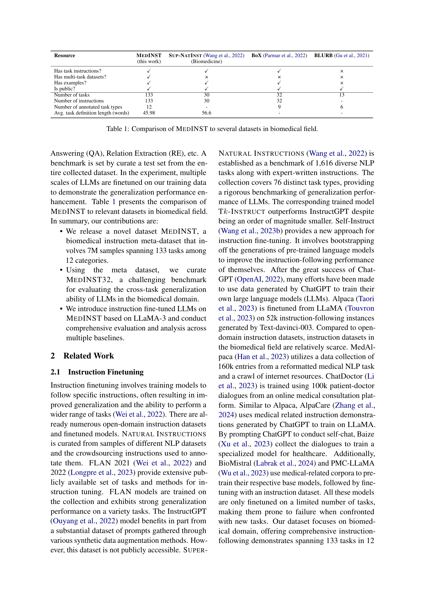
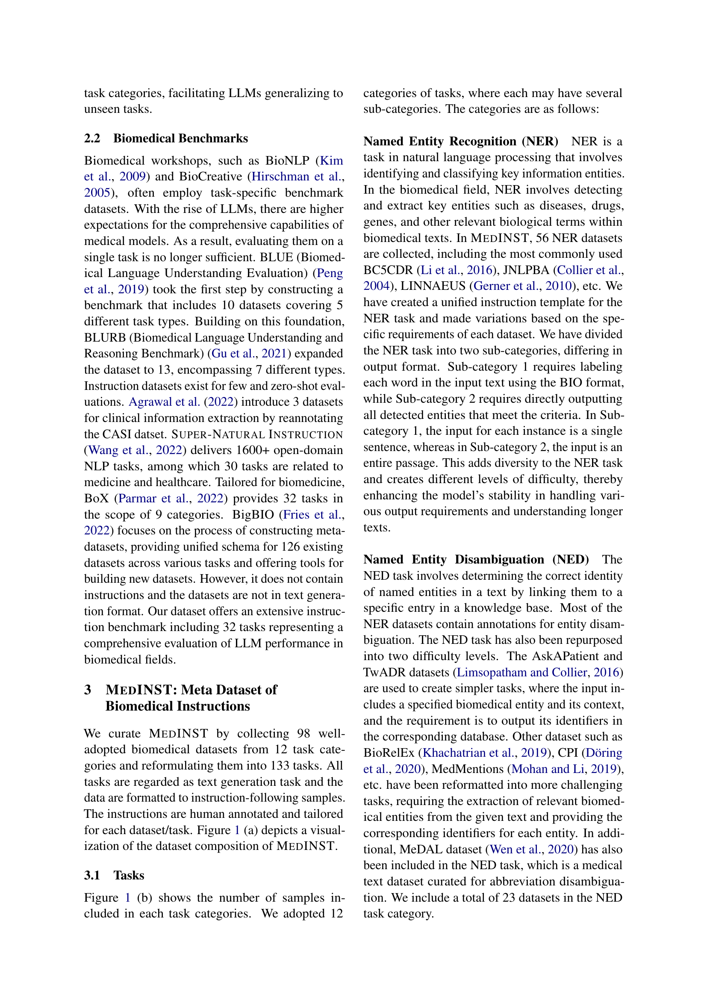
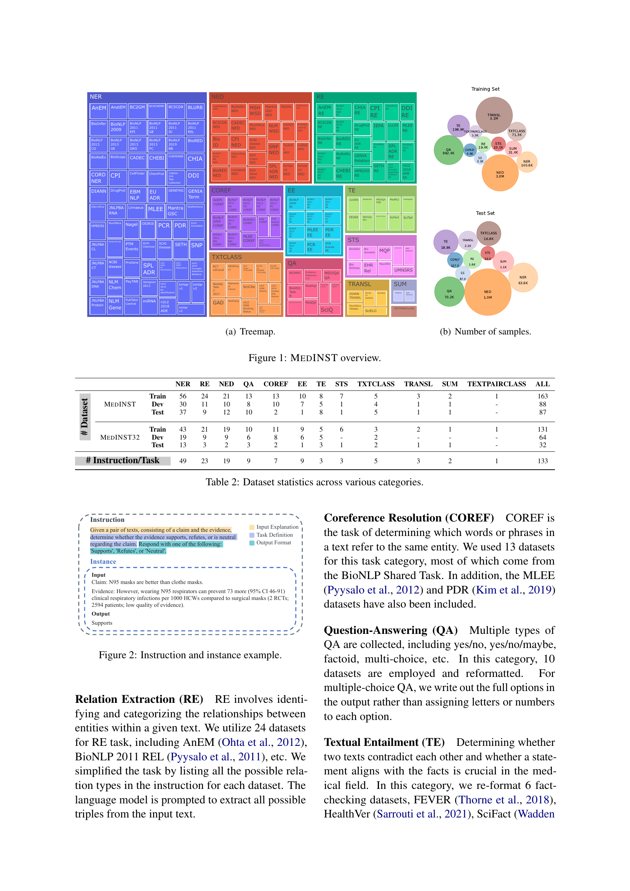
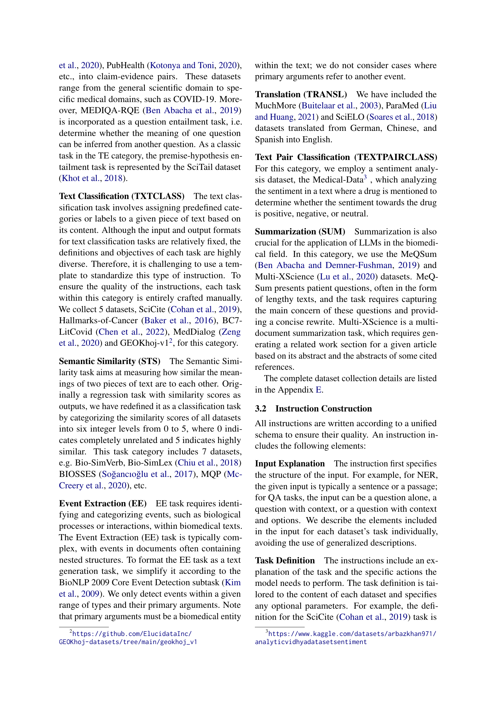

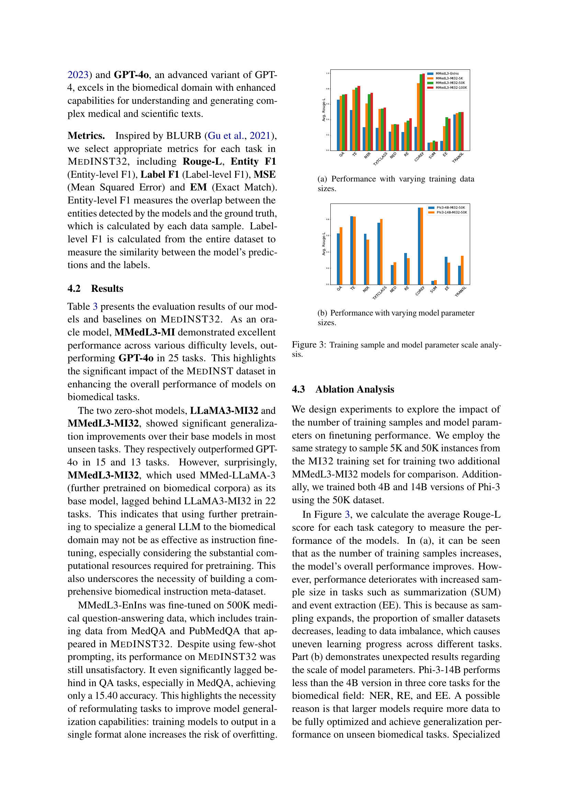
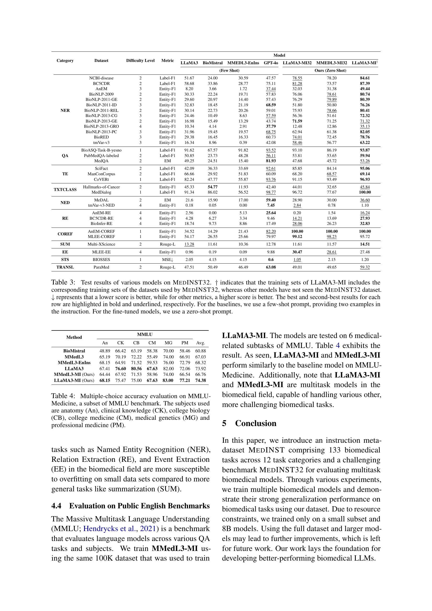
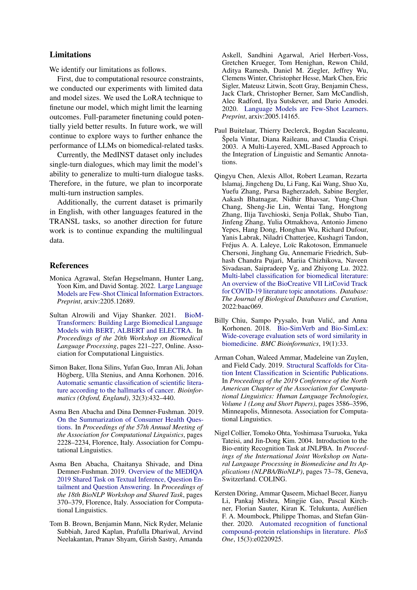
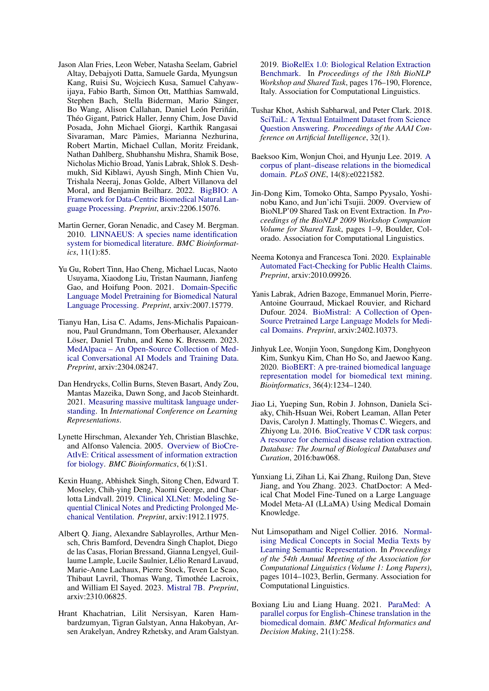

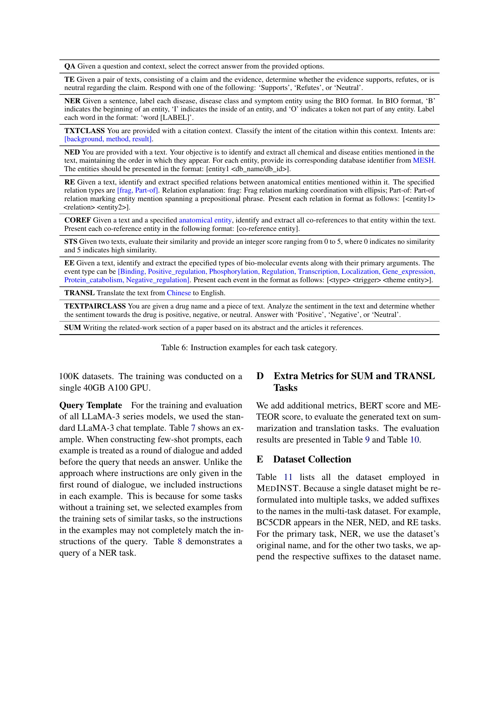
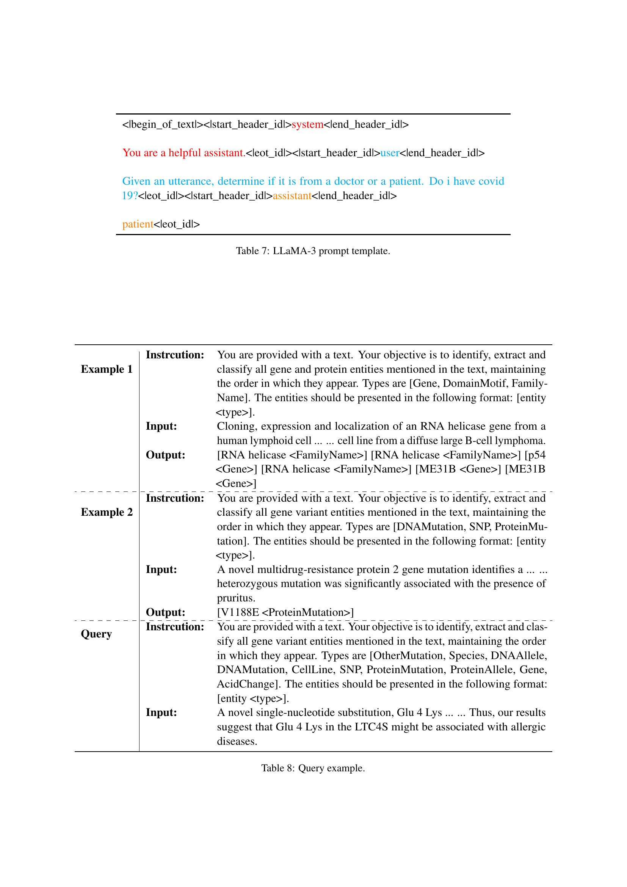

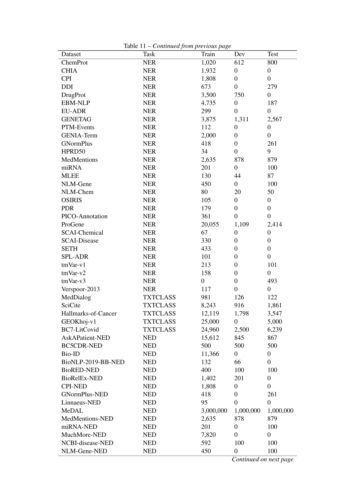

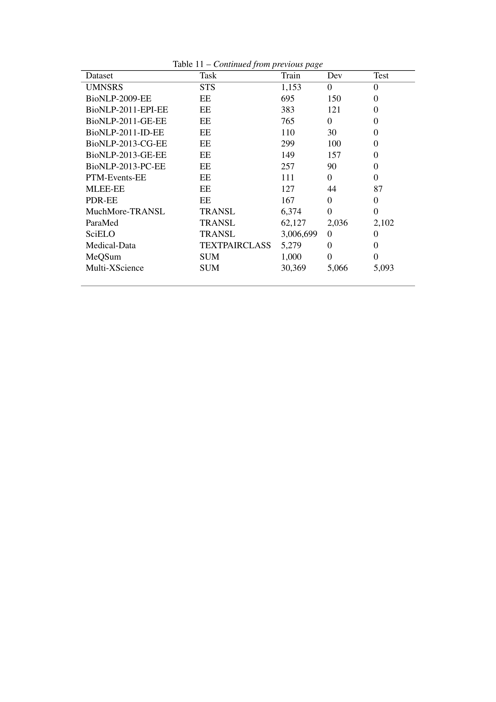
