### TL;DR



DPLM-2 is a significant advancement in protein language modeling.  Unlike previous models that handled protein sequences and structures separately, DPLM-2 uses a multimodal approach.  It converts 3D protein structures into discrete tokens, allowing a language model to learn and generate both sequences and structures simultaneously.  The model was trained on both experimental and high-quality synthetic data, learning the joint distribution of sequence and structure.  It shows improved performance in various tasks including protein folding (predicting 3D structure from sequence), inverse folding (predicting sequence from structure), and motif scaffolding (designing a protein structure with a specific motif).  The results demonstrate that DPLM-2 generates highly compatible sequences and structures and performs competitively in conditional generation tasks. Furthermore, DPLM-2 provides structure-aware representations for improved predictive tasks, showcasing its versatility as a multimodal protein foundation model.




 &nbsp; read the paper on arXiv


#### Why does it matter?
Summarizing the provided research paper on DPLM-2, a multimodal diffusion protein language model.
#### Key Takeaways


 DPLM-2 simultaneously generates protein sequences and 3D structures, eliminating the need for two-stage generation. 



 DPLM-2 excels in various conditional generation tasks (folding, inverse folding, scaffolding) using multimodal inputs. 



 DPLM-2's structure-aware representations improve performance in downstream predictive tasks. 


------
#### Visual Insights

 Structure tokenization consists of a GVP-based encoder to yield invariant backbone geometric features, a lookup-free quantizer (LFQ) to discretize encoded structural features into structure tokens within a codebook, and an IPA-based decoder as de-tokenizer to convert structure tokens back to backbone atomic coordinates. (B) Multimodal learning and generation of protein structure and sequence with DPLM-2. (C) Various applications of DPLM-2 as a protein foundation model: (1) unconditional protein sequence-structure mixed-modal co-generation; (2) protein sequence-structure joint representation for predictive tasks; (3) structure prediction; (4) fixed-backbone sequence generation; (5) conditional protein generation with structure-sequence mixed-modal input and output.")

> Figure 1 illustrates the overall architecture of DPLM-2, detailing its structure tokenization, multimodal learning and generation process, and various applications as a protein foundation model.

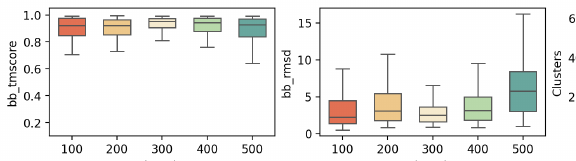

> Figure 3 shows the evaluation results of DPLM-2 on unconditional protein generation, illustrating the model's ability to generate diverse, high-quality proteins with compatible structure and sequence.


<table id='3' style='font-size:14px'><tr><td></td><td colspan="3">Quality</td><td rowspan="2">Novelty avg. pdb-TM (↓)</td><td colspan="2">Diversity</td></tr><tr><td></td><td>scTM (↑)</td><td>scRMSD (↓)</td><td>pLDDT (↑)</td><td>avg. inner-TM (↓)</td><td>MaxCluster (↑)</td></tr><tr><td>Structure-sequence co-generation.</td><td></td><td></td><td></td><td></td><td></td><td></td></tr><tr><td>Native PDB protein</td><td>4.623 士 5.688</td><td>0.904 土 0.129</td><td>-</td><td>-</td><td>-</td><td>-</td></tr><tr><td>ESM3-Open (1.4B, seq → struct)</td><td>0.624 士 0.232</td><td>24.180 土 24.109</td><td>-</td><td>0.660 土 0.000</td><td>0.410 土 0.167</td><td>0.540</td></tr><tr><td>MultiFlow w/ distillation (official ckpt)</td><td>0.930 土 0.098</td><td>3.208 土 4,741</td><td>79.447</td><td>0.704 士 0.000</td><td>0.468 土 0.152</td><td>0.500</td></tr><tr><td>*MultiFlow w/o distillation</td><td>0.750 士 0.163</td><td>9.306 土 8.499</td><td>65.861</td><td></td><td></td><td></td></tr><tr><td>*MultiFlow (retrained on our training data)</td><td>0.871 土 0.934</td><td>6.580 土 6.258</td><td>62.624</td><td></td><td></td><td></td></tr><tr><td>DPLM-2 (650M, seq → struct)</td><td>0.907 士 0.117</td><td>6.337 士 9.403</td><td>82.246</td><td>0.653 土 0.195</td><td>0.594 士 0.270</td><td>0.651</td></tr><tr><td>DPLM-2 (650M, struct → seq)</td><td>0.921 士 0.098</td><td>4.969 士 6.735</td><td>81.910</td><td>0.637 士 0.195</td><td>0.679 士 0.288</td><td>0.575</td></tr><tr><td>DPLM-2 (650M, co-generation)</td><td>0.925 士 0.085</td><td>3.899 士 3.723</td><td>82.686</td><td>0.640 土 0.204</td><td>0.703 士 0.279</td><td>0.545</td></tr><tr><td colspan="7">Unconditional backbone generation. (sequence predicted by ProteinMPNN)</td></tr><tr><td>Native PDB struct. (seq. from PMPNN)</td><td>0.969 士 0.000</td><td>0.864 土 0.000</td><td></td><td>-</td><td>0.282 士 0.000</td><td>0.782</td></tr><tr><td>FrameDiff</td><td>0.818 士 0.000</td><td>3.919 土 0.000</td><td></td><td>0.668 土 0.000</td><td>0.465 士 0.000</td><td>0.252</td></tr><tr><td>FoldFlow</td><td>0.540 士 0.000</td><td>7.965 士 0.000</td><td>-</td><td>0.566 士 0.000</td><td>0.411 士 0.000</td><td>0.762</td></tr><tr><td>RFDiffusion</td><td>0.914 土 0.000</td><td>1.969 土 0.000</td><td>-</td><td>0.657 士 0.000</td><td>0.363 土 0.000</td><td>0.598</td></tr><tr><td>DPLM-2 (650M)</td><td>0.945 土 0.082</td><td>4.451 士 5.261</td><td>-</td><td>0.637 士 0.195</td><td>0.679 士 0.288</td><td>0.575</td></tr><tr><td colspan="7">Unconditional sequence generation. (structures predicted by ESMFold)</td></tr><tr><td>EvoDiff</td><td></td><td></td><td>35.846</td><td>0.432 士 0.106</td><td>0.366 士 0.070</td><td>0.990</td></tr><tr><td>DPLM (650M)</td><td></td><td></td><td>83.252</td><td>0.541 土 0.187</td><td>0.515 土 0.222</td><td>0.735</td></tr><tr><td>DPLM-2 (650M)</td><td></td><td></td><td>82.246</td><td>0.662 士 0.199</td><td>0.589 士 0.268</td><td>0.700</td></tr><tr><td colspan="7">A - stats of secondary structure B - impact of secondary structure on designability 1.2 Helix 12 14 20 Sheet 1.0 Loop 10 12 0.8 15 10 8 Proportion 0.4 bb 0.6 rmsd 8 rmsd 6 rmsd 10 bb 6 bb 4 0.2 4 5 2 0.0 2 T 1 工 T T 0 -0.2 0 0 RFDiffusion MultiFlow ESM3 PDB DPLM2 0.6 0.7 0.0 0.1 0.2 0.3 0.4 0.5 0.60.7 0.8 0.0 0.1 0.2 0.3 0.4 0.5 0.6 0.1 0.2 0.3 0.4 0.5 helix ratio strand ratio loop ratio C - unconditionally-generated proteins from different models 0010 0.2 0.8 20 0 0.6 る CRM5D Loo MultiFlow + 0.4 0.8 0.2 5 1/g 0.0 0.0 0.2 0.4 0.6 0.8 1/0 helix 0.0 1.0 25 PDB 성 scRMSD 0.2 5 0.0 0.8</td></tr><tr><td></td><td></td><td></td><td>1/0 25 而</td><td>R⌀</td><td>0.8 0.6 る</td><td>层</td></tr><tr><td>DPLM2</td><td>1 0.0 0.2 0.4 0</td><td>1.0 0.8</td><td>の</td><td>0.0</td><td></td><td></td></tr><tr><td></td><td>Length:</td><td></td><td></td><td></td><td></td><td></td></tr><tr><td></td><td>Length: 100</td><td>300</td><td></td><td></td><td></td><td>0.2 5</td></tr><tr><td>0.6 尔 scRMSD Length: Figure 4: Analysis regarding secondary structure of generated proteins. (A) Statistics of averaged</td><td>70</td><td>200 Length:</td><td>료 Length: 400</td><td>Length: 500</td><td>0.0 0.2 0.4 helix</td><td>0.6 0.8 1/0 0.0</td></tr></table>

> Table 2 compares the performance of DPLM-2 against other unconditional protein generation methods across various metrics, including quality, novelty, and diversity of generated sequences and structures.

### More visual insights

More on figures

 Structure tokenization consists of a GVP-based encoder to yield invariant backbone geometric features, a lookup-free quantizer (LFQ) to discretize encoded structural features into structure tokens within a codebook, and an IPA-based decoder as de-tokenizer to convert structure tokens back to backbone atomic coordinates. (B) Multimodal learning and generation of protein structure and sequence with DPLM-2. (C) Various applications of DPLM-2 as a protein foundation model: (1) unconditional protein sequence-structure mixed-modal co-generation; (2) protein sequence-structure joint representation for predictive tasks; (3) structure prediction; (4) fixed-backbone sequence generation; (5) conditional protein generation with structure-sequence mixed-modal input and output.")

> Figure 1 illustrates the overall architecture of DPLM-2, including structure tokenization, multimodal training and sampling process, and various downstream applications.

 Structure tokenization consists of a GVP-based encoder to yield invariant backbone geometric features, a lookup-free quantizer (LFQ) to discretize encoded structural features into structure tokens within a codebook, and an IPA-based decoder as de-tokenizer to convert structure tokens back to backbone atomic coordinates. (B) Multimodal learning and generation of protein structure and sequence with DPLM-2. (C) Various applications of DPLM-2 as a protein foundation model: (1) unconditional protein sequence-structure mixed-modal co-generation; (2) protein sequence-structure joint representation for predictive tasks; (3) structure prediction; (4) fixed-backbone sequence generation; (5) conditional protein generation with structure-sequence mixed-modal input and output.")

> Figure 1 provides a comprehensive overview of the DPLM-2 model, illustrating its structure tokenization process, multimodal learning and generation capabilities, and various applications in protein modeling tasks.

 Structure tokenization consists of a GVP-based encoder to yield invariant backbone geometric features, a lookup-free quantizer (LFQ) to discretize encoded structural features into structure tokens within a codebook, and an IPA-based decoder as de-tokenizer to convert structure tokens back to backbone atomic coordinates. (B) Multimodal learning and generation of protein structure and sequence with DPLM-2. (C) Various applications of DPLM-2 as a protein foundation model: (1) unconditional protein sequence-structure mixed-modal co-generation; (2) protein sequence-structure joint representation for predictive tasks; (3) structure prediction; (4) fixed-backbone sequence generation; (5) conditional protein generation with structure-sequence mixed-modal input and output.")

> Figure 1 illustrates the overall architecture of DPLM-2, including structure tokenization, multimodal training and sampling, and various applications as a protein foundation model.

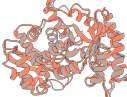

> Figure 3 presents the results of DPLM-2 for unconditional protein generation, showing its ability to generate diverse and high-quality proteins with simultaneous structure-sequence co-generation, as well as its performance in structure novelty, diversity, and length extrapolation.

More on charts

> Figure 3 presents the evaluation results of DPLM-2's unconditional protein generation, showcasing its ability to generate diverse and high-quality proteins with simultaneous structure and sequence co-generation, demonstrating protein designability, structure diversity, sequence foldability, and structure novelty across various protein lengths.

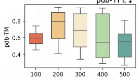

> Figure 3 presents the evaluation results of DPLM-2 for unconditional protein generation, showing the designability, diversity, novelty, and length extrapolation of the generated protein sequences and structures.

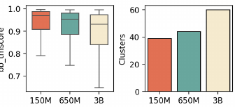

> Figure 3 shows the evaluation results of DPLM-2 on unconditional protein generation, assessing designability, diversity, novelty, and length extrapolation of generated protein sequences and structures.

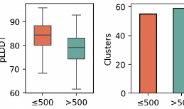

> Figure 3 presents the evaluation results of DPLM-2's unconditional structure-sequence co-generation performance in terms of designability, diversity, novelty, and length extrapolation.

> The chart compares the performance of different models (EvoDiff, DPLM, ESM3, DPLM2, RFDiffusion) on motif-scaffolding tasks, showing the number of solved problems and success rates for sequence-based, structure-based, and co-generation approaches.

More on tables


 <table id='5' style='font-size:14px'><tr><td rowspan="2">sequence pre-training</td><td rowspan="2">synthetic structures</td><td colspan="2">length 100</td><td colspan="2">length 200</td><td colspan="2">length 300</td><td colspan="2">length 400</td><td colspan="2">length 500</td></tr><tr><td>scTM</td><td>clusters</td><td>scTM</td><td>clusters</td><td>scTM</td><td>clusters</td><td>scTM</td><td>clusters</td><td>scTM</td><td>clusters</td></tr><tr><td>X</td><td>X</td><td>0.9241</td><td>20</td><td>0.8674</td><td>34</td><td>0.7667</td><td>33</td><td>0.5016</td><td>25</td><td>0.4511</td><td>25</td></tr><tr><td>V</td><td>X</td><td>0.9610</td><td>26</td><td>0.9349</td><td>47</td><td>0.9169</td><td>38</td><td>0.8643</td><td>35</td><td>0.7673</td><td>52</td></tr><tr><td>X</td><td>V</td><td>0.8988</td><td>27</td><td>0.9182</td><td>15</td><td>0.9343</td><td>13</td><td>0.8518</td><td>21</td><td>0.8288</td><td>31</td></tr><tr><td></td><td>V</td><td>0.9348</td><td>35</td><td>0.9428</td><td>40</td><td>0.9232</td><td>48</td><td>0.9260</td><td>40</td><td>0.9012</td><td>32</td></tr></table>

> Table 3 shows the ablation study results on the effects of sequence pre-training and data augmentation on the unconditional protein generation performance of DPLM-2, demonstrating that both strategies significantly improve the model's performance, especially in generating long proteins.


<table id='11' style='font-size:14px'><tr><td rowspan="2">Models</td><td colspan="2">CAMEO 2022</td><td colspan="2">PDB date split</td></tr><tr><td>RMSD</td><td>TMscore</td><td>RMSD</td><td>TMscore</td></tr><tr><td>ESMFold</td><td>3.99/2.03</td><td>0.85/0.93</td><td>2.84/1.19</td><td>0.93/0.97</td></tr><tr><td>+PVQD</td><td>4.08/1.95</td><td>0.81/0.88</td><td>-</td><td>-</td></tr><tr><td>MultiFlow</td><td>17.84/17.96</td><td>0.50/0.46</td><td>15.64/16.08</td><td>0.53/0.49</td></tr><tr><td>ESM3</td><td>6.33/2.98</td><td>0.85/0.92</td><td>4.94/2.28</td><td>0.87/0.93</td></tr><tr><td>DPLM-2 (150M)</td><td>9.22/7.64</td><td>0.75/0.81</td><td>8.35/5.60</td><td>0.76/0.82</td></tr><tr><td>w/ folding SFT</td><td>7.66/4.37</td><td>0.80/0.86</td><td>6.00/3.41</td><td>0.83/0.88</td></tr><tr><td>DPLM-2 (650M)</td><td>7.37/4.89</td><td>0.79/0.86</td><td>5.67/3.33</td><td>0.83/0.88</td></tr><tr><td>w/ folding SFT</td><td>6.21/3.78</td><td>0.84/0.89</td><td>3.40/1.78</td><td>0.89/0.94</td></tr><tr><td>DPLM-2 (3B)</td><td>6.34/3.65</td><td>0.83/0.89</td><td>4.54/2.54</td><td>0.86/0.92</td></tr><tr><td>w/ folding SFT</td><td>5.71/3.23</td><td>0.85/0.90</td><td>3.15/1.69</td><td>0.90/0.95</td></tr></table>

> Table 4 compares the structure prediction performance of DPLM-2 against several other state-of-the-art methods on the CAMEO 2022 dataset, using RMSD and TMscore as evaluation metrics.


 <table id='6' style='font-size:16px'><tr><td rowspan="2">Models</td><td colspan="2">CAMEO 2022</td><td colspan="2">PDB date split</td></tr><tr><td>AAR</td><td>scTM</td><td>AAR</td><td>scTM</td></tr><tr><td>MultiFlow</td><td>32.28/33.58</td><td>0.87/0.94</td><td>37.74/37.59</td><td>0.94/0.96</td></tr><tr><td>ESM3</td><td>47.06/46.24</td><td>0.90/0.95</td><td>49.50/49.42</td><td>0.94/0.97</td></tr><tr><td>DPLM-2 (150M)</td><td>45.22/46.12</td><td>0.87/0.93</td><td>48.83/47.96</td><td>0.89/0.95</td></tr><tr><td>DPLM-2 (650M)</td><td>49.01/50.10</td><td>0.88/0.93</td><td>54.80/53/07</td><td>0.91/0.96</td></tr><tr><td>DPLM-2 (3B)</td><td>52.36/53.72</td><td>0.89/0.95</td><td>61.67/57.91</td><td>0.92/0.96</td></tr></table>

> Table 5 presents the performance comparison of different models on the inverse folding task, evaluating amino acid recovery (AAR) and structure consistency (scTM).


 <table id='14' style='font-size:14px'><tr><td rowspan="3">Models</td><td rowspan="2">Thermostability</td><td rowspan="2">HumanPPI</td><td rowspan="2">Metal Ion Binding</td><td rowspan="2">EC</td><td colspan="3">GO</td><td colspan="2">DeepLoc</td></tr><tr><td>MF</td><td>BP</td><td>CC</td><td>Subcellular</td><td>Binary</td></tr><tr><td>Spearman' S P</td><td>Acc (%)</td><td>Acc (%)</td><td>Fmax</td><td>Fmax</td><td>Fmax</td><td>Fmax</td><td>Acc (%)</td><td>Acc (%)</td></tr><tr><td>†SaProt (650M)</td><td>0.724</td><td>86.41</td><td>75.75</td><td>0.884</td><td>0.678</td><td>0.356</td><td>0.414</td><td>85.57</td><td>93.55</td></tr><tr><td>+MIF-ST (Yang et al., 2022b)</td><td>0.694</td><td>75.54</td><td>75.08</td><td>0.803</td><td>0.627</td><td>0.239</td><td>0.248</td><td>78.96</td><td>91.76</td></tr><tr><td>ESM2 (650M)</td><td>0.691</td><td>84.78</td><td>71.88</td><td>0.866</td><td>0.676</td><td>0.344</td><td>0.402</td><td>83.68</td><td>92.28</td></tr><tr><td>DPLM (650M)</td><td>0.695</td><td>86.41</td><td>75.15</td><td>0.875</td><td>0.680</td><td>0.357</td><td>0.409</td><td>84.56</td><td>93.09</td></tr><tr><td>DPLM-2 (650M)</td><td>0.714</td><td>84.44</td><td>74.28</td><td>0.878</td><td>0.680</td><td>0.359</td><td>0.411</td><td>82.98</td><td>93.64</td></tr></table>

> Table 6 presents the performance comparison of different protein language models on various protein predictive downstream tasks, including thermostability, HumanPPI, metal ion binding, EC, GO (MF, BP, CC), DeepLoc (subcellular and binary).


 <table id='7' style='font-size:14px'><tr><td rowspan="2">Mixup strategy</td><td colspan="2">length 100</td><td colspan="2">length 200</td><td colspan="2">length 300</td><td colspan="2">length 400</td><td colspan="2">length 500</td></tr><tr><td>scTM</td><td>clusters</td><td>scTM</td><td>clusters</td><td>scTM</td><td>clusters</td><td>scTM</td><td>clusters</td><td>scTM</td><td>clusters</td></tr><tr><td>X</td><td>0.9237</td><td>44</td><td>0.9180</td><td>53</td><td>0.9147</td><td>48</td><td>0.9059</td><td>42</td><td>0.8896</td><td>33</td></tr><tr><td>V</td><td>0.8812</td><td>62</td><td>0.8820</td><td>62</td><td>0.9172</td><td>59</td><td>0.9099</td><td>54</td><td>0.8845</td><td>38</td></tr></table>

> Table 8 shows the ablation study results on the self-mixup training strategy, demonstrating its effect on the diversity of generated protein samples at different lengths.


 <table id='3' style='font-size:14px'><tr><td>prediction motif-preserving designability</td><td>seqpred: V structpred: x RMSD (ESMFold ( seqpred) [motif] , structnative [motif] )<1.0 pLDDT (ESMFold( seqpred) )>70</td></tr><tr><td>structure-based</td><td>seqpred: x structpred: V</td></tr><tr><td>prediction motif-preserving designability</td><td>RMSD ( ESMFold ( PMPNN ( structpred) ) [motif] , structnative [motif] )<1.0 TMScore (ESMFold (PMPNN ( structpred) ) , structpred)>0.8</td></tr><tr><td>co-generation prediction motif-preserving designability</td><td>seqpred⌀ V structpred: V RMSD (ESMFold ( seqpred) [motif] , structnative [motif] )<1.0 TMScore (ESMFold( seqpred) , structpred)>0.8</td></tr></table>

> Table 2 compares the performance of DPLM-2 with other unconditional protein generation methods in terms of quality, novelty, and diversity of generated protein sequences and structures.


 <table id='2' style='font-size:14px'><tr><td rowspan="2"></td><td colspan="4">sequence-based</td><td colspan="2">structure-based</td><td colspan="3">co-generation</td></tr><tr><td>EvoDiff</td><td>DPLM</td><td>ESM3</td><td>DPLM2</td><td>*RFDiffusion</td><td>*DPLM2</td><td>ESM3</td><td>DPLM2</td><td>*DPLM2</td></tr><tr><td>1BCF</td><td>0.00</td><td>0.00</td><td>0.89</td><td>0.01</td><td>1.00</td><td>0.07</td><td>0.23</td><td>0.01</td><td>0.05</td></tr><tr><td>1PRW</td><td>0.61</td><td>0.83</td><td>0.96</td><td>0.86</td><td>0.08</td><td>0.96</td><td>0.54</td><td>0.84</td><td>0.95</td></tr><tr><td>1QJG</td><td>0.00</td><td>0.00</td><td>0.02</td><td>0.03</td><td>0.00</td><td>0.00</td><td>0.03</td><td>0.02</td><td>0.05</td></tr><tr><td>1YCR</td><td>0.02</td><td>0.38</td><td>0.41</td><td>0.77</td><td>0.74</td><td>0.93</td><td>0.18</td><td>0.53</td><td>0.98</td></tr><tr><td>2KL8</td><td>0.04</td><td>0.08</td><td>0.11</td><td>0.47</td><td>0.88</td><td>0.94</td><td>0.11</td><td>0.57</td><td>1.00</td></tr><tr><td>3IXT</td><td>0.06</td><td>0.17</td><td>0.18</td><td>0.67</td><td>0.25</td><td>0.77</td><td>0.02</td><td>0.41</td><td>0.73</td></tr><tr><td>4JHW</td><td>0.00</td><td>0.00</td><td>0.00</td><td>0.00</td><td>0.00</td><td>0.00</td><td>0.00</td><td>0.00</td><td>0.00</td></tr><tr><td>4ZYP</td><td>0.00</td><td>0.00</td><td>0.03</td><td>0.16</td><td>0.40</td><td>0.51</td><td>0.08</td><td>0.10</td><td>0.64</td></tr><tr><td>5IUS</td><td>0.00</td><td>0.00</td><td>0.00</td><td>0.00</td><td>0.02</td><td>0.00</td><td>0.00</td><td>0.00</td><td>0.00</td></tr><tr><td>5TPN</td><td>0.00</td><td>0.00</td><td>0.03</td><td>0.00</td><td>0.61</td><td>0.06</td><td>0.01</td><td>0.00</td><td>0.00</td></tr><tr><td>5TRV _long</td><td>0.00</td><td>0.00</td><td>0.19</td><td>0.00</td><td>0.37</td><td>0.08</td><td>0.19</td><td>0.00</td><td>0.07</td></tr><tr><td>5TRV _med</td><td>0.00</td><td>0.00</td><td>0.16</td><td>0.03</td><td>0.24</td><td>0.07</td><td>0.16</td><td>0.02</td><td>0.19</td></tr><tr><td>5TRV_short</td><td>0.00</td><td>0.00</td><td>0.01</td><td>0.07</td><td>0.04</td><td>0.10</td><td>0.01</td><td>0.03</td><td>0.11</td></tr><tr><td>5WN9</td><td>0.00</td><td>0.00</td><td>0.02</td><td>0.00</td><td>0.00</td><td>0.20</td><td>0.00</td><td>0.00</td><td>0.00</td></tr><tr><td>5YUI</td><td>0.00</td><td>0.00</td><td>0.00</td><td>0.00</td><td>0.02</td><td>0.00</td><td>0.00</td><td>0.00</td><td>0.00</td></tr><tr><td>6E6R_long</td><td>0.01</td><td>0.65</td><td>0.07</td><td>0.91</td><td>0.86</td><td>0.92</td><td>0.04</td><td>0.78</td><td>1.00</td></tr><tr><td>6E6R_med</td><td>0.03</td><td>0.94</td><td>0.24</td><td>0.93</td><td>0.89</td><td>0.88</td><td>0.14</td><td>0.77</td><td>0.97</td></tr><tr><td>6E6R_short</td><td>0.07</td><td>0.87</td><td>0.09</td><td>0.86</td><td>0.39</td><td>0.78</td><td>0.06</td><td>0.64</td><td>0.99</td></tr><tr><td>6EXZ_long</td><td>0.00</td><td>0.01</td><td>0.32</td><td>0.61</td><td>0.76</td><td>0.63</td><td>0.13</td><td>0.44</td><td>0.95</td></tr><tr><td>6EXZ_med</td><td>0.00</td><td>0.00</td><td>0.31</td><td>0.66</td><td>0.49</td><td>0.63</td><td>0.31</td><td>0.55</td><td>0.96</td></tr><tr><td>6EXZ_short</td><td>0.00</td><td>0.00</td><td>0.31</td><td>0.66</td><td>0.39</td><td>0.41</td><td>0.28</td><td>0.58</td><td>0.87</td></tr><tr><td>7MRX_long</td><td>0.00</td><td>0.02</td><td>0.36</td><td>0.23</td><td>0.09</td><td>0.32</td><td>0.37</td><td>0.20</td><td>0.73</td></tr><tr><td>7MRX_med</td><td>0.00</td><td>0.31</td><td>0.65</td><td>0.28</td><td>0.11</td><td>0.31</td><td>0.59</td><td>0.22</td><td>0.70</td></tr><tr><td>7MRX. _short</td><td>0.00</td><td>0.34</td><td>0.68</td><td>0.26</td><td>0.02</td><td>0.41</td><td>0.74</td><td>0.24</td><td>0.88</td></tr><tr><td>pass rate</td><td>7/24</td><td>11/24</td><td>21/24</td><td>18/24</td><td>20/24</td><td>20/24</td><td>20/24</td><td>18/24</td><td>19/24</td></tr><tr><td>avg. success rate</td><td>0.04</td><td>0.19</td><td>0.25</td><td>0.35</td><td>0.40</td><td>0.42</td><td>0.18</td><td>0.29</td><td>0.53</td></tr></table>

> Table 2 benchmarks the performance of DPLM-2 against other methods on unconditional protein generation tasks, evaluating various metrics across different protein lengths and generation approaches.

### Full paper


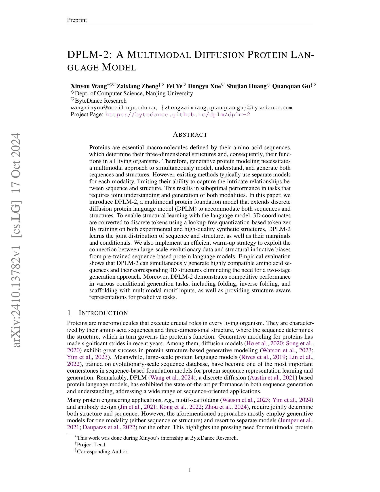

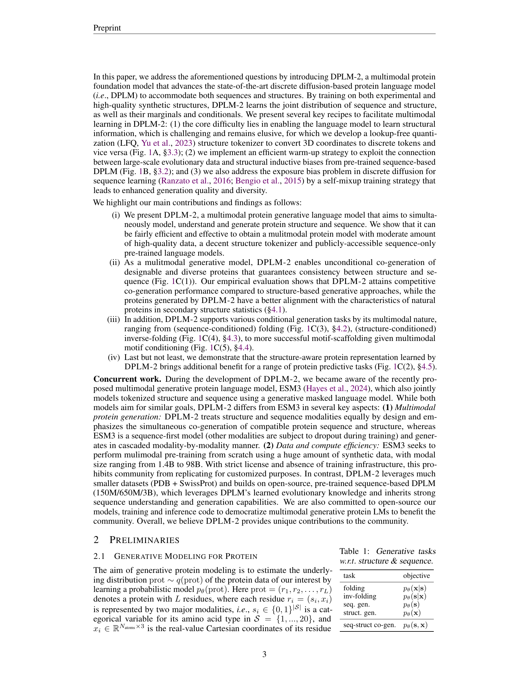

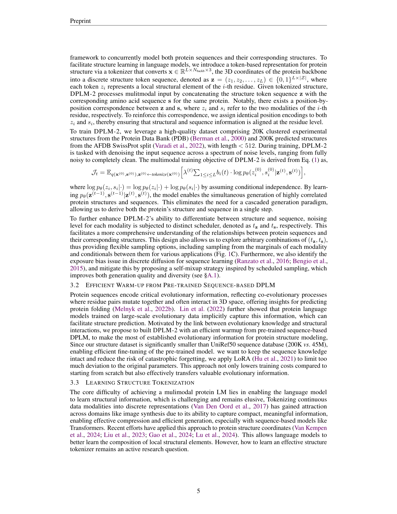
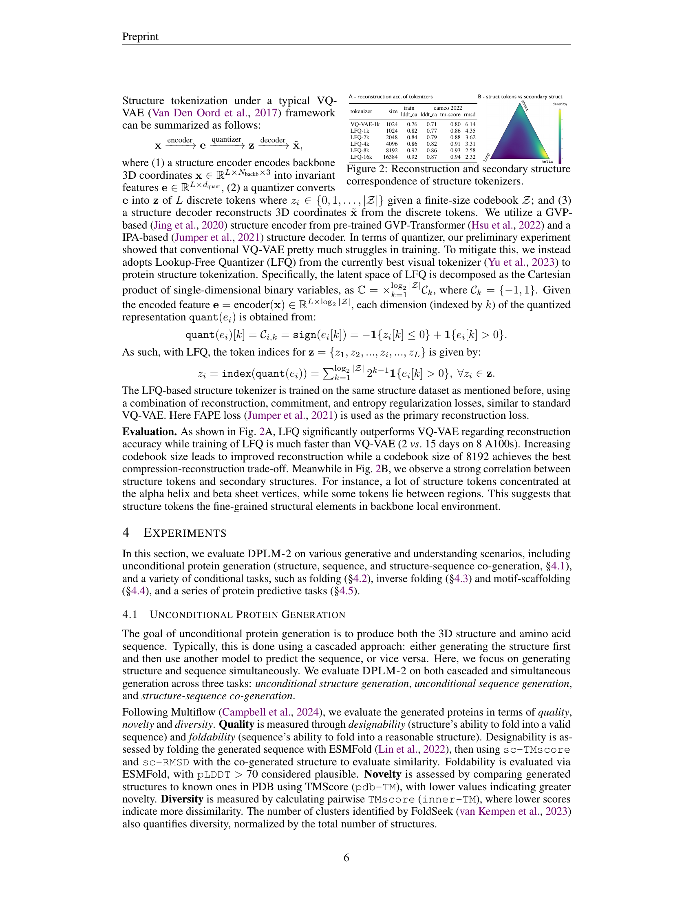

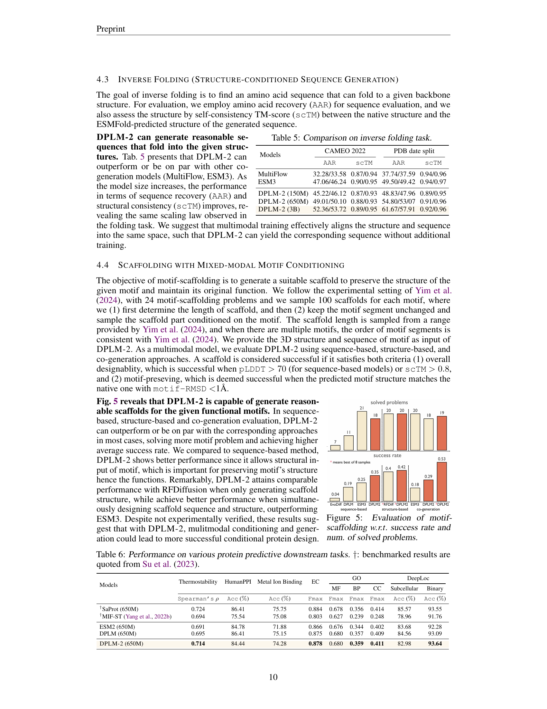
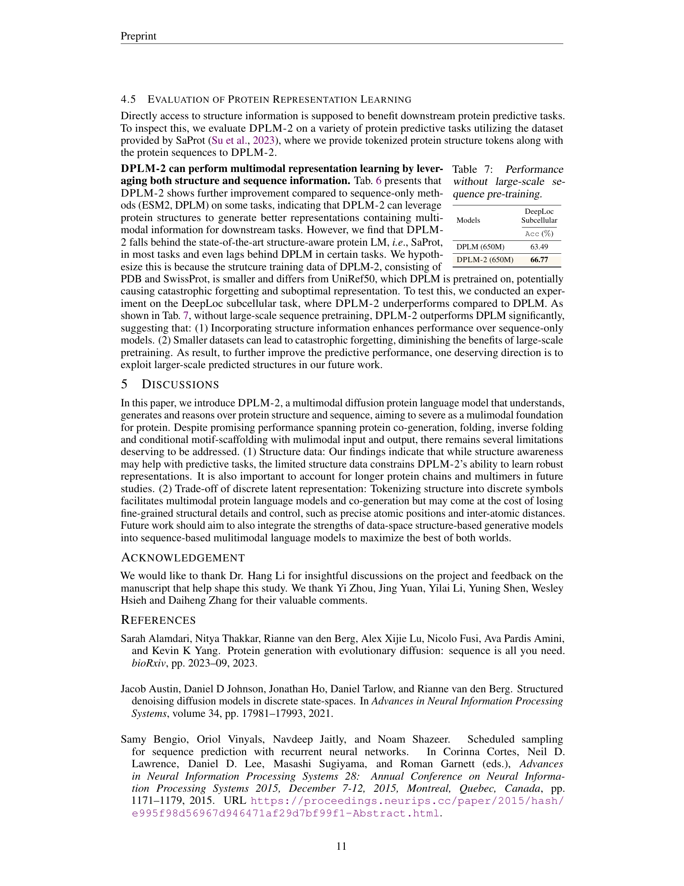

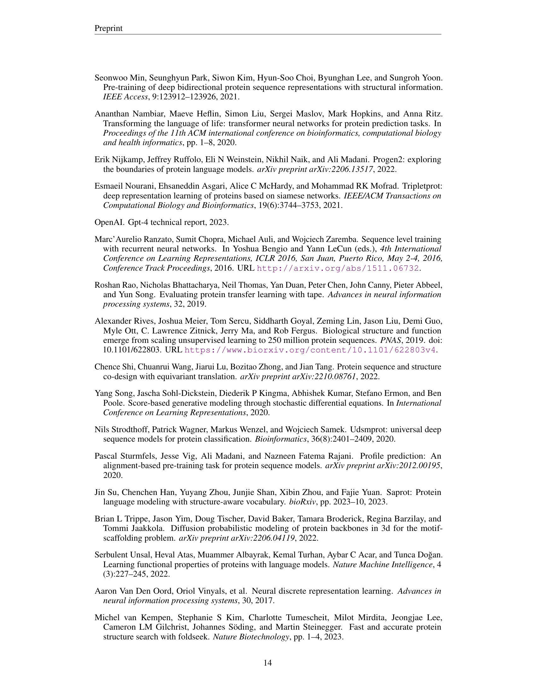

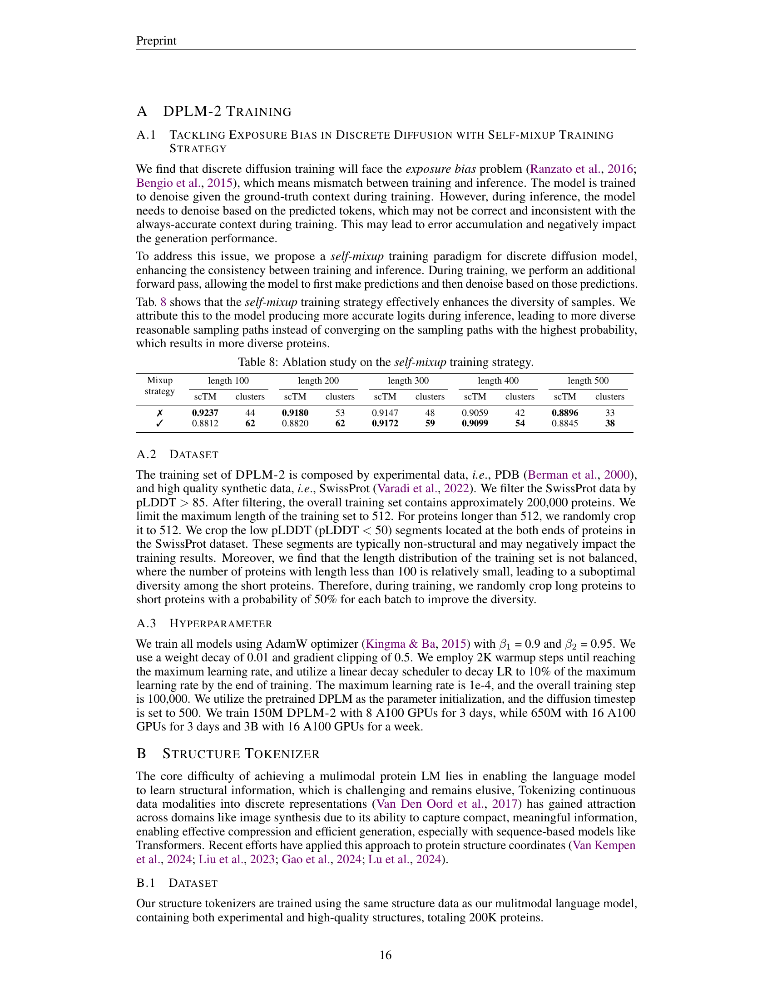
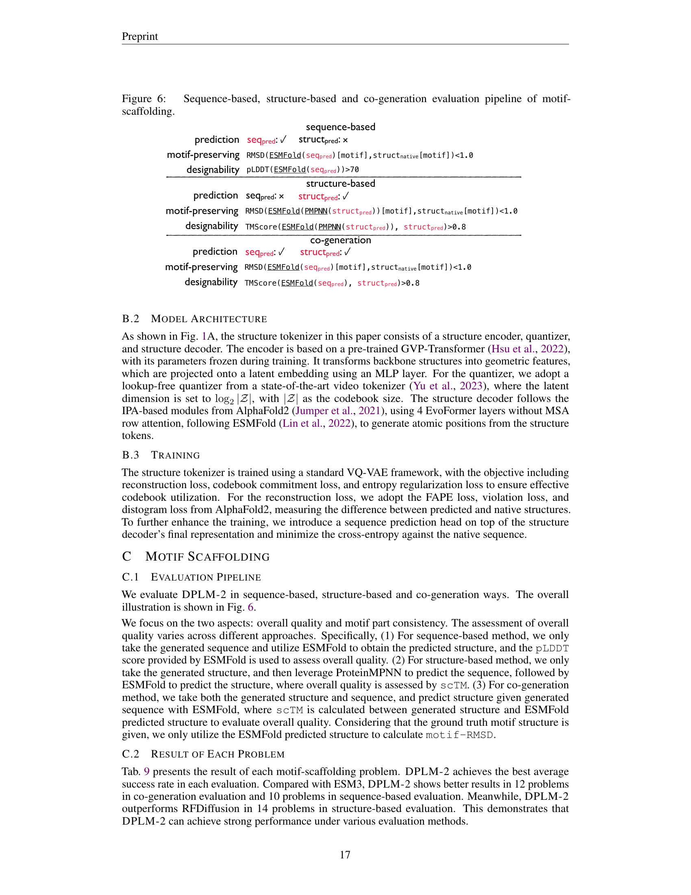
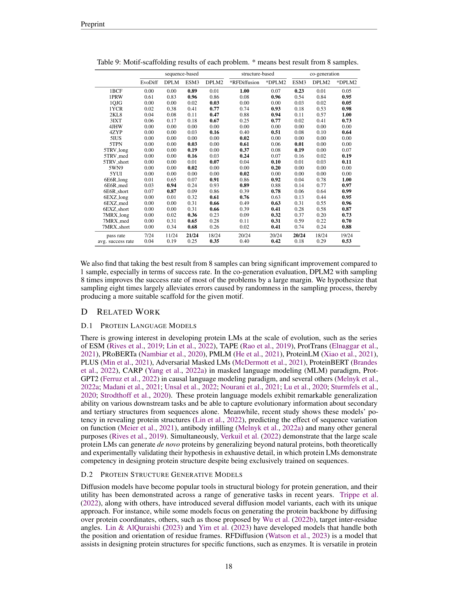

