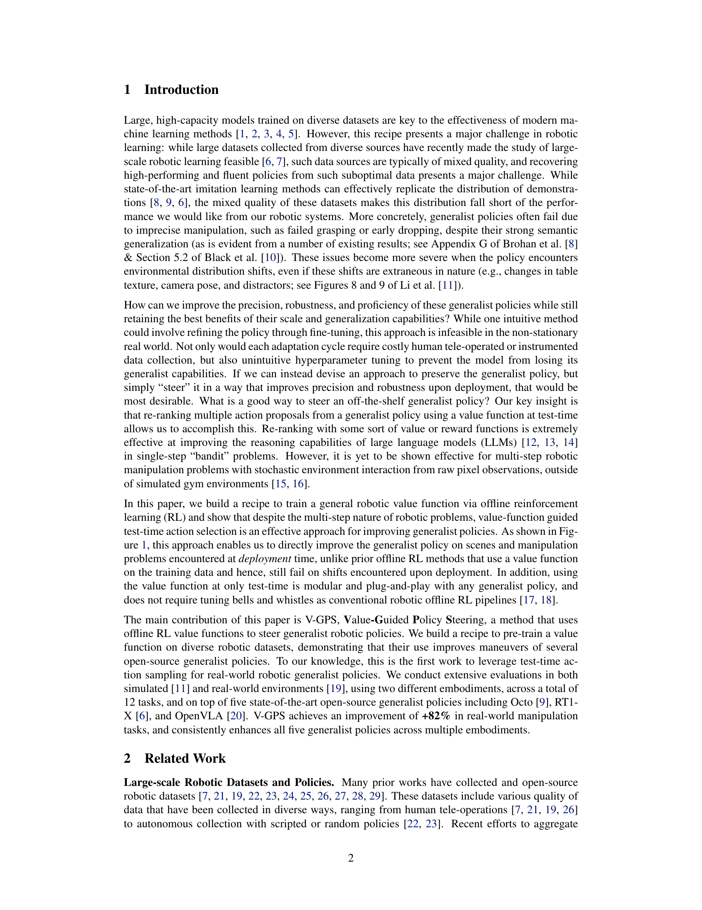
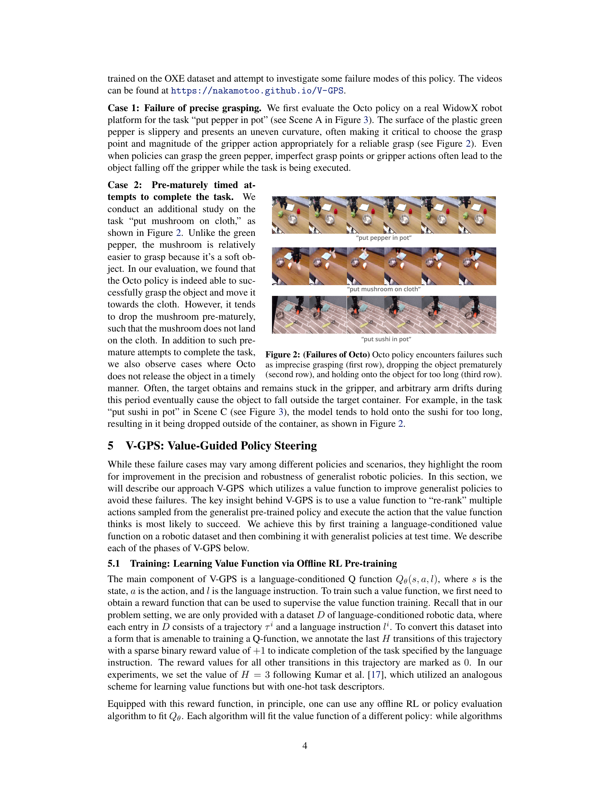
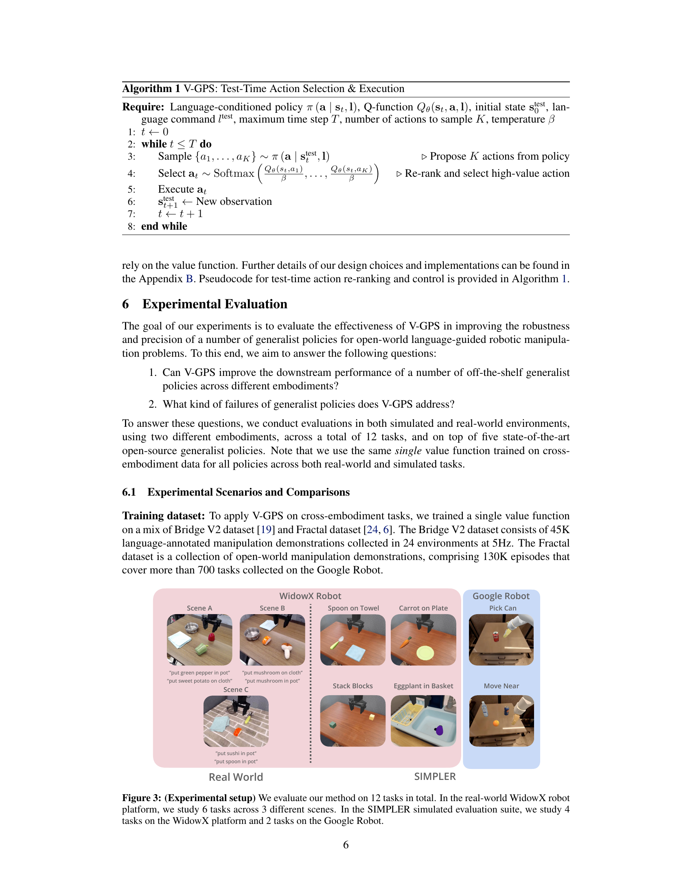
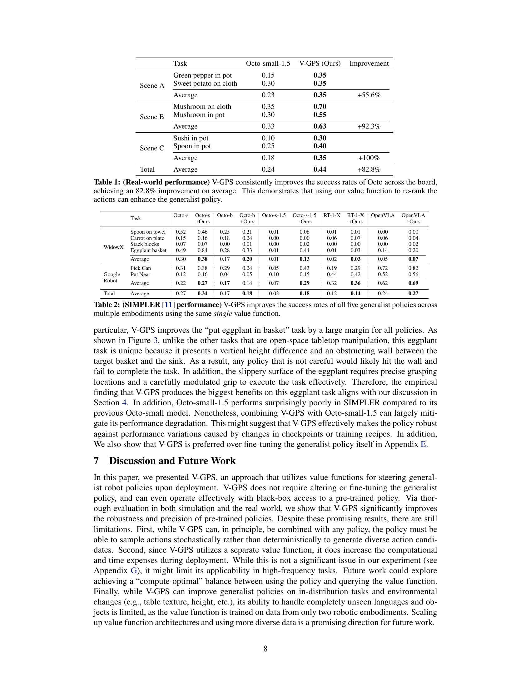
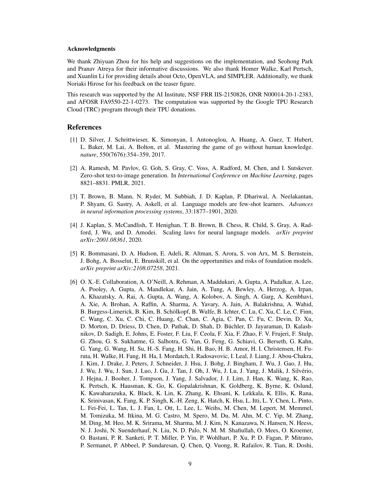
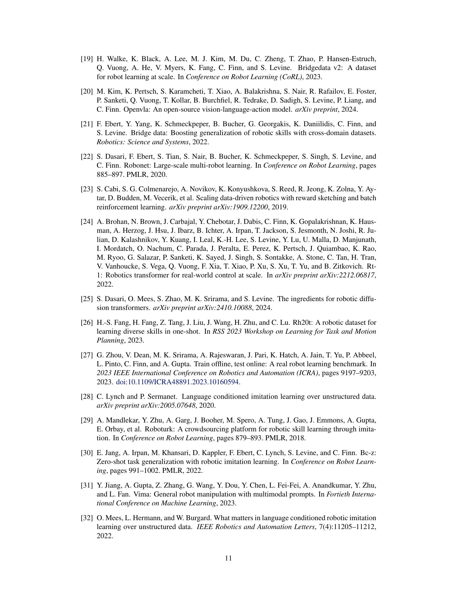
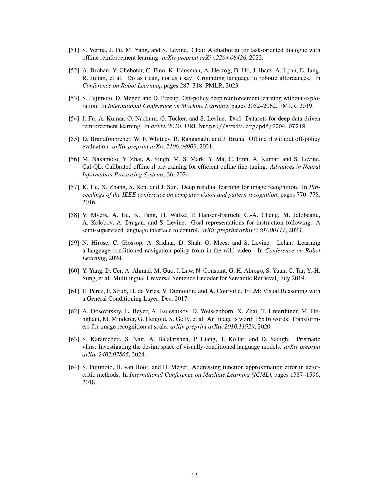
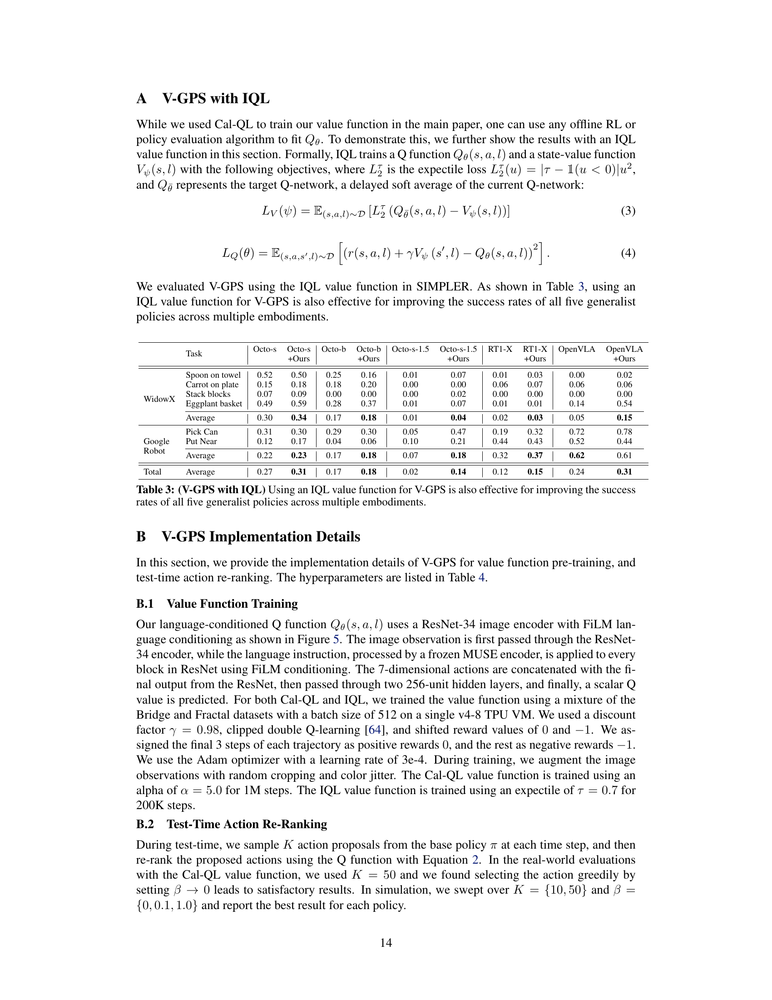
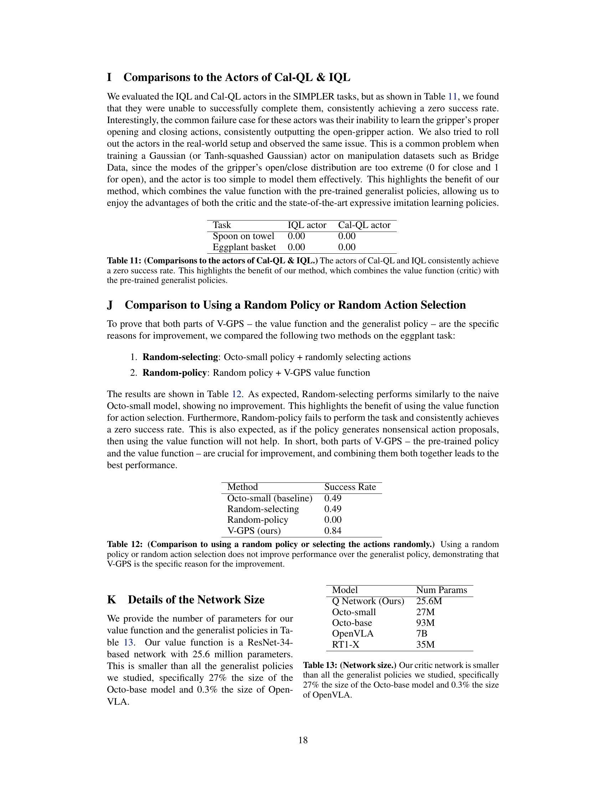

### TL;DR



This research introduces Value-Guided Policy Steering (V-GPS), a novel method to significantly improve the performance of existing general-purpose robotic policies.  Instead of retraining these large models which is computationally expensive and may lead to unintended loss of generalizability, V-GPS uses a value function learned via offline reinforcement learning (RL).  This value function acts as a filter that reranks the multiple action proposals made by the pre-trained robotic policy, selecting those with the highest predicted value.  Importantly, V-GPS works as a plug-and-play module; it doesn't need to fine-tune or even access the internal parameters of the existing policies.  Experimental results across 12 real-world and simulated robotic tasks, using 5 different state-of-the-art policies and 2 different robotic platforms, demonstrate consistent and substantial performance gains, often exceeding 80% improvement in some cases. The approach elegantly addresses common failure modes observed in pre-trained policies, like imprecise grasping and poorly timed actions. This research opens a new avenue for improving the reliability and efficiency of robotic systems, particularly in complex and unpredictable real-world scenarios. The modular nature of V-GPS makes it highly adaptable to different robots and tasks.




 &nbsp; read the paper on arXiv


#### Why does it matter?
To summarize the provided research paper on improving robotic foundation models using Value-Guided Policy Steering (V-GPS), extracting core information in a concise and engaging manner for researchers.
#### Key Takeaways


 Value-Guided Policy Steering (V-GPS) enhances the performance of generalist robotic policies at deployment time. 



 V-GPS is compatible with various generalist policies and doesn't require fine-tuning or access to policy weights. 



 V-GPS shows consistent performance improvements across multiple robotic platforms and various tasks. 


------
#### Visual Insights

 We introduce Value-Guided Policy Steering (V-GPS), a novel approach that improves the performance of pre-trained generalist robotic policies by re-ranking their actions at deployment time based on a value function learned via offline RL. The same single V-GPS value function can be combined with any off-the-shelf generalist policy in a plug-and-play manner, without the need to fine-tune or access the policy's weights, improving downstream performance across multiple robotic platforms.")

> The figure illustrates the Value-Guided Policy Steering (V-GPS) process, showing how a value function learned via offline RL is used to re-rank action proposals from a generalist robot policy at test time to improve performance.


<table id='0' style='font-size:14px'><tr><td colspan="2">Task</td><td>Octo-small-1.5</td><td>V-GPS (Ours)</td><td>Improvement</td></tr><tr><td rowspan="3">Scene A</td><td>Green pepper in pot</td><td>0.15</td><td>0.35</td><td></td></tr><tr><td>Sweet potato on cloth</td><td>0.30</td><td>0.35</td><td></td></tr><tr><td>Average</td><td>0.23</td><td>0.35</td><td>+55.6%</td></tr><tr><td rowspan="3">Scene B</td><td>Mushroom on cloth</td><td>0.35</td><td>0.70</td><td></td></tr><tr><td>Mushroom in pot</td><td>0.30</td><td>0.55</td><td></td></tr><tr><td>Average</td><td>0.33</td><td>0.63</td><td>+92.3%</td></tr><tr><td rowspan="3">Scene C</td><td>Sushi in pot</td><td>0.10</td><td>0.30</td><td></td></tr><tr><td>Spoon in pot</td><td>0.25</td><td>0.40</td><td></td></tr><tr><td>Average</td><td>0.18</td><td>0.35</td><td>+100%</td></tr><tr><td>Total</td><td>Average</td><td>0.24</td><td>0.44</td><td>+82.8%</td></tr></table>

> Table 1 presents the real-world performance improvement of V-GPS across six manipulation tasks using the Octo-small-1.5 policy on a WidowX robot.

### More visual insights

More on figures

 We evaluate our method on 12 tasks in total. In the real-world WidowX robot platform, we study 6 tasks across 3 different scenes. In the SIMPLER simulated evaluation suite, we study 4 tasks on the WidowX platform and 2 tasks on the Google Robot.")

> The figure shows the experimental setup used in the paper, illustrating the real-world and simulated environments used for evaluation, along with the tasks performed on different robot platforms.

 We introduce Value-Guided Policy Steering (V-GPS), a novel approach that improves the performance of pre-trained generalist robotic policies by re-ranking their actions at deployment time based on a value function learned via offline RL. The same single V-GPS value function can be combined with any off-the-shelf generalist policy in a plug-and-play manner, without the need to fine-tune or access the policy's weights, improving downstream performance across multiple robotic platforms.")

> The figure illustrates the Value-Guided Policy Steering (V-GPS) method, showing how a value function is used to re-rank action proposals from a generalist robot policy, leading to improved task performance.

 We introduce Value-Guided Policy Steering (V-GPS), a novel approach that improves the performance of pre-trained generalist robotic policies by re-ranking their actions at deployment time based on a value function learned via offline RL. The same single V-GPS value function can be combined with any off-the-shelf generalist policy in a plug-and-play manner, without the need to fine-tune or access the policy's weights, improving downstream performance across multiple robotic platforms.")

> The figure illustrates the Value-Guided Policy Steering (V-GPS) approach, showing how a value function is used to re-rank action proposals from a generalist robot policy at test time, improving performance.

More on tables


<table id='2' style='font-size:14px'><tr><td colspan="2">Task</td><td>Octo-s</td><td>Octo-s +Ours</td><td>Octo-b</td><td>Octo-b +Ours</td><td>Octo-s-1.5</td><td>Octo-s-1.5 +Ours</td><td>RT-1-X</td><td>RT-1-X +Ours</td><td>OpenVLA</td><td>OpenVLA +Ours</td></tr><tr><td rowspan="5">WidowX</td><td>Spoon on towel</td><td>0.52</td><td>0.46</td><td>0.25</td><td>0.21</td><td>0.01</td><td>0.06</td><td>0.01</td><td>0.01</td><td>0.00</td><td>0.00</td></tr><tr><td>Carrot on plate</td><td>0.15</td><td>0.16</td><td>0.18</td><td>0.24</td><td>0.00</td><td>0.00</td><td>0.06</td><td>0.07</td><td>0.06</td><td>0.04</td></tr><tr><td>Stack blocks</td><td>0.07</td><td>0.07</td><td>0.00</td><td>0.01</td><td>0.00</td><td>0.02</td><td>0.00</td><td>0.00</td><td>0.00</td><td>0.02</td></tr><tr><td>Eggplant basket</td><td>0.49</td><td>0.84</td><td>0.28</td><td>0.33</td><td>0.01</td><td>0.44</td><td>0.01</td><td>0.03</td><td>0.14</td><td>0.20</td></tr><tr><td>Average</td><td>0.30</td><td>0.38</td><td>0.17</td><td>0.20</td><td>0.01</td><td>0.13</td><td>0.02</td><td>0.03</td><td>0.05</td><td>0.07</td></tr><tr><td rowspan="3">Google Robot</td><td>Pick Can</td><td>0.31</td><td>0.38</td><td>0.29</td><td>0.24</td><td>0.05</td><td>0.43</td><td>0.19</td><td>0.29</td><td>0.72</td><td>0.82</td></tr><tr><td>Put Near</td><td>0.12</td><td>0.16</td><td>0.04</td><td>0.05</td><td>0.10</td><td>0.15</td><td>0.44</td><td>0.42</td><td>0.52</td><td>0.56</td></tr><tr><td>Average</td><td>0.22</td><td>0.27</td><td>0.17</td><td>0.14</td><td>0.07</td><td>0.29</td><td>0.32</td><td>0.36</td><td>0.62</td><td>0.69</td></tr><tr><td>Total</td><td>Average</td><td>0.27</td><td>0.34</td><td>0.17</td><td>0.18</td><td>0.02</td><td>0.18</td><td>0.12</td><td>0.14</td><td>0.24</td><td>0.27</td></tr></table>

> Table 2 presents the average success rates of five different generalist robotic policies across multiple robot embodiments on twelve SIMPLER tasks, comparing their performance with and without the V-GPS method.


<table id='7' style='font-size:14px'><tr><td colspan="2">Task</td><td>Octo-s</td><td>Octo-s +Ours</td><td>Octo-b</td><td>Octo-b +Ours</td><td>Octo-s-1.5</td><td>Octo-s-1.5 +Ours</td><td>RT1-X</td><td>RT1-X +Ours</td><td>OpenVLA</td><td>OpenVLA +Ours</td></tr><tr><td rowspan="5">WidowX</td><td>Spoon on towel</td><td>0.52</td><td>0.50</td><td>0.25</td><td>0.16</td><td>0.01</td><td>0.07</td><td>0.01</td><td>0.03</td><td>0.00</td><td>0.02</td></tr><tr><td>Carrot on plate</td><td>0.15</td><td>0.18</td><td>0.18</td><td>0.20</td><td>0.00</td><td>0.00</td><td>0.06</td><td>0.07</td><td>0.06</td><td>0.06</td></tr><tr><td>Stack blocks</td><td>0.07</td><td>0.09</td><td>0.00</td><td>0.00</td><td>0.00</td><td>0.02</td><td>0.00</td><td>0.00</td><td>0.00</td><td>0.00</td></tr><tr><td>Eggplant basket</td><td>0.49</td><td>0.59</td><td>0.28</td><td>0.37</td><td>0.01</td><td>0.07</td><td>0.01</td><td>0.01</td><td>0.14</td><td>0.54</td></tr><tr><td>Average</td><td>0.30</td><td>0.34</td><td>0.17</td><td>0.18</td><td>0.01</td><td>0.04</td><td>0.02</td><td>0.03</td><td>0.05</td><td>0.15</td></tr><tr><td rowspan="3">Google Robot</td><td>Pick Can</td><td>0.31</td><td>0.30</td><td>0.29</td><td>0.30</td><td>0.05</td><td>0.47</td><td>0.19</td><td>0.32</td><td>0.72</td><td>0.78</td></tr><tr><td>Put Near</td><td>0.12</td><td>0.17</td><td>0.04</td><td>0.06</td><td>0.10</td><td>0.21</td><td>0.44</td><td>0.43</td><td>0.52</td><td>0.44</td></tr><tr><td>Average</td><td>0.22</td><td>0.23</td><td>0.17</td><td>0.18</td><td>0.07</td><td>0.18</td><td>0.32</td><td>0.37</td><td>0.62</td><td>0.61</td></tr><tr><td>Total</td><td>Average</td><td>0.27</td><td>0.31</td><td>0.17</td><td>0.18</td><td>0.02</td><td>0.14</td><td>0.12</td><td>0.15</td><td>0.24</td><td>0.31</td></tr></table>

> Table 2 presents the average success rates of five different generalist robotic policies on 12 tasks, comparing performance with and without the V-GPS value function.


<table id='2' style='font-size:18px'><tr><td>Cal-QL a</td><td>5.0</td></tr><tr><td>IQL expectile T</td><td>0.7</td></tr><tr><td>discount factor</td><td>0.98</td></tr><tr><td>learning rate</td><td>3e-4</td></tr><tr><td>positive reward steps H</td><td>3</td></tr><tr><td>number of actions to sample K</td><td>{10, 50}</td></tr><tr><td>softmax temperature B</td><td>{0, 0.1, 1.0}</td></tr></table>

> Table 1 presents the success rates of the Octo-small-1.5 policy and V-GPS (ours) on six real-world robotic manipulation tasks, showing consistent performance improvement with V-GPS.


<table id='0' style='font-size:14px'><tr><td></td><td>Language Instructions</td></tr><tr><td>Scene A</td><td>put the green pepper in the pot put the sweet potato on the cloth</td></tr><tr><td>Scene B</td><td>put the mushroom on the cloth put the mushroom in the pot</td></tr><tr><td>Scene C</td><td>put the sushi in the pot put the green spoon in the pot</td></tr></table>

> Table 1 shows the success rates of the Octo-small-1.5 policy with and without V-GPS across six real-world robotic manipulation tasks.


 <table id='2' style='font-size:14px'><tr><td></td><td>Language Instructions</td></tr><tr><td>WidowX</td><td>put the spoon on the towel put carrot on plate stack the green block on the yellow block put eggplant into yellow basket</td></tr><tr><td>Google Robot</td><td>pick coke can move {object1} near {object2}</td></tr></table>

> Table 2 presents the success rates of five different generalist policies across multiple robotic platforms and tasks, showing consistent performance improvements when using Value-Guided Policy Steering (V-GPS).


<table id='0' style='font-size:14px'><tr><td>Task</td><td>Octo-small</td><td>Octo-finetuned</td><td>Octo-scratch</td><td>Resnet-DP</td><td>Ours (IQL)</td><td>Ours (Cal-QL)</td></tr><tr><td>Spoon on towel</td><td>0.52</td><td>0.28</td><td>0.01</td><td>0.05</td><td>0.50</td><td>0.46</td></tr><tr><td>Carrot on Plate</td><td>0.15</td><td>0.12</td><td>0.01</td><td>0.01</td><td>0.18</td><td>0.15</td></tr><tr><td>Stack blocks</td><td>0.07</td><td>0.06</td><td>0.00</td><td>0.06</td><td>0.09</td><td>0.07</td></tr><tr><td>Eggplant basket</td><td>0.49</td><td>0.41</td><td>0.00</td><td>0.37</td><td>0.59</td><td>0.84</td></tr><tr><td>Average</td><td>0.30</td><td>0.22</td><td>0.01</td><td>0.12</td><td>0.34</td><td>0.38</td></tr></table>

> Table 7 compares the performance of V-GPS against fine-tuning generalist policies or training from scratch on the same dataset, demonstrating V-GPS's superior performance.


<table id='3' style='font-size:18px'><tr><td>Model</td><td>Success Rate</td></tr><tr><td>Octo-small (baseline)</td><td>0.49</td></tr><tr><td>Ours-100%</td><td>0.59</td></tr><tr><td>Ours-50%</td><td>0.59</td></tr><tr><td>Ours-10%</td><td>0.55</td></tr></table>

> Table 8 shows the ablation study on the size of datasets used to train the value function, demonstrating that even with reduced data, the value function can effectively improve the success rate of the generalist policies.


<table id='7' style='font-size:16px'><tr><td>Method</td><td>Inference time (s)</td><td>Overhead</td></tr><tr><td>Octo-small</td><td>0.0752</td><td>1.00</td></tr><tr><td>Ours K = 10</td><td>0.0963</td><td>1.28</td></tr><tr><td>Ours K = 30</td><td>0.1096</td><td>1.46</td></tr><tr><td>Ours K = 50</td><td>0.1196</td><td>1.59</td></tr><tr><td>Ours K = 100</td><td>0.1596</td><td>2.12</td></tr></table>

> Table 1 presents the real-world performance improvement of the Octo-small-1.5 policy across six tasks using Value-Guided Policy Steering (V-GPS).


<table id='11' style='font-size:16px'><tr><td>Task</td><td colspan="2">Eggplant</td><td colspan="2">Pick Coke</td></tr><tr><td>Offline RL method</td><td>IQL</td><td>Cal-QL</td><td>IQL</td><td>Cal-QL</td></tr><tr><td>Octo-small (baseline)</td><td>0.49</td><td>0.49</td><td>0.31</td><td>0.31</td></tr><tr><td>Ours K = 10</td><td>0.59</td><td>0.77</td><td>0.30</td><td>0.38</td></tr><tr><td>Ours K = 30</td><td>0.47</td><td>0.81</td><td>0.37</td><td>0.38</td></tr><tr><td>Ours K = 50</td><td>0.42</td><td>0.84</td><td>0.31</td><td>0.38</td></tr><tr><td>Ours K = 100</td><td>0.35</td><td>0.63</td><td>0.37</td><td>0.36</td></tr></table>

> Table 2 presents the average success rates of five different generalist robotic policies across multiple robot embodiments and tasks within the SIMPLER simulation environment, comparing their performance with and without V-GPS.


<table id='2' style='font-size:14px'><tr><td>Task</td><td>IQL actor</td><td>Cal-QL actor</td></tr><tr><td>Spoon on towel</td><td>0.00</td><td>0.00</td></tr><tr><td>Eggplant basket</td><td>0.00</td><td>0.00</td></tr></table>

> Table 11 shows that the IQL and Cal-QL actors fail to perform the tasks, highlighting the importance of combining a value function with pre-trained policies.


<table id='8' style='font-size:18px'><tr><td>Method</td><td>Success Rate</td></tr><tr><td>Octo-small (baseline)</td><td>0.49</td></tr><tr><td>Random-selecting</td><td>0.49</td></tr><tr><td>Random-policy</td><td>0.00</td></tr><tr><td>V-GPS (ours)</td><td>0.84</td></tr></table>

> Table 2 presents the average success rates of five different generalist policies across multiple robot embodiments on various tasks within the SIMPLER simulation environment, demonstrating consistent improvement with V-GPS.


 <table id='12' style='font-size:16px'><tr><td>Model</td><td>Num Params</td></tr><tr><td>Q Network (Ours)</td><td>25.6M</td></tr><tr><td>Octo-small</td><td>27M</td></tr><tr><td>Octo-base</td><td>93M</td></tr><tr><td>OpenVLA</td><td>7B</td></tr><tr><td>RT1-X</td><td>35M</td></tr></table>

> Table 1 presents the success rates of the Octo-small-1.5 policy and the V-GPS method on six real-world robotic manipulation tasks, showing a significant performance improvement by V-GPS.

### Full paper



