### TL;DR



The research introduces PUMA, a novel multimodal large language model (MLLM) designed to excel at a wide range of visual tasks.  Unlike previous models that typically focus on single-granularity features, PUMA processes and generates multi-granular visual representations – moving from coarse-grained semantic understanding to fine-grained details. This approach elegantly addresses the trade-off between generating diverse and highly realistic images (requiring coarse features) and performing tasks like precise image editing or manipulation (requiring fine-grained features).  PUMA's architecture includes an image encoder that extracts these multi-granular features, an autoregressive MLLM that processes them, and multiple diffusion-based decoders that reconstruct or generate images at the appropriate granularity.  The model is trained in two stages: first, a multimodal pretraining phase using a massive dataset of images and text; then, a task-specific instruction tuning phase.  Experimental results show that PUMA achieves state-of-the-art or competitive results across a variety of tasks such as text-to-image generation, image editing, conditional image generation, and image understanding.  The code and model will be released publicly, facilitating further research.




 &nbsp; read the paper on arXiv


#### Why does it matter?
PUMA is a novel multi-granular MLLM that excels in various visual tasks by unifying multi-scale visual features, addressing the diversity-controllability tradeoff in image generation.
#### Key Takeaways


 PUMA integrates multi-granular visual features, improving performance on diverse tasks. 



 The model addresses the trade-off between diversity and controllability in image generation. 



 PUMA demonstrates proficiency in image understanding, generation, editing, and more. 


------
#### Visual Insights

 Diversity and controllability tradeoff in image generation tasks: diverse text-to-image generation requires high diversity and fidelity, while tasks like conditional generation and manipulation require high controllability on the image. b) The introduced PUMA, a unified multimodal large language model that processes and generates multi-granular visual representations, balancing diversity and controllability across visual generation tasks. It excels in image understanding, diverse text-to-image generation, editing, inpainting, colorization, and conditional image generation.")

> Figure 1 demonstrates the diversity and controllability trade-offs in various image generation tasks and introduces PUMA, a unified multimodal large language model that addresses these trade-offs by generating multi-granular visual representations.


<table id='4' style='font-size:14px'><tr><td>Model</td><td>Encoder foundation</td><td>Token num.</td><td>PSNRT↑</td><td>LPIPST↓</td><td>PSNRd↓</td><td>LPIPSd↑</td></tr><tr><td>SEED-LLaMA (2023</td><td>BLIP-2 ViT (0.3B)</td><td>32</td><td>9.73</td><td>0.6756</td><td>10.45</td><td>0.6189</td></tr><tr><td>SEED-X 2024b</td><td>Qwen-VL Encoder (4B)</td><td>64</td><td>10.86</td><td>0.5152</td><td>11.60</td><td>0.4292</td></tr><tr><td>Emu2 2024b</td><td>EVA02-CLIP-E-plus (4B)</td><td>64</td><td>15.72</td><td>0.2532</td><td>16.07</td><td>0.2101</td></tr><tr><td>PUMA (f4 scale)</td><td>CLIP-Large (0.3B)</td><td>1</td><td>10.76</td><td>0.6481</td><td>12.82</td><td>0.5751</td></tr><tr><td>PUMA (f3 scale)</td><td>CLIP-Large (0.3B)</td><td>4</td><td>11.04</td><td>0.5971</td><td>12.61</td><td>0.5329</td></tr><tr><td>PUMA (f2 scale)</td><td>CLIP-Large (0.3B)</td><td>16</td><td>12.35</td><td>0.4992</td><td>13.50</td><td>0.4354</td></tr><tr><td>PUMA (f1 scale)</td><td>CLIP-Large (0.3B)</td><td>64</td><td>13.26</td><td>0.4325</td><td>14.12</td><td>0.3631</td></tr><tr><td>PUMA (fo scale)</td><td>CLIP-Large (0.3B)</td><td>256</td><td>18.16</td><td>0.2215</td><td>19.36</td><td>0.1559</td></tr></table>

> Table 1 presents an evaluation of image decoding performance using various models, measured by PSNR, LPIPS, PSNRd, and LPIPSd on the ImageNet validation set.

### More visual insights

More on figures

 diverse text-to-image generation, 2) image editing, 3) conditional image generation, and 4) image understanding, showcasing different input-output configurations.")

> The figure illustrates PUMA's architecture, a unified multi-granular autoregressive MLLM pipeline, and showcases its versatility across diverse visual generation and understanding tasks.

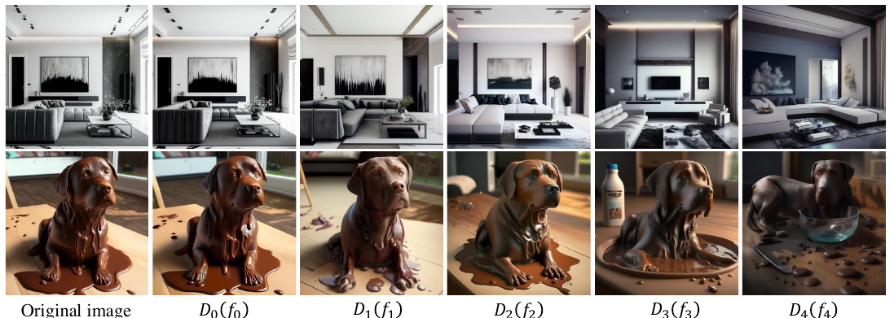

> The figure shows the multi-granular visual decoding process, illustrating how different levels of image features (from fine-grained to coarse-grained) are decoded by dedicated diffusion-based image decoders, resulting in images with varying levels of detail and diversity.

> The figure illustrates the process of multi-granular visual decoding, showing how images are reconstructed or generated from different levels of granularity.

, SEED-X (Ge et al., 2024b), Emu2 (Sun et al., 2024b) and PUMA (fo scale). High quality image reconstruction is the foundation of precise image manipulation tasks.")

> The figure compares the fine-grained image reconstruction performance of PUMA with other state-of-the-art models, highlighting PUMA's superior reconstruction quality.

, f3 (4 visual tokens), and Emu2 (Sun et al., 2024b). The generated features are input to corresponding diffusion-based decoders with different random seeds.")

> The figure visualizes the diversity of text-to-image generation results from PUMA using different feature scales and compares it with Emu2.

 Diversity and controllability tradeoff in image generation tasks: diverse text-to-image generation requires high diversity and fidelity, while tasks like conditional generation and manipulation require high controllability on the image. b) The introduced PUMA, a unified multimodal large language model that processes and generates multi-granular visual representations, balancing diversity and controllability across visual generation tasks. It excels in image understanding, diverse text-to-image generation, editing, inpainting, colorization, and conditional image generation.")

> Figure 1 shows the diversity and controllability tradeoff in image generation, and introduces PUMA, a unified multimodal large language model that handles multi-granular visual representations.

 Diversity and controllability tradeoff in image generation tasks: diverse text-to-image generation requires high diversity and fidelity, while tasks like conditional generation and manipulation require high controllability on the image. b) The introduced PUMA, a unified multimodal large language model that processes and generates multi-granular visual representations, balancing diversity and controllability across visual generation tasks. It excels in image understanding, diverse text-to-image generation, editing, inpainting, colorization, and conditional image generation.")

> Figure 1 shows the diversity and controllability tradeoff in image generation tasks and introduces PUMA, a unified multimodal large language model that balances these aspects across various visual tasks.

 Diversity and controllability tradeoff in image generation tasks: diverse text-to-image generation requires high diversity and fidelity, while tasks like conditional generation and manipulation require high controllability on the image. b) The introduced PUMA, a unified multimodal large language model that processes and generates multi-granular visual representations, balancing diversity and controllability across visual generation tasks. It excels in image understanding, diverse text-to-image generation, editing, inpainting, colorization, and conditional image generation.")

> Figure 1 shows the diversity and controllability tradeoff in image generation, and illustrates PUMA's ability to balance these aspects across various visual generation tasks.

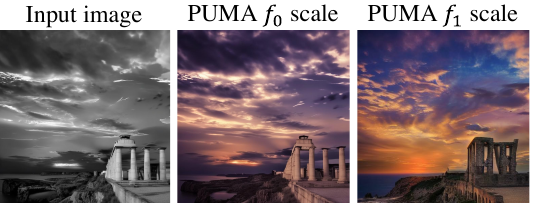

> The figure compares the results of image editing and colorization tasks using different feature scales (fo and f1) in PUMA, demonstrating the impact of feature granularity on the precision of image manipulation.

, f3 (4 visual tokens), and Emu2 (Sun et al., 2024b). The generated features are input to corresponding diffusion-based decoders with different random seeds.")

> Figure 6 shows the diversity of text-to-image generation results from PUMA using different feature scales and random seeds.

, f3 (4 visual tokens), and Emu2 (Sun et al., 2024b). The generated features are input to corresponding diffusion-based decoders with different random seeds.")

> Figure 6 shows a comparison of text-to-image generation results from PUMA using different feature scales and a baseline model (Emu2), highlighting the diversity of image generation achieved with different scales.

 Diversity and controllability tradeoff in image generation tasks: diverse text-to-image generation requires high diversity and fidelity, while tasks like conditional generation and manipulation require high controllability on the image. b) The introduced PUMA, a unified multimodal large language model that processes and generates multi-granular visual representations, balancing diversity and controllability across visual generation tasks. It excels in image understanding, diverse text-to-image generation, editing, inpainting, colorization, and conditional image generation.")

> Figure 1 shows the diversity and controllability tradeoff in image generation tasks, and introduces PUMA, a unified multimodal large language model that balances these aspects across various visual generation tasks.

 Diversity and controllability tradeoff in image generation tasks: diverse text-to-image generation requires high diversity and fidelity, while tasks like conditional generation and manipulation require high controllability on the image. b) The introduced PUMA, a unified multimodal large language model that processes and generates multi-granular visual representations, balancing diversity and controllability across visual generation tasks. It excels in image understanding, diverse text-to-image generation, editing, inpainting, colorization, and conditional image generation.")

> Figure 1 shows the diversity and controllability trade-offs in various image generation tasks and how the proposed PUMA model addresses these challenges using multi-granular visual representations.

 Diversity and controllability tradeoff in image generation tasks: diverse text-to-image generation requires high diversity and fidelity, while tasks like conditional generation and manipulation require high controllability on the image. b) The introduced PUMA, a unified multimodal large language model that processes and generates multi-granular visual representations, balancing diversity and controllability across visual generation tasks. It excels in image understanding, diverse text-to-image generation, editing, inpainting, colorization, and conditional image generation.")

> The figure illustrates the diversity and controllability tradeoff in image generation tasks and introduces PUMA, a unified multimodal large language model for multi-granular visual generation.

 Diversity and controllability tradeoff in image generation tasks: diverse text-to-image generation requires high diversity and fidelity, while tasks like conditional generation and manipulation require high controllability on the image. b) The introduced PUMA, a unified multimodal large language model that processes and generates multi-granular visual representations, balancing diversity and controllability across visual generation tasks. It excels in image understanding, diverse text-to-image generation, editing, inpainting, colorization, and conditional image generation.")

> The figure shows the diversity and controllability tradeoff in image generation tasks and illustrates the PUMA model's ability to balance these aspects across various tasks.

 Diversity and controllability tradeoff in image generation tasks: diverse text-to-image generation requires high diversity and fidelity, while tasks like conditional generation and manipulation require high controllability on the image. b) The introduced PUMA, a unified multimodal large language model that processes and generates multi-granular visual representations, balancing diversity and controllability across visual generation tasks. It excels in image understanding, diverse text-to-image generation, editing, inpainting, colorization, and conditional image generation.")

> The figure illustrates the diversity and controllability tradeoff in image generation tasks and how PUMA, a unified multimodal large language model, balances these aspects across various visual generation and understanding tasks.

> Figure 11 shows more examples of multi-granular visual decoding, illustrating how different granularities of image features lead to varying levels of detail and diversity in the generated images.

 Diversity and controllability tradeoff in image generation tasks: diverse text-to-image generation requires high diversity and fidelity, while tasks like conditional generation and manipulation require high controllability on the image. b) The introduced PUMA, a unified multimodal large language model that processes and generates multi-granular visual representations, balancing diversity and controllability across visual generation tasks. It excels in image understanding, diverse text-to-image generation, editing, inpainting, colorization, and conditional image generation.")

> The figure illustrates the diversity and controllability tradeoff in image generation tasks and introduces PUMA, a unified multimodal large language model that balances these aspects across various visual generation tasks.

 Diversity and controllability tradeoff in image generation tasks: diverse text-to-image generation requires high diversity and fidelity, while tasks like conditional generation and manipulation require high controllability on the image. b) The introduced PUMA, a unified multimodal large language model that processes and generates multi-granular visual representations, balancing diversity and controllability across visual generation tasks. It excels in image understanding, diverse text-to-image generation, editing, inpainting, colorization, and conditional image generation.")

> The figure illustrates the diversity and controllability tradeoff in image generation tasks, and introduces PUMA, a unified multimodal large language model that addresses these challenges.

 Diversity and controllability tradeoff in image generation tasks: diverse text-to-image generation requires high diversity and fidelity, while tasks like conditional generation and manipulation require high controllability on the image. b) The introduced PUMA, a unified multimodal large language model that processes and generates multi-granular visual representations, balancing diversity and controllability across visual generation tasks. It excels in image understanding, diverse text-to-image generation, editing, inpainting, colorization, and conditional image generation.")

> The figure illustrates the diversity and controllability tradeoff in image generation tasks and introduces PUMA, a unified multimodal large language model that balances these aspects across various visual generation and understanding tasks.

 Diversity and controllability tradeoff in image generation tasks: diverse text-to-image generation requires high diversity and fidelity, while tasks like conditional generation and manipulation require high controllability on the image. b) The introduced PUMA, a unified multimodal large language model that processes and generates multi-granular visual representations, balancing diversity and controllability across visual generation tasks. It excels in image understanding, diverse text-to-image generation, editing, inpainting, colorization, and conditional image generation.")

> This figure illustrates the diversity and controllability tradeoffs in various image generation tasks and introduces PUMA, a unified multimodal large language model that addresses these challenges by generating multi-granular visual representations.

 Diversity and controllability tradeoff in image generation tasks: diverse text-to-image generation requires high diversity and fidelity, while tasks like conditional generation and manipulation require high controllability on the image. b) The introduced PUMA, a unified multimodal large language model that processes and generates multi-granular visual representations, balancing diversity and controllability across visual generation tasks. It excels in image understanding, diverse text-to-image generation, editing, inpainting, colorization, and conditional image generation.")

> The figure illustrates the diversity and controllability tradeoff in image generation tasks and introduces PUMA, a unified multimodal large language model that balances these aspects across various visual generation tasks.

 Diversity and controllability tradeoff in image generation tasks: diverse text-to-image generation requires high diversity and fidelity, while tasks like conditional generation and manipulation require high controllability on the image. b) The introduced PUMA, a unified multimodal large language model that processes and generates multi-granular visual representations, balancing diversity and controllability across visual generation tasks. It excels in image understanding, diverse text-to-image generation, editing, inpainting, colorization, and conditional image generation.")

> Figure 1 illustrates the diversity and controllability tradeoff in image generation tasks, and introduces PUMA, a unified multimodal large language model that balances these aspects across various tasks.

 Diversity and controllability tradeoff in image generation tasks: diverse text-to-image generation requires high diversity and fidelity, while tasks like conditional generation and manipulation require high controllability on the image. b) The introduced PUMA, a unified multimodal large language model that processes and generates multi-granular visual representations, balancing diversity and controllability across visual generation tasks. It excels in image understanding, diverse text-to-image generation, editing, inpainting, colorization, and conditional image generation.")

> The figure illustrates the diversity and controllability tradeoff in image generation tasks, and introduces PUMA, a unified multimodal large language model that balances these factors across various tasks.

More on tables


<table id='5' style='font-size:14px'><tr><td>Model</td><td>Token num.</td><td>CLIP-I↑</td><td>CLIP-T↑</td><td>LPIPSd↑</td></tr><tr><td>SD-v1.5 (2022</td><td>-</td><td>0.667</td><td>0.302</td><td>0.692</td></tr><tr><td>DALL-E2 2022</td><td>-</td><td>-</td><td>0.314</td><td>-</td></tr><tr><td>SDXL 2023</td><td>-</td><td>0.674</td><td>0.310</td><td>0.600</td></tr><tr><td>DALL-E 3 2023</td><td>-</td><td>-</td><td>0.320</td><td>-</td></tr><tr><td>SEED-LLaMA 2023</td><td>32</td><td>0.682</td><td>-</td><td>0.652</td></tr><tr><td>Emu 2023</td><td>64</td><td>0.656</td><td>0.286</td><td>0.700</td></tr><tr><td>Emu2 (2024b</td><td>64</td><td>0.686</td><td>0.297</td><td>0.329</td></tr><tr><td>SEED-X (2024b</td><td>64</td><td>0.729</td><td>0.314</td><td>0.493</td></tr><tr><td>PUMA (f4 scale)</td><td>1</td><td>0.699</td><td>0.295</td><td>0.613</td></tr><tr><td>PUMA (f3 scale)</td><td>4</td><td>0.703</td><td>0.300</td><td>0.558</td></tr><tr><td>PUMA (5-scale Max)</td><td>-</td><td>0.736</td><td>0.317</td><td>-</td></tr></table>

> Table 2 presents a quantitative evaluation of diverse text-to-image generation performance on the MSCOCO 30K validation set, measuring the similarity between generated and ground truth images and prompts, as well as the diversity of generated images.


<table id='11' style='font-size:16px'><tr><td>Model</td><td>CLIP-I↑</td><td>CLIP-T↑</td><td>DINO↑</td></tr><tr><td>InstructPix2Pix  2023</td><td>0.834</td><td>0.219</td><td>0.762</td></tr><tr><td>MagicBrush 2024a</td><td>0.838</td><td>0.222</td><td>0.776</td></tr><tr><td>EMU-Edit 2024</td><td>0.859</td><td>0.231</td><td>0.819</td></tr><tr><td>OmniGen 2024</td><td>0.836</td><td>0.233</td><td>0.804</td></tr><tr><td>PUMA (f1 scale)</td><td>0.802</td><td>0.258</td><td>0.679</td></tr><tr><td>PUMA (fo scale)</td><td>0.840</td><td>0.264</td><td>0.784</td></tr><tr><td>PUMA (5-scale Max)</td><td>0.846</td><td>0.270</td><td>0.785</td></tr></table>

> Table 3 presents a quantitative evaluation of image editing performance using CLIP-I, CLIP-T, and DINO scores, comparing PUMA's performance to several existing methods.


<table id='12' style='font-size:18px'><tr><td>Type</td><td>Model</td><td># Params</td><td>MMB↑</td><td>MME↑</td><td>GQA↑</td><td>VQAv2(test)↑</td><td>POPE↑</td><td>Vizwiz↑</td></tr><tr><td rowspan="4">Und. Only</td><td>LLaVA-v1.5 2024a</td><td>7B</td><td>64.3</td><td>1510.7</td><td>62.0</td><td>78.5</td><td>85.9</td><td>50.0</td></tr><tr><td>InstructBLIP 2023</td><td>13B</td><td>-</td><td>1212.8</td><td>49.5</td><td>-</td><td>78.9</td><td>33.4</td></tr><tr><td>Qwen-VL-Chat 2023</td><td>7B</td><td>-</td><td>1487.5</td><td>57.5</td><td>78.2</td><td>-</td><td>38.9</td></tr><tr><td>mPLUG-Owl2 2024b</td><td>7B</td><td>64.5</td><td>1450.2</td><td>56.1</td><td>79.4</td><td>85.8</td><td>54.5</td></tr><tr><td rowspan="6">Und. and Gen.</td><td>Emu 2023</td><td>13B</td><td>-</td><td>-</td><td>-</td><td>57.2</td><td>-</td><td>-</td></tr><tr><td>NExT-GPT 023</td><td>7B</td><td>58.0</td><td>-</td><td>-</td><td>66.7</td><td>-</td><td>48.4</td></tr><tr><td>SEED-X 2024b</td><td>17B</td><td>75.4</td><td>1457.0</td><td>47.9</td><td>-</td><td>84.2</td><td>-</td></tr><tr><td>Chameleon 2024</td><td>34B</td><td>-</td><td>-</td><td>-</td><td>66.0</td><td>-</td><td>-</td></tr><tr><td>Emu2-Chat 2024b</td><td>40B</td><td>-</td><td>-</td><td>65.1</td><td>84.9</td><td>-</td><td>54.9</td></tr><tr><td>PUMA (Ours)</td><td>8B</td><td>68.9</td><td>1490.3</td><td>60.6</td><td>76.2</td><td>85.2</td><td>47.9</td></tr></table>

> Table 4 presents a comparison of PUMA's performance on several multimodal understanding benchmarks against other state-of-the-art models, highlighting its capabilities in both understanding and generation tasks.


<table id='1' style='font-size:16px'><tr><td>ILoshchilov. Decoupled weight decay regularization. arXiv preprint arXiv:1711.05101, 2017.</td></tr><tr><td>Anand Mishra, Shashank Shekhar, Ajeet Kumar Singh, and Anirban Chakraborty. Ocr-vqa: Visual question answering by reading text in images. In 2019 international conference on document analysis and recognition (ICDAR), pp. 947-952. IEEE, 2019.</td></tr><tr><td>Zhiliang Peng, Wenhui Wang, Li Dong, Yaru Hao, Shaohan Huang, Shuming Ma, and Furu Wei. Kosmos-2: Grounding multimodal large language models to the world. arXiv preprint arXiv:2306.14824, 2023.</td></tr><tr><td>Dustin Podell, Zion English, Kyle Lacey, Andreas Blattmann, Tim Dockhorn, Jonas M�ller, Joe Penna, and Robin Rombach. Sdxl: Improving latent diffusion models for high-resolution image synthesis. arXiv preprint arXiv:2307.01952, 2023.</td></tr><tr><td>Can Qin, Shu Zhang, Ning Yu, Yihao Feng, Xinyi Yang, Yingbo Zhou, Huan Wang, Juan Car- los Niebles, Caiming Xiong, Silvio Savarese, et al. Unicontrol: A unified diffusion model for controllable visual generation in the wild. arXiv preprint arXiv:2305.11147, 2023.</td></tr><tr><td>Alec Radford, Jong Wook Kim, Chris Hallacy, Aditya Ramesh, Gabriel Goh, Sandhini Agarwal, Girish Sastry, Amanda Askell, Pamela Mishkin, Jack Clark, et al. Learning transferable visual models from natural language supervision. In International conference on machine learning, pp. 8748-8763. PMLR, 2021.</td></tr><tr><td>Aditya Ramesh, Prafulla Dhariwal, Alex Nichol, Casey Chu, and Mark Chen. Hierarchical text- conditional image generation with clip latents. arXiv preprint arXiv:2204.06125, 1(2):3, 2022.</td></tr><tr><td>Robin Rombach, Andreas Blattmann, Dominik Lorenz, Patrick Esser, and Bjorn Ommer. High- resolution image synthesis with latent diffusion models. In Proceedings of the IEEE/CVF confer- ence on computer vision and pattern recognition, pp. 10684-10695, 2022.</td></tr><tr><td>Christoph Schuhmann, Romain Beaumont, Richard Vencu, Cade Gordon, Ross Wightman, Mehdi Cherti, Theo Coombes, Aarush Katta, Clayton Mullis, Mitchell Wortsman, et al. Laion-5b: An open large-scale dataset for training next generation image-text models. Advances in Neural Information Processing Systems, 35:25278-25294, 2022.</td></tr><tr><td>Shelly Sheynin, Adam Polyak, Uriel Singer, Yuval Kirstain, Amit Zohar, Oron Ashual, Devi Parikh, and Yaniv Taigman. Emu edit: Precise image editing via recognition and generation tasks. In Pro- ceedings of the IEEE/CVF Conference on Computer Vision and Pattern Recognition, pp. 8871- 8879, 2024.</td></tr><tr><td>Keqiang Sun, Junting Pan, Yuying Ge, Hao Li, Haodong Duan, Xiaoshi Wu, Renrui Zhang, Aojun Zhou, Zipeng Qin, Yi Wang, et al. Journeydb: A benchmark for generative image understanding. Advances in Neural Information Processing Systems, 36, 2024a.</td></tr><tr><td>Quan Sun, Qiying Yu, Yufeng Cui, Fan Zhang, Xiaosong Zhang, Yueze Wang, Hongcheng Gao, Jingjing Liu, Tiejun Huang, and Xinlong Wang. Generative pretraining in multimodality. arXiv preprint arXiv:2307.05222, 2023.</td></tr><tr><td>Quan Sun, Yufeng Cui, Xiaosong Zhang, Fan Zhang, Qiying Yu, Yueze Wang, Yongming Rao, Jingjing Liu, Tiejun Huang, and Xinlong Wang. Generative multimodal models are in-context learners. In Proceedings of the IEEE/CVF Conference on Computer Vision and Pattern Recogni- tion, pp. 14398-14409, 2024b.</td></tr><tr><td>Zineng Tang, Ziyi Yang, Chenguang Zhu, Michael Zeng, and Mohit Bansal. Any-to-any generation via composable diffusion. Advances in Neural Information Processing Systems, 36, 2024.</td></tr><tr><td>Chameleon Team. Chameleon: Mixed-modal early-fusion foundation models. arXiv preprint arXiv:2405.09818, 2024.</td></tr><tr><td>Keyu Tian, Yi Jiang, Zehuan Yuan, Bingyue Peng, and Liwei Wang. Visual autoregressive modeling: Scalable image generation via next-scale prediction. arXiv preprint arXiv:2404.02905, 2024.</td></tr><tr><td>Shengbang Tong, Ellis Brown, Penghao Wu, Sanghyun Woo, Manoj Middepogu, Sai Charitha Akula, Jihan Yang, Shusheng Yang, Adithya Iyer, Xichen Pan, et al. Cambrian-1: A fully open, vision-centric exploration of multimodal llms. arXiv preprint arXiv:2406.16860, 2024.</td></tr></table>

> Table 1 presents quantitative metrics evaluating the performance of different models on ImageNet image reconstruction task, assessing both reconstruction accuracy (PSNR, LPIPS) and diversity (PSNRd, LPIPSd).


 <table id='2' style='font-size:16px'><tr><td>Visual token type</td><td>Token number</td><td>MMB↑</td><td>MME↑</td><td>GQA↑</td><td>VQAv2(test) ↑</td></tr><tr><td>J4</td><td>1</td><td>56.8</td><td>1252.6</td><td>0.0</td><td>64.1</td></tr><tr><td>f3</td><td>4</td><td>58.3</td><td>1285.5</td><td>0.0</td><td>67.0</td></tr><tr><td>/ 2</td><td>16</td><td>61.5</td><td>1403.0</td><td>46.6</td><td>71.1</td></tr><tr><td>f1</td><td>64</td><td>63.6</td><td>1400.8</td><td>58.4</td><td>74.4</td></tr><tr><td>fo</td><td>256</td><td>65.4</td><td>1464.9</td><td>58.8</td><td>76.9</td></tr><tr><td>f4-fo</td><td>341</td><td>65.1</td><td>1445.5</td><td>61.0</td><td>76.9</td></tr></table>

> Table 5 shows the ablation study of different visual token inputs on image understanding performance using various metrics.


<table id='16' style='font-size:18px'><tr><td colspan="4">Table 6: CLIP-I and CLIP-T scores on MSCOCO 30K validation set with different feature scales.</td></tr><tr><td>Model</td><td>Token num.</td><td>CLIP-I↑</td><td>CLIP-T↑</td></tr><tr><td>PUMA (f4 scale)</td><td>1</td><td>0.699</td><td>0.295</td></tr><tr><td>PUMA (f3 scale)</td><td>4</td><td>0.703</td><td>0.300</td></tr><tr><td>PUMA (f2 scale)</td><td>16</td><td>0.703</td><td>0.301</td></tr><tr><td>PUMA (f1 scale)</td><td>64</td><td>0.693</td><td>0.299</td></tr><tr><td>PUMA (fo scale)</td><td>256</td><td>0.621</td><td>0.280</td></tr><tr><td>PUMA (5-scale Max)</td><td>-</td><td>0.736</td><td>0.317</td></tr></table>

> Table 6 shows the CLIP-I and CLIP-T scores on the MSCOCO 30K validation set for different feature scales used in text-to-image generation, indicating the impact of feature granularity on image quality and consistency.

### Full paper


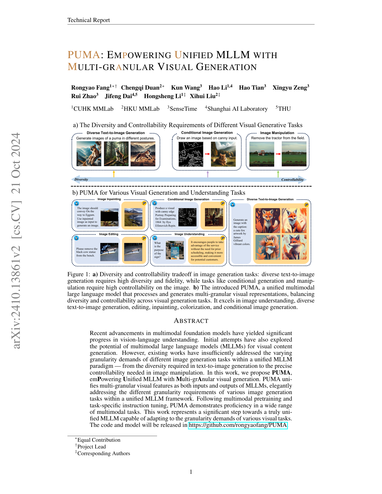
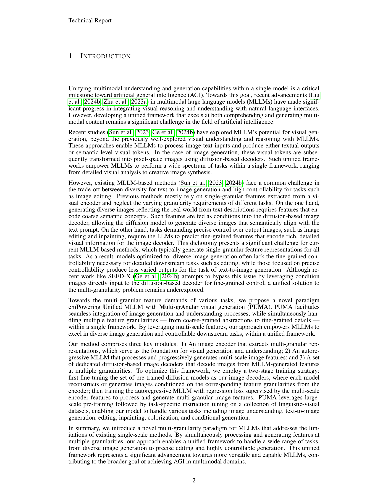
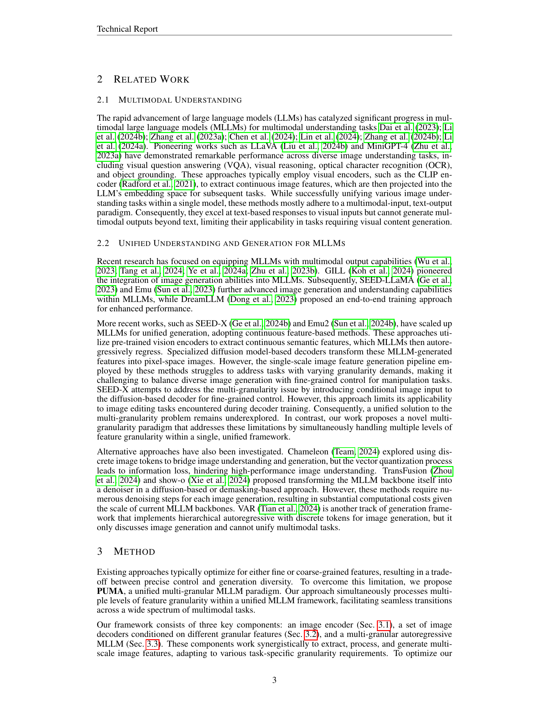

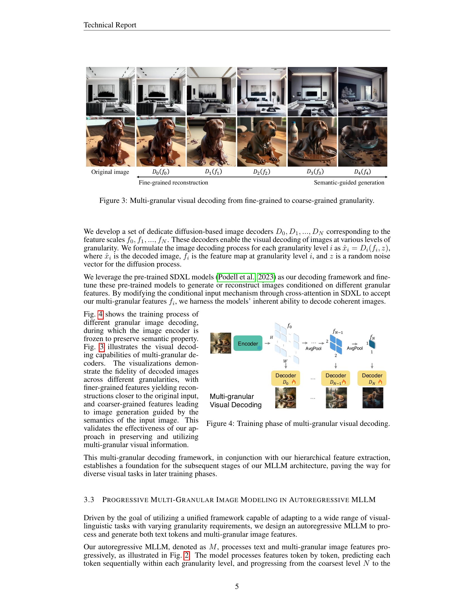
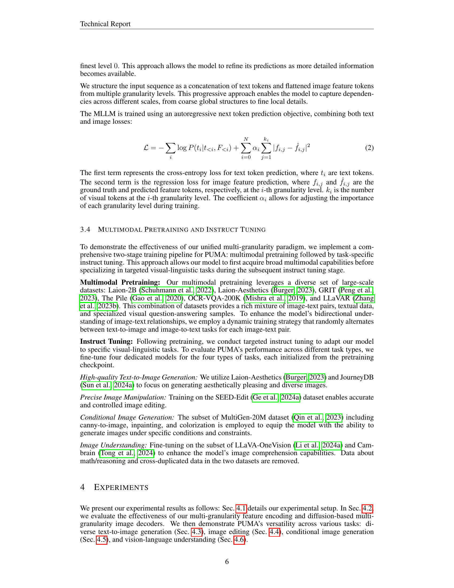
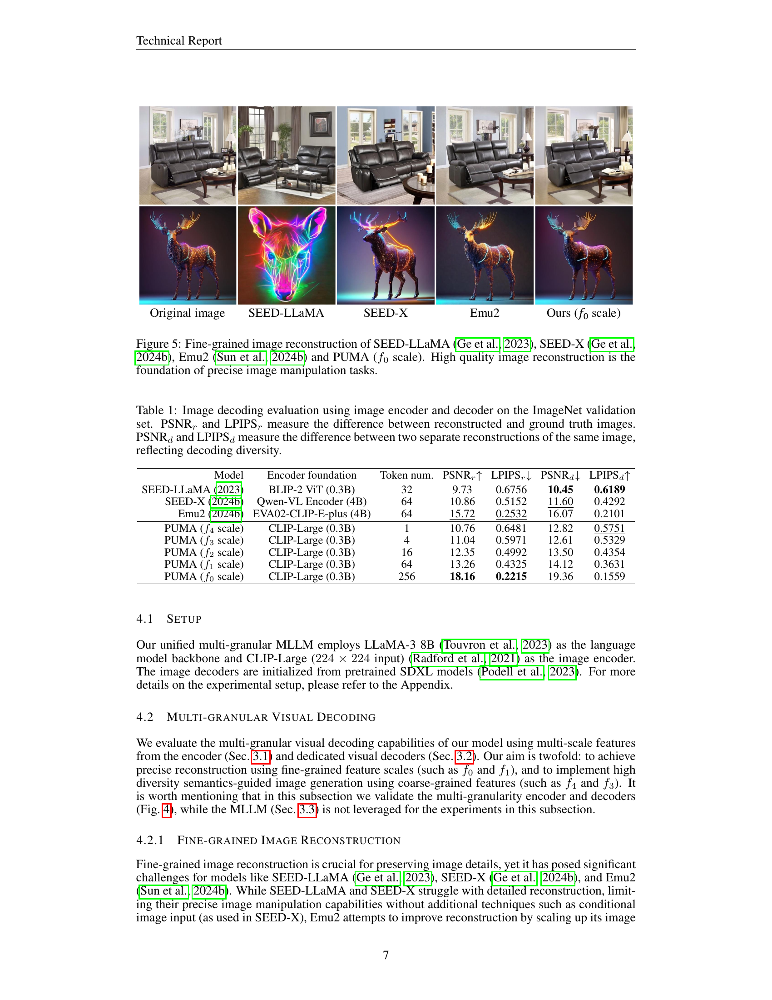

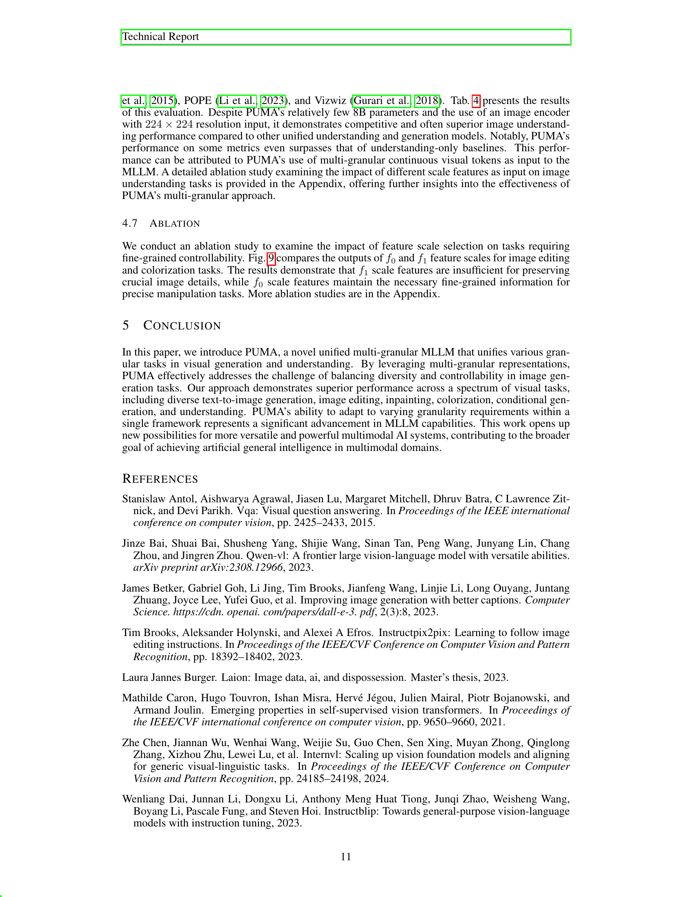
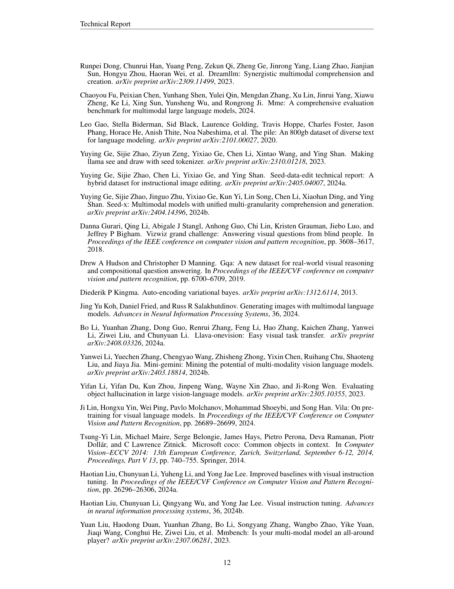
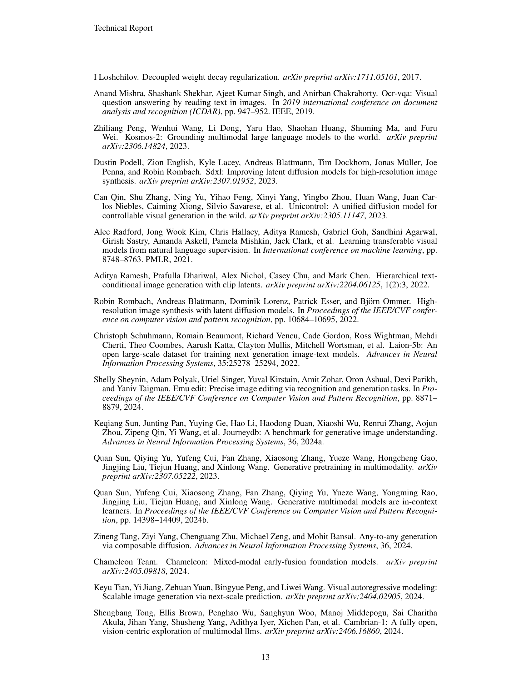

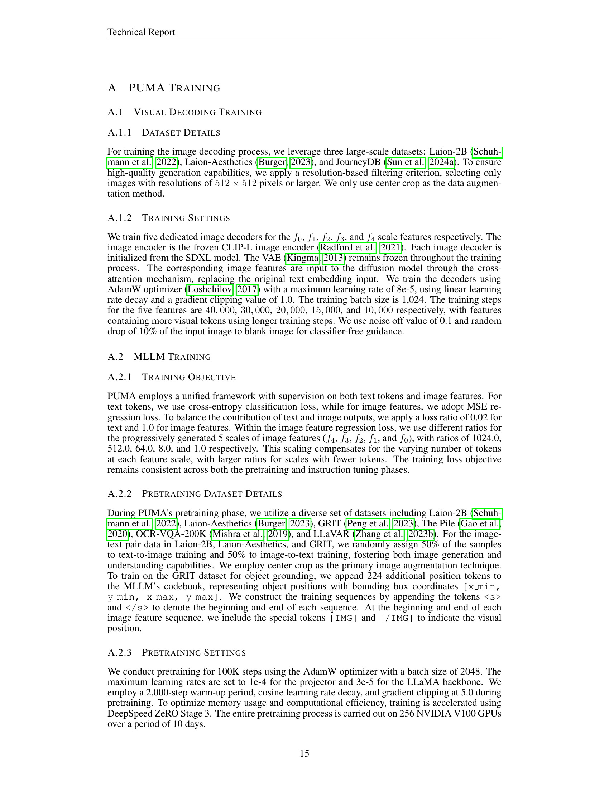

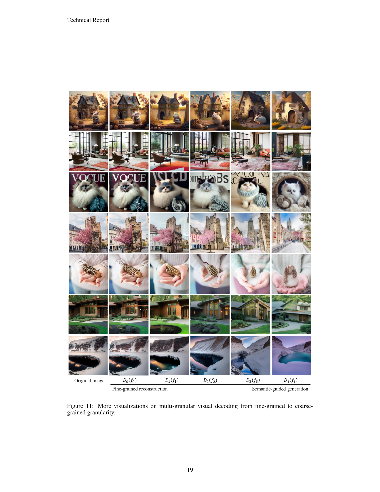

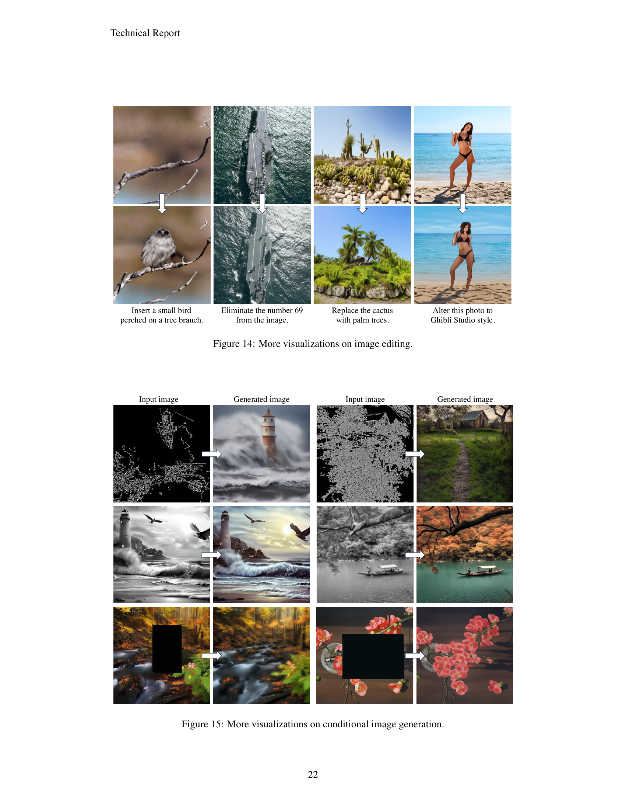
