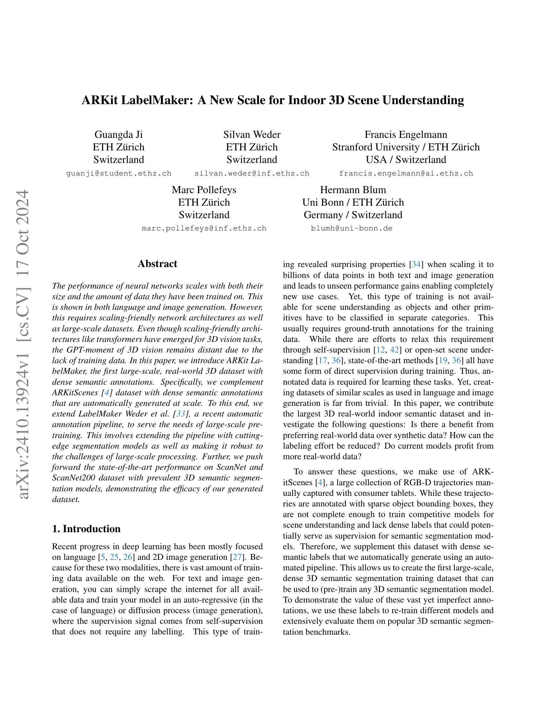
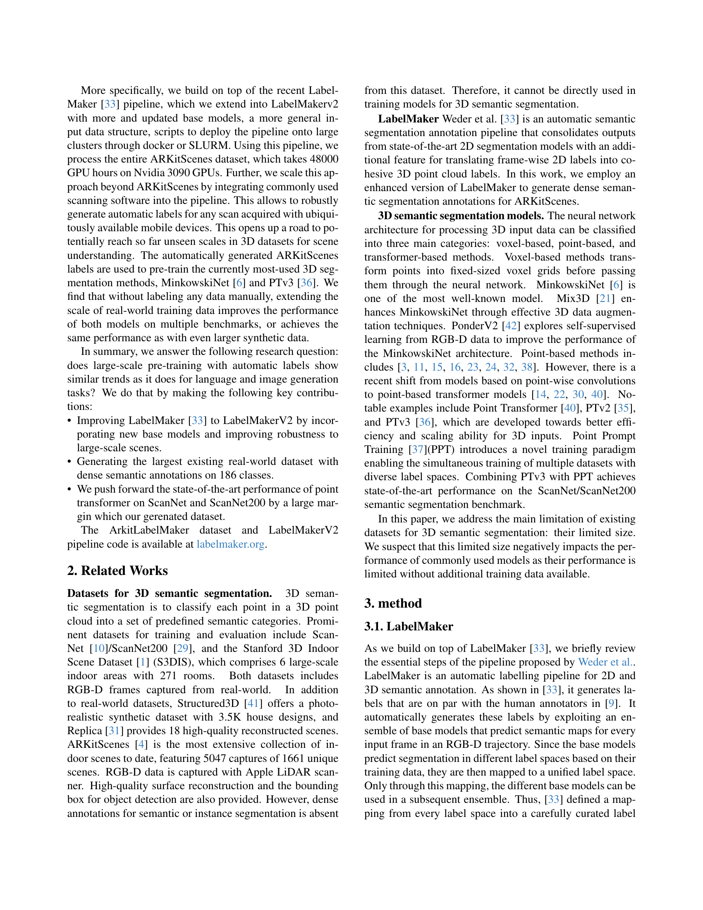
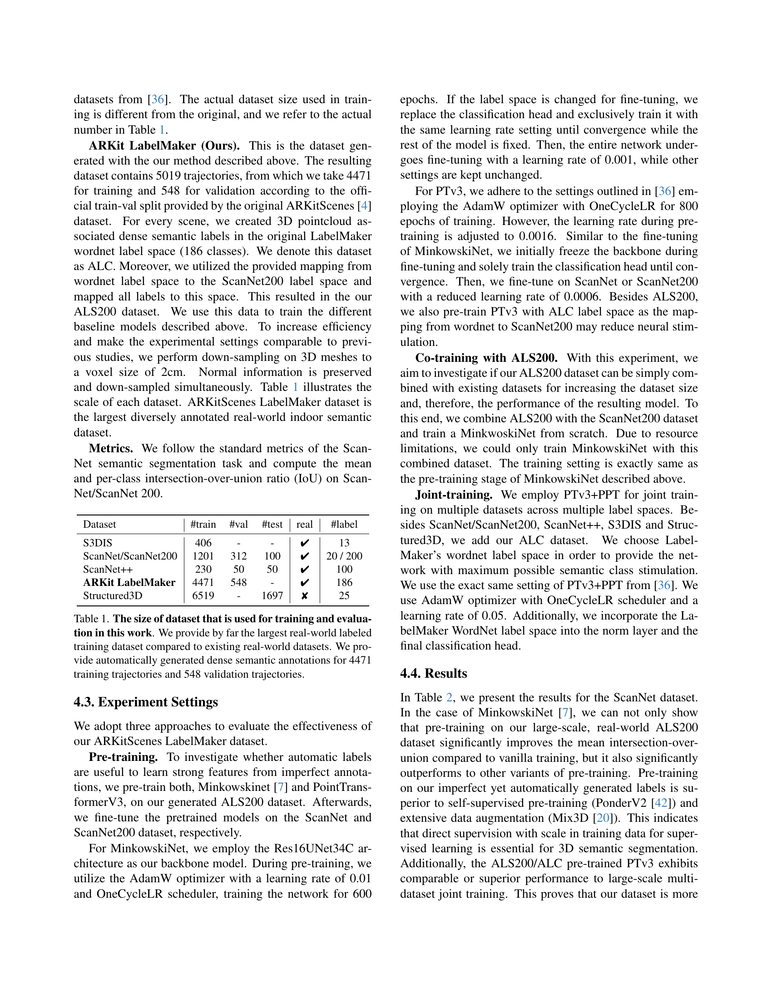
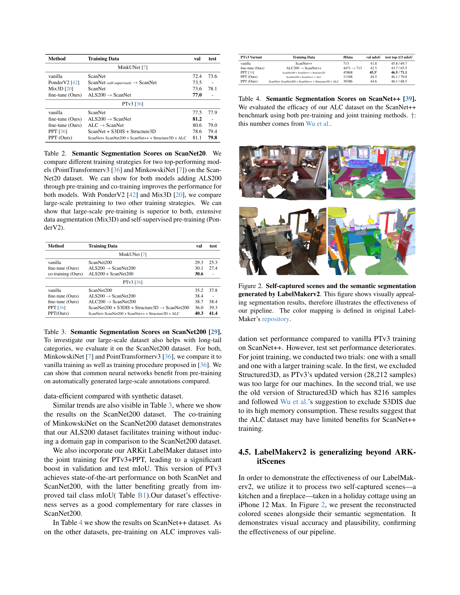
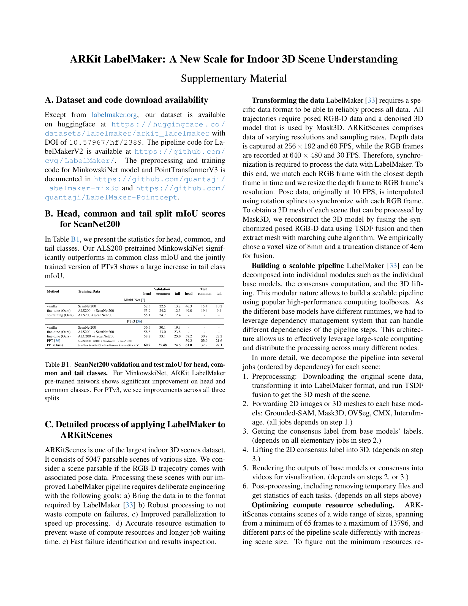
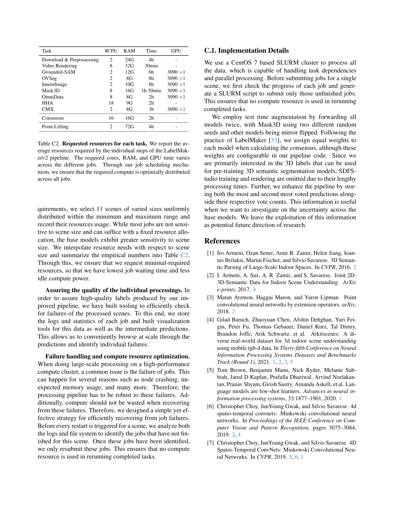
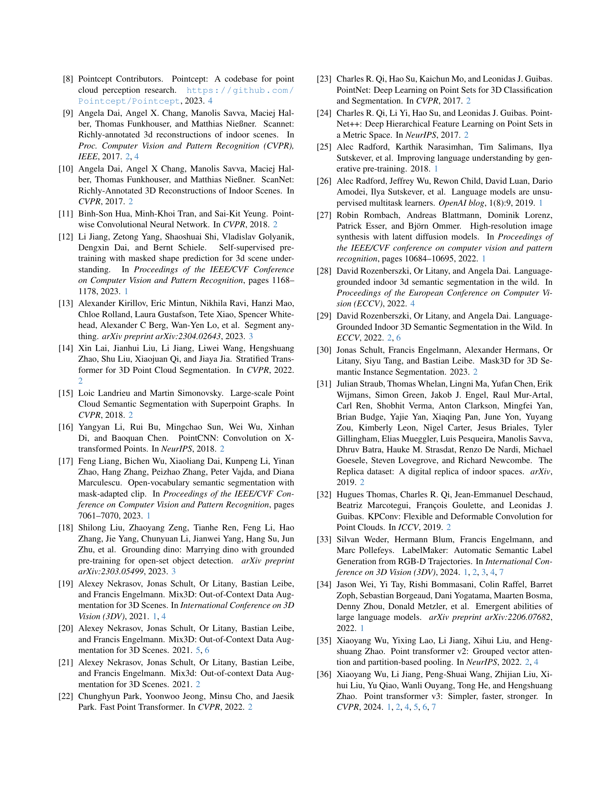
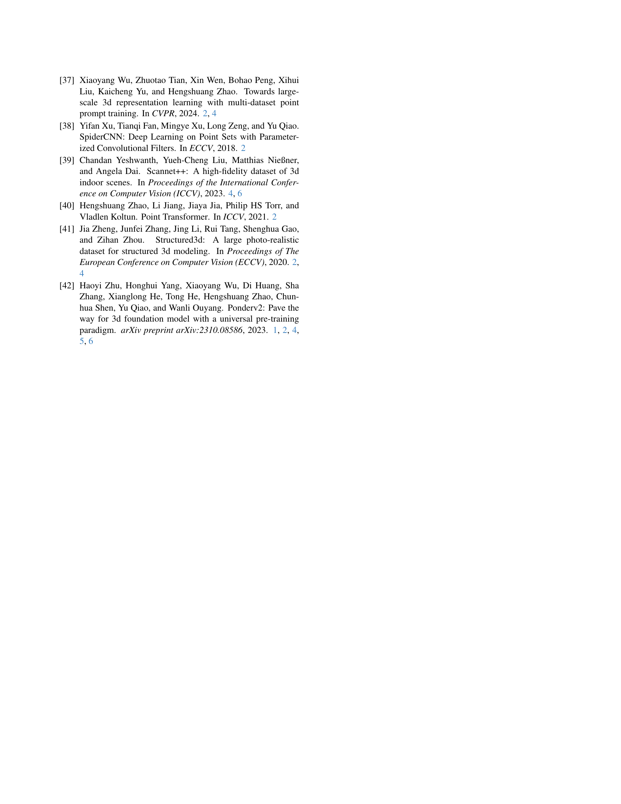

### TL;DR



This research introduces ARKit LabelMaker, a groundbreaking large-scale dataset for 3D indoor scene understanding.  Unlike previous datasets, ARKit LabelMaker boasts dense semantic annotations automatically generated using an improved pipeline (LabelMakerV2). This significantly reduces the time and cost associated with manual labeling. The researchers enhanced their automatic annotation pipeline with state-of-the-art models and robust processing techniques to handle large-scale data.  Experiments on popular benchmarks (ScanNet, ScanNet200) using MinkowskiNet and Point Transformer models show that using ARKit LabelMaker for pre-training drastically improves performance compared to other pre-training methods, even surpassing results achieved with much larger synthetic datasets.  The dataset also benefits models trained on multiple datasets. In essence, the study highlights the effectiveness of large-scale, real-world data for 3D scene understanding and provides a valuable resource for the research community.  The pipeline was also extended to work with commonly available mobile scanning apps, facilitating even broader data collection and increased accessibility.




 &nbsp; read the paper on arXiv


#### Why does it matter?
Summarizing the research paper on ARKit LabelMaker, a new large-scale, real-world 3D dataset for indoor scene understanding.
#### Key Takeaways


 ARKit LabelMaker is the largest real-world 3D dataset with dense semantic annotations. 



 Automatic label generation significantly improves the performance of 3D semantic segmentation models. 



 Pre-training on ARKit LabelMaker outperforms other pre-training methods on several benchmarks. 


------
#### Visual Insights

> The figure shows the dependency graph of the LabelMakerv2 pipeline, illustrating the workflow from downloading and preprocessing data to generating final 3D point cloud labels.


<table id='7' style='font-size:20px'><tr><td>Marc Pollefeys</td><td>Hermann Blum</td></tr><tr><td>ETH Zurich</td><td>Uni Bonn / ETH Zurich</td></tr><tr><td>Switzerland</td><td>Germany / Switzerland</td></tr><tr><td>marc . pollefeys@inf . ethz. ch</td><td>blumh@uni -bonn. de</td></tr></table>

> This table presents the number of training, validation, and test data points for several datasets used in the paper, highlighting the significantly larger size of the ARKit LabelMaker dataset.

### More visual insights

More on tables


<table id='3' style='font-size:14px'><tr><td>Dataset</td><td>#train</td><td>#val</td><td>#test</td><td>real</td><td>#label</td></tr><tr><td>S3DIS</td><td>406</td><td>-</td><td>-</td><td>V</td><td>13</td></tr><tr><td>ScanNet/ScanNet200</td><td>1201</td><td>312</td><td>100</td><td>V</td><td>20 / 200</td></tr><tr><td>ScanNet++</td><td>230</td><td>50</td><td>50</td><td>V</td><td>100</td></tr><tr><td>ARKit LabelMaker</td><td>4471</td><td>548</td><td>-</td><td>V</td><td>186</td></tr><tr><td>Structured3D</td><td>6519</td><td>-</td><td>1697</td><td>X</td><td>25</td></tr></table>

> Table 1 presents the number of training, validation, and test samples for various 3D semantic segmentation datasets, including the ARKit LabelMaker dataset, highlighting its significantly larger size compared to existing real-world datasets.

{{< table-caption caption="🔽 Table 2. Semantic Segmentation Scores on ScanNet20. We compare different training strategies for two top-performing models (PointTransformerv3 [36] and MinkowskiNet [7]) on the Scan-Net20 dataset. We can show for both models adding ALS200 through pre-training and co-training improves the performance for both models. With PonderV2 [42] and Mix3D [20], we compare large-scale pretraining to two other training strategies. We can show that large-scale pre-training is superior to both, extensive data augmentation (Mix3D) and self-supervised pre-training (PonderV2)." >}}
<table id='0' style='font-size:16px'><tr><td>Method</td><td>Training Data</td><td>val</td><td>test</td></tr><tr><td colspan="4">MinkUNet [7]</td></tr><tr><td>vanilla</td><td>ScanNet</td><td>72.4</td><td>73.6</td></tr><tr><td>PonderV2 [42]</td><td>ScanNet (self-supervised) → ScanNet</td><td>73.5</td><td>-</td></tr><tr><td>Mix3D [20]</td><td>ScanNet</td><td>73.6</td><td>78.1</td></tr><tr><td>fine-tune (Ours)</td><td>ALS200 → ScanNet</td><td>77.0</td><td>-</td></tr><tr><td colspan="4">PTv3 [36]</td></tr><tr><td>vanilla</td><td>ScanNet</td><td>77.5</td><td>77.9</td></tr><tr><td>fine-tune (Ours)</td><td>ALS200 → ScanNet</td><td>81.2</td><td>-</td></tr><tr><td>fine-tune (Ours)</td><td>ALC → ScanNet</td><td>80.6</td><td>79.0</td></tr><tr><td>PPT [36]</td><td>ScanNet + S3DIS + Structure3D</td><td>78.6</td><td>79.4</td></tr><tr><td>PPT (Ours)</td><td>ScanNet+ ScanNet200 + ScanNet++ + Structure3D + ALC</td><td>81.1</td><td>79.8</td></tr></table>

> Table 2 presents a comparison of different training strategies for PointTransformerv3 and MinkowskiNet models on the ScanNet20 dataset, highlighting the performance improvements achieved through large-scale pre-training with ALS200.


<table id='2' style='font-size:14px'><tr><td>Method</td><td>Training Data</td><td>val</td><td>test</td></tr><tr><td colspan="4">MinkUNet [7]</td></tr><tr><td>vanilla</td><td>ScanNet200</td><td>29.3</td><td>25.3</td></tr><tr><td>fine-tune (Ours)</td><td>ALS200 → ScanNet200</td><td>30.1</td><td>27.4</td></tr><tr><td>co-training (Ours)</td><td>ALS200 + ScanNet200</td><td>30.6</td><td>-</td></tr><tr><td colspan="4">PTv3 [36]</td></tr><tr><td>vanilla</td><td>ScanNet200</td><td>35.2</td><td>37.8</td></tr><tr><td>fine-tune (Ours)</td><td>ALS200 → ScanNet200</td><td>38.4</td><td>-</td></tr><tr><td>fine-tune (Ours)</td><td>ALC200 → ScanNet200</td><td>38.7</td><td>38.4</td></tr><tr><td>PPT [36]</td><td>ScanNet200 + S3DIS + Structure3D → ScanNet200</td><td>36.0</td><td>39.3</td></tr><tr><td>PPT(Ours)</td><td>ScanNet+ ScanNet200 + ScanNet++ + Structure3D + ALC</td><td>40.3</td><td>41.4</td></tr></table>

> The table compares different training strategies for two top-performing models (PointTransformerv3 [36] and MinkowskiNet [7]) on the ScanNet200 dataset, showing the impact of adding ALS200 through pre-training and co-training.


 <table id='8' style='font-size:14px'><tr><td>PTv3 Variant</td><td>Training Data</td><td>#Data</td><td>val mloU</td><td>test top-1/3 ml⌀U</td></tr><tr><td>vanilla</td><td>ScanNet++</td><td>713</td><td>41.8</td><td>45.8/69.7</td></tr><tr><td>fine-tune (Ours)</td><td>ALC200 → ScanNet++</td><td>4471 → 713</td><td>42.5</td><td>43.7/65.5</td></tr><tr><td>PPT [36]</td><td>ScanNet200 + ScanNet++ + Structure3D</td><td>45868</td><td>45.31</td><td>46.5/71.1</td></tr><tr><td>PPT (Ours)</td><td>ScanNet200 + ScanNet++ + ALC</td><td>11168</td><td>44.5</td><td>46.1/70.8</td></tr><tr><td>PPT (Ours)</td><td>ScanNet+ ScanNet200 + ScanNet++ + Structure3D + ALC</td><td>30386</td><td>44.6</td><td>46.1 / 68.5</td></tr></table>

> The table presents the results of semantic segmentation on the ScanNet++ benchmark, comparing different training strategies (pre-training and joint training) using ALC and other datasets.


<table id='6' style='font-size:14px'><tr><td>Method</td><td>Training Data</td><td>head</td><td>Validation common</td><td>tail</td><td>head</td><td>Test common</td><td>tail</td></tr><tr><td colspan="8">MinkUNet [7]</td></tr><tr><td>vanilla</td><td>ScanNet200</td><td>52.3</td><td>22.5</td><td>13.2</td><td>46.3</td><td>15.4</td><td>10.2</td></tr><tr><td>fine-tune (Ours)</td><td>ALS200 → ScanNet200</td><td>53.9</td><td>24.2</td><td>12.5</td><td>49.0</td><td>19.4</td><td>9.4</td></tr><tr><td>co-training (Ours)</td><td>ALS200 + ScanNet200</td><td>55.1</td><td>24.7</td><td>12.4</td><td>■</td><td>-</td><td>■</td></tr><tr><td colspan="8">PTv3 [36]</td></tr><tr><td>vanilla</td><td>ScanNet200</td><td>56.5</td><td>30.1</td><td>19.3</td><td>·</td><td>·</td><td></td></tr><tr><td>fine-tune (Ours)</td><td>ALS200 → ScanNet200</td><td>58.6</td><td>33.0</td><td>23.8</td><td>·</td><td>·</td><td>·</td></tr><tr><td>fine-tune (Ours)</td><td>ALC200 → ScanNet200</td><td>58.2</td><td>33.1</td><td>25.0</td><td>58.2</td><td>30.9</td><td>22.2</td></tr><tr><td>PPT [36]</td><td>ScanNet200 + S3DIS + Structure3D → ScanNet200</td><td>■</td><td>■</td><td>-</td><td>59.2</td><td>33.0</td><td>21.6</td></tr><tr><td>PPT(Ours)</td><td>ScanNet+ ScanNet200 + ScanNet++ + Structure3D + ALC</td><td>60.9</td><td>35.48</td><td>24.6</td><td>61.0</td><td>32.2</td><td>27.1</td></tr></table>

> Table B1 presents the mean Intersection over Union (mIoU) scores for head, common, and tail classes on the ScanNet200 benchmark, comparing the performance of different training methods for MinkowskiNet and Point Transformer V3 models.


<table id='0' style='font-size:14px'><tr><td>Task</td><td>#CPU</td><td>RAM</td><td>Time</td><td>GPU</td></tr><tr><td>Download & Prepossessing</td><td>2</td><td>24G</td><td>4h</td><td>-</td></tr><tr><td>Video Rendering</td><td>8</td><td>32G</td><td>30min</td><td>-</td></tr><tr><td>Grounded-SAM</td><td>2</td><td>12G</td><td>6h</td><td>3090 x1</td></tr><tr><td>OVSeg</td><td>2</td><td>8G</td><td>8h</td><td>3090 x1</td></tr><tr><td>InternImage</td><td>2</td><td>10G</td><td>8h</td><td>3090 x1</td></tr><tr><td>Mask3D</td><td>8</td><td>16G</td><td>1h 30min</td><td>3090 x1</td></tr><tr><td>OmniData</td><td>8</td><td>8G</td><td>2h</td><td>3090 x1</td></tr><tr><td>HHA</td><td>18</td><td>9G</td><td>2h</td><td>-</td></tr><tr><td>CMX</td><td>2</td><td>8G</td><td>3h</td><td>3090 x1</td></tr><tr><td>Consensus</td><td>16</td><td>16G</td><td>2h</td><td>-</td></tr><tr><td>Point Lifting</td><td>2</td><td>72G</td><td>4h</td><td></td></tr></table>

> This table presents the number of training, validation, and test samples for several 3D semantic segmentation datasets, including the newly generated ARKit LabelMaker dataset, highlighting its significantly larger size compared to existing datasets.

### Full paper



