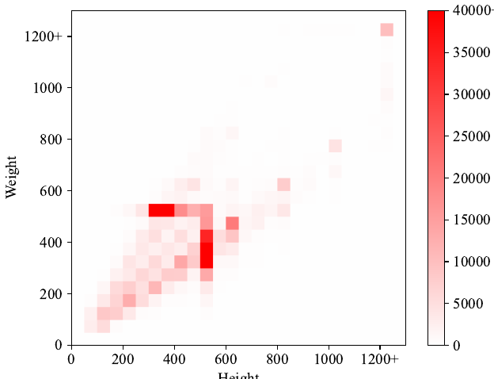
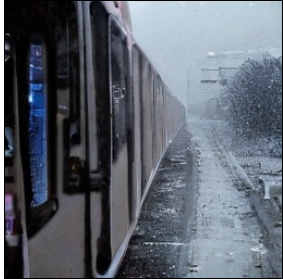
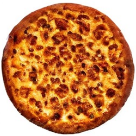
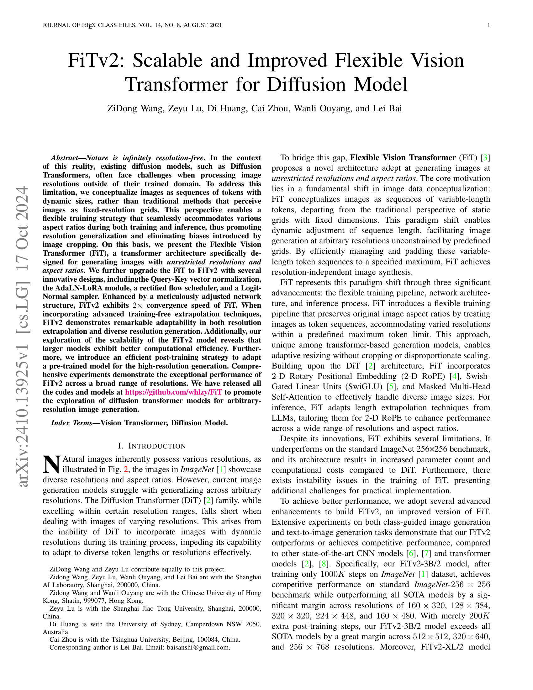
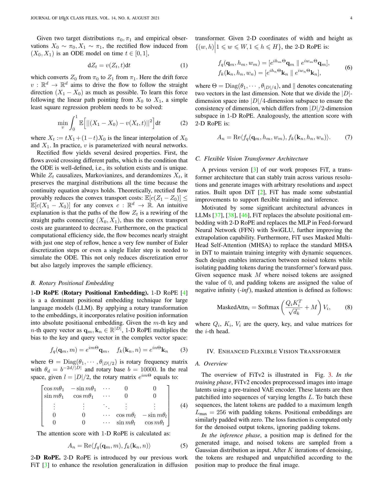
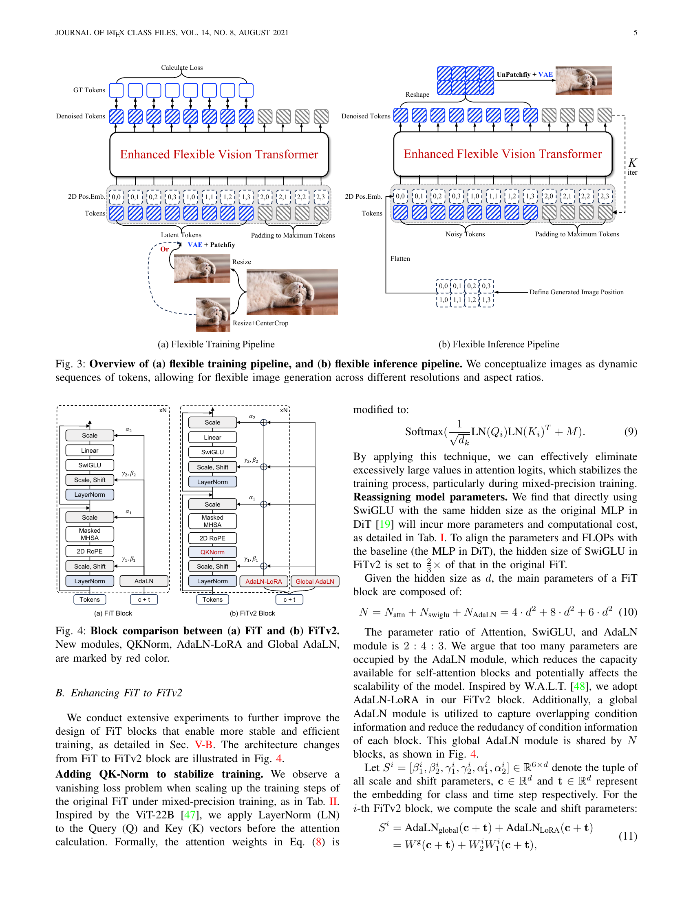
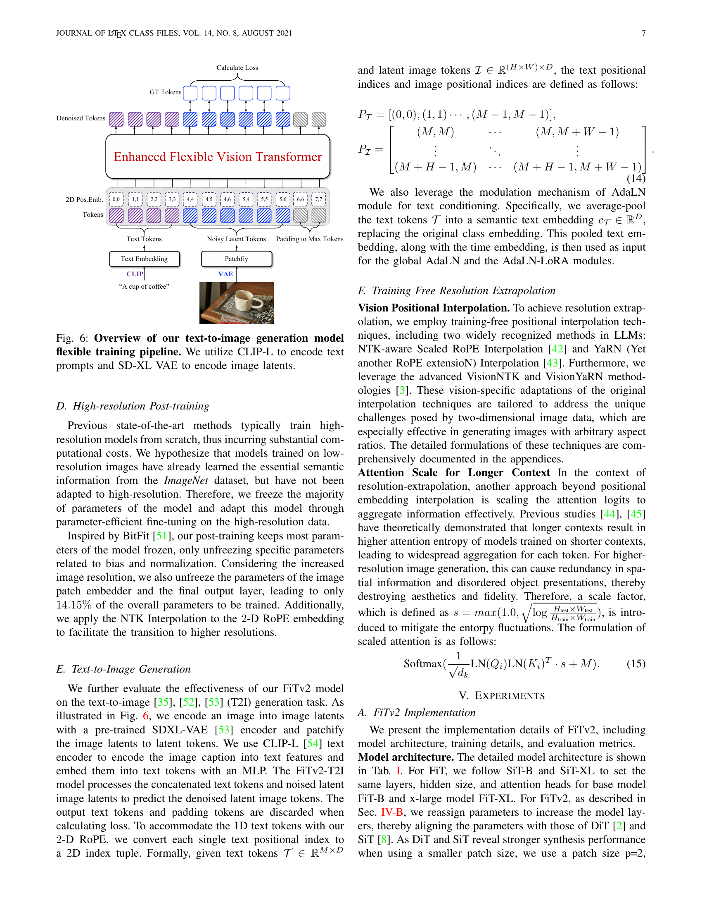
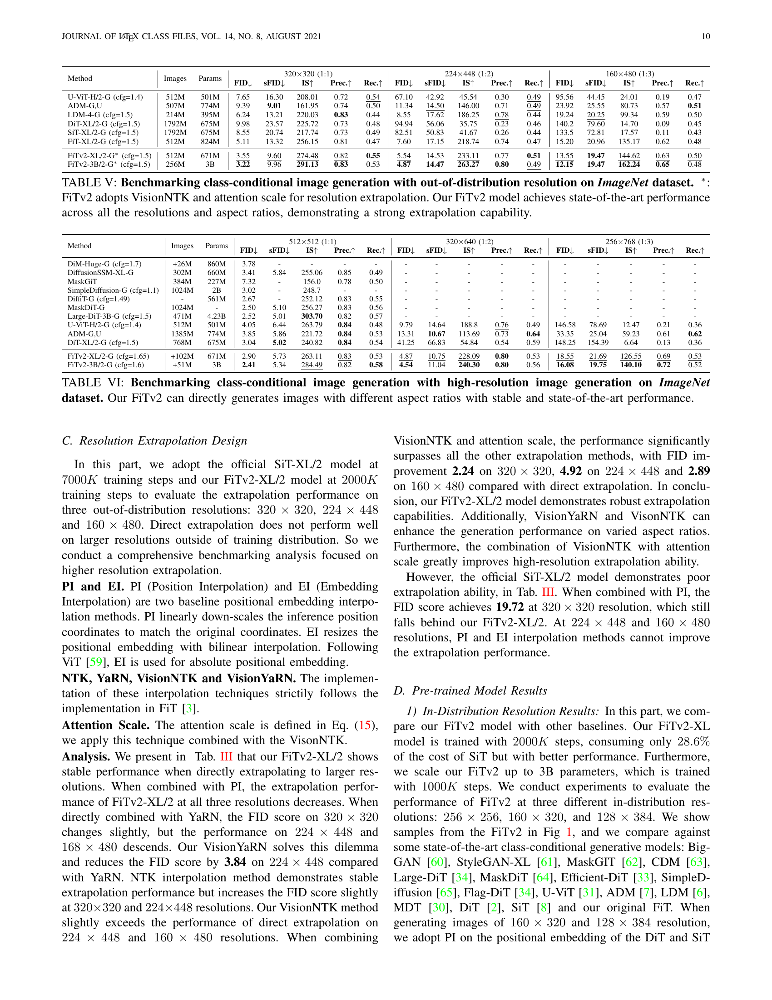
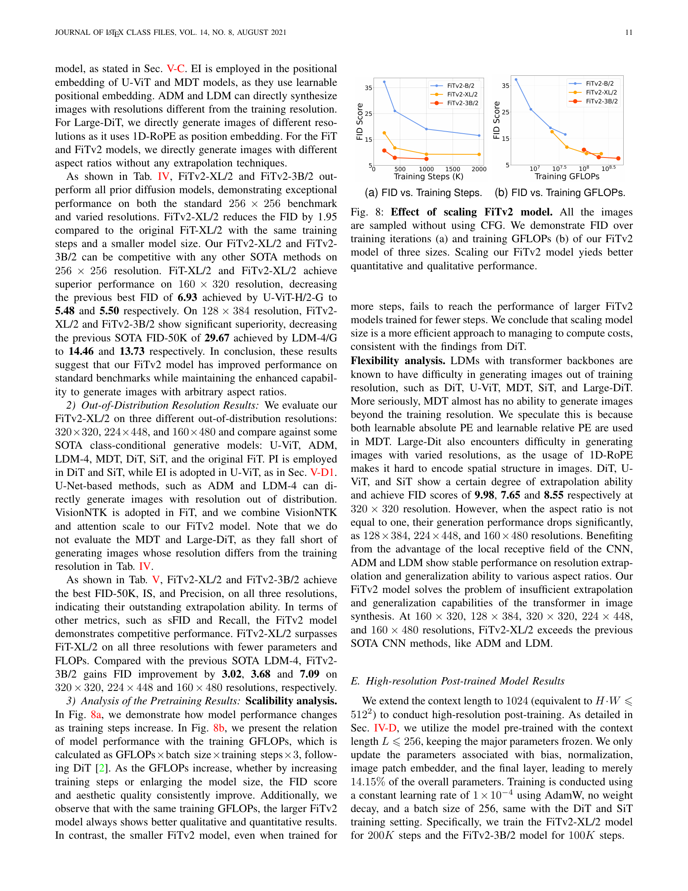

### TL;DR



This paper introduces FiTv2, an enhanced version of a flexible vision transformer (FiT) designed for image generation.  Unlike traditional methods that treat images as fixed-resolution grids, FiTv2 views them as sequences of tokens with dynamic sizes, enabling it to handle diverse resolutions and aspect ratios seamlessly.  FiTv2 includes several upgrades: Query-Key vector normalization for stability, AdaLN-LORA for efficiency, a rectified flow scheduler for faster convergence, and a Logit-Normal sampler.  Experiments show FiTv2 achieves 2x faster convergence than FiT and outperforms state-of-the-art models, especially at higher resolutions.  A post-training method is also presented to adapt a pre-trained model for high-resolution generation. The code and models are publicly available to facilitate further research.




 &nbsp; read the paper on arXiv


#### Why does it matter?
Summarizing the provided research paper on FiTv2: Scalable and Improved Flexible Vision Transformer for Diffusion Model.
#### Key Takeaways


 FiTv2 surpasses existing diffusion models by generating images with unrestricted resolutions and aspect ratios. 



 FiTv2 incorporates innovative designs (Query-Key vector normalization, AdaLN-LORA, rectified flow scheduler) leading to a 2x speed increase. 



 FiTv2 demonstrates superior performance on various benchmark tests, particularly excelling in high-resolution image generation. 


------
#### Visual Insights

> Figure 1 showcases example images generated by the FiTv2-3B/2 model at various resolutions and aspect ratios, demonstrating its ability to generate high-quality images across a wide range of resolutions.

> The chart displays the distribution of image heights and widths in the ImageNet dataset.


<table id='20' style='font-size:16px'><tr><td>cos m01</td><td>- sin m01 ...</td><td>0</td><td>0</td></tr><tr><td>sin m01</td><td>COS m01 ...</td><td>0</td><td>0</td></tr></table>

> Table I details the architecture of three FiTv2 models (base, XL, and 3B parameter), specifying the number of layers, hidden size, number of heads, and computational cost (GFLOPs and parameters) for each.

### More visual insights

More on figures

 flexible training pipeline, and (b) flexible inference pipeline. We conceptualize images as dynamic sequences of tokens, allowing for flexible image generation across different resolutions and aspect ratios.")

> Figure 3 illustrates the flexible training and inference pipelines of FiTv2, which processes images as dynamic sequences of tokens to handle various resolutions and aspect ratios.

 FiT and (b) FiTv2. New modules, QKNorm, AdaLN-LoRA and Global AdaLN, are marked by red color.")

> The figure shows a comparison of FiT and FiTv2 blocks, highlighting the new modules added in FiTv2 for improved stability and efficiency.

 DiT, (b) FiT, and (c) FiTv2. In FiTv2, we incorporate both fixed-resolution images and the flexible-resolution images into training process.")

> Figure 5 illustrates the data preprocessing pipelines of DiT, FiT, and FiTv2, highlighting FiTv2's mixed data preprocessing strategy to improve performance on both fixed and flexible resolutions.

> Figure 6 illustrates the flexible training pipeline for text-to-image generation using FiTv2, incorporating CLIP for text encoding and SD-XL VAE for image latent encoding.

 DiT, (b) FiT, and (c) FiTv2. In FiTv2, we incorporate both fixed-resolution images and the flexible-resolution images into training process.")

> The figure illustrates the differences in data preprocessing pipelines for DiT, FiT, and FiTv2, highlighting FiTv2's incorporation of both fixed and flexible resolution images for training.

> Figure 1 shows example images generated by FiTv2 at various resolutions and aspect ratios, demonstrating its ability to generate high-quality images across a wide range of resolutions and aspect ratios.

> Figure 1 shows example images generated by FiTv2 at various resolutions and aspect ratios, highlighting its ability to generate high-quality images across a wide range of resolutions.

> Figure 1 shows example images generated by FiTv2 at various resolutions and aspect ratios, demonstrating its ability to generate high-quality images at resolutions and aspect ratios beyond those seen during training.

> Figure 9 shows examples of images generated by the FiTv2-XL/2 model from text descriptions, demonstrating its ability to generate realistic images with only 400K training steps.

> The figure showcases various images generated by the FiTv2-3B/2 model at different resolutions and aspect ratios, demonstrating its ability to generate high-quality images across a wide range of resolutions.

> The figure showcases example images generated by the FiTv2-XL/2 model at 256x256 resolution based on corresponding text descriptions, demonstrating its text-to-image generation capabilities.

> Figure 1 showcases image samples generated by FiTv2-3B/2 at various resolutions and aspect ratios, demonstrating its ability to generate high-quality images at different resolutions.

> Figure 1 showcases image samples generated by the FiTv2-3B/2 model across various resolutions and aspect ratios, demonstrating its ability to generate high-quality images at unrestricted resolutions.

> Figure 9 shows example images generated by the FiTv2-XL/2 model for various text prompts, demonstrating its ability to generate realistic images from text descriptions.

More on charts

 FiTv2-XL/2 and (b) FiTv2-3B/2 models. (a) For FiTv2-XL/2 model, the optimal performance is achieved with CFG=1.5 for 256 × 256 resolution and CFG=1.65 for 512x 512 resolution. (b) For FiTv2-3B/2 model, the optimal performance is observed with CFG=1.5 for 256 × 256 resolution and CFG=1.6 for 512 × 512 resolution.")

> The chart displays the impact of classifier-free guidance (CFG) scale on the FID score for FiTv2 models at different resolutions (256x256 and 512x512).

 and training GFLOPs (b) of our FiTv2 model of three sizes. Scaling our FiTv2 model yields better quantitative and qualitative performance.")

> The chart displays the impact of training steps and GFLOPs on the FID score for three different sizes of the FiTv2 model, demonstrating improved performance with increased scale.

> The chart compares the FID and CLIP-L scores of FiTv2-XL/2 and SiT-XL/2 models at various classifier-free guidance (CFG) scales for text-to-image generation.

More on tables


<table id='2' style='font-size:16px'><tr><td>Model</td><td>Layers N</td><td>Hidden size d</td><td>Heads</td><td>Params</td><td>GFLOPs</td></tr><tr><td>SiT-B</td><td>12</td><td>768</td><td>12</td><td>131M</td><td>21.8</td></tr><tr><td>FiT-B</td><td>12</td><td>768</td><td>12</td><td>159M</td><td>29.1</td></tr><tr><td>FiTv2-B</td><td>15</td><td>768</td><td>12</td><td>128M</td><td>27.3</td></tr><tr><td>SiT-XL</td><td>28</td><td>1152</td><td>16</td><td>675M</td><td>114</td></tr><tr><td>FiT-XL</td><td>28</td><td>1152</td><td>16</td><td>824M</td><td>153</td></tr><tr><td>FiTv2-XL</td><td>36</td><td>1152</td><td>16</td><td>671M</td><td>147</td></tr><tr><td>FiTv2-3B</td><td>40</td><td>2304</td><td>24</td><td>3B</td><td>653</td></tr></table>

> Table I details the architecture of different FiTv2 models, including the number of layers, hidden size, heads, parameters, and GFLOPs.


<table id='2' style='font-size:16px'><tr><td rowspan="2">Method</td><td rowspan="2">Scheduler</td><td rowspan="2">QK-Norm</td><td rowspan="2">Parameters</td><td rowspan="2">Data</td><td rowspan="2">Sampling</td><td colspan="2">256x256 (400k)</td><td colspan="2">256x256 (1000k)</td><td colspan="2">256x256 (1500k)</td><td colspan="2">256x256 (2000k) cfg=1.0</td></tr><tr><td>cfg=1.0</td><td>cfg=1.5</td><td>cfg=1.0</td><td>cfg=1.5</td><td>cfg=1.0</td><td>cfg=1.5</td><td></td><td>cfg=1.5</td></tr><tr><td>DiT-B/2</td><td>DDPM</td><td>-</td><td>-</td><td>-</td><td>-</td><td>45.33</td><td>22.21</td><td>33.27</td><td>12.59</td><td>X</td><td>X</td><td>X</td><td>X</td></tr><tr><td>SiT-B/2</td><td>Rectified Flow</td><td>-</td><td>-</td><td>-</td><td>-</td><td>36.7</td><td>16.31</td><td>27.13</td><td>9.3</td><td>X</td><td>X</td><td>X</td><td>X</td></tr><tr><td>FiT-B/2</td><td>DDPM</td><td>No</td><td>Original</td><td>Flexible</td><td>Uniform</td><td>36.36</td><td>18.86</td><td>29.14</td><td>11.06</td><td>26.08</td><td>9.23</td><td>X</td><td>X</td></tr><tr><td>Config A</td><td>Rectified Flow</td><td>No</td><td>Original</td><td>Flexible</td><td>Uniform</td><td>30.74</td><td>13.14</td><td>23.48</td><td>8.67</td><td>22.32</td><td>8.25</td><td>21.23</td><td>7.61</td></tr><tr><td>Config B</td><td>Rectified Flow</td><td>LayerNorm</td><td>Original</td><td>Flexible</td><td>Uniform</td><td>30.83</td><td>13.21</td><td>23.64</td><td>8.57</td><td>21.64</td><td>7.70</td><td>20.73</td><td>7.10</td></tr><tr><td>Config C</td><td>Rectified Flow</td><td>LayerNorm</td><td>Reassigned</td><td>Flexible</td><td>Uniform</td><td>28.59</td><td>12.74</td><td>21.16</td><td>8.05</td><td>19.56</td><td>7.16</td><td>18.42</td><td>6.60</td></tr><tr><td>Config D</td><td>Rectified Flow</td><td>No</td><td>Original</td><td>Mixed</td><td>Uniform</td><td>34.15</td><td>13.99</td><td>25.54</td><td>8.27</td><td>23.63</td><td>7.24</td><td>X</td><td>X</td></tr><tr><td>Config E</td><td>Rectified Flow</td><td>LayerNorm</td><td>Original</td><td>Mixed</td><td>Uniform</td><td>34.55</td><td>14.19</td><td>25.94</td><td>8.37</td><td>23.45</td><td>6.99</td><td>22.04</td><td>6.31</td></tr><tr><td>Config F</td><td>Rectified Flow</td><td>LayerNorm</td><td>Original</td><td>Mixed</td><td>Logit-Normal</td><td>28.49</td><td>9.98</td><td>21.93</td><td>6.16</td><td>20.09</td><td>5.23</td><td>19.21</td><td>4.84</td></tr><tr><td>FiTv2-B/2</td><td>Rectified Flow</td><td>LayerNorm</td><td>Reassigned</td><td>Mixed</td><td>Logit-Normal</td><td>26.03</td><td>9.45</td><td>19.02</td><td>5.51</td><td>17.70</td><td>4.73</td><td>16.52</td><td>4.30</td></tr></table>

> Table II presents an ablation study comparing different configurations of FiTv2-B/2 model, showing the impact of various design choices on FID scores and training stability.


<table id='4' style='font-size:16px'><tr><td rowspan="2">Method</td><td colspan="5">320x320 (1:1)</td><td colspan="5">224x448 (1:2)</td><td colspan="5">160x480 (1:3)</td></tr><tr><td>FID↓</td><td>sFID↓</td><td>IS↑</td><td>Prec.↑</td><td>Rec.↑</td><td>FID↓</td><td>sFID↓</td><td>IS↑</td><td>Prec.↑</td><td>Rec.↑</td><td>FID↓</td><td>sFID↓</td><td>IS↑</td><td>Prec.↑</td><td>Rec.↑</td></tr><tr><td>SiT-XL/2</td><td>19.72</td><td>54.91</td><td>144.06</td><td>0.63</td><td>0.47</td><td>46.17</td><td>67.89</td><td>73.32</td><td>0.43</td><td>0.43</td><td>104.57</td><td>91.47</td><td>23.43</td><td>0.16</td><td>0.41</td></tr><tr><td>SiT-XL/2 + EI</td><td>8.93</td><td>19.68</td><td>212.99</td><td>0.72</td><td>0.5</td><td>78.87</td><td>48.97</td><td>43.57</td><td>0.27</td><td>0.45</td><td>131.04</td><td>71.18</td><td>17.63</td><td>0.11</td><td>0.43</td></tr><tr><td>SiT-XL/2 + PI</td><td>8.55</td><td>20.74</td><td>217.74</td><td>0.73</td><td>0.49</td><td>82.51</td><td>50.83</td><td>41.67</td><td>0.26</td><td>0.44</td><td>133.47</td><td>72.81</td><td>17.57</td><td>0.11</td><td>0.43</td></tr><tr><td>FiTv2-XL/2</td><td>5.79</td><td>13.7</td><td>233.03</td><td>0.75</td><td>0.55</td><td>10.46</td><td>17.24</td><td>184.06</td><td>0.68</td><td>0.54</td><td>16.4</td><td>19.55</td><td>127.72</td><td>0.59</td><td>0.51</td></tr><tr><td>FiTv2-XL/2 + PI</td><td>11.47</td><td>21.131</td><td>197.04</td><td>0.67</td><td>0.51</td><td>154.59</td><td>77.21</td><td>13.18</td><td>0.10</td><td>0.14</td><td>169.4</td><td>9.81</td><td>78.31</td><td>0.06</td><td>0.06</td></tr><tr><td>FiTv2-XL/2 + YaRN</td><td>5.87</td><td>15.38</td><td>250.66</td><td>0.77</td><td>0.52</td><td>21.41</td><td>34.70</td><td>146.31</td><td>0.56</td><td>0.38</td><td>36.73</td><td>35.81</td><td>78.55</td><td>0.42</td><td>0.26</td></tr><tr><td>FiTv2-XL/2 + NTK</td><td>6.04</td><td>14.35</td><td>232.91</td><td>0.75</td><td>0.55</td><td>10.82</td><td>17.84</td><td>184.68</td><td>0.66</td><td>0.53</td><td>16.3</td><td>20.13</td><td>131.8</td><td>0.58</td><td>0.50</td></tr><tr><td>FiTv2-XL/2 + VisionYaRN</td><td>5.87</td><td>15.38</td><td>250.66</td><td>0.77</td><td>0.52</td><td>6.62</td><td>18.22</td><td>245.47</td><td>0.76</td><td>0.48</td><td>16.17</td><td>27.35</td><td>151.99</td><td>0.62</td><td>0.39</td></tr><tr><td>FiTv2-XL/2 + VisionNTK</td><td>6.04</td><td>14.35</td><td>232.91</td><td>0.75</td><td>0.55</td><td>10.11</td><td>17.08</td><td>188.4</td><td>0.68</td><td>0.53</td><td>15.44</td><td>19.48</td><td>135.57</td><td>0.60</td><td>0.50</td></tr><tr><td>FiTv2-XL/2 + VisionNTK + Attn-Scale</td><td>3.55</td><td>9.60</td><td>274.48</td><td>0.82</td><td>0.52</td><td>5.54</td><td>14.53</td><td>233.11</td><td>0.77</td><td>0.51</td><td>13.55</td><td>19.47</td><td>144.62</td><td>0.63</td><td>0.50</td></tr></table>

> Table II presents ablation study results comparing different configurations of FiT and FiTv2 models, showing the impact of various design choices on FID score and training stability.


<table id='6' style='font-size:14px'><tr><td rowspan="2">Method</td><td rowspan="2">Images</td><td rowspan="2">Params</td><td colspan="5">256x256 (1:1)</td><td colspan="5">160x320 (1:2)</td><td colspan="5">128x384 (1:3)</td></tr><tr><td>FID↓</td><td>sFID�</td><td>IS↑</td><td>Prec.↑</td><td>Rec.↑</td><td>FID↓</td><td>sFID�</td><td>IS↑</td><td>Prec.↑</td><td>Rec.↑</td><td>FID↓</td><td>sFID↓</td><td>IS↑</td><td>Prec.↑</td><td>Rec.↑</td></tr><tr><td>BigGAN-deep</td><td>-</td><td>-</td><td>6.95</td><td>7.36</td><td>171.4</td><td>0.87</td><td>0.28</td><td>-</td><td></td><td></td><td></td><td></td><td></td><td>-</td><td></td><td>-</td><td></td></tr><tr><td>StyleGAN-XL</td><td>-</td><td>、</td><td>2.30</td><td>4.02</td><td>265.12</td><td>0.78</td><td>0.53</td><td>-</td><td></td><td></td><td></td><td></td><td></td><td></td><td></td><td></td><td></td></tr><tr><td>MaskGIT</td><td>355M</td><td>、</td><td>6.18</td><td>-</td><td>182.1</td><td>0.80</td><td>0.51</td><td>-</td><td></td><td></td><td></td><td></td><td></td><td></td><td></td><td></td><td>-</td></tr><tr><td>CDM</td><td>-</td><td>、</td><td>4.88</td><td>-</td><td>158.71</td><td>-</td><td>-</td><td>-</td><td>-</td><td>-</td><td>-</td><td>-</td><td>-</td><td>-</td><td>-</td><td>-</td><td>-</td></tr><tr><td>Large-DiT-7B</td><td>256M</td><td>7.3B</td><td>6.09</td><td>5.59</td><td>153.32</td><td>0.70</td><td>0.59</td><td>-</td><td>-</td><td>-</td><td>-</td><td>-</td><td>-</td><td>-</td><td>-</td><td>-</td><td>-</td></tr><tr><td>Efficient-DiT-G (cfg=1.5)</td><td>-</td><td>675M</td><td>2.01</td><td>4.49</td><td>271.04</td><td>0.82</td><td>0.60</td><td>-</td><td>-</td><td>-</td><td>-</td><td>-</td><td>-</td><td>-</td><td>-</td><td>-</td><td>-</td></tr><tr><td>MaskDiT-G</td><td>2048M</td><td>-</td><td>2.28</td><td>5.67</td><td>276.56</td><td>0.80</td><td>0.61</td><td>-</td><td>-</td><td>-</td><td>-</td><td>-</td><td>-</td><td>-</td><td>-</td><td>-</td><td>-</td></tr><tr><td>SimpleDiffusion-G (cfg=1.1)</td><td>1024M</td><td>2B</td><td>2.44</td><td>-</td><td>256.3</td><td>-</td><td>-</td><td>-</td><td>-</td><td>-</td><td>-</td><td>-</td><td>-</td><td>-</td><td>-</td><td>-</td><td>-</td></tr><tr><td>Flag-DiT-3B-G*</td><td>256M</td><td>4.23B</td><td>1.96</td><td>4.43</td><td>284.8</td><td>0.82</td><td>0.61</td><td>-</td><td>-</td><td>-</td><td>-</td><td>-</td><td>-</td><td>-</td><td>-</td><td>-</td><td>-</td></tr><tr><td>Large-DiT-3B-G*</td><td>435M</td><td>4.23B</td><td>2.10</td><td>4.52</td><td>304.36</td><td>0.82</td><td>0.60</td><td>118.98</td><td>62.00</td><td>12.24</td><td>0.14</td><td>0.28</td><td>142.76</td><td>80.62</td><td>10.74</td><td>0.075</td><td>0.26</td></tr><tr><td>U-ViT-H/2-G (cfg=1.4)</td><td>512M</td><td>501M</td><td>2.35</td><td>5.68</td><td>265.02</td><td>0.82</td><td>0.57</td><td>6.93</td><td>12.64</td><td>175.08</td><td>0.67</td><td>0.63</td><td>196.84</td><td>95.90</td><td>7.54</td><td>0.06</td><td>0.27</td></tr><tr><td>ADM-G,U</td><td>507M</td><td>673M</td><td>3.94</td><td>6.14</td><td>215.84</td><td>0.83</td><td>0.53</td><td>10.26</td><td>12.28</td><td>126.99</td><td>0.67</td><td>0.59</td><td>56.52</td><td>43.21</td><td>32.19</td><td>0.30</td><td>0.50</td></tr><tr><td>LDM-4-G (cfg=1.5)</td><td>214M</td><td>395M</td><td>3.60</td><td>5.12</td><td>247.67</td><td>0.87</td><td>0.48</td><td>10.04</td><td>11.47</td><td>119.56</td><td>0.65</td><td>0.61</td><td>29.67</td><td>26.33</td><td>57.71</td><td>0.44</td><td>0.61</td></tr><tr><td>MDT-G† (cfg=3.8,s=4)</td><td>1664M</td><td>676M</td><td>1.79</td><td>4.57</td><td>283.01</td><td>0.81</td><td>0.61</td><td>135.6</td><td>73.08</td><td>9.35</td><td>0.15</td><td>0.20</td><td>124.9</td><td>70.69</td><td>13.38</td><td>0.13</td><td>0.42</td></tr><tr><td>DiT-XL/2-G (cfg=1.5)</td><td>1792M</td><td>675M</td><td>2.27</td><td>4.60</td><td>278.24</td><td>0.83</td><td>0.57</td><td>20.14</td><td>30.50</td><td>97.28</td><td>0.49</td><td>0.67</td><td>107.2</td><td>68.89</td><td>15.48</td><td>0.12</td><td>0.52</td></tr><tr><td>SiT-XL/2-G (cfg=1.5)</td><td>1792M</td><td>675M</td><td>2.15</td><td>4.50</td><td>258.09</td><td>0.81</td><td>0.60</td><td>17.38</td><td>28.59</td><td>110.32</td><td>0.52</td><td>0.65</td><td>87.40</td><td>57.41</td><td>23.45</td><td>0.16</td><td>0.56</td></tr><tr><td>FiT-XL/2-G (cfg=1.5)</td><td>512M</td><td>824M</td><td>4.21</td><td>10.01</td><td>254.87</td><td>0.84</td><td>0.51</td><td>5.48</td><td>9.95</td><td>192.93</td><td>0.74</td><td>0.56</td><td>16.59</td><td>20.81</td><td>111.59</td><td>0.57</td><td>0.52</td></tr><tr><td>FiTv2-XL/2-G (cfg=1.5)</td><td>512M</td><td>671M</td><td>2.26</td><td>4.53</td><td>260.95</td><td>0.81</td><td>0.59</td><td>5.50</td><td>11.42</td><td>211.26</td><td>0.74</td><td>0.55</td><td>14.46</td><td>23.20</td><td>135.31</td><td>0.60</td><td>0.47</td></tr><tr><td>FiTv2-3B/2-G (cfg=1.5)</td><td>256M</td><td>3B</td><td>2.15</td><td>4.49</td><td>276.32</td><td>0.82</td><td>0.59</td><td>6.72</td><td>13.13</td><td>233.31</td><td>0.76</td><td>0.50</td><td>13.73</td><td>23.26</td><td>145.38</td><td>0.61</td><td>0.48</td></tr></table>

> Table IV presents a comparison of class-conditional image generation performance metrics (FID, sFID, IS, Precision, Recall) across various state-of-the-art models on ImageNet, focusing on in-distribution resolutions (256x256, 160x320, 128x384).


<table id='2' style='font-size:14px'><tr><td rowspan="2">Method</td><td rowspan="2">Images</td><td rowspan="2">Params</td><td colspan="5">320x320 (1:1)</td><td colspan="5">224x448 (1:2)</td><td colspan="5">160x480 (1:3)</td></tr><tr><td>FID↓</td><td>sFID↓</td><td>IS↑</td><td>Prec.↑</td><td>Rec.↑</td><td>FID↓</td><td>sFID↓</td><td>IS↑</td><td>Prec.↑</td><td>Rec.↑</td><td>FID↓</td><td>sFID↓</td><td>IS↑</td><td>Prec.↑</td><td>Rec.↑</td></tr><tr><td>U-ViT-H/2-G (cfg=1.4)</td><td>512M</td><td>501M</td><td>7.65</td><td>16.30</td><td>208.01</td><td>0.72</td><td>0.54</td><td>67.10</td><td>42.92</td><td>45.54</td><td>0.30</td><td>0.49</td><td>95.56</td><td>44.45</td><td>24.01</td><td>0.19</td><td>0.47</td></tr><tr><td>ADM-G,U</td><td>507M</td><td>774M</td><td>9.39</td><td>9.01</td><td>161.95</td><td>0.74</td><td>0.50</td><td>11.34</td><td>14.50</td><td>146.00</td><td>0.71</td><td>0.49</td><td>23.92</td><td>25.55</td><td>80.73</td><td>0.57</td><td>0.51</td></tr><tr><td>LDM-4-G (cfg=1.5)</td><td>214M</td><td>395M</td><td>6.24</td><td>13.21</td><td>220.03</td><td>0.83</td><td>0.44</td><td>8.55</td><td>17.62</td><td>186.25</td><td>0.78</td><td>0.44</td><td>19.24</td><td>20.25</td><td>99.34</td><td>0.59</td><td>0.50</td></tr><tr><td>DiT-XL/2-G (cfg=1.5)</td><td>1792M</td><td>675M</td><td>9.98</td><td>23.57</td><td>225.72</td><td>0.73</td><td>0.48</td><td>94.94</td><td>56.06</td><td>35.75</td><td>0.23</td><td>0.46</td><td>140.2</td><td>79.60</td><td>14.70</td><td>0.09</td><td>0.45</td></tr><tr><td>SiT-XL/2-G (cfg=1.5)</td><td>1792M</td><td>675M</td><td>8.55</td><td>20.74</td><td>217.74</td><td>0.73</td><td>0.49</td><td>82.51</td><td>50.83</td><td>41.67</td><td>0.26</td><td>0.44</td><td>133.5</td><td>72.81</td><td>17.57</td><td>0.11</td><td>0.43</td></tr><tr><td>FiT-XL/2-G (cfg=1.5)</td><td>512M</td><td>824M</td><td>5.11</td><td>13.32</td><td>256.15</td><td>0.81</td><td>0.47</td><td>7.60</td><td>17.15</td><td>218.74</td><td>0.74</td><td>0.47</td><td>15.20</td><td>20.96</td><td>135.17</td><td>0.62</td><td>0.48</td></tr><tr><td>FiTv2-XL/2-G* (cfg=1.5)</td><td>512M</td><td>671M</td><td>3.55</td><td>9.60</td><td>274.48</td><td>0.82</td><td>0.55</td><td>5.54</td><td>14.53</td><td>233.11</td><td>0.77</td><td>0.51</td><td>13.55</td><td>19.47</td><td>144.62</td><td>0.63</td><td>0.50</td></tr><tr><td>FiTv2-3B/2-G* (cfg=1.5)</td><td>256M</td><td>3B</td><td>3.22</td><td>9.96</td><td>291.13</td><td>0.83</td><td>0.53</td><td>4.87</td><td>14.47</td><td>263.27</td><td>0.80</td><td>0.49</td><td>12.15</td><td>19.47</td><td>162.24</td><td>0.65</td><td>0.48</td></tr></table>

> Table V presents a comparison of class-conditional image generation models' performance on out-of-distribution resolutions of ImageNet, highlighting FiTv2's state-of-the-art performance and strong extrapolation capabilities.


<table id='4' style='font-size:14px'><tr><td rowspan="2">Method</td><td rowspan="2">Images</td><td rowspan="2">Params</td><td colspan="5">512x512 (1:1)</td><td colspan="5">320x640 (1:2)</td><td colspan="5">256x768 (1:3)</td></tr><tr><td>FID↓</td><td>sFID↓</td><td>IS↑</td><td>Prec.↑</td><td>Rec.↑</td><td>FID↓</td><td>sFID�</td><td>IS↑</td><td>Prec.↑</td><td>Rec.↑</td><td>FID↓</td><td>sFID↓</td><td>IS↑</td><td>Prec.↑</td><td>Rec.↑</td></tr><tr><td>DiM-Huge-G (cfg=1.7)</td><td>+26M</td><td>860M</td><td>3.78</td><td>-</td><td>-</td><td>-</td><td>-</td><td>-</td><td>-</td><td>-</td><td>-</td><td></td><td>-</td><td>-</td><td>-</td><td>-</td><td></td></tr><tr><td>DiffusionSSM-XL-G</td><td>302M</td><td>660M</td><td>3.41</td><td>5.84</td><td>255.06</td><td>0.85</td><td>0.49</td><td>-</td><td>-</td><td></td><td></td><td></td><td>-</td><td></td><td>-</td><td></td><td></td></tr><tr><td>MaskGiT</td><td>384M</td><td>227M</td><td>7.32</td><td>-</td><td>156.0</td><td>0.78</td><td>0.50</td><td>-</td><td>-</td><td>-</td><td>-</td><td>-</td><td>-</td><td>-</td><td>-</td><td>-</td><td>-</td></tr><tr><td>SimpleDiffusion-G (cfg=1.1)</td><td>1024M</td><td>2B</td><td>3.02</td><td>-</td><td>248.7</td><td>-</td><td>-</td><td>-</td><td>-</td><td>-</td><td>-</td><td>-</td><td>-</td><td>-</td><td>-</td><td>-</td><td>-</td></tr><tr><td>DiffiT-G (cfg=1.49)</td><td>、</td><td>561M</td><td>2.67</td><td>-</td><td>252.12</td><td>0.83</td><td>0.55</td><td>、</td><td>-</td><td>-</td><td>-</td><td>-</td><td>-</td><td>-</td><td>-</td><td>-</td><td>-</td></tr><tr><td>MaskDiT-G</td><td>1024M</td><td>-</td><td>2.50</td><td>5.10</td><td>256.27</td><td>0.83</td><td>0.56</td><td>-</td><td>-</td><td>-</td><td>-</td><td>-</td><td>-</td><td>-</td><td>-</td><td>-</td><td>-</td></tr><tr><td>Large-DiT-3B-G (cfg=1.5)</td><td>471M</td><td>4.23B</td><td>2.52</td><td>5.01</td><td>303.70</td><td>0.82</td><td>0.57</td><td>-</td><td>-</td><td>-</td><td>-</td><td>-</td><td>-</td><td>-</td><td>-</td><td>-</td><td>-</td></tr><tr><td>U-ViT-H/2-G (cfg=1.4)</td><td>512M</td><td>501M</td><td>4.05</td><td>6.44</td><td>263.79</td><td>0.84</td><td>0.48</td><td>9.79</td><td>14.64</td><td>188.8</td><td>0.76</td><td>0.49</td><td>146.58</td><td>78.69</td><td>12.47</td><td>0.21</td><td>0.36</td></tr><tr><td>ADM-G,U</td><td>1385M</td><td>774M</td><td>3.85</td><td>5.86</td><td>221.72</td><td>0.84</td><td>0.53</td><td>13.31</td><td>10.67</td><td>113.69</td><td>0.73</td><td>0.64</td><td>33.35</td><td>25.04</td><td>59.23</td><td>0.61</td><td>0.62</td></tr><tr><td>DiT-XL/2-G (cfg=1.5)</td><td>768M</td><td>675M</td><td>3.04</td><td>5.02</td><td>240.82</td><td>0.84</td><td>0.54</td><td>41.25</td><td>66.83</td><td>54.84</td><td>0.54</td><td>0.59</td><td>148.25</td><td>154.39</td><td>6.64</td><td>0.13</td><td>0.36</td></tr><tr><td>FiTv2-XL/2-G (cfg=1.65)</td><td>+102M</td><td>671M</td><td>2.90</td><td>5.73</td><td>263.11</td><td>0.83</td><td>0.53</td><td>4.87</td><td>10.75</td><td>228.09</td><td>0.80</td><td>0.53</td><td>18.55</td><td>21.69</td><td>126.55</td><td>0.69</td><td>0.53</td></tr><tr><td>FiTv2-3B/2-G (cfg=1.6)</td><td>+51M</td><td>3B</td><td>2.41</td><td>5.34</td><td>284.49</td><td>0.82</td><td>0.58</td><td>4.54</td><td>11.04</td><td>240.30</td><td>0.80</td><td>0.56</td><td>16.08</td><td>19.75</td><td>140.10</td><td>0.72</td><td>0.52</td></tr></table>

> Table VI presents a benchmark comparing FiTv2's performance against other state-of-the-art models on class-conditional image generation tasks using various high-resolution images and aspect ratios.

### Full paper



