### TL;DR



The paper introduces UCFE, a novel benchmark designed to assess the financial proficiency of Large Language Models (LLMs).  Unlike existing benchmarks that rely on static datasets and single-turn questions, UCFE incorporates user feedback and dynamic, multi-turn interactions to create more realistic evaluation scenarios. This approach aims to bridge the gap between technical capabilities and real-world applicability.  The research involved creating a dataset based on 804 participants' feedback on various financial tasks.  They then evaluated 12 LLM services using the data, employing a novel 'LLM-as-Judge' methodology, in which another LLM compares responses. Their findings show a significant correlation (0.78) between the benchmark scores and human preferences, thus validating their evaluation.  UCFE successfully reveals that while LLMs show promise, there are significant performance gaps in handling the complexities and dynamic nature of real-world financial challenges.  The dataset and evaluation code are publicly available.




 &nbsp; read the paper on arXiv


#### Why does it matter?
This research paper introduces UCFE, a benchmark for evaluating large language models' (LLMs) financial expertise, using a user-centric approach that combines human feedback and dynamic interactions to assess real-world performance.
#### Key Takeaways


 UCFE benchmark dynamically evaluates LLMs' financial performance using human-aligned, multi-round tasks. 



 Results reveal significant alignment between benchmark scores and human preferences, validating UCFE's effectiveness. 



 UCFE highlights LLMs' potential but also exposes their limitations in real-world financial scenarios, emphasizing the need for ongoing development. 


------
#### Visual Insights

> The figure illustrates the UCFE benchmark framework, showing the user interaction, financial tasks, and the process of evaluating large language models in real-world financial scenarios.

 and their top 4 associated direct noun objects (outer circle) extracted from the provided texts.")

> The chart visualizes the top 25 most frequent verbs and their associated nouns from the UCFE benchmark dataset, highlighting common financial interaction types.


<table id='0' style='font-size:16px'><tr><td></td><td>User</td><td>Familiarity</td><td>Importance</td></tr><tr><td>Total</td><td>804</td><td>458</td><td>660</td></tr><tr><td>Student (Finance-related)</td><td>167</td><td>148</td><td>155</td></tr><tr><td>Financial Professional</td><td>83</td><td>83</td><td>83</td></tr><tr><td>Regulatory Professional</td><td>51</td><td>47</td><td>50</td></tr><tr><td>General Public</td><td>136</td><td>49</td><td>82</td></tr><tr><td>Non-Finance Professional</td><td>87</td><td>37</td><td>70</td></tr><tr><td>Student (Non-finance)</td><td>208</td><td>79</td><td>163</td></tr><tr><td>Other</td><td>72</td><td>15</td><td>57</td></tr></table>

> Table 1 presents the results of a user survey that investigated user familiarity and perceived importance of multi-round financial tasks.

### More visual insights

More on figures

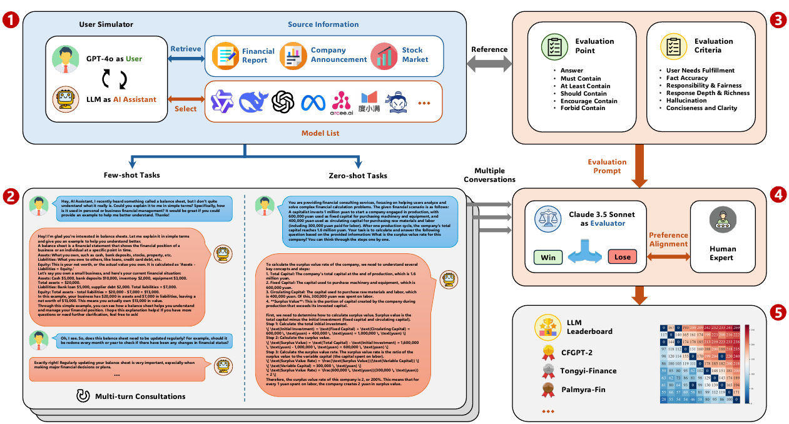

> The figure illustrates the five-stage evaluation pipeline of the UCFE benchmark, highlighting the roles of user simulator, LLM as AI assistant, evaluator, and human expert in assessing model performance.

> The figure illustrates the five-step evaluation pipeline of the UCFE benchmark, showing the process from model and task selection to final Elo score computation.

> The figure illustrates the five-stage evaluation pipeline of the UCFE benchmark, showing the process from selecting models and tasks to computing Elo scores based on human evaluations.

More on charts

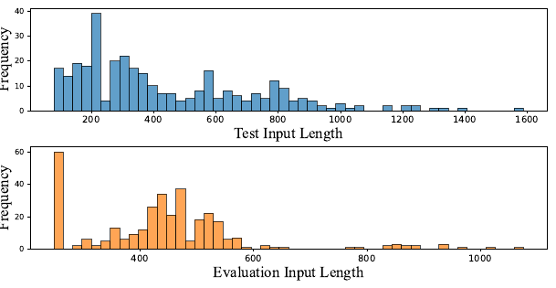

> The chart displays the distribution of average dialogue rounds and total tokens used across different models in few-shot tasks of the UCFE benchmark.

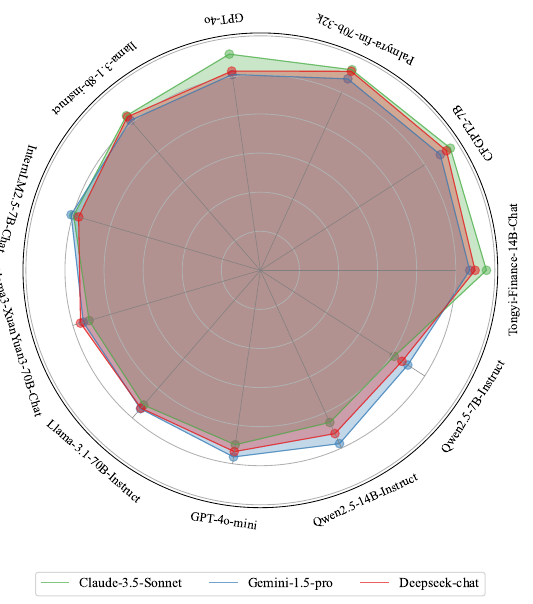

> The radar chart visualizes and compares the overall performance of different LLMs across multiple evaluation criteria using three different evaluators.

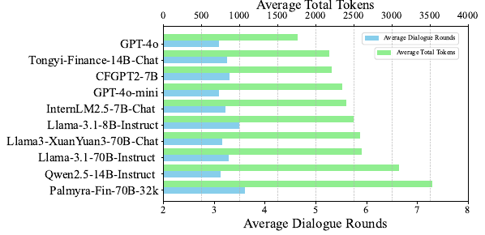

> The chart displays the average number of dialogue rounds and total tokens used across different large language models in few-shot tasks of the UCFE benchmark.

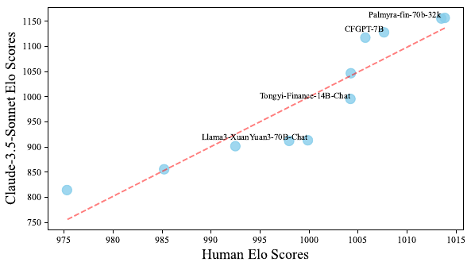

> The chart displays the strong positive correlation between human expert evaluations and model performance as assessed by Claude-3.5-Sonnet.

> The chart displays a comparison of model performance on the UCFE benchmark across three different evaluators, showing the overall Elo scores for each model.

> The chart shows the geographical distribution of 804 survey respondents, with the majority from China (62.9%), followed by the USA (35.9%), and a small percentage from other regions (1.2%).

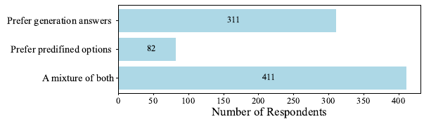

> The chart displays the number of survey respondents who prefer generation answers, predefined options, or a mixture of both when completing financial tasks using EastMoney data.

> The bar chart displays the frequency of responses from survey participants regarding their primary sources of financial information.

> The heatmap in Figure 14 shows the number of times each target model outperformed a baseline model across various tasks in the UCFE benchmark.

More on tables


<table id='0' style='font-size:16px'><tr><td>Category</td><td>Task</td><td>Source</td><td>Target User Group</td></tr><tr><td>Few-shot</td><td>Analyst Simulation Asset Valuation Reporting Company Evaluation Reporting Corporate Operation Analysis Credit Risk Evaluation Financial Knowledge Consulting Financial Regulation Consulting Industry Report Summarization Insider Trading Detection Investment Strategy Evaluation Investment Strategy Optimization Newshare Evaluation Reporting Prospectus Risk Summarization</td><td>TCL Annual Report & Analyst Report EastMoney Analyst Report Analyst Report GPT-4 Generated Investopedial Securities Law2 EastMoney Securities Regulatory Commission3 Seeking Alpha4 Financestrategists5 Stock.us6 Prospectus & Inquiry Letter7</td><td>Senior Analyst Analyst Analyst Analyst Analyst General Public & Financial Professional General Public & Financial Professional & Regulatory Professional General Public & Financial Professional Regulatory Professional Analyst Analyst Analyst General Public & Financial Professional</td></tr><tr><td>Zero-shot</td><td>Stock Price Prediction Negative Information Detection Financial Indicator Calculation Financial Text Summarization</td><td>A-stock Statistics EastMoney CPA & CFA News Headlines</td><td>General Public & Financial Professional General Public & Financial Professional General Public & Financial Professional General Public & Financial Professional</td></tr></table>

> Table 2 presents an overview of the UCFE benchmark's tasks, detailing their categories, data sources, and intended user groups.


<table id='3' style='font-size:16px'><tr><td>Task Type</td><td>Number of Tasks</td><td>Number of Questions</td></tr><tr><td>Zero-shot Tasks</td><td>4</td><td>80</td></tr><tr><td>Few-shot Tasks</td><td>13</td><td>250</td></tr><tr><td>Total</td><td>17</td><td>330</td></tr></table>

> Table 3 summarizes the number of tasks and questions included in the UCFE benchmark, categorized by zero-shot and few-shot task types.


 <table id='10' style='font-size:16px'><tr><td>Model</td><td>Type</td></tr><tr><td>CFGPT2-7B 1(Li et al., 2023a)</td><td>Financial</td></tr><tr><td>GPT-4o</td><td>General</td></tr><tr><td>GPT-4o-mini</td><td>General</td></tr><tr><td>InternLM2.5-7B-Chat (Cai et al., 2024)</td><td>General</td></tr><tr><td>Llama-3.1-70B-Instruct (AI@Meta, 2024)</td><td>General</td></tr><tr><td>Llama-3.1-8B-Instruct</td><td>General</td></tr><tr><td>Llama3-XuanYuan3-70B-Chat (Zhang et al., 2023b)</td><td>Financial</td></tr><tr><td>Palmyra-Fin-70B-32k (team, 2024)</td><td>Financial</td></tr><tr><td>Qwen2.5-14B-Instruct (Team, 2024)</td><td>General</td></tr><tr><td>Tongyi-Finance-14B-Chat2</td><td>Financial</td></tr></table>

> Table 4 lists the 11 large language models evaluated in the UCFE benchmark, specifying their type (general-purpose or financial).


<table id='2' style='font-size:16px'><tr><td>Model</td><td>Overall</td><td>Zero Shot</td><td>Few Shot</td><td>Win Counts</td></tr><tr><td>Tongyi-Finance-14B-Chat</td><td>1156.99</td><td>1007.52</td><td>1171.27</td><td>3614</td></tr><tr><td>CFGPT2-7B</td><td>1155.75</td><td>1125.33</td><td>1157.93</td><td>3972</td></tr><tr><td>Palmyra-Fin-70B-32k</td><td>1128.25</td><td>1028.18</td><td>1143.66</td><td>3634</td></tr><tr><td>GPT-4o</td><td>1117.68</td><td>979.85</td><td>1120.89</td><td>3040</td></tr><tr><td>Llama-3. 1-8B-Instruct</td><td>1046.87</td><td>1062.18</td><td>1051.32</td><td>3294</td></tr><tr><td>Internlm2.5-7b-chat</td><td>995.85</td><td>1009.78</td><td>1000.52</td><td>2964</td></tr><tr><td>Llama3-Xuan Yuan3-70B-Chat</td><td>913.48</td><td>934.51</td><td>911.59</td><td>2050</td></tr><tr><td>Llama-3. 1-70B-Instruct</td><td>912.26</td><td>986.77</td><td>906.80</td><td>2196</td></tr><tr><td>GPT-4o-mini</td><td>901.75</td><td>943.81</td><td>908.92</td><td>2326</td></tr><tr><td>Qwen2.5-14B-Instruct</td><td>855.82</td><td>974.27</td><td>840.05</td><td>1774</td></tr><tr><td>Qwen2.5-7B-Instruct</td><td>814.48</td><td>946.45</td><td>786.28</td><td>1312</td></tr></table>

> Table 5 presents the overall, zero-shot, and few-shot performance results of various LLMs across different tasks in the UCFE benchmark, using Elo scores to rank them.


<table id='9' style='font-size:14px'><tr><td>Test Prompt</td></tr><tr><td>Model Prompt:</td></tr><tr><td>You are providing a summary service for financial texts to help users extract key points from complex financial information.</td></tr><tr><td>The given financial text is: { information}</td></tr><tr><td>Your task is: {needs}.</td></tr></table>

> Table 2 provides a statistical breakdown of the UCFE benchmark tasks, detailing their categories, data sources, and intended user groups.

### Full paper


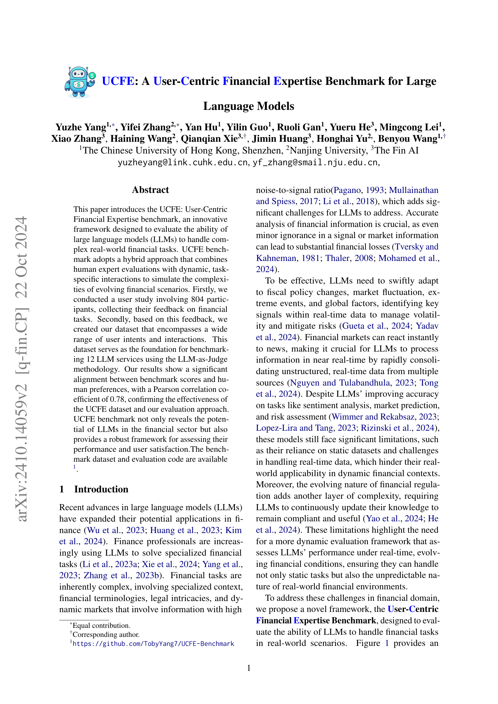
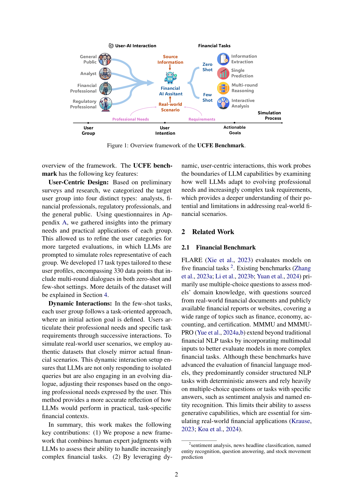
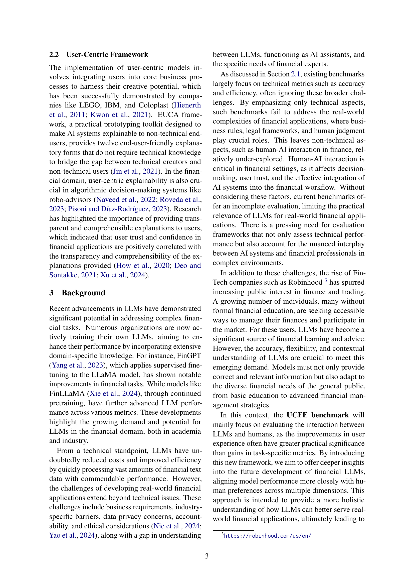
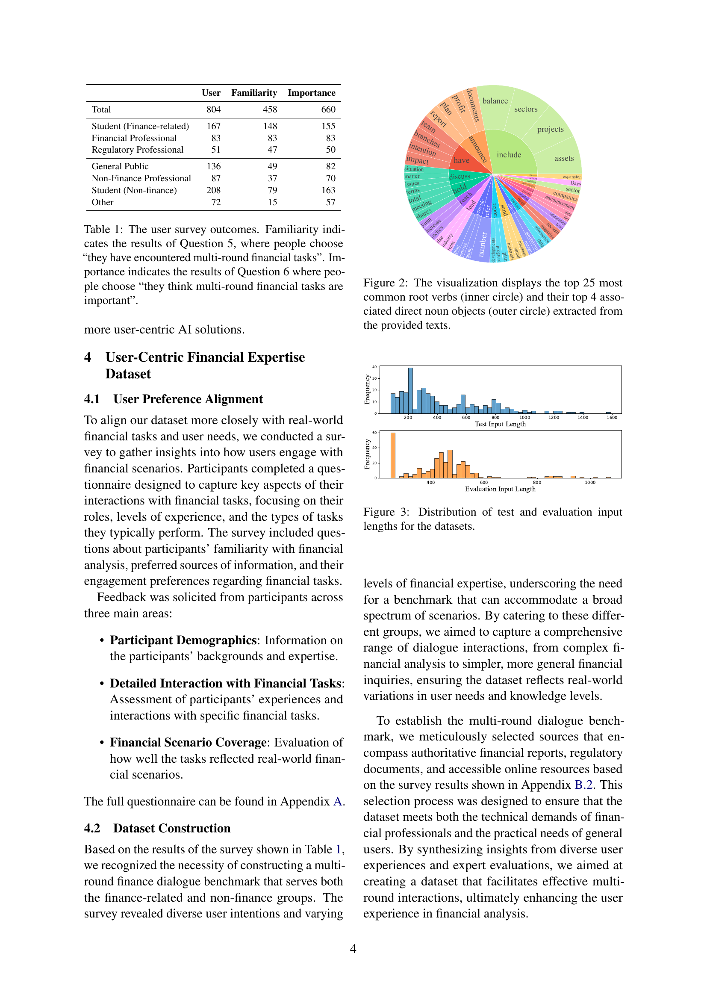
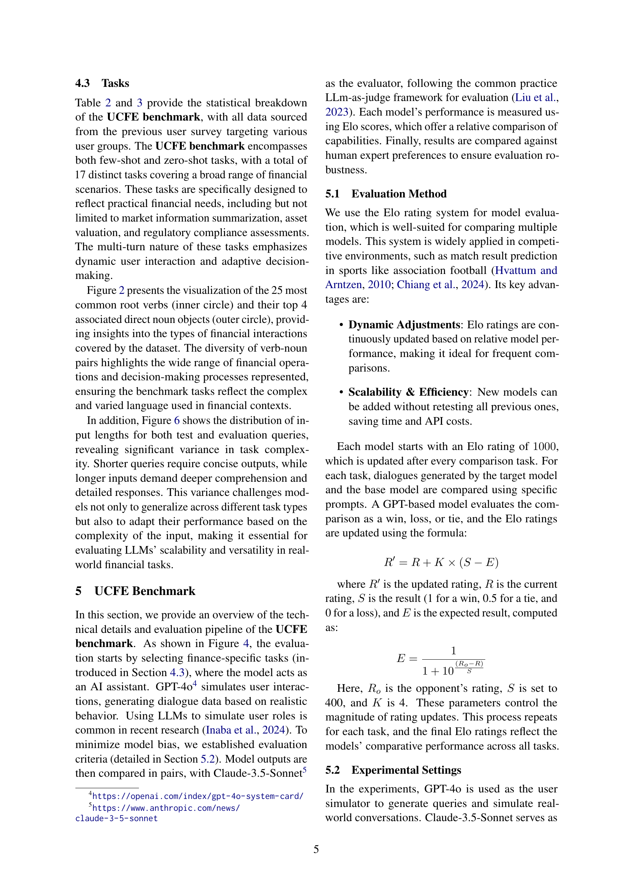
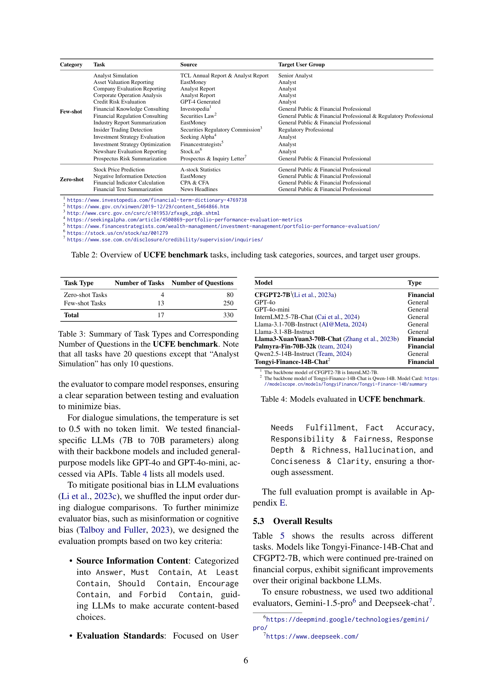
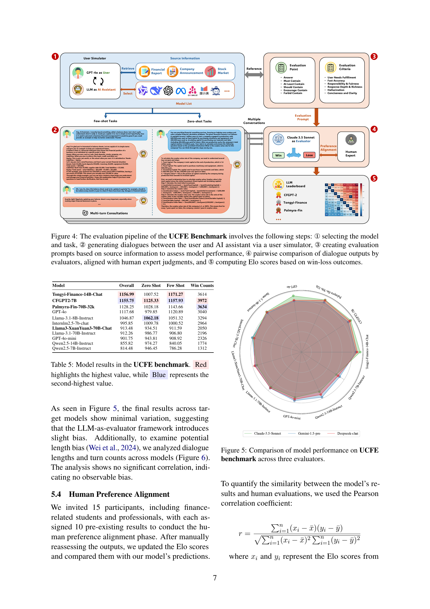

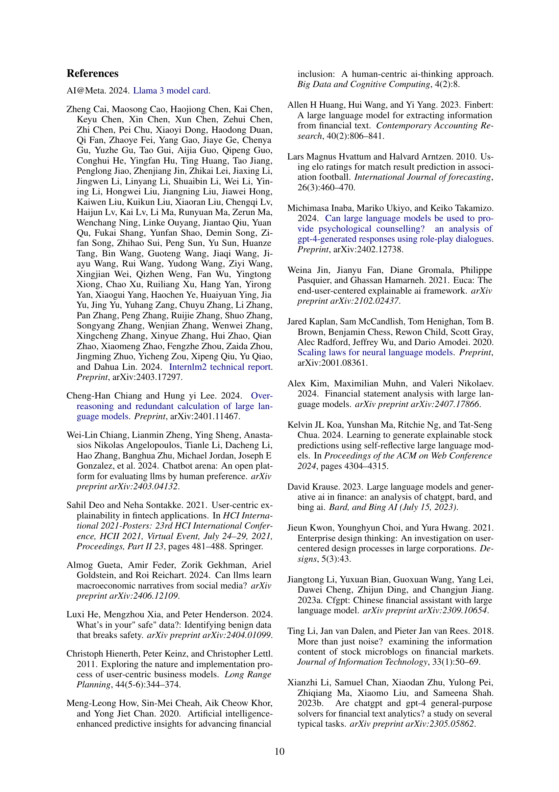
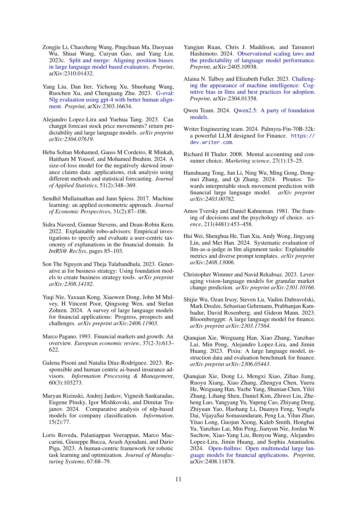
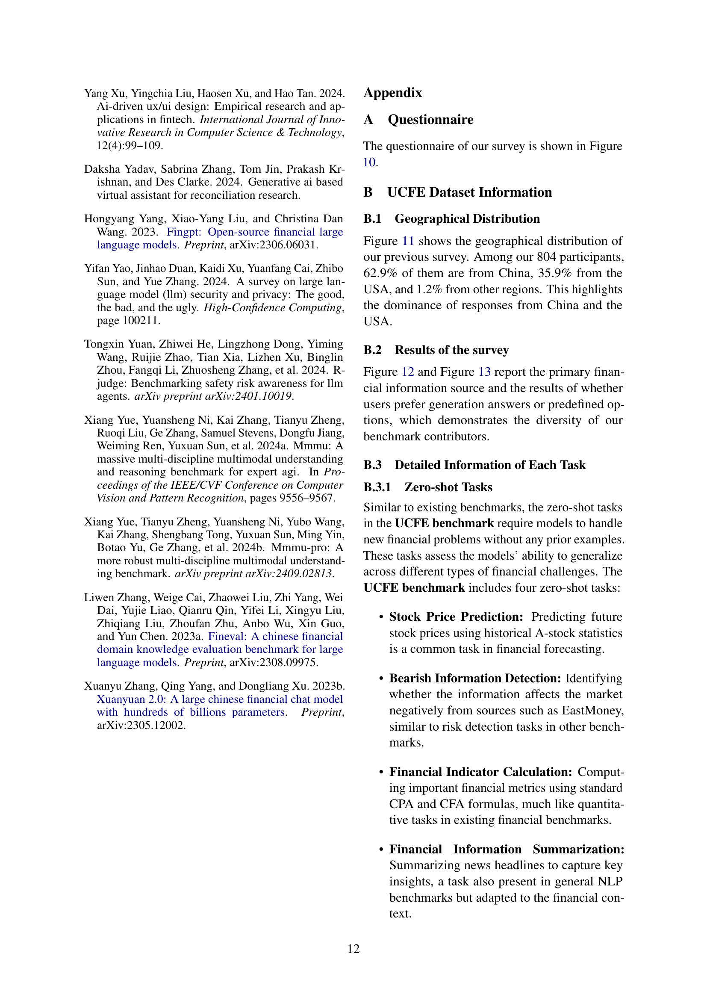

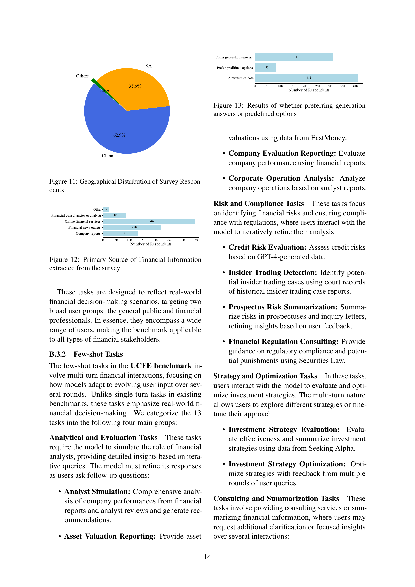

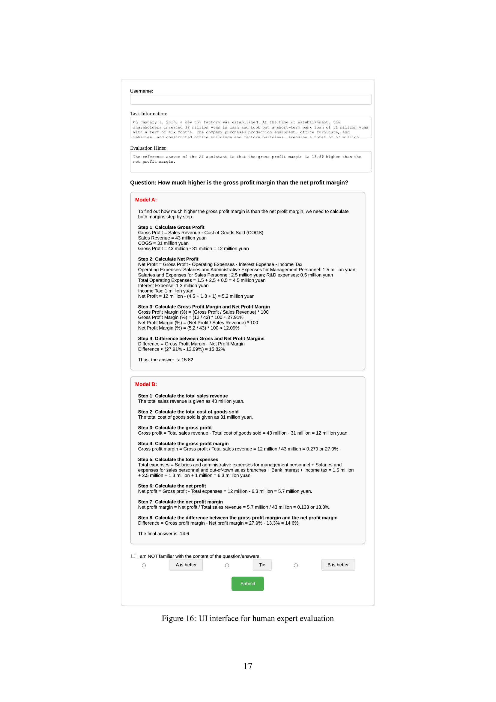
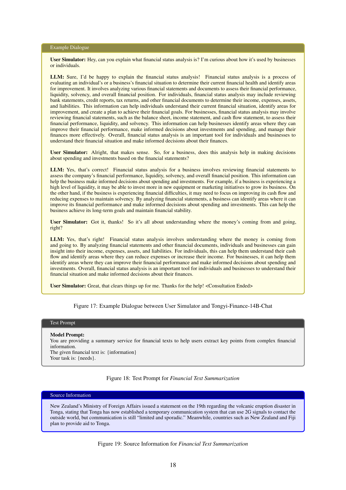

