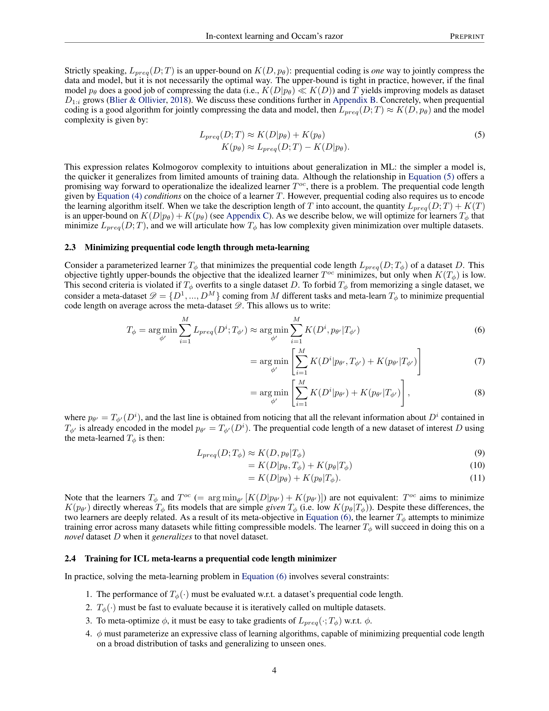
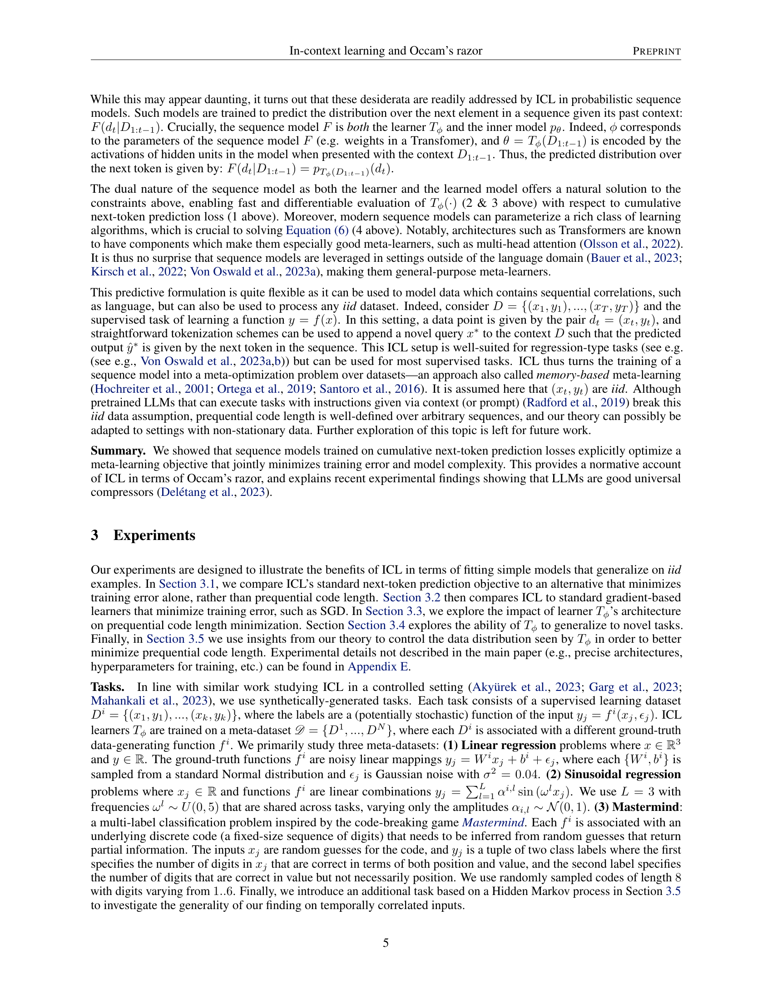
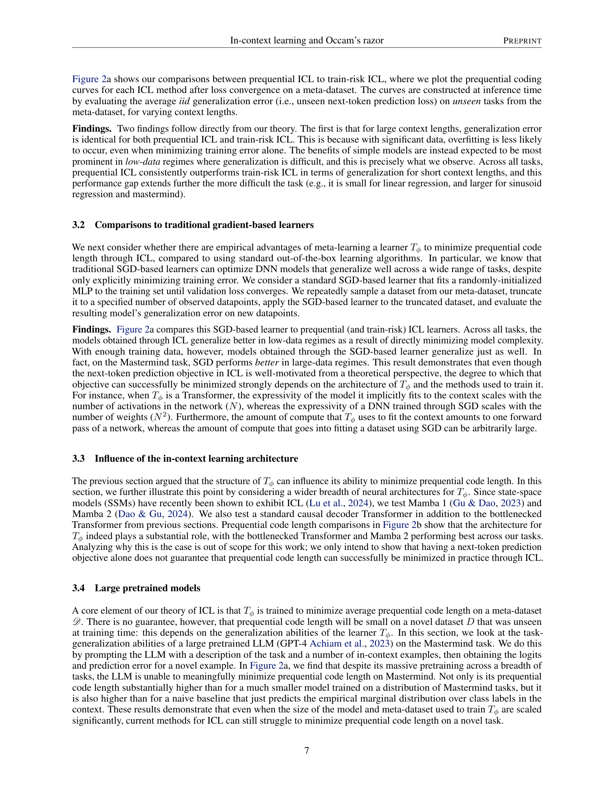
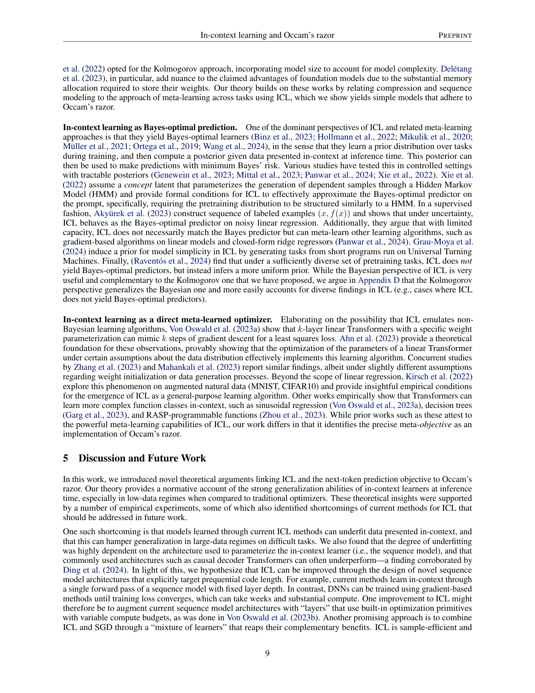
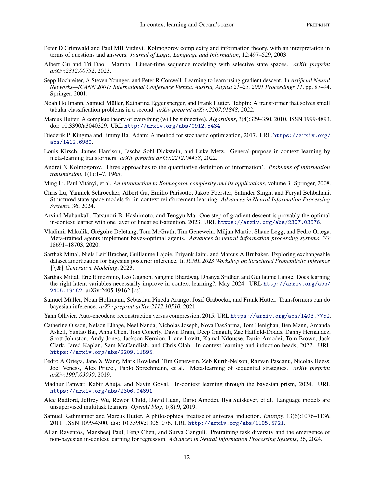
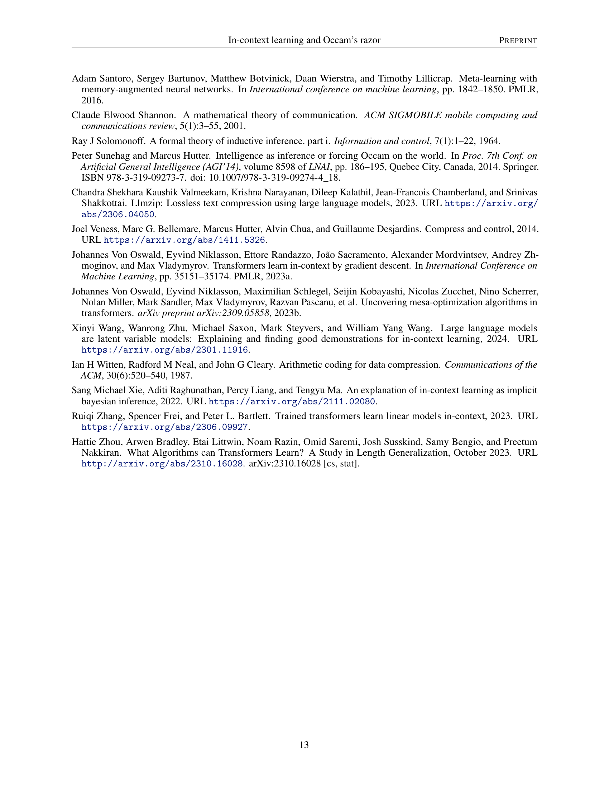
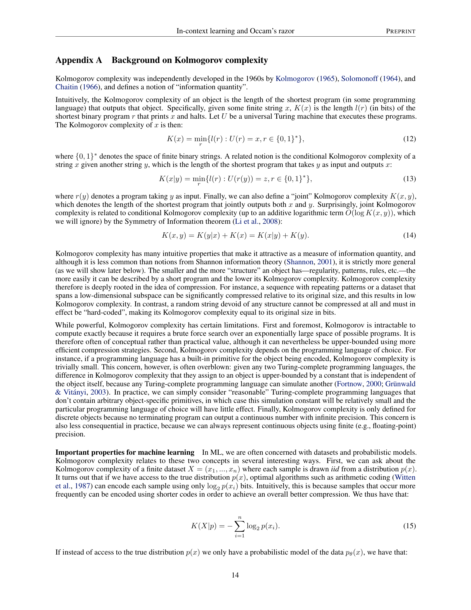
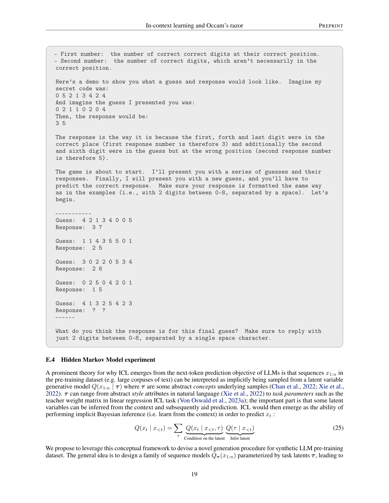
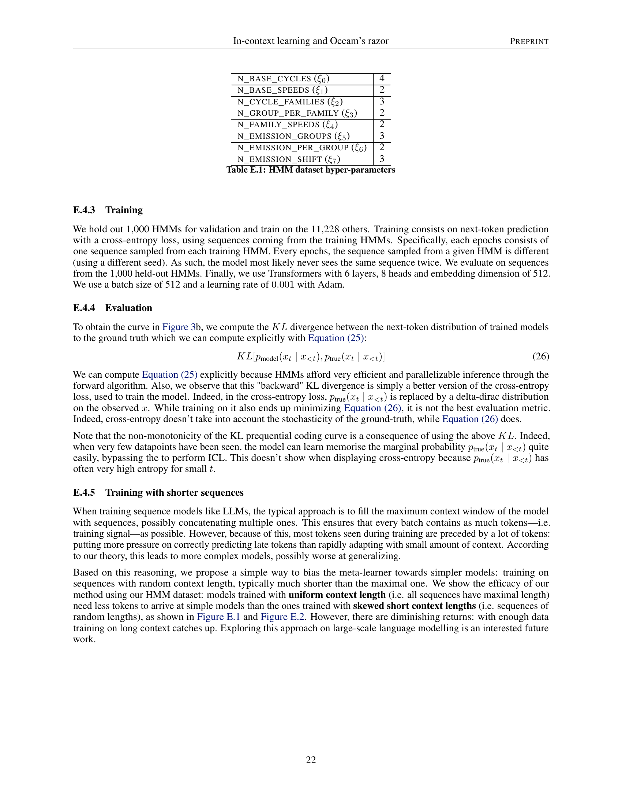

### TL;DR



This paper connects in-context learning (ICL), a machine learning technique where models learn from examples in their input sequence, with Occam's Razor, the principle that simpler explanations are generally better.  It shows that ICL's core objective (minimizing the next-token prediction loss) is the same as minimizing data compression through a technique called prequential coding. This means ICL simultaneously minimizes training error and model complexity, making it a practical application of Occam's Razor.  The researchers confirm this finding empirically. They also find that current ICL methods can underfit and show ways to potentially improve them.




 &nbsp; read the paper on arXiv


#### Why does it matter?
This research paper explores the connection between Occam's Razor and in-context learning (ICL) in machine learning models.  It demonstrates that ICL's next-token prediction objective is equivalent to prequential coding, a data compression technique.  By minimizing the prequential code length, ICL implicitly minimizes both training error and model complexity, effectively implementing Occam's Razor.  The paper also reveals limitations of current ICL methods and suggests avenues for improvement.
#### Key Takeaways


 In-context learning (ICL) implicitly minimizes model complexity alongside training error. 



 ICL's next-token prediction objective is mathematically equivalent to prequential coding (a data compression technique). 



 Current ICL methods have limitations, suggesting new avenues for research in improving model generalization. 


------
#### Visual Insights

 = K(D|pθ) + K(pθ) using θ’s learning algorithm T. a. Pseudocode of the prequential coding program, which jointly compresses D and pθ by incrementally training a model using T on increasingly more data. The primary contribution to total program length comes from specifying each next datapoint di+1 using the current model pθi, which takes −log2 pθi(di+1) bits. b. A visual illustration of prequential coding. As the learner T sees more data, it outputs models that assign a higher likelihood to new observations, and can thus better compress them. The total prequential code length Lpreq(D; T) is given by the area under the curve. The area underneath the curve’s last point is equal to the complexity of the dataset given the final model, K(D|pθ). Since Lpreq(D; T) = K(D|pθ) + K(pθ), the area above the curve’s last point is equal to K(pθ). Prequential coding formalizes the intuition that simple models generalize better from less data.")

> Figure 1 illustrates prequential coding, a method for estimating the joint complexity of a dataset and a model by incrementally training a model on increasingly more data and compressing each datapoint using the model.


<table id='2' style='font-size:14px'><tr><td>N BASE_ CYCLES (Eo)</td><td>4</td></tr><tr><td>N_BASE_SPEEDS (51 )</td><td>2</td></tr><tr><td>N CYCLE_FAMILIES (52)</td><td>3</td></tr><tr><td>N GROUP _PER_ FAMILY (E3)</td><td>2</td></tr><tr><td>N_FAMILY_SPEEDS (§4)</td><td>2</td></tr><tr><td>N EMISSION GROUPS (E5)</td><td>3</td></tr><tr><td>N_ EMISSION PER GROUP (56)</td><td>2</td></tr><tr><td>N EMISSION  SHIFT (57)</td><td>3</td></tr><tr><td colspan="2">Table E.1: HMM dataset hyper-parameters</td></tr></table>

> This table lists the hyperparameters used to generate the Hidden Markov Model (HMM) dataset used in the experiments.

### More visual insights

More on charts

 given observed contexts of increasing length (datapoints seen, x-axis). The area underneath these curves corresponds to prequential code length. Error is measured using MSE for linear and sinusoid regression and cross-entropy for Mastermind. a. ICL from next-token prediction objectives (prequential ICL, blue) yields lower prequential code lengths than ICL from past-token prediction objectives (train-risk ICL, orange), with greater effects in low-data regimes. An SGD-based learner (green) fits more complex models than prequential ICL and performs poorly in low-data regimes, but can generalize better in large-data regimes on a difficult Mastermind task due to underfitting in ICL. b. The architecture used to parameterize Tø has substantial influence on ICL's ability to minimize prequential code length.")

> The chart compares the generalization error of prequential ICL, train-risk ICL, and SGD across three different tasks (linear regression, sinusoid regression, and Mastermind) with varying context lengths, showing that prequential ICL outperforms the others, especially in low-data settings.

 given observed contexts of increasing length (datapoints seen, x-axis). The area underneath these curves corresponds to prequential code length. Error is measured using MSE for linear and sinusoid regression and cross-entropy for Mastermind. a. ICL from next-token prediction objectives (prequential ICL, blue) yields lower prequential code lengths than ICL from past-token prediction objectives (train-risk ICL, orange), with greater effects in low-data regimes. An SGD-based learner (green) fits more complex models than prequential ICL and performs poorly in low-data regimes, but can generalize better in large-data regimes on a difficult Mastermind task due to underfitting in ICL. b. The architecture used to parameterize Tø has substantial influence on ICL's ability to minimize prequential code length.")

> The chart compares the performance of different meta-learners (with different architectures) in minimizing prequential code length across various tasks, showing the impact of architecture and objective on generalization.

 given observed contexts of increasing length (datapoints seen, x-axis). The area underneath these curves corresponds to prequential code length. Error bars show standard error across 5 seeds. a. An LLM (GPT-4, red) fails to meaningfully minimize prequential code length on a novel Mastermind task, performing far worse than small ICL models trained on a distribution of Mastermind tasks (blue) and a naive baseline that predicts the marginal class distribution over the context (purple). Error is measured using cross-entropy. b. On a synthetic HMM dataset designed to mimic natural language, preferentially training on shorter contexts (red) yields lower prequential code lengths than training uniformly over context lengths (purple). Error is measured using reverse KL divergence between model and oracle conditioned on seen context.")

> The chart compares the performance of a large pretrained language model (LLM), a smaller transformer model trained with in-context learning (ICL), and a naive baseline on a Mastermind task, showing that ICL achieves lower prequential code lengths, especially when using shorter context lengths in training.

. We can see that the models trained on sequences with shorter length converge faster.")

> The chart displays the validation loss as a function of the number of tokens seen during training, showing faster convergence for models trained on shorter sequences.

> The chart displays prequential coding curves for models trained with uniform and skewed short context lengths, showing generalization error as a function of datapoints seen at different training stages.

### Full paper



