### TL;DR



This paper introduces MONTESSORI-INSTRUCT, a new method for creating training data for large language models (LLMs).  Unlike previous methods that simply use a 'teacher' LLM to generate data for a 'student' LLM, MONTESSORI-INSTRUCT focuses on making the generated data as effective as possible for the student. It does this by first measuring how useful different pieces of synthetic data are to the student's learning, using a technique called 'local data influence.' Then, it uses a method called 'Direct Preference Optimization' to fine-tune the teacher model, making it better at generating helpful training data for the student. Experiments show MONTESSORI-INSTRUCT significantly improves the student's performance compared to other methods.  This approach is particularly valuable because it directly addresses the issue of noisy or unhelpful synthetic data, a common problem in training LLMs.




 &nbsp; read the paper on arXiv


#### Why does it matter?
To provide a concise and informative summary of the research paper on MONTESSORI-INSTRUCT, highlighting its key contributions and importance for researchers.
#### Key Takeaways


 MONTESSORI-INSTRUCT significantly outperforms existing data synthesis methods by adapting to student learning preferences. 



 Local data influence functions accurately measure the impact of synthetic data points on student learning. 



 Direct Preference Optimization effectively guides the teacher model to generate more influential training data. 


------
#### Visual Insights

 and student (target) setups.")

> The figure illustrates four different data synthesis methods: Self-Instruct, Self-Reward, LLM2LLM, and Montessori-Instruct, highlighting their respective processes and components.

 and (b) illustrate the correlation between the teacher's learning process and the performance of the student trained on data synthesized by the intermediate teachers in Alpaca Eval and MT-Bench. Figure (c) depicts how the distribution of the local data influence of the teacher's synthetic data shifts as the teacher is progressively updated. Figure (d) presents the proportion of training data with positive local data influence during the student's training.")

> The chart shows the correlation between the teacher's learning progress and the student's performance, and the distribution of local data influence during the training process.


<table id='2' style='font-size:14px'><tr><td rowspan="3">Methods</td><td colspan="2">In-Domain</td><td colspan="6">Out-Of-Domain</td></tr><tr><td colspan="2">Alpaca Eval 2.0</td><td>MT-Bench</td><td>MMLU</td><td>GPQA</td><td>ARC-C</td><td>GSM8K</td><td>HellaSwag</td></tr><tr><td>LC-WR</td><td>WR</td><td>Score</td><td colspan="5">Accuracy</td></tr><tr><td colspan="9">8B Setting: Student=Llama3-8B</td></tr><tr><td>No fine-tuning</td><td>2.09%</td><td>3.39%</td><td>5.597</td><td>62.15</td><td>24.33</td><td>57.85</td><td>51.25</td><td>81.96</td></tr><tr><td>Self-Instruct</td><td>50%</td><td>50%</td><td>6.490</td><td>62.42</td><td>31.92</td><td>59.98</td><td>58.76</td><td>80.93</td></tr><tr><td>Self-Instruct*</td><td>54.95%</td><td>56.39%</td><td>5.918</td><td>63.41</td><td>30.13</td><td>60.58</td><td>50.42</td><td>81.42</td></tr><tr><td colspan="9">Self-Reward*</td></tr><tr><td>Iteration 1</td><td>51.87%</td><td>55.38%</td><td>6.713</td><td>62.46</td><td>28.19</td><td>59.84</td><td>53.60</td><td>81 .04</td></tr><tr><td>Iteration 2</td><td>53.49%</td><td>57.32%</td><td>6.798</td><td>62.02</td><td>29.08</td><td>60.64</td><td>56.37</td><td>81.13</td></tr><tr><td colspan="9">LLM2LLM</td></tr><tr><td>Iteration 1</td><td>51.49%</td><td>53.12%</td><td>6.531</td><td>62.18</td><td>29.12</td><td>57.49</td><td>55.28</td><td>80.49</td></tr><tr><td>Iteration 2</td><td>52.63%</td><td>55.02%</td><td>6.519</td><td>62.46</td><td>30.04</td><td>59.65</td><td>57.75</td><td>80.57</td></tr><tr><td colspan="9">Montessori-Instruct</td></tr><tr><td>Iteration 1</td><td>54.92%</td><td>58.59%</td><td>6.903</td><td>62.93</td><td>29.91</td><td>62.97</td><td>58.76</td><td>81.22</td></tr><tr><td>Iteration 2</td><td>56.82%</td><td>60.23%</td><td>7.092</td><td>63.44</td><td>31.19</td><td>59.98</td><td>60.05</td><td>81.98</td></tr><tr><td colspan="9">1.1B Setting: Student=Tinyllama-1.1B</td></tr><tr><td>No fine-tuning</td><td>17.89%</td><td>17.56%</td><td>1.020</td><td>26.16</td><td>23.88</td><td>37.12</td><td>1.97</td><td>62.61</td></tr><tr><td>Self-Instruct</td><td>50%</td><td>50%</td><td>2.154</td><td>26.21</td><td>24.78</td><td>37.97</td><td>1.82</td><td>62.47</td></tr><tr><td>Self-Instruct*</td><td>54.02%</td><td>55.02%</td><td>1.928</td><td>26.64</td><td>24.33</td><td>38.82</td><td>2.20</td><td>63.17</td></tr><tr><td colspan="9">Self-Reward*</td></tr><tr><td>Iteration 1</td><td>47.62%</td><td>48.34%</td><td>1.804</td><td>26.34</td><td>23.92</td><td>37.64</td><td>1.76</td><td>62.27</td></tr><tr><td>Iteration 2</td><td>46.48%</td><td>46.95%</td><td>1.717</td><td>26.09</td><td>24.62</td><td>38.03</td><td>1.76</td><td>62.79</td></tr><tr><td colspan="9">LLM2LLM</td></tr><tr><td>Iteration 1</td><td>52.03%</td><td>52.75%</td><td>2.243</td><td>25.87</td><td>24.51</td><td>36.86</td><td>2.24</td><td>62.15</td></tr><tr><td>Iteration 2</td><td>51.64%</td><td>53.52%</td><td>2.192</td><td>25.62</td><td>24.84</td><td>36.74</td><td>2.31</td><td>62.08</td></tr><tr><td colspan="9">Montessori-Instruct</td></tr><tr><td>Iteration 1</td><td>53.25%</td><td>51.77%</td><td>2.485</td><td>26.23</td><td>23.92</td><td>37.97</td><td>2.35</td><td>62.59</td></tr><tr><td>Iteration 2</td><td>54.52%</td><td>54.97%</td><td>2.504</td><td>26.35</td><td>24.88</td><td>38.11</td><td>2.91</td><td>63.55</td></tr></table>

> Table 1 presents the performance comparison of different data synthesis methods on training 8B and 1.1B language models, evaluating both in-domain and out-of-domain tasks.

### More visual insights

More on figures

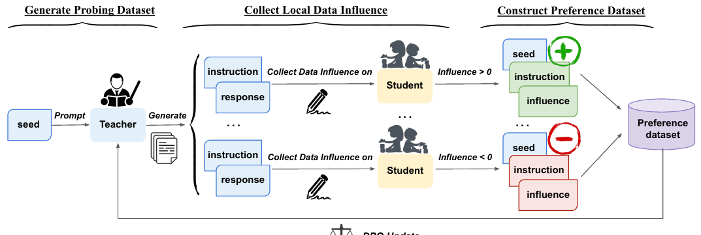

> This figure illustrates the process of Montessori-Instruct, showing how local data influence is collected from a student model, used to construct a preference dataset, and then used to guide the optimization of a teacher model to generate training data.

> The figure shows the head-to-head win rates of different iterations of Montessori-Instruct against Self-Instruct and between different iterations.

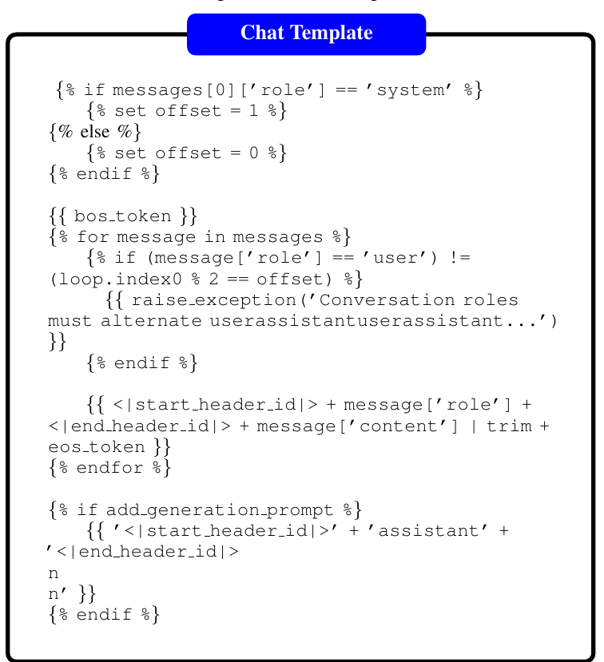

> This figure illustrates the process of student-preference-guided teacher optimization in the Montessori-Instruct framework, showing how local data influence is collected and used to optimize the teacher model.

 and their top direct noun objects (outer circle) in generated instructions.")

> The figure is a pair of word clouds showing the most common root verbs and their corresponding noun objects in instructions generated by Self-Instruct and Montessori-Instruct, illustrating differences in the complexity and informativeness of the generated instructions.

 and their top 4 direct noun objects (outer circle) in generated instructions")

> The figure is a word cloud showing the most frequent root verbs and their corresponding noun objects in instructions generated by Self-Instruct and Montessori-Instruct, highlighting differences in instruction complexity and informativeness.

 and their top 4 direct noun objects (outer circle) in generated instructions.")

> The figure shows a comparison of the most common root verbs and their direct noun objects used in instructions generated by Self-Instruct and Montessori-Instruct, illustrating the shift in instruction complexity and focus.

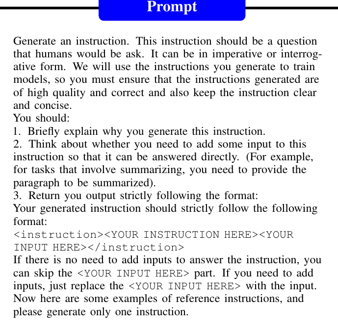

> The figure illustrates the process of Montessori-Instruct, showing how local data influence is collected to guide teacher optimization, leading to the generation of student-preference-aligned synthetic data.

More on charts

 and (b) illustrate the correlation between the teacher's learning process and the performance of the student trained on data synthesized by the intermediate teachers in Alpaca Eval and MT-Bench. Figure (c) depicts how the distribution of the local data influence of the teacher's synthetic data shifts as the teacher is progressively updated. Figure (d) presents the proportion of training data with positive local data influence during the student's training.")

> The chart displays the correlation between the teacher's learning progress and student performance, showing how the distribution of local data influence changes, and the proportion of positive influence during training.

 and (b) illustrate the correlation between the teacher's learning process and the performance of the student trained on data synthesized by the intermediate teachers in Alpaca Eval and MT-Bench. Figure (c) depicts how the distribution of the local data influence of the teacher's synthetic data shifts as the teacher is progressively updated. Figure (d) presents the proportion of training data with positive local data influence during the student's training.")

> Figure 3 shows the correlation between the teacher's learning process and student performance, the distribution shift of local data influence, and the proportion of training data with positive influence.

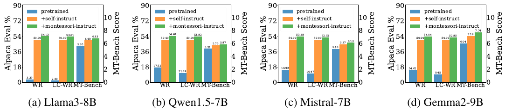

> The chart displays the performance of four different student language models trained on synthetic data generated by a teacher model optimized for a smaller student model's preferences, comparing their performance with a baseline model.

 and their top 4 direct noun objects (outer circle) in generated instructions")

> The chart compares the frequency of root verbs and their corresponding noun objects used in instructions generated by Self-Instruct and Montessori-Instruct, highlighting differences in instruction style and complexity.

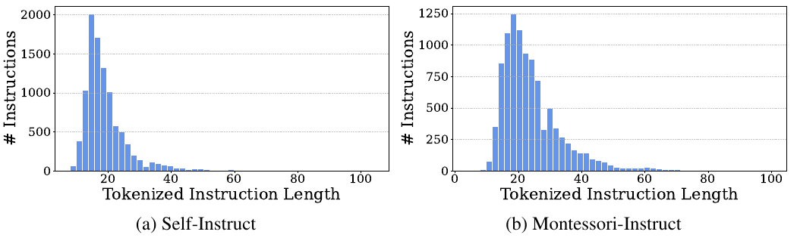

> The chart displays the distribution of tokenized instruction lengths generated by Self-Instruct and Montessori-Instruct, showing that Montessori-Instruct produces longer instructions.

> The chart displays the distribution of tokenized response lengths generated by the Self-Instruct and Montessori-Instruct methods.

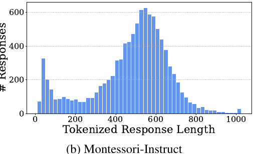

> The chart displays the distribution of tokenized response lengths generated by the Self-Instruct and Montessori-Instruct methods.

More on tables


<table id='2' style='font-size:14px'><tr><td rowspan="2">Methodological design</td><td colspan="2">Alpaca Eval 2.0</td><td>MT-Bench</td><td>MMLU</td><td>GPQA</td><td>ARC-C</td><td>GSM8K</td><td>HellaSwag</td></tr><tr><td>LC-WR</td><td>WR</td><td>Score</td><td colspan="5">Accuracy</td></tr><tr><td colspan="9">Effectiveness of Local Data Influence</td></tr><tr><td>LLM-as-a-Judge</td><td>53.42%</td><td>54.93%</td><td>6.731</td><td>62.93</td><td>29.75</td><td>62.09</td><td>58.82</td><td>81.05</td></tr><tr><td>Training loss</td><td>52.34%</td><td>54.99%</td><td>6.656</td><td>62.54</td><td>29.89</td><td>61.48</td><td>58.76</td><td>80.93</td></tr><tr><td>Local data influence (Ours)</td><td>54.92%</td><td>58.59%</td><td>6.903</td><td>62.93</td><td>29.91</td><td>62.97</td><td>58.76</td><td>81.22</td></tr><tr><td colspan="9">Effectiveness of Teacher Optimization</td></tr><tr><td>Bootstrap</td><td>50.59%</td><td>48.14%</td><td>6.618</td><td>60.67</td><td>25.19</td><td>57.95</td><td>58.13</td><td>80.46</td></tr><tr><td>Response optimization</td><td>51.59%</td><td>54.22%</td><td>6.556</td><td>62.43</td><td>27.45</td><td>60.42</td><td>56.38</td><td>81.04</td></tr><tr><td>Instruction optimization (Ours)</td><td>54.92%</td><td>58.59%</td><td>6.903</td><td>62.93</td><td>29.91</td><td>62.97</td><td>58.76</td><td>81.22</td></tr><tr><td colspan="9">Effectiveness of Seed Data</td></tr><tr><td>Open Assistant (OOD)</td><td>52.28%</td><td>54.76%</td><td>6.706</td><td>62.86</td><td>29.74</td><td>62.29</td><td>58.42</td><td>81.24</td></tr><tr><td>Alpaca GPT4 (ID) (Ours)</td><td>54.92%</td><td>58.59%</td><td>6.903</td><td>62.93</td><td>29.91</td><td>62.97</td><td>58.76</td><td>81.22</td></tr><tr><td>Alpaca Eval (Test)</td><td>57.64%</td><td>61.36%</td><td>7.147</td><td>62.93</td><td>30.44</td><td>63.06</td><td>60.80</td><td>81.09</td></tr></table>

> Table 1 presents the overall performance comparison of different data synthesis methods on training 8B and 1.1B language models, evaluating both in-domain and out-of-domain tasks.


 <table id='2' style='font-size:14px'><tr><td>Positive</td><td>Negative</td></tr><tr><td>[Instruction]: What is the most efficient way to transport a given package across a city, considering traffic congestion, distance, and cost? [Response]: The most efficient way to transport a pack- age across a city depends on several factors, including the package's size, weight, fragility, and urgency, as well as the city's traffic patterns, infrastructure, and regulations. Here are some general considerations and options to minimize costs, reduce congestion, and ensure timely delivery: 1. **Distance and Route Optimization**: * Use online route planners or transportation manage- ment software to determine the shortest and most efficient route. * Consider alternative routes or modes of transportation if the primary route is congested or closed. 2. **Traffic Congestion Mitigation**: * Avoid peak hours (7-9 am and 4-6 pm) when possible, as traffic congestion is typically highest during these times...</td><td>[Instruction]: Explain the concept of artificial intelligence in 100 words. [Response]: Artificial intelligence (AI) refers to the development of computer systems that can perform tasks that typically require hu- man intelligence, such as learning, problem- solving, and decision-making. AI systems use algorithms and data to analyze and interpret in- formation, allowing them to make predictions, classify objects, and generate insights. They can be trained on large datasets to improve their performance over time, and can even adapt to new situations and learn from experience. AI has many applications, including robotics, nat- ural language processing, image recognition, and expert systems, and is increasingly being used in industries such as healthcare, finance, and transportation.</td></tr><tr><td>[Instruction]: Can you write a script for a public service announcement about the importance of recycling? [Response]: Here is a script for a public service announce- ment about the importance of recycling: [Opening shot of a beautiful park or nature reserve, with a narrator speaking] Narrator: "Imagine a world where our planet is thriving, where wildlife roams free, and where our communities are healthy and strong. But to get there, we need to take action.' , [Cut to a shot of a person holding a plastic bottle and throw- ing it away] Narrator: "One of the simplest and most effective ways to make a difference is by recycling." ...</td><td>[Instruction]: Can you translate the following text from english to spanish: "the hotel room was comfortable and clean." [Response]: The translation of the text from English to Spanish is: "El cuarto de hotel era comodo y limpio." Here's a breakdown of the translation: * "the hotel room = "el cuarto de hotel" * "was" = "era" (verb conjugation) * , "comfortable" = "c�modo" * "and" = "y" (conjunction) * "clean" = "limpio" So, the complete sentence in Spanish is: "El cuarto de hotel era comodo y limpio."</td></tr></table>

> Table 1 presents the performance comparison of different data synthesis methods on training 8B and 1.1B language models, including in-domain and out-of-domain evaluations.


<table id='7' style='font-size:14px'><tr><td>Method</td><td>Learning Rate</td><td>Weight Decay</td><td>Warmup Ratio</td><td>Stable Ratio</td><td>Decay Ratio</td></tr><tr><td>SFT</td><td>5.0e - 6</td><td>0.0</td><td>0.1</td><td>0.5</td><td>0.4</td></tr><tr><td>DPO</td><td>1.0e - 6</td><td>0.0</td><td>0.1</td><td>0.5</td><td>0.4</td></tr><tr><td>Method</td><td>Minium Learning Rate</td><td>Epoch</td><td>Per Device Train Batch Size</td><td>Gradient Accumulation</td><td>Train Batch Size</td></tr><tr><td>SFT</td><td>5.0e - 9</td><td>1</td><td>2</td><td>2</td><td>32</td></tr><tr><td>DPO</td><td>1.0e - 9</td><td>1</td><td>2</td><td>1</td><td>2</td></tr><tr><td>Method</td><td>Max Length</td><td>Dropout</td><td>BF16</td><td>Flash Attention 2</td><td>Beta</td></tr><tr><td>SFT</td><td>1024</td><td>0.0</td><td>True</td><td>True</td><td>-</td></tr><tr><td>DPO</td><td>1024</td><td>0.0</td><td>True</td><td>True</td><td>0.1</td></tr></table>

> The table presents the performance comparison of different data synthesis methods in training 8B and 1.1B language models on various in-domain and out-of-domain tasks.


<table id='4' style='font-size:14px'><tr><td></td><td>Generate Instruction</td><td>Generate Responses</td></tr><tr><td>temperature</td><td>1</td><td>0.6</td></tr><tr><td>top-p</td><td>0.9</td><td>0.9</td></tr><tr><td>frequency. _penalty</td><td>0</td><td>0</td></tr><tr><td>presence_penalty</td><td>1</td><td>1</td></tr><tr><td>repetition_penalty</td><td>1.5</td><td>1</td></tr><tr><td>max_token</td><td>1024</td><td>1024</td></tr></table>

> Table 1 presents the performance comparison of different data synthesis methods on training 8B and 1.1B language models, using various in-domain and out-of-domain evaluation metrics.


<table id='2' style='font-size:14px'><tr><td rowspan="3">Methods</td><td colspan="2">In-Domain</td><td colspan="6">Out-Of-Domain</td></tr><tr><td colspan="2">Alpaca Eval 2.0</td><td>MT-Bench</td><td>MMLU</td><td>GPQA</td><td>ARC-C</td><td>GSM8K</td><td>HellaSwag</td></tr><tr><td>LC-WR</td><td>WR</td><td>Score</td><td colspan="5">Accuracy</td></tr><tr><td colspan="9">8B Setting: Student=Llama3-8B</td></tr><tr><td>No fine-tuning</td><td>2.09%</td><td>3.39%</td><td>5.597</td><td>62.15</td><td>24.33</td><td>57.85</td><td>51.25</td><td>81.96</td></tr><tr><td>Self-Instruct</td><td>50%</td><td>50%</td><td>6.490</td><td>62.42</td><td>31.92</td><td>59.98</td><td>58.76</td><td>80.93</td></tr><tr><td>Self-Reward</td><td></td><td></td><td></td><td></td><td></td><td></td><td></td><td></td></tr><tr><td>Iteration 1</td><td>2.45%</td><td>4.06%</td><td>5.442</td><td>61.79</td><td>24.30</td><td>57.81</td><td>49.92</td><td>80.75</td></tr><tr><td>Iteration 2</td><td>2.69%</td><td>4.71%</td><td>5.428</td><td>61.79</td><td>23.58</td><td>57.64</td><td>49.53</td><td>80.17</td></tr><tr><td colspan="9">1.1B Setting: Student=Tinyllama-1.1B</td></tr><tr><td>No fine-tuning</td><td>17.89%</td><td>17.56%</td><td>1.020</td><td>26.16</td><td>23.88</td><td>37.12</td><td>1.97</td><td>62.61</td></tr><tr><td>Self-Instruct</td><td>50%</td><td>50%</td><td>2.154</td><td>26.21</td><td>24.78</td><td>37.97</td><td>1.82</td><td>62.47</td></tr><tr><td>Self-Reward</td><td></td><td></td><td></td><td></td><td></td><td></td><td></td><td></td></tr><tr><td>Iteration 1</td><td>7.79%</td><td>8.13%</td><td>1.000</td><td>23.58</td><td>22.30</td><td>36.55</td><td>0.94</td><td>61.92</td></tr><tr><td>Iteration 2</td><td>6.34%</td><td>7.57%</td><td>1.000</td><td>23.44</td><td>22.06</td><td>36.49</td><td>0.98</td><td>61.24</td></tr></table>

> Table 1 presents the performance comparison of different data synthesis methods on Alpaca Eval 2.0 and various out-of-domain tasks using Llama-8B and Tinyllama-1.1B as student models.


<table id='2' style='font-size:14px'><tr><td>Task</td><td>Sub task</td><td>8B</td><td>1B</td></tr><tr><td rowspan="6">collect local data influence / per data</td><td rowspan="6">generate instructions generate responses load warmuped ckpt from disk fine-tune for one step eval on reference set total</td><td colspan="2">0.372s 0.031s</td></tr><tr><td>2.69s</td><td>1.08s</td></tr><tr><td></td><td></td></tr><tr><td>4.12s</td><td>0.79s</td></tr><tr><td>4.19s</td><td>1.26s</td></tr><tr><td>13.403s</td><td>3.533s</td></tr><tr><td colspan="2">Task</td><td>8B</td><td>1B</td></tr><tr><td colspan="2">Time for DPO Training / per data</td><td colspan="2">0.362s</td></tr><tr><td>Task</td><td>Method</td><td>8B</td><td>1B</td></tr><tr><td rowspan="2">Time for obtaining the final student model / per data</td><td>Self-Instruct</td><td>0.486s</td><td>0.422s</td></tr><tr><td>Montessori-Instruct</td><td>5.842s</td><td>1.834s</td></tr></table>

> Table 1 presents the performance comparison of different data synthesis methods in training 8B and 1.1B language models on various in-domain and out-of-domain tasks, including the use of different teacher models and iterative training.

### Full paper


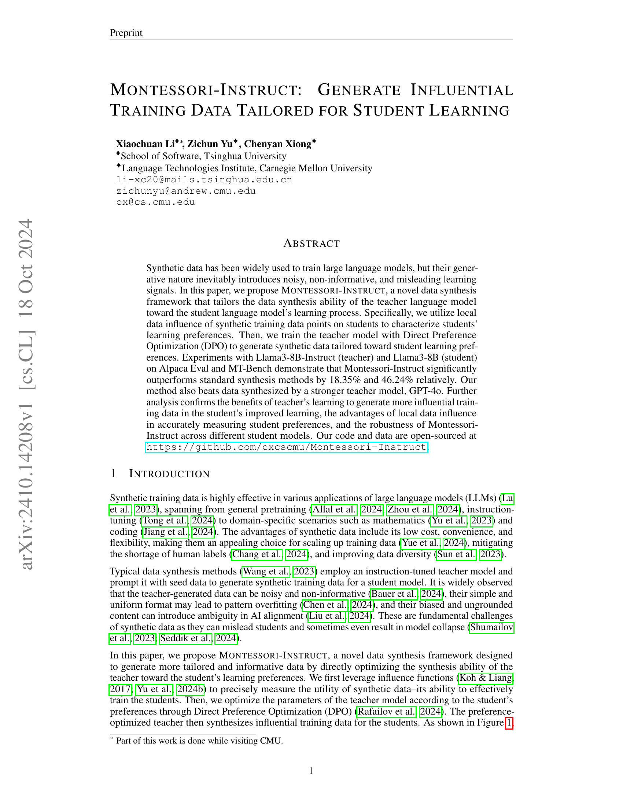

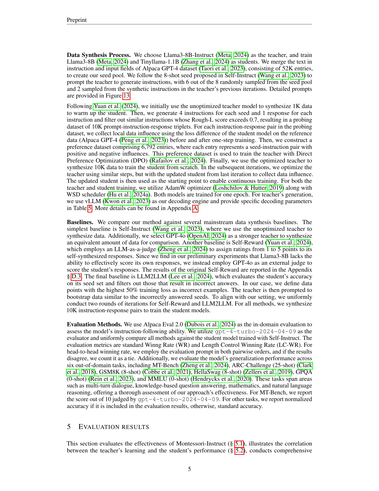

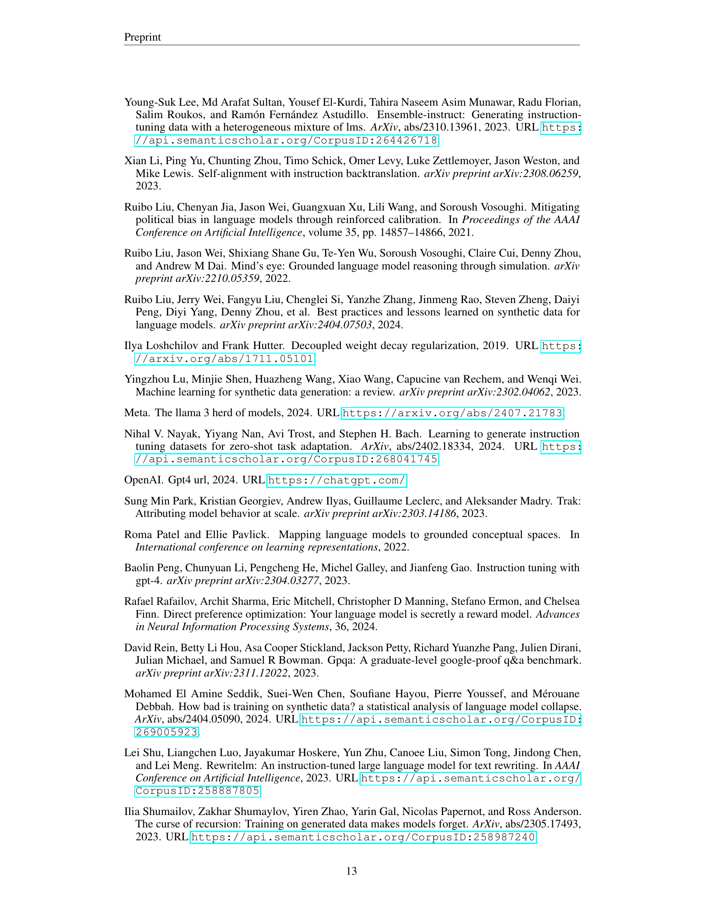
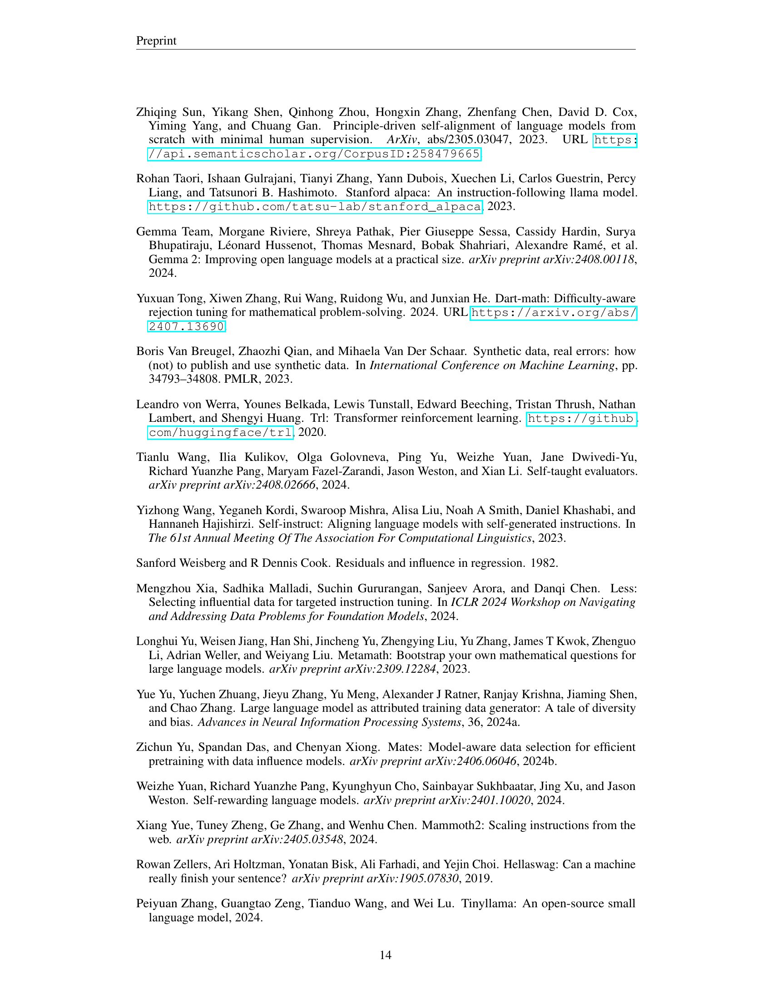

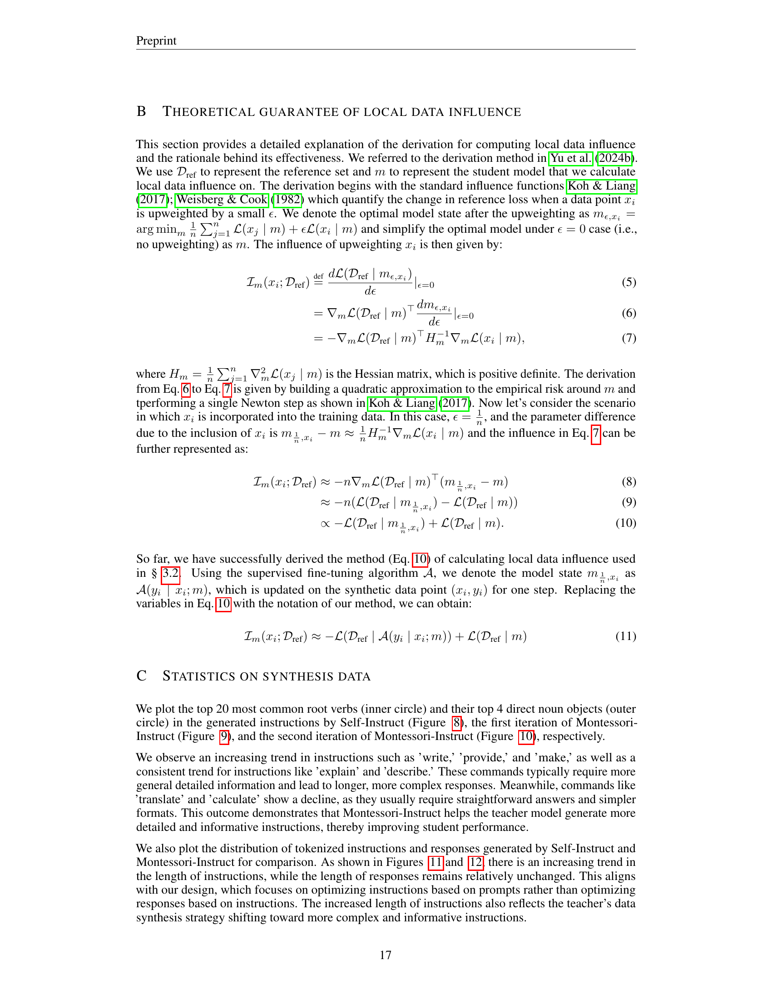

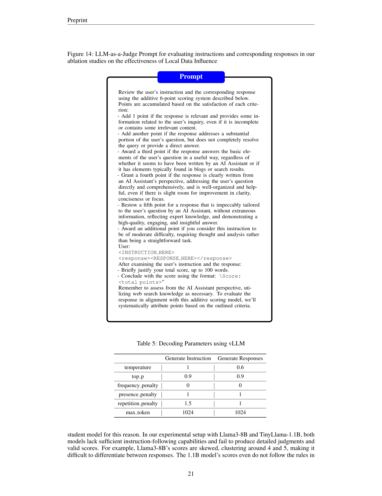

