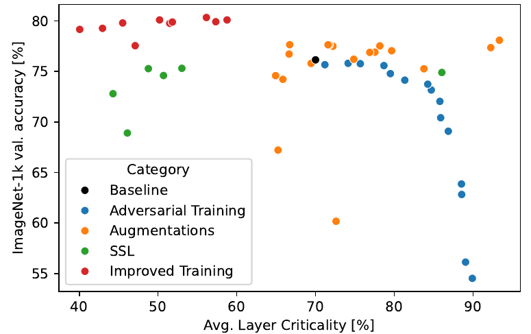
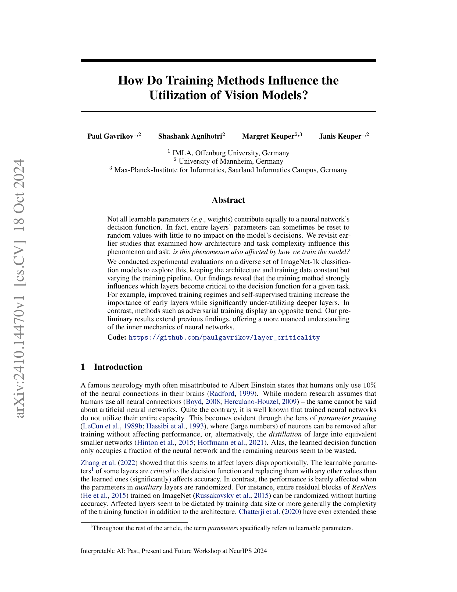
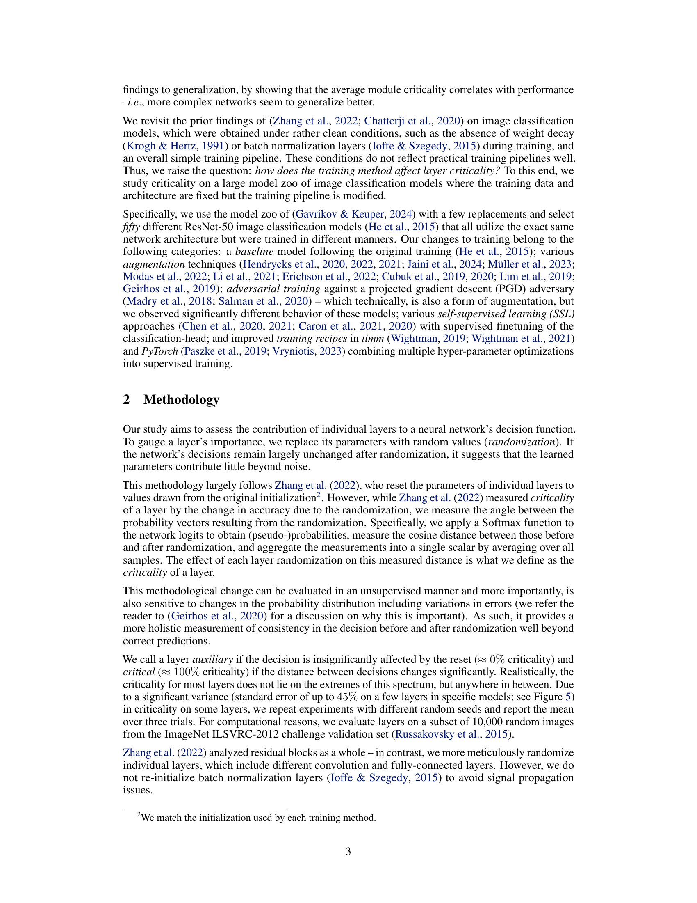
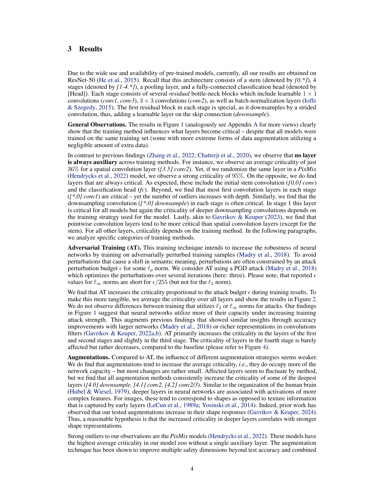
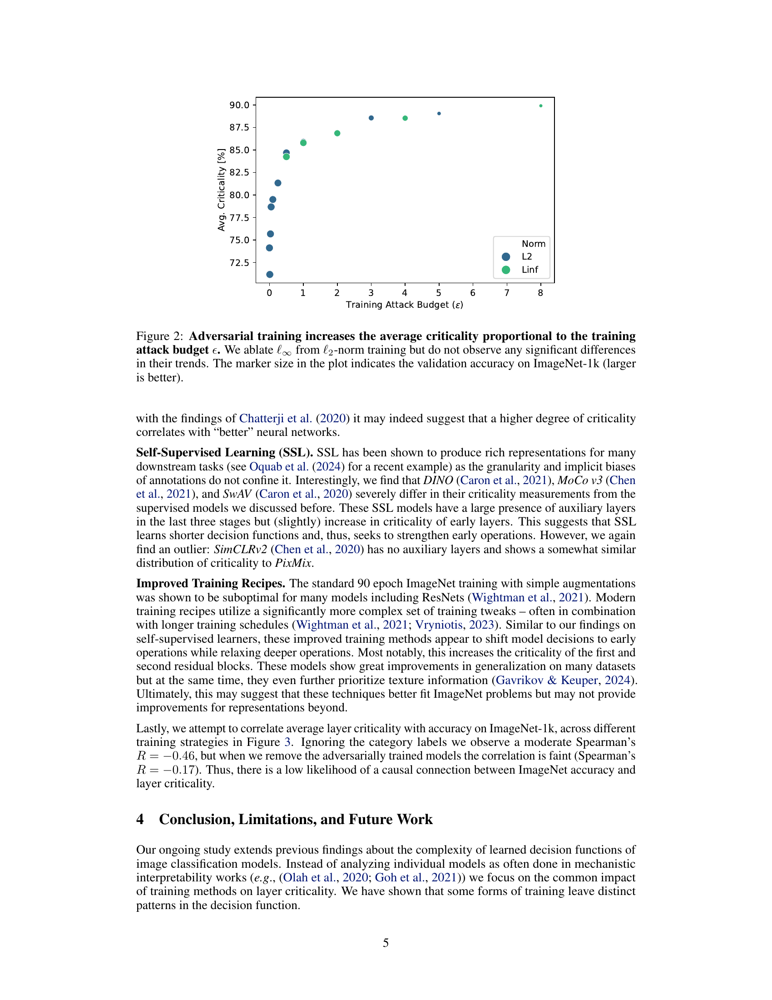
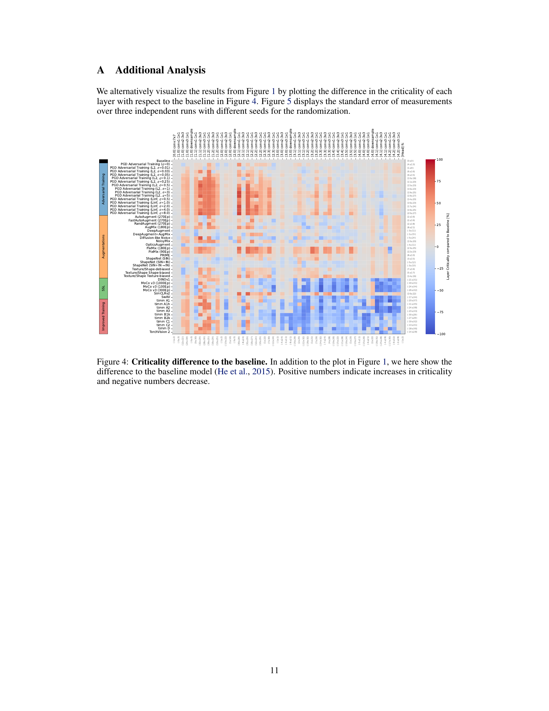
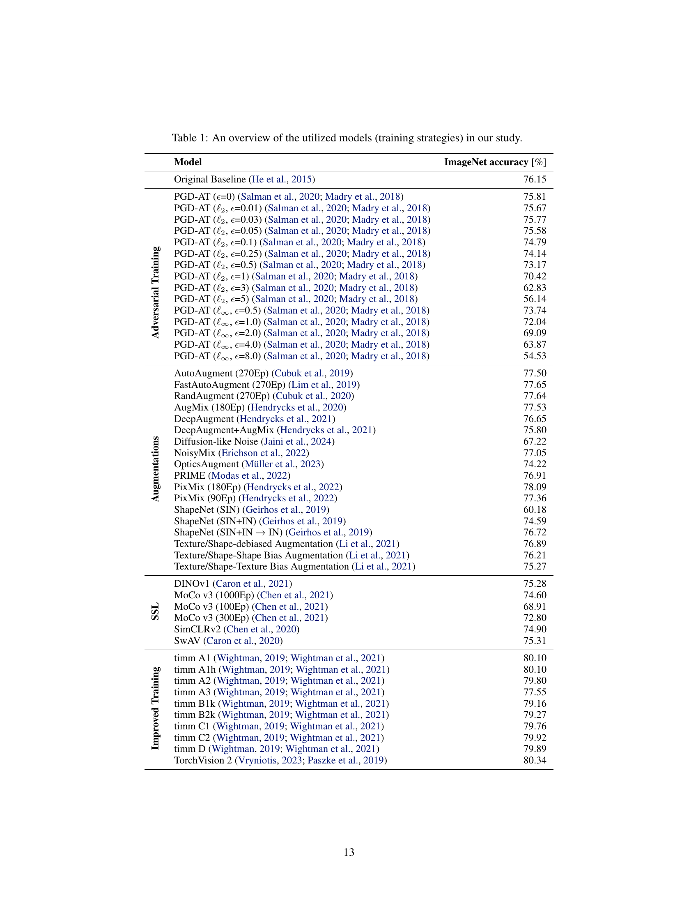

### TL;DR



This research explores how different training methods affect the way vision models make decisions.  The researchers tested this by training many image classification models, all with the same structure and data but varying training techniques (like adding extra noise to training images or using self-supervised learning). They then measured which parts (or layers) of the models were essential for making correct predictions.  The key finding is that different training methods make different parts of the model more important. For example, models trained with improved techniques relied heavily on the early layers, while models trained with adversarial methods relied more on deeper layers.  The study provides a more nuanced understanding of how neural networks work, especially in showing how the training process itself can deeply affect a model's functionality.




 &nbsp; read the paper on arXiv


#### Why does it matter?
The paper investigates how different training methods affect which parts of a vision model are actually crucial for its decisions.  It finds that the training method strongly influences which layers are most important, with some methods emphasizing early layers and others focusing on deeper layers.
#### Key Takeaways


 Training methods significantly impact which layers of a vision model are critical for decision-making. 



 Improved training regimes and self-supervised learning emphasize earlier layers, while adversarial training uses deeper layers more. 



 Layer criticality is not solely determined by architecture and data; training plays a crucial role. 


------
#### Visual Insights

 but differ in their training methods. Darker spots denote layers that are critical, i.e., in significantly different predictions and decreased performance after reset. Brighter spots are auxiliary, i.e., resetting these layers does not significantly affect the model. We denote the average (mean±std) layer criticality for both, a model across layers on the right, for a layer across model on the bottom.")

> The figure shows how different training methods affect which layers of a ResNet-50 model are critical to the model's decision-making process.

.")

> The chart shows that adversarial training increases the average criticality of layers in a neural network proportionally to the attack budget, with minimal difference observed between l2 and l∞ norm attacks.


 <table id='2' style='font-size:18px'><tr><td>Agnihotri, S., Gandikota, K. V., Grabinski, J., Chandramouli, P., and Keuper, M. On the unreason- able vulnerability of transformers for image restoration-and an easy fix. In Proceedings of the International Conference on Computer Vision Workshops (ICCVW), 2023.</td></tr><tr><td>Agnihotri, S., Grabinski, J., Keuper, J., and Keuper, M. Beware of Aliases-Signal Preservation is Crucial for Robust Image Restoration. arXiv preprint arXiv:2304.14736, 2024a.</td></tr><tr><td>Agnihotri, S., Grabinski, J., and Keuper, M. Improving Feature Stability during Upsampling - Spectral Artifacts and the Importance of Spatial Context. In Proceedings of the European Conference on Computer Vision (ECCV), 2024b.</td></tr><tr><td>Agnihotri, S., Jung, S., and Keuper, M. CosPGD: an efficient white-box adversarial attack for pixel-wise prediction tasks. In Proceedings of the International Conference on Machine Learning (ICML), 2024c.</td></tr><tr><td>Boyd, R. Do People Only Use 10 Percent of Their Brains? Scientific American, 2008.</td></tr><tr><td>Caron, M., Misra, I., Mairal, J., Goyal, P., Bojanowski, P., and Joulin, A. Unsupervised Learning of Visual Features by Contrasting Cluster Assignments. In Advances in Neural Information Processing Systems (NeurIPS), 2020.</td></tr><tr><td>Caron, M., Touvron, H., Misra, I., Jegou, H., Mairal, J., Bojanowski, P., and Joulin, A. Emerging Properties in Self-Supervised Vision Transformers. In Proceedings of the International Conference on Computer Vision (ICCV), 2021.</td></tr><tr><td>Chatterji, N., Neyshabur, B., and Sedghi, H. The intriguing role of module criticality in the gen- eralization of deep networks. In International Conference on Learning Representations (ICLR), 2020.</td></tr><tr><td>Chen, T., Kornblith, S., Swersky, K., Norouzi, M., and Hinton, G. E. Big Self-Supervised Models are Strong Semi-Supervised Learners. In Advances in Neural Information Processing Systems (NeurIPS), 2020.</td></tr><tr><td>Chen, X., Xie, S., and He, K. An Empirical Study of Training Self-Supervised Vision Transformers. In Proceedings of the International Conference on Computer Vision (ICCV), 2021.</td></tr><tr><td>Cubuk, E. D., Zoph, B., Mane, D., Vasudevan, V., and Le, Q. V. AutoAugment: Learning Augmen- tation Strategies From Data. In Proceedings of the Conference on Computer Vision and Pattern Recognition (CVPR), 2019.</td></tr><tr><td>Cubuk, E. D., Zoph, B., Shlens, J., and Le, Q. RandAugment: Practical Automated Data Augmen- tation with a Reduced Search Space. In Advances in Neural Information Processing Systems (NeurIPS), 2020.</td></tr><tr><td>Dosovitskiy, A., Beyer, L., Kolesnikov, A., Weissenborn, D., Zhai, X., Unterthiner, T., Dehghani, M., Minderer, M., Heigold, G., Gelly, S., Uszkoreit, J., and Houlsby, N. An Image is Worth 16x16 Words: Transformers for Image Recognition at Scale. In International Conference on Learning Representations (ICLR), 2021.</td></tr><tr><td>Erichson, N. B., Lim, S. H., Xu, W., Utrera, F., Cao, Z., and Mahoney, M. W. NoisyMix: Boosting Model Robustness to Common Corruptions. arXiv preprint arXiv:2202.01263, 2022.</td></tr><tr><td>Gavrikov, P. and Keuper, J. CNN Filter DB: An Empirical Investigation of Trained Convolutional Filters. In Proceedings of the Conference on Computer Vision and Pattern Recognition (CVPR), 2022a.</td></tr><tr><td>Gavrikov, P. and Keuper, J. Adversarial Robustness Through the Lens of Convolutional Filters. In Proceedings of the Conference on Computer Vision and Pattern Recognition Workshops (CVPRW),</td></tr></table>

> Table 1 provides a legend for the training strategies considered in the study, listing each model and its corresponding ImageNet accuracy.

### More visual insights

More on charts

> The chart displays the correlation between average network criticality and ImageNet-1k validation accuracy across different training methods.

 but differ in their training methods. Darker spots denote layers that are critical, i.e., in significantly different predictions and decreased performance after reset. Brighter spots are auxiliary, i.e., resetting these layers does not significantly affect the model. We denote the average (mean±std) layer criticality for both, a model across layers on the right, for a layer across model on the bottom.")

> The chart visualizes how different training methods influence the criticality of various layers in ResNet-50 models trained on ImageNet-1k.

 but differ in their training methods. Darker spots denote layers that are critical, i.e., in significantly different predictions and decreased performance after reset. Brighter spots are auxiliary, i.e., resetting these layers does not significantly affect the model. We denote the average (mean±std) layer criticality for both, a model across layers on the right, for a layer across model on the bottom.")

> The chart visualizes how different training methods influence the criticality of various layers in ResNet-50 models trained on ImageNet-1k.

### Full paper



