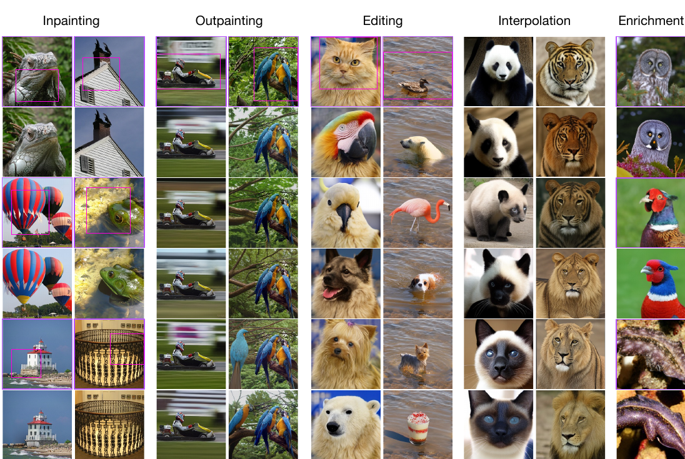
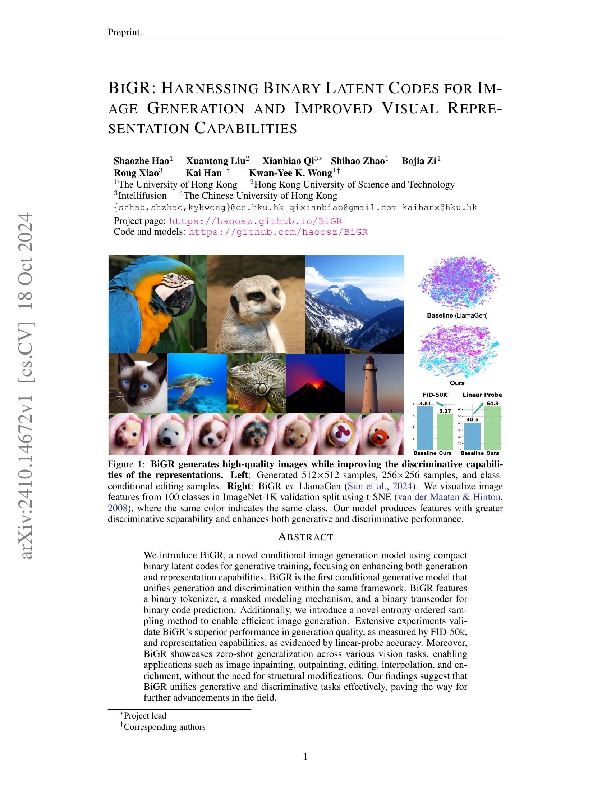
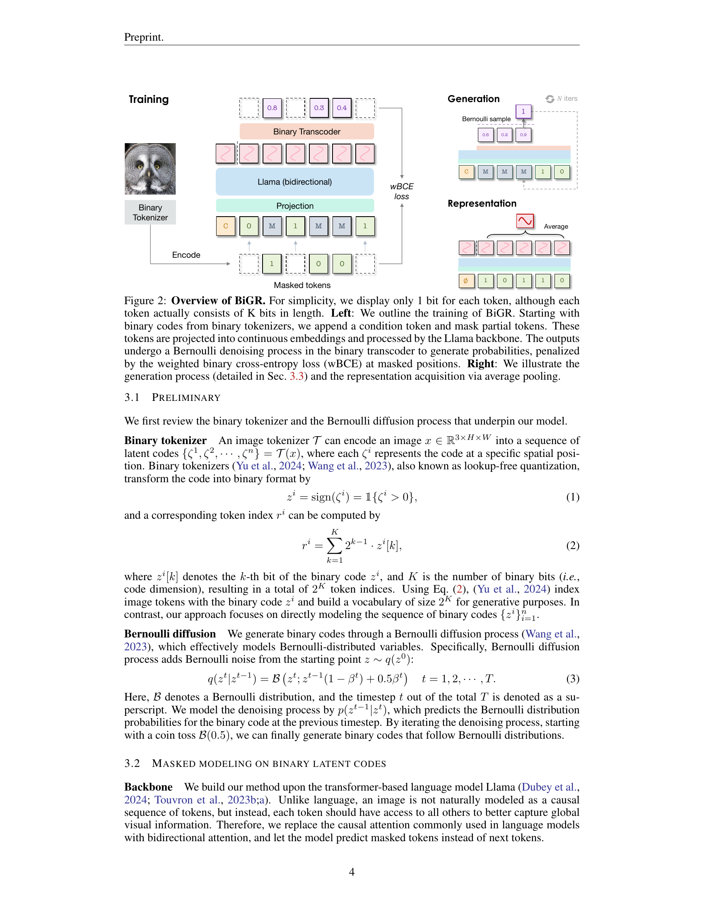
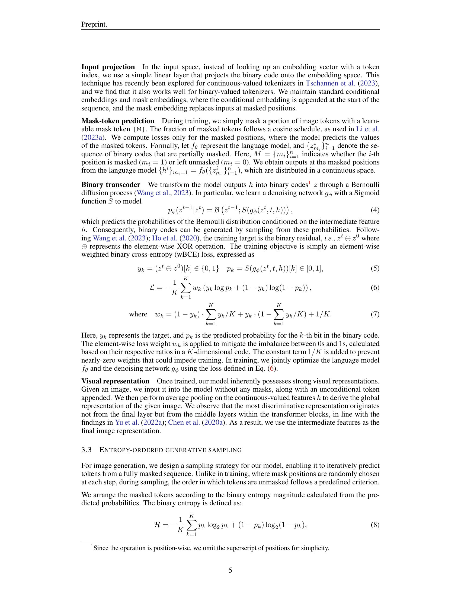
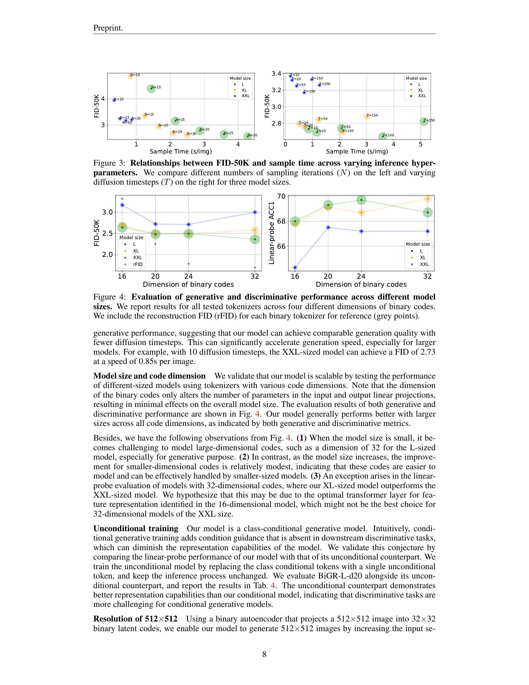
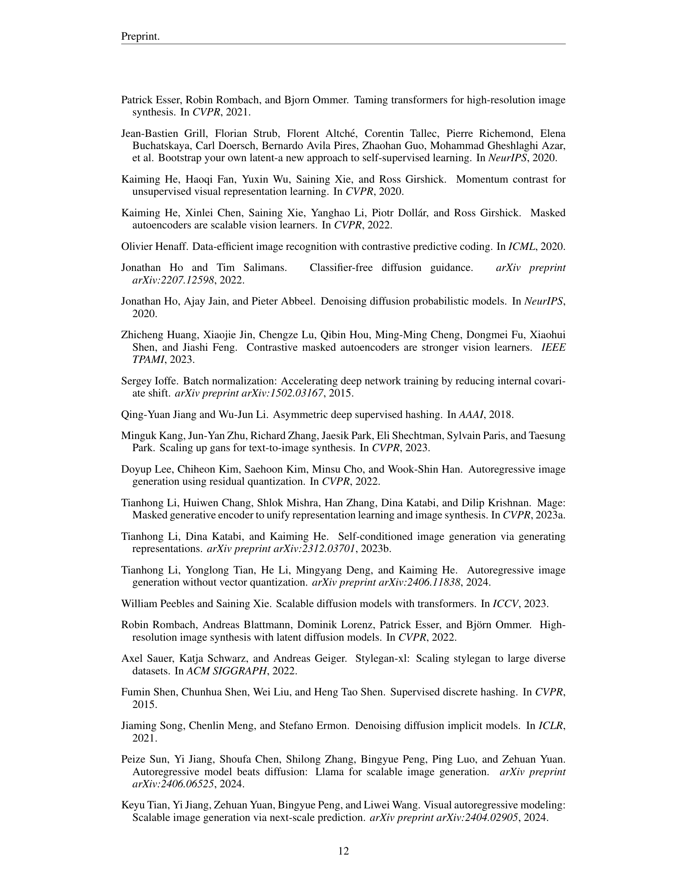
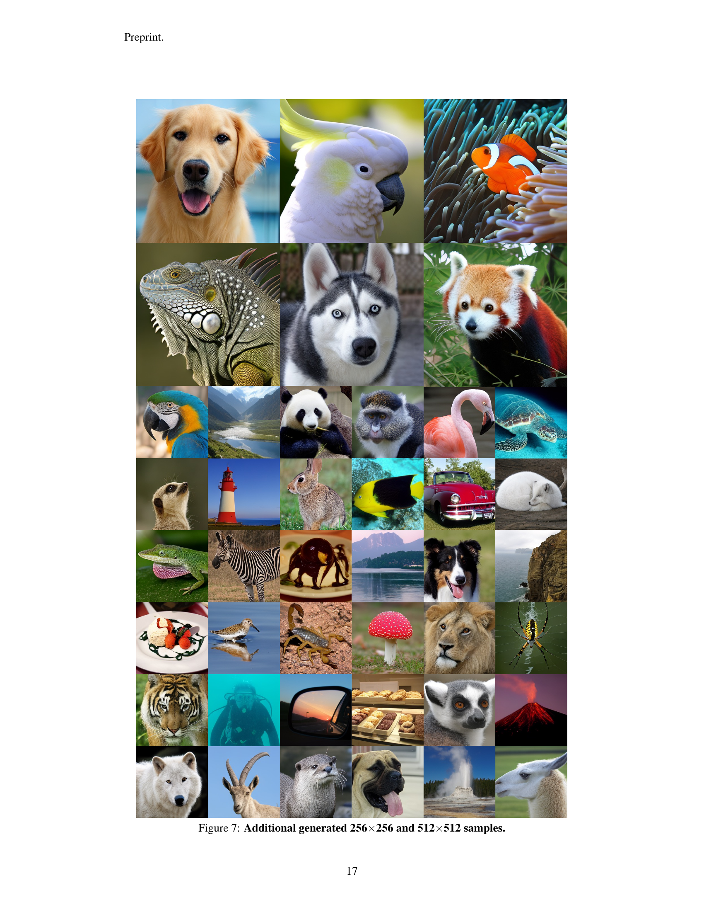
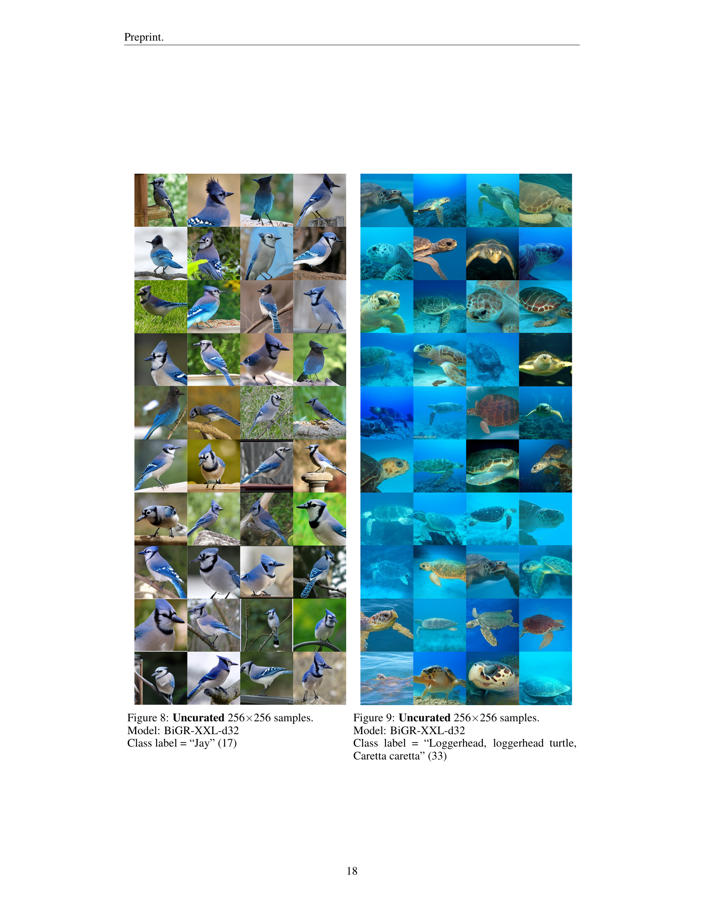
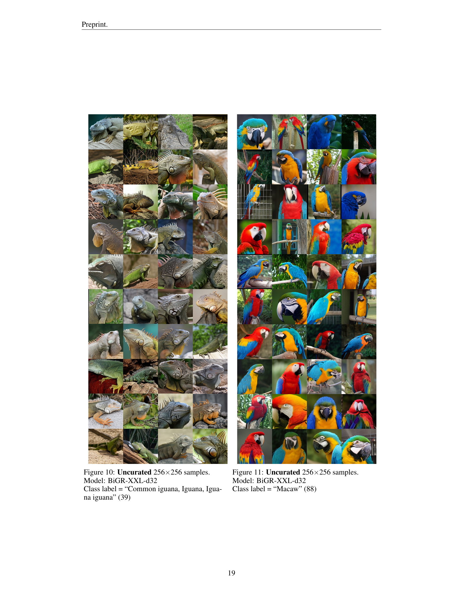
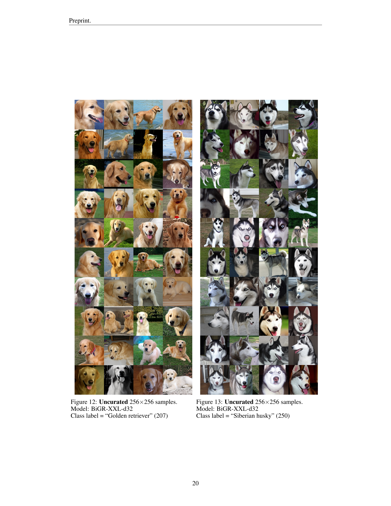

### TL;DR



BiGR is a new model that generates high-quality images while significantly improving the quality of image representations.  Unlike other models that focus on either generation or representation, BiGR does both simultaneously. It uses compact binary codes to represent images, making it efficient and versatile.  The model is trained using a masked modeling approach, where parts of the image's code are hidden and the model must predict them. This approach helps improve the image's overall representation.  Experiments showed that BiGR outperformed existing methods in both generating images and creating good representations, measured by FID-50k and linear-probe accuracy. BiGR also excels at zero-shot generalization, meaning it can be used for various tasks (like image inpainting or editing) without any additional training.  The use of binary codes also increases efficiency, generating images much faster than similar models.




 &nbsp; read the paper on arXiv


#### Why does it matter?
Summarizing the provided research paper on BiGR, a novel conditional image generation model using compact binary latent codes, for researchers.
#### Key Takeaways


 BiGR is the first conditional generative model that unifies generation and discrimination within the same framework. 



 BiGR achieves improved performance in image generation and representation capabilities compared to existing models. 



 BiGR showcases zero-shot generalization across various vision tasks, including image inpainting, outpainting, editing, interpolation, and enrichment. 


------
#### Visual Insights

. We visualize image features from 100 classes in ImageNet-1K validation split using t-SNE (van der Maaten & Hinton, 2008), where the same color indicates the same class. Our model produces features with greater discriminative separability and enhances both generative and discriminative performance.")

> Figure 1 shows BiGR generating high-quality images while simultaneously enhancing the discriminative capabilities of its visual representations, as demonstrated through image samples and t-SNE visualizations of image features.

 on the left and varying diffusion timesteps (T) on the right for three model sizes.")

> The chart shows the relationship between FID-50k score and sample time for different numbers of sampling iterations and diffusion timesteps, across three model sizes.


 <table id='2' style='font-size:16px'><tr><td></td><td></td><td></td><td></td><td></td><td colspan="5">Generative</td><td colspan="2">Discriminative</td></tr><tr><td>Model</td><td>Tokenizer</td><td>Objective</td><td>Type</td><td>Time↓</td><td>FID↓</td><td>IS↑</td><td>sFID↓</td><td>Pre.↑</td><td>Rec.↑</td><td>ACC1</td><td>ACC5</td></tr><tr><td>LlamaGen</td><td>VQGAN</td><td>Cat.</td><td>AR</td><td>1.10</td><td>3.81</td><td>248.28</td><td>8.49</td><td>0.83</td><td>0.52</td><td>40.5</td><td>64.4</td></tr><tr><td>SO</td><td>B-AE</td><td>Cat.</td><td>AR</td><td>1.09</td><td>3.21</td><td>239.17</td><td>5.38</td><td>0.83</td><td>0.54</td><td>23.8</td><td>44.2</td></tr><tr><td>S1</td><td>B-AE</td><td>Cat.</td><td>Mask</td><td>0.10</td><td>3.85</td><td>261.81</td><td>6.10</td><td>0.85</td><td>0.47</td><td>61.1</td><td>83.2</td></tr><tr><td>S2</td><td>B-AE</td><td>Bin.</td><td>AR</td><td>1.04</td><td>7.50</td><td>164.31</td><td>6.56</td><td>0.85</td><td>0.41</td><td>45.2</td><td>69.3</td></tr><tr><td>S3 (Ours)</td><td>B-AE</td><td>Bin.</td><td>Mask</td><td>0.69</td><td>3.17</td><td>262.14</td><td>5.59</td><td>0.86</td><td>0.50</td><td>64.3</td><td>85.4</td></tr></table>

> Table 1 compares the generative and discriminative performance of BiGR against LlamaGen and three other models, varying tokenizers, training objectives, and modeling types.

### More visual insights

More on figures

 at masked positions. Right: We illustrate the generation process (detailed in Sec. 3.3) and the representation acquisition via average pooling.")

> Figure 2 illustrates the training and generation processes of the BiGR model, highlighting the use of binary latent codes, masked modeling, and a Bernoulli diffusion process for both tasks.

. We visualize image features from 100 classes in ImageNet-1K validation split using t-SNE (van der Maaten & Hinton, 2008), where the same color indicates the same class. Our model produces features with greater discriminative separability and enhances both generative and discriminative performance.")

> The figure visualizes BiGR's high-quality image generation and improved discriminative capabilities compared to LlamaGen, showcasing both generated images and t-SNE visualizations of ImageNet-1K features.

> Figure 6 showcases BiGR's zero-shot generalization capabilities across various image manipulation tasks, including inpainting, outpainting, editing, interpolation, and enrichment.

. We visualize image features from 100 classes in ImageNet-1K validation split using t-SNE (van der Maaten & Hinton, 2008), where the same color indicates the same class. Our model produces features with greater discriminative separability and enhances both generative and discriminative performance.")

> The figure shows BiGR generating high-quality images while simultaneously improving the discriminative capabilities of its image representations compared to the baseline LlamaGen model.

. We visualize image features from 100 classes in ImageNet-1K validation split using t-SNE (van der Maaten & Hinton, 2008), where the same color indicates the same class. Our model produces features with greater discriminative separability and enhances both generative and discriminative performance.")

> The figure shows BiGR's high-quality image generation and improved discriminative representation capabilities compared to LlamaGen, visualized using t-SNE.

. We visualize image features from 100 classes in ImageNet-1K validation split using t-SNE (van der Maaten & Hinton, 2008), where the same color indicates the same class. Our model produces features with greater discriminative separability and enhances both generative and discriminative performance.")

> The figure shows BiGR's high-quality image generation and improved discriminative capabilities compared to LlamaGen, visualized using t-SNE.

. We visualize image features from 100 classes in ImageNet-1K validation split using t-SNE (van der Maaten & Hinton, 2008), where the same color indicates the same class. Our model produces features with greater discriminative separability and enhances both generative and discriminative performance.")

> The figure shows BiGR's ability to generate high-quality images while simultaneously improving the discriminative capabilities of its image representations.

. We visualize image features from 100 classes in ImageNet-1K validation split using t-SNE (van der Maaten & Hinton, 2008), where the same color indicates the same class. Our model produces features with greater discriminative separability and enhances both generative and discriminative performance.")

> The figure showcases BiGR's ability to generate high-quality images and improve the discriminative capabilities of visual representations compared to a baseline model.

. We visualize image features from 100 classes in ImageNet-1K validation split using t-SNE (van der Maaten & Hinton, 2008), where the same color indicates the same class. Our model produces features with greater discriminative separability and enhances both generative and discriminative performance.")

> The figure displays BiGR's image generation capabilities (left) and its improved discriminative representation capabilities compared to LlamaGen (right), visualized using t-SNE.

. We visualize image features from 100 classes in ImageNet-1K validation split using t-SNE (van der Maaten & Hinton, 2008), where the same color indicates the same class. Our model produces features with greater discriminative separability and enhances both generative and discriminative performance.")

> The figure visualizes BiGR's ability to generate high-quality images and improve the discriminative capabilities of image representations, showcasing both its generative and discriminative performance.

. We visualize image features from 100 classes in ImageNet-1K validation split using t-SNE (van der Maaten & Hinton, 2008), where the same color indicates the same class. Our model produces features with greater discriminative separability and enhances both generative and discriminative performance.")

> The figure shows BiGR generating high-quality images and improving discriminative capabilities of its representations by visualizing features from 100 classes in ImageNet-1K.

. We visualize image features from 100 classes in ImageNet-1K validation split using t-SNE (van der Maaten & Hinton, 2008), where the same color indicates the same class. Our model produces features with greater discriminative separability and enhances both generative and discriminative performance.")

> Figure 1 shows BiGR's high-quality image generation and improved discriminative capabilities compared to LlamaGen, visualized using t-SNE on ImageNet-1K features.

More on tables


 <table id='5' style='font-size:14px'><tr><td></td><td colspan="5">Generative</td><td colspan="2">Discriminative</td></tr><tr><td>Binary objective</td><td>FID↓</td><td>IS↑</td><td>sFID↓</td><td>Pre.↑</td><td>Rec.↑</td><td>ACC1</td><td>ACC5</td></tr><tr><td colspan="8">w/o Bernoulli denoising</td></tr><tr><td>Direct BCE</td><td>5.84</td><td>212.34</td><td>9.89</td><td>0.78</td><td>0.52</td><td>63.3</td><td>84.8</td></tr><tr><td colspan="8">w/ Bernoulli denoising</td></tr><tr><td>Predict zo</td><td>4.39</td><td>274.26</td><td>9.07</td><td>0.87</td><td>0.44</td><td>62.0</td><td>83.9</td></tr><tr><td>Predict zi � z⌀ (Ours)</td><td>3.17</td><td>262.14</td><td>5.59</td><td>0.86</td><td>0.50</td><td>64.3</td><td>85.4</td></tr></table>

> The table compares the performance of BiGR's binary transcoder using different training objectives and whether or not Bernoulli denoising is used, evaluating both generative and discriminative metrics.


 <table id='6' style='font-size:14px'><tr><td>Type</td><td>Order</td><td>Time↓</td><td>FID↓</td><td>IS↑</td><td>sFID↓</td><td>Pre.↑</td><td>Rec.↑</td></tr><tr><td>AR</td><td>Raster</td><td>1.04</td><td>7.50</td><td>164.31</td><td>6.56</td><td>0.85</td><td>0.41</td></tr><tr><td>Mask</td><td>Raster</td><td>8.81</td><td>4.51</td><td>191.10</td><td>6.49</td><td>0.80</td><td>0.54</td></tr><tr><td>Mask</td><td>Rand.</td><td>0.69</td><td>7.12</td><td>174.11</td><td>11.85</td><td>0.76</td><td>0.55</td></tr><tr><td>Mask</td><td>Ours</td><td>0.69</td><td>3.17</td><td>262.14</td><td>5.59</td><td>0.86</td><td>0.50</td></tr></table>

> This table compares the generative and discriminative performance of different sampling methods used in the BiGR model.


 <table id='5' style='font-size:14px'><tr><td>Training</td><td>ACC1</td><td>ACC5</td></tr><tr><td>Cond.</td><td>67.5</td><td>87.5</td></tr><tr><td>Uncond.</td><td>68.3</td><td>88.4</td></tr></table>

> Table 4 presents the linear-probe top-1 accuracy results on ImageNet-1K for both conditional and unconditional versions of the BiGR model.


 <table id='7' style='font-size:14px'><tr><td>Type</td><td>Model</td><td>#Params.</td><td>FID↓</td><td>IS↑</td><td>Type</td><td>Method</td><td>#Tokens</td><td>Params</td><td>ACC1↑</td></tr><tr><td rowspan="2">Diff.</td><td>DiT-L/2 (Peebles & Xie, 2023)</td><td>458M</td><td>5.02</td><td>167.2</td><td rowspan="7">Con.</td><td rowspan="7">MoCo (He et al., 2020) SimCLR (Chen et al., 2020b) SwAV (Caron et al., 2020) DINO (Caron et al., 2021) BYOL (Grill et al., 2020) CAE (Chen et al., 2024b) CMAE (Huang et al., 2023)</td><td>-</td><td>375M</td><td>68.6</td></tr><tr><td>DiT-XL/2</td><td>675M</td><td>2.27</td><td>278.2</td><td>-</td><td>375M</td><td>76.5</td></tr><tr><td>Mask</td><td>MaskGIT (Chang et al., 2022)</td><td>227M</td><td>6.18</td><td>182.1</td><td>-</td><td>93M</td><td>75.3 75.3</td></tr><tr><td rowspan="4">AR</td><td>VQGAN (Esser et al., 2021)</td><td>227M</td><td>18.65</td><td>80.4</td><td>-</td><td>85M</td><td></td></tr><tr><td>VQGAN</td><td>1.4B</td><td>15.78</td><td>74.3</td><td>-</td><td>375M</td><td>78.6 78.1</td></tr><tr><td>ViT-VQGAN (Yu et al., 2022a)</td><td>1.7B</td><td>4.17</td><td></td><td>-</td><td>304M</td><td></td></tr><tr><td></td><td></td><td></td><td>175.1</td><td>-</td><td>86M</td><td>73.9</td></tr><tr><td rowspan="5">VAR</td><td>RQTran. (Lee et al., 2022)</td><td>3.8B</td><td>7.55</td><td>134.0</td><td rowspan="4">MIM</td><td rowspan="4">iBOT (Zhou et al., 2022) BEiT (Bao et al., 2022) MAE (He et al., 2022) MAGE (Li et al., 2023a)</td><td>-</td><td>304M</td><td>81.0</td></tr><tr><td>VAR-d16 (Tian et al., 2024)</td><td>310M</td><td>3.30</td><td>274.4</td><td>16x16</td><td>307M</td><td>73.5</td></tr><tr><td>VAR-d20</td><td>600M</td><td>2.57</td><td>302.6</td><td>14x14</td><td>304M</td><td>75.8</td></tr><tr><td>VAR-d24</td><td>1.0B</td><td>2.09</td><td>312.9</td><td>16x16</td><td>328M</td><td>78.9</td></tr><tr><td>VAR-d30</td><td>2.0B</td><td>1.92</td><td>323.1</td><td rowspan="7">Gen.</td><td rowspan="4">BigBiGAN (Brock, 2018) iGPT-L (Chen et al., 2020a) iGPT-L ViT-VQGAN-B (Yu et al., 2022a) ViT-VQGAN-L</td><td>-</td><td>344M</td><td>61.3</td></tr><tr><td rowspan="3">MAR</td><td>MAR-B (Li et al., 2024)</td><td>208M</td><td>2.31</td><td>281.7</td><td>32x32</td><td>1.4B</td><td>60.3</td></tr><tr><td>MAR-L</td><td>479M</td><td>1.78</td><td>296.0</td><td>48x48</td><td>1.4B</td><td>65.2</td></tr><tr><td>MAR-H</td><td>943M</td><td>1.55</td><td>303.7</td><td>32x32 32x32</td><td>650M 1.7B</td><td>65.1 73.2</td></tr><tr><td rowspan="6">AR</td><td>LlamaGen-B (Sun et al., 2024)</td><td>111M</td><td>5.46</td><td>193.6</td><td>RCG (Li et al., 2023b)</td><td>16x16</td><td>304M</td><td>77.6</td></tr><tr><td>LlamaGen-L</td><td>343M</td><td>3.81</td><td>248.3</td><td>I-DAE (Chen et al., 2024c)</td><td></td><td></td><td></td></tr><tr><td>LlamaGen-XL</td><td>775M</td><td>3.39</td><td>227.1</td><td></td><td>-</td><td>304M</td><td>75.0</td></tr><tr><td>LlamaGen-XXL</td><td>1.4B</td><td>3.09</td><td>253.6</td><td rowspan="6">Cond. gen.</td><td rowspan="3">LlamaGen-L† (Sun et al., 2024) MAR-B† (Li et al., 2024) MAR-L†</td><td>16x16</td><td>343M</td><td>40.5</td></tr><tr><td></td><td></td><td></td><td></td><td>16x16</td><td>208M</td><td>57.9</td></tr><tr><td>LlamaGen-3B</td><td>3.1B</td><td>3.05</td><td>222.3</td><td>16x16</td><td>479M</td><td>59.1</td></tr><tr><td rowspan="3">Ours</td><td>BiGR-L-d24</td><td>336M</td><td>2.71</td><td>275.7</td><td>MAR-H†</td><td>16x16</td><td>943M</td><td>60.0</td></tr><tr><td>BiGR-XL-d24</td><td>799M</td><td>2.49</td><td>278.8</td><td>BiGR-L-d20 (Ours)</td><td>16x 16</td><td>336M</td><td>67.5</td></tr><tr><td>BiGR-XXL-d32</td><td>1.5B</td><td>2.36</td><td>277.2</td><td>BiGR-XL-d32 (Ours)</td><td>16x16</td><td>799M</td><td>69.8</td></tr></table>

> Table 1 compares the generative and discriminative performance of BiGR against LlamaGen and other models with varying tokenizers, training objectives, and modeling types.


 <table id='4' style='font-size:14px'><tr><td colspan="2">BiGR-L</td><td colspan="2">BiGR-XL</td><td colspan="2">BiGR-XXL</td></tr><tr><td>Config</td><td>Value</td><td>Config</td><td>Value</td><td>Config</td><td>Value</td></tr><tr><td colspan="2">Architecture</td><td colspan="2">Architecture</td><td colspan="2">Architecture</td></tr><tr><td>Transformer layers</td><td>24</td><td>Transformer layers</td><td>36</td><td>Transformer layers</td><td>48</td></tr><tr><td>Transformer heads</td><td>16</td><td>Transformer heads</td><td>20</td><td>Transformer heads</td><td>24</td></tr><tr><td>Transformer dimensions</td><td>1024</td><td>Transformer dimensions</td><td>1280</td><td>Transformer dimensions</td><td>1536</td></tr><tr><td>MLP layers</td><td>3</td><td>MLP layers</td><td>6</td><td>MLP layers</td><td>8</td></tr><tr><td>MLP dimensions</td><td>1024</td><td>MLP dimensions</td><td>1280</td><td>MLP dimensions</td><td>1536</td></tr><tr><td colspan="2">Training</td><td colspan="2">Training</td><td colspan="2">Training</td></tr><tr><td>Batch size</td><td>1024</td><td>Batch size</td><td>512</td><td>Batch size</td><td>512</td></tr><tr><td>Epochs</td><td>400</td><td>Epochs</td><td>400</td><td>Epochs</td><td>400</td></tr><tr><td>Weight decay</td><td>2e-2</td><td>Weight decay</td><td>2e-2</td><td>Weight decay</td><td>2e-2</td></tr><tr><td>Learning rate</td><td>1e-4</td><td>Learning rate</td><td>1e-4</td><td>Learning rate</td><td>1e-4</td></tr><tr><td>Total diffusion timesteps</td><td>256</td><td>Total diffusion timesteps</td><td>256</td><td>Total diffusion timesteps</td><td>256</td></tr><tr><td colspan="2">Inference</td><td colspan="2">Inference</td><td colspan="2">Inference</td></tr><tr><td>CFG scale</td><td>2.5</td><td>CFG scale</td><td>2.5</td><td>CFG scale</td><td>2.5</td></tr><tr><td>Sampling iterations</td><td>20</td><td>Sampling iterations</td><td>25</td><td>Sampling iterations</td><td>25</td></tr><tr><td>Gumbel temperature</td><td>0.17</td><td>Gumbel temperature</td><td>0.25</td><td>Gumbel temperature</td><td>0.30</td></tr><tr><td>Diffusion timesteps</td><td>100</td><td>Diffusion timesteps</td><td>100</td><td>Diffusion timesteps</td><td>100</td></tr></table>

> Table 7 details the default architectural, training, and inference configurations used for three different sizes of the BiGR model: BiGR-L, BiGR-XL, and BiGR-XXL.


 <table id='7' style='font-size:18px'><tr><td>Determ.</td><td>FID↓</td><td>IS↑</td><td>sFID↓</td><td>Pre.↑</td><td>Rec.↑</td></tr><tr><td>V</td><td>3.19</td><td>239.79</td><td>6.25</td><td>0.84</td><td>0.52</td></tr><tr><td>X (Ours)</td><td>3.17</td><td>262.14</td><td>5.59</td><td>0.86</td><td>0.50</td></tr></table>

> Table 8 compares the generative and discriminative performance of deterministic and non-deterministic sampling methods in BiGR, showing that non-deterministic sampling performs slightly better.


<table id='2' style='font-size:14px'><tr><td>Type</td><td>Model</td><td>#Params.</td><td>FID↓</td><td>IS↑</td><td>Pre.↑</td><td>Rec.↑</td></tr><tr><td rowspan="3">GAN</td><td>BigGAN (Brock, 2018)</td><td>112M</td><td>6.95</td><td>224.5</td><td>0.89</td><td>0.38</td></tr><tr><td>GigaGAN (Kang et al., 2023)</td><td>569M</td><td>3.45</td><td>225.5</td><td>0.84</td><td>0.61</td></tr><tr><td>StyleGanXL (Sauer et al., 2022)</td><td>166M</td><td>2.30</td><td>265.1</td><td>0.78</td><td>0.53</td></tr><tr><td rowspan="3">Diffusion</td><td>LDM-4 (Rombach et al., 2022)</td><td>400M</td><td>3.60</td><td>247.7</td><td>-</td><td>-</td></tr><tr><td>DiT-L/2 (Peebles & Xie, 2023)</td><td>458M</td><td>5.02</td><td>167.2</td><td>0.75</td><td>0.57</td></tr><tr><td>DiT-XL/2</td><td>675M</td><td>2.27</td><td>278.2</td><td>0.83</td><td>0.57</td></tr><tr><td rowspan="2">Mask.</td><td>MaskGIT (Chang et al., 2022)</td><td>227M</td><td>6.18</td><td>182.1</td><td>0.8</td><td>0.51</td></tr><tr><td>MaskGIT-re</td><td>227M</td><td>4.02</td><td>355.6</td><td>-</td><td>-</td></tr><tr><td rowspan="7">AR</td><td>VQGAN (Esser et al., 2021)</td><td>227M</td><td>18.65</td><td>80.4</td><td>0.78</td><td>0.26</td></tr><tr><td>VQGAN</td><td>1.4B</td><td>15.78</td><td>74.3</td><td>-</td><td>-</td></tr><tr><td>VQGAN-re</td><td>1.4B</td><td>5.20</td><td>280.3</td><td>-</td><td>-</td></tr><tr><td>ViT-VQGAN (Yu et al., 2022a)</td><td>1.7B</td><td>4.17</td><td>175.1</td><td>-</td><td>-</td></tr><tr><td>ViT-VQGAN-re</td><td>1.7B</td><td>3.04</td><td>227.4</td><td>-</td><td>-</td></tr><tr><td>RQTran. (Lee et al., 2022)</td><td>3.8B</td><td>7.55</td><td>134.0</td><td>-</td><td>-</td></tr><tr><td>RQTran.-re</td><td>3.8B</td><td>3.80</td><td>323.7</td><td>-</td><td>-</td></tr><tr><td rowspan="4">VAR</td><td>VAR-d16 (Tian et al., 2024)</td><td>310M</td><td>3.30</td><td>274.4</td><td>0.84</td><td>0.51</td></tr><tr><td>VAR-d20</td><td>600M</td><td>2.57</td><td>302.6</td><td>0.83</td><td>0.56</td></tr><tr><td>VAR-d24</td><td>1.0B</td><td>2.09</td><td>312.9</td><td>0.82</td><td>0.59</td></tr><tr><td>VAR-d30</td><td>2.0B</td><td>1.92</td><td>323.1</td><td>0.82</td><td>0.59</td></tr><tr><td rowspan="3">MAR</td><td>MAR-B (Li et al., 2024)</td><td>208M</td><td>2.31</td><td>281.7</td><td>0.82</td><td>0.57</td></tr><tr><td>MAR-L</td><td>479M</td><td>1.78</td><td>296.0</td><td>0.81</td><td>0.60</td></tr><tr><td>MAR-H</td><td>943M</td><td>1.55</td><td>303.7</td><td>0.81</td><td>0.62</td></tr><tr><td rowspan="5">AR</td><td>LlamaGen-B (Sun et al., 2024)</td><td>111M</td><td>5.46</td><td>193.6</td><td>0.83</td><td>0.45</td></tr><tr><td>LlamaGen-L</td><td>343M</td><td>3.81</td><td>248.3</td><td>0.83</td><td>0.52</td></tr><tr><td>LlamaGen-XL</td><td>775M</td><td>3.39</td><td>227.1</td><td>0.81</td><td>0.54</td></tr><tr><td>LlamaGen-XXL</td><td>1.4B</td><td>3.09</td><td>253.6</td><td>0.83</td><td>0.53</td></tr><tr><td>LlamaGen-3B</td><td>3.1B</td><td>3.05</td><td>222.3</td><td>0.80</td><td>0.58</td></tr><tr><td rowspan="3">Ours</td><td>BiGR-L-d24</td><td>336M</td><td>2.71</td><td>275.7</td><td>0.84</td><td>0.53</td></tr><tr><td>BiGR-XL-d24</td><td>799M</td><td>2.49</td><td>278.8</td><td>0.84</td><td>0.55</td></tr><tr><td>BiGR-XXL-d24</td><td>1.5B</td><td>2.36</td><td>277.2</td><td>0.83</td><td>0.55</td></tr></table>

> Table 9 compares the generative performance of BiGR with other state-of-the-art models on the ImageNet-1K dataset using various metrics such as FID, IS, precision, and recall.


<table id='2' style='font-size:14px'><tr><td></td><td>Method</td><td>#Tokens</td><td>Params</td><td>ACC1↑</td></tr><tr><td rowspan="8">methods Contrastive</td><td>CPC v2 (Henaff, 2020)</td><td>-</td><td>303M</td><td>71.5</td></tr><tr><td>MoCo (He et al., 2020)</td><td>-</td><td>375M</td><td>68.6</td></tr><tr><td>SimCLR (Chen et al., 2020b)</td><td></td><td>375M</td><td>76.5</td></tr><tr><td>SwAV (Caron et al., 2020)</td><td></td><td>93M</td><td>75.3</td></tr><tr><td>DINO (Caron et al., 2021)</td><td></td><td>85M</td><td>75.3</td></tr><tr><td>BYOL (Grill et al., 2020)</td><td>-</td><td>375M</td><td>78.6</td></tr><tr><td>CAE (Chen et al., 2024b)</td><td>-</td><td>304M</td><td>78.1</td></tr><tr><td>CMAE (Huang et al., 2023)</td><td>-</td><td>86M</td><td>73.9</td></tr><tr><td rowspan="4">MIM</td><td>iBOT (Zhou et al., 2022)</td><td>-</td><td>304M</td><td>81.0</td></tr><tr><td>BEiT (Bao et al., 2022)</td><td>16x16</td><td>307M</td><td>73.5</td></tr><tr><td>MAE (He et al., 2022)</td><td>14x14</td><td>304M</td><td>75.8</td></tr><tr><td>MAGE (Li et al., 2023a)</td><td>16x16</td><td>328M</td><td>78.9</td></tr><tr><td rowspan="9">methods Generative</td><td>BiGAN Donahue et al. (2017)</td><td>-</td><td>138M</td><td>31.0</td></tr><tr><td>BigBiGAN (Donahue & Simonyan, 2019)</td><td>-</td><td>86M</td><td>56.6</td></tr><tr><td>BigBiGAN</td><td>-</td><td>344M</td><td>61.3</td></tr><tr><td>iGPT-L (Chen et al., 2020a)</td><td>32x32</td><td>1.4B</td><td>60.3</td></tr><tr><td>iGPT-L</td><td>48x48</td><td>1.4B</td><td>65.2</td></tr><tr><td>ViT-VQGAN-B (Yu et al., 2022a)</td><td>32x32</td><td>650M</td><td>65.1</td></tr><tr><td>ViT-VQGAN-L</td><td>32x32</td><td>1.7B</td><td>73.2</td></tr><tr><td>RCG (Li et al., 2023b)</td><td>16x16</td><td>304M</td><td>77.6</td></tr><tr><td>I-DAE (Chen et al., 2024c)</td><td>-</td><td>304M</td><td>75.0</td></tr><tr><td rowspan="6">gen. Cond.</td><td>LlamaGen-L† (Sun et al., 2024)</td><td>16x16</td><td>343M</td><td>40.5</td></tr><tr><td>MAR-B† (Li et al., 2024)</td><td>16x16</td><td>208M</td><td>57.9</td></tr><tr><td>MAR-L+</td><td>16x16</td><td>479M</td><td>59.1</td></tr><tr><td>MAR-H†</td><td>16x16</td><td>943M</td><td>60.0</td></tr><tr><td>BiGR-L-d20 (Ours)</td><td>16x16</td><td>336M</td><td>67.5</td></tr><tr><td>BiGR-XL-d32 (Ours)</td><td>16x16</td><td>799M</td><td>69.8</td></tr></table>

> Table 10 compares the linear-probe top-1 accuracy on ImageNet-1K for various models, categorized by their types (Contrastive methods, MIM, Conditional generative methods, and Generative methods), showcasing BiGR's superior performance.

### Full paper



