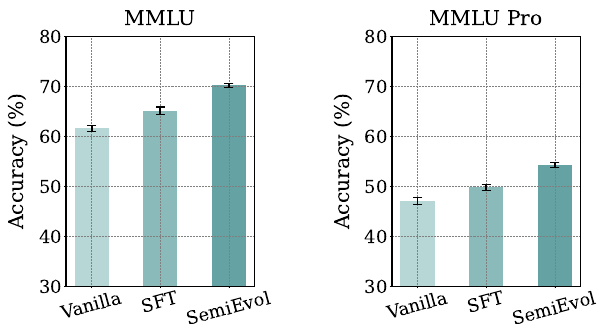
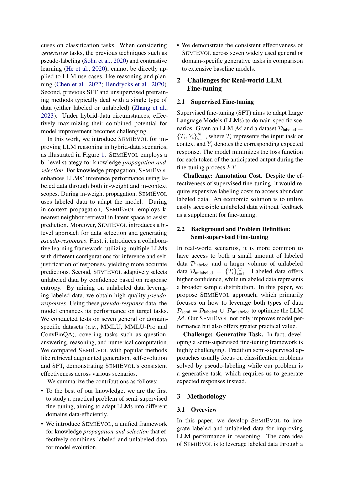
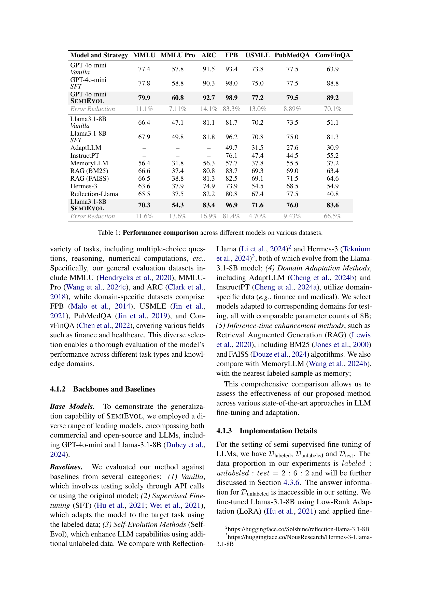
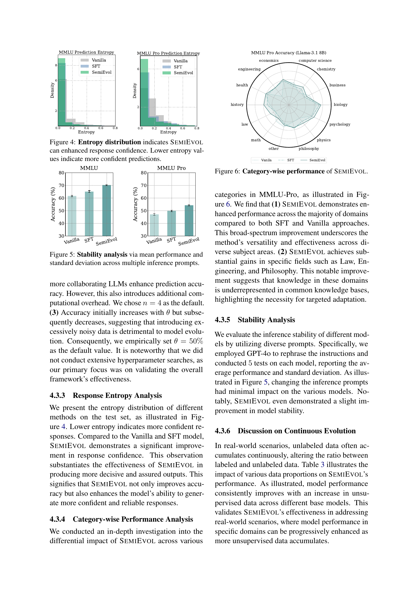
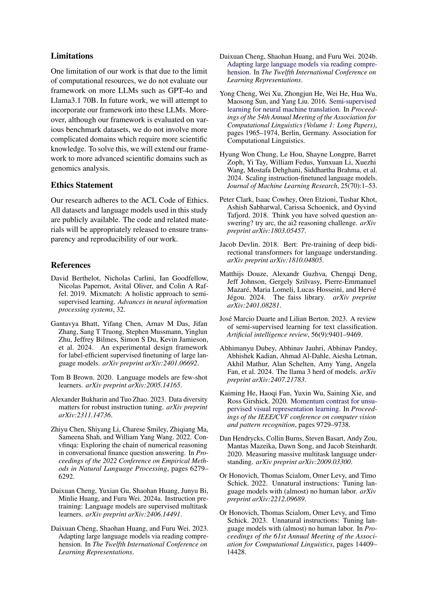
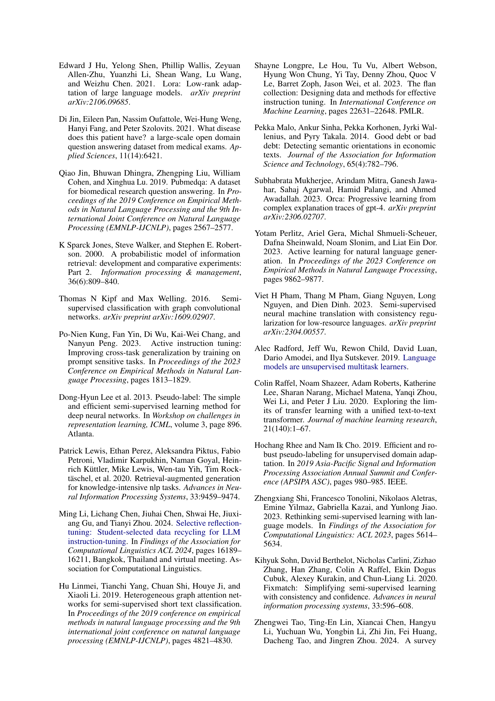
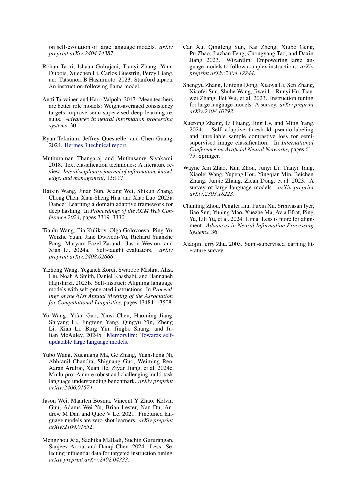

### TL;DR



The research paper introduces SEMIEVOL, a novel semi-supervised fine-tuning method for Large Language Models (LLMs).  Traditional supervised fine-tuning (SFT) relies heavily on labeled data, which can be expensive and limited. SEMIEVOL tackles this by effectively utilizing both limited labeled and abundant unlabeled data.  It does this through a two-stage process: knowledge propagation and selection.  Knowledge propagation uses a bi-level approach: in-weight propagation (adapting the model using labeled data) and in-context propagation (using k-nearest neighbor retrieval in a latent space to aid predictions).  Knowledge selection uses a collaborative learning framework where multiple LLMs self-justify their responses, improving accuracy. It also incorporates an adaptive selection process that filters out low-confidence pseudo-responses, further enhancing the quality of the training data.  Experiments on several datasets demonstrate that SEMIEVOL significantly improves LLM performance compared to supervised fine-tuning and other semi-supervised methods, highlighting its efficiency and effectiveness in real-world scenarios with limited labeled data. The method exhibits consistent improvements across general and domain-specific tasks.  The iterative application of SEMIEVOL demonstrates continuous evolution capabilities, further improving performance as more unlabeled data becomes available.




 &nbsp; read the paper on arXiv


#### Why does it matter?
The paper introduces SEMIEVOL, a novel semi-supervised fine-tuning framework that efficiently adapts LLMs using limited labeled and abundant unlabeled data, significantly improving model performance across various tasks.
#### Key Takeaways


 SEMIEVOL uses a bi-level approach for knowledge propagation (in-weight and in-context) and selection, effectively leveraging both labeled and unlabeled data. 



 Collaborative learning among multiple LLMs improves the accuracy of pseudo-responses from unlabeled data. 



 Adaptive data selection based on response entropy ensures that high-quality pseudo-responses are used for fine-tuning, further enhancing model performance. 


------
#### Visual Insights

> Figure 1 compares SEMIEVOL with previous supervised fine-tuning (SFT) methods, highlighting SEMIEVOL's ability to interact with diverse data types (labeled and unlabeled) for improved performance.

> The chart displays SEMIEVOL's performance sensitivity to the number of collaborating LLMs (n) and the data selection ratio (θ).


<table id='0' style='font-size:14px'><tr><td>Model and Strategy</td><td>MMLU</td><td>MMLU Pro</td><td>ARC</td><td>FPB</td><td>USMLE</td><td>PubMedQA</td><td>ConvFinQA</td></tr><tr><td>GPT-4o-mini Vanilla</td><td>77.4</td><td>57.8</td><td>91.5</td><td>93.4</td><td>73.8</td><td>77.5</td><td>63.9</td></tr><tr><td>GPT-4o-mini SFT</td><td>77.8</td><td>58.8</td><td>90.3</td><td>98.0</td><td>75.0</td><td>77.5</td><td>88.8</td></tr><tr><td>GPT-4o-mini SEMIEVOL</td><td>79.9</td><td>60.8</td><td>92.7</td><td>98.9</td><td>77.2</td><td>79.5</td><td>89.2</td></tr><tr><td>Error Reduction</td><td>11.1%</td><td>7.11%</td><td>14.1%</td><td>83.3%</td><td>13.0%</td><td>8.89%</td><td>70.1%</td></tr><tr><td>Llama3.1-8B Vanilla</td><td>66.4</td><td>47.1</td><td>81.1</td><td>81.7</td><td>70.2</td><td>73.5</td><td>51.1</td></tr><tr><td>Llama3.1-8B SFT</td><td>67.9</td><td>49.8</td><td>81.8</td><td>96.2</td><td>70.8</td><td>75.0</td><td>81.3</td></tr><tr><td>AdaptLLM</td><td>-</td><td>-</td><td>一</td><td>49.7</td><td>31.5</td><td>27.6</td><td>30.9</td></tr><tr><td>InstructPT</td><td>-</td><td>-</td><td>-</td><td>76.1</td><td>47.4</td><td>44.5</td><td>55.2</td></tr><tr><td>MemoryLLM</td><td>56.4</td><td>31.8</td><td>56.3</td><td>57.7</td><td>37.8</td><td>55.5</td><td>37.2</td></tr><tr><td>RAG (BM25)</td><td>66.6</td><td>37.4</td><td>80.8</td><td>83.7</td><td>69.3</td><td>69.0</td><td>63.4</td></tr><tr><td>RAG (FAISS)</td><td>66.5</td><td>38.8</td><td>81.3</td><td>82.5</td><td>69.1</td><td>71.5</td><td>64.6</td></tr><tr><td>Hermes-3</td><td>63.6</td><td>37.9</td><td>74.9</td><td>73.9</td><td>54.5</td><td>68.5</td><td>54.9</td></tr><tr><td>Reflection-Llama</td><td>65.5</td><td>37.5</td><td>82.2</td><td>80.8</td><td>67.4</td><td>77.5</td><td>40.8</td></tr><tr><td>Llama3.1-8B SEMIEVOL</td><td>70.3</td><td>54.3</td><td>83.4</td><td>96.9</td><td>71.6</td><td>76.0</td><td>83.6</td></tr><tr><td>Error Reduction</td><td>11.6%</td><td>13.6%</td><td>16.9%</td><td>81.4%</td><td>4.70%</td><td>9.43%</td><td>66.5%</td></tr></table>

> Table 1 presents a comparison of the performance of various models, including SEMIEVOL, on seven different datasets, showcasing the effectiveness of SEMIEVOL across various tasks and models.

### More visual insights

More on charts

> The chart displays the entropy distribution of Vanilla, SFT, and SEMIEVOL models' predictions on MMLU and MMLU-Pro datasets, illustrating SEMIEVOL's enhanced response confidence.

> The radar chart displays a category-wise comparison of the performance of Vanilla, SFT, and SEMIEVOL models on the MMLU-Pro dataset using Llama-3.1 8B.

> The chart displays the sensitivity analysis of SEMIEVOL's performance across different values of n (number of collaborating models) and θ (data selection ratio) on MMLU and MMLU-Pro datasets.

> The chart displays the iterative evolution performance of the SEMIEVOL model on MMLU and MMLU-Pro datasets across four iterations.

More on tables


 <table id='8' style='font-size:14px'><tr><td>Variant</td><td>MMLU</td><td>MMLU-Pro</td><td>ARC</td></tr><tr><td>Llama3.1-8B SEMIEVOL</td><td>70.3</td><td>54.3</td><td>83.4</td></tr><tr><td>w/o IWP</td><td>68.7</td><td>52.1</td><td>82.4</td></tr><tr><td>w/o ICP</td><td>69.7</td><td>53.2</td><td>83.0</td></tr><tr><td>w/o CL</td><td>69.1</td><td>53.0</td><td>82.4</td></tr><tr><td>w/o AS</td><td>69.9</td><td>53.5</td><td>82.1</td></tr></table>

> Table 1 presents a comparison of various LLMs' performance across seven datasets, using different fine-tuning strategies, including vanilla, SFT, and SEMIEVOL, showing error reduction percentages.


<table id='0' style='font-size:14px'><tr><td>Base Model</td><td colspan="4">MMLU (Dunlabeled / Dlabled)</td><td colspan="4">MMLU-Pro (Dunlabeled / Dlabled)</td></tr><tr><td></td><td>50%</td><td>100%</td><td>200%</td><td>300%</td><td>50%</td><td>100%</td><td>200%</td><td>300%</td></tr><tr><td>GPT-4o mini</td><td>78.2</td><td>78.6</td><td>79.3</td><td>79.9</td><td>58.9</td><td>59.5</td><td>60.1</td><td>60.8</td></tr><tr><td>Llama3.1-8B</td><td>68.3</td><td>69.5</td><td>69.7</td><td>70.3</td><td>50.8</td><td>52.0</td><td>53.5</td><td>54.3</td></tr></table>

> Table 1 presents a performance comparison of various LLMs (GPT-40-mini and Llama-3.1-8B) using different fine-tuning strategies (vanilla, SFT, and SEMIEVOL) across seven diverse datasets.

### Full paper



