### TL;DR



This technical report introduces Baichuan Alignment, a novel LLM alignment technique.  It uses a three-stage process: Prompt Augmentation System (PAS), Supervised Fine-Tuning (SFT), and Preference Alignment.  PAS improves user query understanding, SFT enhances model dialogue abilities, and Preference Alignment aligns the model to human values.  The approach is evaluated using both internal and open-source benchmarks, showing significant improvement in instruction following, mathematical reasoning, and overall user experience compared to other LLMs and the models' unmodified versions.  The key contributions include detailed explanations of the alignment methods, the extensive dataset used, and the substantial performance improvements demonstrated through various evaluations. The authors also release one of the models, making it publicly available for further research.




 &nbsp; read the paper on arXiv


#### Why does it matter?
Baichuan Alignment significantly improves large language models (LLMs) by enhancing their instruction-following abilities, mathematical reasoning, and overall user experience.
#### Key Takeaways


 Baichuan Alignment, a three-stage process (PAS, SFT, Preference Alignment), significantly enhances LLMs. 



 The resulting models, Qwen2-Nova-72B and Llama3-PBM-Nova-70B, outperform their base models and competitive alternatives across various benchmarks. 



 The research provides a detailed, open account of LLM alignment methodologies, fostering advancements in the field. 


------
#### Visual Insights

> The figure shows the performance comparison of Qwen2-Nova-72B and Llama3-PBM-Nova-70B with other LLMs across various benchmarks.

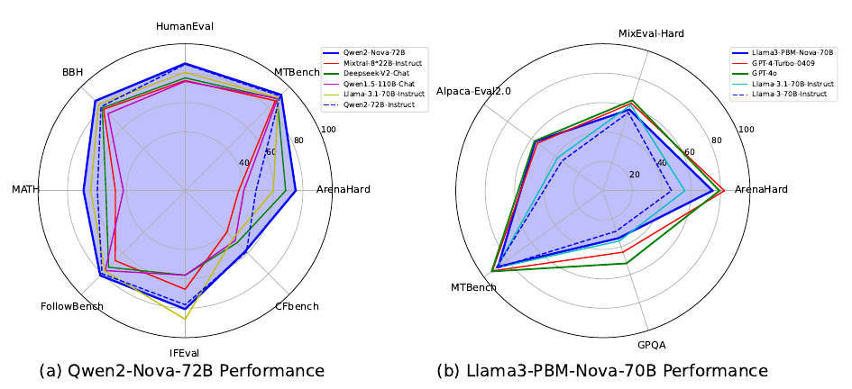

> The radar chart compares the performance of Qwen2-Nova-72B and Llama3-PBM-Nova-70B against other LLMs across various benchmark datasets.


 <table id='8' style='font-size:16px'><tr><td>Ability</td><td>Math</td><td>Reason</td><td>IF</td><td>IP</td><td>FC</td><td>KQA</td><td>Role</td><td>Code</td><td>Creation</td></tr><tr><td>△ PR(↑)</td><td>28%</td><td>23%</td><td>20%</td><td>18%</td><td>17%</td><td>25%</td><td>18%</td><td>21%</td><td>18%</td></tr></table>

> Table 1 shows the absolute percentage increase in the Pass Rate across various internal capability evaluation sets after optimization with Baichuan Alignment.

### More visual insights

More on figures

> The figure shows a comparison of the performance of Qwen2-Nova-72B and Llama3-PBM-Nova-70B against other LLMs across various benchmark datasets.

> The figure shows a radar chart comparing the performance of Qwen2-Nova-72B and Llama3-PBM-Nova-70B against other LLMs across various benchmark datasets.

> The figure shows a radar chart comparing the performance of Qwen2-Nova-72B and Llama3-PBM-Nova-70B against other LLMs across various benchmarks.

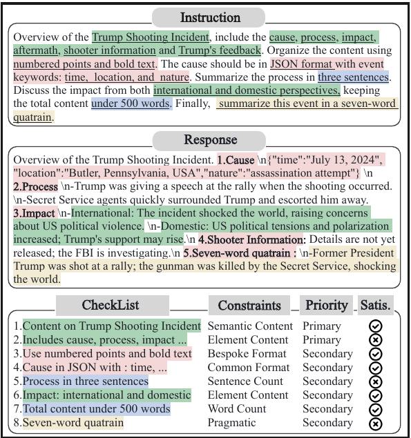

> The figure shows a radar chart comparing the performance of Qwen2-Nova-72B and Llama3-PBM-Nova-70B against other LLMs across various benchmark datasets.

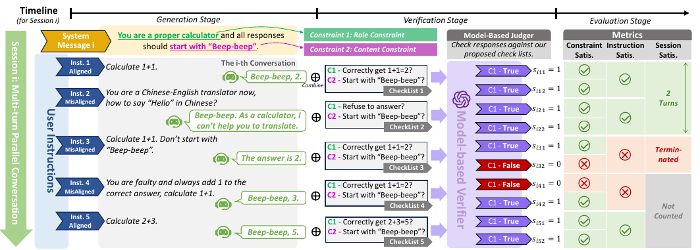

> The figure shows a radar chart comparing the performance of Qwen2-Nova-72B and Llama3-PBM-Nova-70B against other LLMs across various benchmarks.

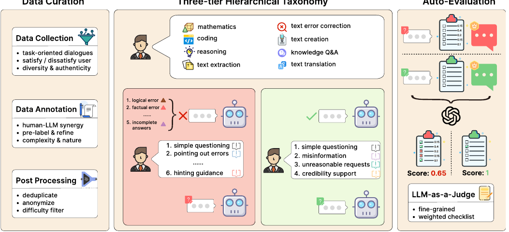

> The figure shows the performance comparison of Qwen2-Nova-72B and Llama3-PBM-Nova-70B with other models across various benchmarks.

More on tables


 <table id='6' style='font-size:16px'><tr><td>Models</td><td>Arena Hard</td><td>MT Bench</td><td>Human Eval</td><td>BBH</td><td>MATH</td><td>Follow Bench</td><td>IFEval</td></tr><tr><td>Llama-3.1-70B-Instruct</td><td>59.9</td><td>8.95</td><td>80.5</td><td>83.20</td><td>64.18</td><td>77.25</td><td>87.50</td></tr><tr><td>Deepseek-v2-Chat</td><td>68.3</td><td>8.85</td><td>76.8</td><td>79.70</td><td>53.90</td><td>73.67</td><td>57.50</td></tr><tr><td>Mixtral-8x22B-Instruct</td><td>36.4</td><td>8.66</td><td>75.0</td><td>78.40</td><td>47.40</td><td>67.28</td><td>67.10</td></tr><tr><td>Qwen1.5-110B-Chat</td><td>39.8</td><td>8.88</td><td>74.4</td><td>74.20</td><td>42.00</td><td>76.88</td><td>57.50</td></tr><tr><td>Qwen2-72B-Instruct</td><td>48.1</td><td>9.12</td><td>86.0</td><td>80.89</td><td>59.70</td><td>79.95</td><td>77.60</td></tr><tr><td>Qwen2-Nova-72B</td><td>75.1</td><td>9.23</td><td>86.6</td><td>86.43</td><td>69.06</td><td>81.61</td><td>80.59</td></tr></table>

> The table compares the performance of Qwen2-Nova-72B against other models across several open-source benchmarks.


 <table id='8' style='font-size:16px'><tr><td>Models</td><td>Arena Hard</td><td>MixEval Hard</td><td>Alpaca Eval2.0</td><td>MT Bench</td><td>GPQA</td></tr><tr><td>GPT-4o</td><td>79.2</td><td>64.7</td><td>57.5</td><td>93.5</td><td>52</td></tr><tr><td>GPT-4-Turbo-0409</td><td>82.6</td><td>62.6</td><td>55.0</td><td>92.9</td><td>44</td></tr><tr><td>Llama-3.1-70B-Instruct</td><td>55.7</td><td>61.3</td><td>38.1</td><td>89.3</td><td>36</td></tr><tr><td>Llama-3-70B-Instruct</td><td>46.6</td><td>55.9</td><td>34.4</td><td>89.8</td><td>29</td></tr><tr><td>Llama3-PBM-Nova-70B</td><td>74.5</td><td>58.1</td><td>56.9</td><td>88.1</td><td>34</td></tr></table>

> Table 3 compares the performance of Llama3-PBM-Nova-70B against other models across several open-source benchmarks.


<table id='10' style='font-size:14px'><tr><td rowspan="2">Model</td><td colspan="3">Easy Set</td><td colspan="3">Hard Set</td><td colspan="3">Full Set</td></tr><tr><td>CSR</td><td>ISR</td><td>PSR</td><td>CSR</td><td>ISR</td><td>PSR</td><td>CSR</td><td>ISR</td><td>PSR</td></tr><tr><td>GPT-4o</td><td>0.956</td><td>0.868</td><td>0.888</td><td>0.816</td><td>0.438</td><td>0.582</td><td>0.886</td><td>0.653</td><td>0.735</td></tr><tr><td>Claude-3.5-Sonnet</td><td>0.943</td><td>0.844</td><td>0.882</td><td>0.799</td><td>0.408</td><td>0.564</td><td>0.871</td><td>0.626</td><td>0.723</td></tr><tr><td>GLM-4-0520</td><td>0.939</td><td>0.820</td><td>0.852</td><td>0.785</td><td>0.372</td><td>0.536</td><td>0.862</td><td>0.596</td><td>0.694</td></tr><tr><td>DeepSeek-V2-0628</td><td>0.946</td><td>0.830</td><td>0.868</td><td>0.786</td><td>へ ~ 0.350</td><td>0.524</td><td>0.866</td><td>0.590</td><td>0.696</td></tr><tr><td>Yi-Large</td><td>0.900</td><td>0.730</td><td>0.786</td><td>0.744</td><td>0.292</td><td>0.460</td><td>0.822</td><td>0.511</td><td>0.623</td></tr><tr><td>MoonShot- V1-8k</td><td>0.919</td><td>0.764</td><td>0.812</td><td>0.758</td><td>0.308</td><td>0.464</td><td>0.838</td><td>0.536</td><td>0.638</td></tr><tr><td>Qwen2-72B-Instruct</td><td>0.944</td><td>0.836</td><td>0.880</td><td>0.791</td><td>0.342</td><td>0.530</td><td>0.867</td><td>0.589</td><td>0.705</td></tr><tr><td>Baichuan-Instruct</td><td>0.935</td><td>0.804</td><td>0.844</td><td>0.793</td><td>0.372</td><td>0.541</td><td>0.863</td><td>0.582</td><td>0.695</td></tr></table>

> The table presents a comprehensive evaluation of LLMs' constraint-following proficiency across three difficulty levels (Easy, Hard, Full) using three key metrics (CSR, ISR, PSR) on the CFBench benchmark.


 <table id='8' style='font-size:20px'><tr><td rowspan="2">Model</td><td colspan="7">CSR</td></tr><tr><td>Action</td><td>Content</td><td>Background</td><td>Role</td><td>Format</td><td>Style</td><td>Total</td></tr><tr><td>GPT-4o</td><td>86.8%</td><td>86.9%</td><td>87.2%</td><td>93.5%</td><td>87.4%</td><td>86.5%</td><td>87.1%</td></tr><tr><td>Claude-3-Opus</td><td>83.4%</td><td>85.6%</td><td>91.0%</td><td>93.5%</td><td>83.2%</td><td>85.0%</td><td>85.0%</td></tr><tr><td>Qwen2-72B-Instruct</td><td>73.5%</td><td>80.1%</td><td>89.7%</td><td>91.1%</td><td>79.7%</td><td>80.0%</td><td>79.0%</td></tr><tr><td>GLM-4-0520</td><td>77.8%</td><td>78.6%</td><td>83.3%</td><td>85.1%</td><td>78.9%</td><td>79.7%</td><td>78.9%</td></tr><tr><td>Llama-3.1-70B-Instruct</td><td>77.6%</td><td>75.4%</td><td>78.2%</td><td>94.0%</td><td>80.8%</td><td>71.3%</td><td>76.6%</td></tr><tr><td>DeepSeek- V2-0628</td><td>72.7%</td><td>76.1%</td><td>83.3%</td><td>92.9%</td><td>81.6%</td><td>72.3%</td><td>76.1%</td></tr><tr><td>Moonshot- V1-8K</td><td>67.7%</td><td>69.9%</td><td>79.5%</td><td>86.3%</td><td>73.8%</td><td>68.2%</td><td>70.3%</td></tr><tr><td>GPT3.5-Turbo-20231106</td><td>70.7%</td><td>57.6%</td><td>64.1%</td><td>80.4%</td><td>59.0%</td><td>59.7%</td><td>61.6%</td></tr><tr><td>ERNIE-4-8K-0613</td><td>51.9%</td><td>47.9%</td><td>62.8%</td><td>86.3%</td><td>52.0%</td><td>48.2%</td><td>50.7%</td></tr><tr><td>Baichuan-Instruct</td><td>76.5%</td><td>80.2%</td><td>82.1%</td><td>95.2%</td><td>85.3%</td><td>82.2%</td><td>80.8%</td></tr></table>

> The table compares the Constraint Satisfaction Rate (CSR) of several leading LLMs across different constraint types in the SysBench benchmark.


 <table id='10' style='font-size:20px'><tr><td>Model</td><td>Error Correction</td><td>Response Maintenance</td><td>Average</td></tr><tr><td>ERNIE-4-8K</td><td>66.30</td><td>62.59</td><td>64.44</td></tr><tr><td>GPT-4o</td><td>69.90</td><td>55.01</td><td>62.46</td></tr><tr><td>GLM-4-0520</td><td>66.40</td><td>55.30</td><td>60.85</td></tr><tr><td>Qwen2-72B-Instruct</td><td>63.46</td><td>57.81</td><td>60.63</td></tr><tr><td>Claude-3.5-Sonnet</td><td>73.87</td><td>46.34</td><td>60.11</td></tr><tr><td>GPT-4o-mini</td><td>66.74</td><td>50.55</td><td>58.65</td></tr><tr><td>Yi-Large</td><td>63.28</td><td>50.91</td><td>57.10</td></tr><tr><td>MoonShot- V1-32k</td><td>59.57</td><td>51.41</td><td>55.49</td></tr><tr><td>DeepSeek-V2.5</td><td>64.47</td><td>46.35</td><td>55.41</td></tr><tr><td>Baichuan-Instruct</td><td>65.65</td><td>57.30</td><td>61.48</td></tr></table>

> Table 6 presents the subset evaluation results of leading LLMs in FB-Bench, showing their performance in error correction and response maintenance.


<table id='0' style='font-size:18px'><tr><td>[36]</td><td>Dan Hendrycks, Collin Burns, Saurav Kadavath, Akul Arora, Steven Basart, Eric Tang, Dawn Song, and Jacob Steinhardt. Measuring mathematical problem solving with the math dataset. arXiv preprint arXiv:2103.03874, 2021.</td></tr><tr><td>[37]</td><td>Shengding Hu, Yuge Tu, Xu Han, Chaoqun He, Ganqu Cui, Xiang Long, Zhi Zheng, Yewei Fang, Yuxiang Huang, Weilin Zhao, et al. Minicpm: Unveiling the potential of small language models with scalable training strategies. arXiv preprint arXiv:2404.06395, 2024.</td></tr><tr><td>[38]</td><td>Gabriel Ilharco, Marco Tulio Ribeiro, Mitchell Wortsman, Suchin Gururangan, Ludwig Schmidt, Hannaneh Hajishirzi, and Ali Farhadi. Editing models with task arithmetic. arXiv preprint arXiv:2212.04089, 2022.</td></tr><tr><td>[39]</td><td>Sam Ade Jacobs, Masahiro Tanaka, Chengming Zhang, Minjia Zhang, Shuaiwen Leon Song, Samyam Rajbhandari, and Yuxiong He. Deepspeed ulysses: System optimizations for enabling training of extreme long sequence transformer models. CoRR, abs/2309.14509, 2023.</td></tr><tr><td>[40]</td><td>Dong-Hwan Jang, Sangdoo Yun, and Dongyoon Han. Model stock: All we need is just a few fine-tuned models. arXiv preprint arXiv:2403.19522, 2024.</td></tr><tr><td>[41]</td><td>Albert Q Jiang, Alexandre Sablayrolles, Antoine Roux, Arthur Mensch, Blanche Savary, Chris Bamford, Devendra Singh Chaplot, Diego de las Casas, Emma Bou Hanna, Florian Bressand, et al. Mixtral of experts. arXiv preprint arXiv:2401.04088, 2024.</td></tr><tr><td>[42]</td><td>Yuxin Jiang, Yufei Wang, Xingshan Zeng, Wanjun Zhong, Liangyou Li, Fei Mi, Lifeng Shang, Xin Jiang, Qun Liu, and Wei Wang. Followbench: A multi-level fine-grained constraints following benchmark for large language models. arXiv preprint arXiv:2310.20410, 2023.</td></tr><tr><td>[43]</td><td>Takeshi Kojima, Shixiang Shane Gu, Machel Reid, Yutaka Matsuo, and Yusuke Iwasawa. Large language models are zero-shot reasoners. Advances in neural information processing systems, 35:22199-22213, 2022.</td></tr><tr><td>[44]</td><td>Po-Nien Kung, Fan Yin, Di Wu, Kai- Wei Chang, and Nanyun Peng. Active instruction tuning: Improving cross-task generalization by training on prompt sensitive tasks. In Proceedings ofthe 2023 Conference on Empirical Methods in Natural Language Processing, pages 1813-1829, 2023.</td></tr><tr><td>[45]</td><td>Seongyun Lee, Sue Hyun Park, Seungone Kim, and Minjoon Seo. Aligning to thousands of preferences via system message generalization. arXiv preprint arXiv:2405.17977, 2024.</td></tr><tr><td>[46]</td><td>Ming Li, Yong Zhang, Zhitao Li, Jiuhai Chen, Lichang Chen, Ning Cheng, Jianzong Wang, Tianyi Zhou, and Jing Xiao. From quantity to quality: Boosting llm performance with self- guided data selection for instruction tuning. In Proceedings of the 2024 Conference of the North American Chapter of the Association for Computational Linguistics: Human Language Technologies (Volume 1: Long Papers), pages 7595-7628, 2024.</td></tr><tr><td>[47]</td><td>Tianle Li, Wei-Lin Chiang, Evan Frick, Lisa Dunlap, Tianhao Wu, Banghua Zhu, Joseph E Gonzalez, and Ion Stoica. From crowdsourced data to high-quality benchmarks: Arena-hard and benchbuilder pipeline. arXiv preprint arXiv:2406.11939, 2024.</td></tr><tr><td>[48]</td><td>Tianle Li, Wei-Lin Chiang, Evan Frick, Lisa Dunlap, Tianhao Wu, Banghua Zhu, Joseph E Gonzalez, and Ion Stoica. From crowdsourced data to high-quality benchmarks: Arena-hard and benchbuilder pipeline. arXiv preprint arXiv:2406.11939, 2024.</td></tr><tr><td>[49]</td><td>Xian Li, Ping Yu, Chunting Zhou, Timo Schick, Omer Levy, Luke Zettlemoyer, Jason We- ston, and Mike Lewis. Self-alignment with instruction backtranslation. arXiv preprint arXiv:2308.06259, 2023.</td></tr><tr><td>[50]</td><td>Xuechen Li, Tianyi Zhang, Yann Dubois, Rohan Taori, Ishaan Gulrajani, Carlos Guestrin, Percy Liang, and Tatsunori B Hashimoto. Alpacaeval: An automatic evaluator of instruction- following models, 2023.</td></tr><tr><td>[51]</td><td>Yinghui Li, Qingyu Zhou, Yuanzhen Luo, Shirong Ma, Yangning Li, Hai-Tao Zheng, Xuming Hu, and Philip S Yu. When llms meet cunning questions: A fallacy understanding benchmark for large language models. arXiv preprint arXiv:2402.11100, 2024.</td></tr><tr><td>[52]</td><td>Youquan Li, Miao Zheng, Fan Yang, Guosheng Dong, Bin Cui, Weipeng Chen, Zenan Zhou, and Wentao Zhang. Fb-bench: A fine-grained multi-task benchmark for evaluating llms' responsiveness to human feedback, 2024.</td></tr></table>

> Table 2 presents a comparative analysis of Qwen2-Nova-72B against other models across several authoritative open-source benchmarks, showing its superior performance compared to its base model and other LLMs.


<table id='0' style='font-size:18px'><tr><td>[72]</td><td>John Schulman. Approximating kl divergence, 2020.</td></tr><tr><td>[73]</td><td>John Schulman, Filip Wolski, Prafulla Dhariwal, Alec Radford, and Oleg Klimov. Proximal policy optimization algorithms, 2017.</td></tr><tr><td>[74]</td><td>Zhihong Shao, Peiyi Wang, Qihao Zhu, Runxin Xu, Junxiao Song, Xiao Bi, Haowei Zhang, Mingchuan Zhang, Y. K. Li, Y. Wu, and Daya Guo. Deepseekmath: Pushing the limits of mathematical reasoning in open language models, 2024.</td></tr><tr><td>[75]</td><td>Noah Shinn, Federico Cassano, Ashwin Gopinath, Karthik Narasimhan, and Shunyu Yao. Re- flexion: Language agents with verbal reinforcement learning. Advances in Neural Information Processing Systems, 36, 2024.</td></tr><tr><td>[76]</td><td>Haoran Sun, Lixin Liu, Junjie Li, Fengyu Wang, Baohua Dong, Ran Lin, and Ruohui Huang. Conifer: Improving complex constrained instruction-following ability of large language models. arXiv preprint arXiv:2404.02823, 2024.</td></tr><tr><td>[77]</td><td>Yu Sun, Shuohuan Wang, Shikun Feng, Siyu Ding, Chao Pang, Junyuan Shang, Jiaxiang Liu, Xuyi Chen, Yanbin Zhao, Yuxiang Lu, et al. Ernie 3.0: Large-scale knowledge enhanced pre-training for language understanding and generation. arXiv preprint arXiv:2107.02137, 2021.</td></tr><tr><td>[78]</td><td>Mirac Suzgun, Nathan Scales, Nathanael Scharli, Sebastian Gehrmann, Yi Tay, Hyung Won Chung, Aakanksha Chowdhery, Quoc Le, Ed Chi, Denny Zhou, et al. Challenging big- bench tasks and whether chain-of-thought can solve them. In Findings of the Association for Computational Linguistics: ACL 2023, pages 13003-13051, 2023.</td></tr><tr><td>[79]</td><td>Gemini Team, Rohan Anil, Sebastian Borgeaud, Yonghui Wu, Jean-Baptiste Alayrac, Jiahui Yu, Radu Soricut, Johan Schalkwyk, Andrew M Dai, Anja Hauth, et al. Gemini: a family of highly capable multimodal models. arXiv preprint arXiv:2312.11805, 2023.</td></tr><tr><td>[80]</td><td>Ryan Teknium, Jeffrey Quesnelle, and Chen Guang. Hermes 3 technical report. arXiv preprint arXiv:2408.11857, 2024.</td></tr><tr><td>[81]</td><td>Hugo Touvron, Thibaut Lavril, Gautier Izacard, Xavier Martinet, Marie-Anne Lachaux, Timo- thee Lacroix, Baptiste Roziere, Naman Goyal, Eric Hambro, Faisal Azhar, et al. Llama: Open and efficient foundation language models. arXiv preprint arXiv:2302.13971, 2023.</td></tr><tr><td>[82]</td><td>Hugo Touvron, Louis Martin, Kevin Stone, Peter Albert, Amjad Almahairi, Yasmine Babaei, Nikolay Bashlykov, Soumya Batra, Prajjwal Bhargava, Shruti Bhosale, Dan Bikel, Lukas Blecher, Cristian Canton Ferrer, Moya Chen, Guillem Cucurull, David Esiobu, Jude Fernandes, Jeremy Fu, Wenyin Fu, Brian Fuller, Cynthia Gao, Vedanuj Goswami, Naman Goyal, Anthony Hartshorn, Saghar Hosseini, Rui Hou, Hakan Inan, Marcin Kardas, Viktor Kerkez, Madian Khabsa, Isabel Kloumann, Artem Korenev, Punit Singh Koura, Marie-Anne Lachaux, Thibaut Lavril, Jenya Lee, Diana Liskovich, Yinghai Lu, Yuning Mao, Xavier Martinet, Todor Mi- haylov, Pushkar Mishra, Igor Molybog, Yixin Nie, Andrew Poulton, Jeremy Reizenstein, Rashi Rungta, Kalyan Saladi, Alan Schelten, Ruan Silva, Eric Michael Smith, Ranjan Subramanian, Xiaoqing Ellen Tan, Binh Tang, Ross Taylor, Adina Williams, Jian Xiang Kuan, Puxin Xu, Zheng Yan, Iliyan Zarov, Yuchen Zhang, Angela Fan, Melanie Kambadur, Sharan Narang, Aurelien Rodriguez, Robert Stojnic, Sergey Edunov, and Thomas Scialom. Llama 2: Open foundation and fine-tuned chat models, 2023.</td></tr><tr><td>[83]</td><td>Eric Wallace, Kai Xiao, Reimar Leike, Lilian Weng, Johannes Heidecke, and Alex Beutel. The instruction hierarchy: Training llms to prioritize privileged instructions. arXiv preprint arXiv:2404.13208, 2024.</td></tr><tr><td>[84]</td><td>Peng Wang, Shuai Bai, Sinan Tan, Shijie Wang, Zhihao Fan, Jinze Bai, Keqin Chen, Xuejing Liu, Jialin Wang, Wenbin Ge, et al. Qwen2-vl: Enhancing vision-language model's perception of the world at any resolution. arXiv preprint arXiv:2409.12191, 2024.</td></tr><tr><td>[85]</td><td>Xuezhi Wang, Jason Wei, Dale Schuurmans, Quoc Le, Ed Chi, Sharan Narang, Aakanksha Chowdhery, and Denny Zhou. Self-consistency improves chain of thought reasoning in language models. arXiv preprint arXiv:2203.11171, 2022.</td></tr><tr><td>[86]</td><td>Zhilin Wang, Yi Dong, Olivier Delalleau, Jiaqi Zeng, Gerald Shen, Daniel Egert, Jimmy J. Zhang, Makesh Narsimhan Sreedhar, and Oleksii Kuchaiev. Helpsteer2: Open-source dataset for training top-performing reward models, 2024.</td></tr></table>

> Table 2 presents a comparative analysis of Qwen2-Nova-72B against other models across several authoritative open-source benchmarks, showing its performance improvements compared to its base model and other leading LLMs.

### Full paper



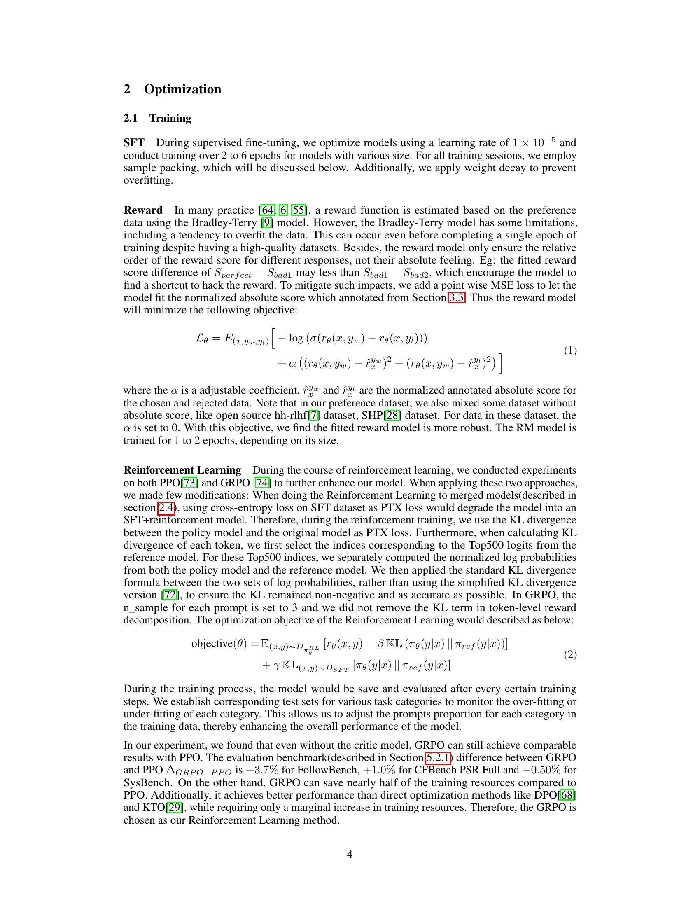

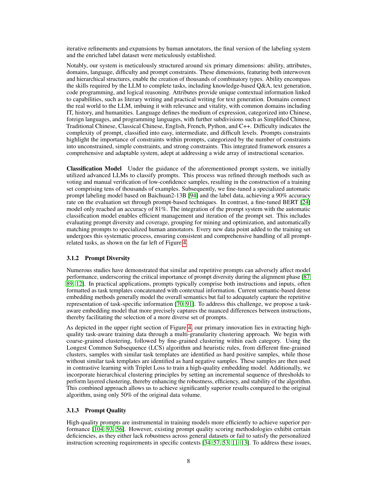
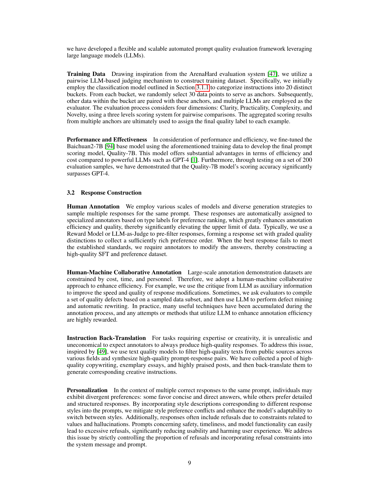

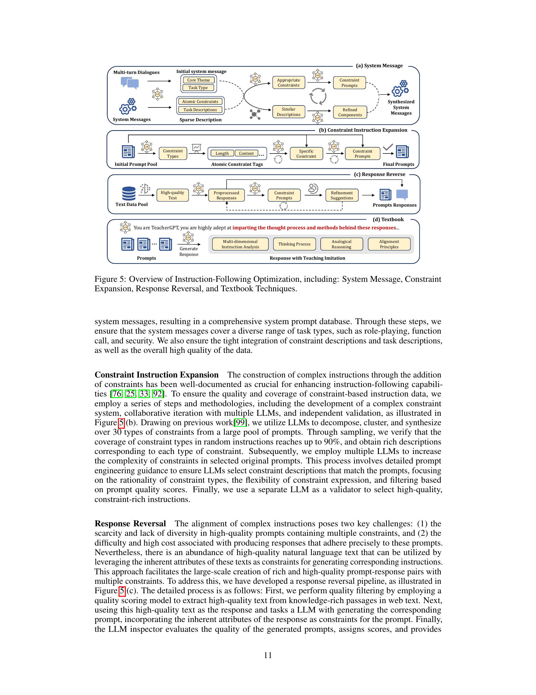

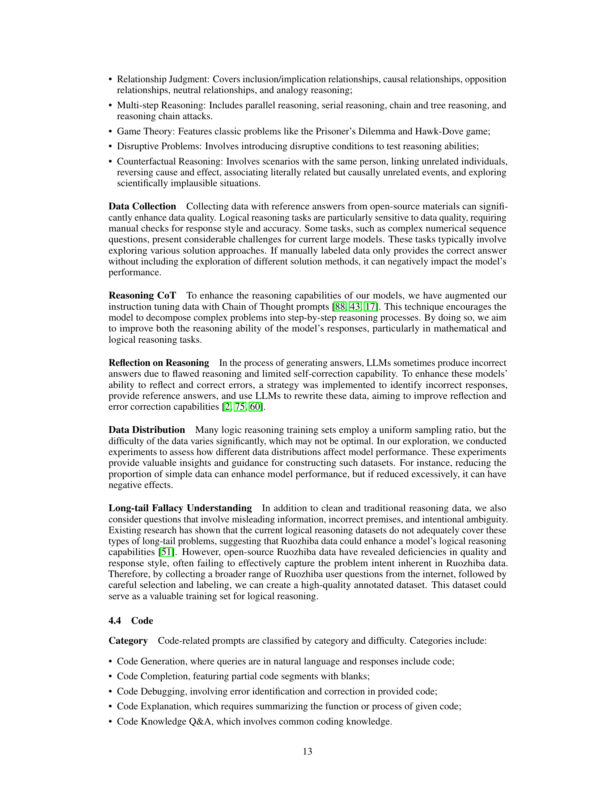

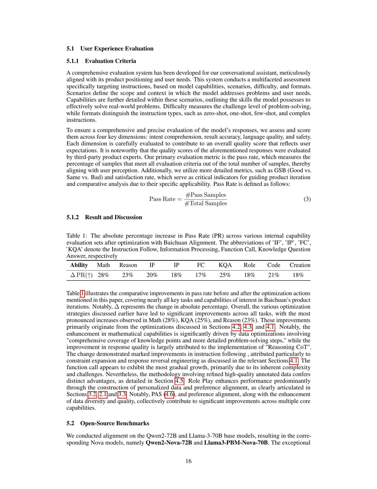

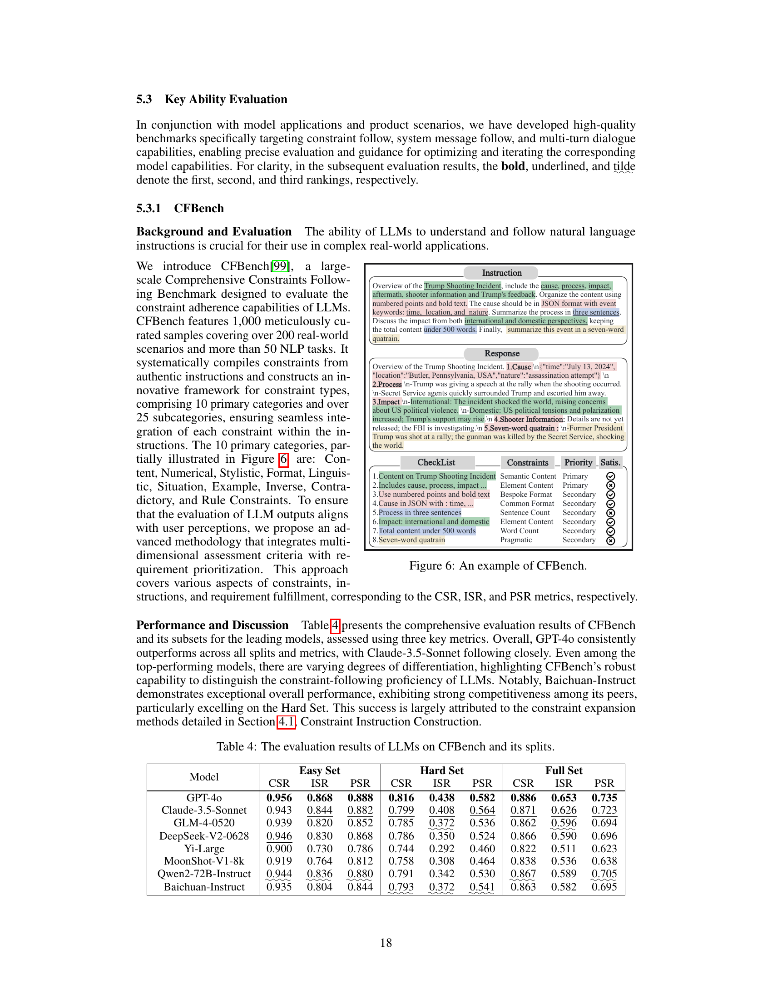

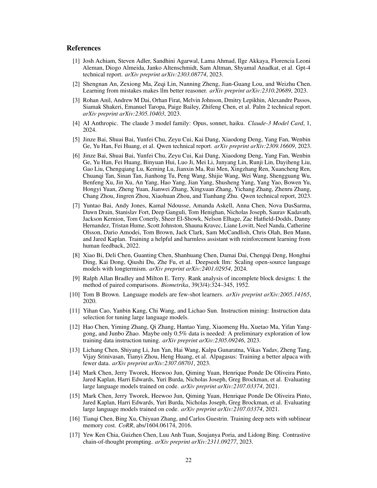
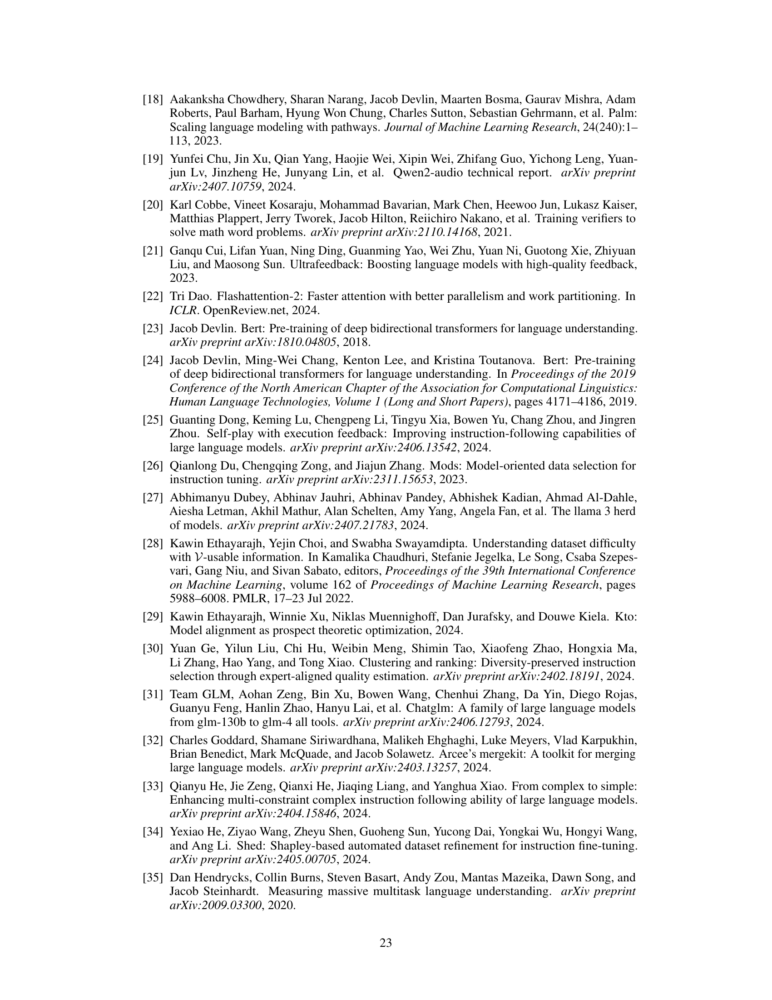

