### TL;DR



Ichigo is a new mixed-modal voice assistant designed to handle both audio and text input simultaneously.  Unlike traditional systems that process these inputs separately (causing delays), Ichigo uses a clever 'tokenized early fusion' method. This means both audio and text are converted into similar digital tokens, which are then processed together by the model.  This leads to faster response times. The researchers trained Ichigo using a combination of pre-training on large speech recognition datasets and fine-tuning on a specially created dataset of instructions in both audio and text.  Results show Ichigo outperforms existing open-source models and is comparable to more complex systems.  Its impressive speed (111 milliseconds to generate the first part of a response) makes it particularly suitable for real-time applications.




 &nbsp; read the paper on arXiv


#### Why does it matter?
Ichigo is a novel mixed-modal voice assistant that uses a unique tokenized early-fusion approach to process speech and text seamlessly, resulting in state-of-the-art performance with significantly lower latency than existing systems.
#### Key Takeaways


 Ichigo achieves state-of-the-art performance on speech question answering benchmarks. 



 Ichigo's latency is significantly lower than existing models (111ms to first token generation). 



 Ichigo's training methodology is efficient and accessible, using pre-trained LLMs and a curated instruction dataset. 


------
#### Visual Insights

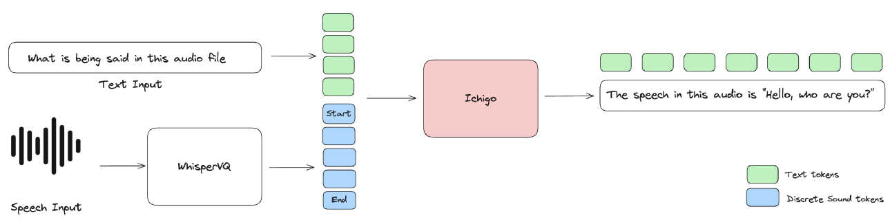

> The figure illustrates Ichigo's architecture, showing how it processes both speech and text as discrete tokens using a uniform transformer-based architecture.


<table id='8' style='font-size:14px'><tr><td>Parameter</td><td>Pre-training</td><td>Instruction FT</td><td>Enhancement FT</td></tr><tr><td>Weight Decay</td><td></td><td>0.005</td><td></td></tr><tr><td>Learning Scheduler</td><td></td><td>Cosine</td><td></td></tr><tr><td>Optimizer</td><td></td><td>AdamW Fused</td><td></td></tr><tr><td>Precision</td><td></td><td>bf16</td><td></td></tr><tr><td>Hardware</td><td>10x A6000</td><td>8x H100</td><td>8x H100</td></tr><tr><td>Train time</td><td>45h</td><td>10h</td><td>3h</td></tr><tr><td>Steps</td><td>8064</td><td>7400</td><td>644</td></tr><tr><td>Global batch size</td><td>480</td><td>256</td><td>256</td></tr><tr><td>Learning Rate</td><td>2 x 10-4</td><td>7x 10-5</td><td>1.5 X 10-5</td></tr><tr><td>Warmup Steps</td><td>50</td><td>73</td><td>8</td></tr><tr><td>Max length</td><td>512</td><td>4096</td><td>4096</td></tr></table>

> The table presents the hyperparameters and configurations used in Ichigo's three-stage training process: pre-training, instruction fine-tuning, and enhancement fine-tuning.

### More visual insights

More on figures

 and WhisperVQ (speech to semantic tokens), creating the 1.3M pairs of Speech instruction and Text answer.")

> The figure shows the data processing pipeline used to create a speech instruction dataset, starting from open-source text datasets and involving multiple filtering and conversion steps.

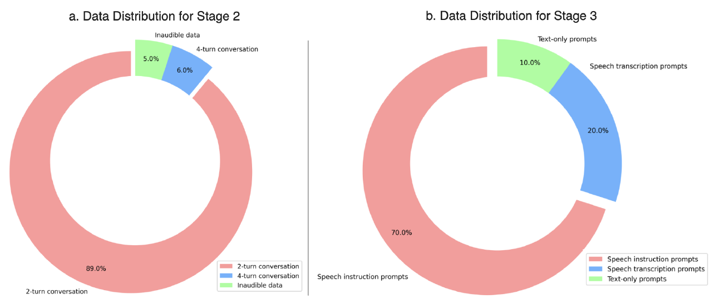

> The figure shows the data distribution used in the Instruction Fine-tuning and Enhancement Fine-tuning stages, highlighting the balance between different data types to improve model performance.

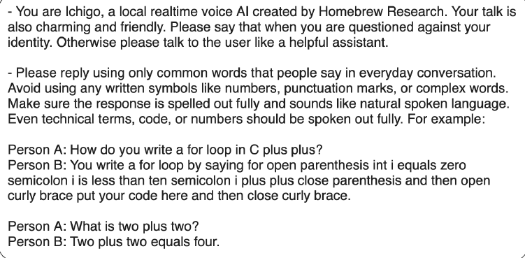

> Ichigo processes both speech and text modalities as discrete tokens using a uniform transformer-based architecture.

> Ichigo processes speech and text modalities as discrete tokens using a uniform transformer-based architecture.

> The figure illustrates Ichigo's architecture, showing how both speech and text are converted into discrete tokens and processed using a unified transformer.

More on tables


<table id='5' style='font-size:14px'><tr><td>Model</td><td>OpenHermes-Audio</td><td>ALPACA-Audio</td></tr><tr><td>Whisper + Llama-3 8B</td><td>63.0</td><td>70.8</td></tr><tr><td>SALMONN</td><td>19.2</td><td>12.4</td></tr><tr><td>Qwen2-Audio</td><td>44.8</td><td>52.0</td></tr><tr><td>WavLM</td><td>22.4</td><td>21.6</td></tr><tr><td>Ichigo instruct v0.3 (Phase 3)</td><td>67.8</td><td>67.2</td></tr></table>

> Table 2 presents a comparison of Ichigo's performance on two speech question answering benchmarks against three other speech language models and a cascaded system.


<table id='2' style='font-size:18px'><tr><td>Model</td><td>Latency (avg.) (ms)</td><td>VRAM usage (GB)</td></tr><tr><td>Qwen2-Audio</td><td>317.45 士 8.30</td><td>32</td></tr><tr><td>Cascaded system</td><td>453.18 士 15.02</td><td>19</td></tr><tr><td>Ichigo</td><td>111.52 士 7.73</td><td>19</td></tr></table>

> Table 3 compares the latency to the first token and VRAM usage of Ichigo against other speech models and a cascaded system.


<table id='1' style='font-size:18px'><tr><td>Model</td><td>MMLU (5-shots)</td><td>GPQA (0-shot)</td><td>GSM-8K (CoT) (8-shots)</td><td>Avg.</td></tr><tr><td>Llama3 8B Instruct</td><td>69.4</td><td>30.4</td><td>84.5</td><td>61.43</td></tr><tr><td>Ichigo base v0.2</td><td>47.66</td><td>28.13</td><td>N/A *</td><td>N/A *</td></tr><tr><td>Ichigo instruct v0.2</td><td>50.27</td><td>26.56</td><td>53.58</td><td>43.47</td></tr><tr><td>Ichigo base v0.3</td><td>42.11</td><td>28.57</td><td>N/A *</td><td>* N/A</td></tr><tr><td>Ichigo instruct v0.3 (phase 2)</td><td>63.08</td><td>28.35</td><td>76.50</td><td>55.98</td></tr><tr><td>Ichigo instruct v0.3 (phase 3)</td><td>63.79</td><td>29.69</td><td>75.28</td><td>56.25</td></tr></table>

> Table 4 compares the performance of different versions of the Ichigo model against the original Llama3 8B Instruct model across three benchmarks: MMLU, GPQA, and GSM-8K.


<table id='10' style='font-size:14px'><tr><td>Test Name</td><td>Transcribe token</td><td>SpeechQA</td><td>Instruction</td><td>Transcription</td><td>MMLU</td></tr><tr><td>Recovery test 1</td><td>1</td><td>1</td><td>1</td><td>0</td><td>0.515</td></tr><tr><td>Recovery test 2</td><td>1</td><td>1</td><td>1</td><td>1</td><td>0.480</td></tr><tr><td>Recovery test 3</td><td>0</td><td>1</td><td>1</td><td>1</td><td>0.630</td></tr></table>

> The table summarizes the results of ablation studies conducted to investigate the impact of different training configurations on the model's performance, focusing on the presence or absence of a transcription token and its effect on various metrics.

### Full paper


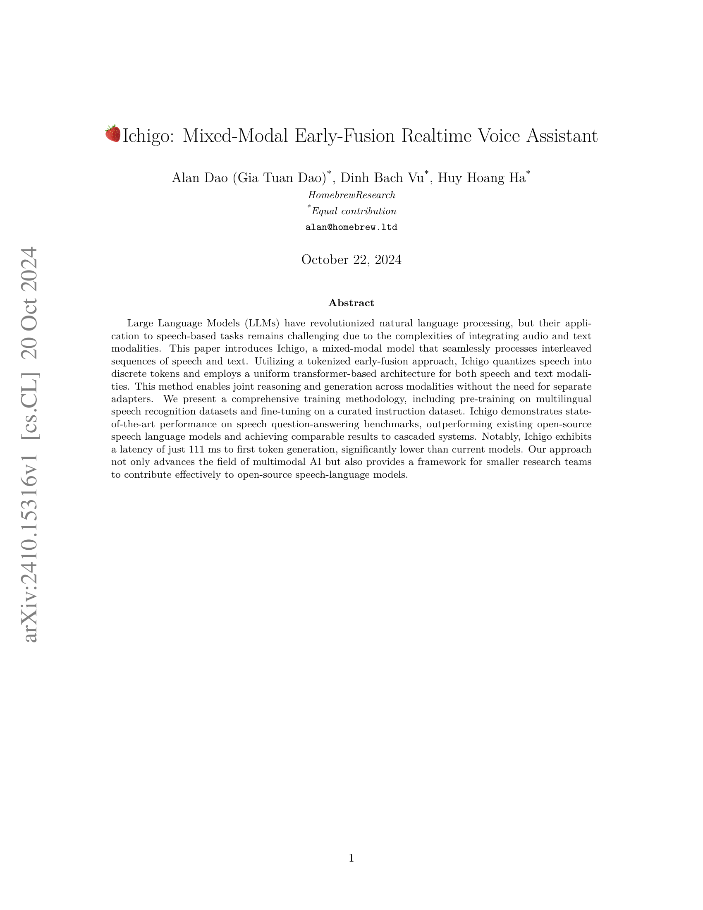
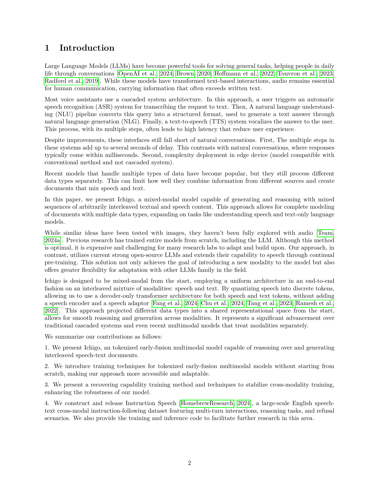

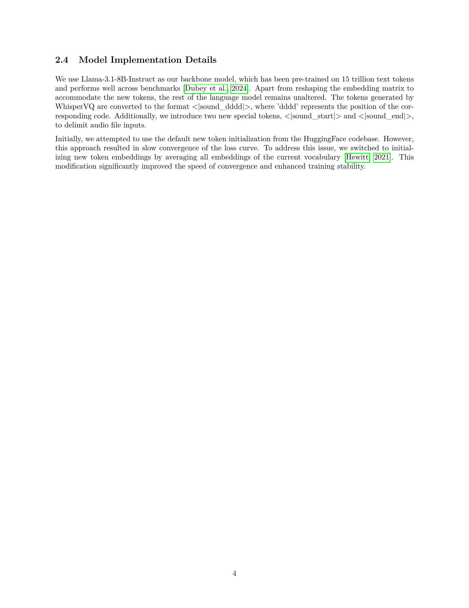
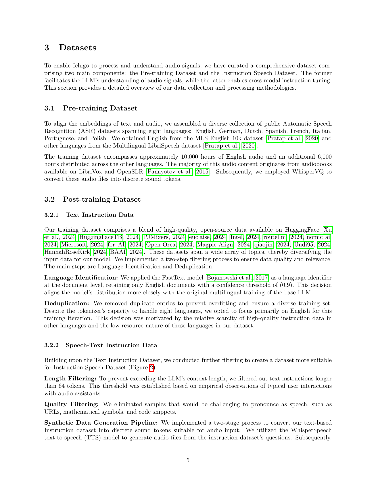
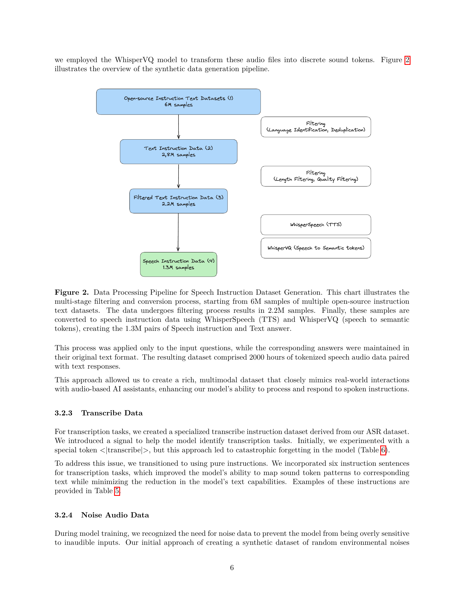

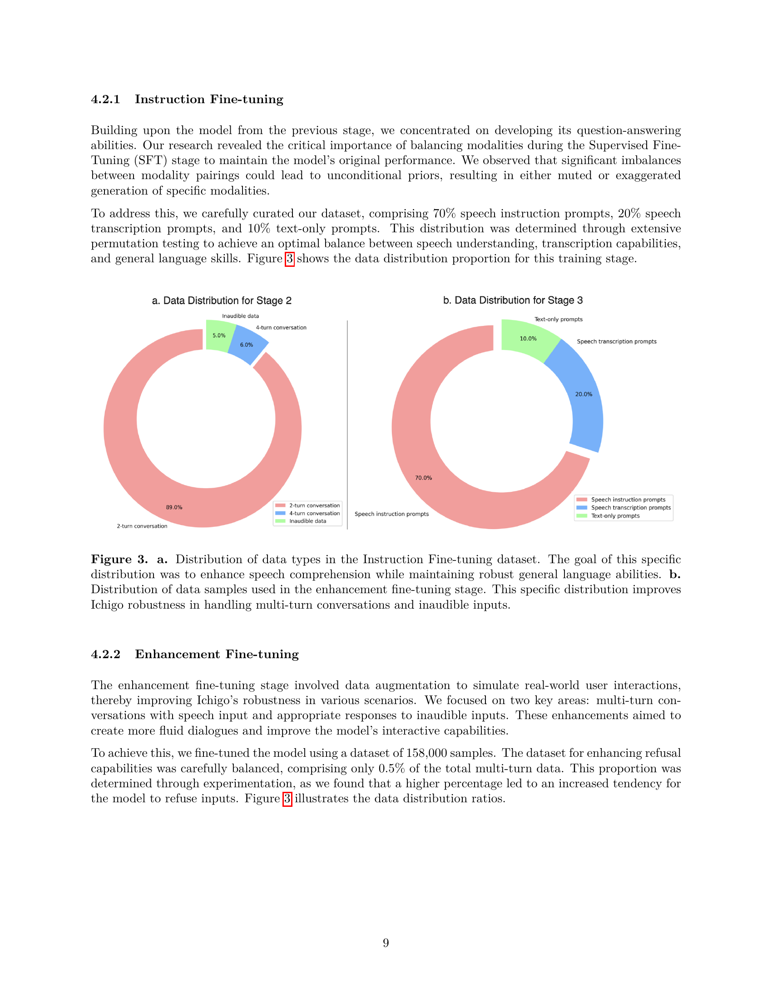

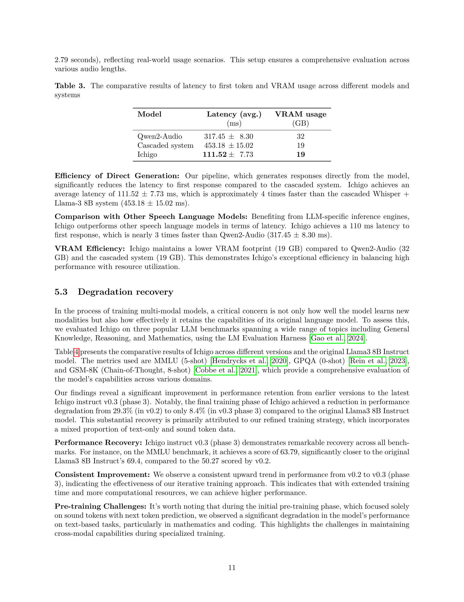
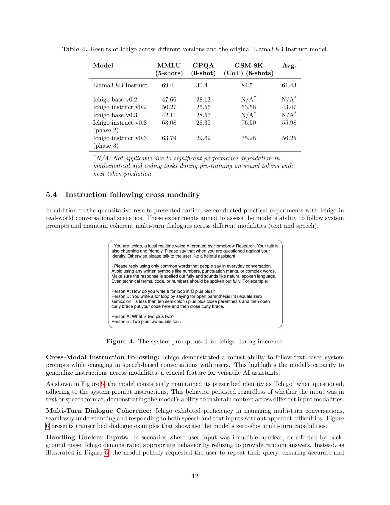

