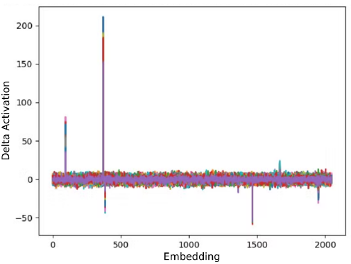
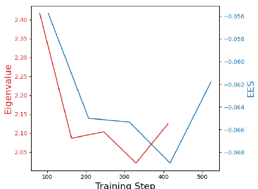
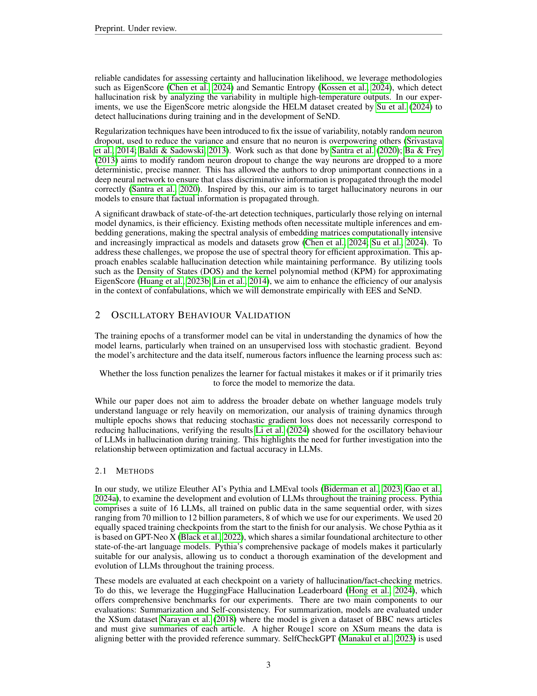
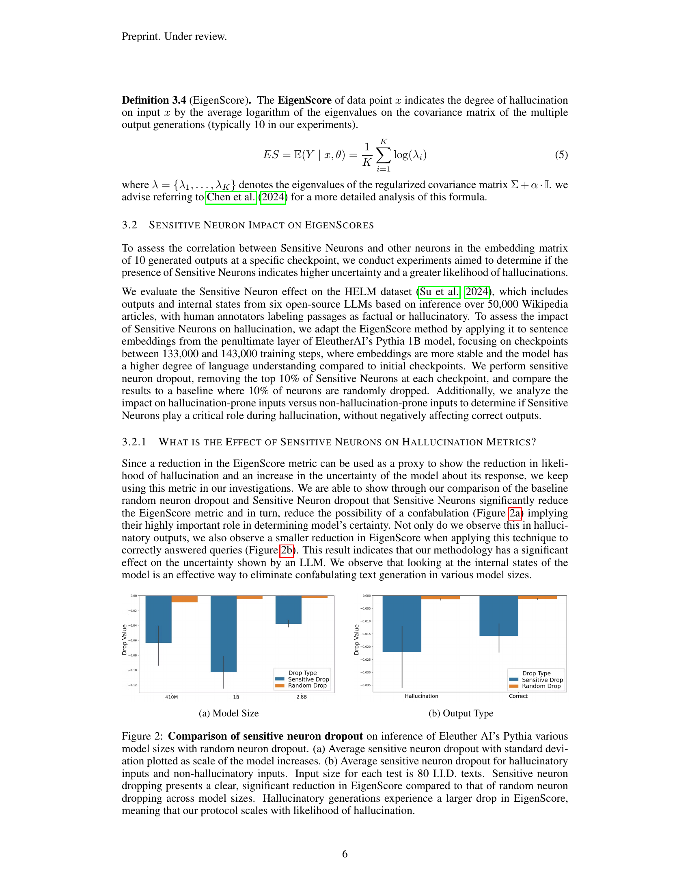
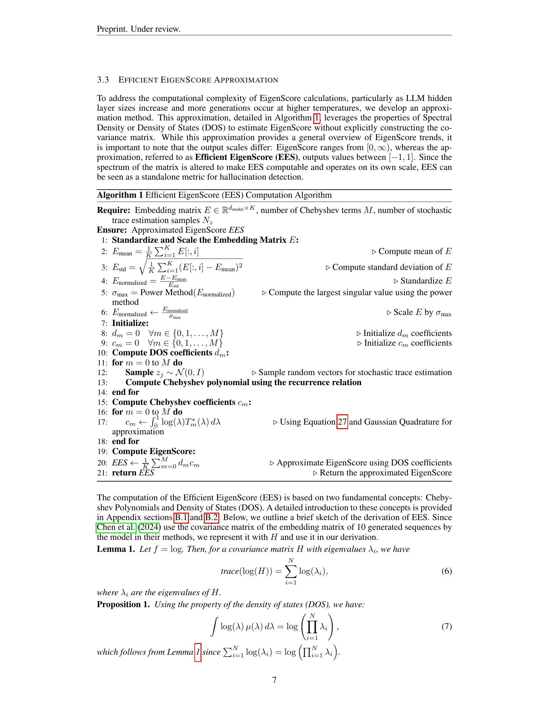
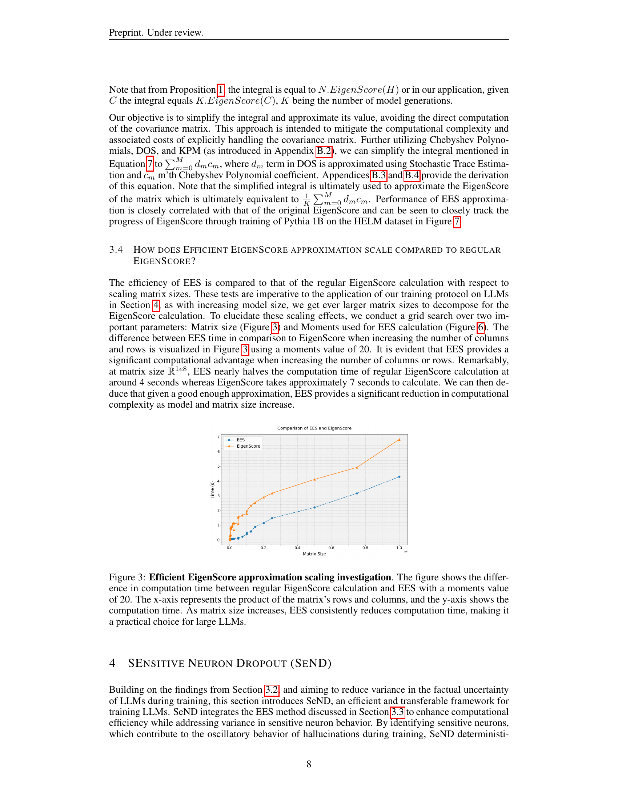
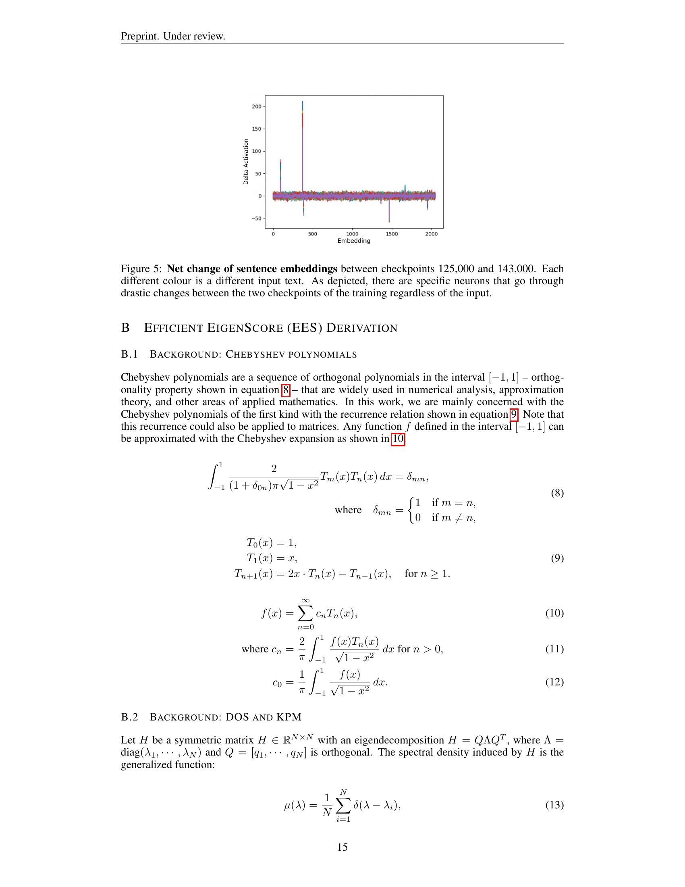
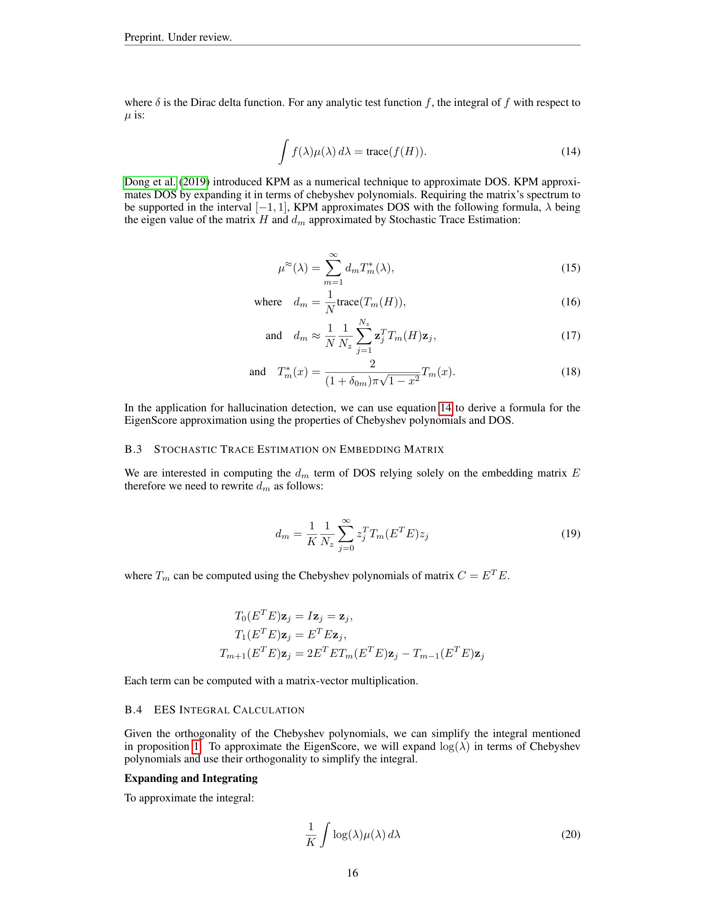
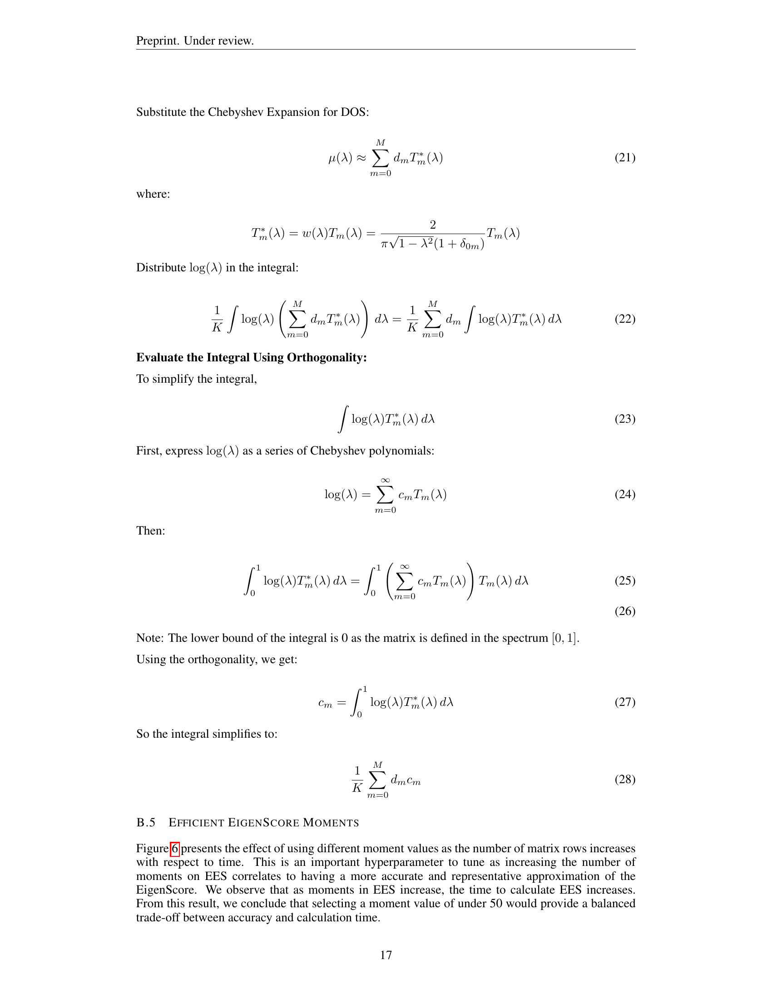

### TL;DR



Large language models (LLMs) sometimes produce factually incorrect outputs, known as hallucinations.  This paper addresses this by focusing on the training process itself, rather than post-hoc fixes. The researchers analyzed the relationship between training and hallucinations, observing fluctuations in accuracy over training epochs. They introduced Sensitive Neuron Dropout (SeND), a training technique that identifies and removes neurons which cause high variability in the model's output (sensitive neurons).  They also developed a faster metric (Efficient EigenScore) to measure hallucinations.  Experiments showed SeND improves LLM accuracy on datasets like Wikipedia and medical data by up to 40% compared to standard training, demonstrating that addressing the training process directly can substantially reduce hallucination.




 &nbsp; read the paper on arXiv


#### Why does it matter?
To provide a concise and informative summary of the research paper on hallucination mitigation in large language models (LLMs) using Sensitive Neuron Dropout (SeND).
#### Key Takeaways


 SeND, a novel training protocol, effectively mitigates hallucinations in LLMs by dropping unreliable neurons. 



 SeND improves LLM factual accuracy at test time by up to 40% compared to standard training. 



 Efficient EigenScore (EES), a faster hallucination detection metric, enhances SeND's computational efficiency. 


------
#### Visual Insights

 presents the performance of the Pythia models under the SelfCheckGPT metric. Average performance is indicated by solid lines, while the shaded regions represent the standard deviation. Higher SelfCheckGPT score indicates a higher probability of self-contradiction and higher probability of confabulation. Part (b) depicts the same experimental setup, but hallucination measured on the XSum v2 dataset, where Rouge1 is used as the performance metric. A higher Rouge1 score suggests a better alignment of the generated text to that of the reference summary. For all model sizes, we observe a pronounced trend of high variance and oscillatory behavior in hallucination rates. This fluctuation highlights the models' uncertainty at specific time stamps and emphasizes the need for a robust mitigation strategy to stabilize performance during training.")

> Figure 1 visualizes the oscillatory behavior of hallucination metrics across various sizes of LLMs during training, highlighting high variance and uncertainty in model performance.

{{< table-caption caption="🔽 Figure 4: Regular finetuning vs. SeND on two datasets. (a) presents the results of training Pythia 1B on HELM with regular finetuning and SeND. (b) uses the same training setup as (a), but the LLM is trained on MedHALT 2k. In both plots, performance is reported as the average EES over 5 runs on the validation set. Models are trained until loss convergence. Training with SeND shows a more controlled reduction in EES compared to regular finetuning, suggesting that SeND optimizes for hallucinations as well as loss, with less overall confidence variability during training. Since finetuning without dropout consistently achieves better factual consistency than random dropout in our experiments, we compare SeND directly with standard finetuning." >}}
<table id='4' style='font-size:14px'><tr><td>Require: Embedding matrix E E trace estimation</td><td>R dmodel x K number of Chebyshev terms M, number of stochastic , samples Nz</td></tr><tr><td>Ensure: Approximated EigenScore</td><td>EES</td></tr><tr><td>1: Standardize and Scale the</td><td>Embedding Matrix E:</td></tr><tr><td>K 1 � i=1 E[:, i] 2: Emean = K</td><td>▷ Compute mean of E</td></tr><tr><td>3: Estd = V 1k EK=1 (E[:, i] - Emean E-Emean</td><td>)2 ▷ Compute standard deviation of E</td></tr><tr><td>4: Enormalized = Estd</td><td>▷ Standardize E</td></tr><tr><td>5: Omax = Power Method(Enormalized)</td><td>▷ Compute the largest singular value using the power</td></tr><tr><td>method</td><td></td></tr><tr><td>6: Enormalized Enormalized 0</td><td>▷ Scale E by Omax</td></tr><tr><td>max 7: Initialize:</td><td></td></tr><tr><td>8: dm = 0 Am E {0, 1, · · · , M}</td><td>▷ Initialize dm coefficients</td></tr><tr><td>9: Cm = 0 Am E {0, 1, · · · , M}</td><td>▷ Initialize Cm coefficients</td></tr><tr><td>10: Compute DOS coefficients dm:</td><td></td></tr><tr><td>11: for m = 0 to M do</td><td></td></tr><tr><td>12: Sample zj ~ N(0, I)</td><td>▷ Sample random vectors for stochastic trace estimation</td></tr><tr><td>13: Compute Chebyshev</td><td>polynomial using the recurrence relation</td></tr><tr><td>14: end for</td><td>Cm:</td></tr><tr><td>15: Compute Chebyshev coefficients</td><td></td></tr><tr><td>16: for m = 0 to M do</td><td></td></tr><tr><td>17: Cm ← So log(�)T* (入) d入 approximation</td><td>▷ Using Equation 27 and Gaussian Quadrature for</td></tr><tr><td>18: end for</td><td></td></tr><tr><td>19: Compute EigenScore:</td><td></td></tr><tr><td>M 1 � m=0 dm Cm 20: EES ← K</td><td>▷ Approximate EigenScore using DOS coefficients</td></tr><tr><td>21: return EES</td><td>▷ Return the approximated EigenScore</td></tr></table>

> This figure compares the performance of regular finetuning versus SeND (Sensitive Neuron Dropout) on two datasets (HELM and MedHALT) by plotting the average EES (Efficient EigenScore) over five runs, showing SeND's superior control over hallucination and loss.

### More visual insights

More on charts

 Average sensitive neuron dropout with standard deviation plotted as scale of the model increases. (b) Average sensitive neuron dropout for hallucinatory inputs and non-hallucinatory inputs. Input size for each test is 80 I.I.D. texts. Sensitive neuron dropping presents a clear, significant reduction in EigenScore compared to that of random neuron dropping across model sizes. Hallucinatory generations experience a larger drop in EigenScore, meaning that our protocol scales with likelihood of hallucination.")

> The chart compares the effect of sensitive neuron dropout versus random neuron dropout on EigenScore, showing significant reduction in hallucination likelihood with sensitive neuron dropout, especially in hallucinatory outputs.

> Figure 3 compares the computation time of EigenScore and its approximation, EES, across various matrix sizes, demonstrating EES's significant efficiency gains for large LLMs.

 presents the results of training Pythia 1B on HELM with regular finetuning and SeND. (b) uses the same training setup as (a), but the LLM is trained on MedHALT 2k. In both plots, performance is reported as the average EES over 5 runs on the validation set. Models are trained until loss convergence. Training with SeND shows a more controlled reduction in EES compared to regular finetuning, suggesting that SeND optimizes for hallucinations as well as loss, with less overall confidence variability during training. Since finetuning without dropout consistently achieves better factual consistency than random dropout in our experiments, we compare SeND directly with standard finetuning.")

> Figure 4 shows that SeND training leads to a more controlled reduction in EES compared to regular finetuning on both HELM and MedHALT datasets, indicating that it optimizes for both loss and hallucination reduction.

> The chart visualizes the variability in neuron activations between two training checkpoints, highlighting the existence of sensitive neurons that exhibit drastic changes regardless of the input text.

. More moments gives more accurate approximation but higher computation time.")

> The chart displays the computation time of Efficient EigenScore (EES) with varying numbers of rows in the matrix and different moment values.

> The chart compares the performance of the EigenScore and its approximation, Efficient EigenScore (EES), during the training process of Pythia 1B model on the HELM dataset, showing a strong correlation between the two metrics.

### Full paper



