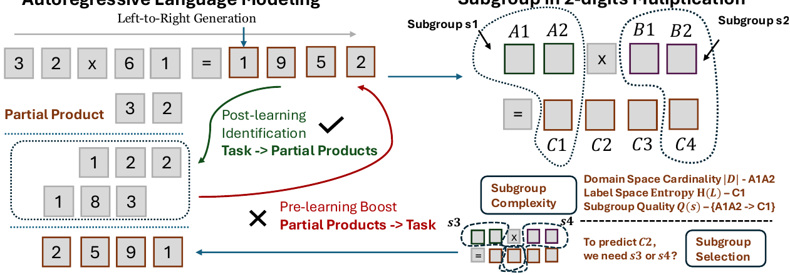
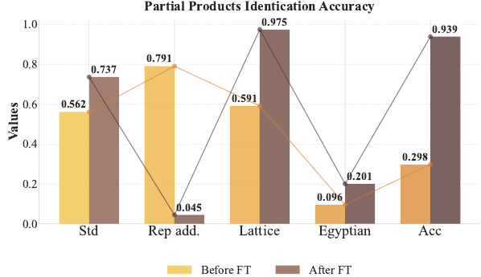
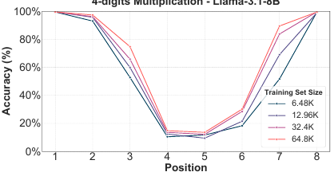
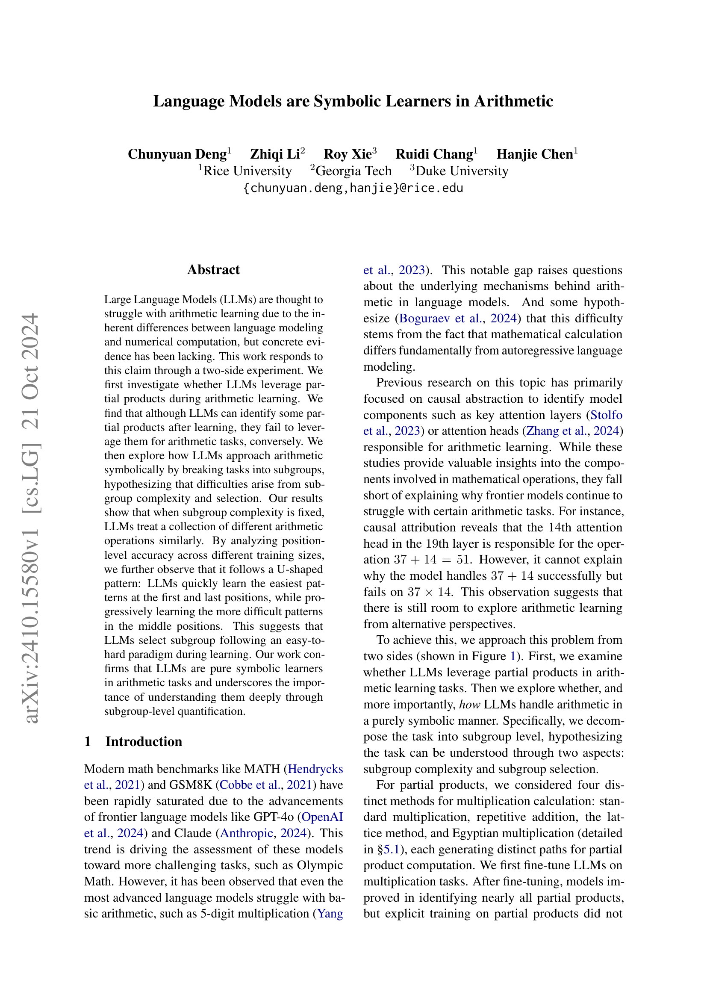
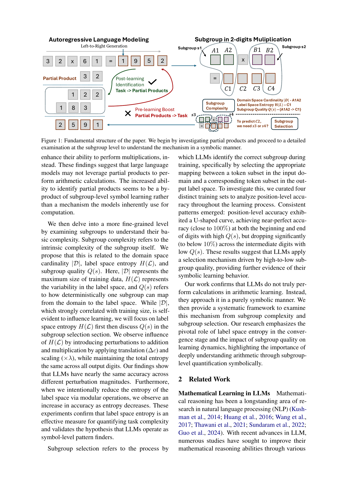
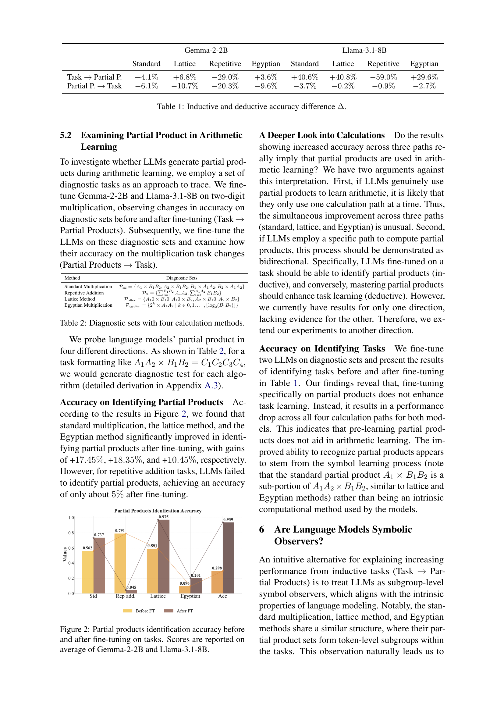
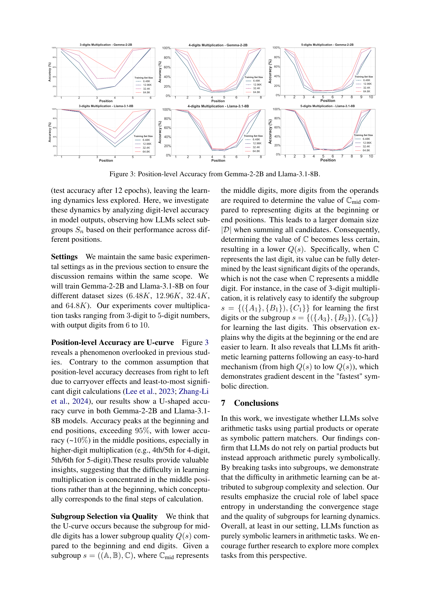
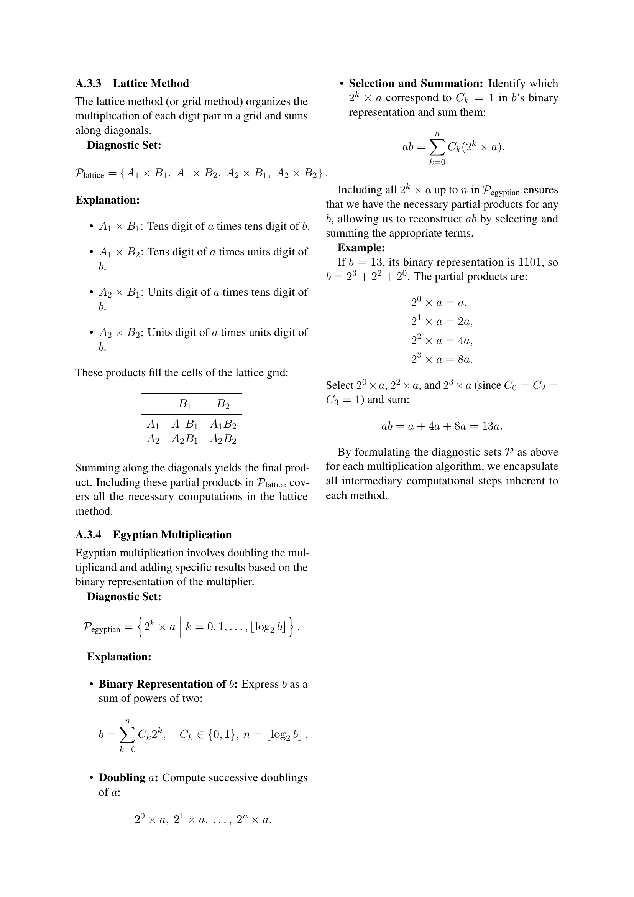

### TL;DR



This paper explores how large language models (LLMs) learn arithmetic.  Contrary to the belief that LLMs perform calculations like humans, the researchers found that LLMs learn arithmetic symbolically. They don't use partial products in the way humans do; instead, they identify patterns within subgroups of data.  The difficulty of an arithmetic task depends on the complexity and selection of these subgroups, which are characterized by label space entropy and subgroup quality.  Interestingly, LLM accuracy follows a U-shaped curve across different positions within a numerical sequence – they perform well on the beginning and end digits but struggle with middle digits. This is because easier patterns are learned first, leaving the more complex patterns in the middle to be learned later.  Overall, the study shows LLMs are symbolic learners, emphasizing the importance of understanding them through subgroup-level quantification.




 &nbsp; read the paper on arXiv


#### Why does it matter?
This research paper investigates how large language models (LLMs) learn arithmetic.  It challenges the common assumption that LLMs perform calculations like humans, showing instead that they learn arithmetic symbolically by identifying patterns in subgroups of data.
#### Key Takeaways


 LLMs learn arithmetic symbolically, not through numerical computation. 



 LLM performance in arithmetic is strongly linked to subgroup complexity and selection, not just training data size. 



 LLMs exhibit a U-shaped learning curve in arithmetic, mastering easy patterns first and last, and struggling with more complex middle patterns. 


------
#### Visual Insights

> The figure illustrates the two-pronged approach of the paper: investigating partial product usage in LLMs and analyzing arithmetic learning through subgroup-level complexity and selection.

> The chart displays the accuracy of identifying partial products in different multiplication methods before and after fine-tuning for two large language models.


<table id='0' style='font-size:18px'><tr><td></td><td colspan="4">Gemma-2-2B</td><td colspan="4">Llama-3.1-8B</td></tr><tr><td></td><td>Standard</td><td>Lattice</td><td>Repetitive</td><td>Egyptian</td><td>Standard</td><td>Lattice</td><td>Repetitive</td><td>Egyptian</td></tr><tr><td>Task → Partial P.</td><td>+4.1%</td><td>+6.8%</td><td>-29.0%</td><td>+3.6%</td><td>+40.6%</td><td>+40.8%</td><td>-59.0%</td><td>+29.6%</td></tr><tr><td>Partial P. → Task</td><td>-6.1%</td><td>-10.7%</td><td>-20.3%</td><td>-9.6%</td><td>-3.7%</td><td>-0.2%</td><td>-0.9%</td><td>-2.7%</td></tr></table>

> This table presents the changes in accuracy on multiplication tasks before and after fine-tuning LLMs on diagnostic sets for four different multiplication calculation methods.

### More visual insights

More on charts

> The chart displays the U-shaped pattern of position-level accuracy in 3, 4, and 5-digit multiplication tasks across various training set sizes for Gemma-2-2B and Llama-3.1-8B models.

> The chart displays the position-level accuracy of LLMs in multiplication tasks, revealing a U-shaped pattern across different training set sizes.

> The chart displays the position-level accuracy of LLMs in 3, 4, and 5-digit multiplication tasks across different training set sizes, revealing a U-shaped pattern.

> The chart displays the position-level accuracy of LLMs in multiplication tasks across varying training set sizes, revealing a U-shaped pattern.

> The chart displays the position-level accuracy of LLMs in 3, 4, and 5 digit multiplication tasks across different training set sizes, revealing a U-shaped pattern.

> The chart displays the position-level accuracy of LLMs (Gemma-2-2B and Llama-3.1-8B) in 3, 4, and 5-digit multiplication tasks across different training set sizes, revealing a U-shaped pattern.

More on tables


 <table id='5' style='font-size:16px'><tr><td>Standard Multiplication</td><td>Pstd = {A1 xB1B2, A2xB1B2, B1 xA1A2,B2 x A1A2}</td></tr><tr><td>Repetitive Addition</td><td>Pra = {�B1B2 A1A2, ��� B1B2}</td></tr><tr><td>Lattice Method</td><td>Plattice = {A10x B10,A10x B2,A2 x B10, A2 x B2}</td></tr><tr><td>Egyptian Multiplication</td><td>Pegyptian = {2k xA1A2|ke0,1,..., [log2(B1B2)]}</td></tr></table>

> The table presents diagnostic sets for four multiplication calculation methods (standard multiplication, repetitive addition, lattice method, and Egyptian multiplication) used to investigate whether LLMs leverage partial products during arithmetic learning.

{{< table-caption caption="🔽 Table 3: Label space statistics with different rule perturbations. H(L) represents the entropy of the label space, and |L| is the size of the label space. {C}i=1 represents all positions in output digits." >}}
<table id='0' style='font-size:14px'><tr><td></td><td></td><td>C1</td><td>C2</td><td>C3</td><td>C4</td><td>C5</td><td colspan="2">{Ci}i=1</td></tr><tr><td>Task</td><td>Format</td><td>H(L)</td><td>H(L)</td><td>H(L)</td><td>H(L)</td><td>H(L)</td><td>ILI</td><td>H(L)</td></tr><tr><td>f(a,b) = a + b</td><td>A1A2 + B1B2 = C1C2C3</td><td>0.9710</td><td>3.3215</td><td>3.3219</td><td></td><td></td><td>179</td><td>7.2130</td></tr><tr><td>f(a,b) = a + b + 1</td><td>A1A2 + B1B2 = C1C2C3</td><td>0.9649</td><td>3.3215</td><td>3.3219</td><td></td><td></td><td>179</td><td>7.2130</td></tr><tr><td>f(a,b) = a +6+ 15</td><td>A1A2 + B1B2 = C1C2C3</td><td>0.9280</td><td>3.3214</td><td>3.3219</td><td></td><td></td><td>179</td><td>7.2130</td></tr><tr><td>f(a,b) = a +b + 115</td><td>A1A2 + B1B2 = C1C2C3</td><td>0.9280</td><td>3.3214</td><td>3.3219</td><td>-</td><td></td><td>179</td><td>7.2130</td></tr><tr><td>f(a,b) = (a+ b) mod 100</td><td>A1A2 + B1B2 = C1C2</td><td>3.3214</td><td>3.3219</td><td>-</td><td>-</td><td>-</td><td>100</td><td>6.6432</td></tr><tr><td>f(a,b) = (a+ b) mod 50</td><td>A1A2 + B1B2 = C1C2</td><td>2.3217</td><td>3.3219</td><td>-</td><td>-</td><td>-</td><td>50</td><td>5.6436</td></tr><tr><td>f(a,b) = (a+b) mod 10</td><td>A1A2 + B1B2 = C1</td><td>3.3219</td><td>-</td><td>-</td><td>-</td><td>-</td><td>10</td><td>3.3219</td></tr><tr><td>f(a,b) = a xb</td><td>A1A2 x B1B2 = C1C2C3C4</td><td>2.8979</td><td>3.3215</td><td>3.3160</td><td>3.0340</td><td>-</td><td>2621</td><td>11.1172</td></tr><tr><td>f(a,b) = a xbx 2</td><td>A1A2 x B1B2 = C1C2C3C4C5</td><td>0.6873</td><td>3.2173</td><td>3.3215</td><td>3.2964</td><td>2.2227</td><td>2621</td><td>11.1172</td></tr><tr><td>f(a,b) = a xbx 4</td><td>A1A2 x B1B2 = C1C2C3C4C5</td><td>1.6030</td><td>3.3020</td><td>3.3204</td><td>3.2234</td><td>2.2227</td><td>2621</td><td>11.1172</td></tr><tr><td>f(a,b) = a xbx 8</td><td>A1A2 x B1B2 = C1C2C3C4C5</td><td>2.5811</td><td>3.3202</td><td>3.3151</td><td>3.2235</td><td>2.2227</td><td>2621</td><td>11.1172</td></tr><tr><td>f(a,b) = (a x b) mod 100</td><td>A1A2 x B1B2 = C1C2</td><td>3.3160</td><td>3.0340</td><td>-</td><td>-</td><td>-</td><td>100</td><td>6.2912</td></tr><tr><td>f(a,b) = (a x b) mod 50</td><td>A1A2 x B1B2 = C1C2</td><td>2.3210</td><td>3.0340</td><td>-</td><td>-</td><td>-</td><td>50</td><td>5.3494</td></tr><tr><td>f(a,b) = (a x b) mod 10</td><td>A1A2 x B1B2 = C1</td><td>3.0340</td><td>-</td><td>-</td><td>-</td><td>-</td><td>10</td><td>3.0340</td></tr></table>

> Table 3 shows the label space entropy and cardinality for various addition and multiplication tasks with different rule perturbations.


<table id='7' style='font-size:14px'><tr><td></td><td>Gemma-2-2B</td><td>Llama-3.1-8B</td></tr><tr><td>f(a,b) = a + 6</td><td></td><td></td></tr><tr><td>f(a,b) = a + 6 + 1</td><td>-0.1%</td><td>-0.1%</td></tr><tr><td>f(a,b) = a + 6 + 15</td><td>-0.9%</td><td>+0.1%</td></tr><tr><td>f(a,b) = a + b + 115</td><td>-1.4%</td><td>+0.7%</td></tr><tr><td>f(a,b) = (a + b) mod 100</td><td>+10.1%</td><td>+3.7%</td></tr><tr><td>f(a,b) = (a + b) mod 50</td><td>+13.1%</td><td>+6.7%</td></tr><tr><td>f(a,b) = (a+b) mod 10</td><td>+26.1%</td><td>+13.7%</td></tr><tr><td>f(a,b) = a x 6</td><td>-</td><td></td></tr><tr><td>f(a,b) = a X 6 X 2</td><td>-1.1%</td><td>-2.7%</td></tr><tr><td>f(a,b) = a x 6 x 4</td><td>-1.7%</td><td>+0.7%</td></tr><tr><td>f(a,b) = a X b x 8</td><td>+0.2%</td><td>-3.7%</td></tr><tr><td>f(a,b) = (a x b) mod 100</td><td>+7.1%</td><td>+3.8%</td></tr><tr><td>f(a,b) = (a X b) mod 50</td><td>+12.1%</td><td>+5.3%</td></tr><tr><td>f(a,b) = (a x b) mod 10</td><td>+18.9%</td><td>+10.7%</td></tr></table>

> The table shows the accuracy difference (Δ) in percentage for addition and multiplication tasks on Gemma-2-2B and Llama-3.1-8B models with various rule perturbations.


<table id='2' style='font-size:14px'><tr><td></td><td>Format</td><td>Gemma-2-2B</td><td>Llama-3.1-8B</td></tr><tr><td>f(a,b) =a+b</td><td>Natural Language</td><td>-</td><td>-</td></tr><tr><td>f(a,b) = a+b</td><td>Random String</td><td>+0.1%</td><td>-0.2%</td></tr><tr><td>f(a,b) =a+b</td><td>Disturbed Digits</td><td>-3.9%</td><td>-2.1%</td></tr><tr><td>f(a,b) = a x b</td><td>Natural Language</td><td>-</td><td>-</td></tr><tr><td>f(a,b) = a x b</td><td>Random String</td><td>+0.3%</td><td>-0.5%</td></tr><tr><td>f(a,b) = a X b</td><td>Disturbed Digits</td><td>-1.9%</td><td>-3.1%</td></tr></table>

> This table presents the accuracy difference (Δ) in percentage points for addition and multiplication tasks, comparing the performance of Gemma-2-2B and Llama-3.1-8B models under three different input format perturbations (Natural Language, Random String, and Disturbed Digits).


<table id='16' style='font-size:22px'><tr><td></td><td>B1 B2</td></tr><tr><td>A1</td><td>A1B1 A1B2</td></tr><tr><td>A2</td><td>A2B1 A2B2</td></tr></table>

> The table presents the inductive and deductive accuracy differences (Δ) for four multiplication calculation methods (Standard, Lattice, Repetitive, Egyptian) across two LLMs (Gemma-2-2B and Llama-3.1-8B), showing the impact of fine-tuning on partial products.

### Full paper



