### TL;DR



This paper introduces GATEAU, a new framework for improving the performance of large language models (LLMs) on tasks involving long input contexts.  The problem is that existing methods for creating datasets for training these models often result in low-quality data, which hinders performance. GATEAU addresses this by using two novel techniques: Homologous Models' Guidance (HMG) and Contextual Awareness Measurement (CAM). HMG uses the difference in perplexity scores between two similar models with different context window sizes to identify samples with complex long-range dependencies. CAM assesses whether the model's attention mechanism focuses on the important parts of the input text, also identifying challenging samples. By combining these two measures, GATEAU selects the most challenging samples, resulting in a higher-quality training dataset. Experiments demonstrate that LLMs trained on the dataset created using GATEAU achieve significantly better performance on various benchmarks, showing the effectiveness of the method in improving both instruction-following and long-context understanding abilities.




 &nbsp; read the paper on arXiv


#### Why does it matter?
To help researchers quickly grasp the core contributions and significance of the research paper on selecting influential samples for long-context alignment.
#### Key Takeaways


 GATEAU effectively selects high-quality samples enriched with long-range dependencies for improved LLM performance. 



 Homologous Models' Guidance (HMG) and Contextual Awareness Measurement (CAM) effectively measure the difficulty in generating responses and understanding long contexts. 



 Using selected samples significantly improves LLMs' instruction-following and long-context understanding capabilities. 


------
#### Visual Insights

> The figure illustrates the GATEAU framework, which uses Homologous Models' Guidance and Contextual Awareness Measurement to select influential samples for training long-context LLMs.

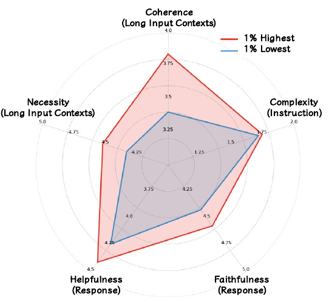

> The radar chart compares the average scores of five aspects (coherence, necessity, helpfulness, faithfulness, and complexity) between the top 1% and bottom 1% of samples selected by the GATEAU method.


 <table id='4' style='font-size:14px'><tr><td>Model</td><td>Real-world</td><td>Limited</td></tr><tr><td>w/o SFT</td><td>10.4</td><td>10.4</td></tr><tr><td>w/o Long SFT</td><td>37.4</td><td>36.2</td></tr><tr><td>Full - 100%</td><td>48.8</td><td>50.8</td></tr><tr><td>Perplexity Guidance - 10%</td><td>52.2</td><td>49.0</td></tr><tr><td>CaR - 10%</td><td>50.8</td><td>49.0</td></tr><tr><td>Cherry Selection - 10%</td><td>53.2</td><td>50.8</td></tr><tr><td>GATEAU-LLaMA - 10%</td><td>55.4</td><td>58.0</td></tr><tr><td>Perplexity Guidance - 30%</td><td>50.6</td><td>51.8</td></tr><tr><td>CaR - 30%</td><td>48.6</td><td>51.4</td></tr><tr><td>Cherry Selection - 30%</td><td>50.4</td><td>52.4</td></tr><tr><td>GATEAU-LLaMA - 30%</td><td>57.8</td><td>55.2</td></tr><tr><td>Perplexity Guidance - 50%</td><td>49.8</td><td>51.0</td></tr><tr><td>CaR - 50%</td><td>49.6</td><td>51.6</td></tr><tr><td>Cherry Selection - 50%</td><td>50.6</td><td>53.2</td></tr><tr><td>GATEAU-LLaMA - 50%</td><td>56.8</td><td>59.0</td></tr></table>

> Table 2 presents the performance comparison of different models on the LongBench benchmark under limited short instruction data settings, showing the impact of various data selection methods on model capabilities.

### More visual insights

More on charts

 under different context lengths on LongBench.")

> The chart displays the average scores achieved by different models across various context lengths on the LongBench benchmark, comparing the performance of models trained with different amounts of data selected by the proposed method and baselines.

> The chart displays the results of a human evaluation comparing the performance of models trained with different percentages of the dataset in both real-world and limited short instruction data settings.

 on LongBench-Chat with different hyperparameter α in Eq. (6).")

> The bar chart displays the performance of the GATEAU-LLaMA-50% model on the LongBench-Chat benchmark across different values of the hyperparameter α in real-world and limited short instruction data settings.

 on LongBench-Chat with different hyperparameter α in Eq. (6).")

> The chart displays the performance of GATEAU-LLAMA-50% on LongBench-Chat under real-world and limited short instruction data settings with varying hyperparameter α values in equation 6.

More on tables


 <table id='4' style='font-size:14px'><tr><td>Model</td><td>Real-world</td><td>Limited</td></tr><tr><td>w/o SFT</td><td>34.6</td><td>34.6</td></tr><tr><td>w/o Long SFT</td><td>53.7</td><td>50.5</td></tr><tr><td>Full - 100%</td><td>54.3</td><td>47.7</td></tr><tr><td>Perplexity Guidance - 10%</td><td>56.1</td><td>50.9</td></tr><tr><td>CaR - 10%</td><td>54.9</td><td>49.9</td></tr><tr><td>Cherry Selection - 10%</td><td>56.8</td><td>47.6</td></tr><tr><td>GATEAU-LLaMA - 10%</td><td>58.6</td><td>53.4</td></tr><tr><td>Perplexity Guidance - 30%</td><td>55.0</td><td>50.2</td></tr><tr><td>CaR - 30%</td><td>54.3</td><td>48.6</td></tr><tr><td>Cherry Selection - 30%</td><td>54.3</td><td>45.8</td></tr><tr><td>GATEAU-LLaMA - 30%</td><td>58.8</td><td>52.9</td></tr><tr><td>Perplexity Guidance - 50%</td><td>55.9</td><td>49.2</td></tr><tr><td>CaR - 50%</td><td>54.7</td><td>51.2</td></tr><tr><td>Cherry Selection - 50%</td><td>56.3</td><td>49.6</td></tr><tr><td>GATEAU-LLaMA - 50%</td><td>57.3</td><td>54.2</td></tr></table>

> Table 4 presents the performance of various models on the MT-Bench benchmark, comparing results in real-world and limited short instruction data settings.


<table id='1' style='font-size:16px'><tr><td rowspan="2">Model</td><td colspan="3">LongBench</td><td>LongBench-Chat</td><td colspan="3">MT-Bench</td></tr><tr><td>Single-Doc QA</td><td>Multi-Doc QA</td><td>Summarization</td><td>Avg</td><td>First-turn</td><td>Second-turn</td><td>Avg</td></tr><tr><td colspan="8">Real-world Settings</td></tr><tr><td>GATEAU-LLaMA - 13B- 50%</td><td>40.2</td><td>27.1</td><td>25.7</td><td>61.4</td><td>66.8</td><td>55.3</td><td>61.1</td></tr><tr><td>-w/o Data Selection (i.e., Full - 100%)</td><td>33.6</td><td>16.7</td><td>24.4</td><td>59.4</td><td>66.0</td><td>54.1</td><td>59.6</td></tr><tr><td>GATEAU-LLaMA - 7B- 50%</td><td>38.9</td><td>25.8</td><td>25.5</td><td>56.8</td><td>64.1</td><td>50.4</td><td>57.3</td></tr><tr><td>-w/o Contextual Awareness Measurement</td><td>38.4</td><td>24.3</td><td>25.1</td><td>53.2</td><td>61.7</td><td>51.5</td><td>56.6</td></tr><tr><td>-w/o Homologous Models' Guidance</td><td>38.6</td><td>24.5</td><td>24.9</td><td>52.8</td><td>63.1</td><td>49.3</td><td>56.3</td></tr><tr><td>-w/o Data Selection (i.e., Full - 100%)</td><td>36.1</td><td>22.3</td><td>23.8</td><td>48.8</td><td>60.0</td><td>48.7</td><td>54.3</td></tr><tr><td colspan="8">Limited Short Instruction Data Settings</td></tr><tr><td>GATEAU-LLaMA - 13B- 50%</td><td>32.1</td><td>19.1</td><td>25.3</td><td>62.6</td><td>66.0</td><td>51.5</td><td>58.8</td></tr><tr><td>-w/o Data Selection (i.e., Full - 100%)</td><td>30.4</td><td>17.8</td><td>24.5</td><td>54.2</td><td>61.0</td><td>49.8</td><td>55.4</td></tr><tr><td>GATEAU-LLaMA - 7B - 50%</td><td>31.0</td><td>18.1</td><td>25.3</td><td>59.0</td><td>64.2</td><td>44.1</td><td>54.2</td></tr><tr><td>-w/o Contextual Awareness Measurement</td><td>28.5</td><td>17.5</td><td>24.7</td><td>53.2</td><td>61.3</td><td>42.4</td><td>51.8</td></tr><tr><td>-w/o Homologous Models' Guidance</td><td>28.7</td><td>17.3</td><td>24.6</td><td>54.4</td><td>56.1</td><td>45.0</td><td>50.6</td></tr><tr><td>-w/o Data Selection (i.e., Full - 100%)</td><td>27.2</td><td>16.1</td><td>24.5</td><td>50.8</td><td>54.5</td><td>40.9</td><td>47.7</td></tr></table>

> Table 5 presents the ablation study and scalability test results, showing the impact of removing key components of GATEAU and the effect of scaling up the model size.


<table id='1' style='font-size:14px'><tr><td>Dataset</td><td>ID</td><td>Source</td><td>Avg len</td><td>Auto Metric</td><td>Language</td><td>#data</td></tr><tr><td>Single-Document QA</td><td></td><td></td><td></td><td></td><td></td><td></td></tr><tr><td>NarrativeQA</td><td>1-1</td><td>Literature, Film</td><td>18,409</td><td>F1</td><td>English</td><td>200</td></tr><tr><td>Qasper</td><td>1-2</td><td>Science</td><td>3,619</td><td>F1</td><td>English</td><td>200</td></tr><tr><td>MultiFieldQA-en</td><td>1-3</td><td>Multi-field</td><td>4,559</td><td>F1</td><td>English</td><td>150</td></tr><tr><td>MultiFieldQA-zh</td><td>1-4</td><td>Multi-field</td><td>6,701</td><td>F1</td><td>Chinese</td><td>200</td></tr><tr><td>Multi-Document QA</td><td></td><td></td><td></td><td></td><td></td><td></td></tr><tr><td>HotpotQA</td><td>2-1</td><td>Wikipedia</td><td>9,151</td><td>F1</td><td>English</td><td>200</td></tr><tr><td>2WikiMultihopQA</td><td>2-2</td><td>Wikipedia</td><td>4,887</td><td>F1</td><td>English</td><td>200</td></tr><tr><td>MuSiQue</td><td>2-3</td><td>Wikipedia</td><td>11,214</td><td>F1</td><td>English</td><td>200</td></tr><tr><td>DuReader</td><td>2-4</td><td>Baidu Search</td><td>15,768</td><td>Rouge-L</td><td>Chinese</td><td>200</td></tr><tr><td>Summarization</td><td></td><td></td><td></td><td></td><td></td><td></td></tr><tr><td>GovReport</td><td>3-1</td><td>Government report</td><td>8,734</td><td>Rouge-L</td><td>English</td><td>200</td></tr><tr><td>QMSum</td><td>3-2</td><td>Meeting</td><td>10,614</td><td>Rouge-L</td><td>English</td><td>200</td></tr><tr><td>MultiNews</td><td>3-3</td><td>News</td><td>2,113</td><td>Rouge-L</td><td>English</td><td>200</td></tr><tr><td>VCSUM</td><td>3-4</td><td>Meeting</td><td>15,380</td><td>Rouge-L</td><td>Chinese</td><td>200</td></tr></table>

> Table 1 presents the performance results of different models on the LongBench benchmark in real-world settings, comparing various data selection methods and their impact on instruction following and long context understanding.


<table id='1' style='font-size:14px'><tr><td>Model</td><td>First-turn</td><td>Second-turn</td><td>Writing</td><td>Roleplay</td><td>Reasoning</td><td>Math</td><td>Coding</td><td>Extraction</td><td>STEM</td><td>Humanities</td></tr><tr><td colspan="11">Real-world Settings</td></tr><tr><td>w/o SFT</td><td>43.5</td><td>25.6</td><td>44.5</td><td>44.0</td><td>35.0</td><td>16.5</td><td>18.0</td><td>28.0</td><td>42.0</td><td>48.8</td></tr><tr><td>w/o Long SFT</td><td>60.0</td><td>47.4</td><td>73.8</td><td>72.0</td><td>44.0</td><td>22.0</td><td>25.5</td><td>42.5</td><td>63.0</td><td>86.5</td></tr><tr><td>Full - 100%</td><td>60.0</td><td>48.7</td><td>78.5</td><td>70.3</td><td>45.5</td><td>19.0</td><td>29.0</td><td>42.0</td><td>67.5</td><td>83.0</td></tr><tr><td>Perplexity Guidance - 10%</td><td>63.1</td><td>48.9</td><td>68.7</td><td>67.0</td><td>43.5</td><td>26.5</td><td>33.2</td><td>50.5</td><td>69.8</td><td>88.5</td></tr><tr><td>CaR - 10%</td><td>59.8</td><td>50.0</td><td>76.5</td><td>75.3</td><td>44.5</td><td>24.5</td><td>24.8</td><td>43.5</td><td>64.2</td><td>84.9</td></tr><tr><td>Cherry Selection - 10%</td><td>63.0</td><td>50.5</td><td>74.5</td><td>73.8</td><td>42.3</td><td>25.0</td><td>32.5</td><td>48.3</td><td>70.3</td><td>87.5</td></tr><tr><td>GATEAU-LLaMA - 10%</td><td>63.1</td><td>54.1</td><td>73.8</td><td>79.2</td><td>43.8</td><td>26.5</td><td>27.8</td><td>46.0</td><td>77.0</td><td>94.8</td></tr><tr><td>Perplexity Guidance - 30%</td><td>62.1</td><td>47.8</td><td>69.0</td><td>63.7</td><td>46.0</td><td>28.0</td><td>28.4</td><td>49.0</td><td>72.5</td><td>82.2</td></tr><tr><td>CaR - 30%</td><td>60.0</td><td>48.6</td><td>79.3</td><td>77.0</td><td>38.5</td><td>21.0</td><td>19.8</td><td>44.0</td><td>71.9</td><td>83.0</td></tr><tr><td>Cherry Selection - 30%</td><td>61.6</td><td>47.0</td><td>68.2</td><td>71.5</td><td>39.8</td><td>22.0</td><td>26.3</td><td>50.8</td><td>69.3</td><td>88.4</td></tr><tr><td>GATEAU-LLaMA - 30%</td><td>64.1</td><td>50.4</td><td>78.0</td><td>73.5</td><td>42.0</td><td>24.5</td><td>29.5</td><td>46.8</td><td>73.8</td><td>92.1</td></tr><tr><td>Perplexity Guidance - 50%</td><td>62.3</td><td>49.6</td><td>79.0</td><td>71.0</td><td>47.3</td><td>24.5</td><td>28.0</td><td>42.0</td><td>69.5</td><td>86.3</td></tr><tr><td>CaR - 50%</td><td>61.6</td><td>47.9</td><td>74.0</td><td>77.3</td><td>39.0</td><td>21.5</td><td>24.5</td><td>42.0</td><td>67.8</td><td>91.8</td></tr><tr><td>Cherry Selection - 50%</td><td>62.9</td><td>49.6</td><td>77.8</td><td>76.2</td><td>48.3</td><td>22.5</td><td>30.5</td><td>35.8</td><td>68.2</td><td>91.5</td></tr><tr><td>GATEAU-LLaMA - 50%</td><td>64.1</td><td>50.4</td><td>78.0</td><td>73.5</td><td>42.0</td><td>24.5</td><td>29.5</td><td>46.8</td><td>73.8</td><td>92.1</td></tr><tr><td colspan="11">Limited Short Instruction Data Settings</td></tr><tr><td>w/o SFT</td><td>43.5</td><td>25.6</td><td>44.5</td><td>44.0</td><td>35.0</td><td>16.5</td><td>18.0</td><td>28.0</td><td>42.0</td><td>48.8</td></tr><tr><td>w/o Long SFT</td><td>56.4</td><td>44.5</td><td>66.3</td><td>65.8</td><td>46.5</td><td>21.0</td><td>23.5</td><td>38.3</td><td>63.5</td><td>79.1</td></tr><tr><td>Full - 100%</td><td>54.5</td><td>40.9</td><td>65.8</td><td>56.0</td><td>35.5</td><td>21.0</td><td>23.5</td><td>34.0</td><td>67.5</td><td>78.3</td></tr><tr><td>Perplexity Guidance - 10%</td><td>61.9</td><td>39.5</td><td>73.8</td><td>61.8</td><td>39.3</td><td>27.5</td><td>29.1</td><td>47.1</td><td>58.5</td><td>72.3</td></tr><tr><td>CaR - 10%</td><td>59.3</td><td>40.3</td><td>66.5</td><td>64.3</td><td>49.3</td><td>21.5</td><td>26.3</td><td>28.8</td><td>62.0</td><td>80.5</td></tr><tr><td>Cherry Selection - 10%</td><td>53.0</td><td>42.3</td><td>56.8</td><td>72.3</td><td>39.5</td><td>17.0</td><td>26.5</td><td>34.8</td><td>59.3</td><td>75.3</td></tr><tr><td>GATEAU-LLaMA - 10%</td><td>62.2</td><td>44.6</td><td>69.9</td><td>67.5</td><td>39.8</td><td>24.0</td><td>27.5</td><td>50.7</td><td>66.3</td><td>83.0</td></tr><tr><td>Perplexity Guidance - 30%</td><td>58.9</td><td>41.4</td><td>69.4</td><td>68.0</td><td>37.0</td><td>28.5</td><td>28.9</td><td>47.8</td><td>57.8</td><td>64.8</td></tr><tr><td>CaR - 30%</td><td>52.8</td><td>44.3</td><td>67.0</td><td>66.5</td><td>37.3</td><td>25.0</td><td>24.8</td><td>28.5</td><td>68.5</td><td>71.0</td></tr><tr><td>Cherry Selection - 30%</td><td>54.8</td><td>36.6</td><td>67.5</td><td>57.5</td><td>34.0</td><td>19.5</td><td>20.4</td><td>35.5</td><td>63.5</td><td>69.7</td></tr><tr><td>GATEAU-LLaMA - 30%</td><td>62.0</td><td>43.7</td><td>62.0</td><td>65.7</td><td>45.4</td><td>27.5</td><td>31.7</td><td>41.7</td><td>71.7</td><td>72.0</td></tr><tr><td>Perplexity Guidance - 50%</td><td>57.6</td><td>40.9</td><td>59.5</td><td>74.5</td><td>41.0</td><td>25.0</td><td>26.0</td><td>37.3</td><td>55.3</td><td>75.3</td></tr><tr><td>CaR - 50%</td><td>58.3</td><td>44.1</td><td>70.0</td><td>67.2</td><td>43.3</td><td>25.5</td><td>30.5</td><td>28.5</td><td>71.5</td><td>73.5</td></tr><tr><td>Cherry Selection - 50%</td><td>57.7</td><td>41.4</td><td>70.0</td><td>63.2</td><td>37.5</td><td>18.3</td><td>26.3</td><td>43.9</td><td>61.1</td><td>76.5</td></tr><tr><td>GATEAU-LLaMA - 50%</td><td>64.2</td><td>44.1</td><td>61.5</td><td>67.0</td><td>46.3</td><td>28.0</td><td>31.4</td><td>47.0</td><td>65.8</td><td>84.3</td></tr></table>

> Table 7 presents a detailed breakdown of the MT-Bench results, showing the performance of various models across different tasks and settings.


<table id='1' style='font-size:14px'><tr><td rowspan="2">Model</td><td colspan="3">LongBench</td><td>LongBench-Chat</td><td colspan="3">MT-Bench</td></tr><tr><td>Single-Doc QA</td><td>Multi-Doc QA</td><td>Summarization</td><td>Avg</td><td>First-turn</td><td>Second-turn</td><td>Avg</td></tr><tr><td colspan="8">Real-world Settings</td></tr><tr><td>GATEAU-LLaMA - 50%</td><td>38.9</td><td>25.8</td><td>25.5</td><td>56.8</td><td>64.1</td><td>50.4</td><td>57.3</td></tr><tr><td>-w/o Extended Context Windows</td><td>38.1</td><td>25.4</td><td>25.6</td><td>55.8</td><td>63.7</td><td>50.6</td><td>57.1</td></tr><tr><td>-w/o Norm in Eq. (2)</td><td>37.5</td><td>24.1</td><td>25.3</td><td>56.2</td><td>64.1</td><td>50.4</td><td>57.3</td></tr><tr><td>Homologous Model's Guidance</td><td>38.4</td><td>24.3</td><td>25.1</td><td>53.2</td><td>61.7</td><td>51.5</td><td>56.6</td></tr><tr><td>Perplexity Guidance</td><td>37.9</td><td>23.4</td><td>25.4</td><td>49.8</td><td>62.3</td><td>49.6</td><td>55.9</td></tr><tr><td>Non-Homologous Model's Guidance</td><td>37.2</td><td>23.2</td><td>24.8</td><td>48.2</td><td>59.2</td><td>49.3</td><td>54.3</td></tr><tr><td colspan="8">Limited Short Instruction Data Settings</td></tr><tr><td>GATEAU-LLaMA - 50%</td><td>31.0</td><td>18.1</td><td>25.3</td><td>59.0</td><td>64.2</td><td>44.1</td><td>54.2</td></tr><tr><td>-w/o Extended Context Windows</td><td>29.2</td><td>18.8</td><td>25.2</td><td>57.6</td><td>60.2</td><td>44.0</td><td>52.1</td></tr><tr><td>-w/⌀ Norm in Eq. (2)</td><td>29.7</td><td>18.7</td><td>24.9</td><td>55.2</td><td>62.0</td><td>40.1</td><td>51.1</td></tr><tr><td>Homologous Model's Guidance</td><td>28.5</td><td>17.5</td><td>24.7</td><td>53.2</td><td>61.3</td><td>42.4</td><td>51.8</td></tr><tr><td>Perplexity Guidance</td><td>28.3</td><td>16.8</td><td>24.7</td><td>51.0</td><td>57.6</td><td>40.9</td><td>49.2</td></tr><tr><td>Non-Homologous Model's Guidance</td><td>28.7</td><td>16.8</td><td>24.8</td><td>50.2</td><td>60.1</td><td>40.3</td><td>50.2</td></tr></table>

> Table 8 presents the ablation study results on three benchmarks to further explore the impact of the Homologous Model's Guidance.

### Full paper



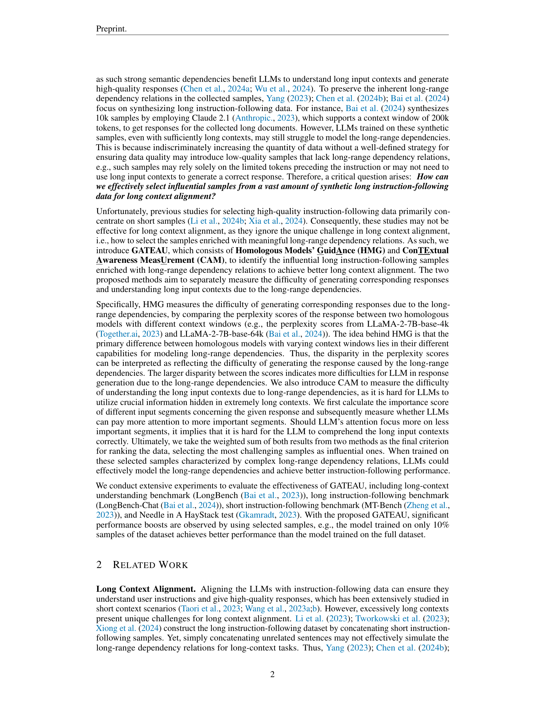
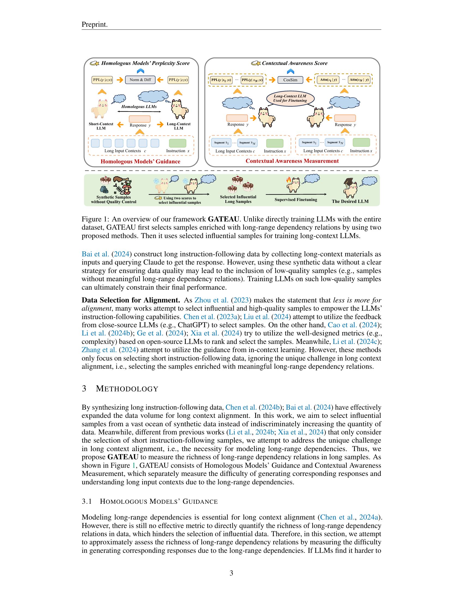

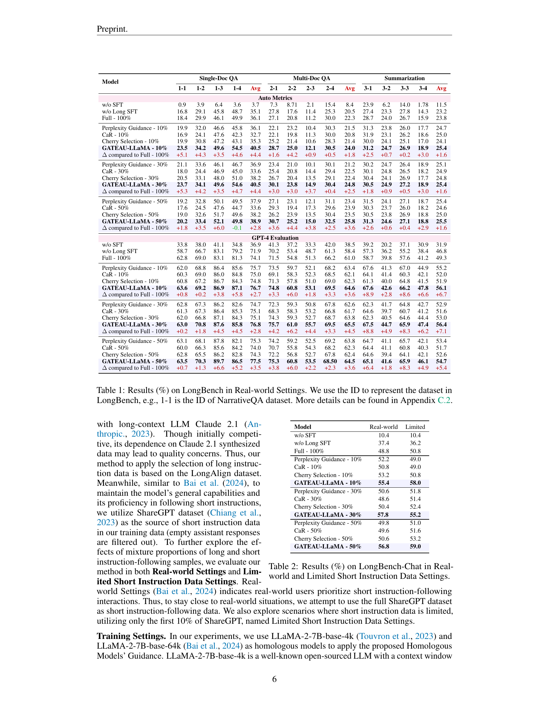

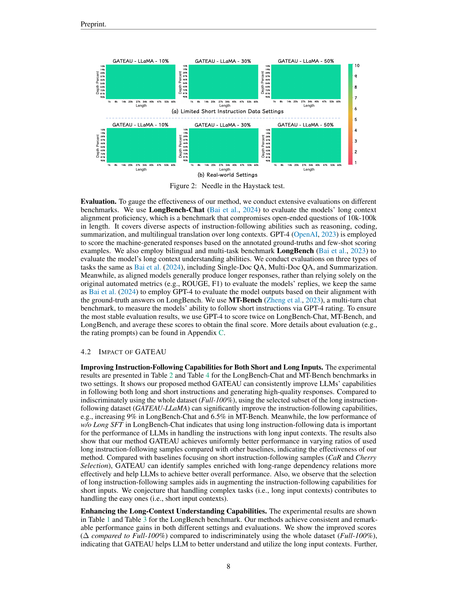

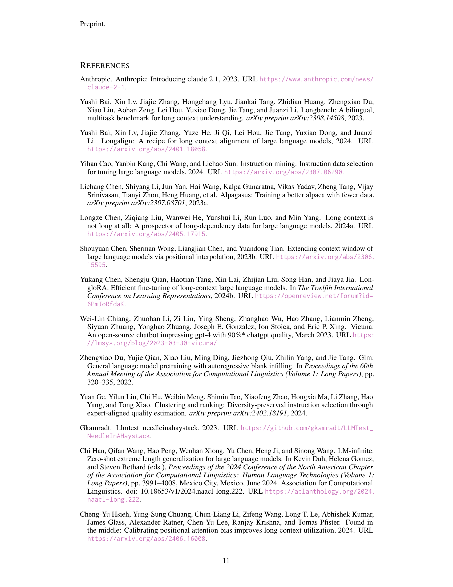
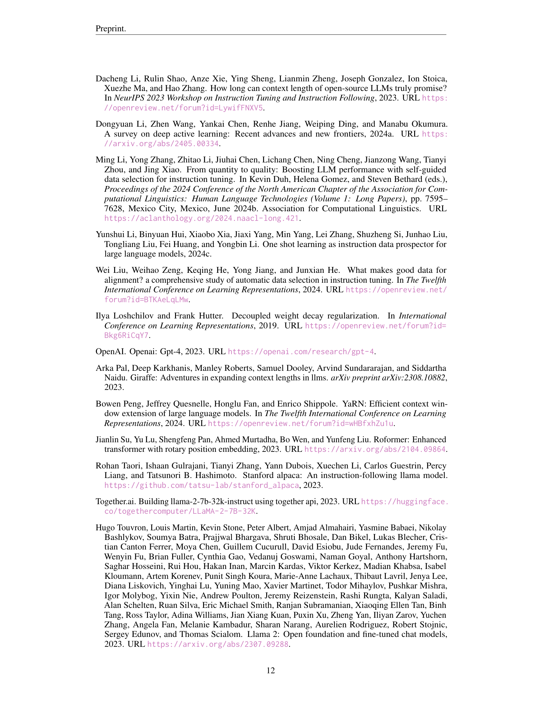

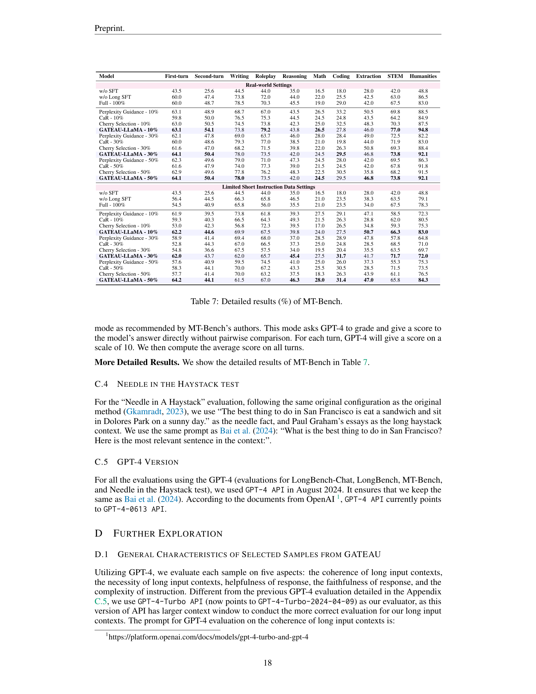
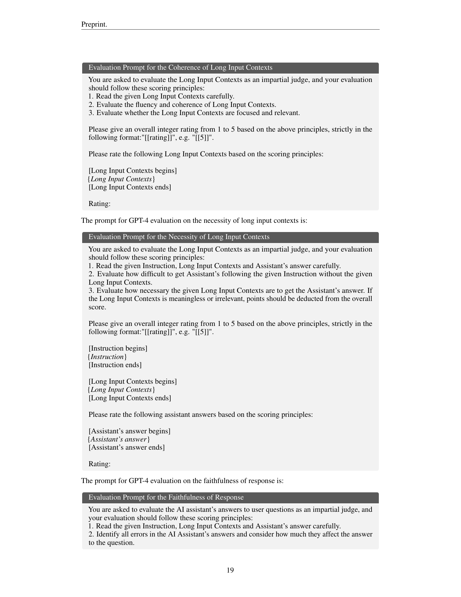
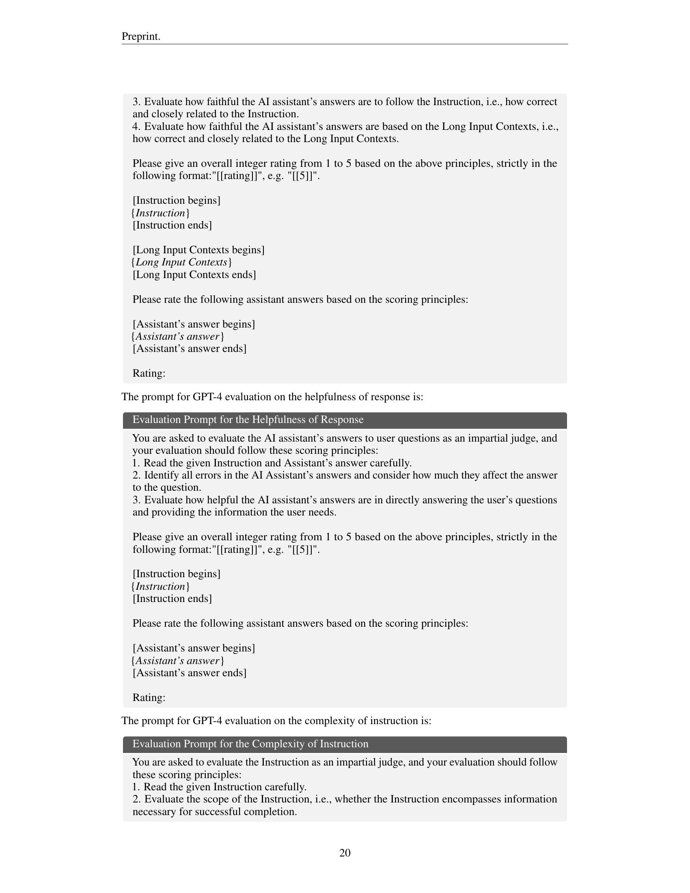
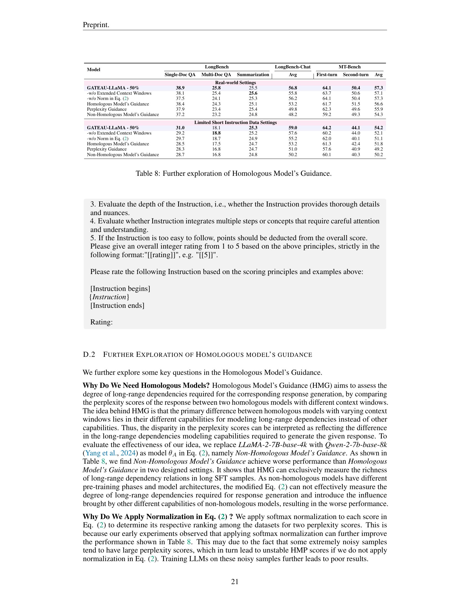
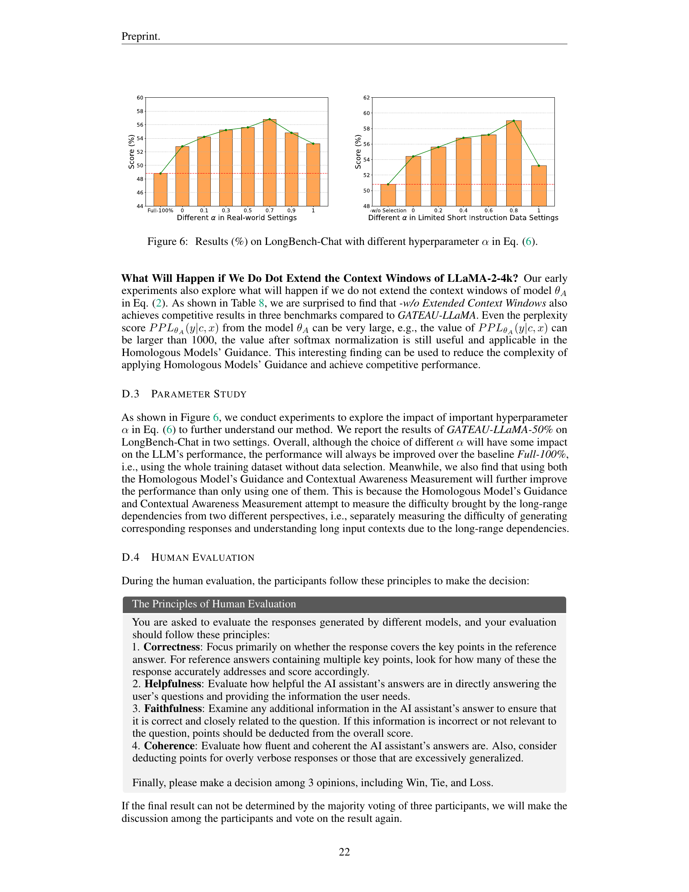
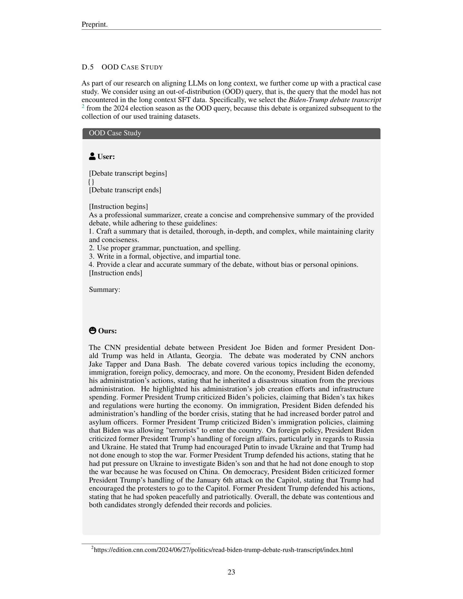
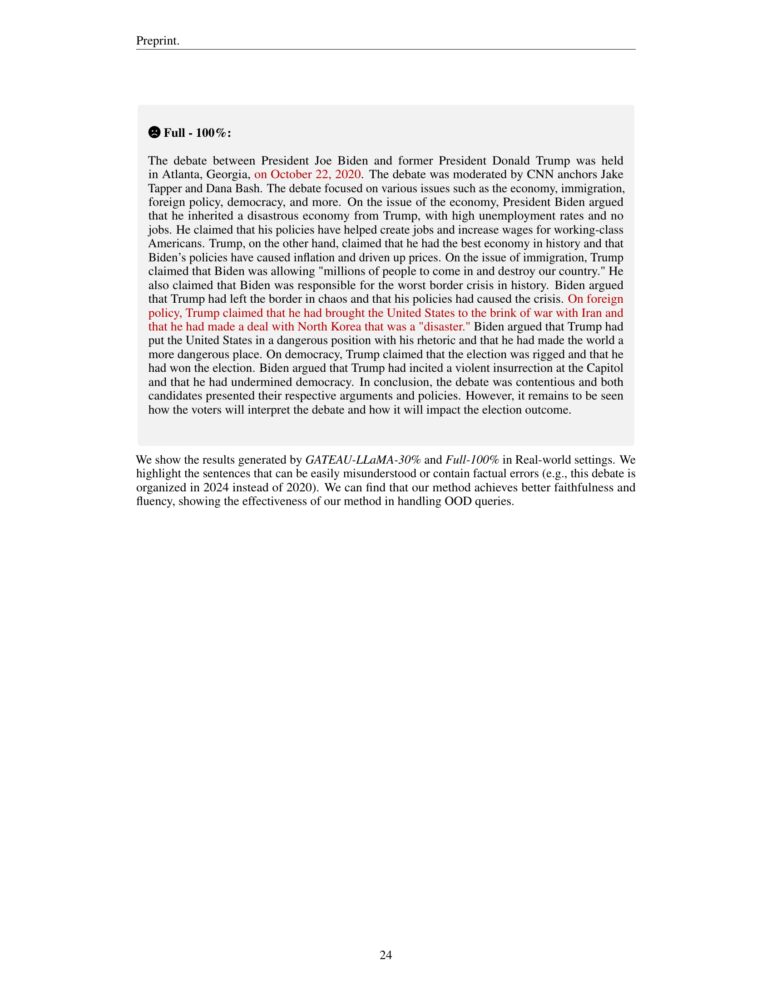
