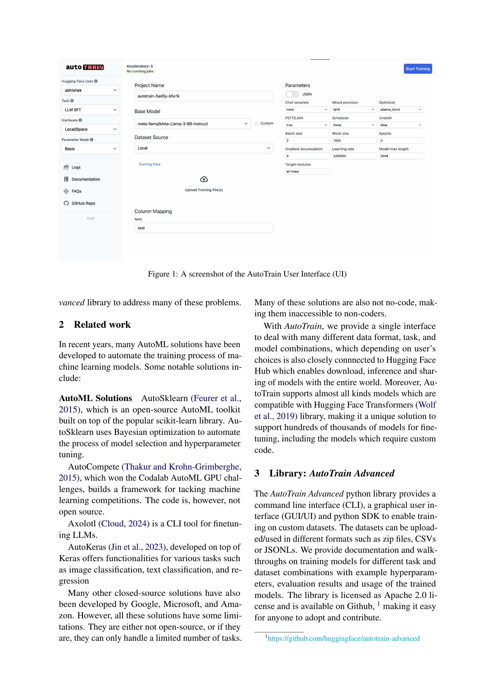

### TL;DR



AutoTrain is a user-friendly, open-source tool designed to democratize the process of training advanced machine learning models.  Researchers and developers can now easily fine-tune models for various tasks (LLM fine-tuning, image classification, text analysis, etc.) on their own datasets without extensive coding knowledge.  The tool handles the complexities of hyperparameter tuning, model validation, and distributed training, offering a streamlined workflow.  Its intuitive interface, support for various data formats, and compatibility with Hugging Face Hub make it accessible to a broad audience. AutoTrain aims to lower the barrier to entry for advanced model training, empowering a wider range of users to leverage the power of cutting-edge AI.




 &nbsp; read the paper on arXiv


#### Why does it matter?
AutoTrain is an open-source, no-code tool for training state-of-the-art models on custom datasets, simplifying the process for researchers and developers.
#### Key Takeaways


 AutoTrain simplifies training state-of-the-art models on custom data without needing coding expertise. 



 It supports various model types and tasks, including LLMs, computer vision, and tabular data. 



 AutoTrain addresses model training challenges like hyperparameter tuning, validation, and distributed training. 


------
#### Visual Insights

")

> The figure shows a screenshot of the AutoTrain user interface, which provides a graphical user interface for configuring and running model training tasks.

### More visual insights

### Full paper



