### TL;DR



Large Vision-Language Models (LVLMs) sometimes 'hallucinate' objects—generating text not present in the image.  This paper finds that this is partly due to a positional encoding method (RoPE) which makes the model less sensitive to visual information further away from the text. To fix this, the researchers developed 'Concentric Causal Attention' (CCA). CCA improves the model's understanding of where visual information is relative to the text prompts, and substantially improves accuracy in various tests.




 &nbsp; read the paper on arXiv


#### Why does it matter?
This JSON summarizes the research paper focusing on mitigating object hallucination in large vision-language models (LVLMs) by addressing the long-term decay in Rotary Position Encoding (RoPE).
#### Key Takeaways


 Object hallucination in LVLMs is linked to RoPE's long-term decay, causing poor visual-instruction alignment. 



 Concentric Causal Attention (CCA) effectively mitigates this decay by reorganizing visual token positions and modifying the causal attention mask. 



 CCA significantly improves object hallucination and overall perception capabilities across various benchmarks. 


------
#### Visual Insights

. (a) a schematic view of inference in LVLMs, typically involving a pre-trained vision encoder, a large language model and a projector to map visual tokens to textual space. For each of V visual tokens Svision, we aggregate its information flow to instruction tokens Sinstruct and reshape the aggregation results to 2-D (√V by √V). Applying RoPE on visual tokens introduces long-term decay as illustrated in (c), referring to the phenomenon where information flowing from visual tokens to instruction tokens gradually decays from lower-right region (rightmost visual tokens in the 1-D sequence) to upper-left region (leftmost visual tokens). For instruction tokens, they have much less direct interaction with leftmost visual tokens as compared with rightmost visual tokens, leading to inferior multimodal alignment in the trained LVLMs. (b) and (c) are derived from the adversarial subset of the 3k POPE [41] image-instruction pairs. Best viewed in color.")

> The figure illustrates the long-term decay of Rotary Position Encoding (RoPE) in Large Vision Language Models (LVLMs), showing how information flow from visual tokens to instruction tokens diminishes with increasing relative distance.

. (a) a schematic view of inference in LVLMs, typically involving a pre-trained vision encoder, a large language model and a projector to map visual tokens to textual space. For each of V visual tokens Svision, we aggregate its information flow to instruction tokens Sinstruct and reshape the aggregation results to 2-D (√V by √V). Applying RoPE on visual tokens introduces long-term decay as illustrated in (c), referring to the phenomenon where information flowing from visual tokens to instruction tokens gradually decays from lower-right region (rightmost visual tokens in the 1-D sequence) to upper-left region (leftmost visual tokens). For instruction tokens, they have much less direct interaction with leftmost visual tokens as compared with rightmost visual tokens, leading to inferior multimodal alignment in the trained LVLMs. (b) and (c) are derived from the adversarial subset of the 3k POPE [41] image-instruction pairs. Best viewed in color.")

> The chart visualizes the long-term decay effect of Rotary Position Encoding (RoPE) in Large Vision Language Models (LVLMs), showing how information flow from visual tokens to instruction tokens diminishes with increasing distance when RoPE is applied.


<table id='1' style='font-size:14px'><tr><td rowspan="2">Evaluation</td><td rowspan="2">Method</td><td colspan="2">random</td><td colspan="2">popular</td><td colspan="2">adversarial</td><td colspan="2">average</td></tr><tr><td>acc</td><td>fl</td><td>acc</td><td>fl</td><td>acc</td><td>fl</td><td>acc</td><td>fl</td></tr><tr><td rowspan="4">MSCOCO 42</td><td>baseline</td><td>83.29</td><td>81.33</td><td>81.88</td><td>80.06</td><td>78.96</td><td>77.57</td><td>81.38</td><td>79.65</td></tr><tr><td>VCD 34</td><td>87.73</td><td>87.16</td><td>85.38</td><td>85.06</td><td>80.88</td><td>81.33</td><td>84.66</td><td>84.52</td></tr><tr><td>LLaVA-RLHF 62</td><td>85.90</td><td>83.92</td><td>83.90</td><td>82.05</td><td>82.60</td><td>80.88</td><td>84.13</td><td>82.28</td></tr><tr><td>CCA-LLaVA</td><td>88.03</td><td>86.65</td><td>86.87</td><td>85.54</td><td>85.67</td><td>84.42</td><td>86.86</td><td>85.54</td></tr><tr><td rowspan="4">A-OKVQA 58</td><td>baseline</td><td>83.45</td><td>82.56</td><td>79.90</td><td>79.59</td><td>74.04</td><td>75.15</td><td>79.13</td><td>79.10</td></tr><tr><td>VCD 34</td><td>86.15</td><td>86.34</td><td>81.85</td><td>82.82</td><td>74.97</td><td>77.73</td><td>80.99</td><td>82.30</td></tr><tr><td>LLaVA-RLHF 62</td><td>87.67</td><td>86.60</td><td>85.20</td><td>84.34</td><td>79.97</td><td>79.92</td><td>84.28</td><td>83.62</td></tr><tr><td>CCA-LLaVA</td><td>90.27</td><td>89.71</td><td>88.40</td><td>87.98</td><td>82.30</td><td>82.74</td><td>86.99</td><td>86.81</td></tr><tr><td rowspan="4">GQA 28</td><td>baseline</td><td>83.73</td><td>82.95</td><td>78.17</td><td>78.37</td><td>75.08</td><td>76.06</td><td>78.99</td><td>79.13</td></tr><tr><td>VCD 34</td><td>86.65</td><td>86.99</td><td>80.73</td><td>82.24</td><td>76.09</td><td>78.78</td><td>81.16</td><td>82.67</td></tr><tr><td>LLaVA-RLHF 62</td><td>84.93</td><td>83.38</td><td>81.37</td><td>80.23</td><td>78.30</td><td>77.70</td><td>81.53</td><td>80.44</td></tr><tr><td>CCA-LLaVA</td><td>88.40</td><td>87.68</td><td>86.47</td><td>85.91</td><td>82.20</td><td>82.37</td><td>85.69</td><td>85.32</td></tr></table>

> Table 1 presents the accuracy and F1 scores achieved by the proposed CCA-LLaVA model and other methods on three different datasets using three negative sampling options for the POPE benchmark.

### More visual insights

More on figures

. (a) a schematic view of inference in LVLMs, typically involving a pre-trained vision encoder, a large language model and a projector to map visual tokens to textual space. For each of V visual tokens Svision, we aggregate its information flow to instruction tokens Sinstruct and reshape the aggregation results to 2-D (√V by √V). Applying RoPE on visual tokens introduces long-term decay as illustrated in (c), referring to the phenomenon where information flowing from visual tokens to instruction tokens gradually decays from lower-right region (rightmost visual tokens in the 1-D sequence) to upper-left region (leftmost visual tokens). For instruction tokens, they have much less direct interaction with leftmost visual tokens as compared with rightmost visual tokens, leading to inferior multimodal alignment in the trained LVLMs. (b) and (c) are derived from the adversarial subset of the 3k POPE [41] image-instruction pairs. Best viewed in color.")

> The figure illustrates the long-term decay effect of Rotary Position Encoding (RoPE) in Large Vision Language Models (LVLMs), showing how information flow from visual to instruction tokens diminishes with distance due to RoPE's long-term decay.

 if object Or is in this template, where Fb refers to a baseline model that follows raster-scan positional alignment strategy and Fr refers to a model that resorts to reversal raster-scan position alignment strategy. The total number of correct responses at different pasting positions {v1, ..., vk} is reported in (a) and (b), which refers to results from model Fb and Fr, respectively. We observe that LVLM Fb are more likely to generate correct responses when pasting object Or to lower region, while Fr are less hallucinated when pasting object Or to upper region. Pasting positions with the most and the least correct responses are highlighted in solid-line and dotted-line red boxes. More details are provided in Appendix C.1. Best viewed in color.")

> The figure shows the aggregated correct responses of two LVLMs with different positional alignment strategies when pasting an object to various positions in a template image, revealing the impact of RoPE long-term decay on object hallucination.

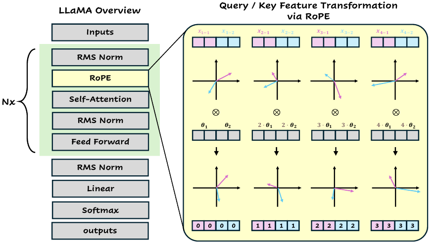

> The figure shows a schematic view of LLaMA architecture with Rotary Position Encoding (RoPE) highlighted, illustrating how RoPE applies rotation matrices to query and key tokens based on their positions.

> The figure illustrates the workflow of synthesizing testing data by cropping an object from an image and pasting it into various positions on a template image.

. (a) a schematic view of inference in LVLMs, typically involving a pre-trained vision encoder, a large language model and a projector to map visual tokens to textual space. For each of V visual tokens Svision, we aggregate its information flow to instruction tokens Sinstruct and reshape the aggregation results to 2-D (√V by √V). Applying RoPE on visual tokens introduces long-term decay as illustrated in (c), referring to the phenomenon where information flowing from visual tokens to instruction tokens gradually decays from lower-right region (rightmost visual tokens in the 1-D sequence) to upper-left region (leftmost visual tokens). For instruction tokens, they have much less direct interaction with leftmost visual tokens as compared with rightmost visual tokens, leading to inferior multimodal alignment in the trained LVLMs. (b) and (c) are derived from the adversarial subset of the 3k POPE [41] image-instruction pairs. Best viewed in color.")

> The figure illustrates the long-term decay of RoPE in LVLMs, showing how information flow from visual to instruction tokens diminishes with distance, impacting multimodal alignment.

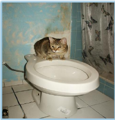

> The figure shows a qualitative comparison of the open-ended text generation results between the baseline LLaVA model and the CCA-LLaVA model, highlighting the reduced hallucinations in the CCA-LLaVA model's output.

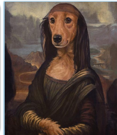

> The figure shows a qualitative comparison of the responses generated by LLaVA and CCA-LLaVA to a question about the intended effect of a painting, illustrating CCA's ability to mitigate hallucinations.

 and numerical prediction in given cases.")

> The figure shows two case studies comparing the performance of LLaVA and CCA-LLaVA on questions about product brand identification and fruit counting, highlighting CCA-LLaVA's improved accuracy.

More on tables


<table id='1' style='font-size:14px'><tr><td rowspan="2">Evaluation</td><td rowspan="2">Method</td><td colspan="4">512</td><td colspan="4">64</td></tr><tr><td>ct</td><td>of</td><td>rec↑</td><td>len</td><td>ct</td><td>of</td><td>rec↑</td><td>len</td></tr><tr><td rowspan="3">greedy</td><td>baseline</td><td>46.2</td><td>12.9</td><td>80.3</td><td>97.2</td><td>21.0</td><td>6.2</td><td>66.3</td><td>54.9</td></tr><tr><td>LLaVA-RLHF 62</td><td>43.6</td><td>10.5</td><td>78.0</td><td>117.9</td><td>19.6</td><td>5.4</td><td>64.9</td><td>54.0</td></tr><tr><td>CCA-LLaVA</td><td>43.0</td><td>11.5</td><td>80.4</td><td>96.6</td><td>18.2</td><td>5.4</td><td>66.7</td><td>54.5</td></tr><tr><td rowspan="4">beam (5)</td><td>baseline</td><td>49.4</td><td>13.9</td><td>79.9</td><td>96.1</td><td>18.2</td><td>5.8</td><td>64.0</td><td>52.7</td></tr><tr><td>OPERA 26</td><td>46.8</td><td>13.4</td><td>79.6</td><td>93.2</td><td>17.8</td><td>5.9</td><td>64.3</td><td>53.0</td></tr><tr><td>CCA-LLaVA</td><td>48.6</td><td>13.4</td><td>79.9</td><td>94.2</td><td>16.0</td><td>5.3</td><td>64.8</td><td>52.7</td></tr><tr><td>CCA-LLaVA + OPERA 26</td><td>45.0</td><td>12.3</td><td>79.5</td><td>91.8</td><td>16.2</td><td>5.0</td><td>65.0</td><td>52.9</td></tr></table>

> Table 2 presents CHAIR evaluation results, showing the performance of different models in generating image captions with varying lengths (long-text and short-text).


<table id='5' style='font-size:14px'><tr><td rowspan="2">Model</td><td colspan="2">Object-level</td><td colspan="2">Attribute-level</td><td rowspan="2">Total</td><td>Model</td><td>Complex</td><td>Detail</td><td>Conv</td><td>Overall</td></tr><tr><td>existence</td><td>count</td><td>position</td><td>color</td><td>baseline</td><td>65.8</td><td>51.2</td><td>54.6</td><td>58.9</td></tr><tr><td>baseline</td><td>175.67</td><td>124.67</td><td>114.00</td><td>151.00</td><td>565.33</td><td>OPERA 26</td><td></td><td></td><td></td><td></td></tr><tr><td>OPERA 26</td><td>180.67</td><td>133.33</td><td>123.33</td><td>155.00</td><td>592.33</td><td></td><td>66.4</td><td>56.9</td><td>44.0</td><td>61.3</td></tr><tr><td>VCD 34</td><td>184.66</td><td>138.33</td><td>128.67</td><td>153.00</td><td>604.66</td><td>VCD 34</td><td>69.6</td><td>51.8</td><td>57.3</td><td>61.6</td></tr><tr><td>CCA-LLaVA</td><td>190.00</td><td>148.33</td><td>128.33</td><td>175.00</td><td>641.66</td><td>CCA-LLaVA</td><td>66.1</td><td>53.9</td><td>69.4</td><td>64.3</td></tr></table>

> The table presents the accuracy and F1 scores of different models on the POPE benchmark for object hallucination mitigation, comparing the proposed CCA-LLaVA model with baselines and state-of-the-art methods across three datasets and three negative sampling strategies.


<table id='1' style='font-size:14px'><tr><td>[1]</td><td>Josh Achiam, Steven Adler, Sandhini Agarwal, Lama Ahmad, Ilge Akkaya, Florencia Leoni Aleman, Diogo Almeida, Janko Altenschmidt, Sam Altman, Shyamal Anadkat, et al. Gpt-4 technical report. arXiv preprint arXiv:2303.08774, 2023.</td></tr><tr><td>[2]</td><td>Jean-Baptiste Alayrac, Jeff Donahue, Pauline Luc, Antoine Miech, Iain Barr, Yana Hasson, Karel Lenc, Arthur Mensch, Katherine Millican, Malcolm Reynolds, et al. Flamingo: a visual language model for few-shot learning. Advances in Neural Information Processing Systems, 35:23716-23736, 2022.</td></tr><tr><td>[3]</td><td>Wenbin An, Feng Tian, Sicong Leng, Jiahao Nie, Haonan Lin, QianYing Wang, Guang Dai, Ping Chen, and Shijian Lu. Agla: Mitigating object hallucinations in large vision-language models with assembly of global and local attention. arXiv preprint arXiv:2406.12718, 2024.</td></tr><tr><td>[4]</td><td>Anas Awadalla, Irena Gao, Josh Gardner, Jack Hessel, Yusuf Hanafy, Wanrong Zhu, Kalyani Marathe, Yonatan Bitton, Samir Gadre, Shiori Sagawa, et al. Openflamingo: An open-source framework for training large autoregressive vision-language models. arXiv preprint arXiv:2308.01390, 2023.</td></tr><tr><td>[5]</td><td>Jinze Bai, Shuai Bai, Shusheng Yang, Shijie Wang, Sinan Tan, Peng Wang, Junyang Lin, Chang Zhou, and Jingren Zhou. Qwen-vl: A versatile vision-language model for understanding, localization, text reading, and beyond. arXiv preprint arXiv:2402.16050, 2023.</td></tr><tr><td>[6]</td><td>Junbum Cha, Wooyoung Kang, Jonghwan Mun, and Byungseok Roh. Honeybee: Locality-enhanced projector for multimodal llm. arXiv preprint arXiv:2312.06742, 2023.</td></tr><tr><td>[7]</td><td>Keqin Chen, Zhao Zhang, Weili Zeng, Richong Zhang, Feng Zhu, and Rui Zhao. Shikra: Unleashing multimodal llm's referential dialogue magic. arXiv preprint arXiv:2306.15195, 2023.</td></tr><tr><td>[8]</td><td>Lin Chen, Jinsong Li, Xiaoyi Dong, Pan Zhang, Yuhang Zang, Zehui Chen, Haodong Duan, Jiaqi Wang, Yu Qiao, Dahua Lin, et al. Are we on the right way for evaluating large vision-language models? arXiv preprint arXiv:2403.20330, 2024.</td></tr><tr><td>[9]</td><td>Wei-Ge Chen, Irina Spiridonova, Jianwei Yang, Jianfeng Gao, and Chunyuan Li. Llava-interactive: An all-in-one demo for image chat, segmentation, generation and editing. arXiv preprint arXiv:2311.00571, 2023.</td></tr><tr><td>[10]</td><td>Zhaorun Chen, Zhuokai Zhao, Hongyin Luo, Huaxiu Yao, Bo Li, and Jiawei Zhou. Halc: Object hallucination reduction via adaptive focal-contrast decoding. arXiv preprint arXiv:2403.00425, 2024.</td></tr><tr><td>[11]</td><td>Wei-Lin Chiang, Zhuohan Li, Zi Lin, Ying Sheng, Zhanghao Wu, Hao Zhang, Lianmin Zheng, Siyuan Zhuang, Yonghao Zhuang, Joseph E Gonzalez, et al. Vicuna: An open-source chatbot impressing gpt-4 with 90%* chatgpt quality. See https://vicuna. lmsys. org (accessed 14 April 2023), 2023.</td></tr><tr><td>[12]</td><td>Wei-Lin Chiang, Zhuohan Li, Zi Lin, Ying Sheng, Zhanghao Wu, Hao Zhang, Lianmin Zheng, Siyuan Zhuang, Yonghao Zhuang, Joseph E. Gonzalez, Ion Stoica, and Eric P. Xing. Vicuna: An open-source chatbot impressing gpt-4 with 90%* chatgpt quality, March 2023.</td></tr><tr><td>[13]</td><td>Xiangxiang Chu, Jianlin Su, Bo Zhang, and Chunhua Shen. Visionllama: A unified llama interface for vision tasks. arXiv preprint arXiv:2403.00522, 2024.</td></tr><tr><td>[14]</td><td>Chenhang Cui, Yiyang Zhou, Xinyu Yang, Shirley Wu, Linjun Zhang, James Zou, and Huaxiu Yao. Holistic analysis of hallucination in gpt-4v (ision): Bias and interference challenges. arXiv preprint arXiv:2311.03287, 2023.</td></tr><tr><td>[15]</td><td>Wenliang Dai, Junnan Li, Dongxu Li, Anthony Meng Huat Tiong, Junqi Zhao, Weisheng Wang, Boyang Li, Pascale N Fung, and Steven Hoi. Instructblip: Towards general-purpose vision-language models with instruction tuning. Advances in Neural Information Processing Systems, 36, 2024.</td></tr><tr><td>[16]</td><td>Jia Deng, Wei Dong, Richard Socher, Li-Jia Li, Kai Li, and Li Fei-Fei. Imagenet: A large-scale hierarchical image database. In 2009 IEEE conference on computer vision and pattern recognition, pages 248-255. Ieee, 2009.</td></tr><tr><td>[17]</td><td>Jacob Devlin, Ming- Wei Chang, Kenton Lee, and Kristina Toutanova. Bert: Pre-training of deep bidirec- tional transformers for language understanding. arXiv preprint arXiv:1810.04805, 2018.</td></tr><tr><td>[18]</td><td>Alexey Dosovitskiy, Lucas Beyer, Alexander Kolesnikov, Dirk Weissenborn, Xiaohua Zhai, Thomas Unterthiner, Mostafa Dehghani, Matthias Minderer, Georg Heigold, Sylvain Gelly, et al. An image is worth 16x16 words: Transformers for image recognition at scale. arXiv preprint arXiv:2010.11929, 2020.</td></tr></table>

> Table 1 presents the accuracy and F1 scores of different models on the POPE benchmark for object hallucination mitigation, comparing the proposed CCA method with baselines and existing state-of-the-art methods.


<table id='2' style='font-size:14px'><tr><td>Method</td><td>SEED A 36</td><td>SEED I 36</td><td>SEED V 36</td><td>SQA 49</td><td>GQA 28</td><td>VizWiz 22</td><td>MMBench 48</td><td>MMStar 8</td><td>TextVQA 60</td></tr><tr><td>LLaVA 45</td><td>58.6</td><td>66.1</td><td>37.3</td><td>66.8</td><td>62.0</td><td>50.0</td><td>64.3</td><td>30.0</td><td>58.2</td></tr><tr><td>LLaVA w/ VCD 34</td><td>58.3</td><td>63.7</td><td>37.6</td><td>68.5</td><td>61.9</td><td>50.5</td><td>-</td><td>34.6</td><td>54.4</td></tr><tr><td>Seva-7b-dif 85</td><td>-</td><td>65.8</td><td>-</td><td>67.5</td><td>60.7</td><td>-</td><td>65.6</td><td>-</td><td>-</td></tr><tr><td>Seva-7b-moco 85</td><td>-</td><td>65.5</td><td>-</td><td>67.1</td><td>60.9</td><td>-</td><td>65.2</td><td>-</td><td>-</td></tr><tr><td>CCA-LLaVA (ours)</td><td>61.7</td><td>67.1</td><td>41.0</td><td>69.8</td><td>63.1</td><td>57.6</td><td>65.4</td><td>33.2</td><td>57.8</td></tr></table>

> Table 1 presents the accuracy and F1 scores achieved by different models on the POPE benchmark for object hallucination mitigation, comparing the proposed CCA-LLaVA model against baseline and state-of-the-art methods across various datasets and negative sampling strategies.

### Full paper



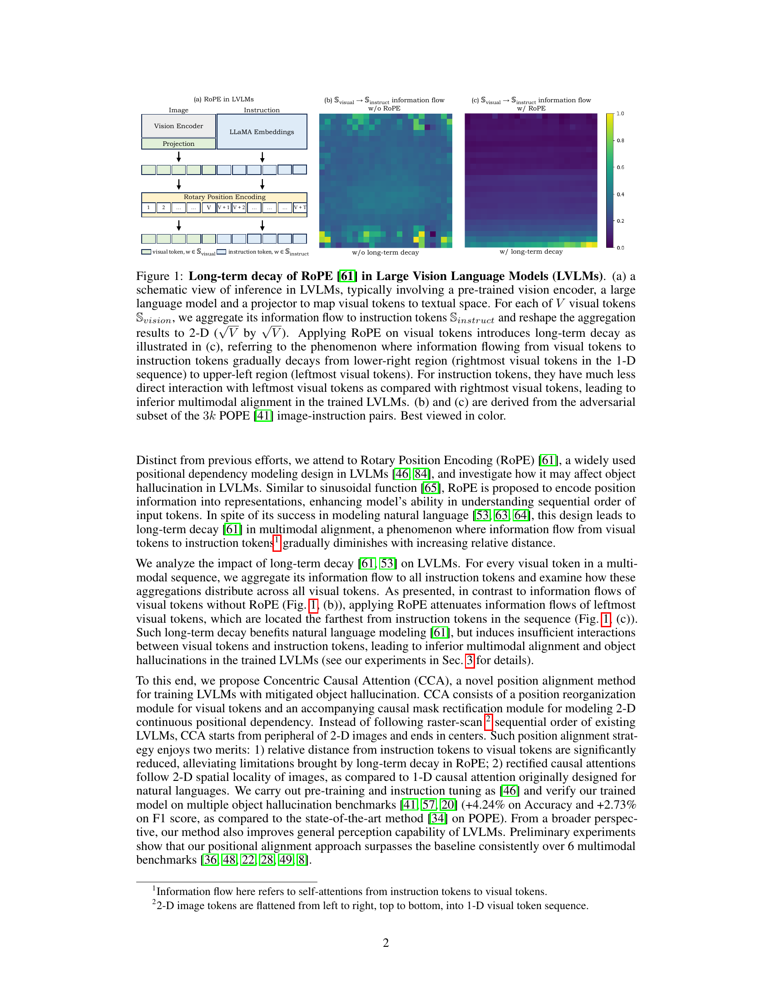

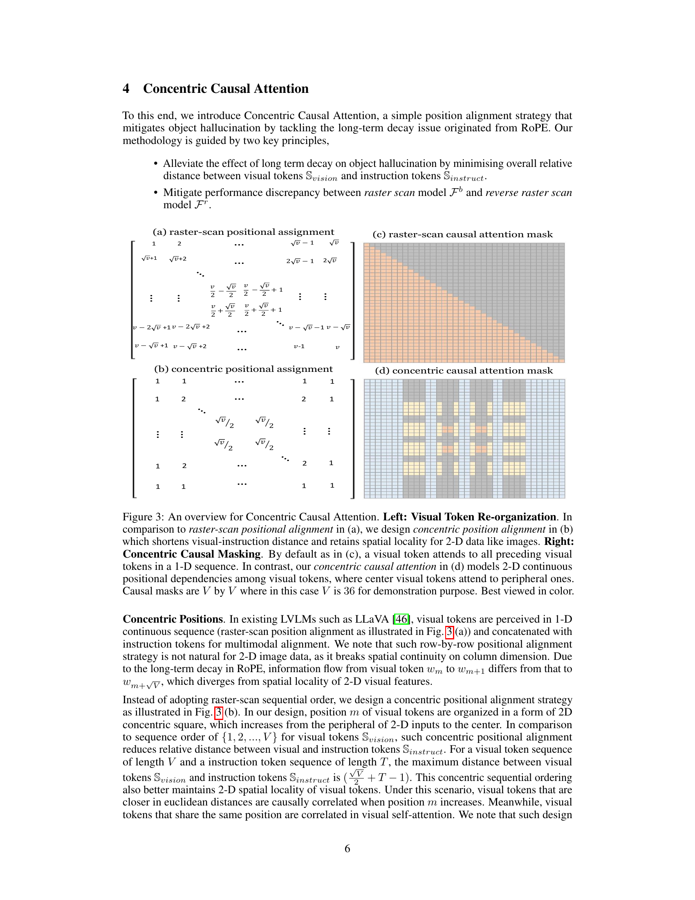

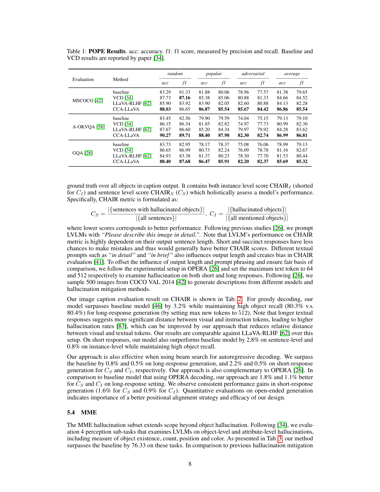
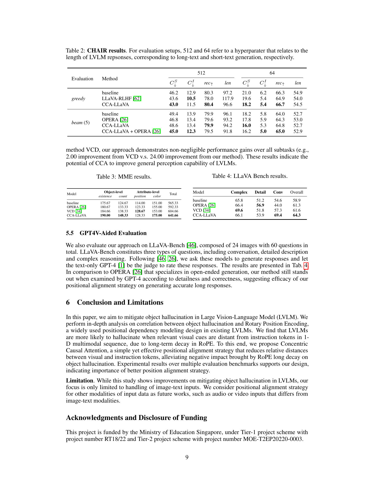

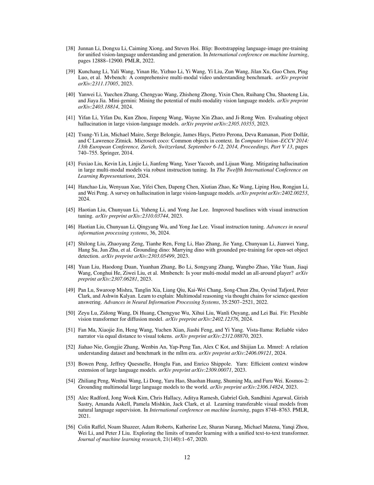
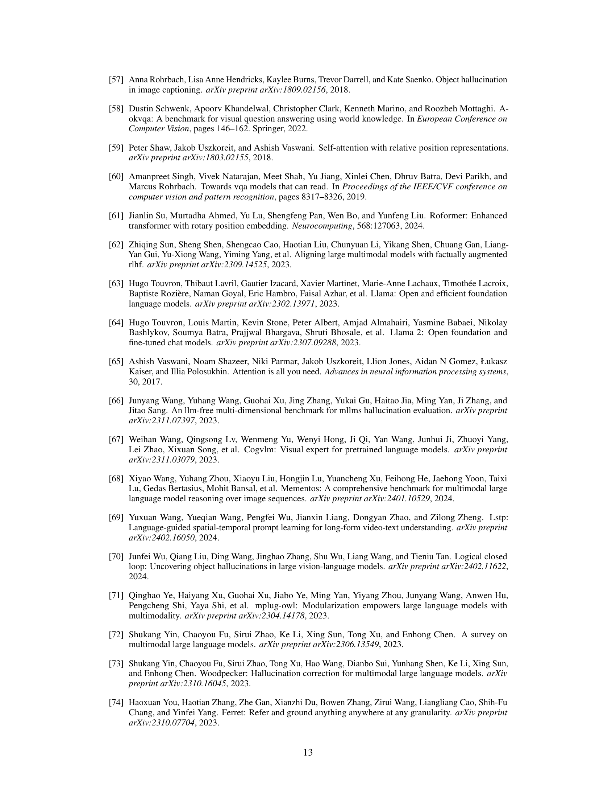

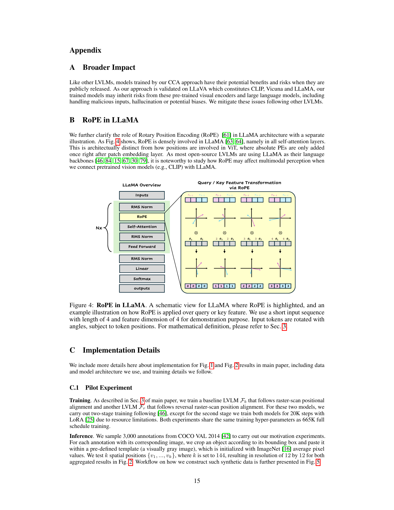
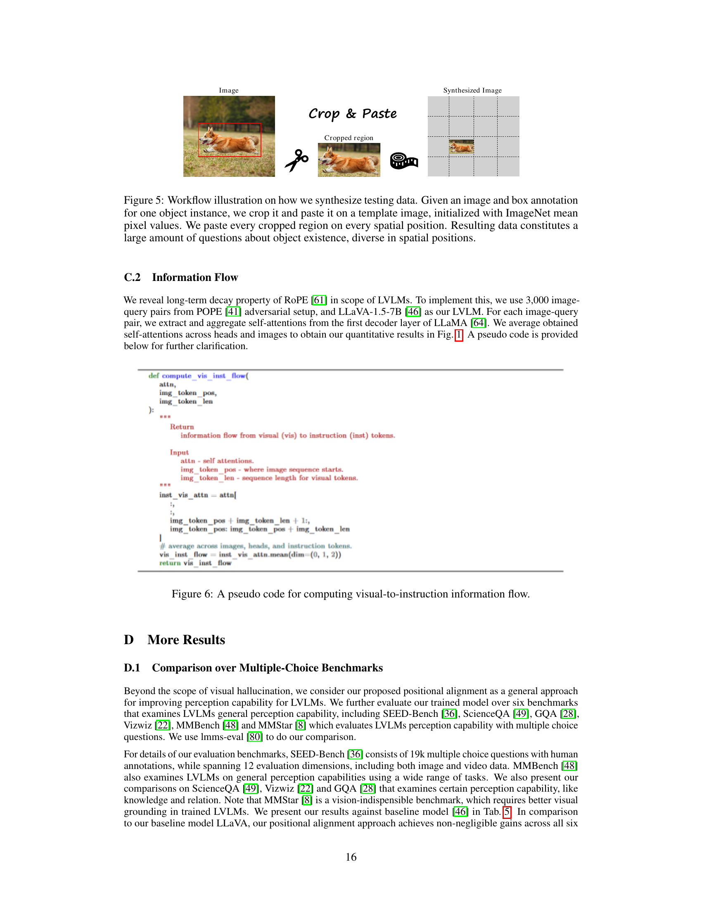

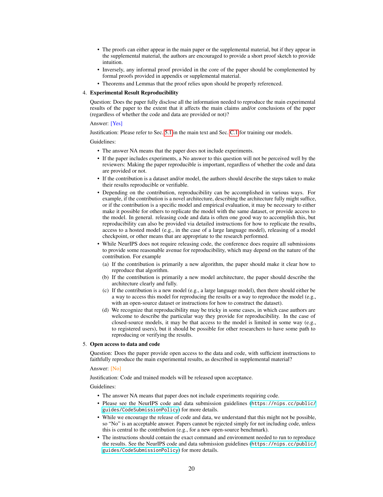
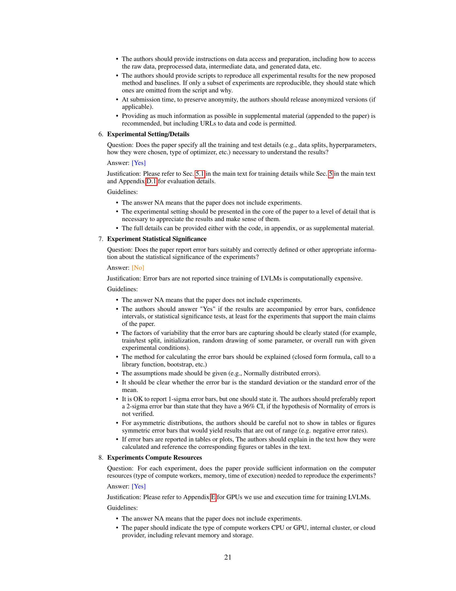
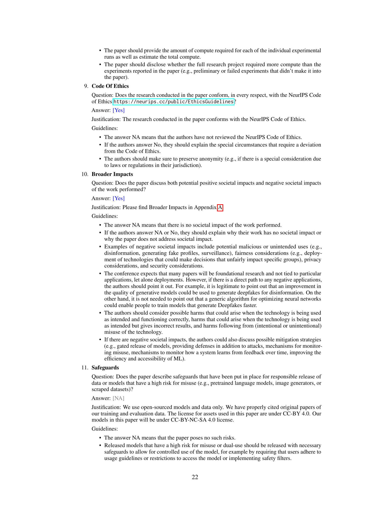

