### TL;DR



Large language models (LLMs) sometimes struggle with knowledge conflicts, where their internal knowledge contradicts information in the given context.  This paper introduces SPARE, a novel method that addresses this issue without requiring any retraining of the LLM. SPARE leverages sparse autoencoders (SAEs) to identify and modify internal LLM activations that influence knowledge selection. SAEs decompose complex LLM activations into simpler, more interpretable features. By carefully manipulating these features, SPARE can guide the LLM to prioritize either the contextual information or its internal knowledge, effectively resolving conflicts. Experiments on question-answering tasks show that SPARE significantly outperforms existing methods in accuracy, demonstrating the effectiveness of this approach in resolving knowledge conflicts and enhancing LLM performance.  The method is highly efficient, operating at inference time without the need for model retraining. This makes SPARE a practical solution for improving LLM performance in real-world applications where knowledge conflicts are common.




 &nbsp; read the paper on arXiv


#### Why does it matter?
To summarize the research paper on steering knowledge selection behaviours in LLMs using SAE-based representation engineering.
#### Key Takeaways


 SPARE effectively steers LLM knowledge selection between contextual and parametric knowledge using sparse autoencoders. 



 The method surpasses existing representation engineering and contrastive decoding methods in accuracy. 



 SPARE operates at inference time, making it efficient for practical applications. 


------
#### Visual Insights

> The figure shows two examples of how SPARE steers Llama2-7B to use either context or memory when there is a knowledge conflict.

. The probing results on hidden states, MLP and Self-Attention activations are coloured differently.")

> The chart displays the AUROC scores achieved when probing different layers of Llama2-7B and Gemma2-9B models to detect knowledge conflicts.


<table id='0' style='font-size:14px'><tr><td rowspan="2">Metric</td><td rowspan="2">Method</td><td colspan="3">NQSwap (Longpre et al., 2021)</td><td colspan="3">Macnoise (Hong et al., 2024)</td></tr><tr><td>Llama3-8B</td><td>Llama2-7B</td><td>Gemma-2-9B</td><td>Llama3-8B</td><td>Llama2-7B</td><td>Gemma-2-9B</td></tr><tr><td colspan="8">Steer to Use Parametric Knowledge</td></tr><tr><td></td><td>Without Controlling</td><td>26.63±6.02</td><td>22.23±4.75</td><td>26.32±1.80</td><td>18.96±2.65</td><td>22.37±1.89</td><td>17.06±3.79</td></tr><tr><td rowspan="8">EMM</td><td>TaskVec (Hendel et al., 2023)</td><td>24.16±6.58</td><td>24.88±0.85</td><td>29.85±0.83</td><td>21.23±1.89</td><td>22.93±2.31</td><td>28.92±1.19</td></tr><tr><td>ActAdd (Turner et al., 2023a)</td><td>37.87 ±8.96</td><td>31.43±3.68</td><td>27.67 ±0.82</td><td>26.17 ±0.22</td><td>27.52±3.07</td><td>29.75±1.68</td></tr><tr><td>SEAlinear (Qiu et al., 2024)</td><td>21.03±1.83</td><td>23.73±0.86</td><td>24.43±0.91</td><td>12.84±0.18</td><td>15.64±0.24</td><td>28.10±2.78</td></tr><tr><td>SEAsqExp (Qiu et al., 2024)</td><td>13.64±1.62</td><td>16.66±0.55</td><td>23.79±1.38</td><td>14.24±1.45</td><td>16.24±1.06</td><td>28.07±1.30</td></tr><tr><td>DoLa (Chuang et al., 2024)</td><td>25.53±5.19</td><td>16.50±3.91</td><td>20.58±1.06</td><td>16.52±2.65</td><td>15.66±0.88</td><td>19.81±2.58</td></tr><tr><td>♭CAD (Shi et al., 2024)</td><td>33.72±0.84</td><td>31.23±1.45</td><td>41.17 ±0.59</td><td>28.58±0.75</td><td>30.81±0.94</td><td>33.15 ±2.87</td></tr><tr><td>#ICL (Brown, 2020)</td><td>43.73 士1.55</td><td>31.67. 士5.49</td><td>43.10 士3.63</td><td>29.54+4.16</td><td>31.23 ±0.94</td><td>21.91±2.35</td></tr><tr><td>SPARE (Ours)</td><td>47.51±1.30</td><td>43.76±3.14</td><td>44.11±1.30</td><td>30.72±1.42</td><td>35.43±1.10</td><td>35.53±2.07</td></tr><tr><td colspan="8">Steer to Use Contextual Knowledge</td></tr><tr><td></td><td>Without Controlling</td><td>42.69±8.40</td><td>41.67 士4.66</td><td>45.96±2.48</td><td>69.36±3.57</td><td>62.38±3.05</td><td>59.25±2.82</td></tr><tr><td rowspan="8">EMC</td><td>TaskVec (Hendel et al., 2023)</td><td>41.88±9.45</td><td>38.25±1.23</td><td>45.52±1.06</td><td>88.47±1.93</td><td>86.91±0.44</td><td>59.25±1.49</td></tr><tr><td>ActAdd (Turner et al., 2023a)</td><td>51.91±8.03</td><td>47.48±3.93</td><td>46.90±1.89</td><td>73.01±1.58</td><td>69.64±0.20</td><td>59.66±2.89</td></tr><tr><td>SEAlinear (Qiu et al., 2024)</td><td>43.61±10.3</td><td>47.73±0.43</td><td>52.95±1.90</td><td>69.78±0.97</td><td>67.32±0.28</td><td>60.31±2.25</td></tr><tr><td>SEAsqExp (Qiu et al., 2024)</td><td>57.08±2.92</td><td>48.04±0.45</td><td>61.45±0.54</td><td>72.04±1.60</td><td>68.20±1.10</td><td>61.45±0.30</td></tr><tr><td>DoLa (Chuang et al., 2024)</td><td>44.29±8.46</td><td>33.54±3.38</td><td>15.90±10.1</td><td>68.45±3.83</td><td>50.95±5.15</td><td>23.34±10.5</td></tr><tr><td>♭CAD (Shi et al., 2024)</td><td>65.65±5.50</td><td>54.69±3.25</td><td>63.10±2.32</td><td>78.69±3.85</td><td>70.07±3.77</td><td>64.12+4.44</td></tr><tr><td>#ICL (Brown, 2020)</td><td>73.35 ±3.82</td><td>63.33 ±3.50</td><td>70.19 ±2.51</td><td>51.75±5.60</td><td>47.51±1.86</td><td>47.24±3.81</td></tr><tr><td>SPARE (Ours)</td><td>77.69 ±1.24</td><td>69.32±1.26</td><td>73.78±0.74</td><td>92.24±0.49</td><td>87.30±1.96</td><td>87.96±1.85</td></tr></table>

> Table 1 presents the overall performance comparison of different methods in steering the usage of parametric and contextual knowledge in LLMs for two datasets, measured by exact match accuracy.

### More visual insights

More on charts

 presents the capability of changing the behaviour of LLMs, where x-axis and y-axis are EMC→M and EMM→C, measuring the capability of changing the answer from C to M and from M to C, respectively; (b) presents the capability of maintaining the behaviour when steering to the same behaviour as the original behaviour, where x-axis and y-axis are EMM→M and EMC→C, measuring the maintaining capability of generating M and C, respectively; (c) present the ablation analysis of SPARE, x-axis and y-axis are EMM and EMC.")

> The chart displays a multi-faceted evaluation of SPARE and other methods' abilities to control LLM behavior in knowledge conflict scenarios, assessing their capability to change and maintain knowledge selection behaviours.

> The chart displays the performance of the SPARE model on the Llama3-8B and Gemma2-9B models when editing different layers individually, showing the effectiveness of controlling knowledge selection behaviour at different layers.

 presents the capability of changing the behaviour of LLMs, where x-axis and y-axis are EMC→M and EMM→C, measuring the capability of changing the answer from C to M and from M to C, respectively; (b) presents the capability of maintaining the behaviour when steering to the same behaviour as the original behaviour, where x-axis and y-axis are EMM→M and EMC→C, measuring the maintaining capability of generating M and C, respectively; (c) present the ablation analysis of SPARE, x-axis and y-axis are EMM and EMC.")

> Figure 4 shows the detailed evaluation results of SPARE and baselines on the capability of changing and maintaining knowledge selection behaviors in LLMs under knowledge conflicts.

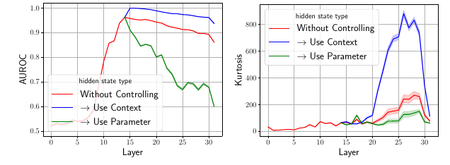

> The chart displays the AUROC and kurtosis of the residual stream in Llama3-8B model for different knowledge selection behaviors with and without SPARE applied at the 15th layer.

. The probing results on hidden states, MLP and Self-Attention activations are coloured differently.")

> The chart displays the AUROC scores for detecting knowledge conflicts in different layers of Llama2-7B and Gemma2-9B models across various activation types.

. The probing results on hidden states, MLP and Self-Attention activations are coloured differently.")

> The chart displays the AUROC (Area Under the Receiver Operating Characteristic Curve) achieved by a linear probing method to detect knowledge conflicts in LLMs across different layers and activation types.

. The probing results on hidden states, MLP and Self-Attention activations are coloured differently.")

> The chart displays the AUROC of probing results on Llama2-7B and Gemma2-9B for detecting knowledge conflict across different layers and activation types.

. The probing results on hidden states, MLP and Self-Attention activations are coloured differently.")

> The chart displays the knowledge conflict probing results for Llama2-7B and Gemma2-9B models across different activation types (hidden states, MLP, and attention) and layers, showing varying accuracy in detecting knowledge conflicts.

. The probing results on hidden states, MLP and Self-Attention activations are coloured differently.")

> The chart displays the AUROC scores for detecting knowledge conflicts in Llama2-7B and Gemma2-9B across different layers and activation types.

. The probing results on hidden states, MLP and Self-Attention activations are coloured differently.")

> The chart displays the Area Under the ROC Curve (AUROC) for detecting knowledge conflicts in different layers of Llama2-7B and Gemma2-9B models, using various activation types.

> The chart displays the impact of the number of collected hidden states on the performance of controlling the usage of either parametric or contextual knowledge in LLMs.

 on Gemma2-9B")

> The chart shows the proportion of accumulated mutual information for different numbers of selected activations in three layers (23, 24, and 25) of the Gemma2-9B model.

 on Gemma2-9B")

> The chart displays the proportion of accumulated mutual information (K) against the number of selected activations (k) for different layers (23, 24, and 25) in the Gemma2-9B model.

 on Gemma2-9B")

> The chart displays the relationship between the proportion of accumulated mutual information and the number of selected activations for different layers in the Gemma2-9B model.

. The probing results on hidden states, MLP and Self-Attention activations are coloured differently.")

> The chart displays the results of probing experiments to detect knowledge conflicts in LLMs, showing that the signal of conflict is strongest in the middle layers across different activation types.

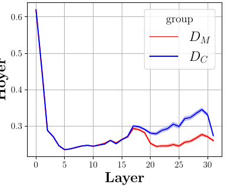

> The chart displays the skewness of hidden states for Llama2-7B model on the NQSwap dataset, differentiating between instances where the model uses parametric knowledge (DM) versus contextual knowledge (DC).

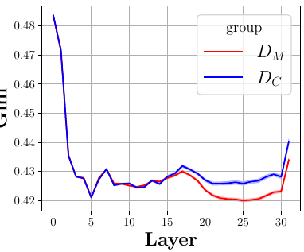

> The chart displays the L1 and L2 norms of hidden states for Llama2-7B on the NQSwap dataset, differentiating between instances where the model uses parametric knowledge (DM) and contextual knowledge (DC).

. The probing results on hidden states, MLP and Self-Attention activations are coloured differently.")

> The chart displays the results of probing experiments to detect knowledge conflicts in Llama2-7B and Gemma2-9B models across different activation types and layers.

> The chart displays the skewness of hidden states across different layers for Llama2-7B model on NQSwap dataset, categorized by whether the model used parametric knowledge (DM) or contextual knowledge (DC) to generate the answers.

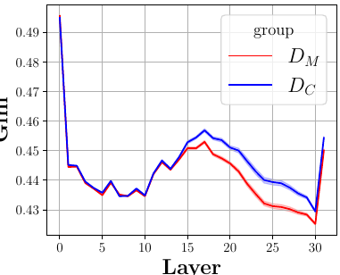

> The chart displays the skewness of the hidden states for Llama2-7B model on the NQSwap dataset, differentiating between instances where the model uses parametric knowledge (DM) versus contextual knowledge (DC).

. The probing results on hidden states, MLP and Self-Attention activations are coloured differently.")

> The chart displays the results of probing experiments to detect knowledge conflicts in LLMs, showing the Area Under the ROC Curve (AUROC) for different layers and activation types.

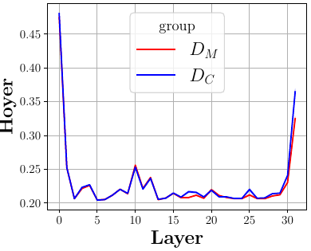

> The chart displays the skewness of hidden states in Llama2-7B across layers, differentiating between those selecting parametric knowledge (DM) and contextual knowledge (DC).

> The chart displays the L1 and L2 norm values of the hidden states of Llama2-7B model on the NQSwap dataset, categorized by whether the model uses parametric (DM) or contextual (DC) knowledge.

. The probing results on hidden states, MLP and Self-Attention activations are coloured differently.")

> The chart displays the AUROC scores for detecting knowledge conflicts in Llama2-7B and Gemma2-9B across different layers and activation types.

> The chart displays the skewness of the hidden states of Llama2-7B across different layers when generating answers based on either parametric knowledge (DM) or contextual knowledge (DC) in the NQSwap dataset.

> The chart displays the changes in the residual stream's probing results and skewness patterns after applying the SPARE method to the Llama3-8B model at the 15th layer, illustrating the impact of SPARE on knowledge selection.

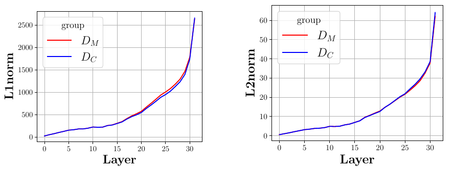

> The chart displays the L1 and L2 norms of hidden states for Llama2-7B model on the NQSwap dataset, categorized by whether the model used parametric or contextual knowledge.

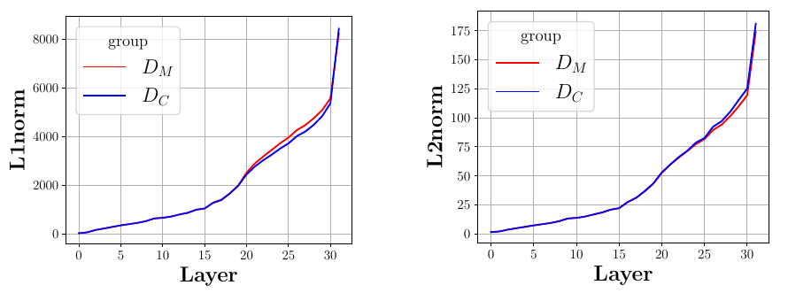

> The chart displays the L1 and L2 norms of the hidden states of the Llama2-7B model on the NQSwap dataset, comparing the use of parametric versus contextual knowledge.

### Full paper



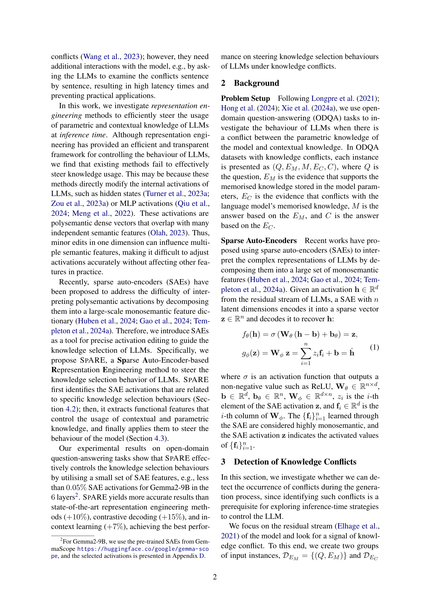

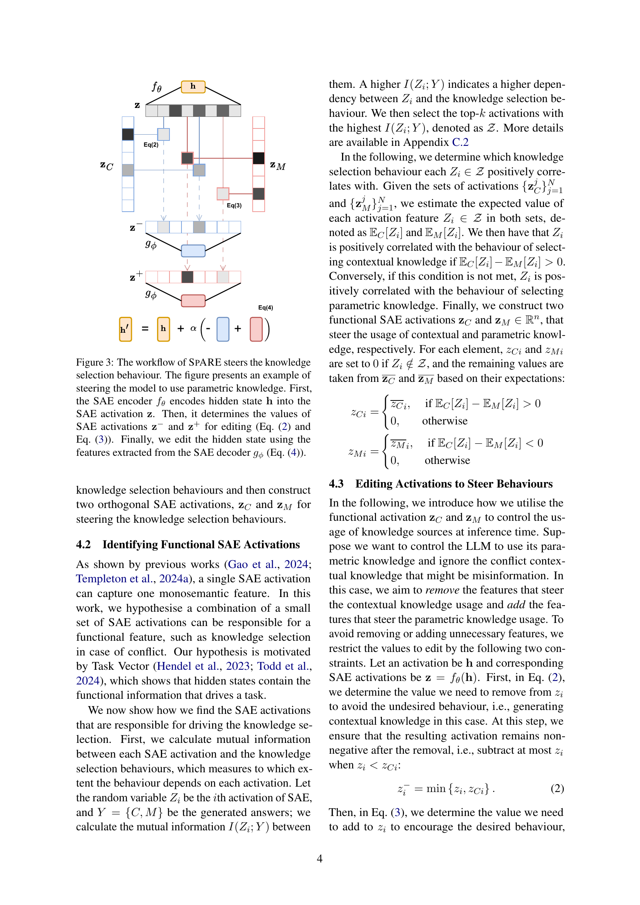

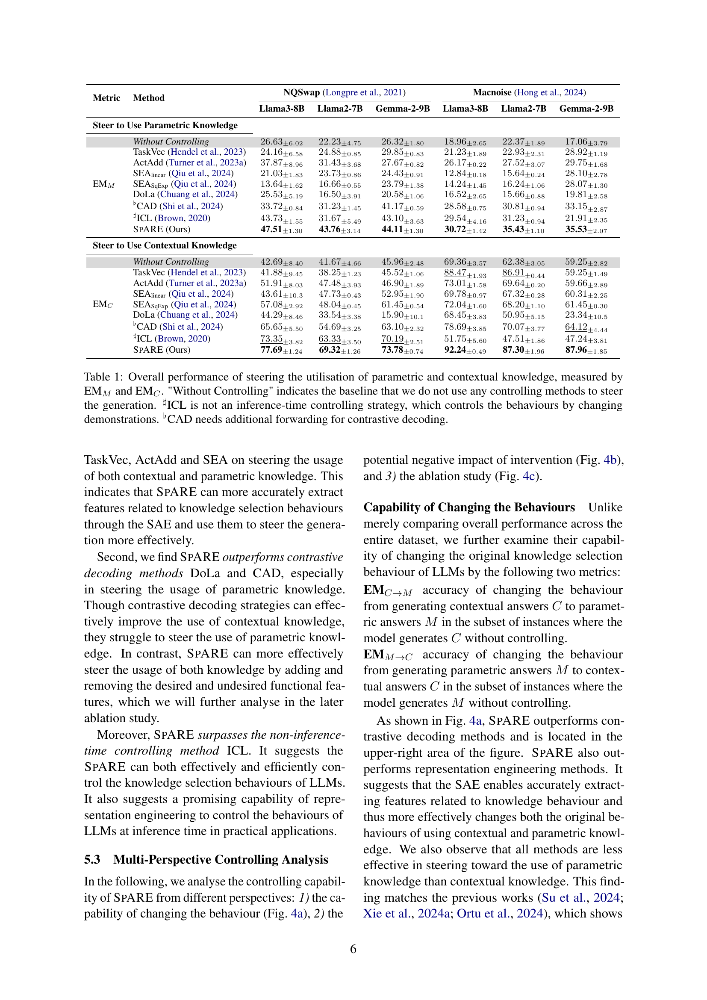

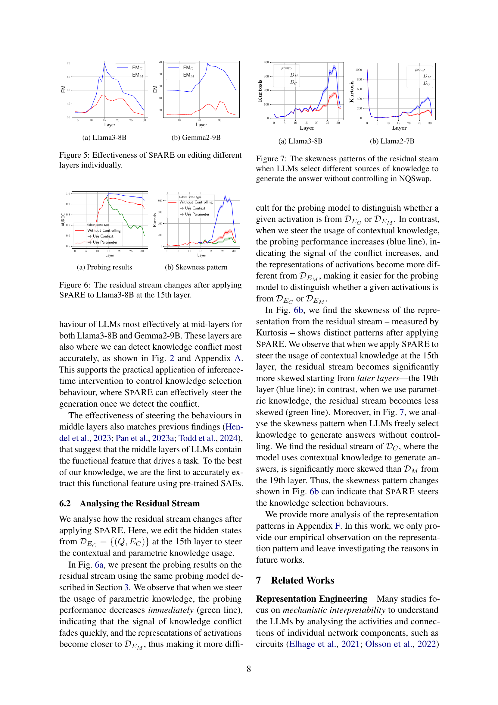

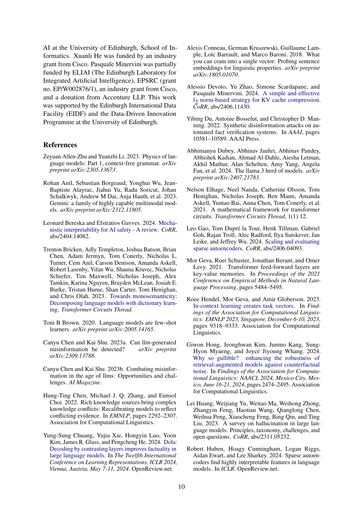
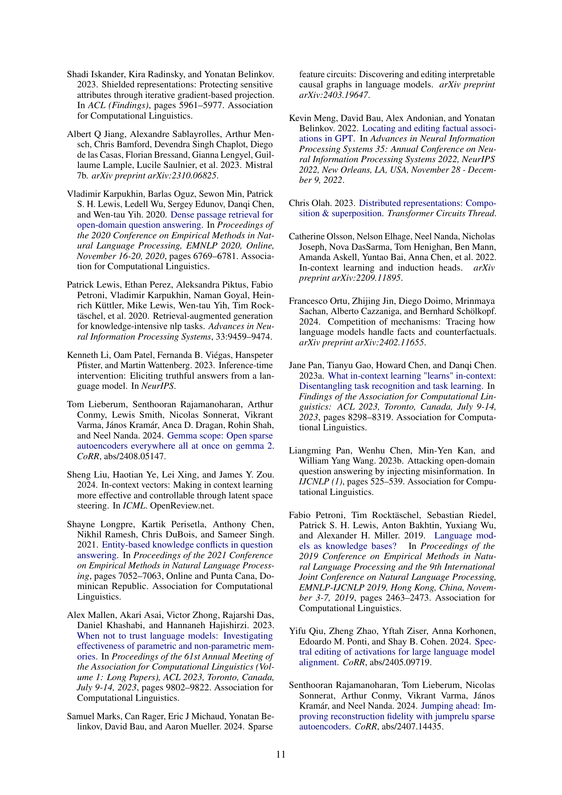

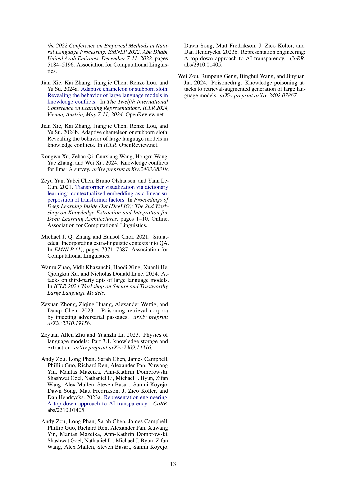
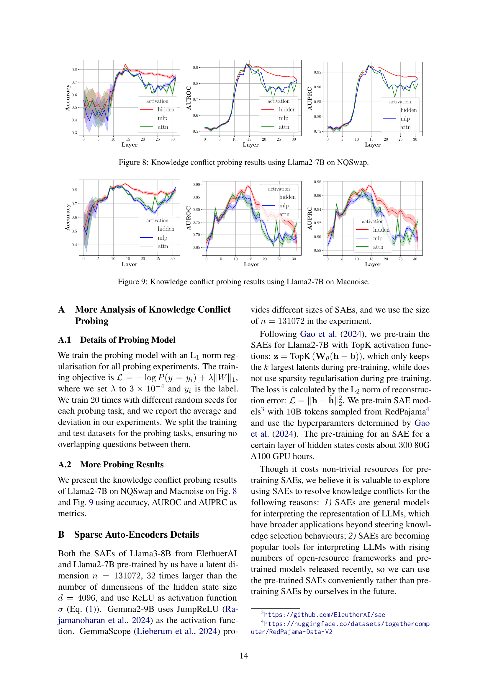

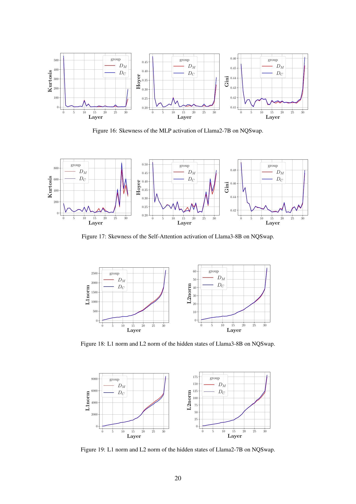
