### TL;DR



This paper tackles the challenge of improving reasoning in vision-language models (VLMs). Current methods often rely on limited data with short answers, hindering the models' ability to handle complex reasoning tasks.  The researchers propose a two-step solution. First, they use the powerful GPT-4 language model to generate detailed explanations (rationales) for answers, enriching the training dataset.  Second, they employ reinforcement learning to further refine the models' reasoning abilities, focusing on aligning the models' generated rationales with the correct answers.  Experiments show this approach significantly improves the VLM's performance on various reasoning tasks, highlighting the importance of detailed rationales in VLM training and demonstrating the effectiveness of reinforcement learning for enhancing reasoning capabilities.




 &nbsp; read the paper on arXiv


#### Why does it matter?
This research paper introduces a novel two-fold approach to enhance chain-of-thought (CoT) reasoning in vision-language models (VLMs).  First, it leverages GPT-4 to generate detailed rationales to enrich training data and fine-tune VLMs. Second, it uses reinforcement learning to further calibrate reasoning quality by optimizing model-generated reasoning chains.  The work demonstrates significant improvements in CoT reasoning on various benchmark datasets.
#### Key Takeaways


 A novel two-fold approach improves chain-of-thought reasoning in vision-language models. 



 Leveraging GPT-4-distilled rationales significantly enhances VLM training data and performance. 



 Reinforcement learning refines reasoning quality, leading to better generalization in answer prediction. 


------
#### Visual Insights

> This figure illustrates the difference between training a vision language model exclusively on short answers versus incorporating chain-of-thought reasoning for improved accuracy and alignment.

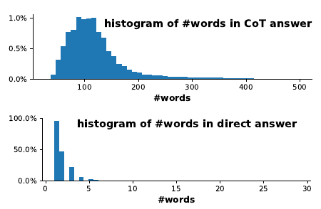

> The chart displays the distribution of word counts in chain-of-thought (CoT) answers and direct answers.

{{< table-caption caption="🔽 Table 2: SFT experiments with data composition in fig. 5: ① format alignment only, ② direct responses only, ③ CoT responses only and ④ both direct and CoT responses. Inference is performed using both direct and CoT templates. The best CoT prediction result is highlighted in orange, while the best direct prediction result is marked in blue. The results demonstrate that combining CoT and direct responses during training leads to the best performance across both types of prompts. Refer to section 4 for detailed analysis." >}}
 <table id='8' style='font-size:16px'><tr><td>Dataset</td><td>Dataset Size</td></tr><tr><td>A-OKVQA</td><td>16.9k</td></tr><tr><td>ChartQA</td><td>26.0k</td></tr><tr><td>SQA</td><td>6.1k</td></tr><tr><td>AI2D</td><td>11.9k</td></tr><tr><td>InfoVQA</td><td>22.4k</td></tr><tr><td>DocVQA</td><td>37.3k</td></tr><tr><td>TextVQA</td><td>29.7k</td></tr><tr><td>MathVision</td><td>11.0k</td></tr><tr><td>G-LLaVA</td><td>30.3k</td></tr><tr><td>Total</td><td>193k</td></tr></table>

> This table presents the results of supervised fine-tuning experiments comparing different combinations of training data (format alignment only, direct responses only, CoT responses only, and both direct and CoT responses) on the performance of vision language models in both direct prediction and chain-of-thought prediction tasks.

### More visual insights

More on figures

 the use of GPT-40 to generate rationale given short annotations; b) SFT of open-source VLM for CoT reasoning; c) Build preference dataset for reinforcement learning with DPO to enhance reasoning.")

> The figure illustrates the three-stage pipeline for improving VLM chain-of-thought reasoning: rationale distillation from GPT-40, supervised fine-tuning with chain-of-thought data, and reinforcement learning using direct preference optimization.

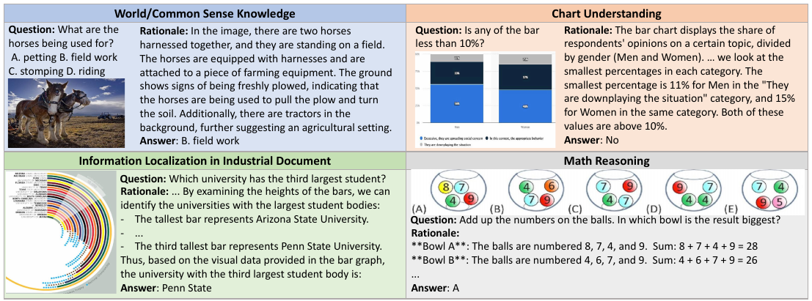

> This figure illustrates the difference between training a Vision Language Model (VLM) exclusively on direct answers versus generating chain-of-thought (CoT) reasoning for prediction, highlighting the benefits of reasoning alignment using self-generated data.

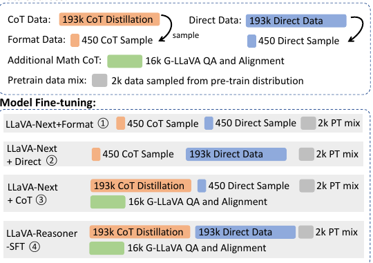

> The figure shows the data sources and composition used in the supervised fine-tuning (SFT) experiments for training the vision-language models.

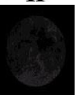

> The figure illustrates the difference between training a vision language model exclusively on direct answers versus generating chain-of-thought (CoT) reasoning for prediction, highlighting the benefits of CoT for reasoning alignment and improved model performance.

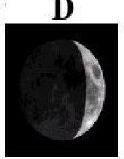

> The figure illustrates the difference between training a vision language model exclusively on short answers versus training it with chain-of-thought reasoning, highlighting the benefits of the latter for reasoning alignment and improved performance.

, and the answer should relate to 'teeth,' not ‘heart' as in the annotation. In the right figure, the fridge contains beer, but the annotation incorrectly labels it as 'water.' Consequently, we filter out instances where the GPT-40-generated answer does not match the annotated answers.")

> The figure shows two examples from the A-OKVQA dataset where the GPT-40 generated answers are correct but the annotations contain errors, highlighting the need for filtering mismatched annotations during data distillation.

, and the answer should relate to ‘teeth,’ not ‘heart’ as in the annotation. In the right figure, the fridge contains beer, but the annotation incorrectly labels it as ‘water.’ Consequently, we filter out instances where the GPT-40-generated answer does not match the annotated answers.")

> The figure shows two examples from the A-OKVQA dataset illustrating annotation errors in which GPT-40 generated correct answers, while the provided annotations contained errors.

More on charts

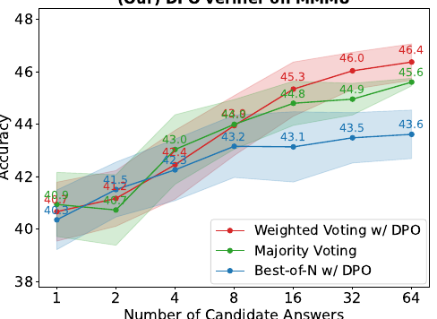

> The chart displays the performance of the DPO model as a verifier on three datasets (ChartQA, A-OKVQA, and MathVista) using three re-ranking methods (weighted voting with DPO, majority voting, and best-of-N with DPO) across different numbers of candidate answers.

> The chart displays the performance of the DPO model as a verifier for three different datasets (ChartQA, A-OKVQA, and MathVista), comparing its performance with and without RLAIF-V training.

> The chart displays examples of the LLAVA-Next-8B model's responses to a question about counting food items in a bar chart, demonstrating its inconsistent handling of a chain-of-thought (CoT) prompt.

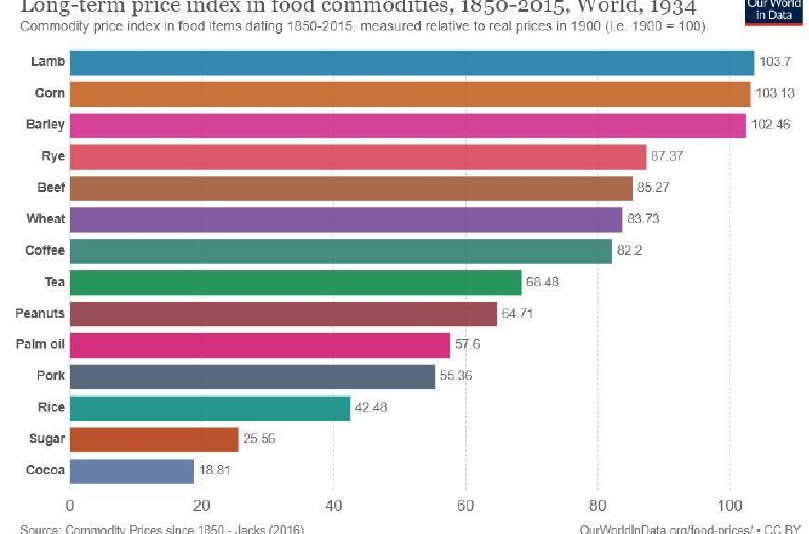

> The chart displays the distribution of word counts in chain-of-thought (CoT) answers and direct answers.

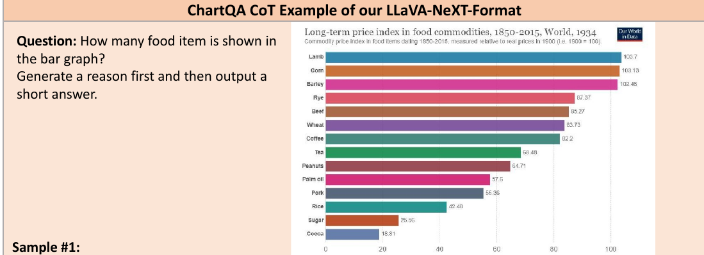

> The chart displays a bar graph showing the long-term price index of various food commodities from 1850 to 2015, with each bar representing a different food item and its length proportional to the price index value.

More on tables

{{< table-caption caption="🔽 Table 2: SFT experiments with data composition in fig. 5: ① format alignment only, ② direct responses only, ③ CoT responses only and ④ both direct and CoT responses. Inference is performed using both direct and CoT templates. The best CoT prediction result is highlighted in orange, while the best direct prediction result is marked in blue. The results demonstrate that combining CoT and direct responses during training leads to the best performance across both types of prompts. Refer to section 4 for detailed analysis." >}}
<table id='2' style='font-size:16px'><tr><td>Methods</td><td>Prompting</td><td>A-OK</td><td>ChartQA</td><td>DocVQA</td><td>InfoVQA</td><td>TextVQA</td><td>AI2D</td><td>SQA</td><td>MathVista</td><td>Avg</td></tr><tr><td>LLaVA-Next</td><td>direct</td><td>85.8</td><td>70.2</td><td>75.7</td><td>37.7</td><td>68.2</td><td>71.5</td><td>75.4</td><td>39.3</td><td>65.5</td></tr><tr><td>+ Format ①</td><td>CoT</td><td>84.3</td><td>71.2</td><td>67</td><td>34.9</td><td>62.2</td><td>67.4</td><td>74.4</td><td>40.3</td><td>62.7</td></tr><tr><td>LLaVA-Next</td><td>direct</td><td>86.4</td><td>73.7</td><td>78</td><td>45.4</td><td>71.9</td><td>78.8</td><td>91.5</td><td>43.2</td><td>71.1</td></tr><tr><td>+ Direct ②</td><td>CoT</td><td>85.7</td><td>71.8</td><td>68.8</td><td>38.6</td><td>63.6</td><td>72.5</td><td>85.4</td><td>38.6</td><td>65.6</td></tr><tr><td>LLaVA-Next</td><td>direct</td><td>84.9</td><td>71.8</td><td>81.2</td><td>45.7</td><td>72.1</td><td>75.3</td><td>85</td><td>41.9</td><td>69.7</td></tr><tr><td>+ Cot ③</td><td>CoT</td><td>85.1</td><td>82.2</td><td>81.2</td><td>49.7</td><td>69.9</td><td>77</td><td>91.3</td><td>49.2</td><td>73.2</td></tr><tr><td>LLaVA-Reasoner</td><td>direct</td><td>85.4</td><td>76.1</td><td>82.9</td><td>50.6</td><td>73.1</td><td>79.4</td><td>90.4</td><td>44.3</td><td>72.8</td></tr><tr><td>-SFT ④</td><td>CoT</td><td>86.2</td><td>83.0</td><td>81.8</td><td>51.6</td><td>71.1</td><td>78.5</td><td>92.7</td><td>50.6</td><td>74.4</td></tr></table>

> The table presents the performance of different models trained with varying combinations of direct and chain-of-thought (CoT) response data, demonstrating that combining both improves performance on both direct and CoT prediction tasks.

{{< table-caption caption="🔽 Table 2: SFT experiments with data composition in fig. 5: ① format alignment only, ② direct responses only, ③ CoT responses only and ④ both direct and CoT responses. Inference is performed using both direct and CoT templates. The best CoT prediction result is highlighted in orange, while the best direct prediction result is marked in blue. The results demonstrate that combining CoT and direct responses during training leads to the best performance across both types of prompts. Refer to section 4 for detailed analysis." >}}
 <table id='11' style='font-size:16px'><tr><td>Data Config</td><td>Math Vista (direct/CoT)</td></tr><tr><td>format only ①</td><td>39.3/40.3</td></tr><tr><td>MV</td><td>41.0/43.4</td></tr><tr><td>MV+GL</td><td>43.2/44.9</td></tr><tr><td>MV+GL+MP50k</td><td>42.3/45.6</td></tr><tr><td>MV+GL+MP100k</td><td>43.0/44.9</td></tr><tr><td>MV+GL+MI50k</td><td>43.1/45.0</td></tr><tr><td>MV+GL+MI100k</td><td>43.7/46.3</td></tr><tr><td>MV+GL+AI2D</td><td>44.1/46.4</td></tr><tr><td>MV+GL+SQA</td><td>43.1/47.3</td></tr><tr><td>MV+GL+ChartQA</td><td>43.2/50.4</td></tr></table>

> The table presents the results of supervised fine-tuning experiments on different combinations of training data (format alignment, direct responses, and chain-of-thought responses), showing the best performance is achieved when combining both direct and chain-of-thought data.

{{< table-caption caption="🔽 Table 2: SFT experiments with data composition in fig. 5: ① format alignment only, ② direct responses only, ③ CoT responses only and ④ both direct and CoT responses. Inference is performed using both direct and CoT templates. The best CoT prediction result is highlighted in orange, while the best direct prediction result is marked in blue. The results demonstrate that combining CoT and direct responses during training leads to the best performance across both types of prompts. Refer to section 4 for detailed analysis." >}}
<table id='13' style='font-size:16px'><tr><td>Data Config</td><td>AI2D</td><td>SQA</td></tr><tr><td>format only ①</td><td>67.4</td><td>74.4</td></tr><tr><td>AI2D</td><td>76.3</td><td>76.6</td></tr><tr><td>SQA</td><td>66.9</td><td>90.4</td></tr><tr><td>AI2D +SQA</td><td>76.7</td><td>91.2</td></tr><tr><td>AI2D +SQA +ChartQA</td><td>77.4</td><td>91.4</td></tr></table>

> This table presents the results of supervised fine-tuning experiments comparing different data compositions (format alignment only, direct responses only, CoT responses only, and both direct and CoT responses) on various tasks and prompting methods (direct and CoT).

{{< table-caption caption="🔽 Table 2: SFT experiments with data composition in fig. 5: ① format alignment only, ② direct responses only, ③ CoT responses only and ④ both direct and CoT responses. Inference is performed using both direct and CoT templates. The best CoT prediction result is highlighted in orange, while the best direct prediction result is marked in blue. The results demonstrate that combining CoT and direct responses during training leads to the best performance across both types of prompts. Refer to section 4 for detailed analysis." >}}
<table id='8' style='font-size:18px'><tr><td>Dataset</td><td>GPT-4o direct/cot</td><td>Cambrian official</td><td>Our-SFT direct/cot</td></tr><tr><td>A-OK</td><td>89.6/90.1</td><td>83.1*</td><td>85.4/86.2</td></tr><tr><td>ChartQA</td><td>79.6/84.7</td><td>73.3</td><td>76.1/83.0</td></tr><tr><td>DocVQA</td><td>90.3/90.8</td><td>77.8</td><td>82.9/81.8</td></tr><tr><td>InfoVQA</td><td>72.4/72.8</td><td>45.7*</td><td>50.6/51.6</td></tr><tr><td>TextVQA</td><td>78.1/75.4</td><td>71.7</td><td>73.1/71.1</td></tr><tr><td>AI2D</td><td>80.7/81.5</td><td>73.0</td><td>79.4/78.5</td></tr><tr><td>SQA</td><td>85.9/87.2</td><td>80.4</td><td>90.4/92.7</td></tr><tr><td>Math Vista</td><td>54.8/63.4</td><td>49.0†</td><td>44.3/50.6</td></tr><tr><td>OCRBench</td><td>80.2/79.2</td><td>62.4</td><td>61.6/62.0</td></tr><tr><td>MMStar</td><td>55.1/64.7</td><td>50.3*</td><td>51.6/54.0</td></tr><tr><td>MMMU</td><td>57.8/63.6</td><td>42.7</td><td>41.6/40.0</td></tr><tr><td>Avg (of best)</td><td>77.9</td><td>64.5</td><td>68.8</td></tr></table>

> This table presents the results of supervised fine-tuning (SFT) experiments using different combinations of data (format alignment only, direct responses only, CoT responses only, and both direct and CoT responses) and shows that combining CoT and direct responses leads to the best performance.


<table id='2' style='font-size:16px'><tr><td>Methods</td><td>Prompting</td><td>A-OK</td><td>ChartQA</td><td>DocVQA</td><td>InfoVQA</td><td>TextVQA</td><td>AI2D</td><td>SQA</td><td>MathVista</td><td>Avg</td></tr><tr><td rowspan="2">LLaVA-Reasoner -SFT ④</td><td>direct</td><td>85.4</td><td>76.1</td><td>82.9</td><td>50.6</td><td>73.1</td><td>79.4</td><td>90.4</td><td>44.3</td><td>72.8</td></tr><tr><td>CoT</td><td>86.2</td><td>83.0</td><td>81.8</td><td>51.6</td><td>71.1</td><td>78.5</td><td>92.7</td><td>50.6</td><td>74.4</td></tr><tr><td rowspan="2">LLaVA-Reasoner -RLAIF ⑤</td><td>direct</td><td>85.6</td><td>76.1</td><td>83.1</td><td>50.7</td><td>73.3</td><td>79.6</td><td>91.1</td><td>44.1</td><td>73.0</td></tr><tr><td>CoT</td><td>86.7</td><td>83.0</td><td>82.4</td><td>50.8</td><td>71.4</td><td>79.1</td><td>92.9</td><td>50.8</td><td>74.6</td></tr><tr><td rowspan="2">LLaVA-Reasoner -DPO-ours ⑥</td><td>direct</td><td>85.4</td><td>76.4</td><td>83.1</td><td>51.2</td><td>73.3</td><td>79.4</td><td>90.8</td><td>44.2</td><td>73.0</td></tr><tr><td>CoT</td><td>87.0</td><td>84.2</td><td>82.7</td><td>52.7</td><td>71.5</td><td>79.5</td><td>92.6</td><td>52.1</td><td>75.3</td></tr></table>

> The table compares the performance of different prompting methods (direct and CoT) on various vision-language tasks using different DPO datasets (RLAIF-V and a custom dataset).

{{< table-caption caption="🔽 Table 2: SFT experiments with data composition in fig. 5: ① format alignment only, ② direct responses only, ③ CoT responses only and ④ both direct and CoT responses. Inference is performed using both direct and CoT templates. The best CoT prediction result is highlighted in orange, while the best direct prediction result is marked in blue. The results demonstrate that combining CoT and direct responses during training leads to the best performance across both types of prompts. Refer to section 4 for detailed analysis." >}}
<table id='1' style='font-size:14px'><tr><td>ChartQA Filtered Out Example #1</td><td>ChartQA Filtered Out Example #2</td></tr><tr><td>Question: How much money did "1917" and "Sonic The Hedgehog" earn? Annotated Answer: 204.41 Dad Boys for Life 204.41 1917 157 9 sonic the Heagenog 146.06 Jumanjl: The Next Lavel 124.78 Star Wars: Episode IX - The Rise of 124.49 Skywalker Birds of Prey 04.15 Dolittle 7704 Little Worrien 70.5 The Invicible Man 64.91 the Call or the Wild 62.34 Omward 61.55 Knives Clut 4지 65 Fruzen II 47.ZZ Tenet 46.29 Spres IN Disquise 37.43 0 25 50 75 100 125 150 175 200 Bok office groos n million U.S. dellar⌀ GPT-4o Response: To determine the combined earnings of "1917" and "Sonic The Hedgehog,' " need to locate the earnings for each movie on the bar we chart. 1. The bar labeled "1917" shows earnings of 157.9 million U.S. dollars. 2. 2. The bar labeled "Sonic the Hedgehog" shows earnings of 146.06 million U.S. dollars. To find the total earnings, we add these two amounts together: 157.9 (for "1917") + 146.06 (for "Sonic The Hedgehog") = 303.96 ### Answer: 303.96</td><td>Question: Which country had the highest number of terrorist attacks in 2020? Annotated Answer: Spain Italy 24 France 15 Greece 0 Germany 6 Spain 9 Netherlands 0 Czechia 0 Denmark 0 Poland 0 Belgium 2 Bulgaria 0 Finland 0 225 Sweden 0 0 2.5 5 7.5 10 12.5 15 17.5 20 22.5 25 27.5 Numbor of torrorict attarke GPT-4o Response: The bar chart displays the number of terrorist attacks in various countries in 2020. Each country is represented by a horizontal bar, with the length of the bar corresponding to the number of attacks. - Italy has the longest bar, indicating it had the highest number of terrorist attacks, with a total of 24 attacks. - France follows with the second longest bar, showing 15 attacks. - Spain is next with 9 attacks. - Germany had 6 attacks.  Belgium had 2 attacks. - Greece, Netherlands, Czechia, Denmark, Poland, Bulgaria, Finland, and Sweden all had 0 attacks, as indicated by the absence of bars for these countries. From these visual clues, it is clear that the country with the highest number of terrorist attacks in 2020 is Italy. ### Answer: Italy</td></tr></table>

> The table presents the results of supervised fine-tuning (SFT) experiments on various datasets using different combinations of direct and chain-of-thought (CoT) training data.

{{< table-caption caption="🔽 Table 2: SFT experiments with data composition in fig. 5: ① format alignment only, ② direct responses only, ③ CoT responses only and ④ both direct and CoT responses. Inference is performed using both direct and CoT templates. The best CoT prediction result is highlighted in orange, while the best direct prediction result is marked in blue. The results demonstrate that combining CoT and direct responses during training leads to the best performance across both types of prompts. Refer to section 4 for detailed analysis." >}}
<table id='5' style='font-size:14px'><tr><td>#</td><td>Prompt</td><td>ChartQA (relaxed acc)</td></tr><tr><td>1</td><td>{Question}</td><td>2.7</td></tr><tr><td>2</td><td>{Question} Answer the question directly.</td><td>32.3</td></tr><tr><td>3</td><td>Answer the question. Do not write a full sentence, just provide a value. Question : {Question}</td><td>56.4</td></tr><tr><td>4</td><td>Answer the question with following instruction: 1 . Do not write a full sentence, just provide a value. 2. Don , t include any unit, i.e. 56 instead of 56 meters Question : {Question}</td><td>75.2</td></tr><tr><td>5</td><td>Answer the question with following instruction: 1 . Do not write a full sentence, just provide a value. 2. Don , t include any unit, i e . 56 instead of 56 meters 3. Don , t include '%' sign, i. e . 56 instead of 56%</td><td>80.3</td></tr></table>

> The table presents the results of supervised fine-tuning experiments with different data compositions (format alignment only, direct responses only, CoT responses only, and both direct and CoT responses) and shows that combining CoT and direct responses yields the best performance.

{{< table-caption caption="🔽 Table 2: SFT experiments with data composition in fig. 5: ① format alignment only, ② direct responses only, ③ CoT responses only and ④ both direct and CoT responses. Inference is performed using both direct and CoT templates. The best CoT prediction result is highlighted in orange, while the best direct prediction result is marked in blue. The results demonstrate that combining CoT and direct responses during training leads to the best performance across both types of prompts. Refer to section 4 for detailed analysis." >}}
<table id='2' style='font-size:14px'><tr><td></td><td>ChartQA System Prompt (relaxed acc)</td></tr><tr><td>When provided with an image and a question, generate a rationale first and then derive an answer. Your rationale should include detailed visual elements in order to derive the answer .</td><td></td></tr><tr><td># Prompt 1 Answer the question with following instruction: 1. Generate a rationale first and then derive an answer . 2. Don , t include any unit, i. e . 56 instead of 56 meters 3. Don , t include '%' sign, i.e. 56 instead of 56% Question: {question} # Output Format # <rationale> ### Answer : <your answer></td><td></td></tr><tr><td>2 Prompt #1, removing system prompt</td><td>84.7 84.1</td></tr></table>

> The table presents the results of supervised fine-tuning experiments on four different data compositions, comparing the performance of direct and chain-of-thought prediction using various prompting methods.

{{< table-caption caption="🔽 Table 2: SFT experiments with data composition in fig. 5: ① format alignment only, ② direct responses only, ③ CoT responses only and ④ both direct and CoT responses. Inference is performed using both direct and CoT templates. The best CoT prediction result is highlighted in orange, while the best direct prediction result is marked in blue. The results demonstrate that combining CoT and direct responses during training leads to the best performance across both types of prompts. Refer to section 4 for detailed analysis." >}}
<table id='2' style='font-size:16px'><tr><td>Dataset</td><td>CoT Prompt</td></tr><tr><td>system prompt</td><td>When provided with an image and a question, generate a rationale first and then derive an answer . Your rationale should include detailed visual elements in order to derive the answer .</td></tr><tr><td>A-OKVQA AI2D SQA MMStar</td><td>Answer the question with following instruction: 1. Generate a rationale first and then derive an answer . 2. For your final answer, provide a letter choice. Question: {question} # Output Format # <rationale> ### Answer : <your answer></td></tr><tr><td>ChartQA</td><td>Answer the question with following instruction: 1 . Generate a rationale first and then derive an answer . 2. Don , t include any unit, i. e. 56 instead of 56 meters 3. Don 't include '%' sign, i.e. 56 instead of 56% Question: {question} # Output Format # <rationale> ### Answer : <your answer></td></tr><tr><td>DocVQA InfoVQA</td><td># Objective # You are provided with an image, a question. Your job is to generate a rationale first and then derive an answer . ########### # Question # {question} ########### # Rationale Requirement # 1. Do not state an answer at the beginning. Explain descriptions of visual clue that help to derive the answer. 2. Conclude with ### Answer: <your answer> 3. Your final answer should be a single word or phrase. 4. If possible, copy the answer from document. Don't add or remove symbols, units, or titles. ########### # Output Style # <rationale> ### Answer : <your answer> ###########</td></tr></table>

> The table presents the results of supervised fine-tuning experiments on various data compositions, comparing the performance of direct and chain-of-thought prediction on several vision-language reasoning tasks.

{{< table-caption caption="🔽 Table 2: SFT experiments with data composition in fig. 5: ① format alignment only, ② direct responses only, ③ CoT responses only and ④ both direct and CoT responses. Inference is performed using both direct and CoT templates. The best CoT prediction result is highlighted in orange, while the best direct prediction result is marked in blue. The results demonstrate that combining CoT and direct responses during training leads to the best performance across both types of prompts. Refer to section 4 for detailed analysis." >}}
 <table id='2' style='font-size:14px'><tr><td>Dataset</td><td>Prompt</td></tr><tr><td>TextVQA</td><td># Objective # You are provided with an image, a question. Your job is to generate a rationale first and then derive an answer · ########### # Question # {question} ########### # Rationale Requirement # 1. Do not state an answer at the beginning. Explain descriptions of visual clue that help to derive the answer. 2. Conclude with ### Answer: <your answer> 3. Your final answer should be a single word or phrase. 4. Output your answer in lower case. ########### # Output Style # <rationale> ### Answer : <your answer> ###########</td></tr><tr><td>OCRBench</td><td>Answer the question with following instruction: 1. Generate a rationale first and then derive an answer · 2. Your answer should be a single word or phrase. Question: {question} # Output Format # <rationale> ### Answer : <your answer></td></tr></table>

> The table presents the results of supervised fine-tuning (SFT) experiments on four different data compositions, comparing the performance of direct and chain-of-thought (CoT) prediction on various tasks.


<table id='3' style='font-size:16px'><tr><td>Dataset</td><td colspan="2">LLAVA-NEXT-8B</td><td colspan="2">LLAVA-NEXT-FORMAT</td></tr><tr><td></td><td>direct</td><td>CoT</td><td>direct</td><td>CoT</td></tr><tr><td>A-OK</td><td>85.9</td><td>44.5</td><td>85.8</td><td>84.3</td></tr><tr><td>ChartQA</td><td>68.6</td><td>52.8</td><td>70.2</td><td>71.2</td></tr><tr><td>DocVQA</td><td>78.4</td><td>57.1</td><td>75.7</td><td>67.0</td></tr><tr><td>InfoVQA</td><td>36.6</td><td>25.8</td><td>37.7</td><td>34.9</td></tr><tr><td>TextVQA</td><td>67.2</td><td>41.6</td><td>68.2</td><td>62.2</td></tr><tr><td>AI2D</td><td>73.0</td><td>70.0</td><td>71.5</td><td>67.4</td></tr><tr><td>SQA</td><td>77.4</td><td>75.8</td><td>75.4</td><td>74.4</td></tr><tr><td>Math Vista</td><td>37.3</td><td>25.3</td><td>39.3</td><td>40.3</td></tr><tr><td>OCRBench</td><td>57.7</td><td>59.7</td><td>59.1</td><td>56.6</td></tr><tr><td>MMStar</td><td>47.8</td><td>45.7</td><td>44.7</td><td>46.7</td></tr><tr><td>MMMU</td><td>42.8</td><td>37.6</td><td>41.8</td><td>37.7</td></tr><tr><td>Avg</td><td>61.2</td><td>48.7</td><td>60.9</td><td>58.4</td></tr></table>

> The table presents the baseline performance of LLAVA-NEXT-8B and LLAVA-NEXT-FORMAT models on various benchmark datasets using direct and chain-of-thought (CoT) inference methods.


<table id='3' style='font-size:14px'><tr><td>Methods</td><td>Prompting</td><td>A-OK</td><td>ChartQA</td><td>DocVQA</td><td>InfoVQA</td><td>TextVQA</td><td>AI2D</td><td>SQA</td><td>MathVista</td></tr><tr><td>LLaVA-Next</td><td>direct</td><td>86.4</td><td>73.7</td><td>78</td><td>45.4</td><td>71.9</td><td>78.8</td><td>91.5</td><td>43.2</td></tr><tr><td>+ Direct ②</td><td>CoT</td><td>85.7</td><td>71.8</td><td>68.8</td><td>38.6</td><td>63.6</td><td>72.5</td><td>85.4</td><td>38.6</td></tr><tr><td>LLaVA-Next</td><td>direct</td><td>85.9</td><td>74.6</td><td>79.2</td><td>47.4</td><td>72.1</td><td>79.5</td><td>92.2</td><td>44.4</td></tr><tr><td>-STaR</td><td>CoT</td><td>85.9</td><td>77.9</td><td>75.8</td><td>44.0</td><td>25.1</td><td>76.6</td><td>86.8</td><td>42.0</td></tr></table>

> This table presents a comparison of the performance of different models on various visual question answering tasks using both direct and chain-of-thought prediction methods, highlighting the effectiveness of a self-taught reasoning approach with minimal chain-of-thought data.

{{< table-caption caption="🔽 Table 2: SFT experiments with data composition in fig. 5: ① format alignment only, ② direct responses only, ③ CoT responses only and ④ both direct and CoT responses. Inference is performed using both direct and CoT templates. The best CoT prediction result is highlighted in orange, while the best direct prediction result is marked in blue. The results demonstrate that combining CoT and direct responses during training leads to the best performance across both types of prompts. Refer to section 4 for detailed analysis." >}}
<table id='3' style='font-size:16px'><tr><td>Data/Truncate Len</td><td>prompting</td><td>70</td><td>90</td><td>110</td><td>No Truncate</td><td>SFT baseline</td></tr><tr><td rowspan="2">ChartQA</td><td>direct</td><td>76.5</td><td>76.2</td><td>76.7</td><td>75.9</td><td>76.1</td></tr><tr><td>CoT</td><td>83.9</td><td>84.2</td><td>81.8</td><td>80.6</td><td>83.0</td></tr><tr><td rowspan="2">A-OKVQA</td><td>direct</td><td>85.2</td><td>85.2</td><td>85.3</td><td>85.1</td><td>85.4</td></tr><tr><td>CoT</td><td>86.7</td><td>86.9</td><td>86.3</td><td>85.7</td><td>86.2</td></tr></table>

> This table presents the results of supervised fine-tuning (SFT) experiments on different combinations of training data (format alignment, direct responses, and CoT responses) and their impact on both direct and chain-of-thought (CoT) prediction performance.

{{< table-caption caption="🔽 Table 2: SFT experiments with data composition in fig. 5: ① format alignment only, ② direct responses only, ③ CoT responses only and ④ both direct and CoT responses. Inference is performed using both direct and CoT templates. The best CoT prediction result is highlighted in orange, while the best direct prediction result is marked in blue. The results demonstrate that combining CoT and direct responses during training leads to the best performance across both types of prompts. Refer to section 4 for detailed analysis." >}}
<table id='6' style='font-size:16px'><tr><td>Methods</td><td>prompting</td><td>A-OK</td><td>ChartQA</td><td>Math Vista</td></tr><tr><td rowspan="2">SFT baseline</td><td>direct</td><td>85.4</td><td>76.1</td><td>44.3</td></tr><tr><td>CoT</td><td>86.2</td><td>83.0</td><td>50.6</td></tr><tr><td rowspan="2">LLAVA-REASONER-DPO</td><td>direct</td><td>85.4</td><td>76.4</td><td>44.2</td></tr><tr><td>CoT</td><td>87.0</td><td>84.2</td><td>52.1</td></tr><tr><td>A-OKVQA</td><td>direct</td><td>85.1</td><td>72.7</td><td>37.4</td></tr><tr><td>-RFT</td><td>CoT</td><td>87.7</td><td>0.0</td><td>32.5</td></tr><tr><td>A-OKVQA</td><td>direct</td><td>85.8</td><td>74.9</td><td>41.3</td></tr><tr><td>-RFT+Format</td><td>CoT</td><td>86.3</td><td>80.2</td><td>46.5</td></tr><tr><td>ChartQA</td><td>direct</td><td>85.4</td><td>75.0</td><td>42.6</td></tr><tr><td>-RFT</td><td>CoT</td><td>86.7</td><td>83.9</td><td>52.0</td></tr><tr><td>ChartQA</td><td>direct</td><td>85.9</td><td>75.8</td><td>44.4</td></tr><tr><td>-RFT+Format</td><td>CoT</td><td>85.5</td><td>83.4</td><td>50.6</td></tr><tr><td>Math</td><td>direct</td><td>85.3</td><td>76.0</td><td>32.4</td></tr><tr><td>-RFT</td><td>CoT</td><td>86.7</td><td>67.3</td><td>50.9</td></tr><tr><td>Math</td><td>direct</td><td>85.5</td><td>76.0</td><td>39.6</td></tr><tr><td>-RFT+Format</td><td>CoT</td><td>85.5</td><td>82.0</td><td>50.0</td></tr><tr><td>Combined</td><td>direct</td><td>85.3</td><td>75.4</td><td>37.8</td></tr><tr><td>-RFT</td><td>CoT</td><td>85.4</td><td>84.4</td><td>49.0</td></tr><tr><td>Combined</td><td>direct</td><td>85.0</td><td>75.5</td><td>43.0</td></tr><tr><td>-RFT+Format</td><td>CoT</td><td>86.6</td><td>83.1</td><td>47.1</td></tr></table>

> The table shows the performance of four different supervised fine-tuning (SFT) models on various vision-language reasoning tasks, trained with different combinations of direct and chain-of-thought (CoT) data.

### Full paper



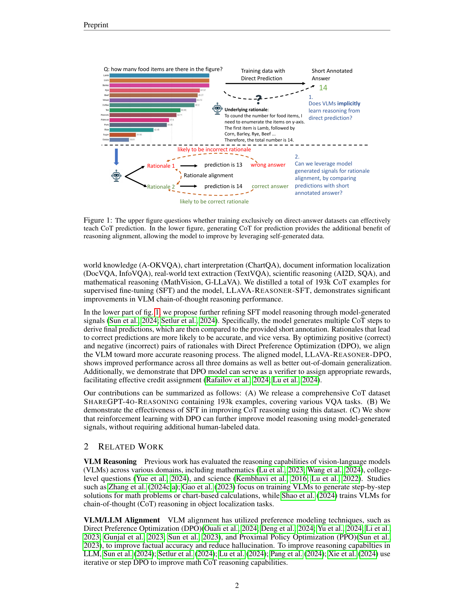
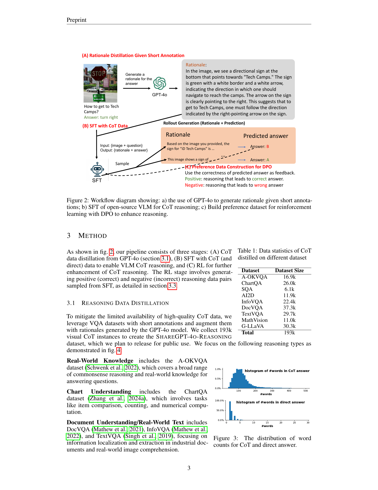
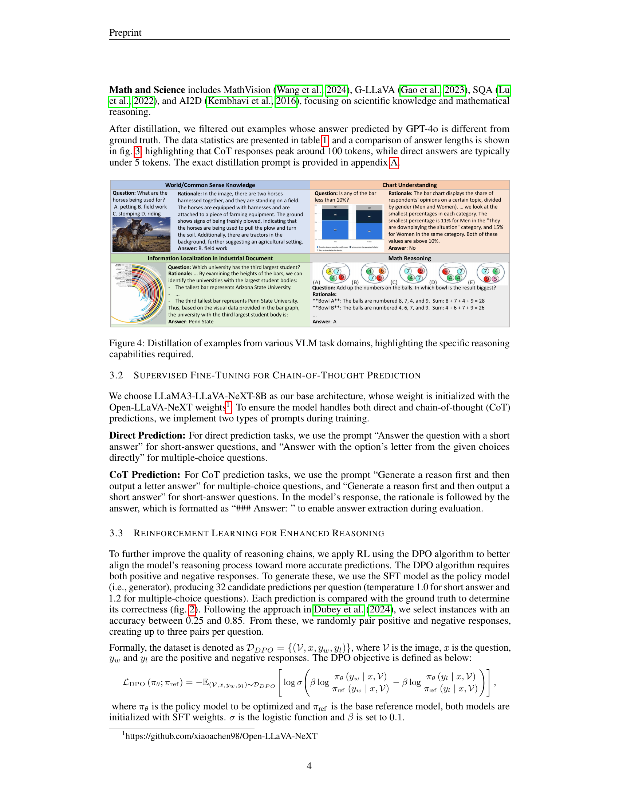

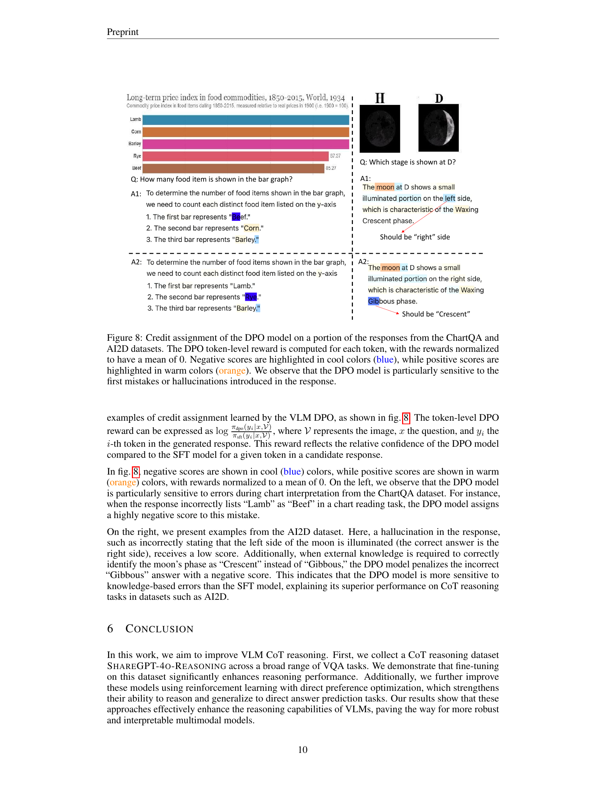
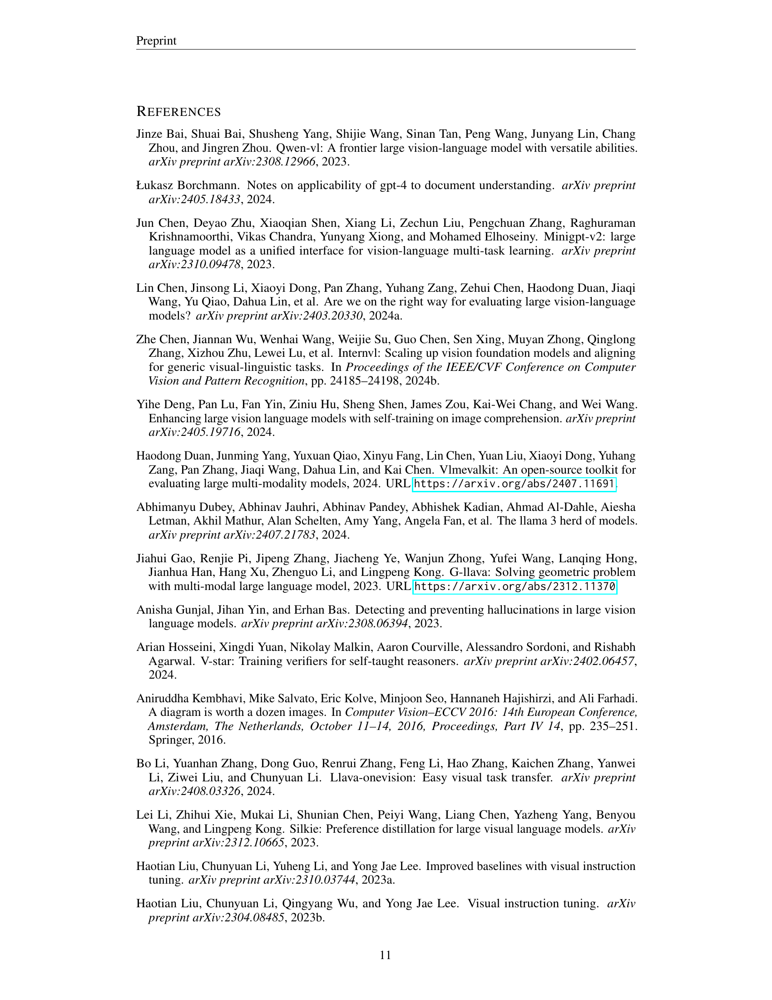

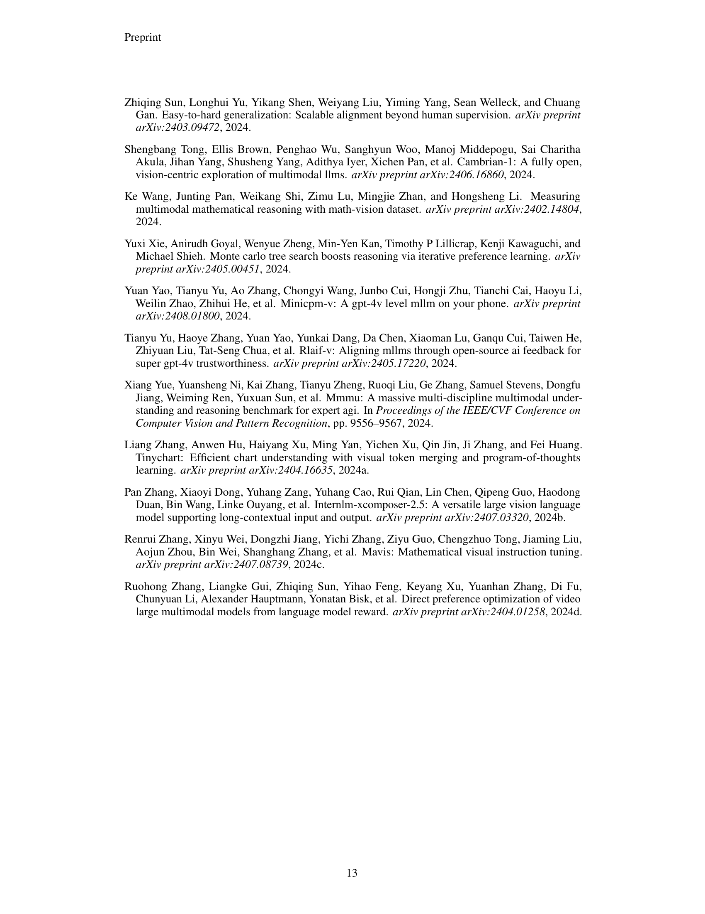

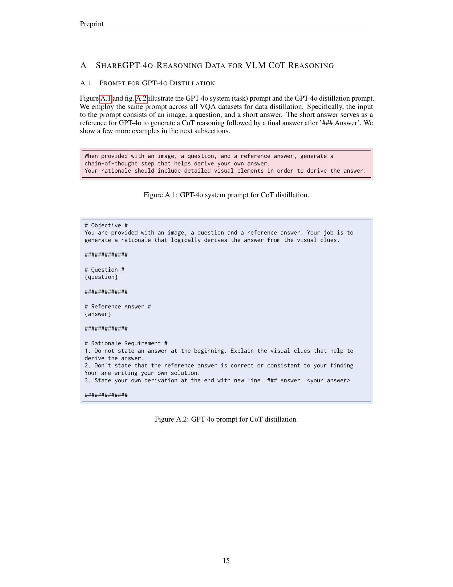
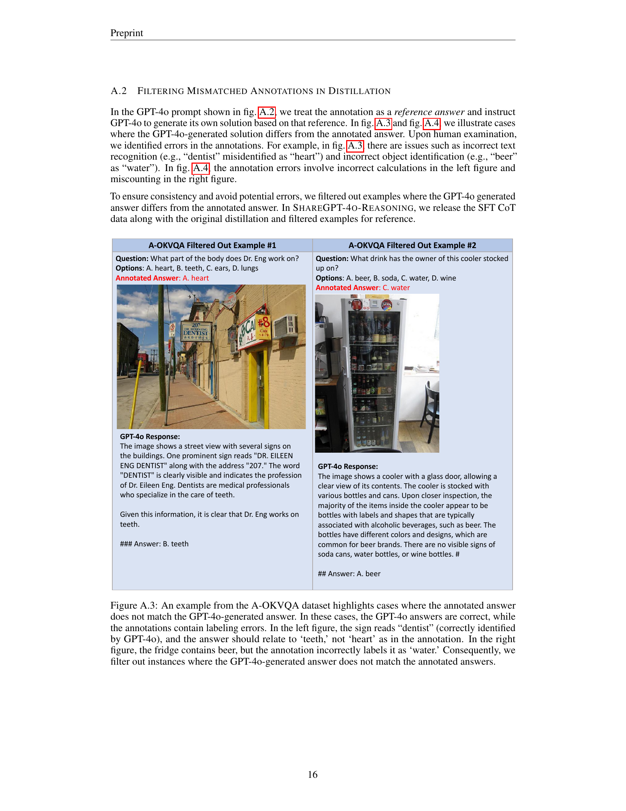

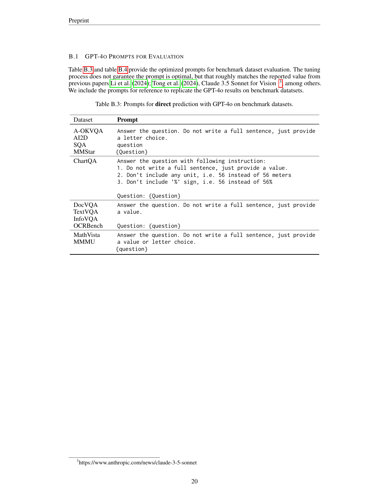
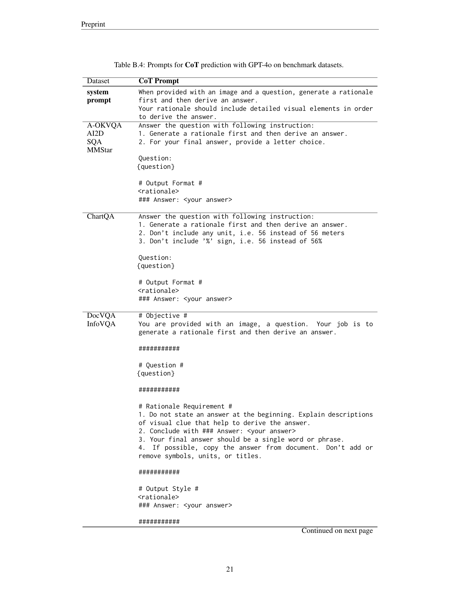

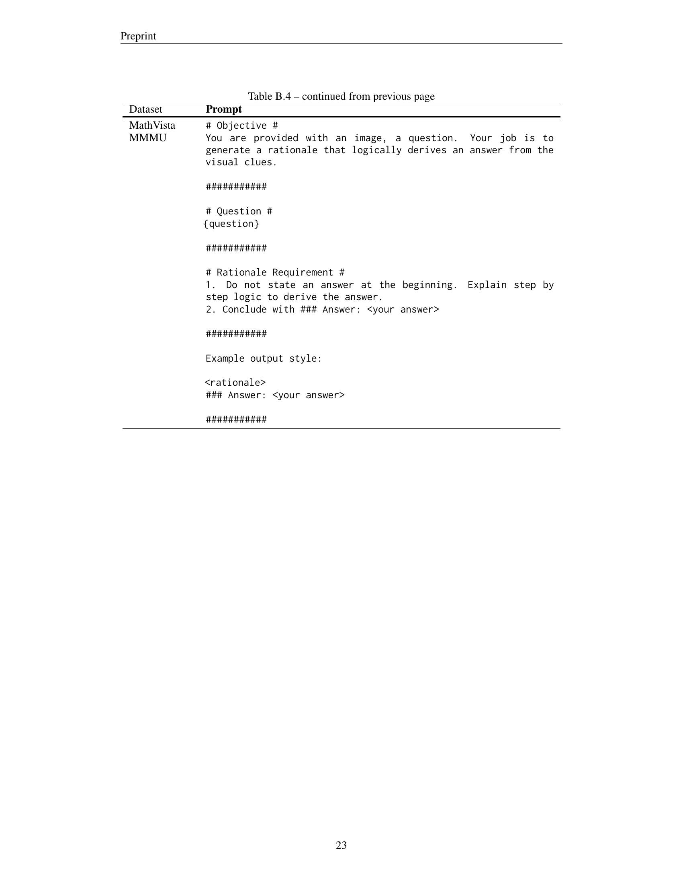
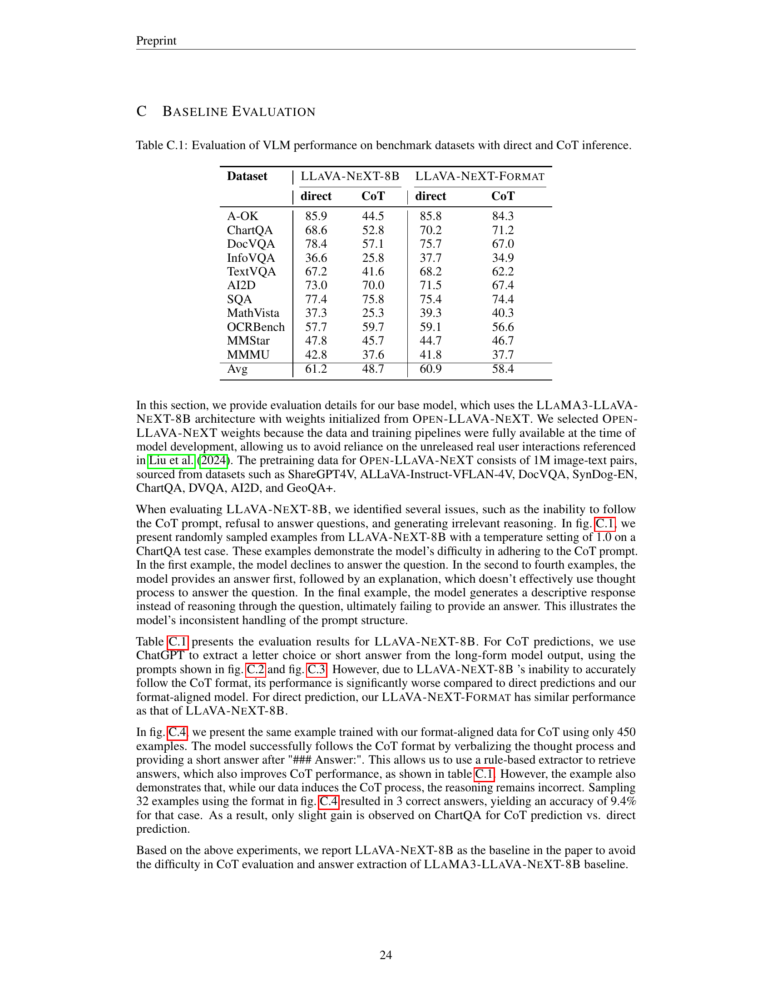

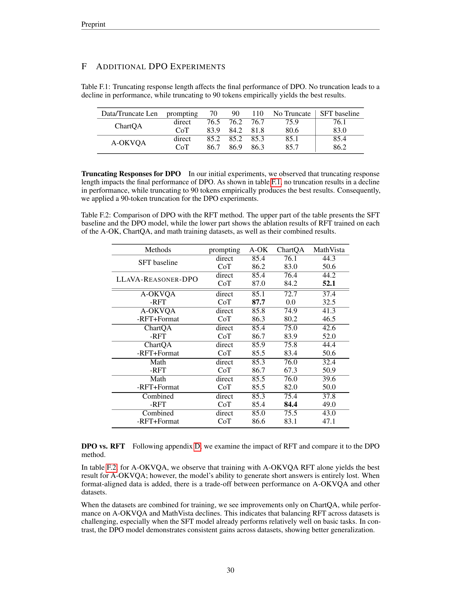
