### TL;DR



This research paper investigates pre-training distillation (PD), a technique to transfer knowledge from a large teacher language model to a smaller student model during the pre-training phase. Unlike typical knowledge distillation applied after training, PD directly incorporates knowledge transfer during the initial training.  The researchers systematically explore the design space of PD by considering four key factors: logits processing, loss function selection, the scaling law between model sizes, and whether logits are generated offline (from a pre-trained teacher model) or online (simultaneously during teacher training). Experiments using the GLM language model showed that PD consistently improved student model performance compared to traditional pre-training methods.  They found that larger student models benefit more from PD and that efficient logit truncation methods are essential for handling the massive data involved.  They also found that a careful balance between distillation loss and standard language modeling loss is necessary for optimal results. Overall, the study highlights the effectiveness of PD and provides valuable insights into its design space, potentially informing future research in large language model training and optimization.




 &nbsp; read the paper on arXiv


#### Why does it matter?
This JSON contains a summary of the research paper on pre-training distillation for large language models. It provides a catchy summary, a TL;DR, key takeaways, and the importance of the paper for researchers.
#### Key Takeaways


 Pre-training distillation improves large language model performance, especially for larger student models. 



 Logits processing techniques like truncation and normalization significantly reduce storage needs without impacting performance. 



 Careful selection of loss functions and their combination with language modeling loss are crucial for effective distillation. 


------
#### Visual Insights

, and a better PD configuration (PD*) after our exploration. Details are placed in appendix A.6.")

> The chart displays the accuracy of pre-trained language models (LLMs) with varying sizes (1.9B, 3.8B, and 6.8B parameters) using different pre-training distillation configurations (LM loss, vanilla PD, and optimized PD*).


<table id='0' style='font-size:16px'><tr><td></td><td>HellaSwag</td><td>WinoGrande</td><td>PIQA</td><td>MMLU</td><td>KBQA</td><td>C3</td><td>C-Eval</td><td>GSM8k</td><td>Average</td></tr><tr><td>LLM-LM</td><td>53.3</td><td>54.8</td><td>72.9</td><td>28.0</td><td>3.6</td><td>54.7</td><td>25.9</td><td>8.6</td><td>37.7</td></tr><tr><td>LLM-KD</td><td>54.2</td><td>55.2</td><td>72.5</td><td>27.8</td><td>3.5</td><td>55.8</td><td>26.7</td><td>10.8</td><td>38.3</td></tr><tr><td></td><td>↑1.7%</td><td>↑ 0.7%</td><td>↓ 0.5%</td><td>↓ 0.5%</td><td>↓ 1.3%</td><td>↑ 1.9%</td><td>↑ 3.2%</td><td>↑ 24.6%</td><td>↑ 1.6%</td></tr></table>

> The table presents the preliminary experimental results of LLMs pre-trained with only LM loss and LLMs pre-trained with distillation on eight evaluation datasets.

### More visual insights

More on charts

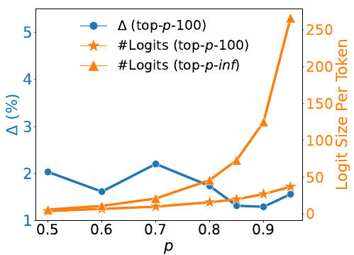

> The chart shows the relative improvements and logit sizes per token when using different values of p in top-p-100 logits truncation.

> The chart illustrates the relationship between the number of logits (using top-0.95-k and top-1.0-k truncation methods) and the relative improvement in performance compared to a baseline LLM, across different values of k.

> The chart displays the relative improvement in performance of student LLMs of different sizes when trained using pre-training distillation with GLM-4-9B and GLM-4-32B as teacher models.

 during the pre-training of 1.9B and 3.8B LLMs on 500B tokens. The last data point is from the checkpoint saved at the end.")

> The chart displays the accuracy of 1.9B and 3.8B LLMs pre-trained with and without knowledge distillation (KD) across varying numbers of consumed tokens during the pre-training phase.

More on tables


 <table id='3' style='font-size:14px'><tr><td>T</td><td>0.05</td><td>0.1</td><td>0.2</td><td>0.5</td><td>1.0</td><td>2.0</td><td>5.0</td><td>10.0</td></tr><tr><td>↑</td><td>1.6</td><td>2.1</td><td>2.5</td><td>2.7</td><td>1.6</td><td>2.5</td><td>-0.1</td><td>1.0</td></tr></table>

> The table presents the preliminary experimental results of LLMs pre-trained with and without knowledge distillation on various evaluation datasets, showing a marginal performance improvement with knowledge distillation.


<table id='0' style='font-size:16px'><tr><td></td><td>HellaSwag</td><td>WinoGrande</td><td>PIQA</td><td>MMLU</td><td>KBQA</td><td>C3</td><td>C-Eval</td><td>GSM8k</td><td>Average</td><td>△</td></tr><tr><td>NormKD</td><td>51.2</td><td>54.1</td><td>71.0</td><td>26.6</td><td>3.2</td><td>54.6</td><td>29.0</td><td>8.0</td><td>37.2</td><td>↓ 1.3%</td></tr><tr><td>WTTM</td><td>51.4</td><td>56.2</td><td>72.9</td><td>26.7</td><td>3.6</td><td>55.1</td><td>27.3</td><td>9.2</td><td>37.8</td><td>↑ 0.2%</td></tr><tr><td>AdaKDsD</td><td>54.7</td><td>54.5</td><td>73.0</td><td>25.7</td><td>3.7</td><td>56.1</td><td>25.9</td><td>11.8</td><td>38.2</td><td>↑ 1.2%</td></tr><tr><td>AdaKDH</td><td>54.7</td><td>57.7</td><td>73.4</td><td>25.6</td><td>3.7</td><td>57.0</td><td>27.0</td><td>10.9</td><td>38.8</td><td>↑ 2.8%</td></tr></table>

> Table 3 presents the experimental results of LLMs pre-trained with different adaptive temperature methods, comparing their performance across various evaluation datasets and highlighting the best-performing method.


 <table id='8' style='font-size:14px'><tr><td>a</td><td>0.1</td><td>0.5</td><td>0.6</td><td>0.7</td><td>0.8</td><td>0.9</td><td>0.95</td><td>1.0</td></tr><tr><td>↑</td><td>0.1</td><td>1.5</td><td>1.4</td><td>2.9</td><td>2.0</td><td>3.6</td><td>2.5</td><td>1.6</td></tr></table>

> Table 4 shows the relative improvements in performance compared to a baseline LLM-LM model when using different values of alpha (α) to combine language modeling loss and distillation loss during training.


<table id='0' style='font-size:14px'><tr><td></td><td>HellaSwag</td><td>WinoGrande</td><td>PIQA</td><td>MMLU</td><td>KBQA</td><td>C3</td><td>C-Eval</td><td>GSM8k</td><td>Average</td><td>△</td></tr><tr><td>0-a+WSD-LR</td><td>54.1</td><td>55.1</td><td>73.1</td><td>27.5</td><td>3.8</td><td>55.6</td><td>27.5</td><td>8.5</td><td>38.2</td><td>↑1.2%</td></tr><tr><td>LLM-NLL</td><td>54.2</td><td>55.2</td><td>72.5</td><td>27.8</td><td>3.5</td><td>55.8</td><td>26.7</td><td>10.8</td><td>38.3</td><td>↑ 1.6%</td></tr><tr><td>LLM-KLD</td><td>55.3</td><td>56.7</td><td>73.5</td><td>26.7</td><td>3.6</td><td>56.7</td><td>25.4</td><td>11.5</td><td>38.7</td><td>↑ 2.6%</td></tr><tr><td>LLM-MSE</td><td>44.6</td><td>55.0</td><td>69.6</td><td>25.2</td><td>2.8</td><td>52.2</td><td>25.6</td><td>3.9</td><td>34.9</td><td>↓ 7.6%</td></tr><tr><td>Linear Inc</td><td>53.6</td><td>55.2</td><td>73.1</td><td>25.9</td><td>3.4</td><td>56.4</td><td>28.9</td><td>8.5</td><td>38.1</td><td>↑ 1.1%</td></tr><tr><td>Linear Dec</td><td>53.4</td><td>56.6</td><td>72.9</td><td>29.6</td><td>3.6</td><td>56.0</td><td>30.5</td><td>11.4</td><td>39.2</td><td>↑ 4.1%</td></tr><tr><td>Period</td><td>52.9</td><td>55.0</td><td>72.3</td><td>28.4</td><td>3.4</td><td>55.1</td><td>27.9</td><td>9.4</td><td>38.0</td><td>↑ 0.9%</td></tr><tr><td>1-�+WSD-LR</td><td>56.1</td><td>57.2</td><td>73.6</td><td>27.0</td><td>3.8</td><td>58.3</td><td>29.1</td><td>11.6</td><td>39.6</td><td>↑ 5.0%</td></tr><tr><td>WSD-a+Cos-LR</td><td>54.0</td><td>55.4</td><td>72.7</td><td>25.1</td><td>3.7</td><td>57.6</td><td>29.4</td><td>10.6</td><td>38.6</td><td>↑ 2.3%</td></tr><tr><td>WSD-�+WSD-LR</td><td>53.1</td><td>55.2</td><td>73.7</td><td>27.5</td><td>3.6</td><td>55.7</td><td>25.0</td><td>11.2</td><td>38.1</td><td>↑ 1.1%</td></tr><tr><td>WSD-�+ WSD-LR</td><td>56.4</td><td>57.7</td><td>73.6</td><td>31.8</td><td>2.6</td><td>57.6</td><td>33.8</td><td>12.5</td><td>40.7</td><td>↑ 8.0%</td></tr></table>

> This table presents the experimental results comparing the performance of LLMs pre-trained with various loss functions and their combinations, showing the impact of different loss selection strategies on the performance of the models.


<table id='0' style='font-size:16px'><tr><td></td><td>HellaSwag</td><td>WinoGrande</td><td>PIQA</td><td>MMLU</td><td>KBQA</td><td>C3</td><td>C-Eval</td><td>GSM8k</td><td>Average</td><td>△</td></tr><tr><td>LLM-Online-100B-L</td><td>30.1</td><td>53.0</td><td>62.1</td><td>24.5</td><td>0.7</td><td>40.2</td><td>25.9</td><td>2.4</td><td>29.8</td><td>↓ 20.9%</td></tr><tr><td>LLM-Online-100B</td><td>49.5</td><td>54.2</td><td>70.5</td><td>25.2</td><td>3.0</td><td>54.2</td><td>25.5</td><td>8.0</td><td>36.3</td><td>↓ 3.9%</td></tr><tr><td>LLM-Online-100B*</td><td>52.9</td><td>55.4</td><td>72.3</td><td>26.6</td><td>3.6</td><td>57.0</td><td>25.4</td><td>10.0</td><td>37.9</td><td>↑ 0.5%</td></tr></table>

> Table 6 presents the performance comparison of LLMs pre-trained with online logits against a baseline LLM, showing that while online logits can be effective, they yield better results when the teacher model is closer to convergence.


<table id='0' style='font-size:14px'><tr><td>Canwen Xu, Wangchunshu Zhou, Tao Ge, Furu Wei, and Ming Zhou. 2020. Bert-of-theseus: Compressing bert by progressive module replacing. In Proceedings of EMNLP, pages 7859-7869.</td></tr><tr><td>Xiaohan Xu, Ming Li, Chongyang Tao, Tao Shen, Reynold Cheng, Jinyang Li, Can Xu, Dacheng Tao, and Tianyi Zhou. 2024. A survey on knowledge dis- tillation of large language models. arXiv preprint arXiv:2402.13116.</td></tr><tr><td>Junho Yim, Donggyu Joo, Jihoon Bae, and Junmo Kim. 2017. A gift from knowledge distillation: Fast opti- mization, network minimization and transfer learning. In Proceedings of the IEEE conference on computer vision and pattern recognition, pages 4133-4141.</td></tr><tr><td>Rowan Zellers, Ari Holtzman, Yonatan Bisk, Ali Farhadi, and Yejin Choi. 2019. Hellaswag: Can a machine really finish your sentence? In Proceedings of ACL, pages 4791-4800.</td></tr><tr><td>Wei Zhang, Lu Hou, Yichun Yin, Lifeng Shang, Xiao Chen, Xin Jiang, and Qun Liu. 2020. Ternarybert: Distillation-aware ultra-low bit bert. In Proceedings of EMNLP, pages 509-521.</td></tr><tr><td>Borui Zhao, Quan Cui, Renjie Song, Yiyu Qiu, and Jiajun Liang. 2022. Decoupled knowledge distilla- tion. In Proceedings of the IEEE/CVF Conference on computer vision and pattern recognition, pages 11953-11962.</td></tr><tr><td>Kaixiang Zheng and EN-HUI YANG. 2024. Knowledge distillation based on transformed teacher matching. In The Twelfth International Conference on Learning Representations.</td></tr></table>

> Table 7 presents the model architectures of student LLMs with varying sizes, showing their hidden size, feed-forward network hidden size, number of layers, attention heads, and query groups.


<table id='0' style='font-size:18px'><tr><td></td><td>Hidden Size</td><td>FFN Hidden Size</td><td>#Layers</td><td>#Attention Heads</td><td>#Query Groups</td><td>Tie</td></tr><tr><td>330M</td><td>1, 024</td><td>4, 096</td><td>12</td><td>16</td><td>2</td><td>True</td></tr><tr><td>670M</td><td>1, 024</td><td>4, 096</td><td>24</td><td>16</td><td>2</td><td>False</td></tr><tr><td>1.9B</td><td>2, 048</td><td>6, 912</td><td>24</td><td>16</td><td>2</td><td>False</td></tr><tr><td>3.8B</td><td>3, 072</td><td>8, 192</td><td>28</td><td>24</td><td>8</td><td>False</td></tr><tr><td>6.8B</td><td>4, 096</td><td>12, 800</td><td>28</td><td>32</td><td>8</td><td>False</td></tr></table>

> Table 7 presents the architectures of student LLMs with varying sizes, detailing their hidden size, feed-forward network (FFN) hidden size, number of layers, attention heads, query groups, and whether word embeddings and output weights are tied.


<table id='2' style='font-size:16px'><tr><td></td><td>HellaSwag</td><td>WinoGrande</td><td>PIQA</td><td>MMLU</td><td>KBQA</td><td>C3</td><td>C-Eval</td><td>GSM8k</td><td>Average</td></tr><tr><td>top-0.5-100</td><td>54.2</td><td>55.8</td><td>72.9</td><td>27.1</td><td>3.6</td><td>56.3</td><td>28.1</td><td>9.8</td><td>38.5</td></tr><tr><td>top-0.6-100</td><td>55.2</td><td>55.0</td><td>73.7</td><td>27.2</td><td>2.0</td><td>56.6</td><td>25.9</td><td>11.0</td><td>38.3</td></tr><tr><td>top-0.7-100</td><td>54.4</td><td>57.5</td><td>72.7</td><td>27.8</td><td>2.9</td><td>56.7</td><td>27.0</td><td>9.4</td><td>38.5</td></tr><tr><td>top-0.8-100</td><td>54.4</td><td>56.7</td><td>72.5</td><td>27.0</td><td>3.5</td><td>56.0</td><td>26.2</td><td>10.6</td><td>38.4</td></tr><tr><td>top-0.85-100</td><td>54.6</td><td>53.7</td><td>73.6</td><td>26.2</td><td>3.4</td><td>56.5</td><td>26.8</td><td>10.8</td><td>38.2</td></tr><tr><td>top-0.9-100</td><td>53.7</td><td>54.9</td><td>72.7</td><td>27.9</td><td>3.5</td><td>55.5</td><td>28.2</td><td>9.2</td><td>38.2</td></tr><tr><td>top-0.95-1</td><td>52.4</td><td>55.6</td><td>72.6</td><td>27.1</td><td>3.6</td><td>56.6</td><td>28.2</td><td>11.4</td><td>38.4</td></tr><tr><td>top-0.95-3</td><td>53.3</td><td>56.6</td><td>72.7</td><td>27.9</td><td>2.3</td><td>55.9</td><td>25.8</td><td>10.5</td><td>38.1</td></tr><tr><td>top-0.95-5</td><td>53.8</td><td>55.7</td><td>73.0</td><td>28.5</td><td>3.6</td><td>56.4</td><td>29.0</td><td>9.7</td><td>38.7</td></tr><tr><td>top-0.95-10</td><td>54.4</td><td>54.2</td><td>72.9</td><td>28.8</td><td>4.0</td><td>56.0</td><td>27.3</td><td>10.7</td><td>38.5</td></tr><tr><td>top-0.95-20</td><td>53.8</td><td>56.2</td><td>73.9</td><td>26.3</td><td>2.8</td><td>57.4</td><td>24.2</td><td>10.6</td><td>38.2</td></tr><tr><td>top-0.95-50</td><td>54.0</td><td>54.1</td><td>72.9</td><td>33.2</td><td>3.9</td><td>55.9</td><td>31.5</td><td>11.2</td><td>39.6</td></tr><tr><td>top-0.95-100</td><td>54.2</td><td>55.2</td><td>72.5</td><td>27.8</td><td>3.5</td><td>55.8</td><td>26.7</td><td>10.8</td><td>38.3</td></tr></table>

> Table 8 presents the relative improvements compared to LLM-LM using different p and k values in top-p-k logits truncation, showing the impact on various evaluation datasets.


<table id='4' style='font-size:14px'><tr><td></td><td>HellaSwag</td><td>WinoGrande</td><td>PIQA</td><td>MMLU</td><td>KBQA</td><td>C3</td><td>C-Eval</td><td>GSM8k</td><td>Average</td></tr><tr><td>T = 0.05</td><td>53.1</td><td>57.0</td><td>72.0</td><td>29.2</td><td>3.4</td><td>55.8</td><td>26.8</td><td>9.2</td><td>38.3</td></tr><tr><td>T = 0.1</td><td>52.6</td><td>54.2</td><td>72.6</td><td>28.6</td><td>2.6</td><td>56.1</td><td>30.6</td><td>10.8</td><td>38.5</td></tr><tr><td>T = 0.2</td><td>53.5</td><td>56.9</td><td>73.2</td><td>27.8</td><td>3.6</td><td>56.2</td><td>27.3</td><td>10.8</td><td>38.7</td></tr><tr><td>T = 0.5</td><td>54.7</td><td>57.0</td><td>74.2</td><td>28.2</td><td>3.9</td><td>56.1</td><td>26.0</td><td>9.8</td><td>38.7</td></tr><tr><td>T = 1.0</td><td>54.2</td><td>55.2</td><td>72.5</td><td>27.8</td><td>3.5</td><td>55.8</td><td>26.7</td><td>10.8</td><td>38.3</td></tr><tr><td>T = 2.0</td><td>54.1</td><td>56.7</td><td>73.2</td><td>27.8</td><td>3.7</td><td>56.2</td><td>27.0</td><td>10.5</td><td>38.7</td></tr><tr><td>T = 5.0</td><td>52.5</td><td>55.8</td><td>72.8</td><td>23.5</td><td>3.3</td><td>56.2</td><td>27.9</td><td>9.6</td><td>37.7</td></tr><tr><td>T = 10.0</td><td>52.1</td><td>57.1</td><td>73.0</td><td>27.3</td><td>3.3</td><td>53.9</td><td>30.2</td><td>8.0</td><td>38.1</td></tr></table>

> Table 9 shows the experimental results on multiple datasets using different temperatures (τ) for logits normalization in pre-training distillation.


<table id='6' style='font-size:14px'><tr><td></td><td>HellaSwag</td><td>WinoGrande</td><td>PIQA</td><td>MMLU</td><td>KBQA</td><td>C3</td><td>C-Eval</td><td>GSM8k</td><td>Average</td></tr><tr><td>a = 0</td><td>53.3</td><td>54.8</td><td>72.9</td><td>28.0</td><td>3.6</td><td>54.7</td><td>25.9</td><td>8.6</td><td>37.7</td></tr><tr><td>a = 0.1</td><td>53.4</td><td>56.0</td><td>72.9</td><td>26.4</td><td>3.2</td><td>55.8</td><td>24.1</td><td>9.6</td><td>37.7</td></tr><tr><td>a = 0.5</td><td>53.8</td><td>54.4</td><td>72.6</td><td>26.9</td><td>3.4</td><td>55.9</td><td>29.8</td><td>9.6</td><td>38.3</td></tr><tr><td>a = 0.6</td><td>53.7</td><td>55.7</td><td>73.4</td><td>27.8</td><td>3.4</td><td>54.4</td><td>28.8</td><td>8.6</td><td>38.3</td></tr><tr><td>a = 0.7</td><td>53.6</td><td>56.6</td><td>73.4</td><td>28.5</td><td>3.8</td><td>55.0</td><td>29.6</td><td>10.1</td><td>38.8</td></tr><tr><td>a = 0.8</td><td>54.3</td><td>56.6</td><td>72.4</td><td>28.2</td><td>3.8</td><td>55.5</td><td>26.6</td><td>10.5</td><td>38.5</td></tr><tr><td>a = 0.9</td><td>55.1</td><td>57.4</td><td>73.0</td><td>29.6</td><td>3.5</td><td>57.2</td><td>25.6</td><td>11.1</td><td>39.1</td></tr><tr><td>a = 0.95</td><td>53.4</td><td>57.1</td><td>72.1</td><td>28.7</td><td>3.4</td><td>56.4</td><td>28.4</td><td>9.7</td><td>38.7</td></tr><tr><td>a = 1.0</td><td>54.2</td><td>55.2</td><td>72.5</td><td>27.8</td><td>3.5</td><td>55.8</td><td>26.7</td><td>10.8</td><td>38.3</td></tr></table>

> Table 10 presents the experimental results on eight evaluation datasets using different values of α (the combination factor of language modeling loss and distillation loss) in Equation 1, showing the impact of loss selection on the performance of pre-training distillation.


<table id='0' style='font-size:14px'><tr><td></td><td>HellaSwag</td><td>WinoGrande</td><td>PIQA</td><td>MMLU</td><td>KBQA</td><td>C3</td><td>C-Eval</td><td>GSM8k</td><td>Average</td></tr><tr><td colspan="10">Baseline: LM Loss</td></tr><tr><td>330M</td><td>37.4</td><td>54.1</td><td>67.4</td><td>24.0</td><td>2.0</td><td>47.3</td><td>26.2</td><td>2.3</td><td>32.6</td></tr><tr><td>670M</td><td>42.3</td><td>51.9</td><td>68.6</td><td>26.7</td><td>2.3</td><td>48.9</td><td>24.8</td><td>3.0</td><td>33.6</td></tr><tr><td>1.9B</td><td>53.3</td><td>54.8</td><td>72.9</td><td>28.0</td><td>3.6</td><td>54.7</td><td>25.9</td><td>8.6</td><td>37.7</td></tr><tr><td>3.8B</td><td>59.0</td><td>57.8</td><td>75.4</td><td>34.5</td><td>4.6</td><td>57.8</td><td>33.4</td><td>13.7</td><td>42.0</td></tr><tr><td>6.8B</td><td>63.0</td><td>59.9</td><td>75.5</td><td>36.7</td><td>4.6</td><td>61.8</td><td>37.1</td><td>20.9</td><td>44.9</td></tr><tr><td colspan="10">Teacher LLM: GLM-4-9B</td></tr><tr><td>330M</td><td>37.7</td><td>51.8</td><td>68.8</td><td>23.5</td><td>1.8</td><td>45.8</td><td>25.2</td><td>2.1</td><td>32.1</td></tr><tr><td>670M</td><td>43.4</td><td>50.9</td><td>69.4</td><td>25.7</td><td>2.4</td><td>49.4</td><td>26.2</td><td>3.1</td><td>33.8</td></tr><tr><td>1.9B</td><td>54.2</td><td>55.2</td><td>72.5</td><td>27.8</td><td>3.6</td><td>55.8</td><td>26.7</td><td>10.8</td><td>38.3</td></tr><tr><td>3.8B</td><td>61.4</td><td>60.2</td><td>75.6</td><td>39.1</td><td>5.0</td><td>61.0</td><td>39.5</td><td>17.1</td><td>44.9</td></tr><tr><td>6.8B</td><td>66.0</td><td>62.3</td><td>76.3</td><td>41.2</td><td>5.7</td><td>64.4</td><td>43.0</td><td>25.5</td><td>48.0</td></tr><tr><td colspan="10">Teacher LLM: GLM-4-32B</td></tr><tr><td>330M</td><td>37.1</td><td>51.5</td><td>67.4</td><td>24.2</td><td>2.0</td><td>45.2</td><td>24.5</td><td>1.4</td><td>31.6</td></tr><tr><td>670M</td><td>43.0</td><td>51.5</td><td>69.5</td><td>27.0</td><td>2.2</td><td>50.2</td><td>26.4</td><td>3.9</td><td>34.2</td></tr><tr><td>1.9B</td><td>53.7</td><td>57.9</td><td>73.4</td><td>26.2</td><td>3.4</td><td>54.6</td><td>26.3</td><td>8.0</td><td>37.9</td></tr><tr><td>3.8B</td><td>60.8</td><td>57.6</td><td>75.0</td><td>33.9</td><td>2.7</td><td>60.8</td><td>38.0</td><td>14.7</td><td>42.9</td></tr><tr><td>6.8B</td><td>66.2</td><td>62.3</td><td>76.6</td><td>41.4</td><td>5.1</td><td>63.7</td><td>41.4</td><td>22.7</td><td>47.4</td></tr></table>

> Table 11 presents the performance comparison of baseline LLMs trained solely with LM loss against distilled LLMs using different sizes of teacher and student LLMs across various evaluation datasets.


<table id='2' style='font-size:14px'><tr><td></td><td>HellaSwag</td><td>WinoGrande</td><td>PIQA</td><td>MMLU</td><td>KBQA</td><td>C3</td><td>C-Eval</td><td>GSM8k</td><td>Average</td></tr><tr><td colspan="10">1.9B LLM pre-trained with LM Loss</td></tr><tr><td>10,000</td><td>52.3</td><td>55.4</td><td>72.1</td><td>27.8</td><td>3.4</td><td>56.3</td><td>26.4</td><td>8.0</td><td>37.7</td></tr><tr><td>20,000</td><td>56.4</td><td>57.6</td><td>74.0</td><td>31.9</td><td>4.0</td><td>58.2</td><td>31.2</td><td>10.3</td><td>40.5</td></tr><tr><td>30,000</td><td>58.5</td><td>58.6</td><td>74.5</td><td>33.6</td><td>4.2</td><td>59.4</td><td>38.0</td><td>12.3</td><td>42.4</td></tr><tr><td>40,000</td><td>59.8</td><td>57.6</td><td>74.8</td><td>35.7</td><td>4.3</td><td>60.4</td><td>36.9</td><td>14.5</td><td>43.0</td></tr><tr><td>50,000</td><td>60.6</td><td>58.0</td><td>75.8</td><td>37.8</td><td>4.6</td><td>62.0</td><td>40.3</td><td>14.9</td><td>44.2</td></tr><tr><td>59,604</td><td>61.1</td><td>58.8</td><td>75.4</td><td>37.7</td><td>4.5</td><td>60.9</td><td>39.7</td><td>15.7</td><td>44.2</td></tr><tr><td colspan="10">1.9B LLM pre-trained with KD Loss</td></tr><tr><td>10,000</td><td>53.8</td><td>57.1</td><td>73.0</td><td>26.0</td><td>3.1</td><td>56.3</td><td>25.9</td><td>10.7</td><td>38.2</td></tr><tr><td>20,000</td><td>58.1</td><td>58.7</td><td>74.3</td><td>31.4</td><td>3.7</td><td>59.6</td><td>31.5</td><td>14.5</td><td>41.5</td></tr><tr><td>30,000</td><td>60.0</td><td>59.1</td><td>74.6</td><td>34.4</td><td>4.6</td><td>60.0</td><td>35.8</td><td>18.0</td><td>43.3</td></tr><tr><td>40,000</td><td>60.9</td><td>60.0</td><td>74.9</td><td>35.1</td><td>4.9</td><td>61.7</td><td>38.0</td><td>19.0</td><td>44.3</td></tr><tr><td>50,000</td><td>61.8</td><td>59.9</td><td>75.4</td><td>38.5</td><td>4.3</td><td>61.9</td><td>41.4</td><td>20.6</td><td>45.5</td></tr><tr><td>59,604</td><td>61.9</td><td>60.3</td><td>75.5</td><td>38.9</td><td>4.6</td><td>61.8</td><td>40.3</td><td>19.4</td><td>45.4</td></tr><tr><td colspan="10">3.8B LLM pre-trained with LM Loss</td></tr><tr><td>10,000</td><td>58.6</td><td>59.9</td><td>74.4</td><td>33.1</td><td>4.7</td><td>60.2</td><td>36.8</td><td>12.8</td><td>42.6</td></tr><tr><td>20,000</td><td>63.5</td><td>61.3</td><td>75.6</td><td>41.0</td><td>4.4</td><td>63.2</td><td>42.3</td><td>20.5</td><td>46.5</td></tr><tr><td>30,000</td><td>65.7</td><td>63.6</td><td>76.1</td><td>42.8</td><td>2.8</td><td>65.1</td><td>47.3</td><td>23.7</td><td>48.4</td></tr><tr><td>40,000</td><td>67.1</td><td>63.2</td><td>76.6</td><td>45.2</td><td>1.3</td><td>65.8</td><td>46.1</td><td>25.8</td><td>48.9</td></tr><tr><td>50,000</td><td>68.0</td><td>64.2</td><td>76.7</td><td>46.0</td><td>4.5</td><td>66.9</td><td>48.0</td><td>28.5</td><td>50.3</td></tr><tr><td>59,604</td><td>68.3</td><td>63.1</td><td>77.3</td><td>46.9</td><td>2.3</td><td>66.7</td><td>47.8</td><td>29.3</td><td>50.2</td></tr><tr><td colspan="10">3.8B LLM pre-trained with KD Loss</td></tr><tr><td>10,000</td><td>60.8</td><td>61.5</td><td>75.6</td><td>31.7</td><td>4.8</td><td>61.0</td><td>36.6</td><td>19.0</td><td>43.9</td></tr><tr><td>20,000</td><td>65.3</td><td>63.1</td><td>76.3</td><td>41.6</td><td>5.7</td><td>64.0</td><td>44.8</td><td>26.5</td><td>48.4</td></tr><tr><td>30,000</td><td>67.2</td><td>65.2</td><td>76.4</td><td>47.0</td><td>6.2</td><td>66.4</td><td>47.5</td><td>30.9</td><td>50.9</td></tr><tr><td>40,000</td><td>68.3</td><td>65.4</td><td>76.7</td><td>49.4</td><td>6.9</td><td>67.1</td><td>50.2</td><td>35.0</td><td>52.4</td></tr><tr><td>50,000</td><td>69.1</td><td>67.4</td><td>77.3</td><td>51.3</td><td>6.7</td><td>68.5</td><td>50.9</td><td>36.5</td><td>53.5</td></tr><tr><td>59,604</td><td>69.5</td><td>66.5</td><td>77.7</td><td>52.4</td><td>6.8</td><td>68.5</td><td>52.3</td><td>36.2</td><td>53.7</td></tr></table>

> Table 12 presents the performance of 1.9B and 3.8B LLMs pre-trained with LM loss and KD loss at various checkpoints during the 500B tokens pre-training.


<table id='0' style='font-size:14px'><tr><td></td><td>HellaSwag</td><td>WinoGrande</td><td>PIQA</td><td>MMLU</td><td>KBQA</td><td>C3</td><td>C-Eval</td><td>GSM8k</td><td>Average</td></tr><tr><td>1.9B</td><td>56.9</td><td>59.1</td><td>73.9</td><td>29.8</td><td>3.7</td><td>59.0</td><td>35.2</td><td>12.4</td><td>41.2</td></tr><tr><td>3.8B</td><td>62.4</td><td>61.2</td><td>76.0</td><td>38.1</td><td>5.0</td><td>62.8</td><td>38.5</td><td>21.5</td><td>45.7</td></tr><tr><td>6.8B</td><td>67.4</td><td>65.1</td><td>76.6</td><td>44.3</td><td>5.6</td><td>67.1</td><td>44.7</td><td>27.4</td><td>49.8</td></tr></table>

> Table 13 presents the performance of 1.9B, 3.8B, and 6.8B LLMs on eight evaluation datasets after using a better pre-training distillation configuration.

### Full paper


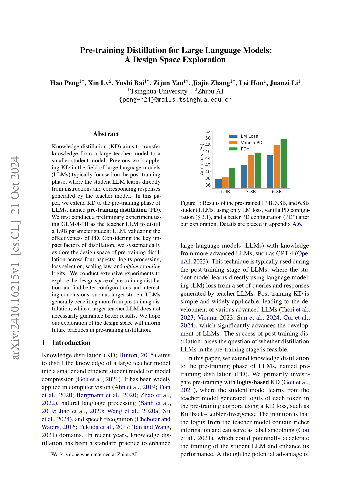
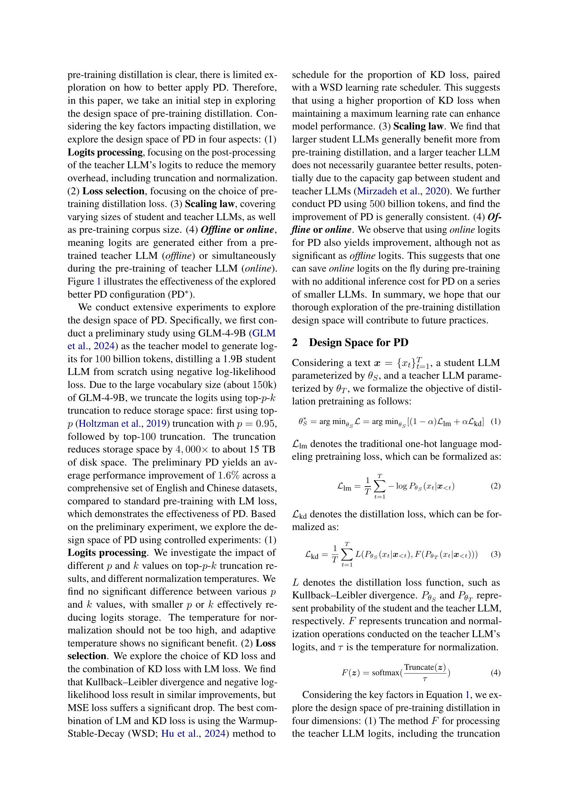
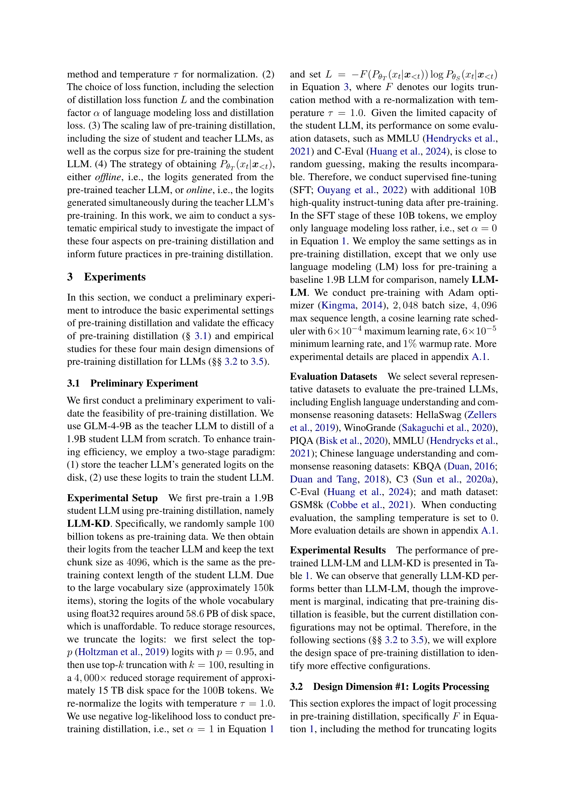
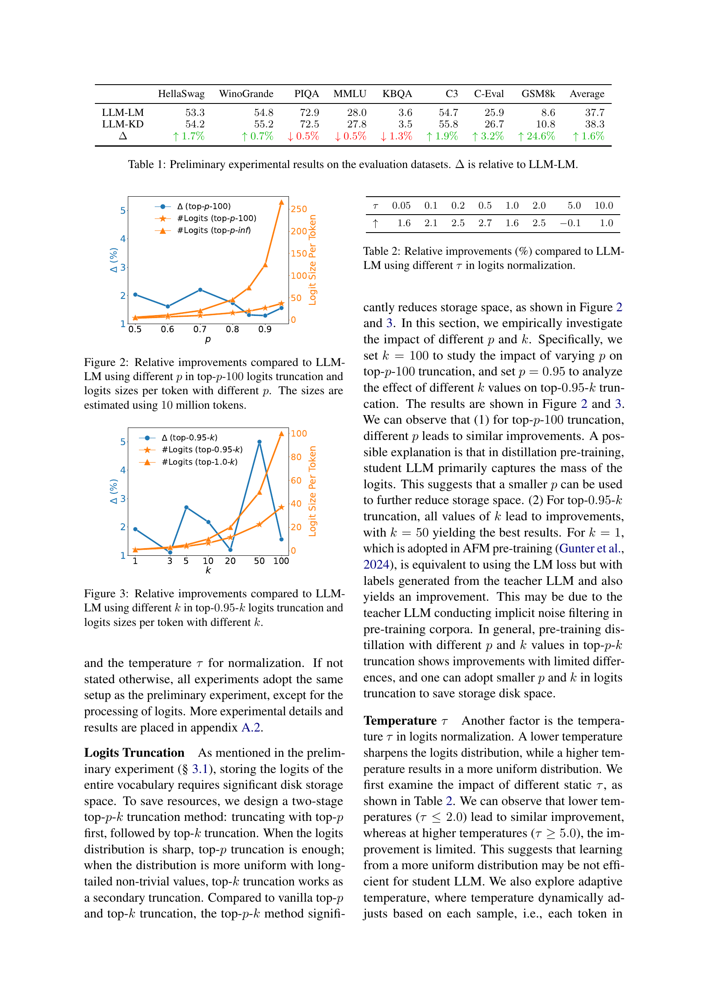
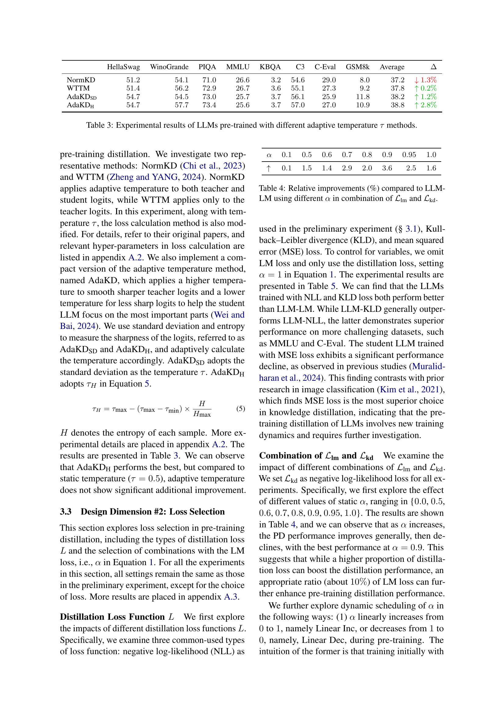

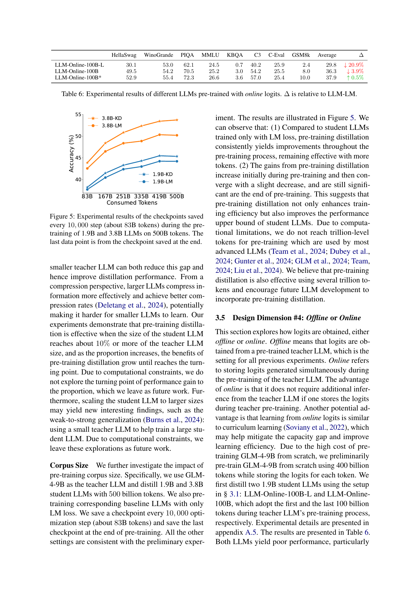
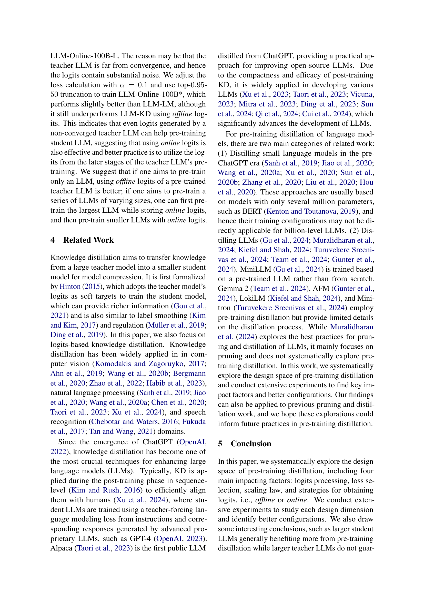

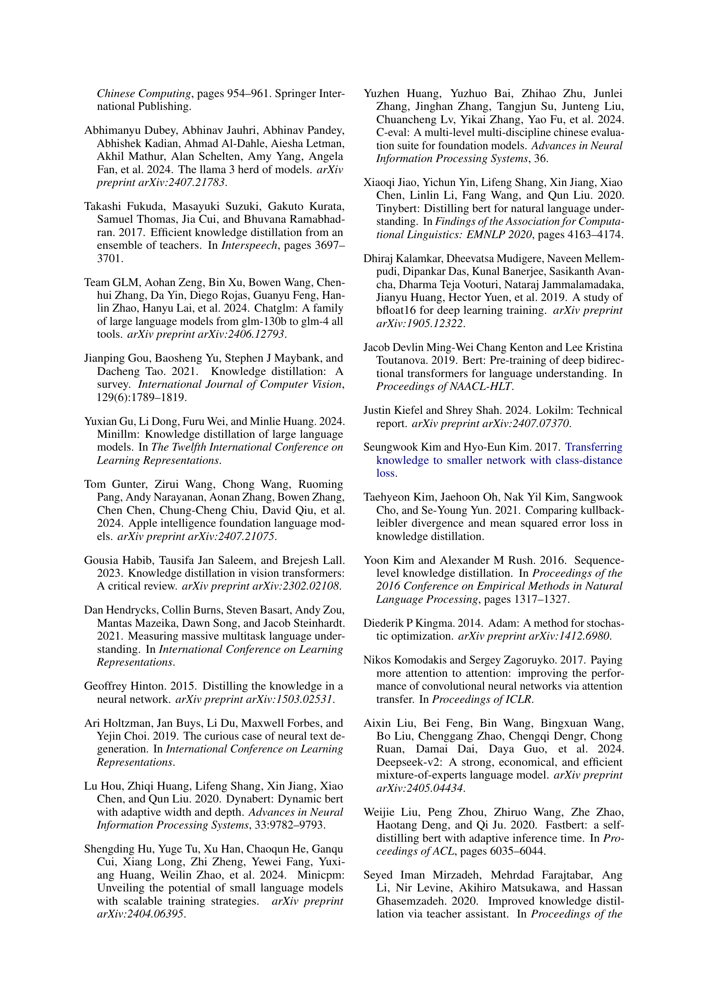
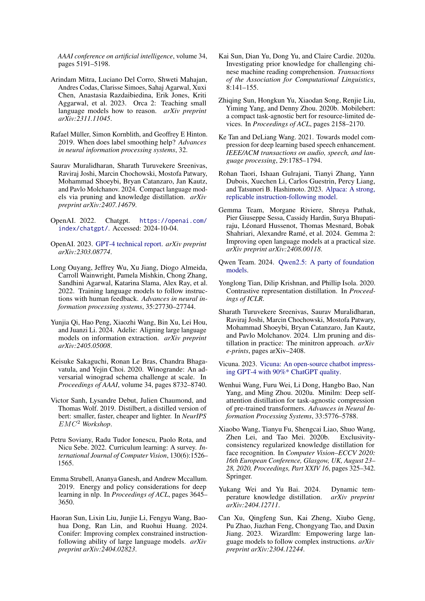

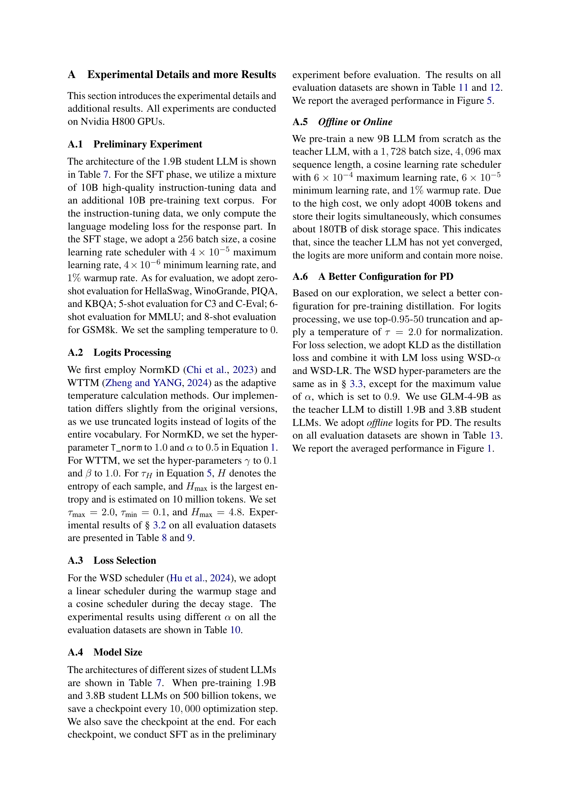
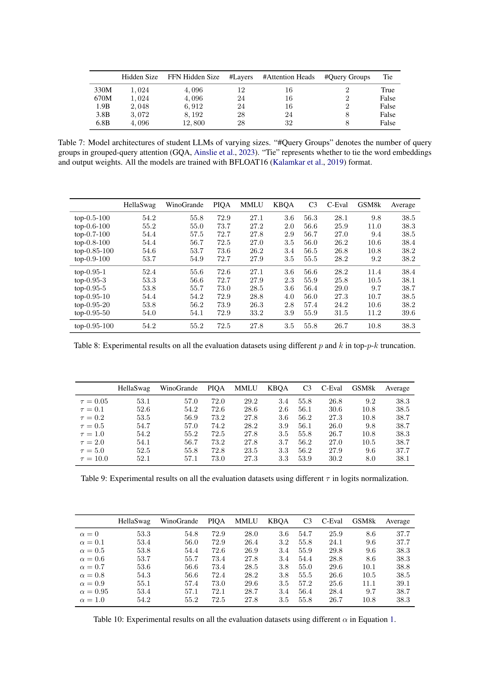

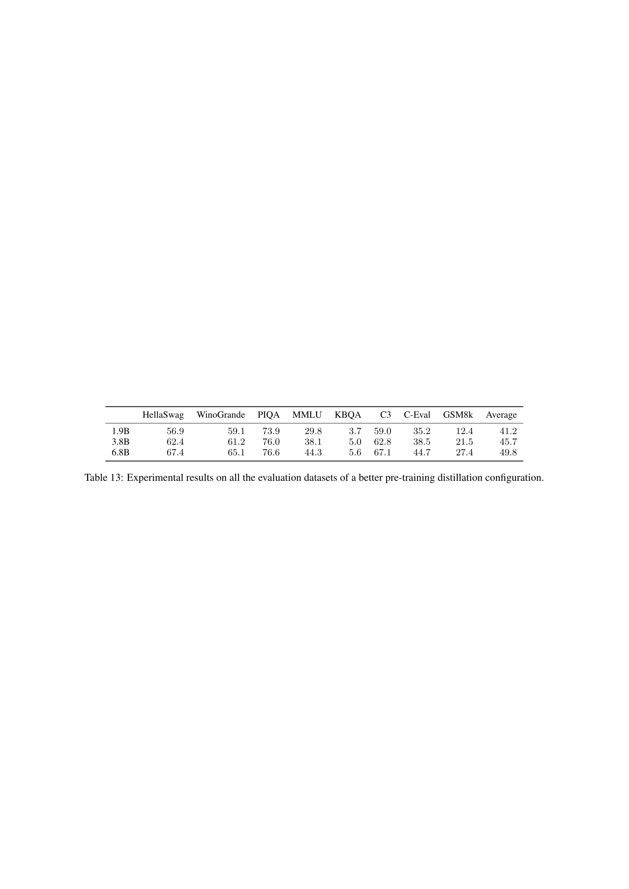
