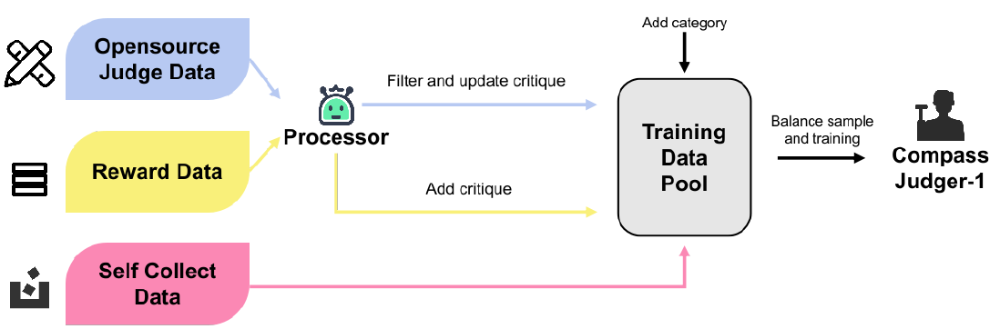
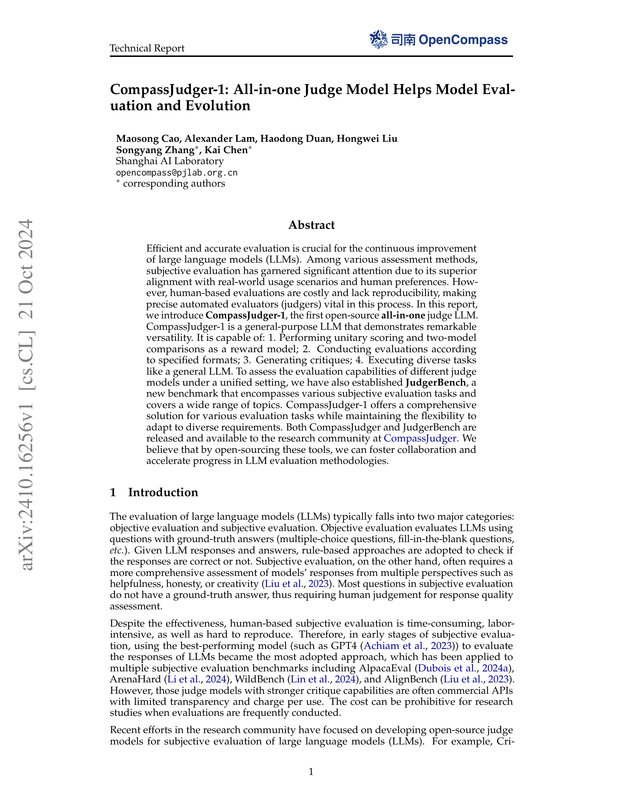
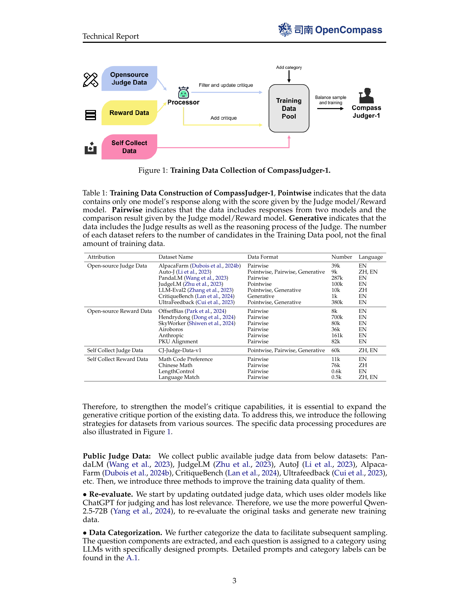
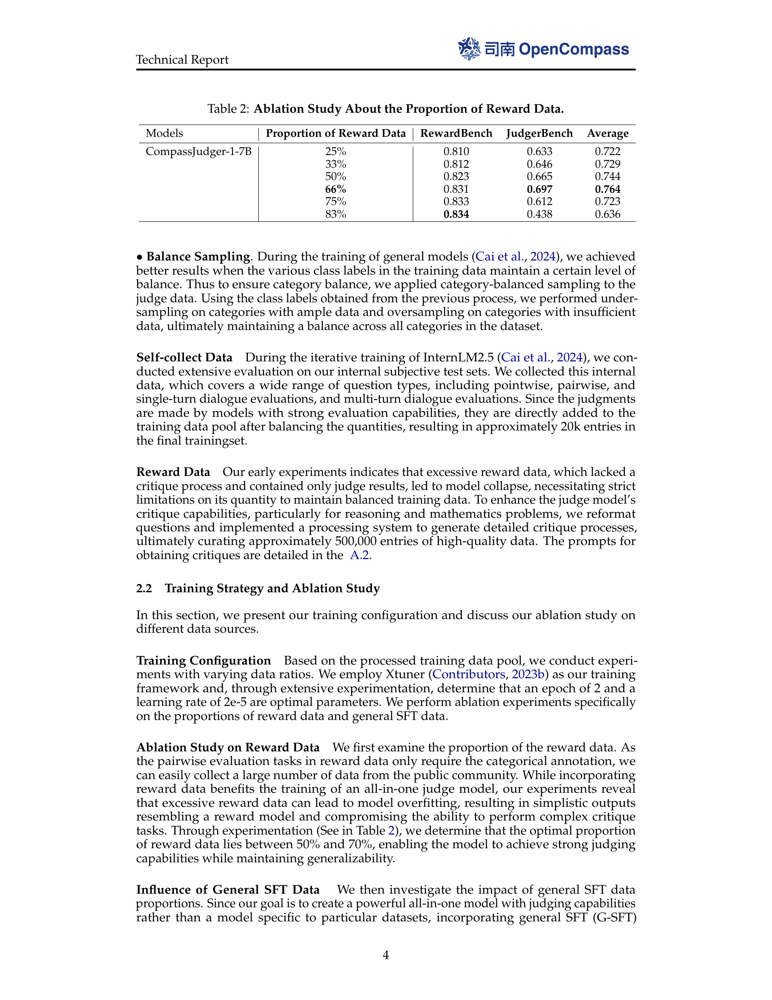
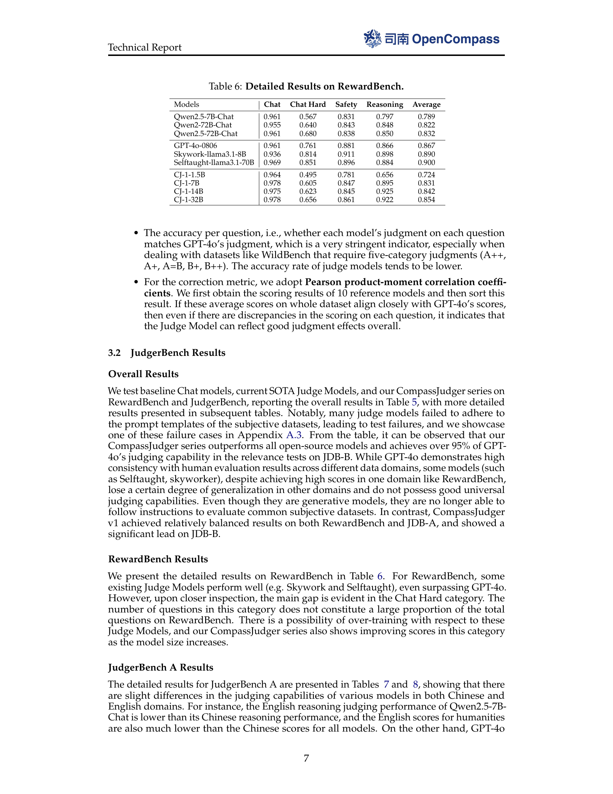
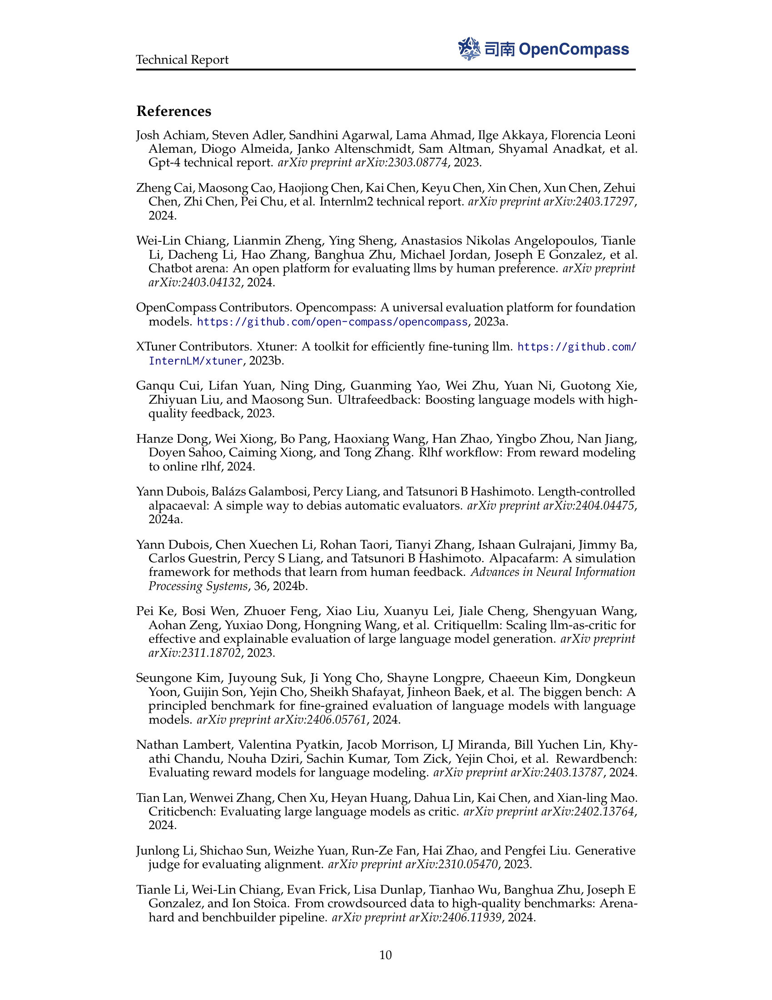

### TL;DR



This research introduces CompassJudger-1, a novel open-source large language model (LLM) designed to efficiently and accurately evaluate other LLMs.  Unlike previous judge models limited to specific tasks or formats, CompassJudger-1 offers an all-in-one solution. It excels at various tasks including providing scores, comparing models, generating critiques, and performing general LLM tasks. To ensure a unified evaluation, researchers also created JudgerBench, a new benchmark covering diverse subjective evaluation tasks.  The results demonstrate CompassJudger-1's superior performance and versatility compared to existing models. By open-sourcing both the model and the benchmark, this research aims to accelerate advancements in LLM evaluation.




 &nbsp; read the paper on arXiv


#### Why does it matter?
CompassJudger-1 is an open-source, all-in-one judge LLM for evaluating large language models, offering improved efficiency and reproducibility over human-based methods.
#### Key Takeaways


 CompassJudger-1 is a versatile LLM capable of unitary scoring, two-model comparisons, critique generation, and general LLM tasks. 



 JudgerBench, a new benchmark encompassing diverse subjective evaluation tasks, provides a unified setting for evaluating judge models. 



 Open-sourcing CompassJudger-1 and JudgerBench fosters collaboration and accelerates progress in LLM evaluation methodologies. 


------
#### Visual Insights

> The figure illustrates the data collection and processing pipeline for training the CompassJudger-1 model, including data sources, preprocessing steps, and model training.

{{< table-caption caption="🔽 Table 1: Training Data Construction of CompassJudger-1, Pointwise indicates that the data contains only one model's response along with the score given by the Judge model/Reward model. Pairwise indicates that the data includes responses from two models and the comparison result given by the Judge model/Reward model. Generative indicates that the data includes the Judge results as well as the reasoning process of the Judge. The number of each dataset refers to the number of candidates in the Training Data pool, not the final amount of training data." >}}
 <table id='5' style='font-size:14px'><tr><td>Attribution</td><td>Dataset Name</td><td>Data Format</td><td>Number</td><td>Language</td></tr><tr><td rowspan="7">Open-source Judge Data</td><td>AlpacaFarm (Dubois et al., 2024b)</td><td>Pairwise</td><td>39k</td><td>EN</td></tr><tr><td>Auto-J (Li et al., 2023)</td><td>Pointwise, Pairwise, Generative</td><td>9k</td><td>ZH, EN</td></tr><tr><td>PandaLM (Wang et al., 2023)</td><td>Pairwise</td><td>287k</td><td>EN</td></tr><tr><td>JudgeLM (Zhu et al., 2023)</td><td>Pointwise</td><td>100k</td><td>EN</td></tr><tr><td>LLM-Eval2 (Zhang et al., 2023)</td><td>Pointwise, Generative</td><td>10k</td><td>ZH</td></tr><tr><td>CritiqueBench (Lan et al., 2024)</td><td>Generative</td><td>1k</td><td>EN</td></tr><tr><td>UltraFeedback (Cui et al., 2023)</td><td>Pointwise, Generative</td><td>380k</td><td>EN</td></tr><tr><td rowspan="6">Open-source Reward Data</td><td>OffsetBias (Park et al., 2024)</td><td>Pairwise</td><td>8k</td><td>EN</td></tr><tr><td>Hendrydong (Dong et al., 2024)</td><td>Pairwise</td><td>700k</td><td>EN</td></tr><tr><td>SkyWorker (Shiwen et al., 2024)</td><td>Pairwise</td><td>80k</td><td>EN</td></tr><tr><td>Airoboros</td><td>Pairwise</td><td>36k</td><td>EN</td></tr><tr><td>Anthropic</td><td>Pairwise</td><td>161k</td><td>EN</td></tr><tr><td>PKU Alignment</td><td>Pairwise</td><td>82k</td><td>EN</td></tr><tr><td>Self Collect Judge Data</td><td>CJ-Judge-Data-v1</td><td>Pointwise, Pairwise, Generative</td><td>60k</td><td>ZH, EN</td></tr><tr><td rowspan="4">Self Collect Reward Data</td><td>Math Code Preference</td><td>Pairwise</td><td>11k</td><td>EN</td></tr><tr><td>Chinese Math</td><td>Pairwise</td><td>76k</td><td>ZH</td></tr><tr><td>LengthControl</td><td>Pairwise</td><td>0.6k</td><td>EN</td></tr><tr><td>Language Match</td><td>Pairwise</td><td>0.5k</td><td>ZH, EN</td></tr></table>

> Table 1 details the composition of the training dataset for CompassJudger-1, specifying the source, format, size, and language of each dataset.

### More visual insights

More on tables


 <table id='3' style='font-size:14px'><tr><td>Models</td><td>Proportion of Reward Data</td><td>RewardBench</td><td>JudgerBench</td><td>Average</td></tr><tr><td>CompassJudger-1-7B</td><td>25%</td><td>0.810</td><td>0.633</td><td>0.722</td></tr><tr><td></td><td>33%</td><td>0.812</td><td>0.646</td><td>0.729</td></tr><tr><td></td><td>50%</td><td>0.823</td><td>0.665</td><td>0.744</td></tr><tr><td></td><td>66%</td><td>0.831</td><td>0.697</td><td>0.764</td></tr><tr><td></td><td>75%</td><td>0.833</td><td>0.612</td><td>0.723</td></tr><tr><td></td><td>83%</td><td>0.834</td><td>0.438</td><td>0.636</td></tr></table>

> The table presents the ablation study results on the proportion of reward data used for training CompassJudger-1, showing the model's performance on RewardBench, JudgerBench, and their average across different reward data proportions.


 <table id='3' style='font-size:14px'><tr><td>Models</td><td>Judge Average</td><td>AlignBench</td><td>ArenaHard</td><td>Fofo</td><td>WildBench</td><td>Sub. Average</td></tr><tr><td>CJ-1-7B-w /o G-SFT</td><td>0.693</td><td>0.590</td><td>0.487</td><td>0.750</td><td>-0.071</td><td>0.490</td></tr><tr><td>CJ-1-7B-w. G-SFT</td><td>0.697</td><td>0.624</td><td>0.562</td><td>0.740</td><td>0.015</td><td>0.528</td></tr></table>

> The table presents the ablation study results of the impact of general SFT data on the CompassJudger model's performance across various benchmarks.


 <table id='3' style='font-size:14px'><tr><td>Dataset Name</td><td>Data Format</td><td>Turns</td><td>Scenario Label</td><td>Language</td></tr><tr><td>AlignBench</td><td>Pairwise</td><td>Single Turn</td><td>Daily Chat, Chinese Culture</td><td>ZH</td></tr><tr><td>ArenaHard</td><td>Pairwise</td><td>Single Turn</td><td>Daily Chat, Reasoning, Math, Code</td><td>EN</td></tr><tr><td>FoFo</td><td>Pointwise</td><td>Single Turn</td><td>Instruction Following</td><td>ZH, EN</td></tr><tr><td>WildBench</td><td>Pairwise</td><td>Single Turn, Multi Turn</td><td>Daily Chat</td><td>EN</td></tr></table>

> Table 4 details the subjective evaluation datasets used in JudgerBench part B, specifying their data format, number of turns, scenario label, and language.


<table id='5' style='font-size:14px'><tr><td>Models</td><td>RewardBench</td><td>I JDB-A EN</td><td>JDB-A CN</td><td>JDB-B Acc</td><td>JDB-B Corr</td><td>JudgerBench</td></tr><tr><td>Qwen2.5-7B-Chat</td><td>0.789</td><td>0.567</td><td>0.535</td><td>0.590</td><td>0.874</td><td>0.641</td></tr><tr><td>Qwen2-72B-Chat</td><td>0.822</td><td>0.588</td><td>0.584</td><td>0.625</td><td>0.935</td><td>0.683</td></tr><tr><td>Qwen2.5-72B-Chat</td><td>0.832</td><td>0.615</td><td>0.590</td><td>0.681</td><td>0.937</td><td>0.706</td></tr><tr><td>GPT-4o-0806</td><td>0.867</td><td>0.664</td><td>0.608</td><td>1</td><td>1</td><td>0.818</td></tr><tr><td>Skywork-llama3.1-8B</td><td>0.890</td><td>0.630</td><td>0.605</td><td>-</td><td>-</td><td>-</td></tr><tr><td>Selftaught-llama3.1-70B</td><td>0.900</td><td>0.443</td><td>0.570</td><td>0.598</td><td>0.869</td><td>0.620</td></tr><tr><td>CJ-1-1.5B</td><td>0.724</td><td>0.553</td><td>0.527</td><td>0.629</td><td>0.905</td><td>0.654</td></tr><tr><td>CJ-1-7B</td><td>0.831</td><td>0.570</td><td>0.583</td><td>0.687</td><td>0.948</td><td>0.697</td></tr><tr><td>CJ-1-14B</td><td>0.842</td><td>0.599</td><td>0.615</td><td>0.699</td><td>0.959</td><td>0.718</td></tr><tr><td>CJ-1-32B</td><td>0.854</td><td>0.614</td><td>0.612</td><td>0.720</td><td>0.963</td><td>0.727</td></tr></table>

> Table 5 presents the results of several models on RewardBench and JudgerBench, showing their performance on different evaluation metrics.


<table id='3' style='font-size:14px'><tr><td>Models</td><td>Chat</td><td>Chat Hard</td><td>Safety</td><td>Reasoning</td><td>Average</td></tr><tr><td>Qwen2.5-7B-Chat</td><td>0.961</td><td>0.567</td><td>0.831</td><td>0.797</td><td>0.789</td></tr><tr><td>Qwen2-72B-Chat</td><td>0.955</td><td>0.640</td><td>0.843</td><td>0.848</td><td>0.822</td></tr><tr><td>Qwen2.5-72B-Chat</td><td>0.961</td><td>0.680</td><td>0.838</td><td>0.850</td><td>0.832</td></tr><tr><td>GPT-4o-0806</td><td>0.961</td><td>0.761</td><td>0.881</td><td>0.866</td><td>0.867</td></tr><tr><td>Skywork-llama3.1-8B</td><td>0.936</td><td>0.814</td><td>0.911</td><td>0.898</td><td>0.890</td></tr><tr><td>Selftaught-llama3.1-70B</td><td>0.969</td><td>0.851</td><td>0.896</td><td>0.884</td><td>0.900</td></tr><tr><td>CJ-1-1.5B</td><td>0.964</td><td>0.495</td><td>0.781</td><td>0.656</td><td>0.724</td></tr><tr><td>CJ-1-7B</td><td>0.978</td><td>0.605</td><td>0.847</td><td>0.895</td><td>0.831</td></tr><tr><td>CJ-1-14B</td><td>0.975</td><td>0.623</td><td>0.845</td><td>0.925</td><td>0.842</td></tr><tr><td>CJ-1-32B</td><td>0.978</td><td>0.656</td><td>0.861</td><td>0.922</td><td>0.854</td></tr></table>

> The table presents a detailed breakdown of the performance of various models (including CompassJudger series and other LLMs) on the RewardBench dataset, showing their scores across different categories: Chat, Chat Hard, Safety, and Reasoning.


<table id='3' style='font-size:14px'><tr><td>Models</td><td>Teaser</td><td>AI</td><td>Roleplay</td><td>Chat</td><td>Math</td><td>Reasoning</td><td>Creation</td><td>Code</td><td>Science</td><td>Humanities</td></tr><tr><td>Qwen2.5-7B-Chat</td><td>0.54</td><td>0.59</td><td>0.59</td><td>0.46</td><td>0.69</td><td>0.43</td><td>0.61</td><td>0.65</td><td>0.58</td><td>0.52</td></tr><tr><td>Qwen2-72B-Chat</td><td>0.63</td><td>0.59</td><td>0.54</td><td>0.49</td><td>0.62</td><td>0.64</td><td>0.60</td><td>0.74</td><td>0.51</td><td>0.52</td></tr><tr><td>Qwen2.5-72B-Chat</td><td>0.68</td><td>0.57</td><td>0.57</td><td>0.47</td><td>0.78</td><td>0.64</td><td>0.58</td><td>0.75</td><td>0.61</td><td>0.52</td></tr><tr><td>GPT-4o-0806</td><td>0.82</td><td>0.53</td><td>0.62</td><td>0.61</td><td>0.83</td><td>0.67</td><td>0.67</td><td>0.73</td><td>0.64</td><td>0.55</td></tr><tr><td>Skywork-Ilama3.1-8B</td><td>0.69</td><td>0.61</td><td>0.54</td><td>0.62</td><td>0.63</td><td>0.64</td><td>0.60</td><td>0.69</td><td>0.74</td><td>0.53</td></tr><tr><td>Selftaught-llama3.1-70B</td><td>0.47</td><td>0.45</td><td>0.47</td><td>0.37</td><td>0.45</td><td>0.43</td><td>0.36</td><td>0.58</td><td>0.48</td><td>0.36</td></tr><tr><td>CJ-1-1.5B</td><td>0.42</td><td>0.56</td><td>0.56</td><td>0.43</td><td>0.66</td><td>0.47</td><td>0.55</td><td>0.78</td><td>0.64</td><td>0.44</td></tr><tr><td>CJ-1-7B</td><td>0.56</td><td>0.56</td><td>0.51</td><td>0.47</td><td>0.68</td><td>0.58</td><td>0.58</td><td>0.75</td><td>0.58</td><td>0.43</td></tr><tr><td>CJ-1-14B</td><td>0.66</td><td>0.51</td><td>0.57</td><td>0.54</td><td>0.72</td><td>0.61</td><td>0.56</td><td>0.74</td><td>0.61</td><td>0.47</td></tr><tr><td>CJ-1-32B</td><td>0.66</td><td>0.57</td><td>0.56</td><td>0.59</td><td>0.78</td><td>0.58</td><td>0.55</td><td>0.75</td><td>0.60</td><td>0.49</td></tr></table>

> This table presents the detailed results of different models on the English section of the JudgerBench Arena component, categorized by task type.


<table id='5' style='font-size:14px'><tr><td>Models</td><td>Teaser</td><td>AI</td><td>Roleplay</td><td>Chat</td><td>Math</td><td>Reasoning</td><td>Creation</td><td>Code</td><td>Science</td><td>Humanities</td></tr><tr><td>Qwen2.5-7B-Chat</td><td>0.46</td><td>0.58</td><td>0.36</td><td>0.45</td><td>0.70</td><td>0.53</td><td>0.52</td><td>0.53</td><td>0.52</td><td>0.64</td></tr><tr><td>Qwen2-72B-Chat</td><td>0.62</td><td>0.54</td><td>0.34</td><td>0.55</td><td>0.68</td><td>0.63</td><td>0.58</td><td>0.58</td><td>0.62</td><td>0.64</td></tr><tr><td>Qwen2.5-72B-Chat</td><td>0.65</td><td>0.47</td><td>0.49</td><td>0.47</td><td>0.71</td><td>0.60</td><td>0.57</td><td>0.58</td><td>0.69</td><td>0.60</td></tr><tr><td>GPT-4o-0806</td><td>0.77</td><td>0.56</td><td>0.51</td><td>0.53</td><td>0.67</td><td>0.66</td><td>0.63</td><td>0.58</td><td>0.62</td><td>0.58</td></tr><tr><td>Skywork-llama3.1-8B</td><td>0.62</td><td>0.58</td><td>0.58</td><td>0.59</td><td>0.63</td><td>0.58</td><td>0.60</td><td>0.61</td><td>0.60</td><td>0.61</td></tr><tr><td>Selftaught-llama3.1-70B</td><td>0.62</td><td>0.56</td><td>0.55</td><td>0.48</td><td>0.67</td><td>0.55</td><td>0.57</td><td>0.57</td><td>0.51</td><td>0.61</td></tr><tr><td>CJ-1-1.5B</td><td>0.54</td><td>0.58</td><td>0.38</td><td>0.38</td><td>0.62</td><td>0.63</td><td>0.54</td><td>0.52</td><td>0.55</td><td>0.54</td></tr><tr><td>CJ-1-7B</td><td>0.62</td><td>0.54</td><td>0.41</td><td>0.58</td><td>0.70</td><td>0.60</td><td>0.59</td><td>0.56</td><td>0.59</td><td>0.60</td></tr><tr><td>CJ-1-14B</td><td>0.69</td><td>0.61</td><td>0.51</td><td>0.55</td><td>0.71</td><td>0.68</td><td>0.60</td><td>0.58</td><td>0.61</td><td>0.65</td></tr><tr><td>CJ-1-32B</td><td>0.69</td><td>0.58</td><td>0.53</td><td>0.52</td><td>0.71</td><td>0.53</td><td>0.60</td><td>0.61</td><td>0.61</td><td>0.69</td></tr></table>

> Table 8 presents the detailed performance of different models on the Chinese section of JudgerBench A, broken down by task category.


 <table id='7' style='font-size:14px'><tr><td>Models</td><td>AlignBench</td><td>Fofo</td><td>WildBench</td><td>ArenaHard</td><td>Average</td></tr><tr><td>Qwen2.5-7B-Chat</td><td>0.777</td><td>0.670</td><td>0.470</td><td>0.444</td><td>0.590</td></tr><tr><td>Qwen2-72B-Chat</td><td>0.867</td><td>0.692</td><td>0.564</td><td>0.376</td><td>0.625</td></tr><tr><td>Qwen2.5-72B-Chat</td><td>0.878</td><td>0.677</td><td>0.599</td><td>0.570</td><td>0.681</td></tr><tr><td>Selftaught-llama3.1-70B</td><td>0.755</td><td>0.627</td><td>0.538</td><td>0.472</td><td>0.598</td></tr><tr><td>CJ-1-1.5B</td><td>0.822</td><td>0.712</td><td>0.550</td><td>0.430</td><td>0.629</td></tr><tr><td>CJ-1-7B</td><td>0.816</td><td>0.783</td><td>0.564</td><td>0.586</td><td>0.687</td></tr><tr><td>CJ-1-14B</td><td>0.839</td><td>0.787</td><td>0.566</td><td>0.602</td><td>0.699</td></tr><tr><td>CJ-1-32B</td><td>0.857</td><td>0.806</td><td>0.596</td><td>0.621</td><td>0.720</td></tr></table>

> Table 9 presents the accuracy results of different models on the JudgerBench B, which includes four datasets: AlignBench, FoFo, WildBench, and ArenaHard, showing the accuracy of each model on each dataset and the average accuracy across all four datasets.


 <table id='3' style='font-size:14px'><tr><td>Models</td><td>AlignBench</td><td>Fofo</td><td>WildBench</td><td>ArenaHard</td><td>Average</td></tr><tr><td>Qwen2.5-7B-Chat</td><td>0.916</td><td>0.681</td><td>0.967</td><td>0.931</td><td>0.874</td></tr><tr><td>Qwen2-72B-Chat</td><td>0.937</td><td>0.889</td><td>0.976</td><td>0.936</td><td>0.935</td></tr><tr><td>Qwen2.5-72B-Chat</td><td>0.964</td><td>0.916</td><td>0.958</td><td>0.912</td><td>0.937</td></tr><tr><td>Selftaught-llama3.1-70B</td><td>0.918</td><td>0.667</td><td>0.950</td><td>0.942</td><td>0.869</td></tr><tr><td>CJ-1-1.5B</td><td>0.928</td><td>0.851</td><td>0.981</td><td>0.858</td><td>0.905</td></tr><tr><td>CJ-1-7B</td><td>0.956</td><td>0.936</td><td>0.970</td><td>0.932</td><td>0.948</td></tr><tr><td>CJ-1-14B</td><td>0.966</td><td>0.956</td><td>0.965</td><td>0.951</td><td>0.959</td></tr><tr><td>CJ-1-32B</td><td>0.973</td><td>0.951</td><td>0.954</td><td>0.975</td><td>0.963</td></tr></table>

> The table presents the correlation results of several models' judgments on the JudgerBench B dataset, using the accuracy rate per question and the correlation results based on the overall model scores as evaluation metrics.


<table id='2' style='font-size:16px'><tr><td>References</td></tr><tr><td>Josh Achiam, Steven Adler, Sandhini Agarwal, Lama Ahmad, Ilge Akkaya, Florencia Leoni Aleman, Diogo Almeida, Janko Altenschmidt, Sam Altman, Shyamal Anadkat, et al. Gpt-4 technical report. arXiv preprint arXiv:2303.08774, 2023.</td></tr><tr><td>Zheng Cai, Maosong Cao, Haojiong Chen, Kai Chen, Keyu Chen, Xin Chen, Xun Chen, Zehui Chen, Zhi Chen, Pei Chu, et al. Internlm2 technical report. arXiv preprint arXiv:2403.17297, 2024.</td></tr><tr><td>Wei-Lin Chiang, Lianmin Zheng, Ying Sheng, Anastasios Nikolas Angelopoulos, Tianle Li, Dacheng Li, Hao Zhang, Banghua Zhu, Michael Jordan, Joseph E Gonzalez, et al. Chatbot arena: An open platform for evaluating llms by human preference. arXiv preprint arXiv:2403.04132, 2024.</td></tr><tr><td>OpenCompass Contributors. Opencompass: A universal evaluation platform for foundation models. https: //github. com/ open- compass/ opencompass, 2023a.</td></tr><tr><td>XTuner Contributors. Xtuner: A toolkit for efficiently fine-tuning llm. https ・・ / /github.com/ InternLM/xtuner, 2023b.</td></tr><tr><td>Ganqu Cui, Lifan Yuan, Ning Ding, Guanming Yao, Wei Zhu, Yuan Ni, Guotong Xie, Zhiyuan Liu, and Maosong Sun. Ultrafeedback: Boosting language models with high- quality feedback, 2023.</td></tr><tr><td>Hanze Dong, Wei Xiong, Bo Pang, Haoxiang Wang, Han Zhao, Yingbo Zhou, Nan Jiang, Doyen Sahoo, Caiming Xiong, and Tong Zhang. Rlhf workflow: From reward modeling to online rlhf, 2024.</td></tr><tr><td>Yann Dubois, Balazs Galambosi, Percy Liang, and Tatsunori B Hashimoto. Length-controlled alpacaeval: A simple way to debias automatic evaluators. arXiv preprint arXiv:2404.04475, 2024a.</td></tr><tr><td>Yann Dubois, Chen Xuechen Li, Rohan Taori, Tianyi Zhang, Ishaan Gulrajani, Jimmy Ba, Carlos Guestrin, Percy S Liang, and Tatsunori B Hashimoto. Alpacafarm: A simulation framework for methods that learn from human feedback. Advances in Neural Information Processing Systems, 36, 2024b.</td></tr><tr><td>Pei Ke, Bosi Wen, Zhuoer Feng, Xiao Liu, Xuanyu Lei, Jiale Cheng, Shengyuan Wang, Aohan Zeng, Yuxiao Dong, Hongning Wang, et al. Critiquellm: Scaling llm-as-critic for effective and explainable evaluation of large language model generation. arXiv preprint arXiv:2311.18702, 2023.</td></tr><tr><td>Seungone Kim, Juyoung Suk, Ji Yong Cho, Shayne Longpre, Chaeeun Kim, Dongkeun Yoon, Guijin Son, Yejin Cho, Sheikh Shafayat, Jinheon Baek, et al. The biggen bench: A principled benchmark for fine-grained evaluation of language models with language models. arXiv preprint arXiv:2406.05761, 2024.</td></tr><tr><td>Nathan Lambert, Valentina Pyatkin, Jacob Morrison, LJ Miranda, Bill Yuchen Lin, Khy- athi Chandu, Nouha Dziri, Sachin Kumar, Tom Zick, Yejin Choi, et al. Rewardbench: Evaluating reward models for language modeling. arXiv preprint arXiv:2403.13787, 2024.</td></tr><tr><td>Tian Lan, Wenwei Zhang, Chen Xu, Heyan Huang, Dahua Lin, Kai Chen, and Xian-ling Mao. Criticbench: Evaluating large language models as critic. arXiv preprint arXiv:2402.13764, 2024.</td></tr><tr><td>Junlong Li, Shichao Sun, Weizhe Yuan, Run-Ze Fan, Hai Zhao, and Pengfei Liu. Generative judge for evaluating alignment. arXiv preprint arXiv:2310.05470, 2023.</td></tr><tr><td>Tianle Li, Wei-Lin Chiang, Evan Frick, Lisa Dunlap, Tianhao Wu, Banghua Zhu, Joseph E Gonzalez, and Ion Stoica. From crowdsourced data to high-quality benchmarks: Arena- hard and benchbuilder pipeline. arXiv preprint arXiv:2406.11939, 2024.</td></tr></table>

> The table presents the ablation study results on different proportions of reward data used for training CompassJudger-1, evaluating performance across RewardBench, JudgerBench, and their average.

{{< table-caption caption="🔽 Table 1: Training Data Construction of CompassJudger-1, Pointwise indicates that the data contains only one model's response along with the score given by the Judge model/Reward model. Pairwise indicates that the data includes responses from two models and the comparison result given by the Judge model/Reward model. Generative indicates that the data includes the Judge results as well as the reasoning process of the Judge. The number of each dataset refers to the number of candidates in the Training Data pool, not the final amount of training data." >}}
<table id='2' style='font-size:16px'><tr><td>Bill Yuchen Lin, Yuntian Deng, Khyathi Chandu, Faeze Brahman, Abhilasha Ravichander, Valentina Pyatkin, Nouha Dziri, Ronan Le Bras, and Yejin Choi. Wildbench: Benchmark- ing llms with challenging tasks from real users in the wild. arXiv preprint arXiv:2406.04770, 2024.</td></tr><tr><td>Xiao Liu, Xuanyu Lei, Shengyuan Wang, Yue Huang, Zhuoer Feng, Bosi Wen, Jiale Cheng, Pei Ke, Yifan Xu, Weng Lam Tam, et al. Alignbench: Benchmarking chinese alignment of large language models. arXiv preprint arXiv:2311.18743, 2023.</td></tr><tr><td>Junsoo Park, Seungyeon Jwa, Meiying Ren, Daeyoung Kim, and Sanghyuk Choi. Offsetbias: Leveraging debiased data for tuning evaluators, 2024.</td></tr><tr><td>Tu Shiwen, Zhao Liang, Chris Yuhao Liu, Liang Zeng, and Yang Liu. Skywork critic model series. https : / /huggingface . co/Skywork, September 2024. URL https: / /huggingface. co/Skywork.</td></tr><tr><td>Yidong Wang, Zhuohao Yu, Zhengran Zeng, Linyi Yang, Cunxiang Wang, Hao Chen, Chaoya Jiang, Rui Xie, Jindong Wang, Xing Xie, et al. Pandalm: An automatic evaluation benchmark for llm instruction tuning optimization. arXiv preprint arXiv:2306.05087, 2023.</td></tr><tr><td>Congying Xia, Chen Xing, Jiangshu Du, Xinyi Yang, Yihao Feng, Ran Xu, Wenpeng Yin, and Caiming Xiong. Fofo: A benchmark to evaluate llms' format-following capability. arXiv preprint arXiv:2402.18667, 2024.</td></tr><tr><td>An Yang, Baosong Yang, Binyuan Hui, Bo Zheng, Bowen Yu, Chang Zhou, Chengpeng Li, Chengyuan Li, Dayiheng Liu, Fei Huang, et al. Qwen2 technical report. arXiv preprint arXiv:2407.10671, 2024.</td></tr><tr><td>Ming Zhang, Yue Zhang, Shichun Liu, Haipeng Yuan, Junzhe Wang, Yurui Dong, Jingyi Deng, Tao Gui, Qi Zhang, and Xuanjing Huang. LLMEval-2, July 2023. URL https: / /github . com/11meval/llmeval-2.</td></tr><tr><td>Lianghui Zhu, Xinggang Wang, and Xinlong Wang. Judgelm: Fine-tuned large language models are scalable judges. arXiv preprint arXiv:2310.17631, 2023.</td></tr></table>

> Table 1 details the composition of the CompassJudger-1 training dataset, specifying the source, format, size, and language of each dataset.

### Full paper



