### TL;DR



The paper introduces 3DGS-Enhancer, a novel method to enhance the quality of 3D Gaussian splatting (3DGS) for novel view synthesis.  3DGS is an efficient technique for creating realistic images, but it struggles when there aren't many input views.  3DGS-Enhancer solves this by using video diffusion priors, which are essentially AI models trained to create videos.  By cleverly transforming the view consistency issue into a problem of video consistency, it can restore view-consistent details and integrate them with the original 3DGS model.  The improved results make the 3DGS method far more robust and useful, especially in cases with limited data. Extensive experiments on large datasets show a huge increase in the quality of the generated images compared to existing techniques.




 &nbsp; read the paper on arXiv


#### Why does it matter?
To provide a concise and informative summary of the research paper on 3DGS-Enhancer, highlighting its key contributions, methods, findings, and importance for researchers.
#### Key Takeaways


 3DGS-Enhancer significantly improves the quality of 3D Gaussian splatting (3DGS) representations, especially in challenging scenarios with limited input views. 



 It leverages video diffusion priors to address the challenging 3D view consistency problem, reformulating it as a temporal consistency problem within video generation. 



 Extensive experiments demonstrate superior reconstruction performance and high-fidelity rendering results compared to state-of-the-art methods. 


------
#### Visual Insights

> The figure shows a comparison of 3D Gaussian splatting results with and without using the proposed 3DGS-Enhancer method on unbounded scenes with sparse input views, demonstrating the improvement in visual quality.


 <table id='1' style='font-size:14px'><tr><td></td><td colspan="3">3 views</td><td colspan="3">6 views</td><td colspan="3">9 views</td></tr><tr><td>Method</td><td>PSNR↑</td><td>SSIM↑</td><td>LPIPS↓</td><td>PSNR↑</td><td>SSIM↑</td><td>LPIPS↓</td><td>PSNR↑</td><td>SSIM↑</td><td>LPIPS↓</td></tr><tr><td colspan="10">DL3DV (130 training scenes, 20 test scenes)</td></tr><tr><td>Mip-NeRF [1]</td><td>10.92</td><td>0.191</td><td>0.618</td><td>11.56</td><td>0.199</td><td>0.608</td><td>12.42</td><td>0.218</td><td>0.600</td></tr><tr><td>RegNeRF [27]</td><td>11.46</td><td>0.214</td><td>0.600</td><td>12.69</td><td>0.236</td><td>0.579</td><td>12.33</td><td>0.219</td><td>0.598</td></tr><tr><td>FreeNeRF [43]</td><td>10.91</td><td>0.211</td><td>0.595</td><td>12.13</td><td>0.230</td><td>0.576</td><td>12.85</td><td>0.241</td><td>0.573</td></tr><tr><td>3DGS [18]</td><td>10.97</td><td>0.248</td><td>0.567</td><td>13.34</td><td>0.332</td><td>0.498</td><td>14.99</td><td>0.403</td><td>0.446</td></tr><tr><td>DNGaussian [19]</td><td>11.10</td><td>0.273</td><td>0.579</td><td>12.67</td><td>0.329</td><td>0.547</td><td>13.44</td><td>0.365</td><td>0.539</td></tr><tr><td>3DGS-Enhancer (ours)</td><td>14.33</td><td>0.424</td><td>0.464</td><td>16.94</td><td>0.565</td><td>0.356</td><td>18.50</td><td>0.630</td><td>0.305</td></tr></table>

> Table 1 quantitatively compares the performance of several few-shot 3D reconstruction methods across different numbers of input views on three datasets.

### More visual insights

More on figures

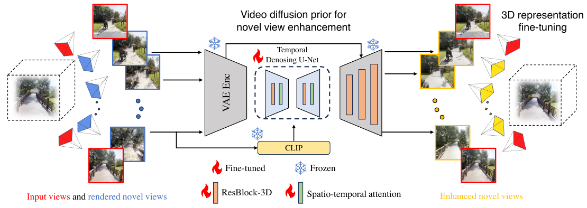

> The figure illustrates the 3DGS-Enhancer framework, showing how 2D video diffusion priors enhance novel views rendered by a 3DGS model, which are then used to fine-tune the model.

> Figure 4 presents a visual comparison of novel view synthesis results from various methods on scenes from the DL3DV test set using only three input views.

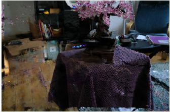

> The figure shows a comparison of rendered images, confidence map, and ground truth, highlighting areas of high and low confidence in the generated video.

> The figure shows a visual comparison of 3D Gaussian splatting (3DGS) and 3DGS enhanced by the proposed method (3DGS-Enhancer) on unbounded scenes with sparse input views, demonstrating improved quality and reduced artifacts in the enhanced results.

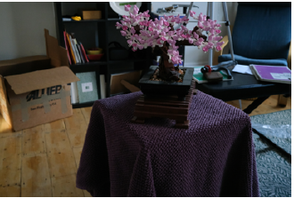

> The figure shows a comparison of rendered images, confidence map, and ground truth, highlighting areas of high and low confidence for generated video frames.

> The figure shows a comparison of rendered images, a confidence map, and ground truth, highlighting areas of high and low confidence in the generated images.

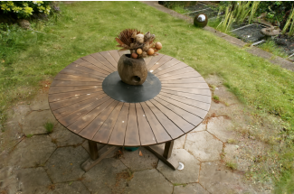

> The figure shows a comparison of 3D Gaussian splatting (3DGS) renderings with and without the proposed 3DGS-Enhancer on unbounded scenes using sparse input views.

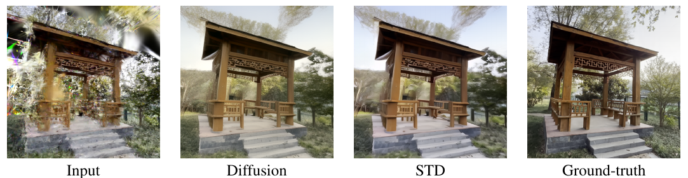

> The figure shows an ablation study comparing the input, video diffusion model output, spatial-temporal decoder output, and ground truth for a sample image, demonstrating the effectiveness of each component in improving image quality.

> This figure shows the fitting trajectories of cameras under different numbers of input views, illustrating how the trajectory fitting algorithm adapts to varying input conditions.

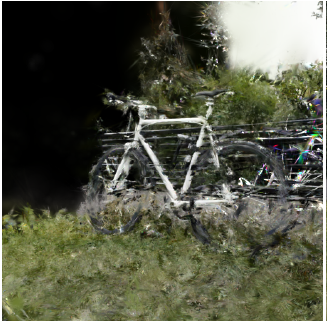

> Figure 3 shows a comparison of rendered images, a confidence map, and ground truth, highlighting areas of high and low confidence for generated video frames in the context of novel view synthesis.

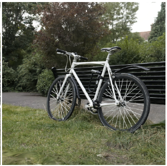

> The figure shows a comparison of 3D Gaussian splatting (3DGS) renderings with and without the proposed 3DGS-Enhancer, demonstrating improved quality with sparse input views.

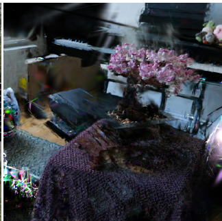

> The figure shows a comparison of rendered images, a confidence map, and ground truth images, highlighting areas of high and low confidence in the generated video.

> The figure shows a comparison of rendered images, a confidence map, and a ground truth image, highlighting areas of high and low confidence in the generated images.

> The figure shows example pairs of low-quality and high-quality images from the 3DGS Enhancement dataset, illustrating the types of artifacts the model is designed to correct.

More on tables


 <table id='15' style='font-size:14px'><tr><td rowspan="2">Method</td><td colspan="3">6 views</td><td colspan="3">9 views</td></tr><tr><td>PSNR ↑</td><td>SSIM ↑</td><td>LPIPS ↓</td><td>PSNR ↑</td><td>SSIM ↑</td><td>LPIPS ↓</td></tr><tr><td colspan="7">Mip-NeRF360 (all test scenes)</td></tr><tr><td>Mip-NeRF</td><td>13.08</td><td>0.159</td><td>0.637</td><td>13.73</td><td>0.189</td><td>0.628</td></tr><tr><td>RegNeRF</td><td>12.69</td><td>0.175</td><td>0.660</td><td>13.73</td><td>0.193</td><td>0.629</td></tr><tr><td>FreeNeRF</td><td>12.56</td><td>0.182</td><td>0.646</td><td>13.20</td><td>0.198</td><td>0.635</td></tr><tr><td>3DGS</td><td>11.53</td><td>0.144</td><td>0.651</td><td>12.65</td><td>0.187</td><td>0.607</td></tr><tr><td>DNGaussian</td><td>11.81</td><td>0.208</td><td>0.689</td><td>12.51</td><td>0.228</td><td>0.683</td></tr><tr><td>3DGS-Enhancer (ours)</td><td>13.96</td><td>0.260</td><td>0.570</td><td>16.22</td><td>0.399</td><td>0.454</td></tr></table>

> Table 2 quantitatively compares different methods' performance on the unseen Mip-NeRF360 dataset using PSNR, SSIM, and LPIPS metrics for 6 and 9 input views.


 <table id='1' style='font-size:14px'><tr><td>Video diffusion</td><td>Real image</td><td>Image confidence</td><td>Pixel confidence</td><td>PSNR↑</td><td>SSIM↑</td><td>LPIPS↓</td></tr><tr><td></td><td></td><td>-</td><td>-</td><td>14.33</td><td>0.476</td><td>0.422</td></tr><tr><td></td><td></td><td>-</td><td>-</td><td>17.01</td><td>0.553</td><td>0.361</td></tr><tr><td></td><td></td><td></td><td></td><td>17.29</td><td>0.570</td><td>0.354</td></tr><tr><td></td><td></td><td></td><td></td><td>17.16 17.34</td><td>0.564 0.574</td><td>0.351 0.351</td></tr></table>

> Table 1 quantitatively compares the performance of several few-shot 3D reconstruction methods across different numbers of input views on three datasets.


 <table id='3' style='font-size:14px'><tr><td>Video diffusion</td><td>STD (temporal layers)</td><td>color correction</td><td>PSNR ↑</td><td>SSIM ↑</td><td>LPIPS ↓</td></tr><tr><td></td><td></td><td>-</td><td>18.11</td><td>0.591</td><td>0.312</td></tr><tr><td></td><td></td><td>-</td><td>18.44</td><td>0.625</td><td>0.306</td></tr><tr><td></td><td></td><td></td><td>18.50</td><td>0.630</td><td>0.305</td></tr></table>

> Table 1 quantitatively compares the performance of different few-shot 3D reconstruction methods on the DL3DV and Mip-NeRF 360 datasets, evaluating metrics such as PSNR, SSIM, and LPIPS.


 <table id='11' style='font-size:20px'><tr><td>Method</td><td>Per-scene training time ↓</td><td>Rendering FPS ↑</td></tr><tr><td>Mip-NeRF</td><td>10.7h</td><td>0.09</td></tr><tr><td>RegNeRF</td><td>2.5h</td><td>0.09</td></tr><tr><td>FreeNeRF</td><td>3.8h</td><td>0.09</td></tr><tr><td>3DGS</td><td>10.5min</td><td>100</td></tr><tr><td>DNGaussian</td><td>3.3min</td><td>100</td></tr><tr><td>3DGS-Enhancer (ours)</td><td>24.5min</td><td>100</td></tr></table>

> Table 1 quantitatively compares the performance of several few-shot 3D reconstruction methods across different numbers of input views on three datasets (DL3DV, LLFF, and Mip-NeRF 360), evaluating PSNR, SSIM, and LPIPS scores.

### Full paper



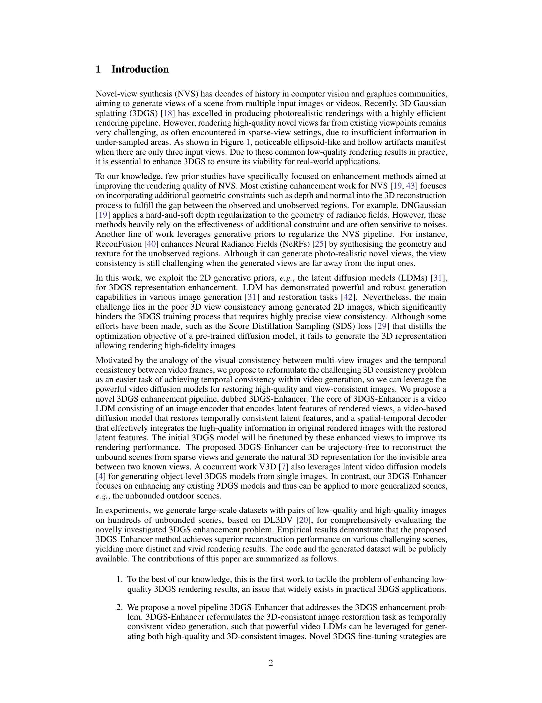

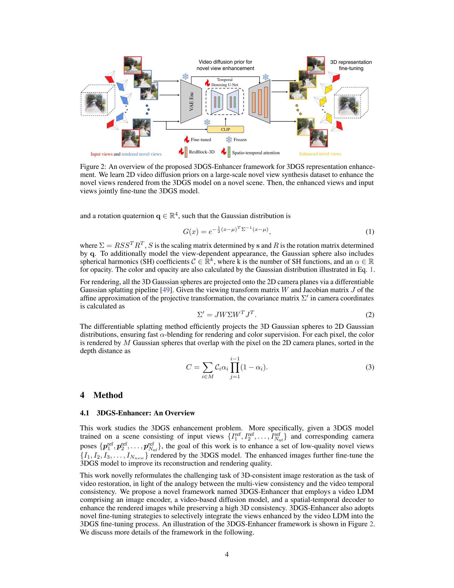

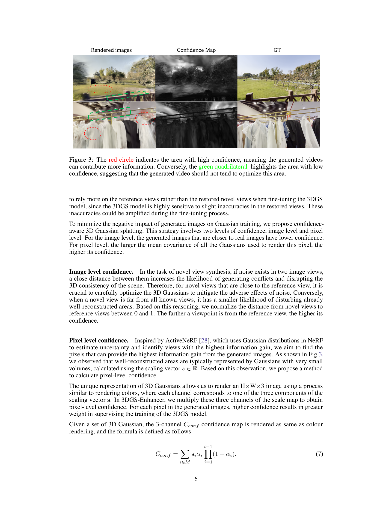
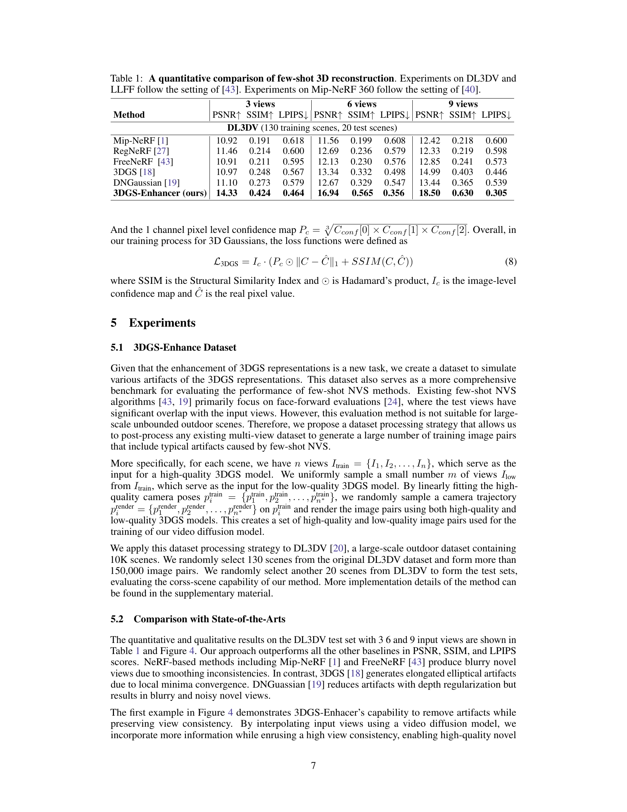

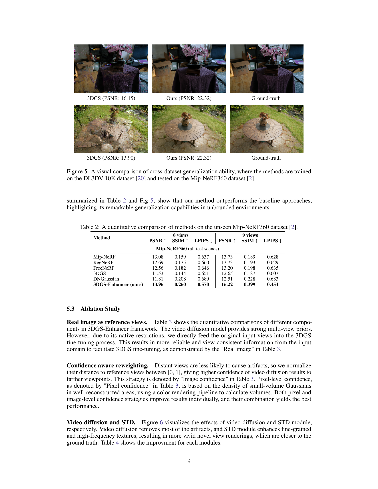

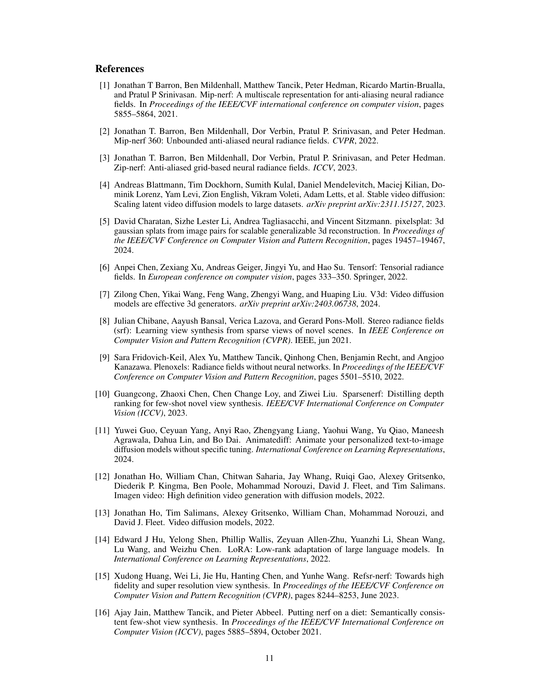
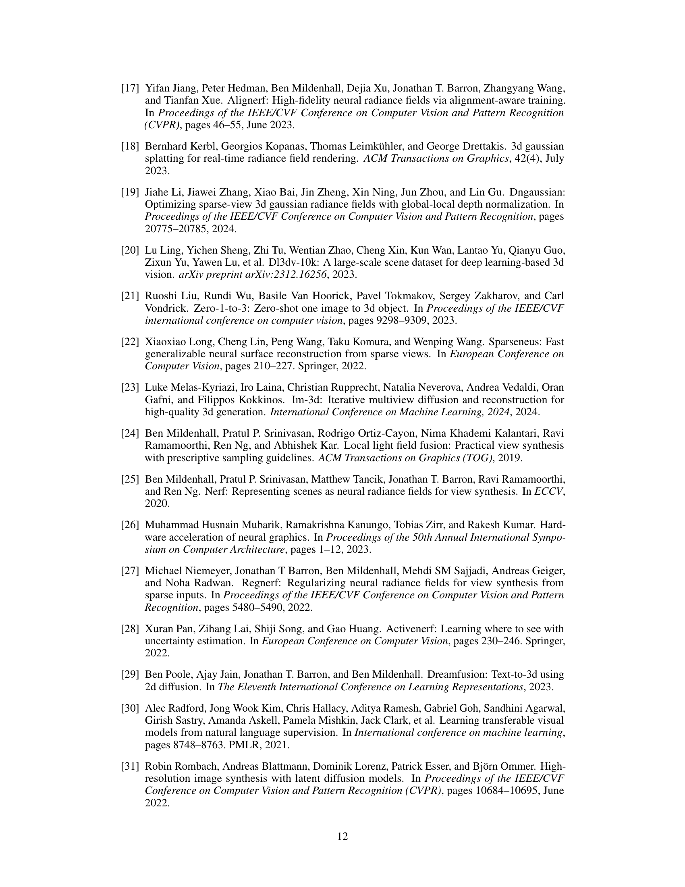

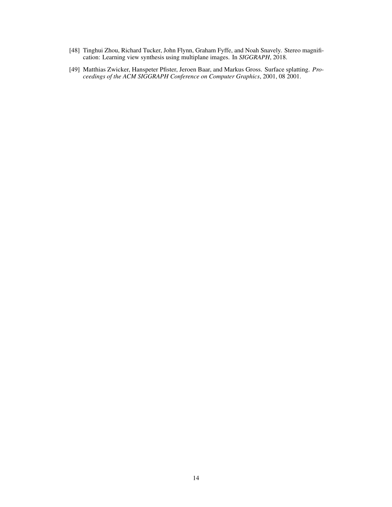

