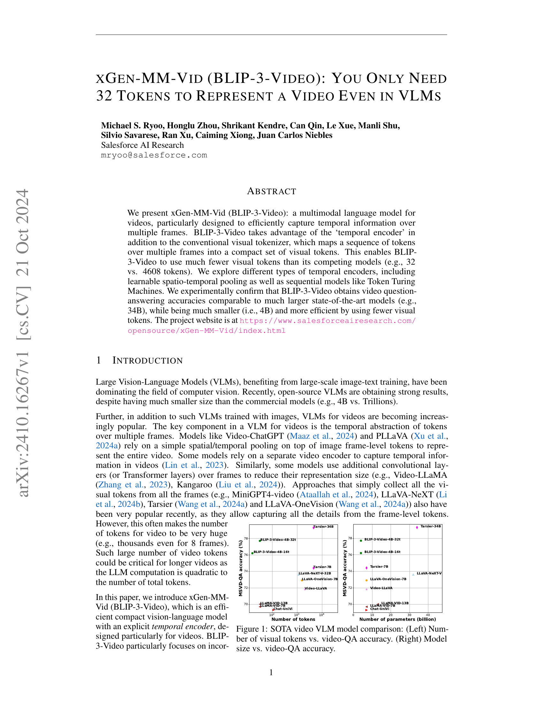
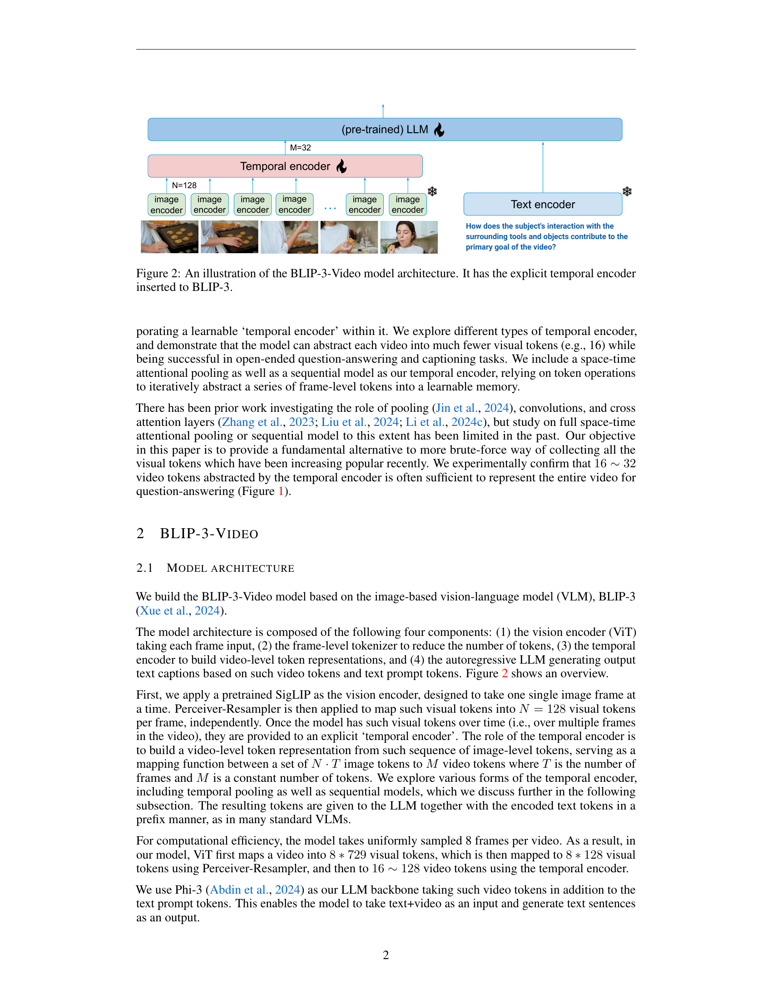
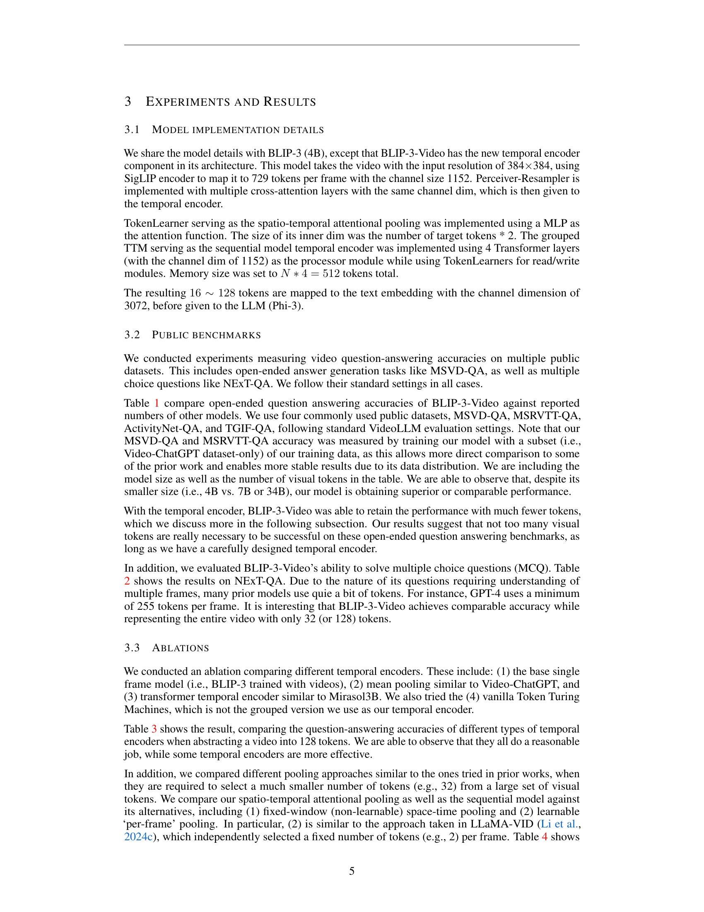
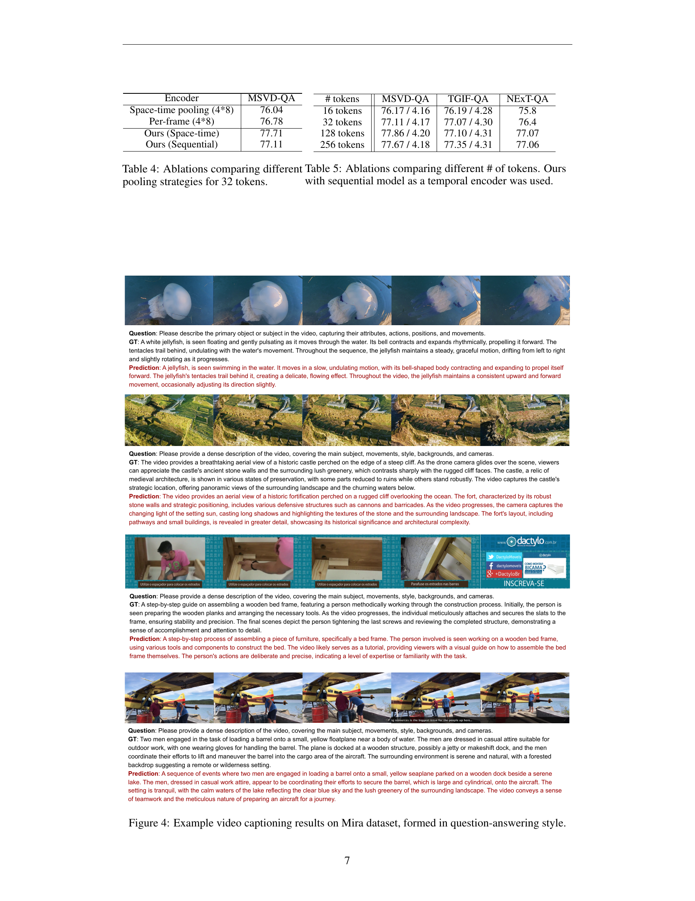
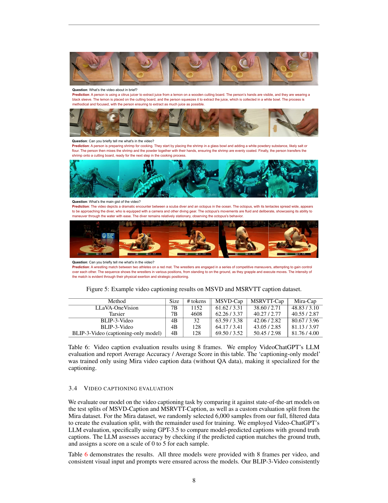
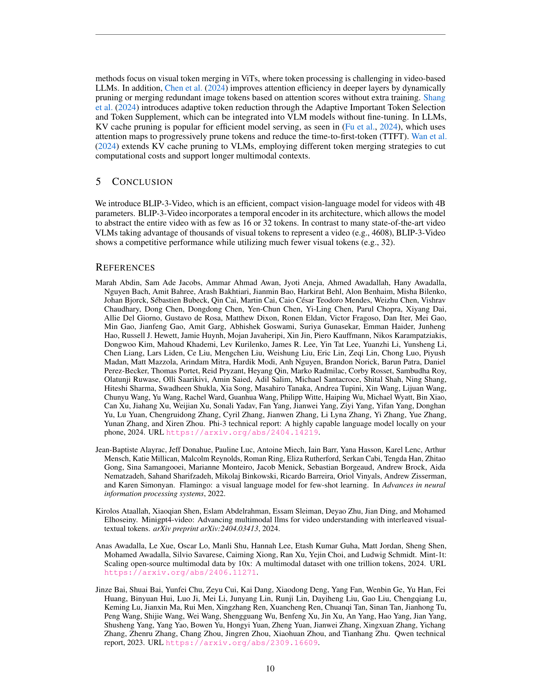
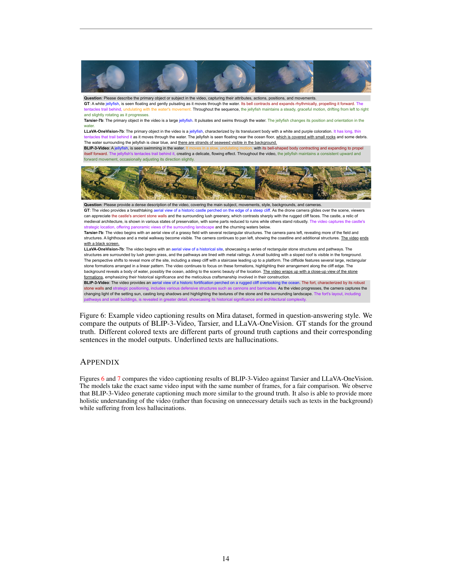

### TL;DR



This paper introduces xGen-MM-Vid (BLIP-3-Video), a new model for understanding videos.  Unlike previous models that used thousands of visual tokens to describe a video, BLIP-3-Video cleverly uses a 'temporal encoder' to represent a video using only 32 tokens.  This drastically reduces computation while maintaining or improving accuracy in tasks like answering questions about videos.  Experiments show it performs similarly to much larger models, highlighting its efficiency.  Different types of temporal encoders were explored, with attentional pooling showing the best results. The model was trained in stages, starting with image captioning, then video captioning, and finally video question answering using multiple datasets. The result is a compact and accurate model ideal for handling videos efficiently.




 &nbsp; read the paper on arXiv


#### Why does it matter?
To provide a concise and informative summary of the research paper on xGen-MM-Vid (BLIP-3-Video), highlighting its key contributions, findings, and importance to researchers.
#### Key Takeaways


 BLIP-3-Video uses a novel temporal encoder to significantly reduce the number of visual tokens needed to represent a video (32 tokens vs. thousands in other models). 



 Despite its smaller size (4B parameters), BLIP-3-Video achieves comparable or better video question-answering accuracy than much larger state-of-the-art models. 



 The model's efficiency is demonstrated through its speed; it processes many more samples per second compared to models using a much larger number of tokens. 


------
#### Visual Insights

> The figure illustrates the architecture of the BLIP-3-Video model, showing its components including a temporal encoder inserted into BLIP-3.

 Number of visual tokens vs. video-QA accuracy. (Right) Model size vs. video-QA accuracy.")

> The chart compares state-of-the-art video Vision-Language Models (VLMs) based on the number of visual tokens used and the model size against their video question answering accuracy.


<table id='0' style='font-size:14px'><tr><td>Method</td><td>Size</td><td>#tokens</td><td>MSVD-QA</td><td>MSRVTT-QA</td><td>ActivityNet-QA</td><td>TGIF-QA</td></tr><tr><td>VideoChat (Li et al., 2023b)</td><td>7B</td><td>32</td><td>56.3/2.8</td><td>45.0/2.5</td><td>-/2.2</td><td>34.4/2.3</td></tr><tr><td>Video-LLaMA (Zhang et al., 2023)</td><td>7B</td><td>32</td><td>51.6/2.5</td><td>29.6/1.8</td><td>12.4/1.1</td><td>-/-</td></tr><tr><td>Video-ChatGPT (Maaz et al., 2024)</td><td>7B</td><td>264+</td><td>64.9/3.3</td><td>49.3/2.8</td><td>34.2/2.8</td><td>51.4/3.0</td></tr><tr><td>Chat-UniVi (Jin et al., 2024)</td><td>7B</td><td>112</td><td>69.3 /3.7</td><td>55.0 /3.1</td><td>46.1 /3.3</td><td>69.0/3.8</td></tr><tr><td>LLaMA-VID (Li et al., 2024c)</td><td>7B</td><td>32</td><td>69.7 /3.7</td><td>57.7 /3.2</td><td>47.4/3.3</td><td>-</td></tr><tr><td>LLaMA-VID (Li et al., 2024c)</td><td>13B</td><td>32</td><td>70.0 / 3.7</td><td>58.9 /3.3</td><td>47.5 /3.3</td><td>-</td></tr><tr><td>Video-LLaVA (Lin et al., 2023)</td><td>7B</td><td>2048</td><td>71.8 /3.9</td><td>59.2 /3.5</td><td>45.3 /3.3</td><td>70.0/4.0</td></tr><tr><td>MiniGPT4- Video (Ataallah et al., 2024)</td><td>7B</td><td>2880+</td><td>73.9 / 4.1</td><td>59.7/3.3</td><td>46.3 /3.4</td><td>72.2 /4.1</td></tr><tr><td>PLLaVA (Xu et al., 2024a)</td><td>7B</td><td>576+</td><td>76.6 / 4.1</td><td>62.0 /3.5</td><td>56.3 /3.5</td><td>77.5 / 4.1</td></tr><tr><td>SlowFast-LLaVA Xu et al. (2024b)</td><td>7B</td><td>3680</td><td>79.1 / 4.1</td><td>65.8 /3.6</td><td>56.3/3.4</td><td>78.7 / 4.2</td></tr><tr><td>LLaVA-Hound-DPO Zhang et al. (2024b)</td><td>7B</td><td>2048</td><td>80.7 /4.1</td><td>70.2/3.7</td><td>-/-</td><td>61.4/3.5</td></tr><tr><td>LLaVA-OneVision* (Wang et al., 2024a)</td><td>7B</td><td>1568</td><td>72.9 /3.9</td><td>57.8 /3.4</td><td>55.3/3.6</td><td>41.1 /3.1</td></tr><tr><td>Tarsier (Wang et al., 2024a)</td><td>7B</td><td>4608+</td><td>77.0/4.1</td><td>62.0/3.5</td><td>59.5/3.6</td><td>79.2/4.2</td></tr><tr><td>Tarsier * (Wang et al., 2024a)</td><td>7B</td><td>4608</td><td>74.4/4.0</td><td>59.1/3.4</td><td>54.3 /3.5</td><td>-/-</td></tr><tr><td>PLLaVA (Xu et al., 2024a)</td><td>34B</td><td>576+</td><td>79.9/4.2</td><td>68.7/3.8</td><td>60.9/3.7</td><td>80.6/4.3</td></tr><tr><td>LLaVA-NeXT-Video* (Li et al., 2024b)</td><td>32B</td><td>1152</td><td>73.6/4.0</td><td>56.8/3.4</td><td>58.4/3.6</td><td>73.5/4.1</td></tr><tr><td>Tarsier (Wang et al., 2024a)</td><td>34B</td><td>4608+</td><td>80.3/4.2</td><td>66.4/3.7</td><td>61.6/3.7</td><td>82.5/4.4</td></tr><tr><td>Tarsier * (Wang et al., 2024a)</td><td>34B</td><td>4608</td><td>79.3/4.1</td><td>62.2/3.5</td><td>61.5/3.7</td><td>-/-</td></tr><tr><td>BLIP-3-Video</td><td>4B</td><td>32</td><td>77.7/4.2</td><td>60.0/3.6</td><td>55.7/3.5</td><td>76.5/4.3</td></tr><tr><td>BLIP-3-Video</td><td>4B</td><td>128</td><td>77.9/4.3</td><td>59.7/3.6</td><td>56.9/3.6</td><td>77.1/4.3</td></tr></table>

> Table 1 compares the performance of BLIP-3-Video against other state-of-the-art models on open-ended video question answering tasks, considering model size and the number of visual tokens used.

### More visual insights

More on figures

 and (d) are particularly effective, as we discuss further in the experiments.")

> Figure 3 visually compares four different types of temporal encoders used in the BLIP-3-Video model architecture, highlighting the attentional pooling and sequential model as particularly effective.

 Number of visual tokens vs. video-QA accuracy. (Right) Model size vs. video-QA accuracy.")

> The figure compares state-of-the-art video VLMs in terms of their video question answering accuracy against the number of visual tokens used and model size.

 Number of visual tokens vs. video-QA accuracy. (Right) Model size vs. video-QA accuracy.")

> The figure compares state-of-the-art video Vision-Language Models in terms of their size, number of visual tokens, and video question answering accuracy.

 Number of visual tokens vs. video-QA accuracy. (Right) Model size vs. video-QA accuracy.")

> The figure compares state-of-the-art video VLMs in terms of model size, number of visual tokens, and video question answering accuracy.

 Number of visual tokens vs. video-QA accuracy. (Right) Model size vs. video-QA accuracy.")

> The figure compares state-of-the-art video VLMs in terms of video question answering accuracy against the number of visual tokens and model size.

> The figure shows example video captioning results from the BLIP-3-Video model and compares its performance against Tarsier and LLaVA-OneVision on the Mira dataset, highlighting differences in caption quality and hallucination rates.

> The figure shows example video captioning results of three different models on the Mira dataset, presented in a question-answering format, comparing the models' outputs with the ground truth captions.

 Number of visual tokens vs. video-QA accuracy. (Right) Model size vs. video-QA accuracy.")

> The figure compares state-of-the-art video VLMs in terms of their video question answering accuracy, number of visual tokens, and model size.

 Number of visual tokens vs. video-QA accuracy. (Right) Model size vs. video-QA accuracy.")

> The figure compares state-of-the-art video VLMs in terms of the number of visual tokens used versus video question answering accuracy and model size.

 Number of visual tokens vs. video-QA accuracy. (Right) Model size vs. video-QA accuracy.")

> The figure compares state-of-the-art video Vision-Language Models in terms of their video question answering accuracy against the number of visual tokens used and model size.

 Number of visual tokens vs. video-QA accuracy. (Right) Model size vs. video-QA accuracy.")

> The figure shows a comparison of state-of-the-art video Vision-Language Models in terms of the number of visual tokens used and model size against video question answering accuracy.

 Number of visual tokens vs. video-QA accuracy. (Right) Model size vs. video-QA accuracy.")

> The figure compares state-of-the-art video Vision-Language Models in terms of their video question answering accuracy against the number of visual tokens used and their model sizes.

 Number of visual tokens vs. video-QA accuracy. (Right) Model size vs. video-QA accuracy.")

> The figure shows a comparison of state-of-the-art video vision-language models in terms of their size, number of visual tokens, and video question answering accuracy.

More on tables


<table id='2' style='font-size:16px'><tr><td>Method</td><td>Size</td><td>#tokens</td><td>NExT-QA</td></tr><tr><td>LangRepo (Kahatapitiya et al., 2024)</td><td>7B</td><td>3136+</td><td>54.6</td></tr><tr><td>LangRepo (Kahatapitiya et al., 2024)</td><td>12B</td><td>3136+</td><td>60.9</td></tr><tr><td>Tarsier (Wang et al., 2024a)</td><td>7B</td><td>4608+</td><td>71.6</td></tr><tr><td>LLoVi (Zhang et al., 2024a)</td><td>157B</td><td>1000s</td><td>67.7</td></tr><tr><td>IG- VLM (Kim et al., 2024)</td><td>34B</td><td>1536+</td><td>70.9</td></tr><tr><td>VideoAgent (Wang et al., 2024b)</td><td>GPT-4</td><td>2091+</td><td>71.3</td></tr><tr><td>VideoTree (Wang et al., 2024c)</td><td>GPT-4</td><td>3978+</td><td>73.5</td></tr><tr><td>Tarsier (Wang et al., 2024a)</td><td>34B</td><td>4608+</td><td>79.2</td></tr><tr><td>BLIP-3-Video</td><td>4B</td><td>32</td><td>76.4</td></tr><tr><td>BLIP-3-Video</td><td>4B</td><td>128</td><td>77.1</td></tr></table>

> Table 2 compares the performance of BLIP-3-Video against other models on multiple-choice video question answering tasks, showing its accuracy using different numbers of tokens.


<table id='6' style='font-size:16px'><tr><td>Encoder</td><td>MSVD-QA</td><td>TGIF-QA</td><td>ActivityNet-QA</td><td>NExT-QA</td></tr><tr><td>1 frame</td><td>71.49/4.01</td><td>72.74/ 4.16</td><td>51.83 /3.39</td><td>72.79</td></tr><tr><td>Mean pooling</td><td>76.75 / 4.17</td><td>77.01 /4.30</td><td>55.89 / 3.53</td><td>76.24</td></tr><tr><td>Transformer</td><td>76.24 /4.15</td><td>76.33 / 4.28</td><td>55.59 / 3.50</td><td>76.34</td></tr><tr><td>Vanilla Token Turing Machine</td><td>76.42 / 4.15</td><td>75.80 / 4.26</td><td>54.45 /3.48</td><td>75.42</td></tr><tr><td>Ours (Space-time)</td><td>77.49 / 4.18</td><td>76.90 / 4.29</td><td>56.94 / 3.56</td><td>76.27</td></tr><tr><td>Ours (Sequential)</td><td>77.86 / 4.20</td><td>77.10/ 4.31</td><td>56.66 /3.56</td><td>77.07</td></tr></table>

> Table 3 shows the ablation study comparing different temporal encoders in terms of question-answering accuracy on four datasets, using 128 tokens for each video.


<table id='0' style='font-size:18px'><tr><td>Encoder</td><td>MSVD-QA</td><td># tokens</td><td>MSVD-QA</td><td>TGIF-QA</td><td>NExT-QA</td></tr><tr><td>Space-time pooling (4*8)</td><td>76.04</td><td>16 tokens</td><td>76.17/4.16</td><td>76.19 / 4.28</td><td>75.8</td></tr><tr><td>Per-frame (4*8)</td><td>76.78</td><td>32 tokens</td><td>77.11 / 4.17</td><td>77.07 / 4.30</td><td>76.4</td></tr><tr><td>Ours (Space-time)</td><td>77.71</td><td>128 tokens</td><td>77.86 / 4.20</td><td>77.10 / 4.31</td><td>77.07</td></tr><tr><td>Ours (Sequential)</td><td>77.11</td><td>256 tokens</td><td>77.67 / 4.18</td><td>77.35 / 4.31</td><td>77.06</td></tr></table>

> The table compares different pooling strategies for 32 tokens, showing their effects on MSVD-QA, TGIF-QA, and NEXT-QA.


<table id='13' style='font-size:18px'><tr><td>Method</td><td>Size</td><td># tokens</td><td>MSVD-Cap</td><td>MSRVTT-Cap</td><td>Mira-Cap</td></tr><tr><td>LLaVA-One Vision</td><td>7B</td><td>1152</td><td>61.62 / 3.31</td><td>38.60 /2.71</td><td>48.83 / 3.10</td></tr><tr><td>Tarsier</td><td>7B</td><td>4608</td><td>62.26 / 3.37</td><td>40.27 /2.77</td><td>40.55 / 2.87</td></tr><tr><td>BLIP-3-Video</td><td>4B</td><td>32</td><td>63.59 / 3.38</td><td>42.06 / 2.82</td><td>80.67 / 3.96</td></tr><tr><td>BLIP-3-Video</td><td>4B</td><td>128</td><td>64.17 / 3.41</td><td>43.05 / 2.85</td><td>81.13 / 3.97</td></tr><tr><td>BLIP-3- Video (captioning-only model)</td><td>4B</td><td>128</td><td>69.50 / 3.52</td><td>50.45 / 2.98</td><td>81.76 / 4.00</td></tr></table>

> Table 6 compares the video captioning performance of BLIP-3-Video with other state-of-the-art models on MSVD-Caption, MSRVTT-Caption, and Mira-Cap datasets, showing BLIP-3-Video's superior performance despite its smaller size and fewer visual tokens.

### Full paper



