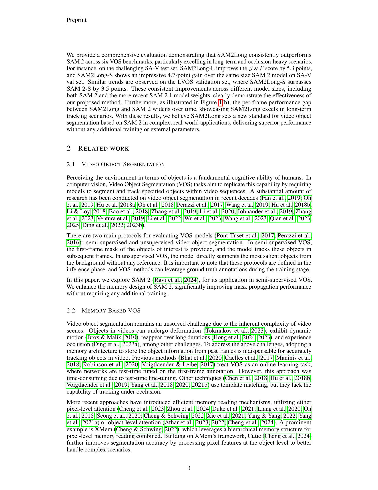
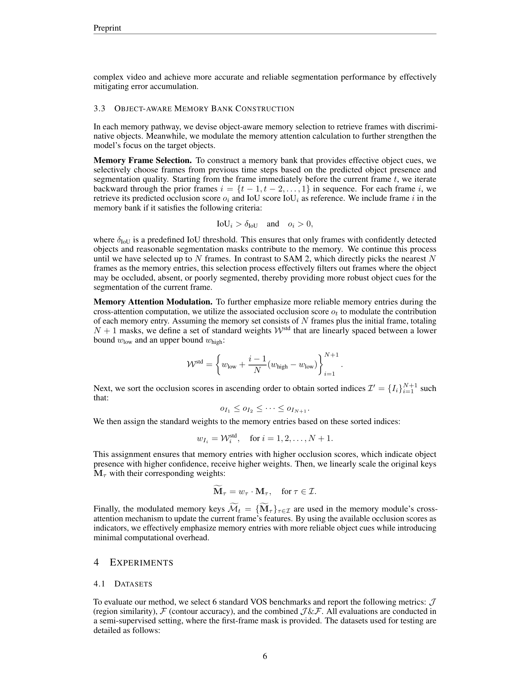
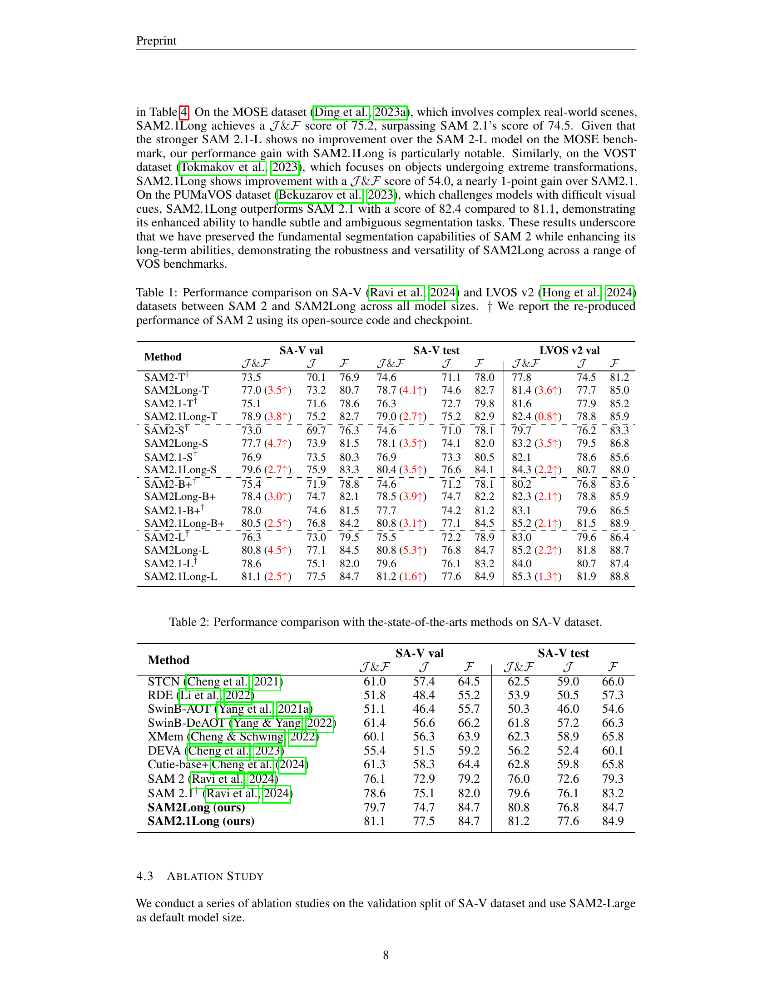
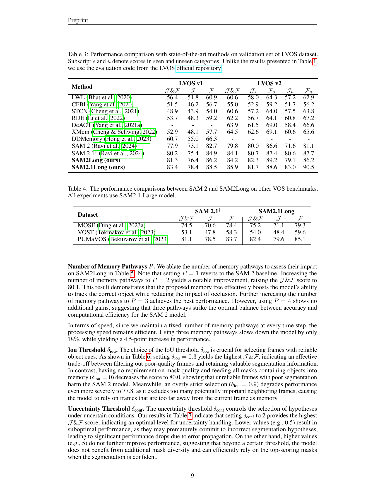
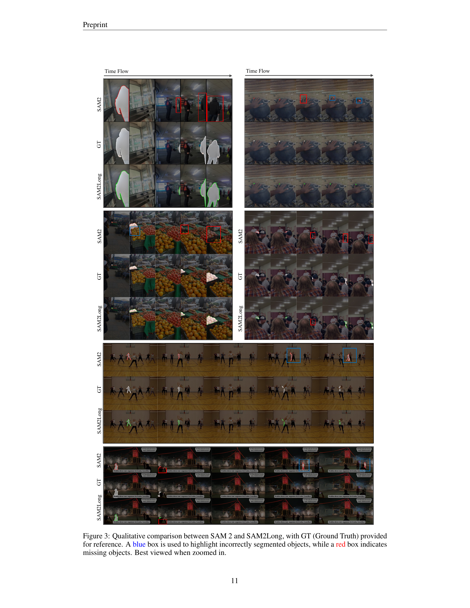
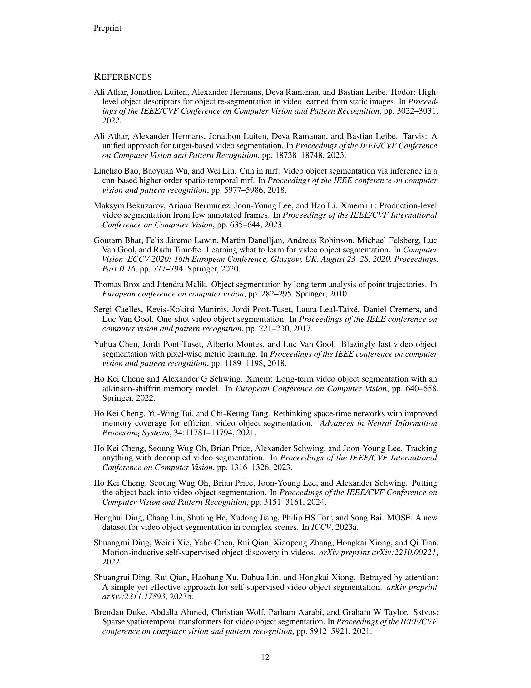
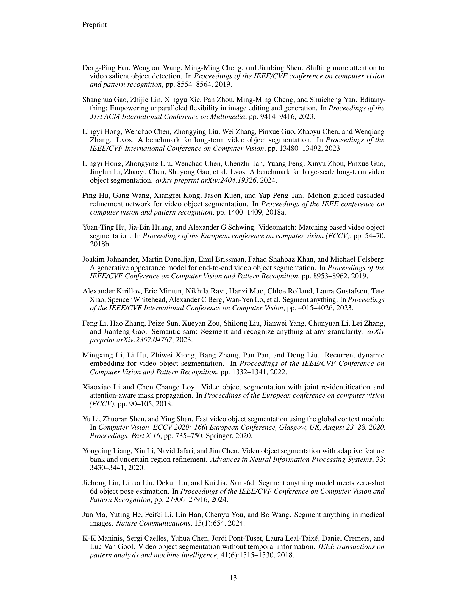

### TL;DR



The research paper introduces SAM2Long, an improved version of the Segment Anything Model 2 (SAM 2) for video object segmentation.  SAM 2 uses a 'memory module' to remember previous frames and improve predictions, but its greedy approach struggles with long videos, complex scenes, and objects that reappear after being hidden. SAM2Long solves this by using a 'memory tree' – it keeps track of several possible segmentation paths simultaneously, selecting the best path at the end.  This makes SAM2Long far more resilient to errors that accumulate over long videos. Importantly, SAM2Long doesn't require any extra training data or parameters – it's a purely algorithmic improvement.  Experiments on several benchmark datasets consistently show SAM2Long's improvements over SAM 2, especially in handling long, complex sequences.




 &nbsp; read the paper on arXiv


#### Why does it matter?
Summarizing the research paper on SAM2Long: Enhancing SAM 2 for Long Video Segmentation with a Training-Free Memory Tree.
#### Key Takeaways


 SAM2Long enhances SAM 2's video object segmentation by employing a novel training-free memory tree structure. 



 The proposed memory tree effectively handles occlusions and reappearing objects in long videos, improving segmentation accuracy. 



 SAM2Long outperforms existing methods across various benchmarks without requiring any additional training or parameters. 


------
#### Visual Insights

 When an occlusion occurs, SAM 2 may lose track or follow the wrong object, leading to accumulated errors. In contrast, SAM2Long utilizes memory tree search to recover when the object reappears. (b) The per-frame J&F scores of the predicted masks are plotted at specific timestamps on the LVOS and SA-V datasets. SAM2Long demonstrates greater resilience to elapsed time compared to SAM 2, maintaining superior performance over longer periods.")

> Figure 1 compares the performance of SAM2 and SAM2Long on handling occlusions and maintaining long-term tracking accuracy in video object segmentation, demonstrating SAM2Long's superior resilience.


<table id='2' style='font-size:18px'><tr><td>Shuangrui Ding1</td><td>Rui Qian1</td><td>Xiaoyi Dong1,2</td><td>Pan Zhang2</td><td></td></tr><tr><td>Yuhang Zang2</td><td>Yuhang Cao2</td><td>Yuwei Guo1</td><td>Dahua Lin1</td><td>Jiaqi Wang2</td></tr></table>

> Table 1 presents a comparison of the performance of SAM2 and SAM2Long across various model sizes on the SA-V and LVOS v2 datasets, showing consistent improvements by SAM2Long.

### More visual insights

More on figures

 The pipeline of constrained memory tree: At each time step t, we maintain multiple memory pathways, each containing a memory bank and a cumulative score Sp[t]. The input frame is processed through the mask decoder conditioned on the memory bank, generating three mask candidates for each pathway. The candidates with the highest updated cumulative scores Sp,k[t] are carried forward to the next time step. (b) Mask selection with uncertainty handling: When the maximum absolute occlusion score exceeds the threshold δconf (Certain), the high-scoring mask is selected. Otherwise (Uncertain), distinct mask candidates are picked to avoid incorrect convergence.")

> This figure illustrates the constrained tree memory structure and uncertainty handling mechanism used in SAM2Long for long-term video object segmentation.

 provided for reference. A blue box is used to highlight incorrectly segmented objects, while a red box indicates missing objects. Best viewed when zoomed in.")

> Figure 3 presents a qualitative comparison of SAM2 and SAM2Long's video object segmentation performance, highlighting SAM2Long's improved accuracy and robustness in handling occlusions and reappearing objects.

More on tables


<table id='3' style='font-size:14px'><tr><td rowspan="2">Method</td><td colspan="3">SA-V val</td><td colspan="3">SA-V test</td><td colspan="3">LVOS v2 val</td></tr><tr><td>J&F</td><td>J</td><td>F</td><td>J&F</td><td>J</td><td>F</td><td>J&F</td><td>J</td><td>F</td></tr><tr><td>SAM2-T†</td><td>73.5</td><td>70.1</td><td>76.9</td><td>74.6</td><td>71.1</td><td>78.0</td><td>77.8</td><td>74.5</td><td>81.2</td></tr><tr><td>SAM2Long-T</td><td>77.0 (3.5↑)</td><td>73.2</td><td>80.7</td><td>78.7 (4.1↑)</td><td>74.6</td><td>82.7</td><td>81.4 (3.6↑)</td><td>77.7</td><td>85.0</td></tr><tr><td>SAM2.1-T†</td><td>75.1</td><td>71.6</td><td>78.6</td><td>76.3</td><td>72.7</td><td>79.8</td><td>81.6</td><td>77.9</td><td>85.2</td></tr><tr><td>SAM2.1Long-T</td><td>78.9 (3.8↑)</td><td>75.2</td><td>82.7</td><td>79.0 (2.7↑)</td><td>75.2</td><td>82.9</td><td>82.4 (0.8↑)</td><td>78.8</td><td>85.9</td></tr><tr><td>- SAM2-ST</td><td>73.0</td><td>- 69.7</td><td>76.3</td><td>- 74.6</td><td>71.0</td><td>78.1</td><td>79.7</td><td>76.2</td><td>83.3 - -</td></tr><tr><td>SAM2Long-S</td><td>77.7 (4.7↑)</td><td>73.9</td><td>81.5</td><td>78.1 (3.5↑)</td><td>74.1</td><td>82.0</td><td>83.2 (3.5↑)</td><td>79.5</td><td>86.8</td></tr><tr><td>SAM2.1-S†</td><td>76.9</td><td>73.5</td><td>80.3</td><td>76.9</td><td>73.3</td><td>80.5</td><td>82.1</td><td>78.6</td><td>85.6</td></tr><tr><td>SAM2.1Long-S</td><td>79.6 (2.7↑)</td><td>75.9</td><td>83.3</td><td>80.4 (3.5↑)</td><td>76.6</td><td>84.1</td><td>84.3 (2.2↑)</td><td>80.7</td><td>88.0</td></tr><tr><td>- SAM2-B+†</td><td>一 75.4</td><td>- 71.9</td><td>78.8</td><td>- 74.6</td><td>71.2</td><td>78.1</td><td>80.2</td><td>76.8</td><td>- - 83.6</td></tr><tr><td>SAM2Long-B+</td><td>78.4 (3.0↑)</td><td>74.7</td><td>82.1</td><td>78.5 (3.9↑)</td><td>74.7</td><td>82.2</td><td>82.3 (2.1↑)</td><td>78.8</td><td>85.9</td></tr><tr><td>SAM2.1-B++</td><td>78.0</td><td>74.6</td><td>81.5</td><td>77.7</td><td>74.2</td><td>81.2</td><td>83.1</td><td>79.6</td><td>86.5</td></tr><tr><td>SAM2.1Long-B+</td><td>80.5 (2.51)</td><td>76.8</td><td>84.2</td><td>80.8 (3.1↑)</td><td>77.1</td><td>84.5</td><td>85.2 (2.1↑)</td><td>81.5</td><td>88.9</td></tr><tr><td>- SAM2-LT</td><td>76.3</td><td>- 73.0</td><td>- 79.5</td><td>- 75.5</td><td>72.2</td><td>78.9</td><td>83.0</td><td>- 79.6</td><td>- 86.4</td></tr><tr><td>SAM2Long-L</td><td>80.8 (4.5↑)</td><td>77.1</td><td>84.5</td><td>80.8 (5.3↑)</td><td>76.8</td><td>84.7</td><td>85.2 (2.2↑)</td><td>81.8</td><td>88.7</td></tr><tr><td>SAM2.1-L+</td><td>78.6</td><td>75.1</td><td>82.0</td><td>79.6</td><td>76.1</td><td>83.2</td><td>84.0</td><td>80.7</td><td>87.4</td></tr><tr><td>SAM2.1Long-L</td><td>81.1 (2.5↑)</td><td>77.5</td><td>84.7</td><td>81.2 (1.6↑)</td><td>77.6</td><td>84.9</td><td>85.3 (1.3↑)</td><td>81.9</td><td>88.8</td></tr></table>

> Table 1 shows a comparison of the performance of SAM2 and SAM2Long across different model sizes on the SA-V and LVOS v2 datasets, highlighting the consistent improvement achieved by SAM2Long.


<table id='5' style='font-size:16px'><tr><td rowspan="2">Method</td><td colspan="3">SA-V val</td><td colspan="3">SA-V test</td></tr><tr><td>J&F</td><td>J</td><td>F</td><td>J&F</td><td>J</td><td>F</td></tr><tr><td>STCN Cheng et al. 2021</td><td>61.0</td><td>57.4</td><td>64.5</td><td>62.5</td><td>59.0</td><td>66.0</td></tr><tr><td>RDE (Li et al. 2022</td><td>51.8</td><td>48.4</td><td>55.2</td><td>53.9</td><td>50.5</td><td>57.3</td></tr><tr><td>SwinB-AOT Yang et al. 2021a</td><td>51.1</td><td>46.4</td><td>55.7</td><td>50.3</td><td>46.0</td><td>54.6</td></tr><tr><td>SwinB-DeAOT Yang & Yang 2022</td><td>61.4</td><td>56.6</td><td>66.2</td><td>61.8</td><td>57.2</td><td>66.3</td></tr><tr><td>XMem Cheng & Schwing 2022</td><td>60.1</td><td>56.3</td><td>63.9</td><td>62.3</td><td>58.9</td><td>65.8</td></tr><tr><td>DEVA Cheng et al. 2023</td><td>55.4</td><td>51.5</td><td>59.2</td><td>56.2</td><td>52.4</td><td>60.1</td></tr><tr><td>Cutie-base+ Cheng et al. 2024</td><td>61.3</td><td>58.3</td><td>64.4</td><td>62.8</td><td>59.8</td><td>65.8</td></tr><tr><td>SAM2 Ravi et al. 2024</td><td>76.1</td><td>- - 72.9</td><td>- 79.2</td><td>76.0</td><td>72.6 - -</td><td>- 79.3 -</td></tr><tr><td>SAM 2.11 Ravi et al. 2024</td><td>78.6</td><td>75.1</td><td>82.0</td><td>79.6</td><td>76.1</td><td>83.2</td></tr><tr><td>SAM2Long (ours)</td><td>79.7</td><td>74.7</td><td>84.7</td><td>80.8</td><td>76.8</td><td>84.7</td></tr><tr><td>SAM2.1Long (ours)</td><td>81.1</td><td>77.5</td><td>84.7</td><td>81.2</td><td>77.6</td><td>84.9</td></tr></table>

> Table 2 presents a comparison of the performance of SAM2Long against other state-of-the-art video object segmentation methods on the SA-V dataset, showcasing its superior performance.


<table id='2' style='font-size:14px'><tr><td rowspan="2">Method</td><td colspan="4">LVOS v1</td><td colspan="4">LVOS v2</td></tr><tr><td>J&F</td><td>J</td><td>F</td><td>J&F</td><td>Is</td><td>Fs</td><td>Ju</td><td>Fu</td></tr><tr><td>LWL Bhat et al. 2020</td><td>56.4</td><td>51.8</td><td>60.9</td><td>60.6</td><td>58.0</td><td>64.3</td><td>57.2</td><td>62.9</td></tr><tr><td>CFBI Yang et al. 2020</td><td>51.5</td><td>46.2</td><td>56.7</td><td>55.0</td><td>52.9</td><td>59.2</td><td>51.7</td><td>56.2</td></tr><tr><td>STCN Cheng et al 2021</td><td>48.9</td><td>43.9</td><td>54.0</td><td>60.6</td><td>57.2</td><td>64.0</td><td>57.5</td><td>63.8</td></tr><tr><td>RDE L1 et al. 2022</td><td>53.7</td><td>48.3</td><td>59.2</td><td>62.2</td><td>56.7</td><td>64.1</td><td>60.8</td><td>67.2</td></tr><tr><td>DeAOT Yang et al. 2021a</td><td>-</td><td>-</td><td>-</td><td>63.9</td><td>61.5</td><td>69.0</td><td>58.4</td><td>66.6</td></tr><tr><td>XMem Cheng & Schwing 2022</td><td>52.9</td><td>48.1</td><td>57.7</td><td>64.5</td><td>62.6</td><td>69.1</td><td>60.6</td><td>65.6</td></tr><tr><td>DDMemory Hong et al 2023</td><td>60.7</td><td>55.0</td><td>66.3</td><td>-</td><td>-</td><td>-</td><td>-</td><td>-</td></tr><tr><td>- SAM 2 Ravi et al. 2024</td><td>77.9 - </td><td>- 73.1 -</td><td>82.7</td><td>-79.8 -</td><td>80.0 -</td><td>86.6</td><td>- 71.6</td><td>8I.I</td></tr><tr><td>SAM 2.1� Ravi et al. 2024</td><td>80.2</td><td>75.4</td><td>84.9</td><td>84.1</td><td>80.7</td><td>87.4</td><td>80.6</td><td>87.7</td></tr><tr><td>SAM2Long (ours)</td><td>81.3</td><td>76.4</td><td>86.2</td><td>84.2</td><td>82.3</td><td>89.2</td><td>79.1</td><td>86.2</td></tr><tr><td>SAM2.1Long (ours)</td><td>83.4</td><td>78.4</td><td>88.5</td><td>85.9</td><td>81.7</td><td>88.6</td><td>83.0</td><td>90.5</td></tr></table>

> Table 1 presents a comparison of the performance of SAM2 and SAM2Long across various model sizes on the SA-V and LVOS v2 datasets, showing consistent improvements of SAM2Long over SAM2.


<table id='4' style='font-size:18px'><tr><td rowspan="2">Dataset</td><td colspan="3">SAM 2.1†</td><td colspan="3">SAM2.1Long</td></tr><tr><td>J&F</td><td>J</td><td>F</td><td>J&F</td><td>J</td><td>F</td></tr><tr><td>MOSE (Ding et al. 2023a</td><td>74.5</td><td>70.6</td><td>78.4</td><td>75.2</td><td>71.1</td><td>79.3</td></tr><tr><td>VOST (Tokmakov et al. 2023</td><td>53.1</td><td>47.8</td><td>58.3</td><td>54.0</td><td>48.4</td><td>59.6</td></tr><tr><td>PUMaVOS Bekuzarov et al. 2023</td><td>81.1</td><td>78.5</td><td>83.7</td><td>82.4</td><td>79.6</td><td>85.1</td></tr></table>

> Table 4 presents the performance comparison of SAM 2 and SAM2Long on three additional video object segmentation datasets: MOSE, VOST, and PUMAVOS.


<table id='2' style='font-size:14px'><tr><td>P</td><td>J&F</td><td>J</td><td>F</td><td>Speed</td></tr><tr><td>1</td><td>76.3</td><td>73.0</td><td>79.5</td><td>1x</td></tr><tr><td>2</td><td>80.1</td><td>76.7</td><td>83.5</td><td>0.93x</td></tr><tr><td>3</td><td>80.8</td><td>77.1</td><td>84.5</td><td>0.82x</td></tr><tr><td>4</td><td>80.7</td><td>77.0</td><td>84.5</td><td>0.75x</td></tr></table>

> Table 5 shows the ablation study on the number of memory pathways (P) in SAM2Long, demonstrating that increasing the number of pathways improves performance, but beyond three pathways, the improvements become marginal.


<table id='5' style='font-size:16px'><tr><td>Sconf</td><td>J&F</td><td>J</td><td>F</td></tr><tr><td>0.5</td><td>80.4</td><td>76.7</td><td>83.7</td></tr><tr><td>2</td><td>80.8</td><td>77.1</td><td>84.5</td></tr><tr><td>5</td><td>80.5</td><td>76.9</td><td>84.1</td></tr></table>

> Table 7 shows the ablation study on the uncertainty threshold (conf) in SAM2Long, demonstrating the impact of different threshold values on the overall performance.

{{< table-caption caption="🔽 Table 6: Ablation on IoU threshold \(\delta_{iou}\)." >}}
 <table id='6' style='font-size:14px'><tr><td>Siou</td><td>J&F</td><td>J</td><td>F</td></tr><tr><td>0</td><td>80.0</td><td>76.6</td><td>83.4</td></tr><tr><td>0.3</td><td>80.8</td><td>77.1</td><td>84.5</td></tr><tr><td>0.7</td><td>80.2</td><td>76.6</td><td>83.8</td></tr><tr><td>0.9</td><td>77.8</td><td>74.3</td><td>81.3</td></tr></table>

> Table 6 shows the ablation study on the impact of different Intersection over Union (IoU) thresholds on the performance of the SAM2Long model.


<table id='8' style='font-size:18px'><tr><td>Wlow , Whigh</td><td>J&F</td><td>J</td><td>F</td></tr><tr><td>1, 1</td><td>80.2</td><td>76.5</td><td>83.8</td></tr><tr><td>0.95, 1.05]</td><td>80.8</td><td>77.1</td><td>84.5</td></tr><tr><td>[0.9, 1.1]</td><td>80.5</td><td>76.9</td><td>84.1</td></tr></table>

> Table 8 shows the ablation study on the effect of modulating the attention weights for memory entries using different ranges.

### Full paper



