### TL;DR



FrugalNeRF tackles the challenge of reconstructing 3D scenes from limited images (few-shot novel view synthesis).  Traditional methods struggle with slow training and overfitting. FrugalNeRF cleverly uses weight-sharing voxels at multiple scales to efficiently represent scene details.  A key innovation is its cross-scale geometric adaptation: it identifies the most accurate depth from different scales using reprojection errors, effectively creating pseudo ground truth without external data. This approach speeds up training and improves accuracy, outperforming other methods.  Experiments show FrugalNeRF is dramatically faster and produces better results on standard datasets.




 &nbsp; read the paper on arXiv


#### Why does it matter?
Summarizing the provided research paper on FrugalNeRF, a novel few-shot novel view synthesis method.
#### Key Takeaways


 FrugalNeRF achieves high-fidelity 3D scene reconstruction using only a few input views, significantly faster than existing methods. 



 It uses weight-sharing voxels across multiple scales and a cross-scale geometric adaptation scheme, eliminating the need for pre-trained models or complex scheduling. 



 FrugalNeRF outperforms state-of-the-art few-shot NeRF methods in terms of speed and quality on several benchmark datasets. 


------
#### Visual Insights

> Figure 1 shows a comparison of FrugalNeRF against other state-of-the-art methods in terms of PSNR and training time using only two views for training.

> The chart compares FrugalNeRF's performance against other state-of-the-art methods in terms of PSNR and training time using only two views for training.


<table id='1' style='font-size:14px'><tr><td>Method</td><td>Venue</td><td>Learned priors</td><td>PSNR ↑</td><td>2-view SSIM ↑</td><td>LPIPS ↓</td><td>PSNR ↑</td><td>3-view SSIM ↑</td><td>LPIPS ↓</td><td>PSNR ↑</td><td>4-view SSIM ↑</td><td>LPIPS ↓</td><td>Training time ↓</td></tr><tr><td>DS-NeRF [21]</td><td>CVPR22</td><td>-</td><td>16.93</td><td>0.51</td><td>0.42</td><td>18.97</td><td>0.58</td><td>0.36</td><td>20.07</td><td>0.61</td><td>0.34</td><td>3.5 hrs</td></tr><tr><td>FreeNeRF [91]</td><td>CVPR23</td><td>-</td><td>17.55</td><td>0.54</td><td>0.38</td><td>19.30</td><td>0.60</td><td>0.34</td><td>20.45</td><td>0.63</td><td>0.33</td><td>1.5 hrs</td></tr><tr><td>ViP-NeRF [70]</td><td>SIGGRAPH23</td><td>-</td><td>16.66</td><td>0.52</td><td>0.37</td><td>18.89</td><td>0.59</td><td>0.34</td><td>19.34</td><td>0.62</td><td>0.32</td><td>13.5 hrs</td></tr><tr><td>SimpleNeRF [71]</td><td>SIGGRAPH Asia23</td><td>-</td><td>17.57</td><td>0.55</td><td>0.39</td><td>19.47</td><td>0.62</td><td>0.33</td><td>20.44</td><td>0.65</td><td>0.31</td><td>9.5 hrs</td></tr><tr><td>FrugalNeRF (Ours)</td><td>-</td><td>-</td><td>18.07</td><td>0.54</td><td>0.35</td><td>19.66</td><td>0.61</td><td>0.30</td><td>20.70</td><td>0.65</td><td>0.28</td><td>10 mins</td></tr><tr><td>RegNeRF [53]</td><td>CVPR22</td><td>normalizing flow</td><td>16.88</td><td>0.49</td><td>0.43</td><td>18.65</td><td>0.57</td><td>0.36</td><td>19.89</td><td>0.62</td><td>0.32</td><td>2.35 hrs</td></tr><tr><td>DDP-NeRF [61]</td><td>CVPR22</td><td>depth completion</td><td>17.19</td><td>0.54</td><td>0.39</td><td>17.71</td><td>0.56</td><td>0.39</td><td>19.19</td><td>0.61</td><td>0.35</td><td>3.5 hrs</td></tr><tr><td>GeCoNeRF [39]</td><td>ICML23</td><td>VGG19 feature</td><td>15.83</td><td>0.45</td><td>0.52</td><td>17.44</td><td>0.50</td><td>0.47</td><td>19.14</td><td>0.56</td><td>0.42</td><td>4 hrs</td></tr><tr><td>SparseNeRF [81]</td><td>ICCV23</td><td>monocular depth</td><td>18.02</td><td>0.52</td><td>0.45</td><td>19.52</td><td>0.59</td><td>0.37</td><td>20.89</td><td>0.65</td><td>0.34</td><td>1 hrs</td></tr><tr><td>FSGS [102]</td><td>ECCV24</td><td>monocular depth</td><td>15.26</td><td>0.45</td><td>0.41</td><td>19.21</td><td>0.61</td><td>0.30</td><td>20.07</td><td>0.66</td><td>0.22</td><td>25 mins</td></tr><tr><td>FrugalNeRF (Ours)</td><td>-</td><td>monocular depth</td><td>18.26</td><td>0.55</td><td>0.35</td><td>19.87</td><td>0.61</td><td>0.30</td><td>20.89</td><td>0.66</td><td>0.26</td><td>11 mins</td></tr></table>

> Table 1 presents a quantitative comparison of FrugalNeRF against other state-of-the-art few-shot NeRF methods across different metrics (PSNR, SSIM, LPIPS) and training times, using various numbers of input views (2, 3, and 4).

### More visual insights

More on figures

 Frequency regularization gradually increases the visibility of high-frequency signals of positional encoding, but the training speed is slow. (b) Replacing the MLPs with voxels and incorporating them with gradual voxel upsampling achieves similar frequency regularization but cannot generalize well. (c) Some approaches employ pre-trained models to supervise the rendered color or depth patches. (d) Our FrugalNeRF, leveraging weight-sharing voxels across scales for various frequencies representation, enhanced by a cross-scale geometric adaptation for efficient supervision.")

> Figure 2 compares different few-shot NeRF approaches, highlighting FrugalNeRF's efficient use of weight-sharing voxels and cross-scale geometric adaptation for faster convergence and improved generalization.

 Our FrugalNeRF represents a scene with a pair of density and appearance voxels (VD, VA). For a better graphical illustration, we show only one voxel in the figure. (b) We sample rays from not only training input views rtrain but also randomly sampled novel views rnovel. (c) We then create L + 1 multi-scale voxels by hierarchical subsampling, where lower-resolution voxels ensure global geometry consistency and reduce overfitting but suffer from representing detailed structures, while higher-resolution voxels capture fine details but may get stuck in the local minimum or generate floaters. (d) For the rays from training views rtrain, we enforce an MSE reconstruction loss between the volume rendered RGB color Ĉ and input RGB C at each scale. (e) We introduce a cross-scale geometric adaptation loss for novel view rays rnovel, warping volume-rendered RGB to the nearest training view using predicted depth, calculating projection errors e' at each scale, and using the depth with the minimum reprojection error as pseudo-GT for depth supervision. This adaptation involves rays from both training and novel views, though the figure only depicts novel view rays for clarity.")

> Figure 3 illustrates the FrugalNeRF architecture, showcasing its multi-scale voxel representation, ray sampling strategy, training loss functions, and cross-scale geometric adaptation mechanism.

> Figure 1 shows comparisons of FrugalNeRF against other state-of-the-art methods in terms of PSNR and training time when trained using only two views.

> Figure 4 shows a qualitative comparison of FrugalNeRF against other state-of-the-art methods on the LLFF dataset, highlighting its superior synthesis quality and coherent geometric depth.

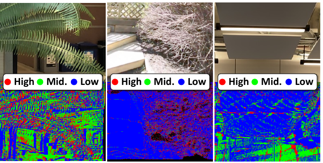

> The figure visualizes how different scene types activate different frequency bands in the multi-scale voxel representation of FrugalNeRF, demonstrating its adaptability.

> Figure 1 shows the comparison of FrugalNeRF with other state-of-the-art methods in terms of PSNR and training time using only two views for training.

> The figure compares the performance of FrugalNeRF against other state-of-the-art methods in terms of PSNR and training time using only two views for training.

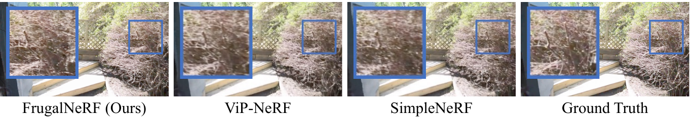

> Figure 1 shows the comparison of FrugalNeRF with other state-of-the-art methods in terms of PSNR and training time using only two views for training.

> Figure 1 shows the PSNR comparison between FrugalNeRF and other state-of-the-art methods with only two views for training, highlighting FrugalNeRF's superior efficiency and quality.

More on charts

 In the early training phase, low-resolution voxels primarily act as pseudo-ground truth, guiding the model’s geometric learning. As training goes on, medium- and high-resolution voxels increasingly contribute to refining scene geometry. This adaptive approach enables the model to autonomously tune into appropriate frequencies at each stage, enhancing its ability to generalize across various scenes. (Right) Without geometric adaptation, all of the scales result in sub-optimal solutions. Geometric adaptation drives convergence to higher quality across all scales.")

> The chart visualizes how the proportion of each voxel scale serving as pseudo-ground truth changes during training, demonstrating the cross-scale geometric adaptation process in FrugalNeRF.

> The chart compares the performance of FrugalNeRF against other state-of-the-art methods in terms of PSNR and training time using only two views for training.

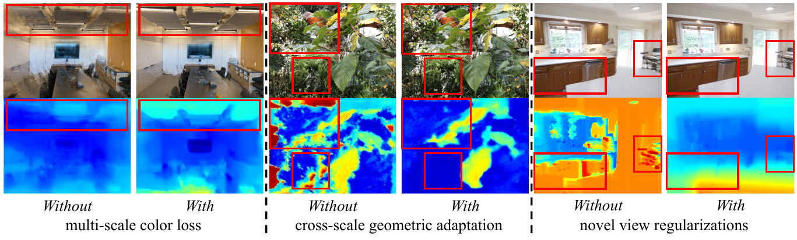

> The chart compares the performance of FrugalNeRF against other state-of-the-art methods in terms of PSNR and training time using only two views for training.

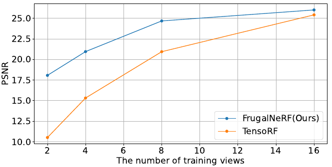

> The chart compares the PSNR performance and training time of FrugalNeRF against other state-of-the-art few-shot novel view synthesis methods using only two training views.

More on tables


<table id='1' style='font-size:14px'><tr><td rowspan="2">Method</td><td rowspan="2">Venue</td><td rowspan="2">Learned priors</td><td colspan="3">2-view</td><td colspan="3">3-view</td><td colspan="3">4-view</td><td rowspan="2">Training time ↓</td></tr><tr><td>PSNR ↑</td><td>SSIM ↑</td><td>LPIPS ↓</td><td>PSNR ↑</td><td>SSIM ↑</td><td>LPIPS ↓</td><td>PSNR ↑</td><td>SSIM ↑</td><td>LPIPS ↓</td></tr><tr><td>FreeNeRF [91]</td><td>CVPR23</td><td>-</td><td>18.05</td><td>0.73</td><td>0.22</td><td>22.40</td><td>0.82</td><td>0.14</td><td>24.98</td><td>0.86</td><td>0.12</td><td>1 hrs</td></tr><tr><td>ViP-NeRF [70]</td><td>SIGGRAPH23</td><td>-</td><td>14.91</td><td>0.49</td><td>0.24</td><td>16.62</td><td>0.55</td><td>0.22</td><td>17.64</td><td>0.57</td><td>0.21</td><td>2.2 hrs</td></tr><tr><td>SimpleNeRF [71]</td><td>SIGGRAPH Asia23</td><td>-</td><td>14.41</td><td>0.79</td><td>0.25</td><td>14.01</td><td>0.77</td><td>0.25</td><td>13.90</td><td>0.78</td><td>0.26</td><td>1.38 hrs</td></tr><tr><td>ZeroRF [66]</td><td>CVPR24</td><td>-</td><td>14.84</td><td>0.60</td><td>0.30</td><td>14.47</td><td>0.61</td><td>0.31</td><td>15.73</td><td>0.67</td><td>0.28</td><td>25 mins</td></tr><tr><td>FrugalNeRF (Ours)</td><td>-</td><td></td><td>19.72</td><td>0.78</td><td>0.16</td><td>22.43</td><td>0.83</td><td>0.14</td><td>24.51</td><td>0.86</td><td>0.12</td><td>6 mins</td></tr><tr><td>RegNeRF [53]</td><td>CVPR22</td><td>normalizing flow</td><td>-</td><td>-</td><td>-</td><td>-</td><td>-</td><td>-</td><td>-</td><td>-</td><td>-</td><td>OOM</td></tr><tr><td>SparseNeRF [81]</td><td>ICCV23</td><td>monocular depth</td><td>19.83</td><td>0.75</td><td>0.20</td><td>22.47</td><td>0.83</td><td>0.14</td><td>24.03</td><td>0.86</td><td>0.12</td><td>30 mins</td></tr><tr><td>FSGS [102]</td><td>ECCV24</td><td>monocular depth</td><td>16.82</td><td>0.64</td><td>0.27</td><td>18.29</td><td>0.69</td><td>0.21</td><td>20.08</td><td>0.75</td><td>0.16</td><td>20 mins</td></tr><tr><td>FrugalNeRF (Ours)</td><td>-</td><td>monocular depth</td><td>20.77</td><td>0.79</td><td>0.15</td><td>22.84</td><td>0.83</td><td>0.13</td><td>24.81</td><td>0.86</td><td>0.12</td><td>7 mins</td></tr></table>

> Table 2 presents a quantitative comparison of FrugalNeRF against other state-of-the-art methods on the DTU dataset using various metrics such as PSNR, SSIM, and LPIPS across different numbers of input views.


<table id='5' style='font-size:16px'><tr><td># of scales</td><td>PSNR ↑</td><td>SSIM ↑</td><td>LPIPS ↓</td><td>Time ↓</td></tr><tr><td>1 (L = 0)</td><td>15.22</td><td>0.46</td><td>0.43</td><td>6 mins</td></tr><tr><td>2 (L = 1)</td><td>16.58</td><td>0.53</td><td>0.37</td><td>7 mins</td></tr><tr><td>3 (L = 2)</td><td>18.07</td><td>0.54</td><td>0.35</td><td>10 mins</td></tr><tr><td>4 (L = 3)</td><td>18.08</td><td>0.54</td><td>0.36</td><td>15 mins</td></tr></table>

> The table shows the effect of increasing the number of scales on the rendering quality and training time of the FrugalNeRF model.


<table id='8' style='font-size:16px'><tr><td>Method</td><td>MFLOPs / pixel ↓</td></tr><tr><td>FreeNeRF [91]</td><td>288.57</td></tr><tr><td>ViP-NeRF [70]</td><td>149.26</td></tr><tr><td>SimpleNeRF [71]</td><td>303.82</td></tr><tr><td>SparseNeRF [81]</td><td>287.92</td></tr><tr><td>Ours</td><td>13.77</td></tr></table>

> The table compares the computational efficiency (MFLOPs per pixel) of FrugalNeRF against several state-of-the-art methods.


<table id='1' style='font-size:14px'><tr><td>Scene</td><td>Fern</td><td>Flower</td><td>Fortress</td><td>Horns</td><td>Leaves</td><td>Orchids</td><td>Room</td><td>Trex</td><td>Average</td></tr><tr><td>Method</td><td></td><td></td><td></td><td></td><td></td><td></td><td></td><td></td><td></td></tr><tr><td rowspan="3">RegNeRF [53]</td><td>0.35</td><td>0.29</td><td>0.37</td><td>0.34</td><td>0.32</td><td>0.43</td><td>0.19</td><td>0.32</td><td>0.32</td></tr><tr><td>0.63</td><td>0.64</td><td>0.55</td><td>0.64</td><td>0.44</td><td>0.34</td><td>0.87</td><td>0.66</td><td>0.62</td></tr><tr><td>20.8</td><td>19.8</td><td>22.4</td><td>20.1</td><td>15.9</td><td>14.8</td><td>23.9</td><td>18.9</td><td>19.9</td></tr><tr><td rowspan="3">DS-NeRF [21]</td><td>0.35</td><td>0.28</td><td>0.31</td><td>0.41</td><td>0.41</td><td>0.41</td><td>0.16</td><td>0.39</td><td>0.34</td></tr><tr><td>0.63</td><td>0.64</td><td>0.66</td><td>0.59</td><td>0.39</td><td>0.38</td><td>0.89</td><td>0.59</td><td>0.61</td></tr><tr><td>20.9</td><td>20.6</td><td>24.1</td><td>19.5</td><td>15.8</td><td>15.2</td><td>25.6</td><td>17.1</td><td>20.1</td></tr><tr><td rowspan="3">DDP-NeRF [61]</td><td>0.40</td><td>0.30</td><td>0.18</td><td>0.42</td><td>0.45</td><td>0.42</td><td>0.26</td><td>0.39</td><td>0.35</td></tr><tr><td>0.60</td><td>0.63</td><td>0.73</td><td>0.59</td><td>0.37</td><td>0.41</td><td>0.82</td><td>0.60</td><td>0.61</td></tr><tr><td>20.1</td><td>20.0</td><td>23.4</td><td>19.3</td><td>15.1</td><td>15.8</td><td>20.8</td><td>17.3</td><td>19.2</td></tr><tr><td rowspan="3">FreeNeRF [91]</td><td>0.37</td><td>0.30</td><td>0.35</td><td>0.37</td><td>0.35</td><td>0.42</td><td>0.19</td><td>0.31</td><td>0.33</td></tr><tr><td>0.64</td><td>0.64</td><td>0.60</td><td>0.63</td><td>0.47</td><td>0.37</td><td>0.88</td><td>0.68</td><td>0.63</td></tr><tr><td>21.1</td><td>20.5</td><td>23.2</td><td>20.4</td><td>16.6</td><td>14.9</td><td>24.8</td><td>19.6</td><td>20.5</td></tr><tr><td rowspan="3">ViP-NeRF [70]</td><td>0.39</td><td>0.27</td><td>0.25</td><td>0.38</td><td>0.36</td><td>0.40</td><td>0.23</td><td>0.32</td><td>0.32</td></tr><tr><td>0.58</td><td>0.63</td><td>0.70</td><td>0.60</td><td>0.40</td><td>0.39</td><td>0.85</td><td>0.64</td><td>0.62</td></tr><tr><td>18.2</td><td>19.5</td><td>23.3</td><td>19.0</td><td>14.8</td><td>14.8</td><td>23.2</td><td>18.6</td><td>19.3</td></tr><tr><td rowspan="3">SimpleNeRF [71]</td><td>0.33</td><td>0.27</td><td>0.28</td><td>0.38</td><td>0.35</td><td>0.36</td><td>0.19</td><td>0.32</td><td>0.31</td></tr><tr><td>0.65</td><td>0.67</td><td>0.69</td><td>0.63</td><td>0.46</td><td>0.42</td><td>0.88</td><td>0.68</td><td>0.65</td></tr><tr><td>21.1</td><td>20.8</td><td>24.3</td><td>19.7</td><td>16.3</td><td>15.7</td><td>24.3</td><td>19.3</td><td>20.4</td></tr><tr><td rowspan="3">VGOS [75]</td><td>0.40</td><td>0.35</td><td>0.40</td><td>0.43</td><td>0.34</td><td>0.41</td><td>0.28</td><td>0.35</td><td>0.37</td></tr><tr><td>0.64</td><td>0.63</td><td>0.64</td><td>0.62</td><td>0.49</td><td>0.43</td><td>0.86</td><td>0.68</td><td>0.64</td></tr><tr><td>19.6</td><td>20.3</td><td>22.7</td><td>18.6</td><td>16.6</td><td>15.8</td><td>23.6</td><td>18.7</td><td>19.7</td></tr><tr><td rowspan="3">GeCoNeRF [39]</td><td>0.45</td><td>0.36</td><td>0.44</td><td>0.47</td><td>0.44</td><td>0.51</td><td>0.27</td><td>0.40</td><td>0.42</td></tr><tr><td>0.61</td><td>0.61</td><td>0.51</td><td>0.59</td><td>0.40</td><td>0.30</td><td>0.85</td><td>0.63</td><td>0.56</td></tr><tr><td>20.5</td><td>19.9</td><td>21.2</td><td>19.6</td><td>15.5</td><td>13.9</td><td>23.5</td><td>19.0</td><td>19.1</td></tr><tr><td rowspan="3">SparseNeRF [81]</td><td>0.42</td><td>0.32</td><td>0.31</td><td>0.39</td><td>0.36</td><td>0.42</td><td>0.25</td><td>0.29</td><td>0.34</td></tr><tr><td>0.62</td><td>0.64</td><td>0.70</td><td>0.63</td><td>0.49</td><td>0.39</td><td>0.85</td><td>0.70</td><td>0.65</td></tr><tr><td>21.4</td><td>20.7</td><td>24.6</td><td>20.4</td><td>17.5</td><td>15.7</td><td>23.5</td><td>20.9</td><td>20.9</td></tr><tr><td rowspan="3">FSGS [102]</td><td>0.26</td><td>0.22</td><td>0.17</td><td>0.24</td><td>0.22</td><td>0.28</td><td>0.17</td><td>0.23</td><td>0.22</td></tr><tr><td>0.67</td><td>0.65</td><td>0.65</td><td>0.70</td><td>0.46</td><td>0.45</td><td>0.88</td><td>0.71</td><td>0.66</td></tr><tr><td>20.5</td><td>20.2</td><td>22.6</td><td>20.9</td><td>15.6</td><td>15.4</td><td>23.7</td><td>19.2</td><td>20.1</td></tr><tr><td rowspan="3">FrugalNeRF (Ours)</td><td>0.30</td><td>0.28</td><td>0.24</td><td>0.30</td><td>0.26</td><td>0.38</td><td>0.19</td><td>0.27</td><td>0.27</td></tr><tr><td>0.63</td><td>0.64</td><td>0.60</td><td>0.66</td><td>0.52</td><td>0.41</td><td>0.87</td><td>0.72</td><td>0.65</td></tr><tr><td>21.1</td><td>20.8</td><td>23.6</td><td>21.6</td><td>16.9</td><td>16.3</td><td>24.2</td><td>19.7</td><td>20.9</td></tr><tr><td rowspan="3">FrugalNeRF w/ mono. depth (Ours)</td><td>0.30</td><td>0.27</td><td>0.25</td><td>0.28</td><td>0.24</td><td>0.37</td><td>0.18</td><td>0.27</td><td>0.26</td></tr><tr><td>0.64</td><td>0.65</td><td>0.64</td><td>0.68</td><td>0.53</td><td>0.41</td><td>0.88</td><td>0.71</td><td>0.66</td></tr><tr><td>21.5</td><td>20.9</td><td>23.9</td><td>21.1</td><td>17.2</td><td>16.3</td><td>24.1</td><td>19.6</td><td>20.9</td></tr></table>

> Table 6 presents a quantitative comparison of FrugalNeRF and other state-of-the-art methods on the LLFF dataset using two input views, evaluating performance using LPIPS, SSIM, and PSNR.


<table id='3' style='font-size:14px'><tr><td rowspan="2">Method</td><td rowspan="2">Venue</td><td rowspan="2">Learned priors</td><td colspan="3">2-view</td><td colspan="3">3-view</td><td colspan="3">4-view</td><td rowspan="2">Training time ↓</td></tr><tr><td>PSNR ↑</td><td>SSIM ↑</td><td>LPIPS ↓</td><td>PSNR ↑</td><td>SSIM ↑</td><td>LPIPS ↓</td><td>PSNR ↑</td><td>SSIM ↑</td><td>LPIPS ↓</td></tr><tr><td>RegNeRF [53]</td><td>CVPR 2022</td><td>normalizing flow</td><td>16.87</td><td>0.59</td><td>0.45</td><td>17.73</td><td>0.61</td><td>0.44</td><td>18.25</td><td>0.62</td><td>0.44</td><td>2.35 hrs</td></tr><tr><td>DS-NeRF [21]</td><td>CVPR 2022</td><td>-</td><td>25.44</td><td>0.79</td><td>0.32</td><td>25.94</td><td>0.79</td><td>0.32</td><td>26.28</td><td>0.79</td><td>0.33</td><td>3.5 hrs</td></tr><tr><td>DDP-NeRF [61]</td><td>CVPR 2022</td><td>depth completion</td><td>26.15</td><td>0.85</td><td>0.15</td><td>25.92</td><td>0.85</td><td>0.16</td><td>26.48</td><td>0.86</td><td>0.16</td><td>3.5 hrs</td></tr><tr><td>FreeNeRF [91]</td><td>CVPR 2023</td><td>-</td><td>14.50</td><td>0.54</td><td>0.55</td><td>15.12</td><td>0.57</td><td>0.54</td><td>16.25</td><td>0.60</td><td>0.54</td><td>1.5 hrs</td></tr><tr><td>ViP-NeRF [70]</td><td>SIGGRAPH 2023</td><td>-</td><td>29.55</td><td>0.87</td><td>0.09</td><td>29.75</td><td>0.88</td><td>0.11</td><td>30.47</td><td>0.88</td><td>0.11</td><td>13.5 hrs</td></tr><tr><td>SimpleNeRF [71]</td><td>SIGGRAPH Asia 2023</td><td>-</td><td>30.30</td><td>0.88</td><td>0.07</td><td>31.40</td><td>0.89</td><td>0.08</td><td>31.73</td><td>0.89</td><td>0.09</td><td>9.5 hrs</td></tr><tr><td>FrugalNeRF (Ours)</td><td>-</td><td>-</td><td>30.12</td><td>0.87</td><td>0.07</td><td>31.04</td><td>0.89</td><td>0.06</td><td>31.78</td><td>0.90</td><td>0.06</td><td>20 mins</td></tr></table>

> Table 1 presents a quantitative comparison of FrugalNeRF against several state-of-the-art few-shot NeRF methods across different metrics (PSNR, SSIM, LPIPS) and training times, using various numbers of input views (2, 3, 4).


<table id='1' style='font-size:14px'><tr><td>Scene</td><td rowspan="2">0</td><td rowspan="2">1</td><td rowspan="2">3</td><td rowspan="2">4</td><td rowspan="2">6</td><td rowspan="2">Average</td></tr><tr><td>Method</td></tr><tr><td rowspan="3">RegNeRF [53]</td><td>0.35</td><td>0.32</td><td>0.49</td><td>0.54</td><td>0.54</td><td>0.45</td></tr><tr><td>0.60</td><td>0.83</td><td>0.30</td><td>0.61</td><td>0.59</td><td>0.59</td></tr><tr><td>16.51</td><td>21.04</td><td>13.88</td><td>17.13</td><td>15.79</td><td>16.87</td></tr><tr><td rowspan="3">DS-NeRF [21]</td><td>0.26</td><td>0.27</td><td>0.51</td><td>0.24</td><td>0.31</td><td>0.32</td></tr><tr><td>0.81</td><td>0.91</td><td>0.50</td><td>0.88</td><td>0.83</td><td>0.79</td></tr><tr><td>24.68</td><td>27.93</td><td>19.24</td><td>29.18</td><td>26.18</td><td>25.44</td></tr><tr><td rowspan="3">DDP-NeRF [61]</td><td>0.11</td><td>0.12</td><td>0.34</td><td>0.06</td><td>0.11</td><td>0.15</td></tr><tr><td>0.89</td><td>0.95</td><td>0.56</td><td>0.94</td><td>0.92</td><td>0.85</td></tr><tr><td>25.90</td><td>25.87</td><td>18.97</td><td>32.01</td><td>28.00</td><td>26.15</td></tr><tr><td rowspan="3">FreeNeRF [91]</td><td>0.45</td><td>0.50</td><td>0.64</td><td>0.67</td><td>0.48</td><td>0.55</td></tr><tr><td>0.54</td><td>0.77</td><td>0.28</td><td>0.49</td><td>0.58</td><td>0.53</td></tr><tr><td>15.00</td><td>17.00</td><td>12.15</td><td>12.84</td><td>15.50</td><td>14.50</td></tr><tr><td rowspan="3">ViP-NeRF [70]</td><td>0.05</td><td>0.05</td><td>0.22</td><td>0.04</td><td>0.08</td><td>0.09</td></tr><tr><td>0.94</td><td>0.97</td><td>0.56</td><td>0.95</td><td>0.93</td><td>0.87</td></tr><tr><td>30.41</td><td>32.03</td><td>18.96</td><td>34.74</td><td>31.61</td><td>29.55</td></tr><tr><td rowspan="3">SimpleNeRF [71]</td><td>0.04</td><td>0.04</td><td>0.21</td><td>0.03</td><td>0.05</td><td>0.07</td></tr><tr><td>0.95</td><td>0.97</td><td>0.56</td><td>0.95</td><td>0.96</td><td>0.88</td></tr><tr><td>31.89</td><td>33.8</td><td>18.65</td><td>34.93</td><td>32.24</td><td>30.30</td></tr><tr><td rowspan="3">FrugalNeRF (Ours)</td><td>0.04</td><td>0.04</td><td>0.20</td><td>0.04</td><td>0.05</td><td>0.07</td></tr><tr><td>0.94</td><td>0.97</td><td>0.56</td><td>0.95</td><td>0.95</td><td>0.87</td></tr><tr><td>30.13</td><td>34.69</td><td>18.35</td><td>35.00</td><td>32.45</td><td>30.12</td></tr></table>

> Table 13 presents a quantitative comparison of FrugalNeRF against other state-of-the-art methods on the RealEstate-10K dataset using two input views, evaluating performance based on LPIPS, SSIM, and PSNR.


<table id='1' style='font-size:14px'><tr><td>Scene</td><td>0</td><td>1</td><td>3</td><td>4</td><td>6</td><td>Average</td></tr><tr><td>Method</td><td></td><td></td><td></td><td></td><td></td><td></td></tr><tr><td rowspan="3">RegNeRF [53]</td><td>0.43</td><td>0.35</td><td>0.59</td><td>0.56</td><td>0.27</td><td>0.44</td></tr><tr><td>0.59</td><td>0.83</td><td>0.29</td><td>0.65</td><td>0.75</td><td>0.62</td></tr><tr><td>16.09</td><td>20.98</td><td>13.91</td><td>18.48</td><td>21.78</td><td>18.25</td></tr><tr><td rowspan="3">DS-NeRF [21]</td><td>0.27</td><td>0.26</td><td>0.56</td><td>0.25</td><td>0.31</td><td>0.33</td></tr><tr><td>0.82</td><td>0.92</td><td>0.50</td><td>0.87</td><td>0.85</td><td>0.79</td></tr><tr><td>25.40</td><td>29.40</td><td>19.64</td><td>29.26</td><td>27.69</td><td>26.28</td></tr><tr><td rowspan="3">DDP-NeRF [61]</td><td>0.12</td><td>0.08</td><td>0.39</td><td>0.06</td><td>0.13</td><td>0.16</td></tr><tr><td>0.89</td><td>0.96</td><td>0.58</td><td>0.93</td><td>0.91</td><td>0.86</td></tr><tr><td>25.14</td><td>28.57</td><td>19.57</td><td>31.73</td><td>27.36</td><td>26.48</td></tr><tr><td rowspan="3">FreeNeRF [91]</td><td>0.56</td><td>0.48</td><td>0.65</td><td>0.58</td><td>0.39</td><td>0.53</td></tr><tr><td>0.53</td><td>0.80</td><td>0.31</td><td>0.66</td><td>0.69</td><td>0.60</td></tr><tr><td>13.84</td><td>17.93</td><td>12.69</td><td>17.29</td><td>19.48</td><td>16.25</td></tr><tr><td rowspan="3">ViP-NeRF [70]</td><td>0.06</td><td>0.08</td><td>0.27</td><td>0.05</td><td>0.09</td><td>0.11</td></tr><tr><td>0.94</td><td>0.96</td><td>0.62</td><td>0.94</td><td>0.95</td><td>0.88</td></tr><tr><td>31.64</td><td>32.24</td><td>20.35</td><td>34.84</td><td>33.28</td><td>30.47</td></tr><tr><td rowspan="3">SimpleNeRF [71]</td><td>0.04</td><td>0.05</td><td>0.24</td><td>0.03</td><td>0.09</td><td>0.09</td></tr><tr><td>0.96</td><td>0.97</td><td>0.64</td><td>0.95</td><td>0.94</td><td>0.89</td></tr><tr><td>32.95</td><td>36.44</td><td>20.52</td><td>35.97</td><td>32.77</td><td>31.73</td></tr><tr><td rowspan="3">FrugalNeRF (Ours)</td><td>0.04</td><td>0.03</td><td>0.17</td><td>0.03</td><td>0.05</td><td>0.06</td></tr><tr><td>0.96</td><td>0.98</td><td>0.64</td><td>0.95</td><td>0.96</td><td>0.90</td></tr><tr><td>32.29</td><td>36.06</td><td>19.81</td><td>36.54</td><td>34.22</td><td>31.78</td></tr></table>

> Table 15 presents a quantitative comparison of different methods' performance on the RealEstate-10K dataset using four input views, evaluating LPIPS, SSIM, and PSNR scores.

### Full paper



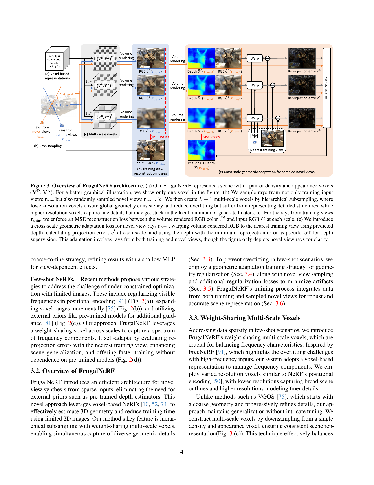
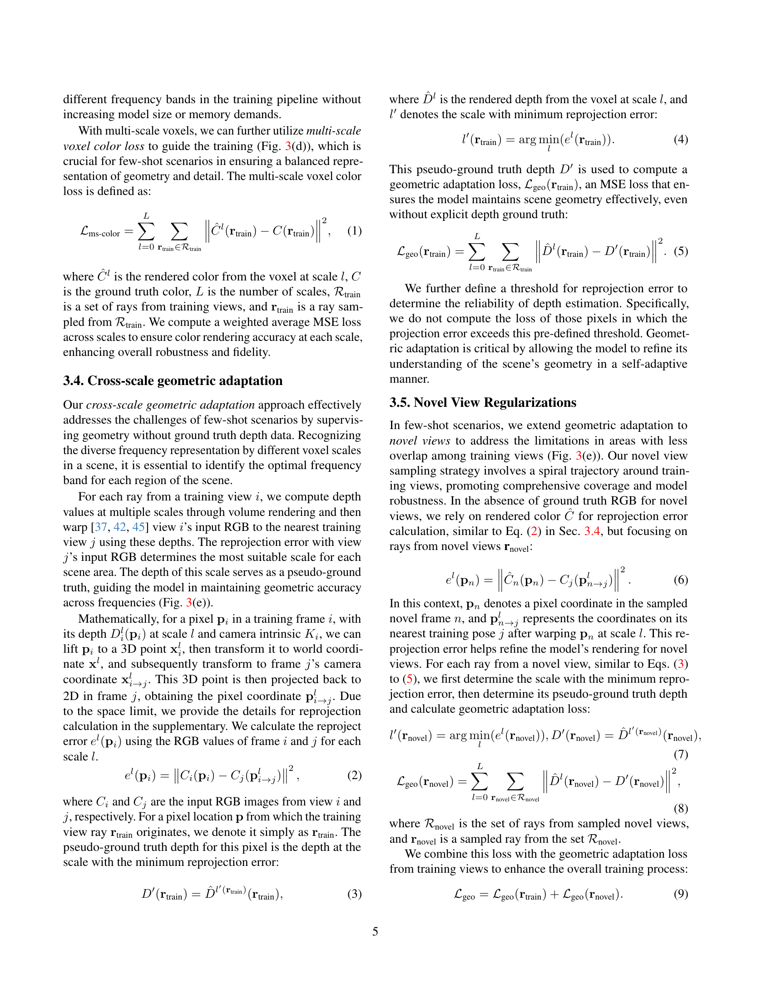
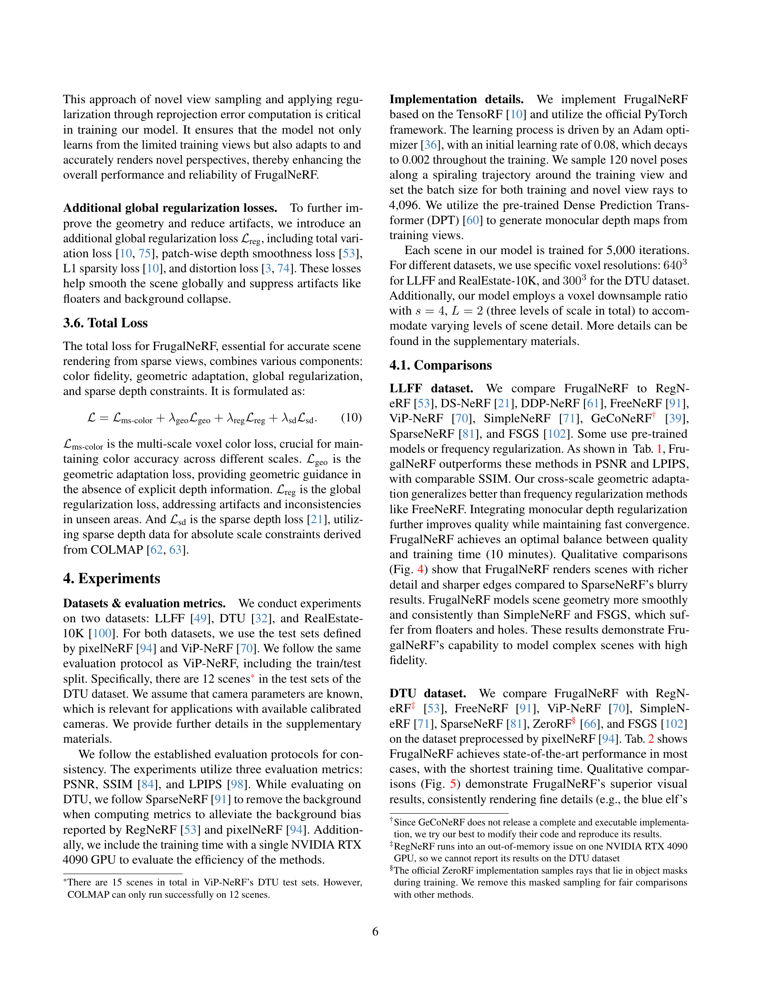
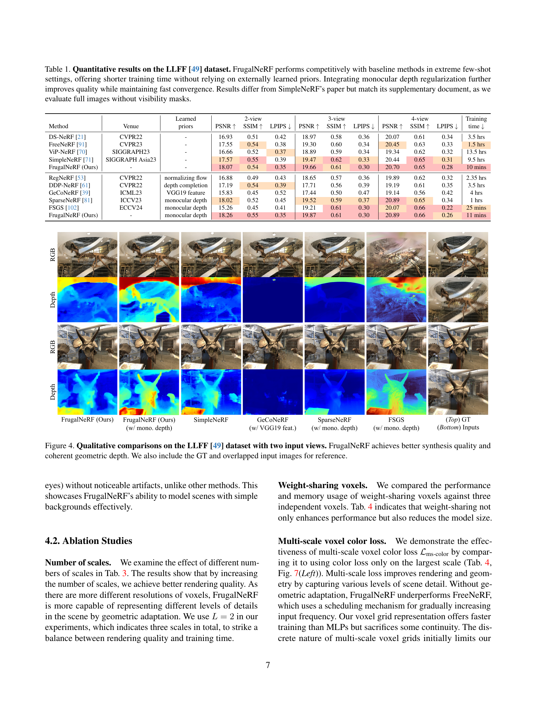

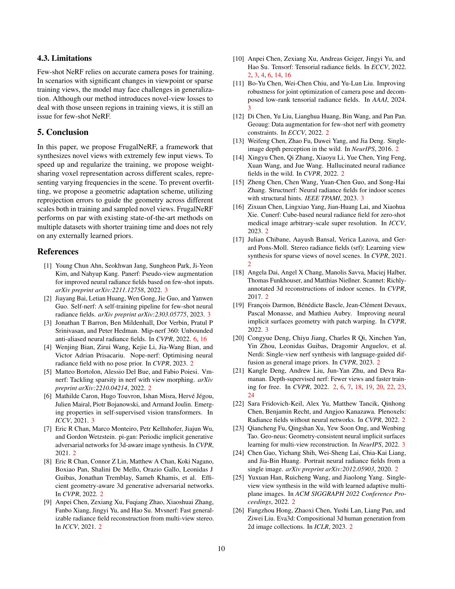

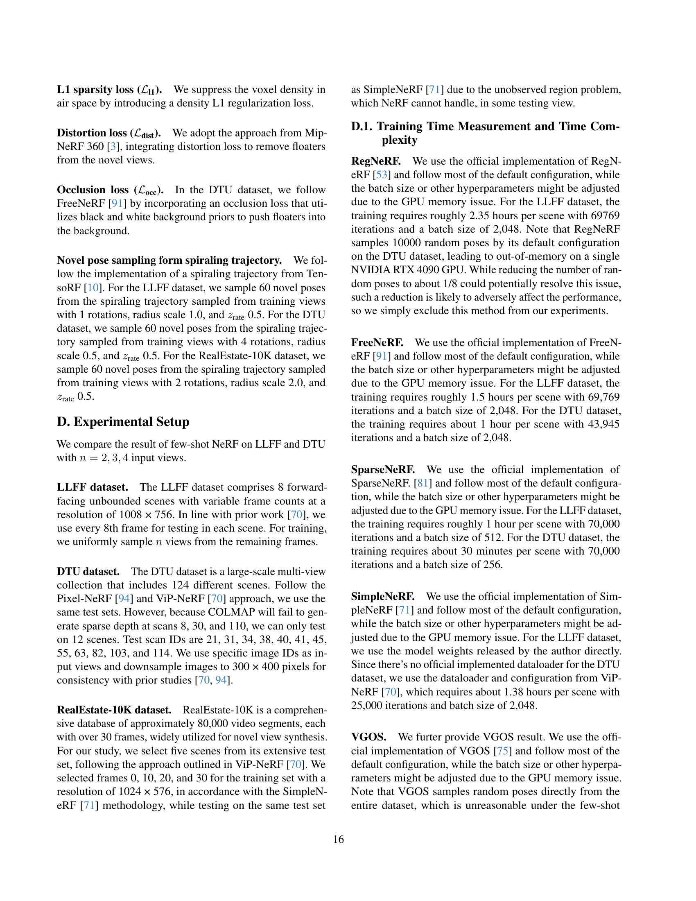
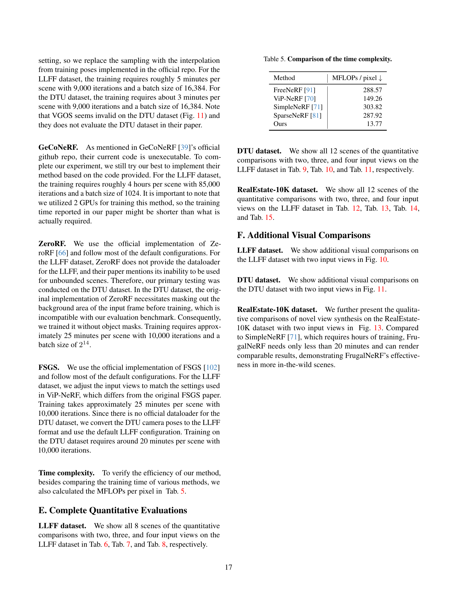

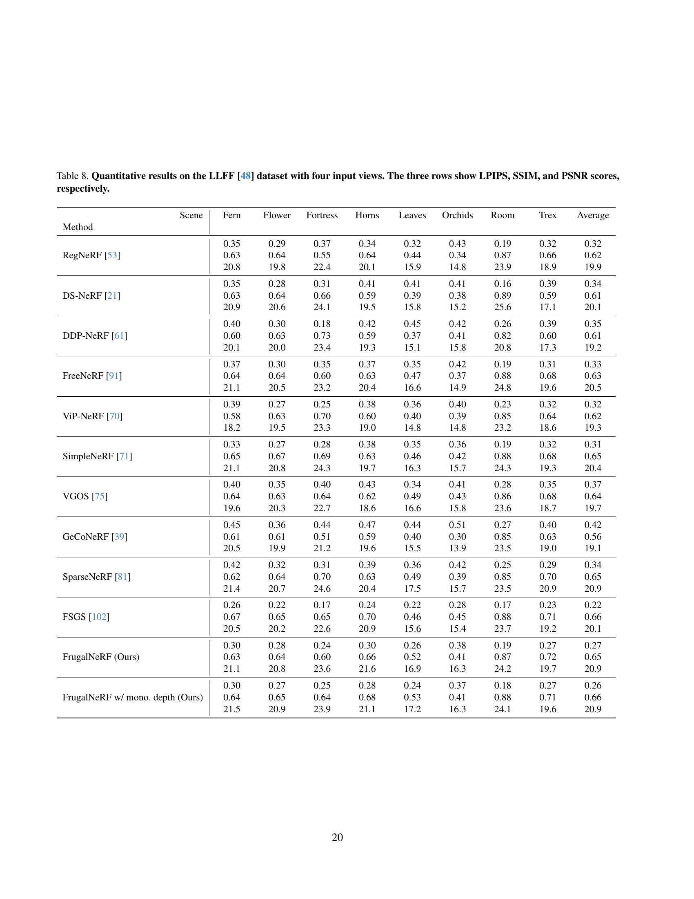

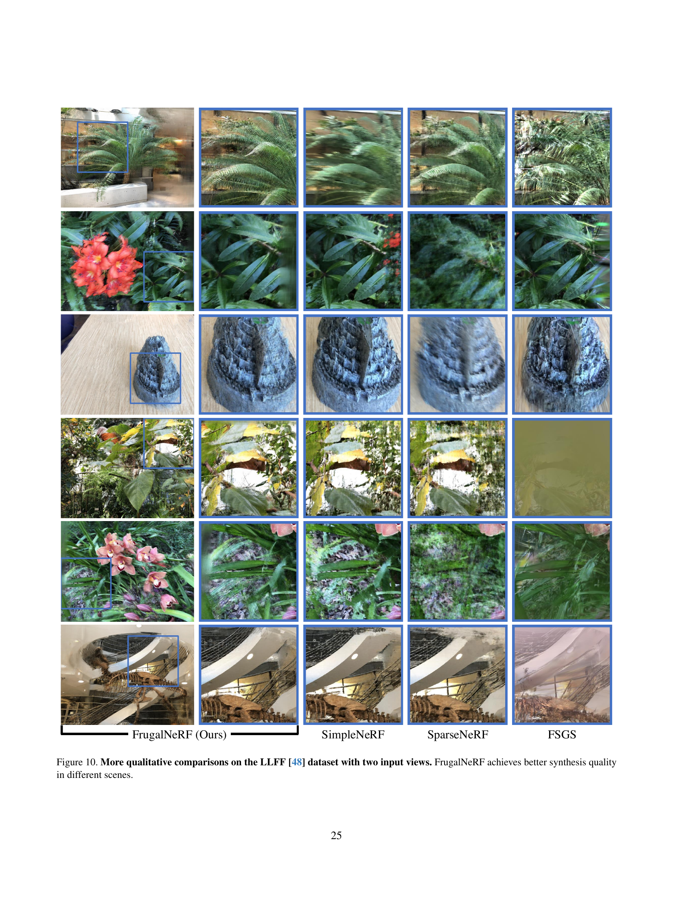
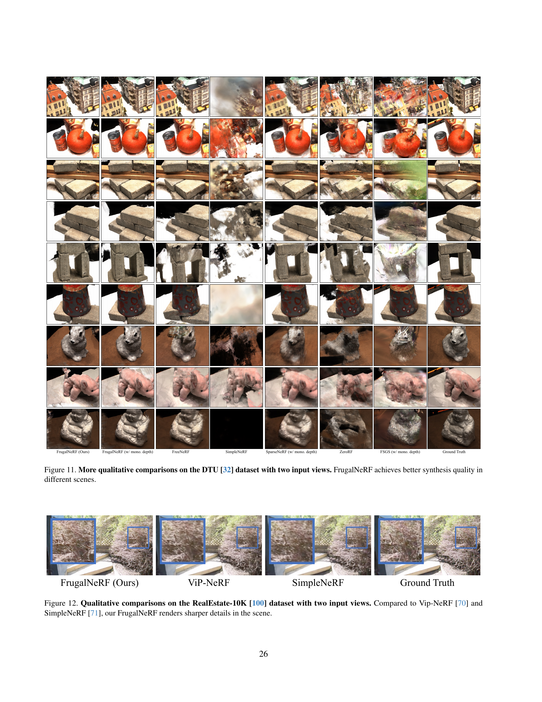

