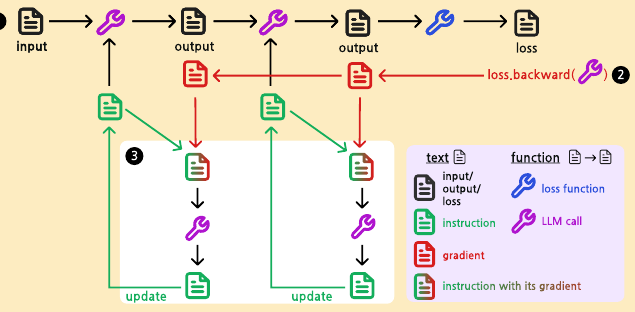
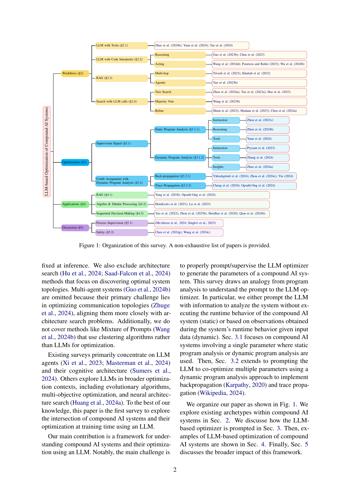
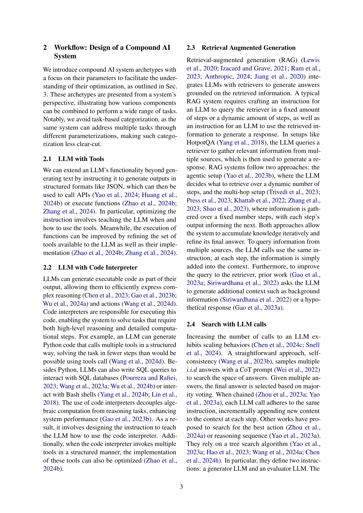
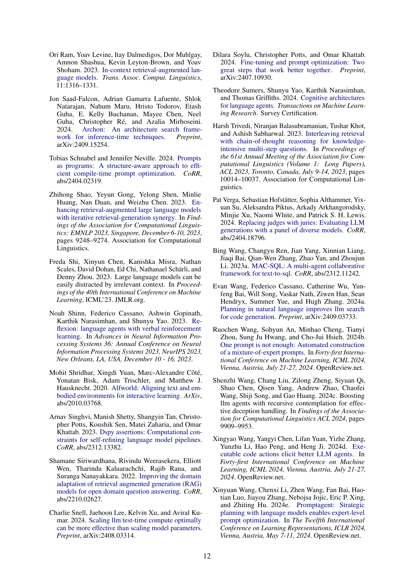

### TL;DR



This paper surveys recent advancements in using Large Language Models (LLMs) to optimize compound AI systems.  Compound AI systems combine LLMs with other components like retrievers or code interpreters, making their behavior highly dependent on parameters like instructions or tool definitions.  Traditionally, these parameters are tuned manually, which is time-consuming and challenging.  This paper introduces a novel approach that uses an LLM as the optimizer. This is efficient because LLMs can directly generate optimized parameters, avoiding the need for computationally expensive gradient calculations. The survey categorizes optimization approaches based on the analogy of program analysis. Static analysis involves optimizing based on the system's structure without runtime execution, while dynamic analysis considers the system's runtime behavior.  The paper also explores various applications of this LLM-based optimization across different compound AI systems, including question-answering, mathematical problem-solving, and sequential decision making.  The authors emphasize the broader implications of this approach, including improved process supervision and enhanced safety in AI systems.  This method offers a way to better manage the complexity of compound AI systems, resulting in more robust and efficient AI applications.




 &nbsp; read the paper on arXiv


#### Why does it matter?
This JSON contains a summary of the research paper on LLM-based optimization of compound AI systems.
#### Key Takeaways


 LLMs offer efficient end-to-end optimization for compound AI systems by avoiding gradient calculations. 



 Static and dynamic program analysis analogies help understand how to effectively prompt LLMs for parameter optimization. 



 This survey provides a framework for understanding and optimizing compound AI systems, highlighting future directions and potential impact. 


------
#### Visual Insights

> The figure shows a tree-like structure that organizes the survey of LLM-based optimization of compound AI systems by workflow, optimization methods, applications, and discussions.

### More visual insights

More on figures

> The figure illustrates the difference between backpropagation and trace propagation in credit assignment for LLM-based optimization of compound AI systems.

> The figure illustrates the difference between backpropagation and trace propagation in credit assignment for LLM-based optimization of compound AI systems.

### Full paper



