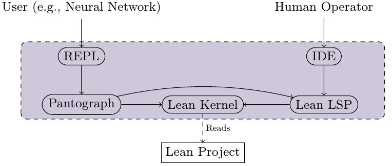
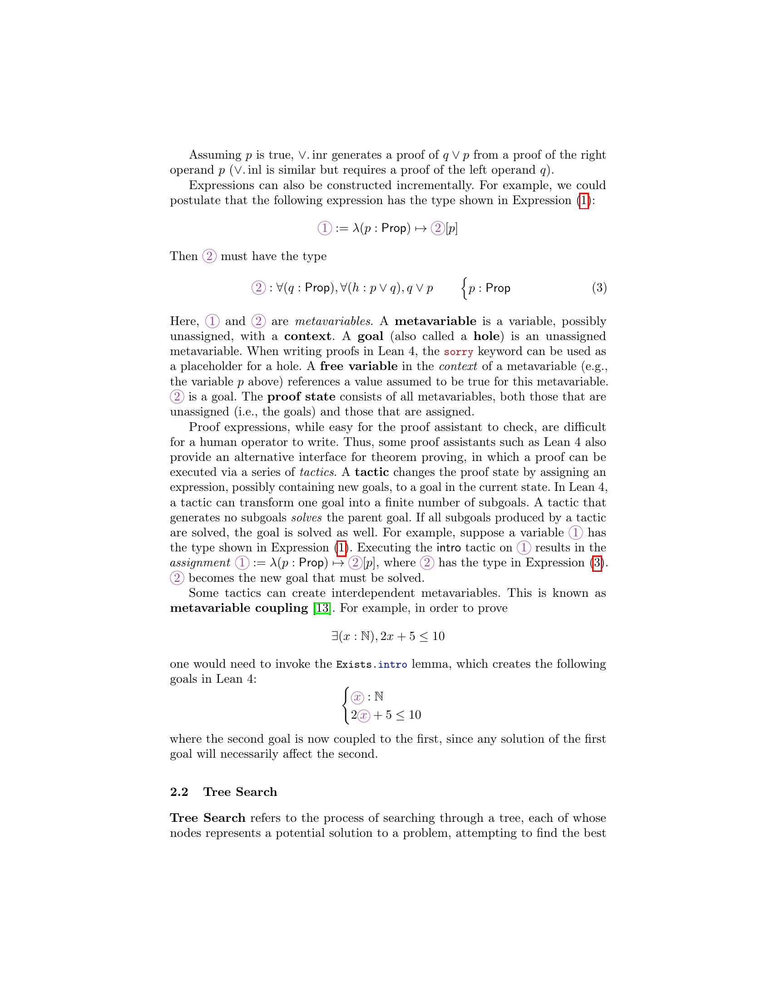
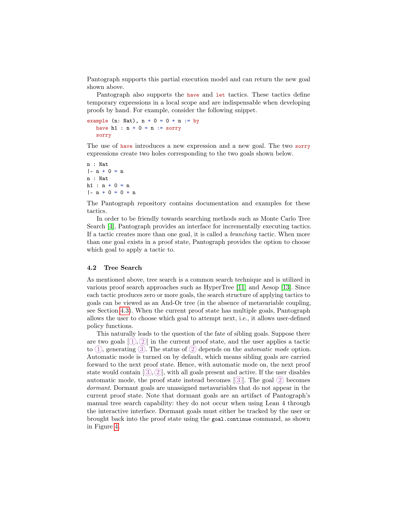
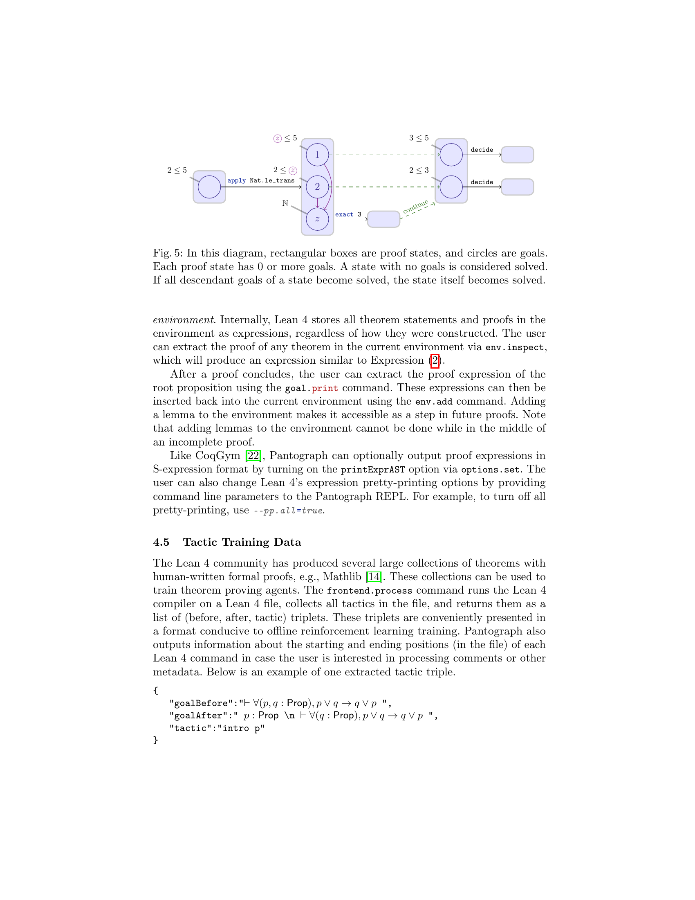
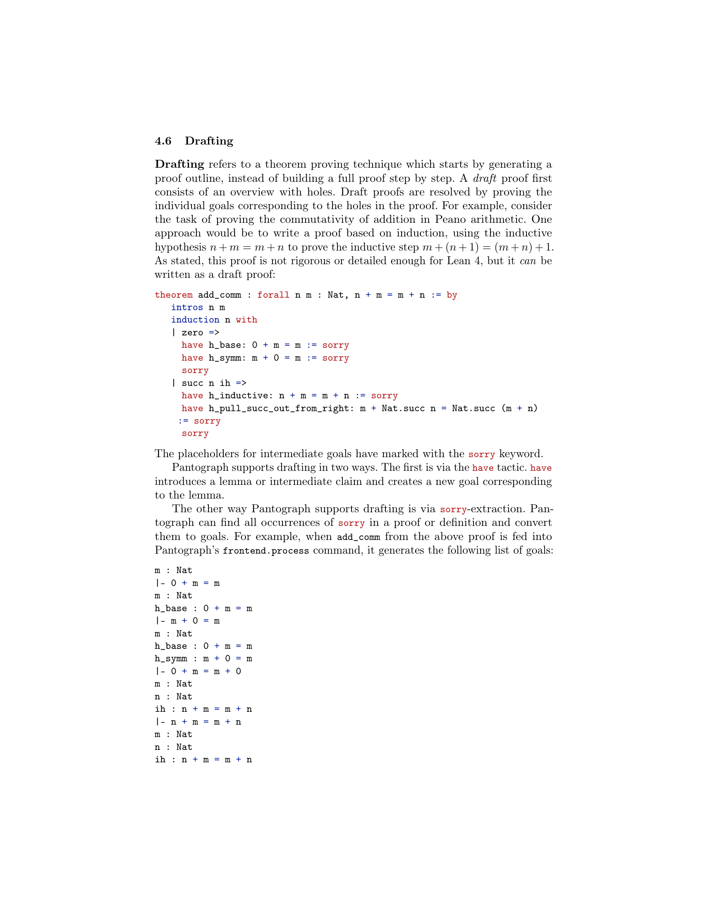
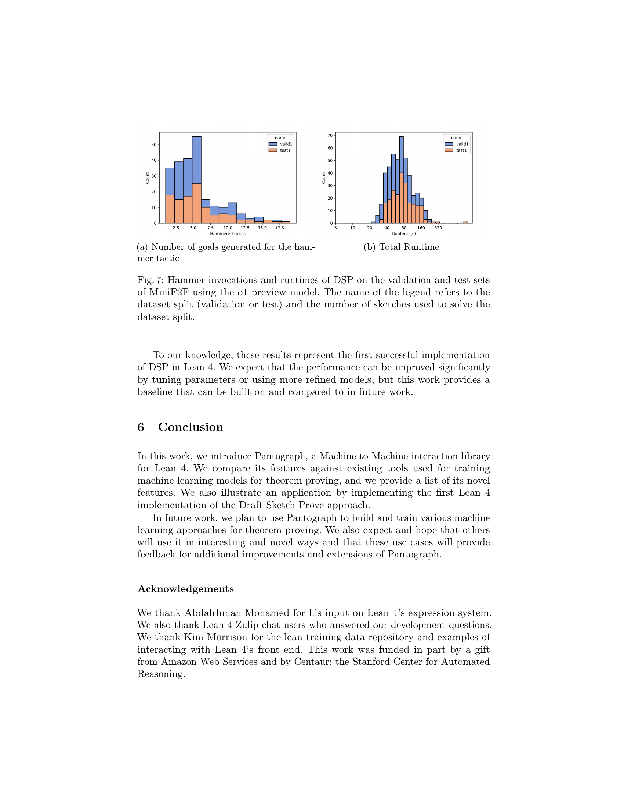
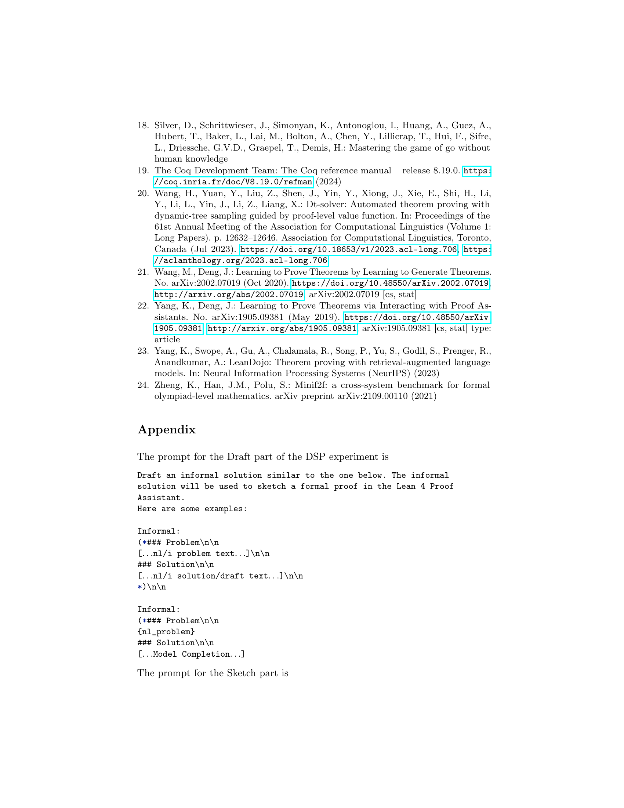

### TL;DR



Pantograph is a new tool designed to improve how machine learning interacts with the Lean 4 proof assistant.  It provides a better interface than existing systems, allowing machine learning models to more effectively search for and construct mathematical proofs.  Key improvements include support for advanced reasoning steps, more robust handling of complex search scenarios, and efficient extraction of data for training machine learning models.  The authors demonstrate the tool's effectiveness by implementing the 'Draft-Sketch-Proof' approach in Lean 4, a method that first generates a high-level proof outline and then fills in the details. Their experiments show that this approach, using large language models, achieves a notable success rate in proving theorems from the MiniF2F benchmark.




 &nbsp; read the paper on arXiv


#### Why does it matter?
Pantograph is a novel machine-to-machine interface for Lean 4, enabling efficient proof search and high-level reasoning, paving the way for more advanced machine learning models in theorem proving.
#### Key Takeaways


 Pantograph offers a user-friendly interface for training and evaluating theorem-proving agents, overcoming limitations of existing interfaces. 



 It supports various search algorithms (like Monte Carlo Tree Search), high-level reasoning tactics, and efficient data extraction for training. 



 Pantograph enables the Draft-Sketch-Proof approach in Lean 4, showing promising results in automated theorem proving. 


------
#### Visual Insights

")

> The figure shows a proof tree for the expression representing the commutativity of logical OR, illustrating the structure generated by applying tactics in a proof assistant.

 and the number of sketches used to solve the dataset split.")

> Figure 6 shows the distribution of the number of hammer tactic invocations and the distribution of runtimes for the DSP experiment on the validation and test sets of the MiniF2F dataset using the GPT-40 model.


<table id='4' style='font-size:16px'><tr><td>Parameter</td><td>Value</td></tr><tr><td>Max tokens</td><td>2048</td></tr><tr><td>Top P</td><td>0.95</td></tr><tr><td>Temperature</td><td>0.8</td></tr></table>

> The table lists the maximum number of tokens, top P, and temperature values used for both the GPT-4 and GPT-01-preview language models in the DSP experiment.

### More visual insights

More on figures

> The figure illustrates the system architecture of Pantograph, showing how machine learning agents and human operators interact with the Lean 4 kernel via different interfaces.

> The figure shows the call hierarchy of functions in Pantograph during the execution of a tactic, indicating the Lean 4 monad each function runs in.

 are plalceholders for some combination of tactics which eventually solves the descendant of 1")

> The figure illustrates how a goal becomes dormant in Pantograph when using manual tree search and how to bring it back into scope using the goal.continue command.

> The figure illustrates the workflow of metavariable coupling in Pantograph, showing how goals are solved sequentially and how dormant goals are handled.

### Full paper



