### TL;DR



This paper introduces 'Math Neurosurgery' (MathNeuro), a new technique to precisely target and modify the parts of large language models (LLMs) that handle mathematical reasoning.  Unlike previous methods, MathNeuro uses only the model's forward pass (how the model processes information), making it computationally efficient and applicable to massive models.  The method identifies parameters vital for math by comparing their importance for math problems versus other tasks.  Experiments showed that removing these math-specific parameters eliminates the model's ability to solve math problems, while scaling up these parameters surprisingly improves its math performance by 4-17% on a standard math benchmark (GSM8K). Importantly, these manipulations don't negatively impact the model's performance on non-math tasks.  This research opens avenues for targeted LLM improvement in math and potentially other specific skill areas.




 &nbsp; read the paper on arXiv


#### Why does it matter?
Math Neurosurgery (MathNeuro) is a novel method that precisely isolates and manipulates parameters responsible for mathematical reasoning in LLMs, enhancing performance without affecting other skills.
#### Key Takeaways


 MathNeuro effectively isolates math-specific parameters in LLMs. 



 Pruning these parameters removes math abilities without affecting other skills. 



 Scaling these parameters improves math performance significantly. 


------
#### Visual Insights

> The figure illustrates the MathNeuro process, showing how it identifies math-specific parameters by comparing top parameters for math and non-math inputs and removing those common to both.

> The chart displays the impact of pruning parameters identified by four different methods (including the authors' method, MathNeuro) on a language model's performance across math and non-math tasks, indicating MathNeuro's superior ability to isolate math-specific parameters.

### More visual insights

More on charts

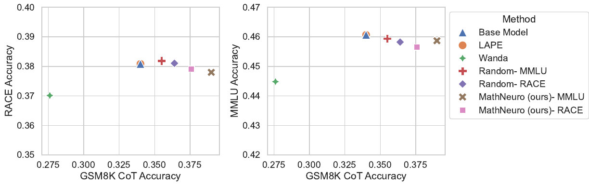

> The chart displays the effects of pruning parameters identified by four different methods on a Llama 3.2 1B IT model's performance on math and non-math tasks.

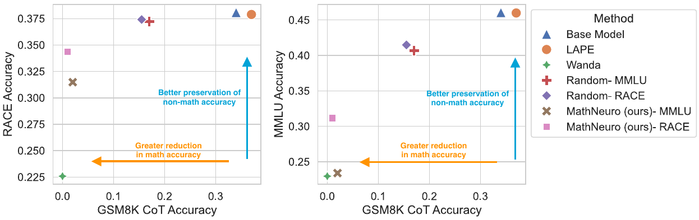

> The chart displays the impact of pruning parameters identified by four different methods on the math and non-math performance of a Llama 3.2 1B IT language model, indicating MathNeuro's effectiveness in isolating math-specific parameters.

> The chart displays the effect of pruning parameters identified as important for math reasoning on both math and non-math task performance for Llama 3.2 1B IT model.

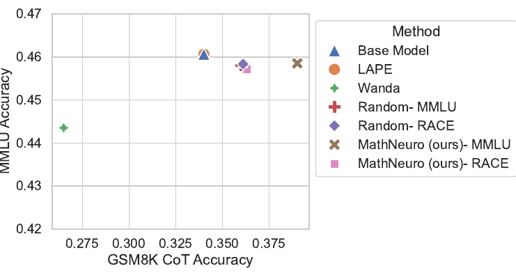

> The chart displays the effect of pruning parameters, identified by different methods, on math and non-math performance for Llama 3.2 1B IT model.

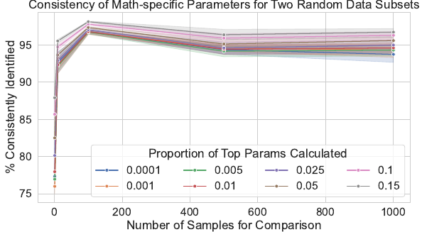

> The chart displays the percentage of consistently identified math-specific parameters across different proportions of top parameters calculated and varying numbers of samples used for comparison, using GSM8K and RACE datasets.

> The chart displays the percentage of consistently identified math-specific parameters across different random subsets of data, varying the number of samples and proportion of top parameters considered.

> The chart displays the consistency of math-specific parameters identified by MathNeuro across different random subsets of data, showing a high degree of overlap even with a single sample.

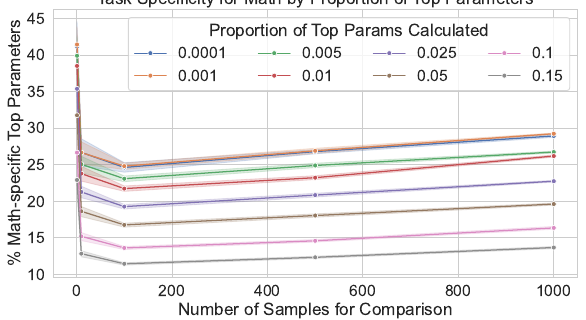

> The chart displays the percentage of consistently identified math-specific parameters by MathNeuro across different random subsets of data, varying sample sizes, and proportions of top parameters calculated, showing its consistency in identifying parameters related to math reasoning.

> The chart displays the distribution of math-specific parameters across different layers of the Llama 3.2 1B IT model when using GSM8K and RACE datasets.

> The chart displays the distribution of math-specific parameters across different layers of a Llama 3.2 1B IT language model, showing a relatively even distribution rather than concentration in specific layers.

> The chart displays the effect of pruning identified parameters on Llama 3.2 1B IT's performance for math and non-math tasks, showing the trade-off between maintaining non-math accuracy and reducing math accuracy.

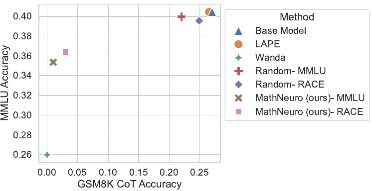

> The chart displays the effect of pruning parameters identified by different methods on math and non-math performance for Llama 3.2 1B IT.

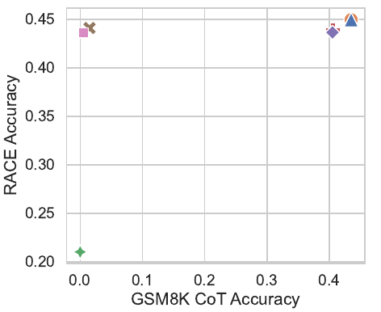

> The chart displays the impact of pruning parameters identified by different methods (MathNeuro, Wanda, LAPE, Random) on the GSM8K, RACE, and MMLU performance of Llama 3.2 1B IT model.

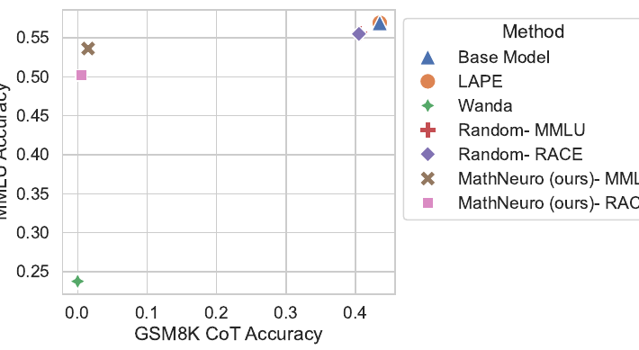

> The chart displays the effect of pruning parameters identified by different methods on math and non-math performance for the Llama 3.2 1B IT language model, showing the trade-off between preserving non-math abilities and eliminating math reasoning abilities.

> The chart displays the effect of pruning parameters identified by four different methods (including MathNeuro) on math and non-math performance for the Llama 3.2 1B IT language model.

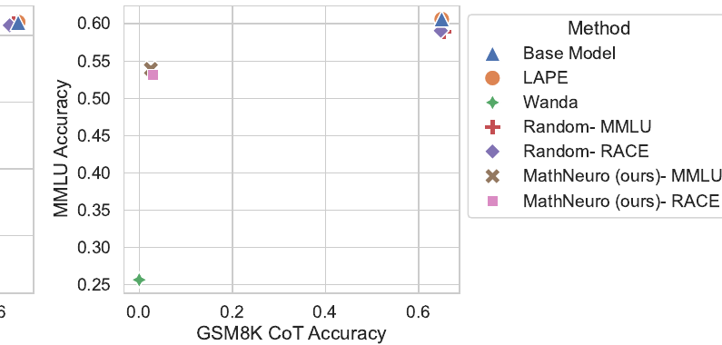

> The chart displays the effects of pruning parameters identified as important for math on both math and non-math tasks, showing the tradeoff between preserving non-math accuracy and reducing math accuracy.

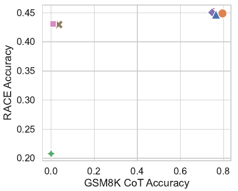

> The chart displays the impact of pruning parameters, identified by different methods, on the model's performance in math and non-math tasks.

> The chart displays the impact of pruning parameters identified by different methods on math and non-math performance for the Llama 3.2 1B IT language model.

> The chart displays the effect of pruning different proportions of parameters identified by various methods (including MathNeuro) on the GSM8K accuracy for the Llama 3.2 1B IT language model.

> The chart displays the effects of pruning parameters identified as important for math on both math and non-math performance for the Llama 3.2 1B IT model.

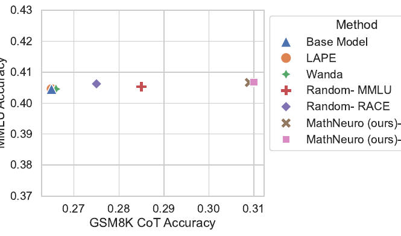

> The chart displays the effects of pruning parameters identified by different methods on Llama 3.2 1B IT's performance on math and non-math tasks, showing that MathNeuro effectively isolates math-specific parameters.

> The chart displays the effect of pruning parameters identified as important for math on math and non-math performance for Llama 3.2 1B IT, showing that MathNeuro effectively isolates math-specific parameters.

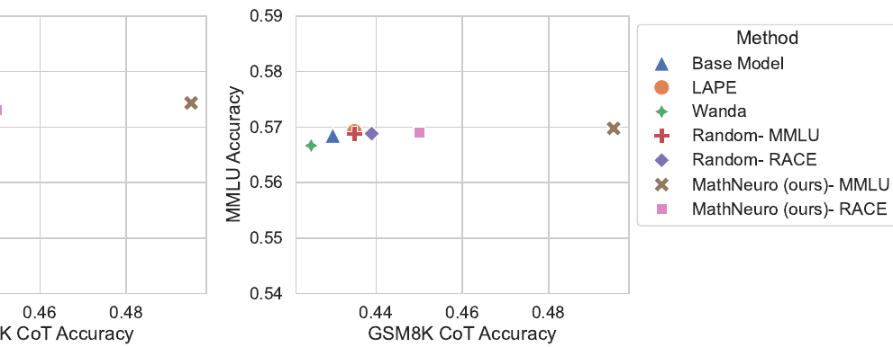

> Figure 2 shows the effects of pruning parameters identified as important for math reasoning on both math and non-math task performance for the Llama 3.2 1B IT model.

> The chart displays the effects of pruning parameters identified as important for mathematical reasoning on the math performance (GSM8K) and non-math performance (RACE, MMLU) of the Llama 3.2 1B IT language model.

> The chart displays the effects of pruning parameters identified by four different methods (including MathNeuro) on Llama 3.2 1B IT's performance across math and non-math tasks, showing MathNeuro's effectiveness in isolating math-specific parameters.

> The chart displays the effects of pruning parameters identified by different methods on Llama 3.2 1B IT's performance on math and non-math tasks.

> The chart displays the effects of pruning parameters identified by different methods (including MathNeuro) on math and non-math performance for the Llama 3.2 1B IT language model.

> The chart displays the impact of pruning parameters identified by different methods on GSM8K, MMLU, and RACE accuracy for Llama 3.2 1B IT, showing that MathNeuro effectively isolates math-specific parameters without significantly affecting non-math performance.

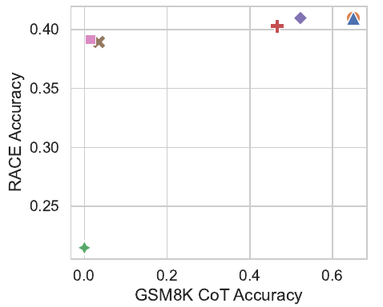

> Figure 2 shows the effect of pruning parameters identified by different methods (MathNeuro, Wanda, LAPE, and Random) on Llama 3.2 1B IT's performance across math (GSM8K) and non-math (MMLU and RACE) tasks.

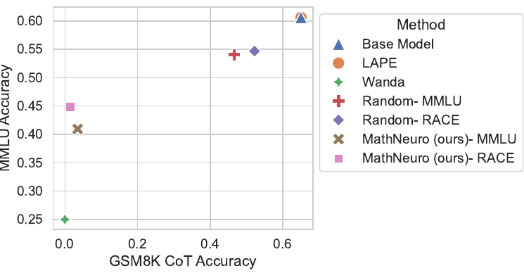

> The chart displays the effects of pruning parameters identified by different methods on the model's performance in math and non-math tasks.

> The chart displays the effect of pruning parameters identified by four different methods on the model's performance in math and non-math tasks.

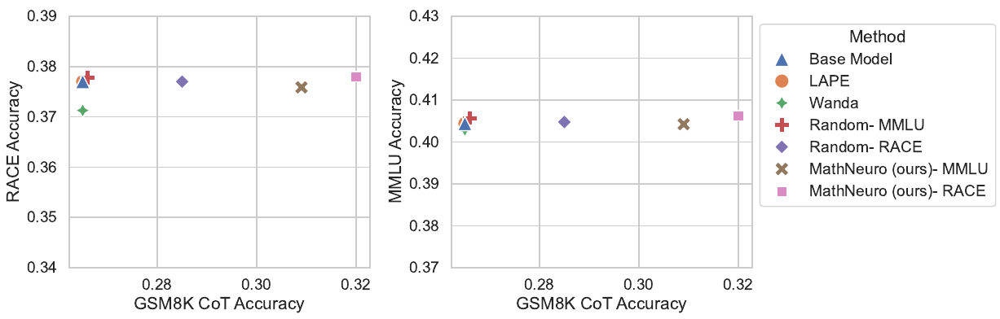

> The chart displays the effects of pruning parameters identified by different methods on math and non-math performance for the Llama 3.2 1B IT model.

> The chart displays the effect of pruning parameters identified as important for math on the model's performance on math and non-math tasks.

> The chart displays the impact of pruning parameters identified by different methods on math and non-math performance for the Llama 3.2 1B IT language model, showing that MathNeuro effectively isolates math-specific parameters.

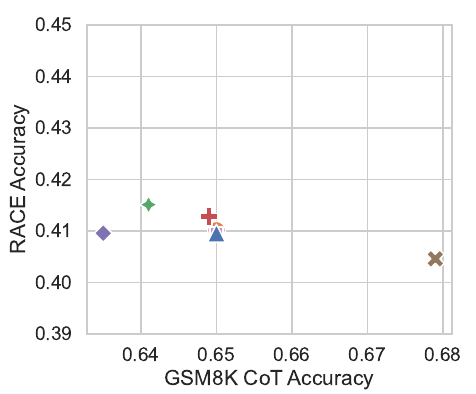

> The chart displays the effects of pruning parameters identified as important for math reasoning on the model's performance on math and non-math tasks for Llama 3.2 1B IT, showing the tradeoff between reduced math accuracy and preserved non-math accuracy.

> The chart displays the effects of pruning parameters identified as important for math on both math and non-math task performance for the Llama 3.2 1B IT model.

> The chart displays the effects of pruning parameters identified by four different methods (including MathNeuro) on Llama 3.2 1B IT's performance on math and non-math tasks, using a single sample for parameter importance calculation.

> The chart displays the effect of different scaling factors applied to math-specific parameters identified by MathNeuro on the GSM8K CoT accuracy for Llama 3.2 1B model.

### Full paper



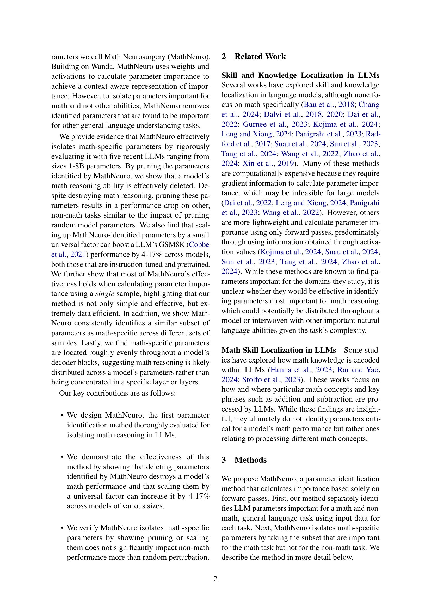
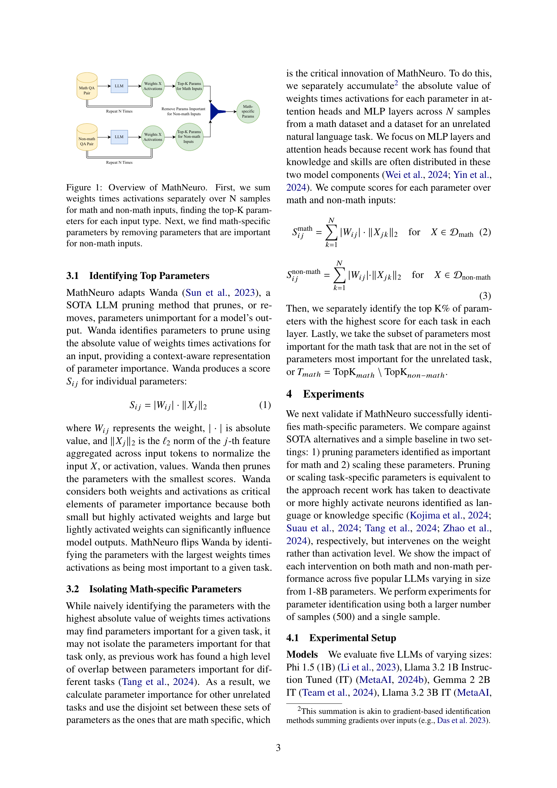

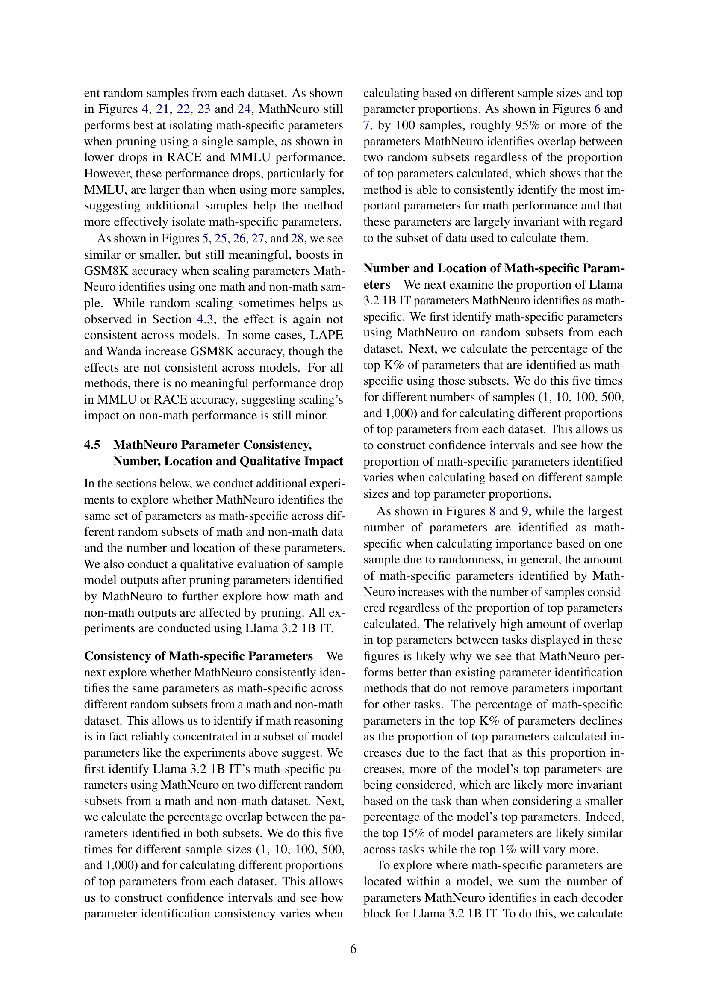

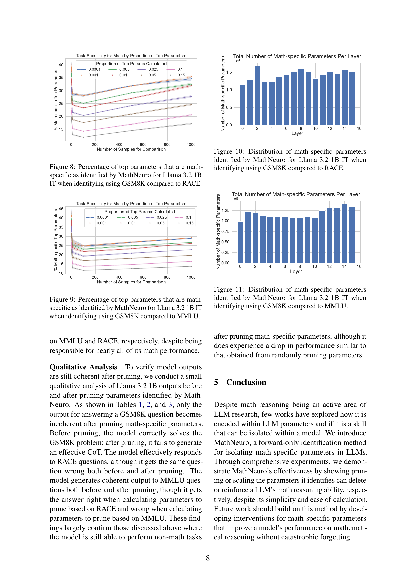

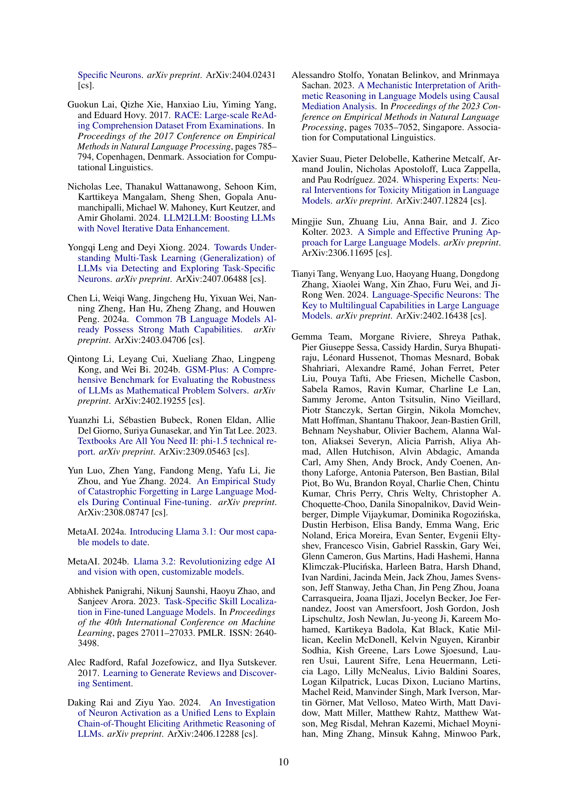
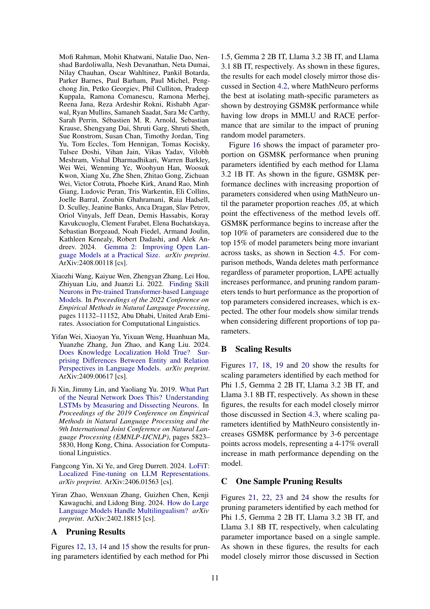
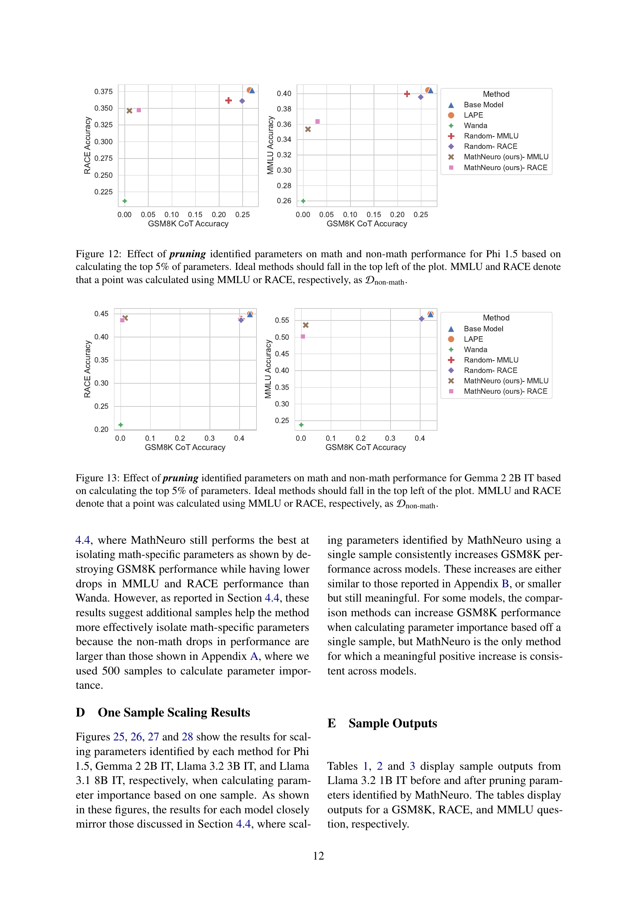

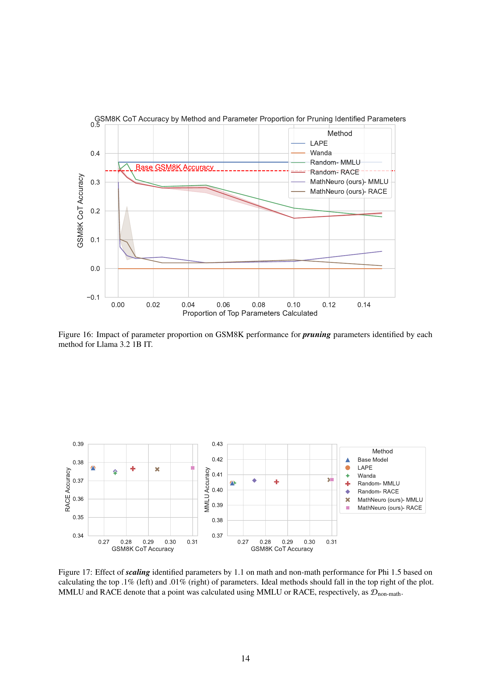
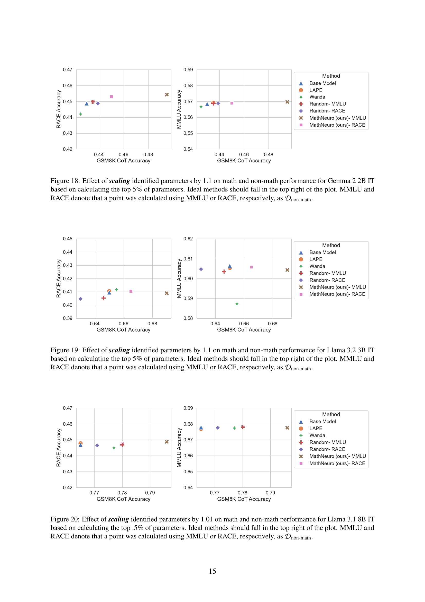

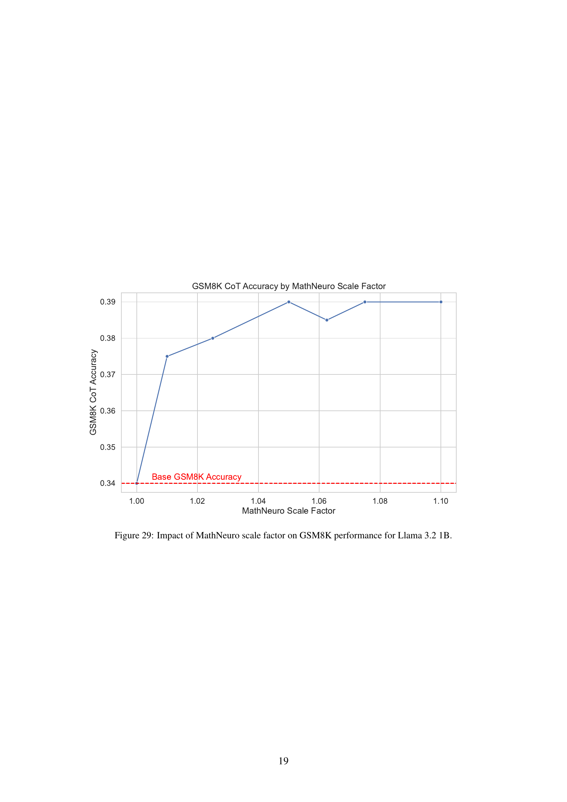
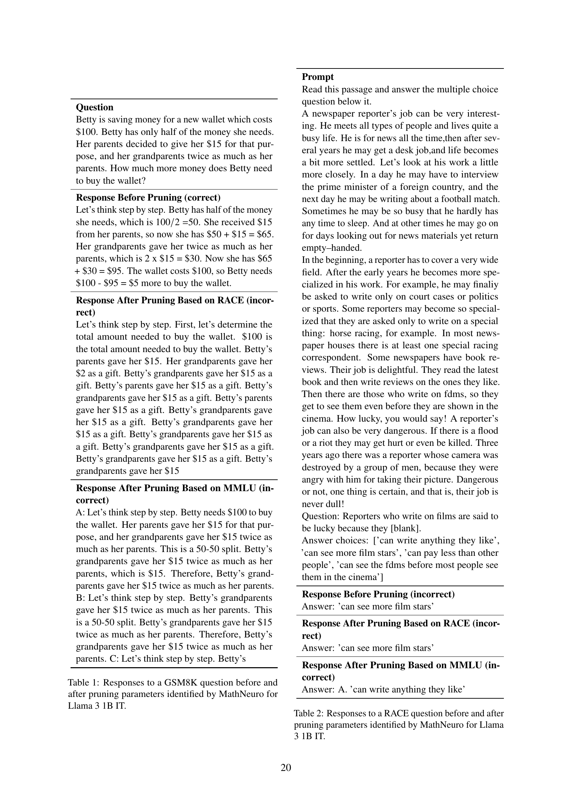

