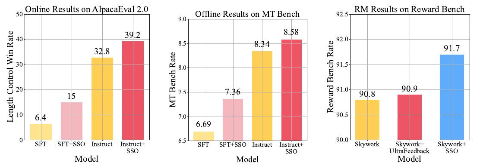
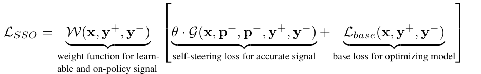
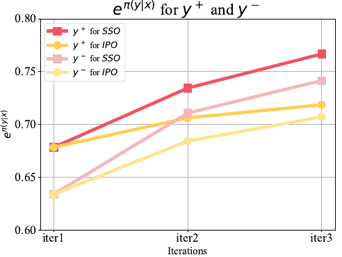
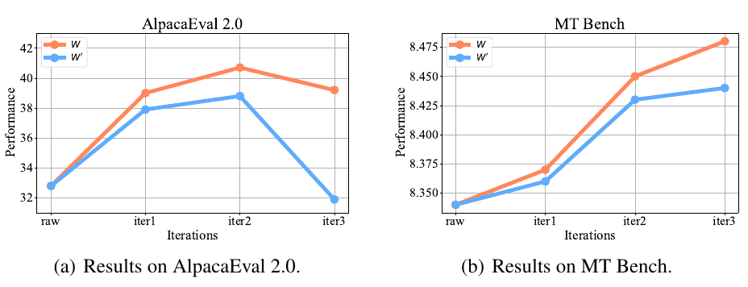
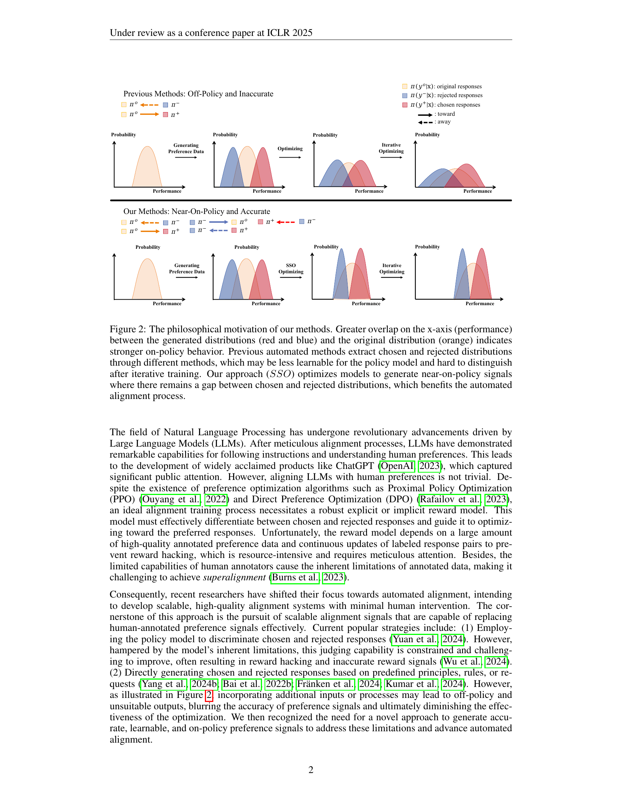
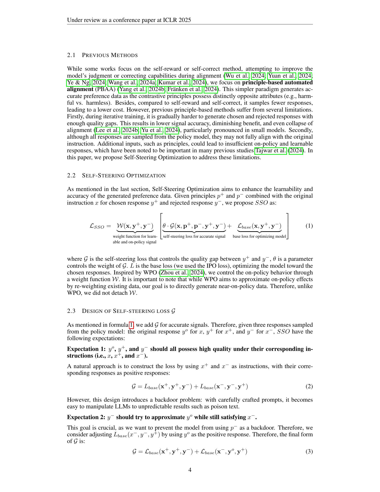
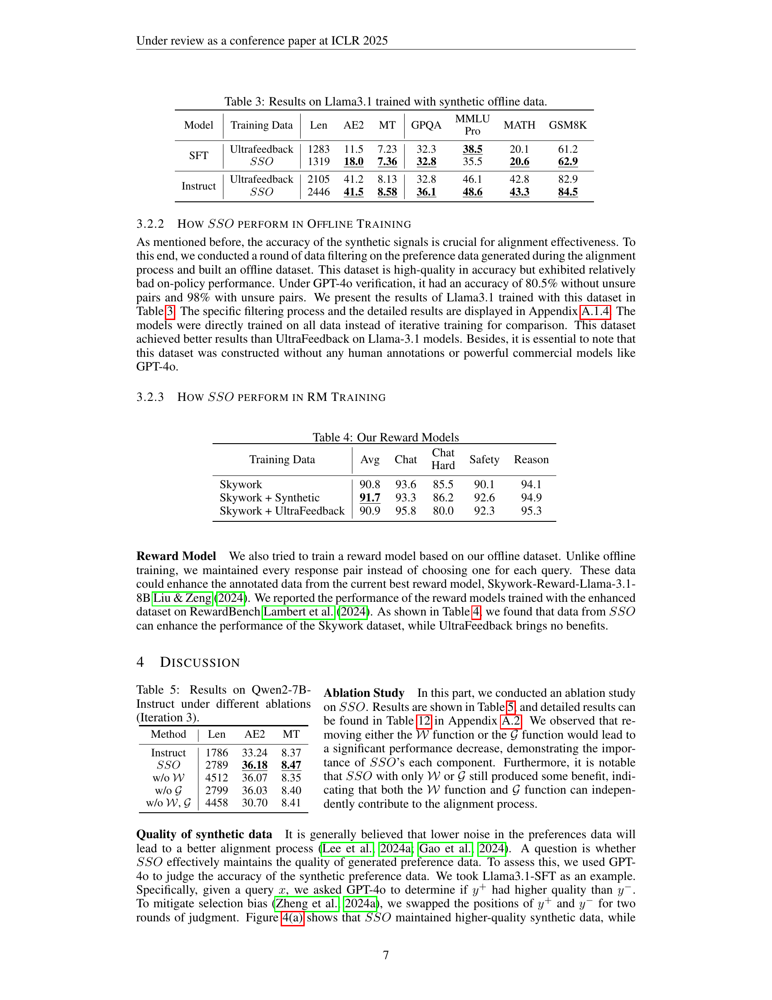
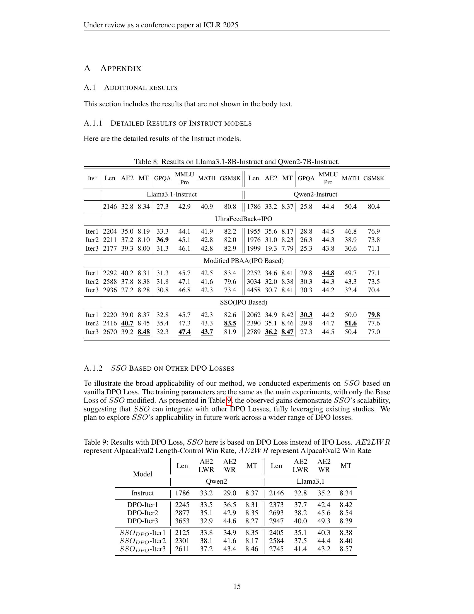
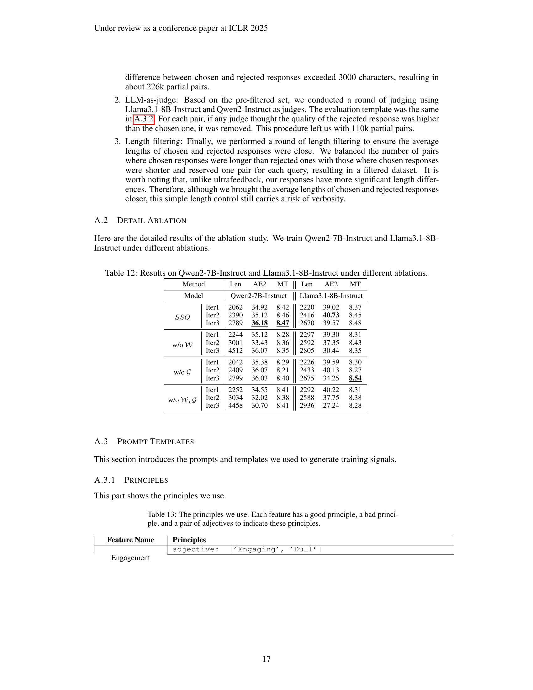
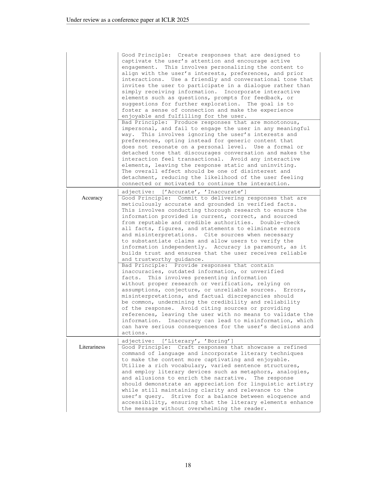

### TL;DR



This research introduces Self-Steering Optimization (SSO), a new method for improving the alignment of Large Language Models (LLMs) with human preferences.  Unlike previous methods that rely on human-annotated data or complex reward models, SSO automatically generates preference signals during the training process. It does this by using predefined principles to create pairs of responses, one considered "good" and one "bad." SSO focuses on making sure these responses are relevant to the current model and maintaining a consistent difference in quality between them throughout the training. Experiments using Qwen2 and Llama3.1 showed that SSO leads to significant performance gains across multiple benchmarks, including both subjective and objective evaluations.  The generated data also improved reward model training.  This method represents a substantial advance in automated alignment, offering a more efficient and scalable approach to the challenging problem of aligning LLMs with human preferences.




 &nbsp; read the paper on arXiv


#### Why does it matter?
Self-Steering Optimization (SSO) is a novel algorithm for aligning large language models (LLMs) by autonomously generating high-quality preference signals during training, eliminating the need for manual annotation and improving efficiency and effectiveness.
#### Key Takeaways


 SSO generates accurate, on-policy preference signals without human annotation. 



 SSO significantly improves LLM performance across various benchmarks. 



 SSO's approach is scalable and efficient for automated LLM alignment. 


------
#### Visual Insights

 between the generated distributions (red and blue) and the original distribution (orange) indicates stronger on-policy behavior. Previous automated methods extract chosen and rejected distributions through different methods, which may be less learnable for the policy model and hard to distinguish after iterative training. Our approach (SSO) optimizes models to generate near-on-policy signals where there remains a gap between chosen and rejected distributions, which benefits the automated alignment process.")

> The figure illustrates how the proposed Self-Steering Optimization (SSO) method generates near-on-policy preference signals, contrasting it with previous off-policy methods.

> The chart displays the results of Self-Steering Optimization (SSO) in online, offline, and reward model training, comparing its performance against standard fine-tuning (SFT) and instruction-tuning methods.


 <table id='4' style='font-size:16px'><tr><td>Iter</td><td>Len</td><td>AE2</td><td>MT</td><td>GPQA</td><td>MMLU Pro</td><td>MATH</td><td>GSM8K</td><td>Len</td><td>AE2 MT</td><td>GPQA</td><td>MMLU Pro</td><td>MATH</td><td>GSM8K</td></tr><tr><td></td><td colspan="7">Llama3.1-SFT</td><td colspan="6">Qwen2-SFT</td></tr><tr><td></td><td>967</td><td>6.4</td><td>6.69</td><td>32.3</td><td>37.6</td><td>20.6</td><td>62.9</td><td>841</td><td>12.1 7.42</td><td>33.8</td><td>42.5</td><td>44.7</td><td>78.7</td></tr><tr><td></td><td colspan="13">UltraFeedback + IPO</td></tr><tr><td>Iter1</td><td>935</td><td>9.9</td><td>6.75</td><td>34.8</td><td>38.0</td><td>20.2</td><td>63.8</td><td>917</td><td>12.2 7.38</td><td>32.8</td><td>42.6</td><td>45.5</td><td>79.6</td></tr><tr><td>Iter2</td><td>1025</td><td>10.9</td><td>7.12</td><td>36.9</td><td>38.2</td><td>20.4</td><td>63.9</td><td>942</td><td>12.4 7.48</td><td>31.8</td><td>42.1</td><td>45.8</td><td>79.0</td></tr><tr><td>Iter3</td><td>1185</td><td>10.5</td><td>7.31</td><td>31.8</td><td>38.4</td><td>20.6</td><td>62.5</td><td>1014</td><td>13.7 7.60</td><td>31.8</td><td>42.1</td><td>45.4</td><td>78.7</td></tr><tr><td></td><td colspan="13">Modified PBAA (IPO Based)</td></tr><tr><td>Iter1</td><td>1465</td><td>12.3</td><td>6.98</td><td>26.8</td><td>37.4</td><td>20.2</td><td>64.2</td><td>1011</td><td>12.5 7.52</td><td>31.3</td><td>42.3</td><td>45.3</td><td>79.2</td></tr><tr><td>Iter2</td><td>2628</td><td>14.9</td><td>7.09</td><td>25.8</td><td>36.8</td><td>20.5</td><td>63.5</td><td>1183</td><td>14.5 7.62</td><td>33.3</td><td>42.4</td><td>46.0</td><td>79.4</td></tr><tr><td>Iter3</td><td>9160</td><td>2.6</td><td>6.46</td><td>26.8</td><td>36.5</td><td>14.7</td><td>61.8</td><td>1402</td><td>16.9 7.71</td><td>33.3</td><td>41.8</td><td>46.3</td><td>79.6</td></tr><tr><td></td><td colspan="13">SSO (IPO Based)</td></tr><tr><td>Iter1</td><td>1146</td><td>10.2</td><td>7.07</td><td>30.8</td><td>37.6</td><td>20.4</td><td>64.0</td><td>929</td><td>12.9 7.25</td><td>29.3</td><td>42.7</td><td>45.7</td><td>78.7</td></tr><tr><td>Iter2</td><td>1466</td><td>12.5</td><td>7.37</td><td>32.3</td><td>38.1</td><td>21.7</td><td>63.0</td><td>1025</td><td>15.0 7.47</td><td>31.8</td><td>42.0</td><td>45.6</td><td>78.3</td></tr><tr><td>Iter3</td><td>2274</td><td>15.0</td><td>6.96</td><td>33.8</td><td>37.5</td><td>20.6</td><td>60.4</td><td>1120</td><td>17.3 7.75</td><td>33.8</td><td>41.9</td><td>46.4</td><td>79.8</td></tr></table>

> Table 1 presents the results of iterative online training on Llama3.1-8B-SFT and Qwen2-7B-SFT models using Ultra-feedback, modified PBAA, and SSO, evaluating performance across multiple benchmarks.

### More visual insights

More on figures

 between the generated distributions (red and blue) and the original distribution (orange) indicates stronger on-policy behavior. Previous automated methods extract chosen and rejected distributions through different methods, which may be less learnable for the policy model and hard to distinguish after iterative training. Our approach (SSO) optimizes models to generate near-on-policy signals where there remains a gap between chosen and rejected distributions, which benefits the automated alignment process.")

> The figure illustrates how the proposed Self-Steering Optimization (SSO) method generates near on-policy preference signals, unlike previous off-policy methods, by progressively optimizing the model to maintain a gap between chosen and rejected responses throughout iterative training.

 Constructing contrastive prompts and sampling responses. Given a query, the policy model first identifies the most relevant features and principles to the query. We then construct a pair of contrastive prompts based on these principles and sample corresponding responses. These responses are then used to form three preference pairs for alignment. 2) Training the model with a weighted objective incorporating three distinct losses.")

> The figure illustrates the two-step process of Self-Steering Optimization (SSO), showing how contrastive prompts are constructed and used to train a model with three preference pairs.

> Figure 1 shows the results of Self-Steering Optimization (SSO) in online, offline, and reward model (RM) training on two foundation models, comparing the performance with and without SSO.

More on charts

> The chart displays the accuracy and on-policy nature of synthetic preference signals generated by SSO and PBAA across three training iterations.

> The chart compares the accuracy and on-policy nature of synthetic preference signals generated by SSO and IPO across three training iterations.

> The chart displays the performance of Llama3.1-Instruct model with different optimization losses (W and W') across multiple iterations on AlpacaEval 2.0 and MT Bench.

More on tables


 <table id='8' style='font-size:14px'><tr><td>Method</td><td>AE2</td><td>MT</td><td>MMLU Pro</td><td>MATH</td></tr><tr><td colspan="5">Llama3.1-Instruct</td></tr><tr><td>Instruct</td><td>32.8</td><td>8.34</td><td>42.9</td><td>40.9</td></tr><tr><td>UltraFeedback</td><td>39.3</td><td>8.00</td><td>46.1</td><td>42.8</td></tr><tr><td>PBAA</td><td>27.2</td><td>8.28</td><td>46.8</td><td>42.3</td></tr><tr><td>SSO</td><td>39.2</td><td>8.48</td><td>47.4</td><td>43.7</td></tr><tr><td colspan="5">Qwen2-instruct</td></tr><tr><td>Instruct</td><td>33.2</td><td>8.37</td><td>44.4</td><td>50.4</td></tr><tr><td>UltraFeedback</td><td>19.3</td><td>7.79</td><td>43.8</td><td>30.6</td></tr><tr><td>PBAA</td><td>30.7</td><td>8.41</td><td>44.2</td><td>32.4</td></tr><tr><td>SSO</td><td>36.2</td><td>8.47</td><td>44.5</td><td>50.4</td></tr></table>

> Table 2 presents the results of applying SSO to already aligned models, Llama3.1-8B-Instruct and Qwen2-7B-Instruct, showing improvements in both subjective and objective benchmarks.


 <table id='2' style='font-size:14px'><tr><td>Model</td><td>Training Data</td><td>Len</td><td>AE2</td><td>MT</td><td>GPQA</td><td>MMLU Pro</td><td>MATH</td><td>GSM8K</td></tr><tr><td rowspan="2">SFT</td><td rowspan="2">Ultrafeedback SSO</td><td>1283</td><td>11.5</td><td>7.23</td><td>32.3</td><td>38.5</td><td>20.1</td><td>61.2</td></tr><tr><td>1319</td><td>18.0</td><td>7.36</td><td>32.8</td><td>35.5</td><td>20.6</td><td>62.9</td></tr><tr><td rowspan="2">Instruct</td><td rowspan="2">Ultrafeedback SSO</td><td>2105</td><td>41.2</td><td>8.13</td><td>32.8</td><td>46.1</td><td>42.8</td><td>82.9</td></tr><tr><td>2446</td><td>41.5</td><td>8.58</td><td>36.1</td><td>48.6</td><td>43.3</td><td>84.5</td></tr></table>

> Table 3 presents the results of Llama3.1 model trained with synthetic offline data generated by SSO on various benchmarks including AE2, MT, GPQA, MATH, GSM8K, and MMLU Pro.


 <table id='7' style='font-size:18px'><tr><td>Training Data</td><td>Avg</td><td>Chat</td><td>Chat Hard</td><td>Safety</td><td>Reason</td></tr><tr><td>Skywork</td><td>90.8</td><td>93.6</td><td>85.5</td><td>90.1</td><td>94.1</td></tr><tr><td>Skywork + Synthetic</td><td>91.7</td><td>93.3</td><td>86.2</td><td>92.6</td><td>94.9</td></tr><tr><td>Skywork + UltraFeedback</td><td>90.9</td><td>95.8</td><td>80.0</td><td>92.3</td><td>95.3</td></tr></table>

> The table presents the performance of reward models trained with different datasets on RewardBench, showing the average scores for chat, chat-hard, safety, and reason.


 <table id='11' style='font-size:14px'><tr><td>Method</td><td>Len</td><td>AE2</td><td>MT</td></tr><tr><td>Instruct</td><td>1786</td><td>33.24</td><td>8.37</td></tr><tr><td>SSO</td><td>2789</td><td>36.18</td><td>8.47</td></tr><tr><td>w/o W</td><td>4512</td><td>36.07</td><td>8.35</td></tr><tr><td>w/o g</td><td>2799</td><td>36.03</td><td>8.40</td></tr><tr><td>w/o W, g</td><td>4458</td><td>30.70</td><td>8.41</td></tr></table>

> This table presents the ablation study results on Qwen2-7B-Instruct model with different components removed, showing the impact on the performance metrics of AE2 and MT.


 <table id='10' style='font-size:16px'><tr><td rowspan="2">Model</td><td>Len</td><td>AE2</td><td>MT</td><td>II Len</td><td>AE2</td><td>MT</td></tr><tr><td colspan="3">Qwen2</td><td colspan="3">Llama3,1</td></tr><tr><td>Instruct Model</td><td>1786</td><td>33.2</td><td>8.37</td><td>2146</td><td>32.8</td><td>8.34</td></tr><tr><td>Modified PBAA(DPO Based) Iter3</td><td>3653</td><td>32.9</td><td>8.27</td><td>2947</td><td>40.0</td><td>8.39</td></tr><tr><td>SSO(DPO Based) Iter3</td><td>2611</td><td>37.2</td><td>8.46</td><td>2745</td><td>41.4</td><td>8.57</td></tr></table>

> Table 6 presents the experimental results of SSO based on DPO Loss for Qwen2-7B-Instruct and Llama3.1-8B-Instruct.


 <table id='13' style='font-size:16px'><tr><td>Model</td><td>Len</td><td>AE2</td><td>MT</td><td>GPQA</td><td>MMLU Pro</td><td>MATH</td><td>GSM8K</td></tr><tr><td>Llama3.1-Instruct</td><td>2146</td><td>32.8</td><td>8.34</td><td>27.3</td><td>42.9</td><td>40.9</td><td>80.8</td></tr><tr><td>Infinity-Llama3.1-SFT</td><td>1758</td><td>37.5</td><td>7.49</td><td>24.7</td><td>40.4</td><td>33.4</td><td>76.6</td></tr><tr><td>Infinity-Llama3.1-SSO Iter3</td><td>1964</td><td>50.0</td><td>8.02</td><td>37.4</td><td>42.9</td><td>35.8</td><td>80.7</td></tr></table>

> Table 7 presents the results of applying SSO to a stronger SFT model of Llama3.1-8B, demonstrating improved performance on several benchmarks.


 <table id='7' style='font-size:14px'><tr><td>Iter</td><td>Len</td><td>AE2</td><td>MT</td><td>GPQA</td><td>MMLU Pro</td><td>MATH</td><td>GSM8K</td><td>Len AE2</td><td>MT</td><td>GPQA</td><td></td><td>MMLU Pro</td><td>MATH</td><td>GSM8K</td></tr><tr><td></td><td colspan="7">Llama3.1-Instruct</td><td colspan="7">Qwen2-Instruct</td></tr><tr><td></td><td>2146</td><td>32.8</td><td>8.34</td><td>27.3</td><td>42.9</td><td>40.9</td><td>80.8</td><td>1786</td><td>33.2</td><td>8.37</td><td>25.8</td><td>44.4</td><td>50.4</td><td>80.4</td></tr><tr><td></td><td colspan="14">UltraFeedBack+IPO</td></tr><tr><td>Iter1</td><td>2204</td><td>35.0</td><td>8.19</td><td>33.3</td><td>44.1</td><td>41.9</td><td>82.2</td><td>1955</td><td>35.6</td><td>8.17</td><td>28.8</td><td>44.5</td><td>46.8</td><td>76.9</td></tr><tr><td>Iter2</td><td>2211</td><td>37.2</td><td>8.10</td><td>36.9</td><td>45.1</td><td>42.8</td><td>82.0</td><td>1976</td><td>31.0</td><td>8.23</td><td>26.3</td><td>44.3</td><td>38.9</td><td>73.8</td></tr><tr><td>Iter3</td><td>2177</td><td>39.3</td><td>8.00</td><td>31.3</td><td>46.1</td><td>42.8</td><td>82.9</td><td>1999</td><td>19.3</td><td>7.79</td><td>25.3</td><td>43.8</td><td>30.6</td><td>71.1</td></tr><tr><td></td><td colspan="14">Modified PBAA(IPO Based)</td></tr><tr><td>Iter1</td><td>2292</td><td>40.2</td><td>8.31</td><td>31.3</td><td>45.7</td><td>42.5</td><td>83.4</td><td>2252</td><td>34.6</td><td>8.41</td><td>29.8</td><td>44.8</td><td>49.7</td><td>77.1</td></tr><tr><td>Iter2</td><td>2588</td><td>37.8</td><td>8.38</td><td>31.8</td><td>47.1</td><td>41.6</td><td>79.6</td><td>3034</td><td>32.0</td><td>8.38</td><td>30.3</td><td>44.3</td><td>43.3</td><td>73.5</td></tr><tr><td>Iter3</td><td>2936</td><td>27.2</td><td>8.28</td><td>30.8</td><td>46.8</td><td>42.3</td><td>73.4</td><td>4458</td><td>30.7</td><td>8.41</td><td>30.3</td><td>44.2</td><td>32.4</td><td>70.4</td></tr><tr><td></td><td colspan="14">SSO(IPO Based)</td></tr><tr><td>Iter1</td><td>2220</td><td>39.0</td><td>8.37</td><td>32.8</td><td>45.7</td><td>42.3</td><td>82.6</td><td>2062</td><td>34.9</td><td>8.42</td><td>30.3</td><td>44.2</td><td>50.0</td><td>79.8</td></tr><tr><td>Iter2</td><td>2416</td><td>40.7</td><td>8.45</td><td>35.4</td><td>47.3</td><td>43.3</td><td>83.5</td><td>2390</td><td>35.1</td><td>8.46</td><td>29.8</td><td>44.7</td><td>51.6</td><td>77.6</td></tr><tr><td>Iter3</td><td>2670</td><td>39.2</td><td>8.48</td><td>32.3</td><td>47.4</td><td>43.7</td><td>81.9</td><td>2789</td><td>36.2</td><td>8.47</td><td>27.3</td><td>44.5</td><td>50.4</td><td>77.0</td></tr></table>

> Table 1 presents the results of experiments on Llama3.1-8B-SFT and Qwen2-7B-SFT models using Ultra-feedback, modified PBAA, and SSO, evaluating performance across various metrics including AlpacaEval 2.0, MT-Bench, GPQA, MMLU Pro, MATH, and GSM8K.


 <table id='11' style='font-size:16px'><tr><td rowspan="2">Model</td><td>Len</td><td>AE2 LWR</td><td>AE2 WR</td><td>MT</td><td>Len</td><td>AE2 LWR</td><td>AE2 WR</td><td>MT</td></tr><tr><td colspan="4">Qwen2</td><td colspan="4">Llama3,1</td></tr><tr><td>Instruct</td><td>1786</td><td>33.2</td><td>29.0</td><td>8.37 II</td><td>2146</td><td>32.8</td><td>35.2</td><td>8.34</td></tr><tr><td>DPO-Iter1</td><td>2245</td><td>33.5</td><td>36.5</td><td>8.31</td><td>2373</td><td>37.7</td><td>42.4</td><td>8.42</td></tr><tr><td>DPO-Iter2</td><td>2877</td><td>35.1</td><td>42.9</td><td>8.35</td><td>2693</td><td>38.2</td><td>45.6</td><td>8.54</td></tr><tr><td>DPO-Iter3</td><td>3653</td><td>32.9</td><td>44.6</td><td>8.27</td><td>2947</td><td>40.0</td><td>49.3</td><td>8.39</td></tr><tr><td>SSODpo-Iter1</td><td>2125</td><td>33.8</td><td>34.9</td><td>8.35</td><td>2405</td><td>35.1</td><td>40.3</td><td>8.38</td></tr><tr><td>SSODpo-Iter2</td><td>2301</td><td>38.1</td><td>41.6</td><td>8.17</td><td>2584</td><td>37.5</td><td>44.4</td><td>8.40</td></tr><tr><td>SSODpo-Iter3</td><td>2611</td><td>37.2</td><td>43.4</td><td>8.46</td><td>2745</td><td>41.4</td><td>43.2</td><td>8.57</td></tr></table>

> Table 8 presents the detailed results of experiments conducted on Llama3.1-8B-Instruct and Qwen2-7B-Instruct models, comparing their performance across various metrics with different training methods.


 <table id='4' style='font-size:14px'><tr><td>Iter</td><td>Len</td><td>AE2 LWR</td><td>AE2 WR</td><td>MT</td><td>Len</td><td>AE2 LWR</td><td>AE2 WR</td><td>MT</td></tr><tr><td></td><td colspan="4">Llama3-SFT</td><td colspan="4">Llama3-Instruct</td></tr><tr><td></td><td>1126</td><td>13.3</td><td>7.8</td><td>7.23 II</td><td>1965</td><td>33.6</td><td>33.1</td><td>7.93</td></tr><tr><td></td><td colspan="8">UltraFeedBack+IPO</td></tr><tr><td>Iter1</td><td>1704</td><td>24.8</td><td>21.2</td><td>8.02</td><td>1963</td><td>35.5</td><td>21.2</td><td>7.84</td></tr><tr><td>Iter2</td><td>1859</td><td>33.8</td><td>30.9</td><td>8.07</td><td>1935</td><td>37.2</td><td>30.9</td><td>7.90</td></tr><tr><td>Iter3</td><td>1932</td><td>33.2</td><td>33.1</td><td>7.90</td><td>1904</td><td>37.5</td><td>33.1</td><td>7.95</td></tr><tr><td></td><td colspan="8">Modified PBAA(IPO Based)</td></tr><tr><td>Iter1</td><td>1647</td><td>29.4</td><td>23.2</td><td>7.82</td><td>2070</td><td>37.4</td><td>39.2</td><td>8.01</td></tr><tr><td>Iter2</td><td>2900</td><td>30.8</td><td>34.3</td><td>8.02</td><td>2598</td><td>35.5</td><td>44.7</td><td>8.25</td></tr><tr><td>Iter3</td><td>6170</td><td>15.2</td><td>21.1</td><td>7.04</td><td>3379</td><td>25.6</td><td>38.6</td><td>8.10</td></tr><tr><td></td><td colspan="8">SSO(IPO Based)</td></tr><tr><td>Iter1</td><td>1345</td><td>24.2</td><td>15.8</td><td>7.75</td><td>2004</td><td>36.6</td><td>36.3</td><td>7.92</td></tr><tr><td>Iter2</td><td>1647</td><td>29.8</td><td>24.3</td><td>7.82</td><td>2306</td><td>37.6</td><td>42.2</td><td>8.24</td></tr><tr><td>Iter3</td><td>2015</td><td>32.7</td><td>34.5</td><td>8.05</td><td>2760</td><td>33.1</td><td>43.7</td><td>8.16</td></tr></table>

> Table 1 presents the results of experiments conducted on Llama3.1-8B-SFT and Qwen2-7B-SFT models using Ultra-feedback, modified PBAA, and SSO, comparing their performance across various metrics, including AlpacaEval 2.0, MT-Bench, GPQA, MMLU Pro, MATH, and GSM8K.


 <table id='7' style='font-size:18px'><tr><td>Model</td><td>Len</td><td>AE2</td><td>MT</td><td>GPQA</td><td>MMLU Pro</td><td>MATH</td><td>GSM8K</td></tr><tr><td></td><td colspan="7">Llama3.1-SFT</td></tr><tr><td>SFT</td><td>967</td><td>6.4</td><td>6.69</td><td>32.3</td><td>37.6</td><td>20.6</td><td>62.9</td></tr><tr><td>Ultrafeedback</td><td>1283</td><td>11.47</td><td>7.23</td><td>32.3</td><td>38.5</td><td>20.1</td><td>61.2</td></tr><tr><td>SSO</td><td>1319</td><td>18.0</td><td>7.36</td><td>32.8</td><td>35.5</td><td>20.6</td><td>62.9</td></tr><tr><td></td><td colspan="7">Llama3.1-Instruct</td></tr><tr><td>Instruct</td><td>2146</td><td>32.8</td><td>8.34</td><td>27.3</td><td>42.9</td><td>40.9</td><td>80.8</td></tr><tr><td>Ultrafeedback</td><td>2105</td><td>41.2</td><td>8.13</td><td>32.8</td><td>46.1</td><td>42.8</td><td>82.9</td></tr><tr><td>SSO</td><td>2446</td><td>41.5</td><td>8.58</td><td>36.1</td><td>48.6</td><td>43.3</td><td>84.5</td></tr></table>

> Table 1 presents the results of experiments conducted on Llama3.1-8B-SFT and Qwen2-7B-SFT models using Ultra-feedback, modified PBAA, and SSO, evaluating performance across various metrics including AlpacaEval 2.0, MT-Bench, GPQA, MMLU Pro, MATH, and GSM8K.


 <table id='7' style='font-size:14px'><tr><td colspan="2">Method</td><td>Len</td><td>AE2</td><td>MT</td><td>Len</td><td>AE2</td><td>MT</td></tr><tr><td colspan="2">Model</td><td colspan="3">Qwen2-7B-Instruct</td><td colspan="3">Llama3.1-8B-Instruct</td></tr><tr><td rowspan="3">SSO</td><td>Iter1</td><td>2062</td><td>34.92</td><td>8.42</td><td>2220</td><td>39.02</td><td>8.37</td></tr><tr><td>Iter2</td><td>2390</td><td>35.12</td><td>8.46</td><td>2416</td><td>40.73</td><td>8.45</td></tr><tr><td>Iter3</td><td>2789</td><td>36.18</td><td>8.47</td><td>2670</td><td>39.57</td><td>8.48</td></tr><tr><td rowspan="3">w/o W</td><td>Iter1</td><td>2244</td><td>35.12</td><td>8.28</td><td>2297</td><td>39.30</td><td>8.31</td></tr><tr><td>Iter2</td><td>3001</td><td>33.43</td><td>8.36</td><td>2592</td><td>37.35</td><td>8.43</td></tr><tr><td>Iter3</td><td>4512</td><td>36.07</td><td>8.35</td><td>2805</td><td>30.44</td><td>8.35</td></tr><tr><td rowspan="3">w/o g</td><td>Iter1</td><td>2042</td><td>35.38</td><td>8.29</td><td>2226</td><td>39.59</td><td>8.30</td></tr><tr><td>Iter2</td><td>2409</td><td>36.07</td><td>8.21</td><td>2433</td><td>40.13</td><td>8.27</td></tr><tr><td>Iter3</td><td>2799</td><td>36.03</td><td>8.40</td><td>2675</td><td>34.25</td><td>8.54</td></tr><tr><td rowspan="3">w/o W, g</td><td>Iter1</td><td>2252</td><td>34.55</td><td>8.41</td><td>2292</td><td>40.22</td><td>8.31</td></tr><tr><td>Iter2</td><td>3034</td><td>32.02</td><td>8.38</td><td>2588</td><td>37.75</td><td>8.38</td></tr><tr><td>Iter3</td><td>4458</td><td>30.70</td><td>8.41</td><td>2936</td><td>27.24</td><td>8.28</td></tr></table>

> Table 12 presents the results of an ablation study on Qwen2-7B-Instruct and Llama3.1-8B-Instruct models under different ablation settings, showing the impact of removing the weight function (W), self-steering loss (G), or both on the model performance.


<table id='13' style='font-size:14px'><tr><td>Feature Name</td><td>Principles</td></tr><tr><td></td><td>adjective : [ , Engaging' , Dull , ] ,</td></tr><tr><td>Engagement</td><td></td></tr></table>

> Table 1 presents the results of iterative online training experiments comparing the performance of Self-Steering Optimization (SSO) against modified principle-based alignment and Ultra-feedback on Llama3.1-8B-SFT and Qwen2-7B-SFT models across various metrics.


<table id='1' style='font-size:14px'><tr><td></td><td>Good Principle: Create responses that are designed to captivate the user' S attention and encourage active engagement . This involves personalizing the content to align with the user' s interests, preferences, and prior interactions · Use a friendly and conversational tone that invites the user to participate in a dialogue rather than simply receiving information . Incorporate interactive elements such as questions, prompts for feedback, or suggestions for further exploration. The goal is to foster a sense of connection and make the experience enjoyable and fulfilling for the user . Bad Principle: Produce responses that are monotonous, impersonal, and fail to engage the user in any meaningful way . This involves ignoring the user' s interests and preferences, opting instead for generic content that does not resonate on a personal level · Use a formal or detached tone that discourages conversation and makes the interaction feel transactional. Avoid any interactive elements, leaving the response static and uninviting. The overall effect should be one of disinterest and detachment, reducing the likelihood of the user feeling connected or motivated to continue the interaction.</td></tr><tr><td></td><td>adjective: [ , Accurate' , Inaccurate' ] ,</td></tr><tr><td>Accuracy</td><td>Good Principle: Commit to delivering responses that are meticulously accurate and grounded in verified facts. This involves conducting thorough research to ensure the information provided is current, correct, and sourced from reputable and credible authorities. Double-check all facts, figures, and statements to eliminate errors and misinterpretations . Cite sources when necessary to substantiate claims and allow users to verify the information independently. Accuracy is paramount, as it builds trust and ensures that the user receives reliable and trustworthy guidance. Bad Principle: Provide responses that contain inaccuracies, outdated information, or unverified facts . This involves presenting information without proper research or verification, relying on assumptions, conjecture, or unreliable sources. Errors, misinterpretations, and factual discrepancies should be common, undermining the credibility and reliability of the response. Avoid citing sources or providing references, leaving the user with no means to validate the information. Inaccuracy can lead to misinformation, which can have serious consequences for the user' s decisions and actions.</td></tr><tr><td>Literariness</td><td>adjective: ['Literary' , Boring' ] , Good Principle: Craft responses that showcase a refined command of language and incorporate literary techniques to make the content more captivating and enjoyable. Utilize a rich vocabulary, varied sentence structures, and employ literary devices such as metaphors, analogies, and allusions to enrich the narrative. The response should demonstrate an appreciation for linguistic artistry while still maintaining clarity and relevance to the user' S query. Strive for a balance between eloquence and accessibility, ensuring that the literary elements enhance the message without overwhelming the reader.</td></tr></table>

> Table 1 presents the results of experiments comparing the performance of Self-Steering Optimization (SSO) against modified principle-based alignment and Ultra-feedback on Llama3.1-8B-SFT and Qwen2-7B-SFT across multiple benchmarks.


<table id='1' style='font-size:14px'><tr><td></td><td>Bad Principle: Compose responses that lack literary finesse, using plain or crude language that detracts from the overall quality of the content . Avoid using any literary devices or stylistic elements that could elevate the text, opting instead for simplistic or repetitive phrasing. The response should feel unpolished and lacking in aesthetic appeal, potentially making it less engaging for the user. Disregard the opportunity to create a more compelling narrative by failing to utilize the richness of language, resulting in a response that is functional but devoid of literary merit</td></tr><tr><td rowspan="3">Helpfulness</td><td>adjective: [ , Helpful' , Unhelpful' ] ,</td></tr><tr><td>Good Principle : Focus on delivering responses that are genuinely helpful and cater to the user' S specific needs. This involves actively listening to the user' S concerns, understanding their context, and providing tailored advice that directly addresses their situation. Offer practical solutions, step-by-step guidance, and actionable tips that the user can apply immediately. Consider the user' S capabilities, resources, and constraints when formulating advice. The goal is to empower the user with knowledge and tools that facilitate problem-solving or decision-making, enhancing their ability to take positive action.</td></tr><tr><td>Bad Principle: Provide responses that are vague, irrelevant, or unhelpful, failing to address the user' S actual needs. This involves ignoring the specific context and circumstances presented by the user, offering generic advice that does not offer real solutions . Advice should be impractical, difficult to apply, or completely unrelated to the user' S situation. Avoid providing any actionable steps or guidance that could assist the user in resolving issues or making decisions. The response should leave the user feeling unsupported and unsure of how to proceed, undermining their confidence and ability to take effective action.</td></tr><tr><td rowspan="2">Comprehensiveness</td><td>adjective: [' Comprehensive' , Incomplete' ] ,</td></tr><tr><td>Good Principle : Strive to deliver responses that are comprehensive, covering all pertinent aspects of the topic or question at hand. This involves conducting thorough research to gather a wide range of information, including different perspectives, nuances, and details that contribute to a holistic understanding · Ensure that the response addresses all aspects of the user' S query, providing a complete and detailed explanation · Include supplementary material, such as links, references, or examples, to enrich the response and offer additional resources for further exploration. A comprehensive approach demonstrates expertise and dedication to providing the user with a well-rounded and informative answer .</td></tr></table>

> Table 1 presents the results of experiments conducted on Llama3.1-8B-SFT and Qwen2-7B-SFT models using Ultra-feedback, modified PBAA, and SSO, evaluating performance across multiple benchmarks.


<table id='1' style='font-size:14px'><tr><td></td><td>Bad Principle: Offer responses that are superficial, lacking depth, or omit key details, resulting in an incomplete understanding of the topic. This involves skimming over important aspects of the question, ignoring alternative viewpoints, or failing to delve into the nuances of the subject matter · Provide minimal information, leaving out critical details that would contribute to a more thorough understanding. Avoid incorporating supplementary material or additional resources that could help the user gain a broader perspective . An incomplete response may leave the user feeling unsatisfied, uninformed, and unable to fully grasp the complexities of the topic.</td></tr><tr><td>Logicality</td><td>adjective: [ , Logical' , Illogical , ] ,</td></tr><tr><td></td><td>Good Principle : Construct responses that adhere to strict logical principles, ensuring each point flows seamlessly from the last, forming a coherent and well-reasoned argument . Start with a clear premise or statement of the issue, then methodically develop the argument by presenting supporting evidence, examples, and reasoning. Each segment of the response should logically progress to the next, building towards a sound conclusion . Check for consistency and coherence throughout the response, eliminating any contradictions or illogical leaps . The goal is to present a rational and persuasive case that respects the user' S intelligence and fosters a deeper understanding of the topic. Bad Principle : Create responses that lack a clear structure or logical flow, leading to confusion and a weakened argument . Begin with ambiguous or contradictory premises, then jump from point to point without establishing clear connections or providing supporting evidence . Allow the response to meander, losing focus and failing to build a coherent argument · Conclude with a haphazard or unrelated statement, leaving the user uncertain about the intended message. Disregard the importance of logical progression, resulting in a muddled and unconvincing response that undermines the user' S ability to understand and evaluate the information presented.</td></tr><tr><td>Safety</td><td>adjective: [' Safe' , Unsafe' ] , Good Principle : Design responses that prioritize the safety and well-being of the user at all times . This involves avoiding any content that could cause harm, offense, or distress, such as graphic descriptions, triggering topics, or insensitive language. Promote responsible behavior by providing information on safety measures, precautions, and guidelines related to the topic. Encourage the user to seek professional help or support when dealing with sensitive issues . Ensure that the response creates a safe and supportive environment where the user feels comfortable and respected. Bad Principle: Generate responses that disregard the safety and well-being of the user, potentially causing harm, offense, or distress . This involves including graphic or disturbing content, insensitive language, or triggering topics without warning. Avoid discussing safety measures, precautions, or guidelines, leaving the user vulnerable to potential risks . Encourage irresponsible behavior by downplaying the seriousness of certain situations or providing misleading information. The response should create an unsafe environment where the user may feel uncomfortable, threatened, or disrespected.</td></tr></table>

> Table 1 presents the results of experiments conducted on Llama3.1-8B-SFT and Qwen2-7B-SFT models using Ultra-feedback, modified PBAA, and SSO, evaluating performance across various metrics.

### Full paper



