### TL;DR



This research introduces MINIPLM, a new method for training smaller, efficient language models. Instead of directly teaching the smaller model (student) from a large language model (teacher), MINIPLM cleverly improves the training data the smaller model learns from.  It does this offline, making it super efficient and flexible. The key is a technique called 'Difference Sampling' that uses the teacher and a smaller reference model to identify and highlight more challenging and varied training examples. This technique helps ensure the smaller model learns well, avoiding issues with other methods that might cause overfitting. Extensive testing showed that this method significantly outperformed other similar approaches in various tasks, showing substantial improvement in performance and efficiency.




 &nbsp; read the paper on arXiv


#### Why does it matter?
The paper introduces MINIPLM, a novel knowledge distillation framework for pre-training language models.  It significantly improves efficiency and effectiveness by refining the training data distribution offline using a teacher model and a small reference model, enabling knowledge transfer across various model families.
#### Key Takeaways


 MINIPLM pre-trains smaller language models efficiently by refining the training data distribution offline, avoiding online teacher inference. 



 Difference Sampling enhances data diversity and difficulty, improving student model performance across diverse downstream tasks. 



 MINIPLM demonstrates successful knowledge distillation across various language model families, showcasing flexibility and broad applicability. 


------
#### Visual Insights

: Training framework. MINIPLM distills the knowledge of the teacher LM into the student LM by adjusting the pre-training corpus of the student LM (qe) through offline Difference Sampling, based on the output probability discrepancy between the teacher LM (p) and a small reference LM (pref). (b): Illustration of the effect of Difference Sampling, which down-samples common easy instances, up-samples hard valuable instances, and removes noisy harmful instances.")

> The figure illustrates the MINIPLM training framework, including offline difference sampling and its effect on refining the pre-training corpus.

 and model size (b) scaling curves of student LMs pre-trained from scratch with Vanilla KD¹ and MINIPLM. The teacher LM has 1.8B parameters. “1.8B→500M” means we use a 500M student LM. Training-time computation is kept constant for LMs of the same size in model scaling. The y-axis represents the LMs' zero-shot performance on 9 downstream NLP tasks.")

> The chart displays the computation and model size scaling curves for student language models pre-trained using knowledge distillation with Vanilla KD and the proposed MINIPLM method, demonstrating MINIPLM's improved efficiency and performance.


<table id='0' style='font-size:14px'><tr><td></td><td>I HS</td><td>LAM</td><td>Wino</td><td>OBQA</td><td>ARC-e</td><td>ARC-c</td><td>PIQA</td><td>SIQA</td><td>Story</td><td>Avg.</td></tr><tr><td colspan="11">1.8B Teacher → 200M Student</td></tr><tr><td>Pre-Train w/o KD</td><td>31.1</td><td>32.4</td><td>49.9</td><td>27.6</td><td>38.9</td><td>23.1</td><td>61.8</td><td>36.4</td><td>58.1</td><td>39.9</td></tr><tr><td>Vanilla KD</td><td>30.4</td><td>31.0</td><td>51.4</td><td>26.6</td><td>40.1</td><td>23.1</td><td>62.2</td><td>36.9</td><td>57.3</td><td>39.9</td></tr><tr><td>MiniLLM</td><td>30.2</td><td>29.4</td><td>50.0</td><td>26.6</td><td>39.0</td><td>21.3</td><td>60.5</td><td>36.6</td><td>57.6</td><td>39.0</td></tr><tr><td>SeqKD</td><td>30.5</td><td>31.0</td><td>51.3</td><td>27.4</td><td>39.3</td><td>22.4</td><td>61.3</td><td>36.9</td><td>57.4</td><td>39.7</td></tr><tr><td>MINIPLM</td><td>32.7</td><td>35.4</td><td>51.4</td><td>27.2</td><td>40.6</td><td>23.7</td><td>63.3</td><td>37.0</td><td>60.0</td><td>41.3</td></tr><tr><td colspan="11">1.8B Teacher → 500M Student</td></tr><tr><td>Pre-Train w/o KD</td><td>35.8</td><td>40.1</td><td>51.0</td><td>30.2</td><td>41.7</td><td>24.4</td><td>65.4</td><td>38.2</td><td>61.4</td><td>43.2</td></tr><tr><td>Vanilla KD</td><td>37.0</td><td>39.9</td><td>51.7</td><td>29.4</td><td>45.1</td><td>24.2</td><td>65.8</td><td>38.0</td><td>61.6</td><td>43.6</td></tr><tr><td>MiniLLM</td><td>33.0</td><td>35.4</td><td>51.2</td><td>27.5</td><td>42.1</td><td>24.2</td><td>62.3</td><td>37.3</td><td>60.2</td><td>41.5</td></tr><tr><td>SeqKD</td><td>34.9</td><td>37.9</td><td>50.7</td><td>28.6</td><td>42.7</td><td>23.6</td><td>65.0</td><td>38.4</td><td>58.9</td><td>42.3</td></tr><tr><td>MINIPLM</td><td>39.0</td><td>42.6</td><td>52.2</td><td>30.2</td><td>45.8</td><td>24.9</td><td>67.0</td><td>39.0</td><td>62.2</td><td>44.8</td></tr><tr><td colspan="11">1.8B Teacher → 1.2B Student</td></tr><tr><td>Pre-Train w/o KD</td><td>39.4</td><td>44.5</td><td>51.8</td><td>28.4</td><td>46.0</td><td>25.7</td><td>67.0</td><td>39.5</td><td>62.2</td><td>44.9</td></tr><tr><td>Vanilla KD</td><td>40.7</td><td>43.3</td><td>53.2</td><td>29.8</td><td>46.1</td><td>25.5</td><td>67.3</td><td>39.2</td><td>63.5</td><td>45.4</td></tr><tr><td>MiniLLM</td><td>36.1</td><td>42.5</td><td>51.2</td><td>28.5</td><td>44.1</td><td>25.3</td><td>65.8</td><td>37.9</td><td>61.4</td><td>43.6</td></tr><tr><td>SeqKD</td><td>38.5</td><td>41.4</td><td>51.9</td><td>29.2</td><td>46.5</td><td>25.1</td><td>66.3</td><td>39.0</td><td>61.0</td><td>44.3</td></tr><tr><td>MINIPLM</td><td>42.8</td><td>46.2</td><td>53.3</td><td>31.0</td><td>46.8</td><td>26.9</td><td>68.3</td><td>39.8</td><td>64.0</td><td>46.6</td></tr></table>

> Table 1 presents the zero-shot accuracy scores achieved by student language models of various sizes (200M, 500M, and 1.2B parameters) pre-trained using different methods (Pre-Train w/o KD, Vanilla KD, MiniLLM, SeqKD, and MINIPLM),  evaluated on nine downstream NLP tasks, showing the impact of the proposed MINIPLM method on model performance.

### More visual insights

More on charts

 and model size (b) scaling curves of student LMs pre-trained from scratch with Vanilla KD¹ and MINIPLM. The teacher LM has 1.8B parameters. “1.8B→500M” means we use a 500M student LM. Training-time computation is kept constant for LMs of the same size in model scaling. The y-axis represents the LMs' zero-shot performance on 9 downstream NLP tasks.")

> The chart shows the scaling curves of student language models pre-trained using knowledge distillation, comparing MINIPLM with Vanilla KD across different computational budgets and model sizes.

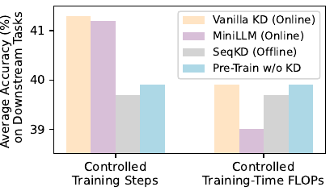

> The chart compares the performance of various knowledge distillation methods (Vanilla KD, MiniLLM, SeqKD) against a baseline (Pre-Train w/o KD) for pre-training a 200M student language model, showing that when training FLOPs are controlled, all KD methods perform similarly to or worse than the baseline.

 and model size (b) scaling curves of student LMs pre-trained from scratch with Vanilla KD¹ and MINIPLM. The teacher LM has 1.8B parameters. “1.8B→500M” means we use a 500M student LM. Training-time computation is kept constant for LMs of the same size in model scaling. The y-axis represents the LMs' zero-shot performance on 9 downstream NLP tasks.")

> The chart displays the scaling curves of student language models pre-trained using knowledge distillation, comparing MINIPLM's performance against a vanilla knowledge distillation method across varying computational budgets and model sizes.

 and model size (b) scaling curves of student LMs pre-trained from scratch with Vanilla KD¹ and MINIPLM. The teacher LM has 1.8B parameters. “1.8B→500M” means we use a 500M student LM. Training-time computation is kept constant for LMs of the same size in model scaling. The y-axis represents the LMs' zero-shot performance on 9 downstream NLP tasks.")

> The chart displays the computation and model size scaling curves for student language models pre-trained using knowledge distillation with Vanilla KD and the proposed MINIPLM method, showcasing MINIPLM's efficiency gains and performance improvements.

> The chart displays the average zero-shot accuracy on downstream tasks for Vanilla KD and MINIPLM models trained with varying teacher LM sizes, while keeping pre-training FLOPs constant.

 and model size (b) scaling curves of student LMs pre-trained from scratch with Vanilla KD¹ and MINIPLM. The teacher LM has 1.8B parameters. “1.8B→500M” means we use a 500M student LM. Training-time computation is kept constant for LMs of the same size in model scaling. The y-axis represents the LMs' zero-shot performance on 9 downstream NLP tasks.")

> The chart displays the computation and model size scaling curves for student language models pre-trained using knowledge distillation, comparing the performance of Vanilla KD and the proposed MINIPLM method.

> The chart displays the average zero-shot accuracy on downstream tasks for models trained with MINIPLM and Vanilla KD, showing the impact of different reference model sizes.

> The chart displays the impact of the difference sampling ratio on the average zero-shot accuracy of language models trained with MINIPLM and Vanilla KD on downstream tasks.

More on tables


 <table id='4' style='font-size:22px'><tr><td>Nstu</td><td>Method</td><td>L1T</td><td>L10T</td></tr><tr><td rowspan="3">200M</td><td>Pre-Train w/o KD</td><td>3.35</td><td>3.32</td></tr><tr><td>Vanilla KD</td><td>3.39</td><td>3.35</td></tr><tr><td>MINIPLM</td><td>3.28</td><td>3.26</td></tr><tr><td rowspan="3">500M</td><td>Pre-Train w/o KD</td><td>3.12</td><td>3.08</td></tr><tr><td>Vanilla KD</td><td>3.12</td><td>3.07</td></tr><tr><td>MINIPLM</td><td>3.06</td><td>3.04</td></tr><tr><td rowspan="3">1.2B</td><td>Pre-Train w/o KD</td><td>2.98</td><td>2.94</td></tr><tr><td>Vanilla KD</td><td>2.95</td><td>2.91</td></tr><tr><td>MINIPLM</td><td>2.92</td><td>2.88</td></tr></table>

> Table 1 presents the zero-shot accuracy scores achieved by student language models of varying sizes (200M, 500M, and 1.2B parameters) on nine downstream tasks, comparing performance across different knowledge distillation methods.


<table id='0' style='font-size:18px'><tr><td></td><td colspan="2">Llama3.1</td><td colspan="2">Mamba</td></tr><tr><td></td><td>Acc.</td><td>Loss</td><td>Acc.</td><td>Loss</td></tr><tr><td>Pre-Train w/o KD</td><td>41.0</td><td>3.52</td><td>41.6</td><td>3.24</td></tr><tr><td>SeqKD</td><td>40.8</td><td>3.54</td><td>41.0</td><td>3.27</td></tr><tr><td>MINIPLM</td><td>41.8</td><td>3.43</td><td>42.6</td><td>3.15</td></tr></table>

> Table 1 presents zero-shot accuracy scores on nine downstream tasks for language models (LMs) of varying sizes (200M, 500M, and 1.2B parameters) trained using different knowledge distillation (KD) methods, including MINIPLM and several baselines, with a 1.8B parameter LM as the teacher.


 <table id='2' style='font-size:20px'><tr><td>Pre-Training Corpus</td><td>Usage</td><td>Diversity</td></tr><tr><td>Original</td><td>Pre-Train w/o KD &Vanilla KD</td><td>32.25</td></tr><tr><td>Teacher-Generated</td><td>SeqKD</td><td>30.16</td></tr><tr><td>Difference-Sampled</td><td>MINIPLM</td><td>36.70</td></tr></table>

> Table 1 presents the zero-shot accuracy scores achieved by different language models (with varying sizes) on nine downstream tasks, comparing the performance of models trained with different knowledge distillation methods against a baseline model trained without knowledge distillation.


 <table id='7' style='font-size:16px'><tr><td>Nstu</td><td>Method</td><td>Acc.</td></tr><tr><td rowspan="3">200M</td><td>Vanilla KD</td><td>39.9</td></tr><tr><td>MINIPLM</td><td>41.3</td></tr><tr><td>MINIPLM + Vanilla KD</td><td>40.7</td></tr><tr><td rowspan="3">500M</td><td>Vanilla KD</td><td>43.6</td></tr><tr><td>MINIPLM</td><td>44.8</td></tr><tr><td>MINIPLM + Vanilla KD</td><td>44.9</td></tr><tr><td rowspan="3">1.2B</td><td>Vanilla KD</td><td>45.4</td></tr><tr><td>MINIPLM</td><td>46.6</td></tr><tr><td>MINIPLM + Vanilla KD</td><td>48.1</td></tr></table>

> Table 1 presents the zero-shot accuracy scores of student language models (200M, 500M, and 1.2B parameters) pre-trained with different methods on nine downstream tasks, using a 1.8B parameter model as the teacher.


<table id='0' style='font-size:18px'><tr><td>Model Size</td><td>dmodel</td><td>dFFN</td><td>nlayers</td><td>nhead</td><td>dhead</td><td>learning rate</td></tr><tr><td>104M</td><td>512</td><td>1,408</td><td>8</td><td>8</td><td>64</td><td>6 x 10-4</td></tr><tr><td>200M</td><td>768</td><td>2,112</td><td>12</td><td>12</td><td>64</td><td>6 x 10-4</td></tr><tr><td>300M</td><td>768</td><td>2,112</td><td>18</td><td>12</td><td>64</td><td>6 x 10-4</td></tr><tr><td>500M</td><td>1,024</td><td>2,816</td><td>24</td><td>16</td><td>64</td><td>3 x 10-4</td></tr><tr><td>1.2B</td><td>1,536</td><td>4,224</td><td>24</td><td>16</td><td>96</td><td>2.5 x 10-4</td></tr></table>

> Table 1 presents the zero-shot accuracy scores achieved by student language models of varying sizes (200M, 500M, 1.2B parameters) on nine downstream tasks, comparing different knowledge distillation methods and a baseline with no knowledge distillation.


<table id='0' style='font-size:14px'><tr><td></td><td colspan="3">Vanilla KD</td><td colspan="3">MiniLLM</td></tr><tr><td>Formula</td><td colspan="3">3Nstu T 3Nstu+Ntch</td><td colspan="3">3Nstu T 4Nstu+2Ntch</td></tr><tr><td>Student Model Size Nstu</td><td>200M</td><td>500M</td><td>1.2B I</td><td>200M</td><td>500M</td><td>1.2B</td></tr><tr><td>Training Steps</td><td>25K</td><td>45K</td><td>65K I</td><td>15K</td><td>30K</td><td>40K</td></tr></table>

> Table 1 presents zero-shot accuracy scores on nine downstream tasks for language models of various sizes trained using different methods.


<table id='0' style='font-size:14px'><tr><td>Nstu</td><td>Method</td><td>Ac</td><td>ac</td><td>Loo</td><td>CIT (FLOPs)</td><td>C10T (FLOPs)</td></tr><tr><td rowspan="3">200M</td><td>Pre-Train w/o KD</td><td>2.19x107</td><td>0.41</td><td>3.30</td><td rowspan="3">1.26x 1021</td><td rowspan="3">1.26x 1022</td></tr><tr><td>Vanilla KD</td><td>9.77x107</td><td>0.44</td><td>3.34</td></tr><tr><td>MINIPLM</td><td>8.56x1010</td><td>0.59</td><td>3.25</td></tr><tr><td rowspan="3">500M</td><td>Pre-Train w/o KD</td><td>2.73x108</td><td>0.45</td><td>3.06</td><td rowspan="3">3.14x 1021</td><td rowspan="3">3.14x 1021</td></tr><tr><td>Vanilla KD</td><td>3.14x108</td><td>0.45</td><td>3.05</td></tr><tr><td>MINIPLM</td><td>6.64x109</td><td>0.52</td><td>3.03</td></tr><tr><td rowspan="3">1.2B</td><td>Pre-Train w/o KD</td><td>1.88x 108</td><td>0.43</td><td>2.91</td><td rowspan="3">7.30x 1021</td><td rowspan="3">7.30x 1021</td></tr><tr><td>Vanilla KD</td><td>1.10x1010</td><td>0.52</td><td>2.90</td></tr><tr><td>MINIPLM</td><td>4.29x108</td><td>0.45</td><td>2.86</td></tr></table>

> Table 1 presents the zero-shot accuracy scores of student language models of varying sizes (200M, 500M, and 1.2B parameters) pre-trained using different methods (Pre-Train w/o KD, Vanilla KD, MiniLLM, SeqKD, and MINIPLM) across nine downstream NLP tasks.


 <table id='9' style='font-size:14px'><tr><td>Method</td><td>FLOPs</td><td>Acc.</td></tr><tr><td>Vanilla KD</td><td>Online</td><td>39.9</td></tr><tr><td>MINIPLM</td><td>2 x 1020</td><td>41.3</td></tr><tr><td>MINIPLMprx</td><td>9 x 1018</td><td>40.9</td></tr></table>

> Table 1 presents the zero-shot accuracy scores of student language models with various sizes pre-trained using different knowledge distillation methods on nine downstream tasks, comparing their performance with a baseline of pre-training without knowledge distillation.


<table id='0' style='font-size:14px'><tr><td>Pref(x): Hard</td><td>p(x) 》 and valuable instances</td></tr><tr><td rowspan="2">Instance #1</td><td>p(x) - logp(x) = 1.26 - log Pref(x) = 4.20 log = 2.94 Selected Pref(�)</td></tr><tr><td>Legal along with Environmental Responsibility! Dumpster rentals in the user side may seem as fundamental as placing a phone, having a dumpster sent and hurling all your disposals inside to be carted away . Nonetheless, there are legal issues attached to appropriate disposal connected with certain products which tie up into environmental issues. The 10 Yard Dumpster For Rent in Pocahontas customer or perhaps demolition purchaser should be informed about these issues by means of careful screening SO as to reduce a firm's liability which inturn keeps a firm's overhead all the way down and makes for prompt fall off , pick up along with disposal of the dumpster and it's articles .</td></tr><tr><td rowspan="2">Instance #2</td><td>p(x) logp(x) = 2.36 - log Pref(x) = 5.59 log = 3.23 Selected Pref ( )</td></tr><tr><td>有利 you3li4 youli advantageous ; beneficial 谨慎 jin3shen4 jinshen cautious ; prudent 甲 jia3 jia one ; armor (1st Heavenly Stem) 犹豫 you2yu4 youyu hesitate; hesitant ; undecided 从此 cong2ci3 congci from now on ; since then 企业 qi3ye4 qiye company ; business; firm 下载 xia4zai3 xi�z�i to download 狮子 shi1zi5 shizi lion 青少年 qing1shao4nian2 qingshaonian teenager</td></tr><tr><td rowspan="2">Instance #3</td><td>p(x) - logp(x) = 0.16 - log Pref(x) = 2.73 log = 2.56 Selected Pref(x)</td></tr><tr><td>function WritableState (options, stream) { var Duplex = require(' / _stream_duplex') ; options = options I - 0 ; // the point at which write() starts returning false // Note : 0 is a valid value, means that we always return false if / / the entire buffer is not flushed immediately on write() var hwm = options · highWaterMark; var defaultHwm = options · objectMode?16: 16*1024; this .highWaterMark = (hwm II hwm === 0) ? hwm : defaultHwm; // object stream flag to indicate whether or not this stream // contains buffers or objects. this . objectMode = ! !options . objectMode; · · · }</td></tr></table>

> Table 1 presents the zero-shot accuracy scores achieved by student language models of varying sizes (200M, 500M, and 1.2B parameters) on nine downstream tasks, comparing different knowledge distillation (KD) methods against a baseline model trained without KD.

### Full paper


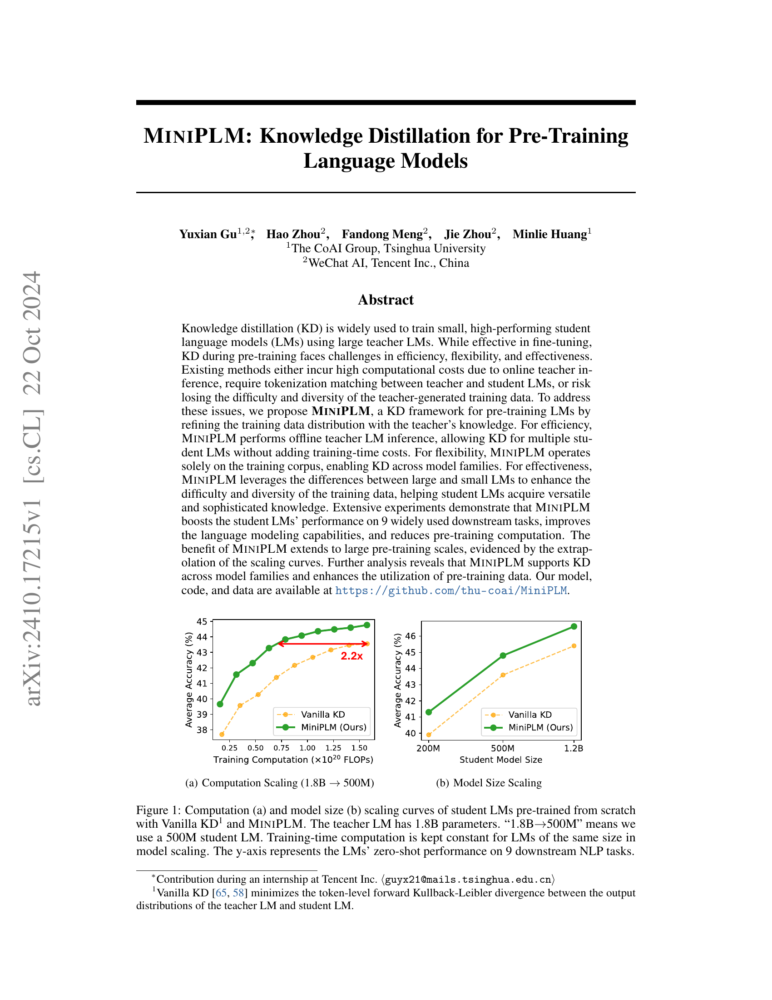
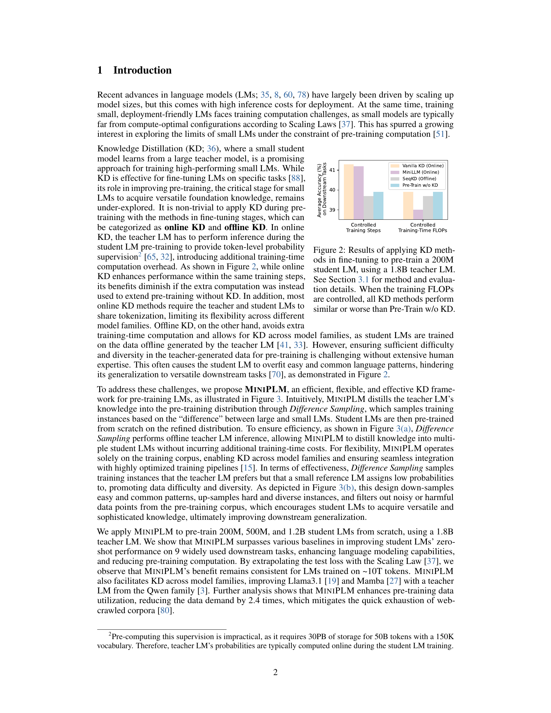

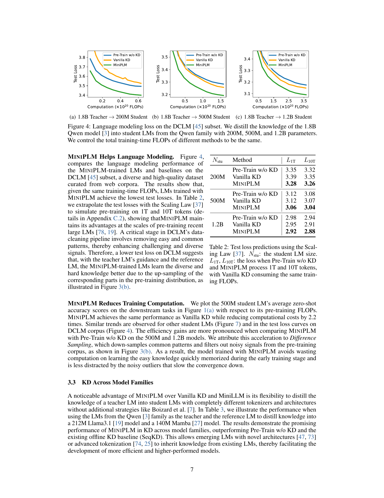

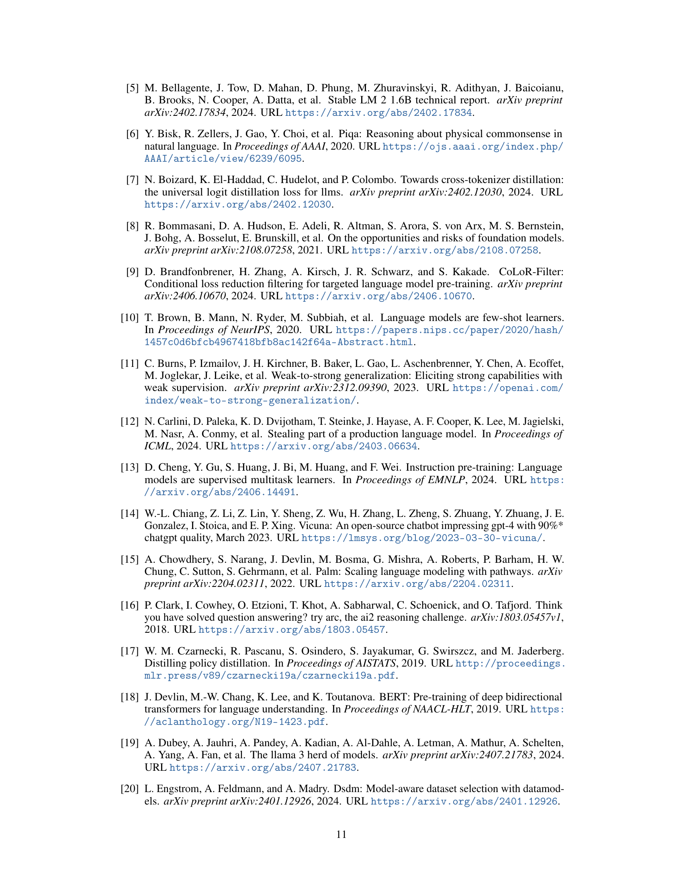
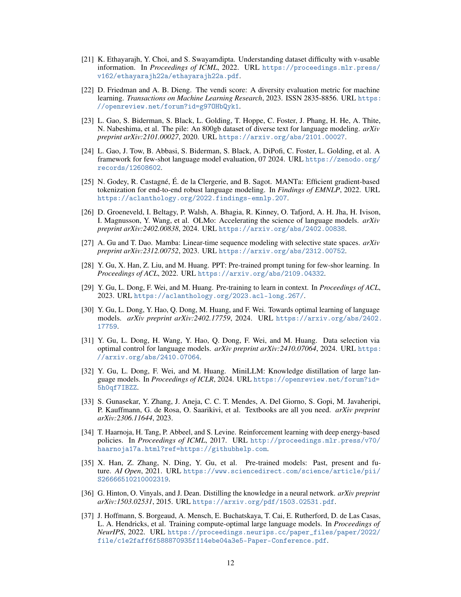
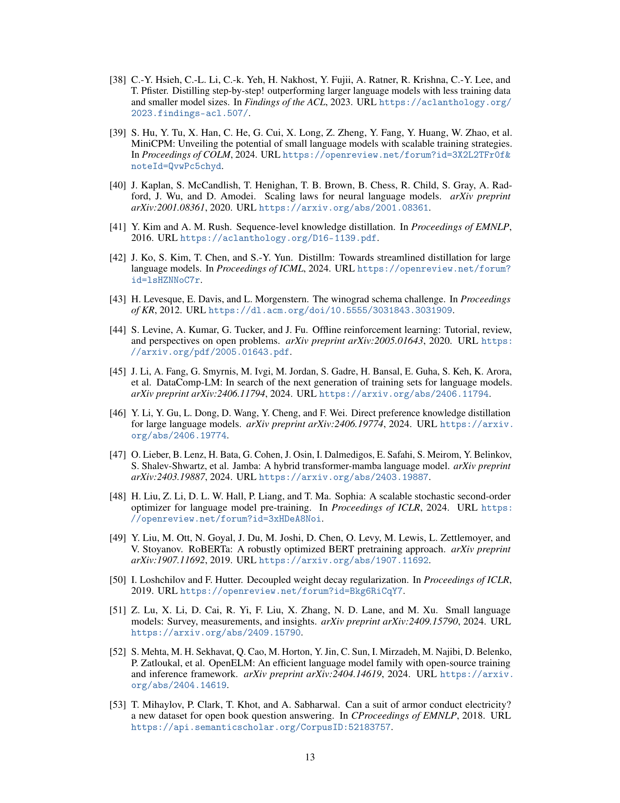
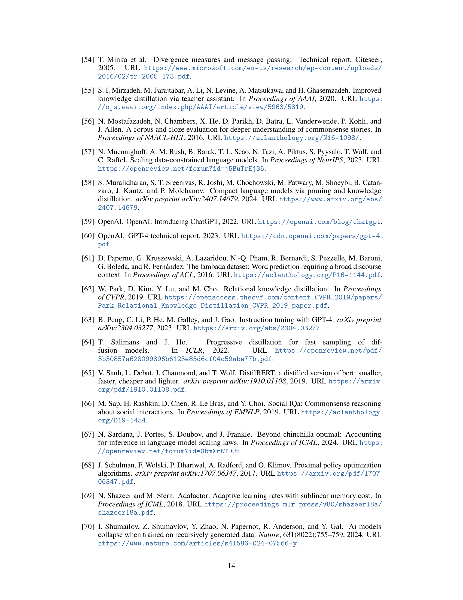

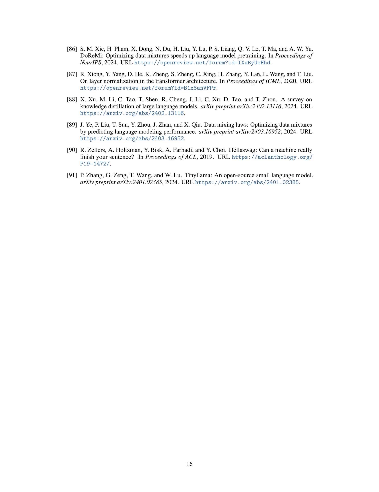

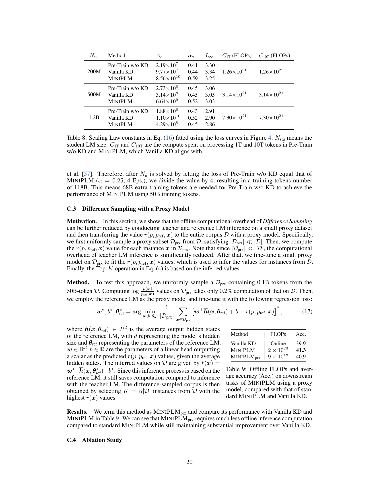
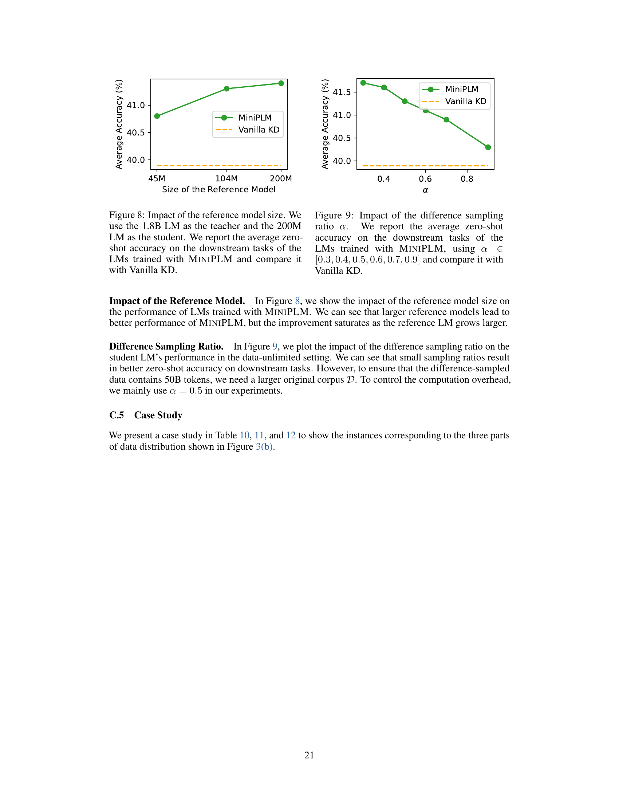

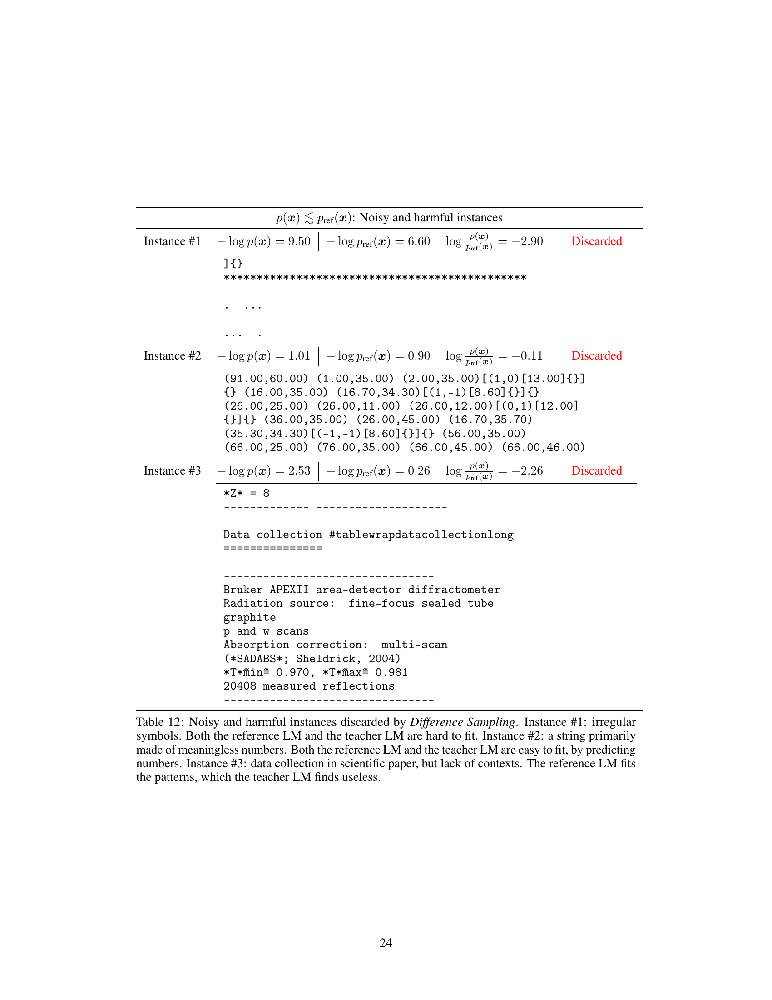
