### TL;DR



The research paper focuses on improving colonoscopy, a crucial method for colorectal cancer screening, through the application of artificial intelligence.  The authors identify key challenges in current approaches, highlighting the need for multimodal research (combining image and text data). To address this need, they created three main contributions: 1) ColonINST, a large-scale, high-quality dataset of colonoscopy images with detailed annotations and conversational data for instruction tuning; 2) ColonGPT, a new multimodal language model specifically designed for colonoscopy, trained using ColonINST to better understand and respond to user requests; and 3) a benchmark for evaluating multimodal colonoscopy models. Their results show the improved performance of ColonGPT over existing methods, showcasing the potential of multimodal AI to significantly enhance colonoscopy and colorectal cancer detection.  The study also provides a public website for ongoing updates, making these resources available to the wider research community.




 &nbsp; read the paper on arXiv


#### Why does it matter?
This research paper investigates the frontiers of intelligent colonoscopy, identifying challenges and contributing a large-scale multimodal instruction tuning dataset, a colonoscopy-designed multimodal language model, and a multimodal benchmark to facilitate further exploration in this rapidly developing field.
#### Key Takeaways


 A novel large-scale multimodal instruction tuning dataset, ColonINST, was created for training multimodal models in colonoscopy. 



 A new multimodal language model, ColonGPT, was developed to assist endoscopists with interactive tasks during colonoscopies. 



 A multimodal benchmark was established to facilitate ongoing monitoring of the rapidly evolving field of intelligent colonoscopy. 


------
#### Visual Insights

 the anatomy of the large intestine (colon) within the digestive tract, the polypectomy procedure during colonoscopy examination, and the components of a colonoscope. The bottom figure (b) summarises three highlights of this study.")

> The figure illustrates the anatomy of the large intestine, the polypectomy procedure, colonoscope components, and summarizes the study's three highlights: literature investigation, instruction tuning dataset, and multimodal language model.

{{< table-caption caption="🔽 TABLE 2 Summary of classification models in colonoscopy. Dataset: CU=CU-ColonDB [25], CDS=ColonoscopicDS [26], Private=private data, HK=HyperKvasir [43], KC=Kvasir-Capsule [56]. Backbone: CaffeNet [97], D-121=DenseNet121 [98], R-12/-18/-50/-101=ResNet12/18/50/101 [99], VIT-S16 or ViT-B16 [100], MobV2=MobileNetV2 [101], R50-Att=ResNet50 with attention module [102], C3D [103], Inc-v3=Inceptionv3 [104], I3D [105]. 'Customised' means a base network modified for the current task or a model independent of the base network choice. Head: classifier implemented by the fully connected (FC) and support vector machine (SVM) layers, or using the l² norm to measure the disparity between the input and output. Arch: the architectures shown in Fig. 3. Sup: learning strategies such as fully supervised (FS), semi-supervised (SS), unsupervised (US), and weakly supervised (WS). For simplicity, the following tables use consistent abbreviations unless specified otherwise." >}}
<table id='3' style='font-size:14px'><tr><td></td><td>Model</td><td>Publication</td><td>Core design</td><td>Training dataset</td><td>Testing dataset</td><td>Backbone Arch</td><td>Head Sup</td><td></td><td>URL</td></tr><tr><td>models Image-based</td><td>Zhang et al. [25] RIIS-DenseNet [106 FSAD-Net 107 Gammulle et al. 108] ADGAN [37] Carneiro et al. [109] CPC-Trans [111] SSL-WCE [110] PolypsAlign [47] FFCNet 112 DLGNet 113 Yue et al. 114 DAFON 115 SSL-CPCD[73]</td><td>JBHI'16 MICCAI'18 MICCAI'20 MICCAI'20 ISBI'20 MedIA'20 MICCAI'22 MedIA'20 MICCAI'21 MICCAI'22 MedIA'23 TIM'23 ESWA'24 TMI'24</td><td>domain transfer learning rotation-invariant, similarity constrained mutual information maximisation relational mapping dual adversarial learning model uncertainty & calibration cross-modal representation consistency adaptive aggregated attention teacher-student alignment frequency domain learning Gaussian mixture model class imbalance loss few-shot open-set learning composite pretext-class discrimination</td><td>CU, CDS Private Private Kvasir [28], Nerthus [29] Liu et al. [37] Private CPC-Paired [47] CAD-CAP [41] CPC-Paired [47] Private Private Private, HK Kvasir-Capsule [56] LIMUC [68]</td><td>CU, CDS Private Private Kvasir [28], Nerthus [29] Liu et al. [3 ] Private CPC-Paired [] CAD-CAP [41] CPC-Paired [] Private Private Private, HK Kvasir-Capsule [56] Private, LIMUC [68]</td><td>CaffeNet BF#1 D-121 SF D-121 BF#2 R-50 MF#1 Customised BF#2 D-121 SF ViT-S16 BF#2 D-121 BF#2 R-50 BF#2 R-18 SF R-18 BF#2 MobV2 SF R-12 BF#2 R50-Att BF#2</td><td></td><td>SVM FS FC FS FC US FC FS l2 US FC FS CCCCCC BERBER °C S °C FS</td><td>- - Link - - - Link Link Link Link Link Link - Link</td></tr><tr><td>Video</td><td>BseNet[116] Tamhane et al. 119 Byrne et al. [118] Tian et al. [59]</td><td>MICCAI'18 MICCAIw'22 Gut'19 MICCAI'22</td><td>unsupervised depth estimation, LSTM[117] vision transformer based real-time assessment system multiple instance learning</td><td>Private Private Private WVAD [59]</td><td>Private Private Private WVAD [59]</td><td>C3D ViT-B16 Inc-v3 I3D</td><td>SF SF SF SF</td><td>FC FS °C FS FS FC WS</td><td>- - - Link</td></tr></table>

> Table 2 summarizes 18 image-based and 5 video-based classification models for colonoscopy, detailing their core designs, datasets, backbones, architectures, heads, and learning strategies.

### More visual insights

More on figures

 classification, (b) detection, and (c) segmentation, are applied to identify targets of interest such as polyps and instruments. (d) Multimodal applications improve colonoscopy procedures by performing interactive, user-driven tasks aligned with clinical needs. The chatbot provides personalised advice, automated reporting, and streamline procedural workflows.")

> The figure illustrates four colonoscopic scene perception tasks (classification, detection, segmentation, and multimodal applications) and how they can be used to improve colonoscopy procedures.

 features a single input and output with sequential data flow. Multi-stream frameworks predict a single output but involve parallel processing streams, either at the decoding stage (MF#1) or the encoding stage (MF#2). Branched frameworks extend multi-stream framework to produce multiple outputs from either a single input (BF#1) or multiple inputs (BF#2). These side outputs typically receive supervision from additional supervisory signals, such as boundary cues.")

> The figure illustrates five deep-learning architectures used for colonoscopic image analysis, categorized by data flow and processing streams.

 Three sequential steps to create the instruction tuning dataset for multimodal research. (b) Numbers of colonoscopy images designated for training, validation, and testing purposes. (c) Data taxonomy of three-level categories. (d) A word cloud of the category distribution by name size. (e) Caption generation pipeline using the VL prompting mode of GPT-4V [4]. (f) Numbers of human-machine dialogues created for four downstream tasks.")

> Figure 4 shows the creation process of ColonINST dataset, including data statistics, taxonomy, caption generation pipeline and human-machine dialogues.

> The figure compares the zero-shot language responses of three AI chatbots and ColonGPT for colonoscopy image classification, highlighting ColonGPT's superior accuracy.

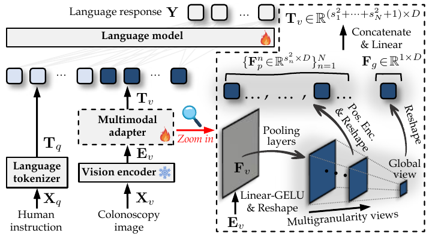

> The figure illustrates the architecture of ColonGPT, a multimodal language model designed for interactive colonoscopy tasks, highlighting its visual encoder, multimodal adapter, and language model components.

, localisation (REC), and captioning (CAP) based.")

> Figure 7 shows examples of ColonGPT performing different colonoscopy tasks through conversational interactions.

, localisation (REC), and captioning (CAP) based.")

> Figure 7 showcases ColonGPT's ability to perform various colonoscopy tasks (classification, referring expression generation/comprehension, and captioning) through conversational interactions.

More on tables


<table id='3' style='font-size:14px'><tr><td>Task</td><td>Instruction templates</td><td>Data source</td><td>Human-machine dialogue sample</td></tr><tr><td>CLS</td><td>1. Categorize the object. 2. Determine the object's category. 3. Identify the category of the object. 4. Classify the object's category. 5. Assign the object to its corresponding category.</td><td>19 sources → SUN-database [54], PolypGen [69], CVC-ClinicDB [21], ETIS [20], KUMC [57], Kvasir [28], PSNBI2K [16], CVC-ColonDB [19], EDD2020 [40], Kvasir-Capsule [56], CP-CHILD [51], BKAI-Small [46], PICCOLO [39], WCE-CCDD [60], CPC-Paired [47], HyperKvasir [43], Nerthus [29], GastroVision [66], Kvasi-Instrument [50]</td><td>Human: "Assign the object to its corresponding category Answer: "polyp"</td></tr><tr><td>REG</td><td>1. What category does {object coordinates } belong to? 2. Can you tell me the category of {object coordinates}? 3. Could you provide the category for {object coordinates }? 4. Please specify the category of {object coordinates}. 5. What is the category for {coordinates}?</td><td>11 sources → SUN-database [54], PolypGen [69], CVC-ClinicDB [21], ETIS [20], KUMC [57], Kvasir [28], PSNBI2K [16], CVC-ColonDB [19], EDD2020 [40], Kvasir-Capsule [56], Kvasi-Instrument [50]</td><td>Human: "Could you provide the category for {<147><317><665><770>)?" Answer: "high grade adenoma</td></tr><tr><td>REC</td><td>1. Where is the location of {object category}? 2. Could you give the position of {object category}? 3. Where is {category} located? 4. Could you specify the location of {object category}? 5. Please specify the coordinates of {object category}.</td><td>11 sources → SUN-database [54], PolypGen [69], CVC-ClinicDB [21], ETIS [20], KUMC [57], Kvasir [28], PSNBI2K [16], CVC-ColonDB [19], EDD2020 [40], Kvasir-Capsule [56], Kvasi-Instrument [50]</td><td>Human: "Where is adenomatous located?" Answer: "{<128><406><216><496>)"</td></tr><tr><td>CAP</td><td>1. Describe what you see in the image. 2. Interpret what the image shows. 3. Detail the visual elements in the image. 4. Explain the image's visuals thoroughly. 5. Offer a thorough explanation of the image.</td><td>19 sources → SUN-database [54], PolypGen [69], CVC-ClinicDB [21], ETIS [20], KUMC [57], Kvasir [28], PSNBI2K [16], CVC-ColonDB [19], EDD2020 [40], Kvasir-Capsule [56], CP-CHILD [51], BKAI-Small [46], PICCOLO [39], WCE-CCDD [60], CPC-Paired [47], HyperKvasir [43], Nerthus [29], GastroVision [66], Kvasi-Instrument [50]</td><td>Human: "Detail the visual elements in the image. Answer: "The image displays a medical endoscopic view</td></tr></table>

> Table 6 presents details of the ColonINST dataset, including instruction templates, data sources, and sample human-machine dialogues for four tasks: classification, region proposal, region comprehension, and captioning.


 <table id='3' style='font-size:16px'><tr><td rowspan="2">Model</td><td rowspan="2">Visual encoder (input shape/URL)</td><td rowspan="2">Language model (model size/URL)</td><td rowspan="2">No.</td><td colspan="2"></td><td rowspan="2" colspan="2">CLS task (A ↑) seen unseen</td><td colspan="2">REG task (A ↑)</td><td colspan="2">REC task (IoU ↑)</td></tr><tr><td>LoRA EXT</td><td></td><td>seen</td><td>unseen</td><td>seen</td><td>unseen</td></tr><tr><td rowspan="2">MiniGPT-v2 []</td><td rowspan="2">EVA-G/14 (448px/link)</td><td rowspan="2">LLaMA2 (7B/link)</td><td>#A1</td><td></td><td></td><td>91.49%</td><td>77.93%</td><td>94.69%</td><td>72.05%</td><td>23.45%</td><td>15.36%</td></tr><tr><td>#A2</td><td>V</td><td></td><td>90.00%</td><td>76.82%</td><td>87.65%</td><td>70.23%</td><td>27.97%</td><td>31.13%</td></tr><tr><td rowspan="2">LLaVA-v1 [277]</td><td rowspan="2">CLIP-L/14 (224px/link)</td><td rowspan="2">Vicuna-v1.3 (7B/link)</td><td>#B1</td><td></td><td></td><td>87.86%</td><td>72.08%</td><td>84.55%</td><td>68.11%</td><td>20.05%</td><td>12.72%</td></tr><tr><td>#B2</td><td>V</td><td></td><td>89.61%</td><td>42.17%</td><td>86.87%</td><td>46.85%</td><td>21.81%</td><td>3.24%</td></tr><tr><td rowspan="2">LLaVA-v1.5 []</td><td rowspan="2">CLIP-L/14 (336px/link)</td><td rowspan="2">Vicuna-v1.5 (7B/link)</td><td>#C1</td><td></td><td></td><td>92.97%</td><td>79.10%</td><td>98.58%</td><td>70.38%</td><td>55.72%</td><td>34.32%</td></tr><tr><td>#C2</td><td>V</td><td></td><td>93.33%</td><td>80.89%</td><td>99.32%</td><td>72.88%</td><td>61.97%</td><td>42.31%</td></tr><tr><td>Bunny-v1.0-3B []</td><td>SigLIP-SO (384px/link)</td><td>Phi2 (2.7B/link)</td><td>#D1</td><td></td><td>V</td><td>91.16%</td><td>75.50%</td><td>96.61%</td><td>69.45%</td><td>46.24%</td><td>31.24%</td></tr><tr><td rowspan="2">MGM-2B [283]</td><td rowspan="2">CLIP-L/14 (336px/ link) & ConvNeXt-L (768px/link)</td><td rowspan="2">Gemma (2B/link)</td><td>#D2</td><td></td><td></td><td>92.47%</td><td>79.50%</td><td>96.02%</td><td>75.08%</td><td>54.00%</td><td>41.48%</td></tr><tr><td>#E1 #E2</td><td></td><td>V</td><td>92.97% 93.24%</td><td>78.99% 78.69%</td><td>98.17% 98.75%</td><td>69.81% 74.30%</td><td>39.78% 57.25%</td><td>16.00% 25.23%</td></tr><tr><td rowspan="2">MobileVLM-1.7B [284]</td><td rowspan="2">CLIP-L/14 (336px/link)</td><td rowspan="2">MobileLLaMA (1.4B/link)</td><td></td><td></td><td></td><td></td><td></td><td></td><td></td><td></td><td></td></tr><tr><td>#F1 #F2</td><td></td><td>V V</td><td>93.02% 93.64%</td><td>78.75% 80.44%</td><td>97.78% 97.87%</td><td>73.14% 78.03%</td><td>47.30% 51.36%</td><td>31.46% 34.80%</td></tr><tr><td rowspan="2">LLaVA-Med-v1.0 [280]</td><td rowspan="2">CLIP-L/14 (224px/link)</td><td rowspan="2">LLaMA1 (7B/link)</td><td>#G1</td><td></td><td></td><td>93.52%</td><td>78.04%</td><td>97.74%</td><td></td><td></td><td></td></tr><tr><td>#G2</td><td></td><td>V</td><td>93.84%</td><td>77.38%</td><td>97.35%</td><td>75.07% 75.25%</td><td>41.60% 39.43%</td><td>24.89% 20.85%</td></tr><tr><td rowspan="2">LLaVA-Med-v1.5 [280]</td><td rowspan="2">CLIP-L/14 (224px/link)</td><td rowspan="2">Mistral-v0.2 (7B/link)</td><td>#H1</td><td></td><td>V</td><td>93.62%</td><td></td><td></td><td></td><td></td><td></td></tr><tr><td>#H2</td><td>V</td><td></td><td>87.22%</td><td>79.24% 66.51%</td><td>99.30% 90.40%</td><td>73.05%</td><td>64.69%</td><td>41.97%</td></tr><tr><td>ColonGPT (Ours)</td><td>SigLIP-SO (384px/ link)</td><td>Phi1.5 (1.3B/ link)</td><td>-</td><td></td><td></td><td>94.02%</td><td>85.81%</td><td>99.02%</td><td>70.00% 83.42%</td><td>13.39% 65.89%</td><td>12.95% 45.77%</td></tr></table>

> This table presents a multimodal benchmark comparing eight popular MLMs on three conversational tasks (classification, referring expression generation, and referring expression comprehension) using the ColonINST dataset, showing performance on both seen and unseen samples with and without LoRA fine-tuning.


 <table id='3' style='font-size:14px'><tr><td colspan="4">(a) Different presentations from visual encoder</td><td colspan="5">(b) Multigranuarity multimodal adapter</td><td colspan="5">(c) Fine-tuning strategy</td></tr><tr><td>Visual encoder input/URL REC ConvNeXtV2-L 384px/ link</td><td>CLS REG 82.95%</td><td>78.63%</td><td>33.74%</td><td>token MLP baseline</td><td>(ratio) 729 (100.00%)</td><td>CLS REG 83.53%</td><td>81.80%</td><td>REC 43.70%</td><td>Strategy full-tuning</td><td>r -</td><td>a CLS| 78.06%</td><td>REG 73.79%</td><td>REC 50.20%</td></tr><tr><td></td><td>82.16%</td><td></td><td>40.78%</td><td>{16,8,1}</td><td></td><td>84.39%</td><td>80.90%</td><td>46.37%</td><td>LoRA</td><td>4</td><td>- 8</td><td>82.75%</td><td>45.02%</td></tr><tr><td>ViT-L 384px/link</td><td></td><td>77.04%</td><td></td><td></td><td>321 (44.03%)</td><td></td><td></td><td></td><td></td><td></td><td>85.43% 16</td><td></td><td></td></tr><tr><td>MAE-L* 384px/link</td><td>80.85%</td><td>75.87%</td><td>38.53%</td><td>{14,7,1}</td><td>246 (33.74%)</td><td>85.81% 83.42%</td><td></td><td>45.77%</td><td>LoRA</td><td>8</td><td>84.45%</td><td>80.78%</td><td>44.98%</td></tr><tr><td>MAE-L 224px/link</td><td>81.95%</td><td>77.62%</td><td>43.25%</td><td>{14,7}</td><td>245 (33.61%)</td><td>85.01%</td><td>82.49%</td><td>43.62%</td><td>LoRA</td><td>16</td><td>32 84.39%</td><td>80.81%</td><td>45.90%</td></tr><tr><td>DINOv2-L* 384px/link</td><td>35.03%</td><td>22.91%</td><td>6.79%</td><td>{12, 6,1}</td><td>181 (24.83%)</td><td>83.74%</td><td>81.60%</td><td>45.94%</td><td>LoRA</td><td>32</td><td>64 84.91%</td><td>82.73%</td><td>45.56%</td></tr><tr><td>DINOv2-L 224px/link</td><td>21.22%</td><td>7.96%</td><td>2.69%</td><td>{10,5,1}</td><td>126 (17.28%)</td><td>84.28%</td><td>82.01%</td><td>46.46%</td><td>LoRA</td><td>64</td><td>128 83.84%</td><td>81.19%</td><td>43.57%</td></tr><tr><td>CLIP-L 336px/link</td><td>83.99%</td><td>78.67%</td><td>41.54%</td><td>{8, 4,1}</td><td>81 (11.11%)</td><td>84.70%</td><td>81.36%</td><td>45.30%</td><td>LoRA</td><td>128</td><td>256 85.81%</td><td>83.42%</td><td>45.77%</td></tr><tr><td>SigLIP-SO 384px/link</td><td>85.81%</td><td>83.42%</td><td>45.77%</td><td>w/o Pos. Enc.</td><td>246 (33.74%)</td><td>84.50%</td><td>82.91%</td><td>40.09%</td><td>LoRA</td><td>256 512</td><td>82.93%</td><td>79.96%</td><td>48.27%</td></tr></table>

> Table 8 presents diagnostic studies of three core components in ColonGPT, showing the impact of different visual encoders, multimodal adapters, and fine-tuning strategies on the model's performance across three conversational tasks.

### Full paper



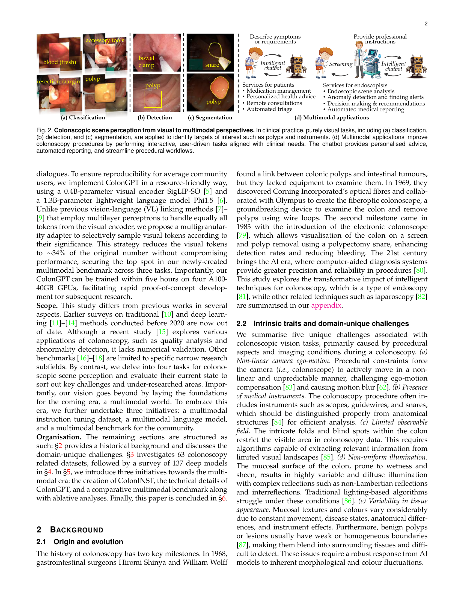
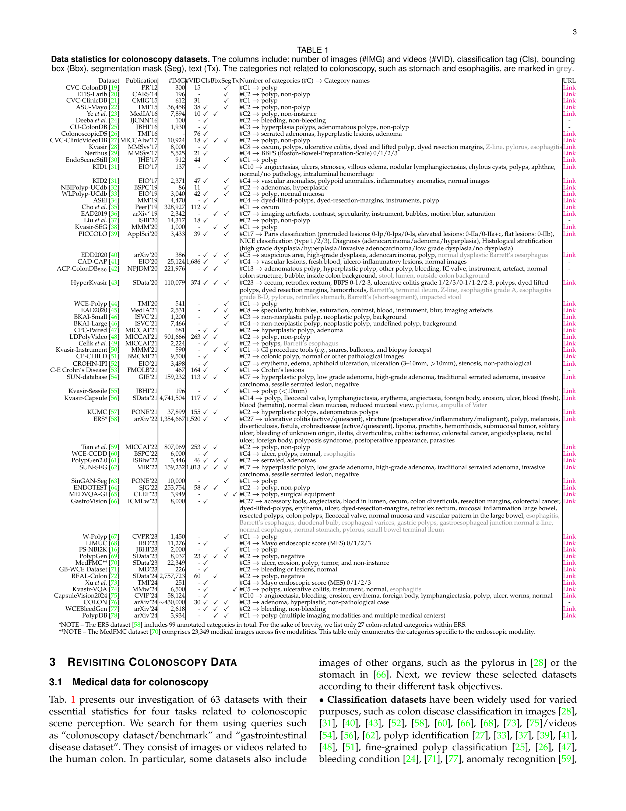
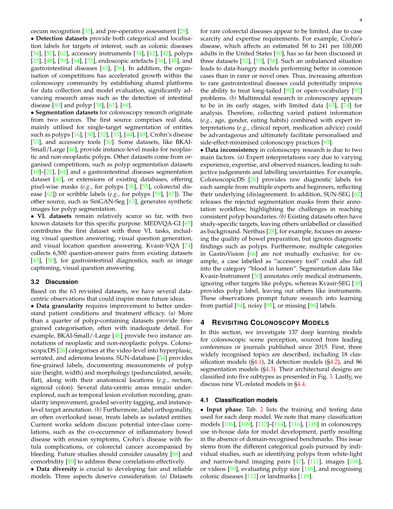

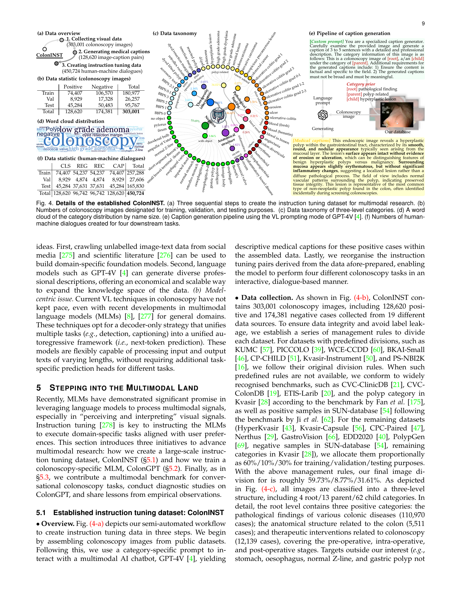
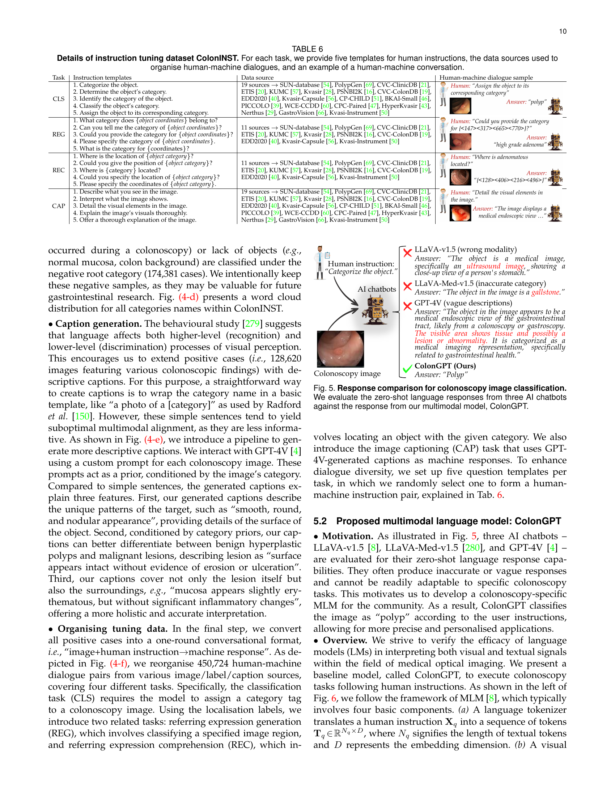

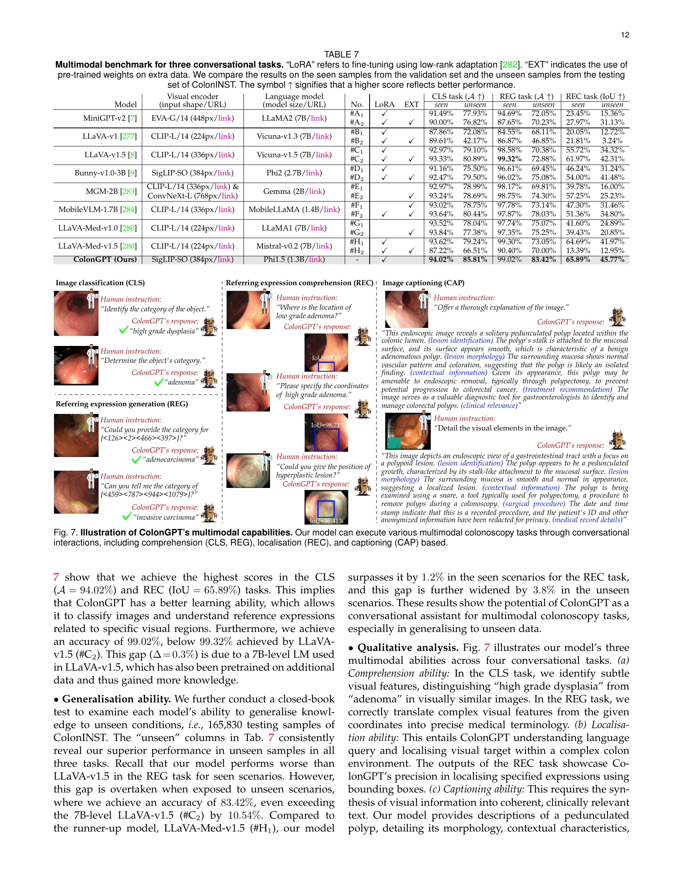

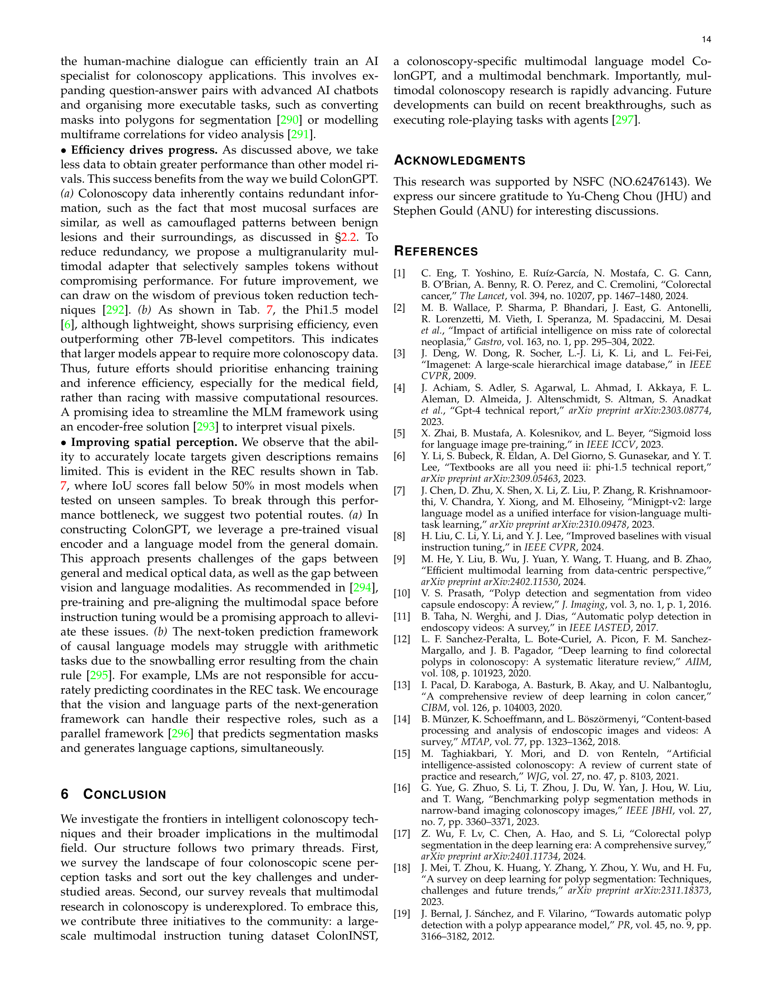
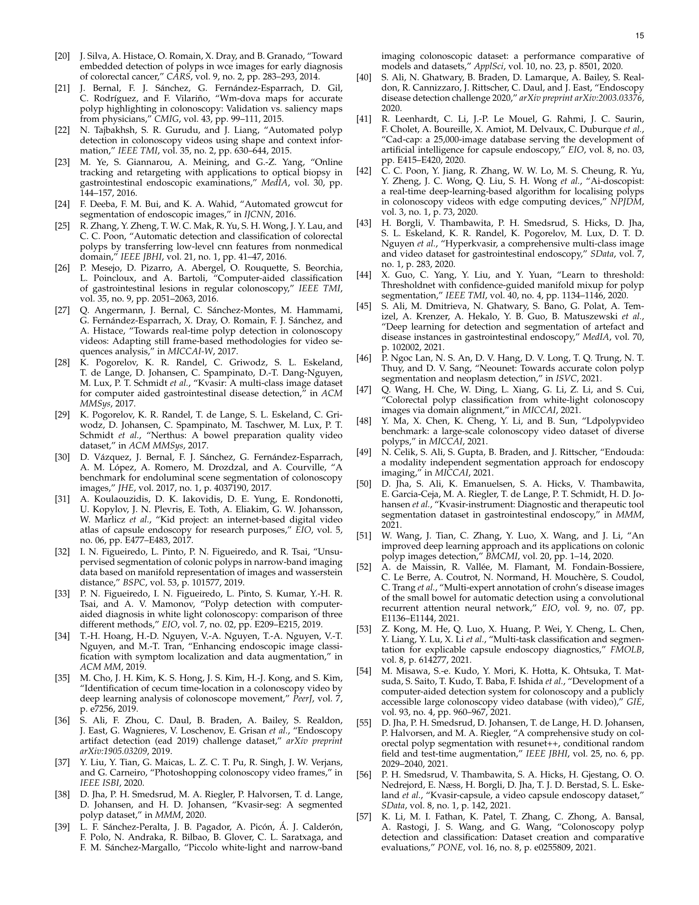

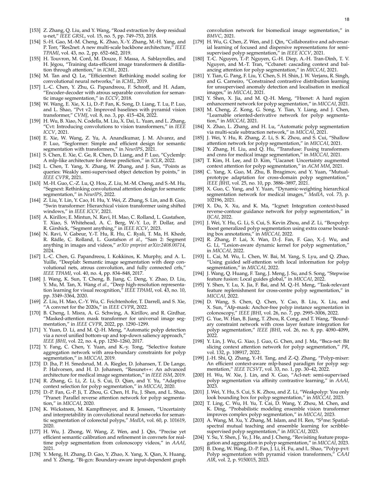
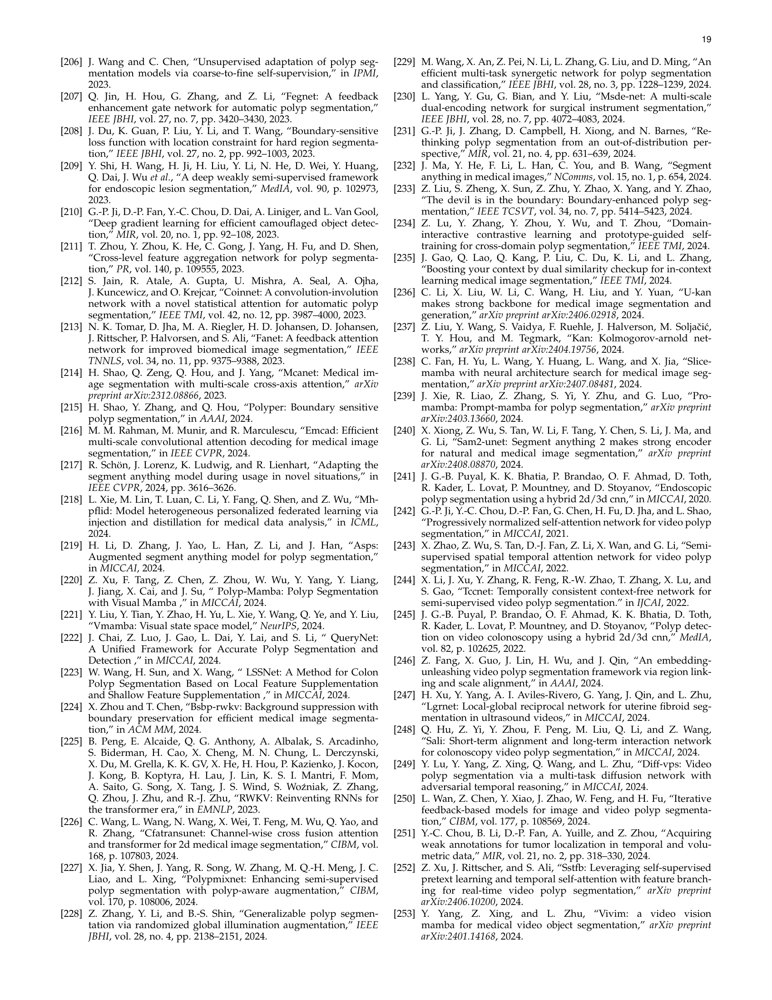
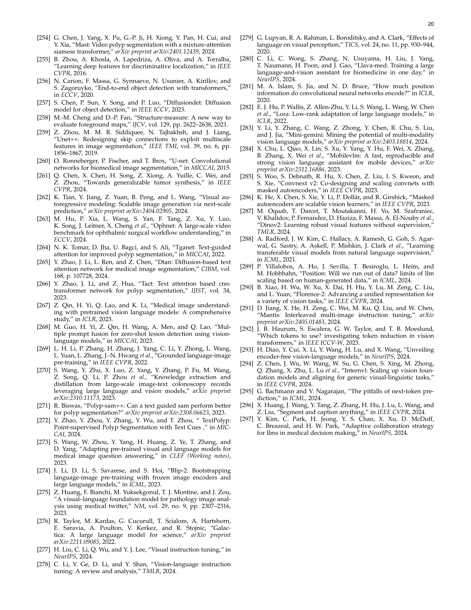
