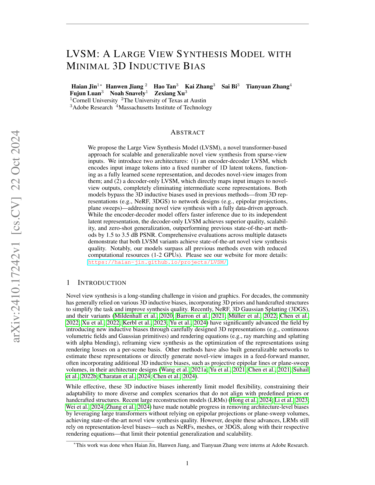
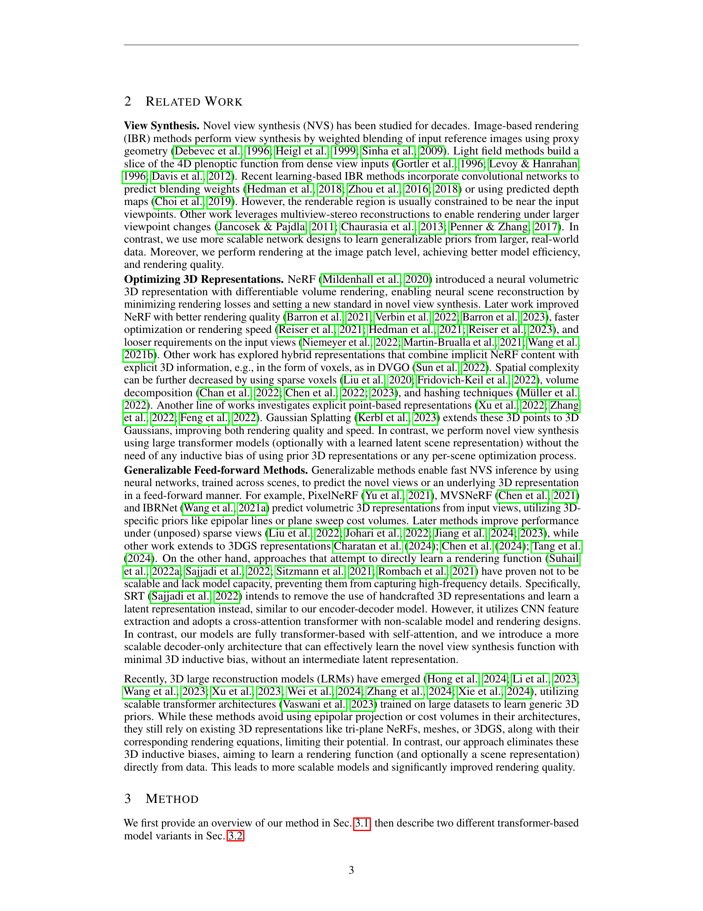
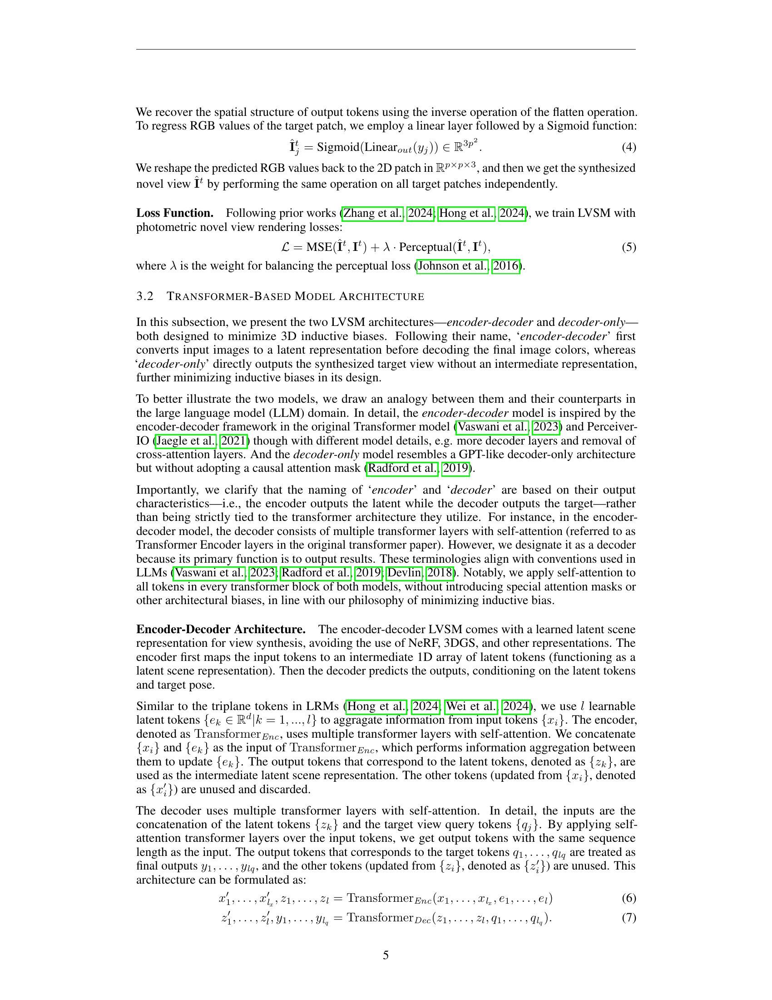
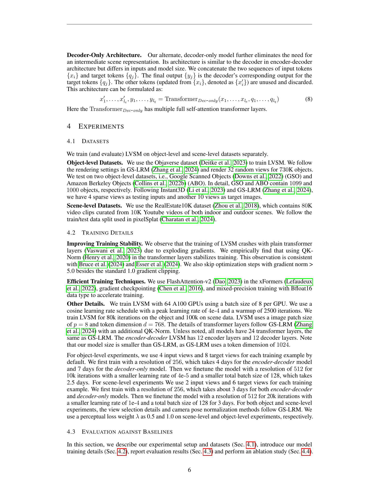
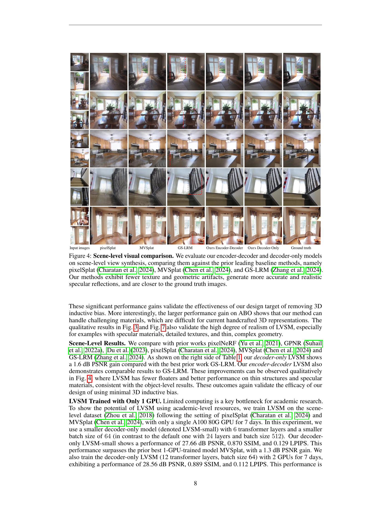
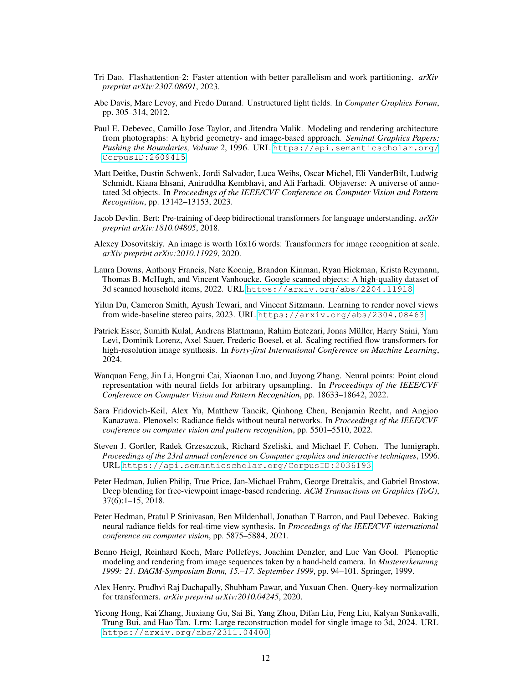
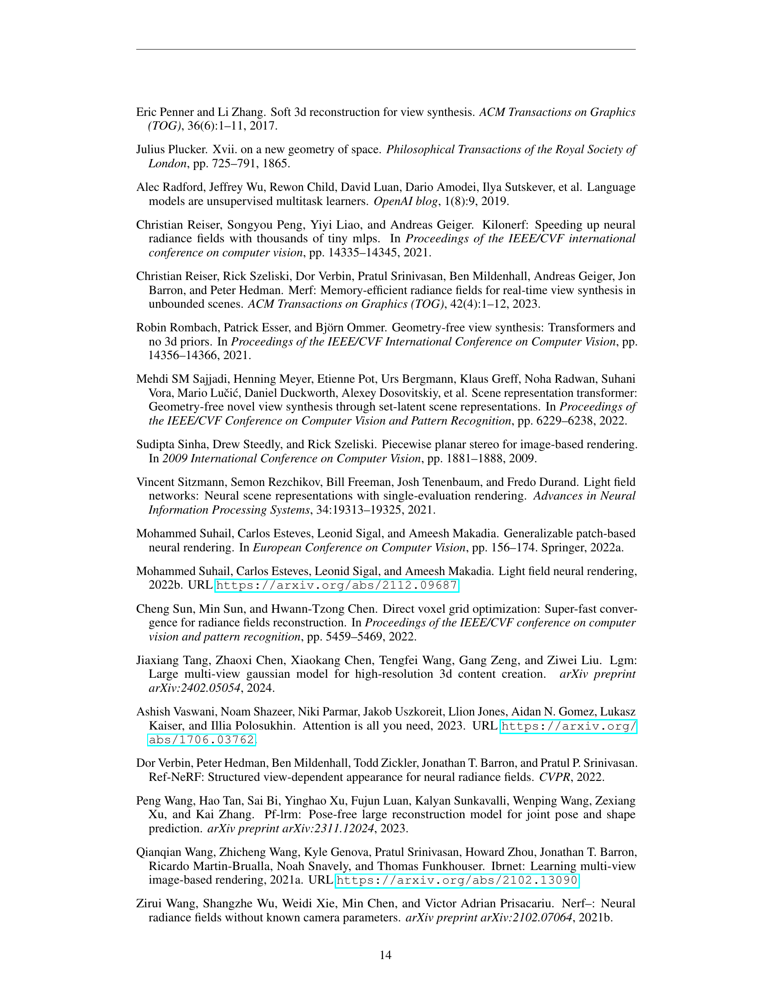
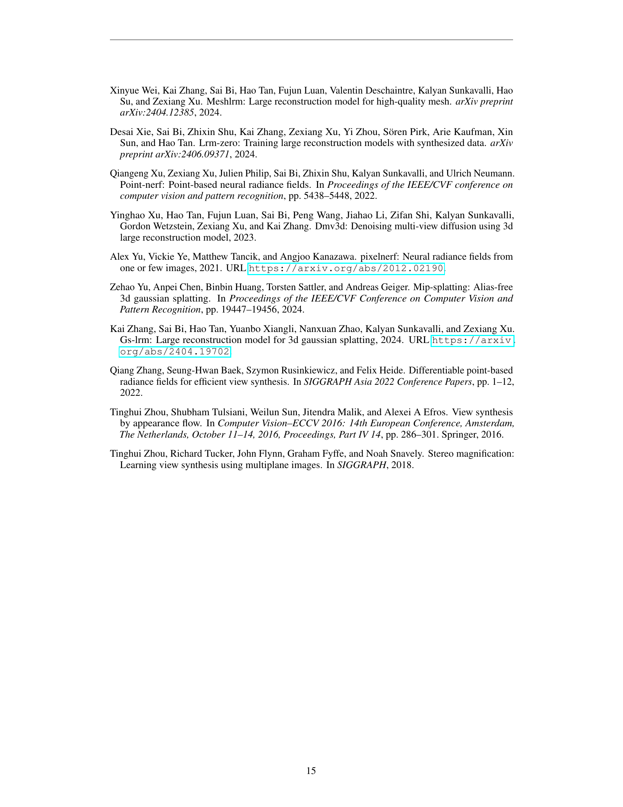
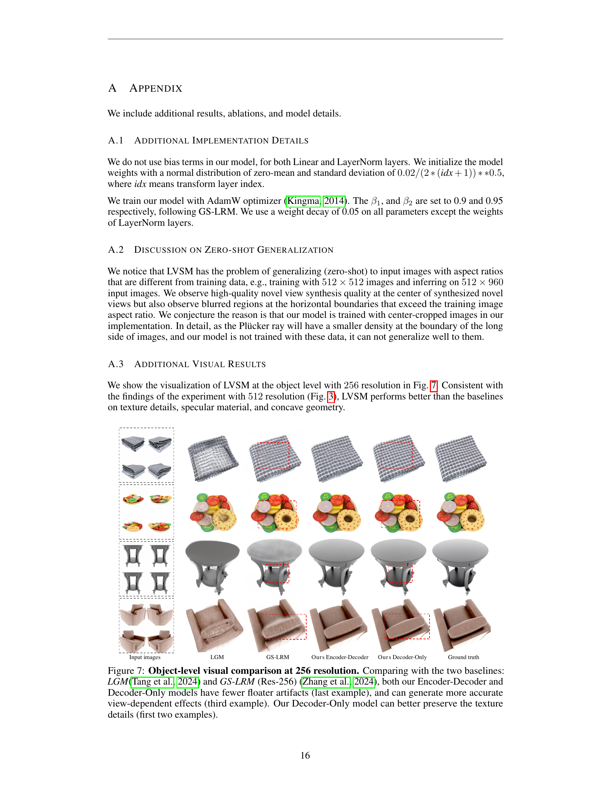

### TL;DR



The research paper introduces the Large View Synthesis Model (LVSM), a new approach to creating realistic images from different viewpoints. Unlike previous methods that relied on 3D information, LVSM uses a data-driven approach. This means it learns directly from images without pre-built 3D models, making it more flexible and adaptable. They propose two versions: an encoder-decoder model and a decoder-only model. The encoder-decoder model processes images into a compact representation before creating the new views. The decoder-only model creates the new views directly from the input images.  The decoder-only model performed better in terms of image quality and the ability to handle various input image numbers. Experiments across multiple datasets showed that both versions of LVSM outperformed existing methods. This is significant because it shows that high-quality images can be created from different viewpoints without needing complex 3D models, opening up opportunities for various applications.




 &nbsp; read the paper on arXiv


#### Why does it matter?
The paper introduces LVSM, a novel transformer-based model for novel view synthesis that minimizes 3D inductive bias, achieving state-of-the-art results on multiple benchmarks.
#### Key Takeaways


 LVSM minimizes 3D inductive biases for more generalizable novel view synthesis. 



 Decoder-only LVSM outperforms encoder-decoder LVSM in quality and scalability, while the encoder-decoder model offers faster inference. 



 LVSM achieves state-of-the-art results on multiple datasets even with reduced computational resources (1-2 GPUs). 


------
#### Visual Insights

 on both objects and scenes. LVSM achieves significant quality improvements compared with the previous SOTA method, i.e., GS-LRM (Zhang et al., 2024). (Please zoom in for more details.)")

> Figure 1 shows example results of novel view synthesis on both object and scene level using LVSM, comparing it with the previous state-of-the-art method.

. We note that all models are trained with just 4 input views.")

> The chart displays the zero-shot generalization performance of the decoder-only and encoder-decoder LVSM models, as well as the GS-LRM baseline, across varying numbers of input views on the GSO dataset.


 <table id='1' style='font-size:14px'><tr><td rowspan="2"></td><td colspan="3">ABO Collins et al. 2022a</td><td colspan="3">GSO Downs et al.. 2022</td><td></td><td colspan="3">RealEstate10k Zhou et al. 2018)</td></tr><tr><td>PSNR</td><td>SSIM</td><td>LPIPS ↓</td><td>PSNR</td><td>SSIM LPIPS</td><td>↓</td><td></td><td>PSNR ↑</td><td>SSIM</td><td>LPIPS ↓</td></tr><tr><td>Triplane-LRM Liet al.. 2023 (Res-512)</td><td>27.50</td><td>0.896</td><td>0.093</td><td>26.54</td><td>0.893</td><td>0.064</td><td>pixelNeRF Yuetal.. 2021</td><td>20.43</td><td>0.589</td><td>0.550</td></tr><tr><td>GS-LRM Zhangetai., 2024) (Res-512)</td><td>29.09</td><td>0.925</td><td>0.085</td><td>30.52</td><td>0.952</td><td>0.050</td><td>GPNR Suhail etal. 2022a</td><td>24.11</td><td>0.793</td><td>0.255</td></tr><tr><td>OursEncoder-Decoder (Res-512)</td><td>29.81</td><td>0.913</td><td>0.065</td><td>29.32</td><td>0.933</td><td>0.052</td><td>Du et. al Duetal. 2023,</td><td>24.78</td><td>0.820</td><td>0.213</td></tr><tr><td>Ours Decoder-Only (Res-512)</td><td>32.10</td><td>0.938</td><td>0.045</td><td>32.36</td><td>0.962</td><td>0.028</td><td>pixelSplat Charatan et al.. 2024</td><td>26.09</td><td>0.863</td><td>0.136</td></tr><tr><td>LGM Tang et al.. 2024) (Res-256)</td><td>20.79</td><td>0.813</td><td>0.158</td><td>21.44</td><td>0.832</td><td>0.122</td><td>MVSpiat Cnen etal., 2024</td><td>26.39</td><td>0.869</td><td>0.128</td></tr><tr><td>GS-LRM Znang et al., 2024, (Res-256)</td><td>28.98</td><td>0.926</td><td>0.074</td><td>29.59</td><td>0.944</td><td>0.051</td><td>GS-LRM Znang et al., 2024</td><td>28.10</td><td>0.892</td><td>0.114</td></tr><tr><td>OursEncoder-Decoder (Res-256)</td><td>30.35</td><td>0.923</td><td>0.052</td><td>29.19</td><td>0.932</td><td>0.046</td><td>OursEncoder-Decoder</td><td>28.58</td><td>0.893</td><td>0.114</td></tr><tr><td>Ours Decoder-Only (Res-256)</td><td>32.47</td><td>0.944</td><td>0.037</td><td>31.71</td><td>0.957</td><td>0.027</td><td>Ours Decoder-Only</td><td>29.67</td><td>0.906</td><td>0.098</td></tr></table>

> The table presents quantitative comparisons of object-level and scene-level novel view synthesis performance metrics (PSNR, SSIM, LPIPS) for the proposed LVSM model against several state-of-the-art baselines.

### More visual insights

More on figures

 and a Encoder-Decoder architecture (right).")

> The figure illustrates the two transformer-based architectures of the Large View Synthesis Model (LVSM): a decoder-only architecture and an encoder-decoder architecture, both designed for novel view synthesis from sparse image inputs.

, we compare our high-res object-level novel-view rendering results with two baselines: Instant3D’s Triplane-LRM (Li et al., 2023) and GS-LRM (Res-512) (Zhang et al., 2024) . Both our Encoder-Decoder and Decoder-Only models exhibit fewer floaters (first example) and fewer blurry artifacts (second example), compared to the baselines. Our Decoder-Only model effectively handles complex geometry, including small holes (third example) and thin structures (fourth example). Additionally, it preserves the details of high-frequency texture (last example).")

> Figure 3 shows a qualitative comparison of object-level novel view synthesis results from four different methods at 512 resolution, highlighting the superior performance of the proposed LVSM in handling complex geometries and high-frequency textures.

, MVSplat (Chen et al., 2024), and GS-LRM (Zhang et al., 2024). Our methods exhibit fewer texture and geometric artifacts, generate more accurate and realistic specular reflections, and are closer to the ground truth images.")

> Figure 4 shows a qualitative comparison of scene-level view synthesis results between the proposed LVSM and several baseline methods, highlighting the improved quality and realism of LVSM.

, we compare our high-res object-level novel-view rendering results with two baselines: Instant3D’s Triplane-LRM (Li et al., 2023) and GS-LRM (Res-512) (Zhang et al., 2024) . Both our Encoder-Decoder and Decoder-Only models exhibit fewer floaters (first example) and fewer blurry artifacts (second example), compared to the baselines. Our Decoder-Only model effectively handles complex geometry, including small holes (third example) and thin structures (fourth example). Additionally, it preserves the details of high-frequency texture (last example).")

> Figure 3 shows a comparison of object-level novel view rendering results from the proposed LVSM model against two baseline methods, highlighting the superior performance of LVSM in terms of fewer artifacts and better handling of complex geometries.

More on tables


<table id='1' style='font-size:14px'><tr><td></td><td colspan="3">RealEstate10k Zhou et al. 2018)</td></tr><tr><td></td><td>PSNR ↑</td><td>SSIM</td><td>LPIPS ↓</td></tr><tr><td>Ours Encoder-Decoder (6 + 18)</td><td>28.32</td><td>0.888</td><td>0.117</td></tr><tr><td>Ours Encoder-Decoder (12 + 12)</td><td>27.39</td><td>0.869</td><td>0.137</td></tr><tr><td>Ours Encoder-Decoder (18 +6)</td><td>26.80</td><td>0.855</td><td>0.152</td></tr><tr><td>Ours Decoder-Only (24 layers)</td><td>28.89</td><td>0.894</td><td>0.108</td></tr><tr><td>Ours Decoder-Only (18 layers)</td><td>28.77</td><td>0.892</td><td>0.109</td></tr><tr><td>Ours Decoder-Only (12 layers)</td><td>28.61</td><td>0.890</td><td>0.111</td></tr><tr><td>Ours Decoder-Only (6 layers)</td><td>27.62</td><td>0.869</td><td>0.129</td></tr></table>

> Table 1 quantitatively compares the performance of the proposed LVSM model against various baselines on object-level and scene-level view synthesis tasks, using PSNR, SSIM, and LPIPS metrics.


 <table id='3' style='font-size:14px'><tr><td></td><td colspan="3">GSO Downs et al. 2022</td></tr><tr><td></td><td>PSNR ↑</td><td>SSIM T</td><td>LPIPS ↓</td></tr><tr><td>Ours Encoder-Decoder</td><td>28.07</td><td>0.920</td><td>0.053</td></tr><tr><td>Ours w/o latents' self-updating</td><td>26.61</td><td>0.903</td><td>0.061</td></tr><tr><td></td><td colspan="3">RealEstate10k Zhou et al., 2018</td></tr><tr><td></td><td>PSNR ↑</td><td>SSIM�</td><td>LPIPS ↓</td></tr><tr><td>Ours Decoder-Only</td><td>29.67</td><td>0.906</td><td>0.098</td></tr><tr><td>Ours w/ per-patch prediction</td><td>28.98</td><td>0.897</td><td>0.103</td></tr></table>

> The table quantitatively compares the performance of the proposed LVSM model with various state-of-the-art methods on object-level and scene-level view synthesis tasks, showing PSNR, SSIM, and LPIPS scores for different resolutions.


<table id='1' style='font-size:14px'><tr><td></td><td colspan="3">GSO Downs et al., 2022</td></tr><tr><td></td><td>PSNR ↑</td><td>SSIMT</td><td>LPIPS ↓</td></tr><tr><td>Ours Decoder-Only (24 layers)</td><td>27.04</td><td>0.910</td><td>0.055</td></tr><tr><td>Ours Decoder-Only (18 layers)</td><td>26.81</td><td>0.907</td><td>0.057</td></tr><tr><td>Ours Decoder-Only (12 layers)</td><td>26.11</td><td>0.896</td><td>0.065</td></tr><tr><td>Ours Decoder-Only (6 layers)</td><td>24.15</td><td>0.865</td><td>0.092</td></tr></table>

> The table quantitatively compares the proposed LVSM model's performance on object-level and scene-level view synthesis tasks against several state-of-the-art baselines, using PSNR, SSIM, and LPIPS metrics.

### Full paper



