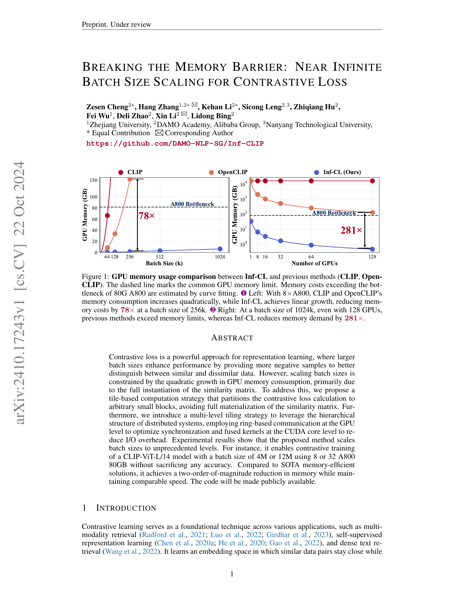
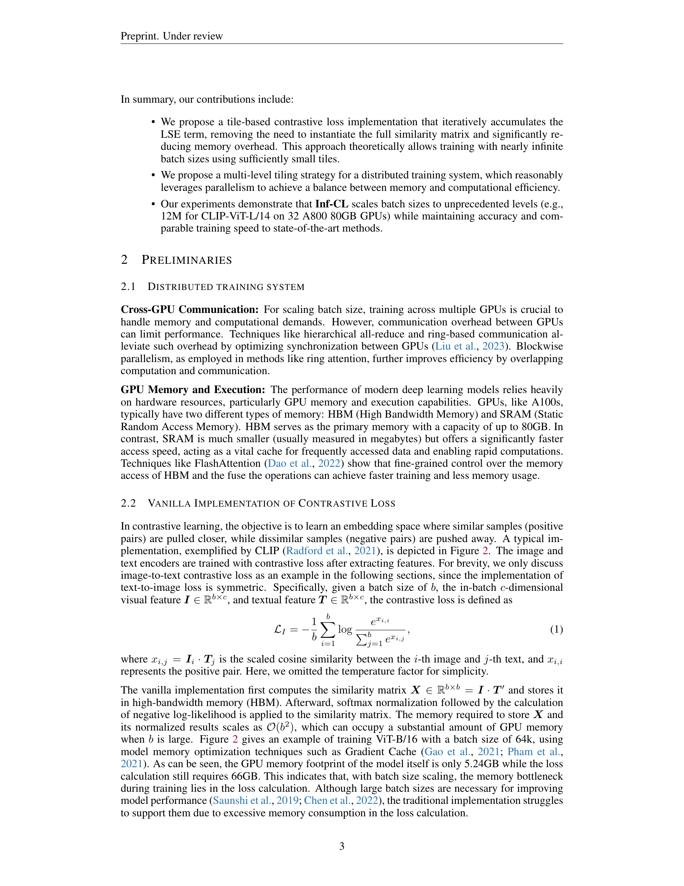
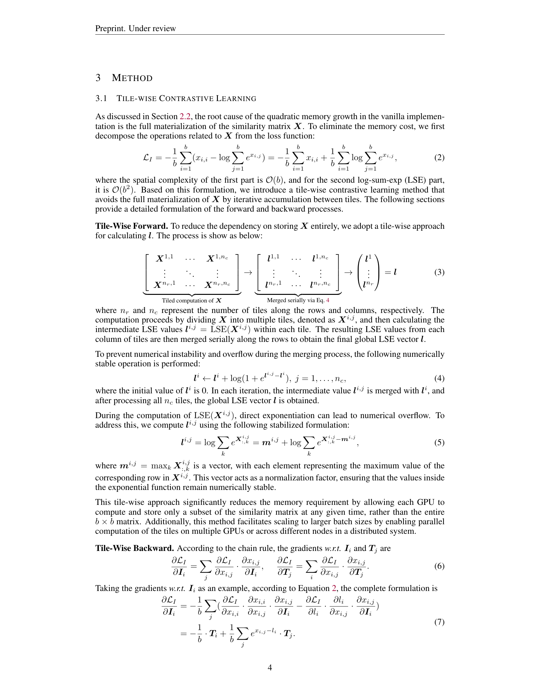
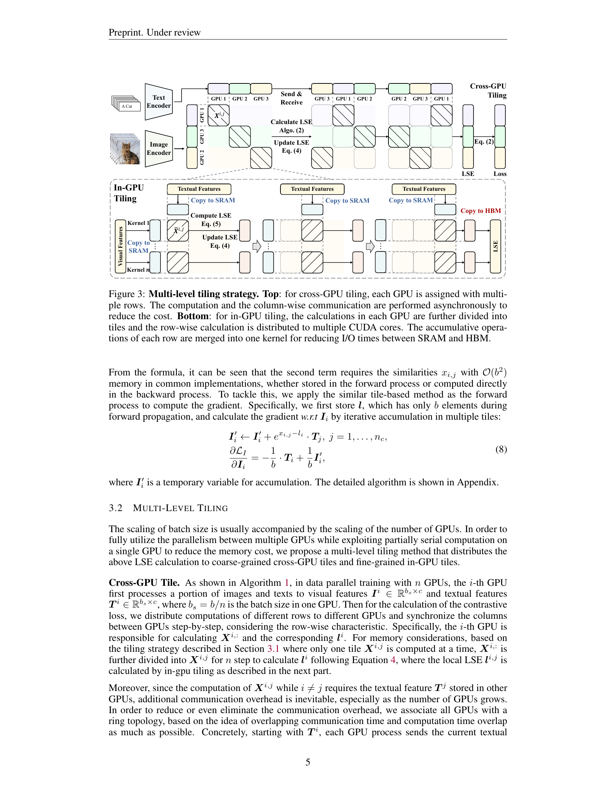
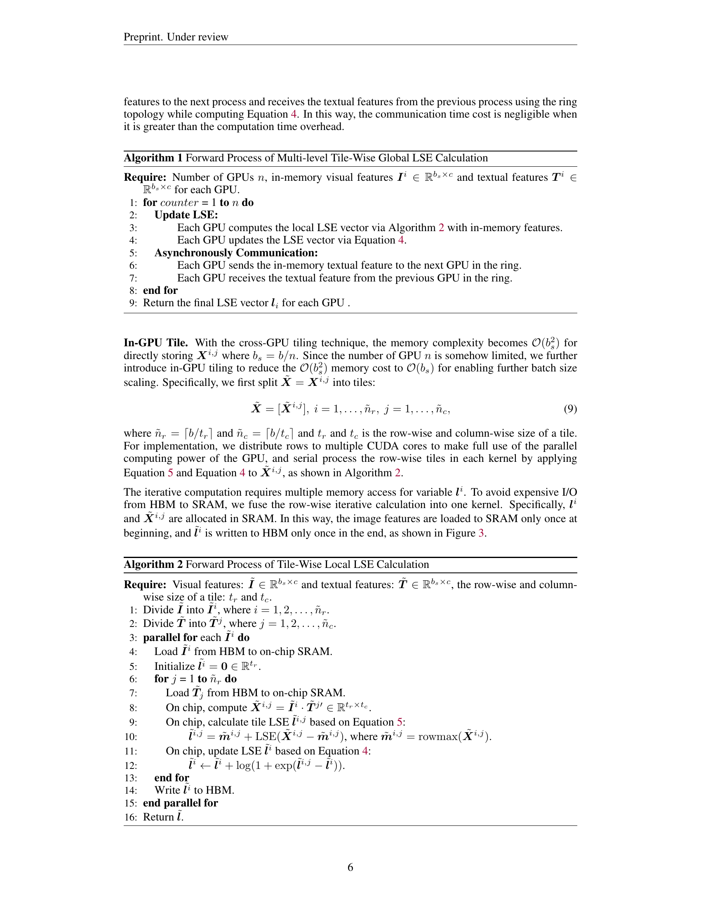
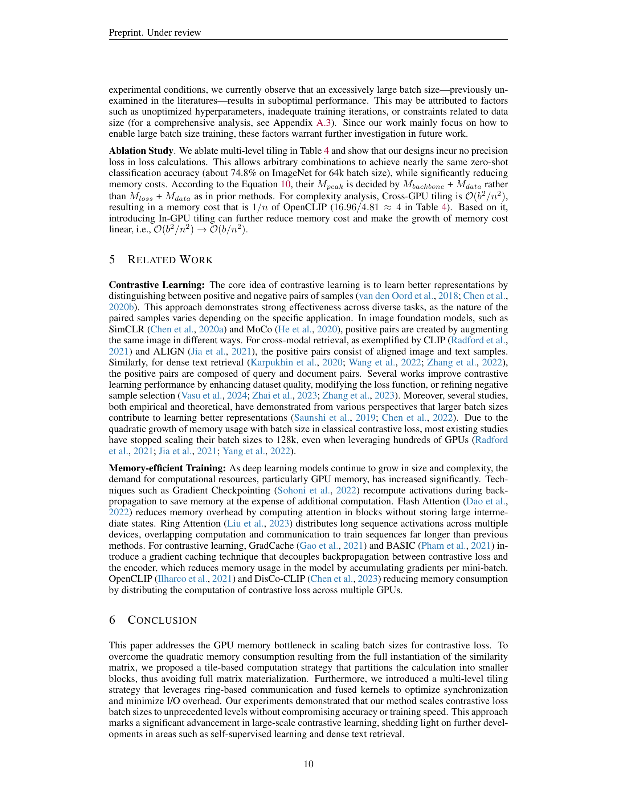
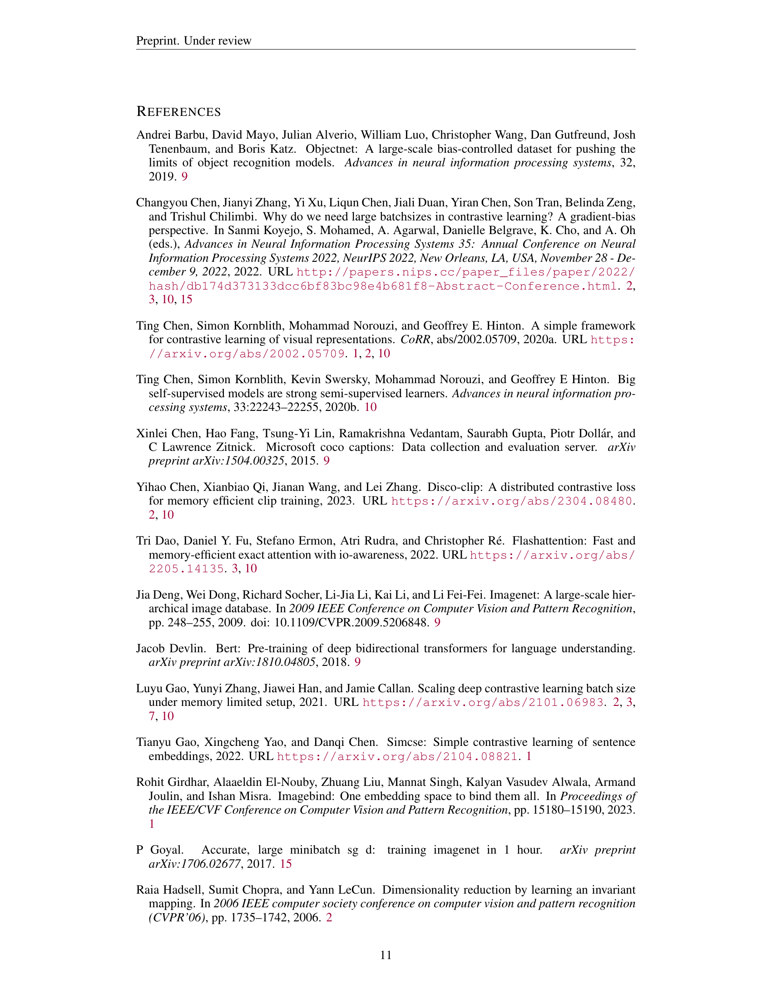
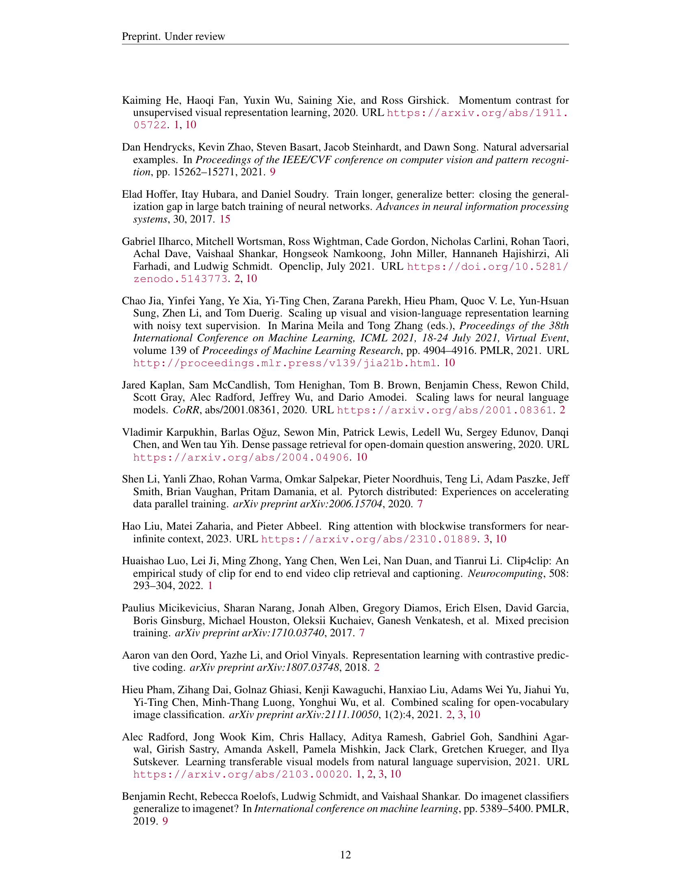
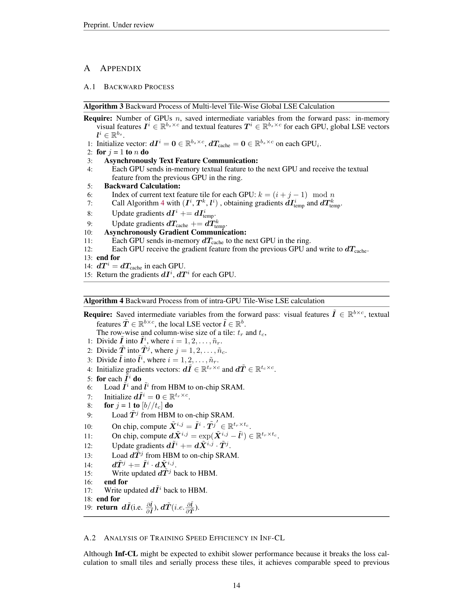
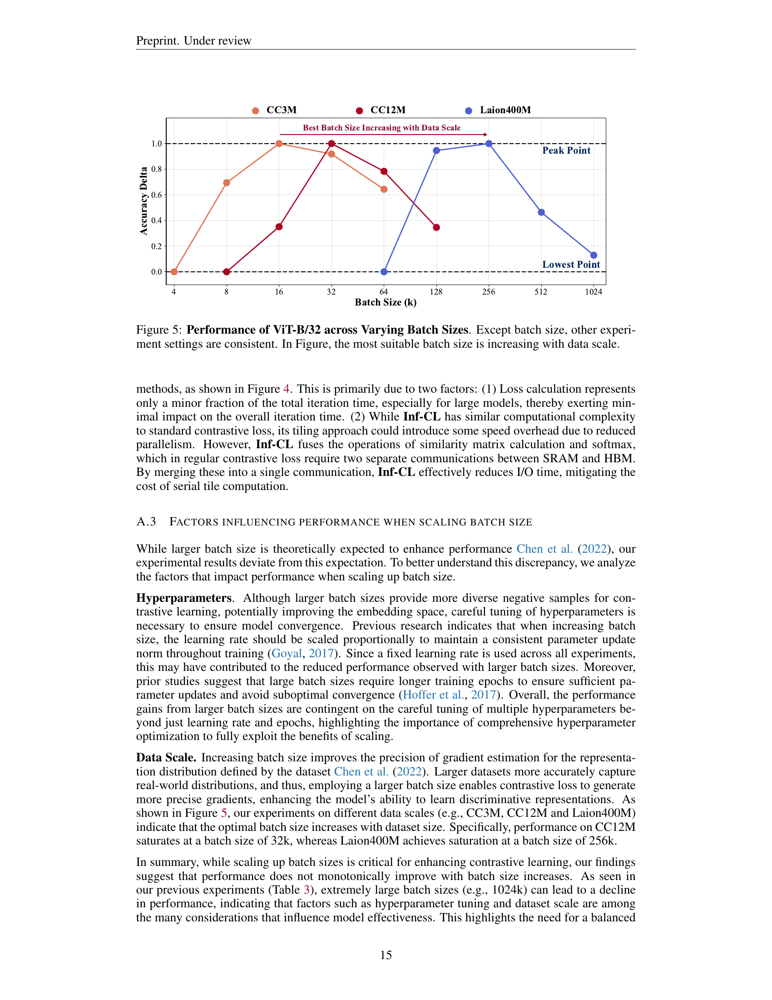

### TL;DR



Contrastive learning excels at representation learning, but scaling up batch size is hindered by the quadratic memory growth associated with the similarity matrix.  This paper presents Inf-CL, a novel method tackling this limitation. Inf-CL cleverly partitions the similarity matrix into smaller, manageable tiles, preventing its full instantiation.  This tile-based strategy is further enhanced with a multi-level approach, leveraging both cross-GPU and in-GPU parallelization to optimize communication and computation. This results in a memory footprint that scales linearly instead of quadratically with batch size.  The results show Inf-CL can handle vastly larger batch sizes (up to 12M) than previous methods, training a CLIP-ViT-L/14 model without sacrificing accuracy. The achieved memory reduction is substantial – two orders of magnitude better than the state-of-the-art.  Inf-CL achieves this impressive result with comparable training speed.




 &nbsp; read the paper on arXiv


#### Why does it matter?
This research paper introduces Inf-CL, a novel approach to dramatically increase batch sizes in contrastive loss training by efficiently mitigating memory limitations, thus unlocking significant performance gains and pushing the boundaries of representation learning.
#### Key Takeaways


 Inf-CL uses a tile-based computation strategy to avoid the full materialization of the similarity matrix, drastically reducing GPU memory consumption. 



 Inf-CL employs a multi-level tiling strategy, combining cross-GPU and in-GPU tiling, to achieve a balance between memory efficiency and parallel computation. 



 Experiments show that Inf-CL successfully trains a large CLIP model with batch sizes up to 12M, drastically outperforming existing memory-efficient methods. 


------
#### Visual Insights

 Vanilla implementation of contrastive loss gathers features to all devices to calculate all similarity simultaneously, where the similarity with squared complexity are repeatedly stored in all devices, causing huge memory costs for loss calculation when batch size increases. (b) Our Inf-CL significant decreases the memory cost by serial and distributed tile-wise computation.")

> The figure compares the vanilla implementation of contrastive loss with the proposed Inf-CL method, highlighting how Inf-CL reduces memory costs by using a tile-wise computation strategy.

. The dashed line marks the common GPU memory limit. Memory costs exceeding the bottleneck of 80G A800 are estimated by curve fitting. Left: With 8×A800, CLIP and OpenCLIP's memory consumption increases quadratically, while Inf-CL achieves linear growth, reducing memory costs by 78× at a batch size of 256k. Right: At a batch size of 1024k, even with 128 GPUs, previous methods exceed memory limits, whereas Inf-CL reduces memory demand by 281×.")

> The chart compares the GPU memory usage of Inf-CL against CLIP and OpenCLIP, demonstrating Inf-CL's significantly reduced memory consumption at various batch sizes and GPU counts.

{{< table-caption caption="🔽 Table 1: Training Memory Cost Across Different Hardware and Batch Sizes. Experiments utilize Data Parallelism with Automatic Mixed Precision for efficient distributed training. The baselines include the Vanilla loss (CLIP) and Local loss (OpenCLIP). To minimize memory consumption, Gradient Cache is adopted, with an accumulation batch size of 128. * indicates the use of the data offload strategy, which reduces memory usage by transferring only a small data batch from CPU to GPU during each accumulation step. X denotes cases where the baseline exceeds the hardware memory limit for a given batch size, making training infeasible. Memory cost is evaluated using the ViT-L/14 architecture and the AdamW optimizer." >}}
<table id='1' style='font-size:18px'><tr><td rowspan="2">Model</td><td colspan="5">Loss (Peak) Memory Cost (GB)</td></tr><tr><td>32k</td><td>64k</td><td>128k</td><td>256k</td><td>1024k</td></tr><tr><td colspan="6">8xA800 (U 8 X 80GB)</td></tr><tr><td>CLIP</td><td>16.67 (46.40)</td><td>66.11 (77.94)</td><td>X</td><td>X</td><td>X</td></tr><tr><td>OpenCLIP</td><td>2.27 (43.97)</td><td>8.63 (46.38)</td><td>33.64 (51.23)</td><td>X</td><td>X</td></tr><tr><td>Inf-CL</td><td>0.18 (44.20)</td><td>0.36 (46.63)</td><td>0.72 (51.46)</td><td>1.45 (61.13)</td><td>X</td></tr><tr><td>Inf-CL*</td><td>0.18 (42.40)</td><td>0.36 (42.49)</td><td>0.72 (42.69)</td><td>1.45 (43.07)</td><td>6.53 (45.40)</td></tr><tr><td colspan="6">32xA800 (U 32x80GB)</td></tr><tr><td>CLIP</td><td>16.66 (42.85)</td><td>66.11 (75.52)</td><td>X</td><td>X</td><td>X</td></tr><tr><td>OpenCLIP</td><td>0.71 (42.46)</td><td>2.45 (43.06)</td><td>8.98 (44.26)</td><td>34.35 (46.71)</td><td>X</td></tr><tr><td>Inf-CL</td><td>0.05 (42.48)</td><td>0.09 (43.08)</td><td>0.18 (44.30)</td><td>0.35 (46.71)</td><td>1.44 (61.20)</td></tr></table>

> The table shows the peak memory usage (GB) of different contrastive loss methods under varying batch sizes and hardware configurations.

### More visual insights

More on figures

 Vanilla implementation of contrastive loss gathers features to all devices to calculate all similarity simultaneously, where the similarity with squared complexity are repeatedly stored in all devices, causing huge memory costs for loss calculation when batch size increases. (b) Our Inf-CL significant decreases the memory cost by serial and distributed tile-wise computation.")

> The figure illustrates the difference in memory usage and computational flow between the vanilla implementation of contrastive loss and the proposed Inf-CL method, highlighting the memory efficiency gains achieved by Inf-CL.

. The dashed line marks the common GPU memory limit. Memory costs exceeding the bottleneck of 80G A800 are estimated by curve fitting. Left: With 8×A800, CLIP and OpenCLIP's memory consumption increases quadratically, while Inf-CL achieves linear growth, reducing memory costs by 78× at a batch size of 256k. Right: At a batch size of 1024k, even with 128 GPUs, previous methods exceed memory limits, whereas Inf-CL reduces memory demand by 281×.")

> The figure shows a comparison of GPU memory usage for contrastive loss training between Inf-CL and other methods (CLIP and OpenCLIP) across different batch sizes and numbers of GPUs.

> This figure illustrates the multi-level tiling strategy used in Inf-CL to reduce memory consumption and optimize performance by distributing computations across multiple GPUs and CUDA cores.

More on charts

> The chart shows the training speed of ViT-L/14 CLIP model on 8xA800 GPUs for varying batch sizes, comparing the iteration time and total training time for CLIP, OpenCLIP, and Inf-CL.

> The chart displays how the accuracy delta of ViT-B/32 changes with varying batch sizes across three datasets (CC3M, CC12M, and Laion400M), showing the optimal batch size increases with the size of the dataset.

More on tables

{{< table-caption caption="🔽 Table 1: Training Memory Cost Across Different Hardware and Batch Sizes. Experiments utilize Data Parallelism with Automatic Mixed Precision for efficient distributed training. The baselines include the Vanilla loss (CLIP) and Local loss (OpenCLIP). To minimize memory consumption, Gradient Cache is adopted, with an accumulation batch size of 128. * indicates the use of the data offload strategy, which reduces memory usage by transferring only a small data batch from CPU to GPU during each accumulation step. X denotes cases where the baseline exceeds the hardware memory limit for a given batch size, making training infeasible. Memory cost is evaluated using the ViT-L/14 architecture and the AdamW optimizer." >}}
<table id='1' style='font-size:22px'><tr><td rowspan="2">Budget</td><td colspan="3">Maximum Batch Size (Loss Memory Cost)</td><td rowspan="2">Improvement (Ours / Sota)</td></tr><tr><td>CLIP</td><td>OpenCLIP</td><td>Inf-CL</td></tr><tr><td colspan="5">ViT-B/16</td></tr><tr><td rowspan="2">8xA800 32x A800</td><td>68k (74.39 GB)</td><td>172k (59.95 GB)</td><td>800k (3.01 GB)</td><td>4.65 (800k/172k)</td></tr><tr><td>68k (74.39 GB)</td><td>360k (66.29 GB)</td><td>3456k (3.27 GB)</td><td>9.60 (3456k/360k)</td></tr><tr><td colspan="5">ViT-L/14</td></tr><tr><td rowspan="2">8xA800 32xA800</td><td>64k (66.11 GB)</td><td>152k (47.23 GB)</td><td>448k (2.52 GB)</td><td>2.94 (448k/152k)</td></tr><tr><td>64k (66.11 GB)</td><td>352k (64.13 GB)</td><td>2048k (2.89 GB)</td><td>5.82 (2048k/256k)</td></tr><tr><td colspan="5">ViT-L/14 w/ data offload</td></tr><tr><td rowspan="2">8xA800 32xA800</td><td>64k (66.11 GB)</td><td>184k (69.10 GB)</td><td>4096k (26.12 GB)</td><td>22.26 (4096k/184k)</td></tr><tr><td>64k (66.11 GB)</td><td>368k (64.13 GB)</td><td>12288k (19.59 GB)</td><td>33.39 (12288k/368k)</td></tr></table>

> Table 1 shows the peak memory usage of CLIP, OpenCLIP, and Inf-CL under various batch sizes and hardware configurations, highlighting the memory efficiency of Inf-CL.

{{< table-caption caption="🔽 Table 3: Performance Verification. The training strategies is consistent with Table 2. We choose ViT-B/16 as the model architecture and adopt LiT strategy like Table 4. We evaluate zero-shot top-1 classification accuracy on several data sets, e.g., ImageNet-Validation Deng et al. (2009), ImageNet-v2 (Recht et al., 2019), ObjectNet (Barbu et al., 2019) and ImageNet-OOD (Hendrycks et al., 2021). We also evaluate zero-shot image-text top-1 retrieval accuracy on MSCOCO (Chen et al., 2015)." >}}
<table id='1' style='font-size:18px'><tr><td rowspan="2">Method (Batch Size)</td><td colspan="4">ImageNet</td><td colspan="2">MSCOCO R@1</td></tr><tr><td>Validation</td><td>v2</td><td>ObjectNet</td><td>OOD</td><td>I→T</td><td>T→I</td></tr><tr><td>Vanilla (64K)</td><td>74.74</td><td>65.30</td><td>46.31</td><td>66.13</td><td>25.71</td><td>44.31</td></tr><tr><td>OpenCLIP (64K)</td><td>74.86</td><td>65.22</td><td>46.29</td><td>66.75</td><td>25.98</td><td>44.02</td></tr><tr><td>Inf-CL (64K)</td><td>74.93</td><td>65.27</td><td>46.13</td><td>66.77</td><td>26.01</td><td>43.95</td></tr><tr><td>Inf-CL (256K)</td><td>75.12</td><td>65.12</td><td>46.44</td><td>67.15</td><td>25.90</td><td>44.61</td></tr><tr><td>Inf-CL (1024K)</td><td>73.58</td><td>63.87</td><td>44.55</td><td>64.60</td><td>24.53</td><td>41.58</td></tr></table>

> Table 3 presents a performance comparison of different methods on various datasets, showing the impact of batch size and the Inf-CL method on the zero-shot classification accuracy and image-text retrieval performance.

{{< table-caption caption="🔽 Table 1: Training Memory Cost Across Different Hardware and Batch Sizes. Experiments utilize Data Parallelism with Automatic Mixed Precision for efficient distributed training. The baselines include the Vanilla loss (CLIP) and Local loss (OpenCLIP). To minimize memory consumption, Gradient Cache is adopted, with an accumulation batch size of 128. * indicates the use of the data offload strategy, which reduces memory usage by transferring only a small data batch from CPU to GPU during each accumulation step. X denotes cases where the baseline exceeds the hardware memory limit for a given batch size, making training infeasible. Memory cost is evaluated using the ViT-L/14 architecture and the AdamW optimizer." >}}
<table id='3' style='font-size:20px'><tr><td rowspan="2">Cross-GPU In-GPU</td><td>Data</td><td colspan="2">Loss</td><td>Backbone</td><td>Peak</td><td rowspan="2">ImageNet</td></tr><tr><td>Memory</td><td>Complexity</td><td>Memory</td><td>Memory</td><td>Memory</td></tr><tr><td>(Vanilla)</td><td>1.96</td><td>O(b2)</td><td>66.21</td><td>8.26</td><td>69.24</td><td>74.82</td></tr><tr><td>(OpenCLIP)</td><td>1.96</td><td>O(b2 /n)</td><td>16.96</td><td>8.26</td><td>20.79</td><td>74.86</td></tr><tr><td>V</td><td>1.96</td><td>⌀(b2 /n2)</td><td>4.81</td><td>8.26</td><td>12.30</td><td>74.78</td></tr><tr><td>V</td><td>1.96</td><td>O(b/n2)</td><td>0.81</td><td>8.26</td><td>12.30</td><td>74.93</td></tr></table>

> Table 1 shows the peak GPU memory cost for training with different batch sizes using various methods (CLIP, OpenCLIP, and Inf-CL) and hardware configurations (8 and 32 GPUs).

{{< table-caption caption="🔽 Table 1: Training Memory Cost Across Different Hardware and Batch Sizes. Experiments utilize Data Parallelism with Automatic Mixed Precision for efficient distributed training. The baselines include the Vanilla loss (CLIP) and Local loss (OpenCLIP). To minimize memory consumption, Gradient Cache is adopted, with an accumulation batch size of 128. * indicates the use of the data offload strategy, which reduces memory usage by transferring only a small data batch from CPU to GPU during each accumulation step. X denotes cases where the baseline exceeds the hardware memory limit for a given batch size, making training infeasible. Memory cost is evaluated using the ViT-L/14 architecture and the AdamW optimizer." >}}
 <table id='4' style='font-size:16px'><tr><td colspan="2">Require: Number of GPUs n, saved intermediate variables from the forward</td></tr><tr><td></td><td>pass: in-memory visual features Ir E Rbsxc and textual features T2 E Rbsxc for each GPU, global LSE vectors li E Rbs.</td></tr><tr><td>1:</td><td>Initialize vector: dIi = 0 E Rbsxc. dTcache = 0 E Rbsxc on each GPUi. ,</td></tr><tr><td>2:</td><td>for j = 1 to n do</td></tr><tr><td>3:</td><td>Asynchronously Text Feature Communication:</td></tr><tr><td>4:</td><td>Each GPU sends in-memory textual feature to the next GPU and receive the textual feature from the previous GPU in the ring.</td></tr><tr><td>5:</td><td>Backward Calculation:</td></tr><tr><td>6:</td><td>Index of current text feature tile for each GPU: k = (i+j - 1) mod n</td></tr><tr><td>7:</td><td>Call Algorithm 4 with (Ir, , Tk li) , obtaining gradients dItemp and dTtemp. ,</td></tr><tr><td>8:</td><td>Update gradients dIi += dItemp.</td></tr><tr><td>9:</td><td>Update gradients dTcache += dTk</td></tr><tr><td>10:</td><td>Asynchronously Gradient Communication:</td></tr><tr><td>11:</td><td>Each GPU sends in-memory dTcache to the next GPU in the ring.</td></tr><tr><td>12:</td><td>Each GPU receive the gradient feature from the previous GPU and write to dTcache.</td></tr><tr><td>13:</td><td>end for</td></tr><tr><td>14:</td><td>dTi = dTcache in each GPU.</td></tr><tr><td>15:</td><td>Return the gradients dIi dTi for each GPU. ,</td></tr></table>

> Table 1 shows the peak memory cost of contrastive loss calculations for different models, batch sizes, and numbers of GPUs, comparing the proposed Inf-CL method with existing baselines.

### Full paper



