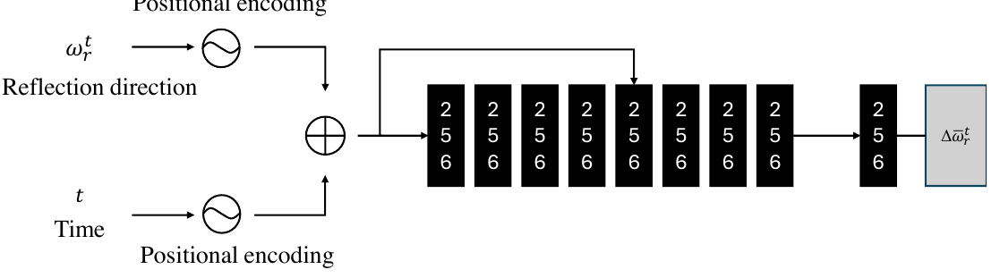
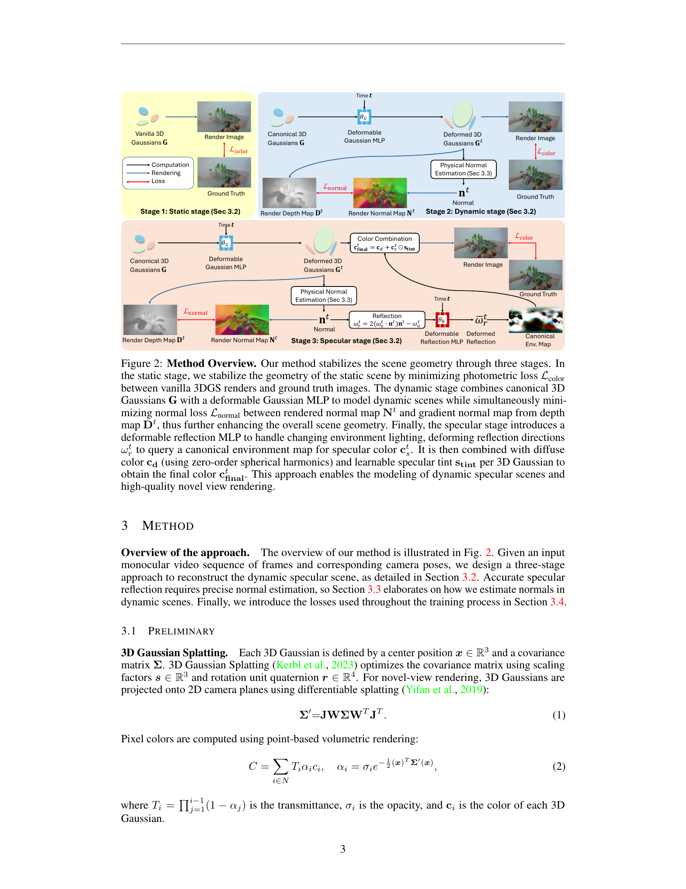
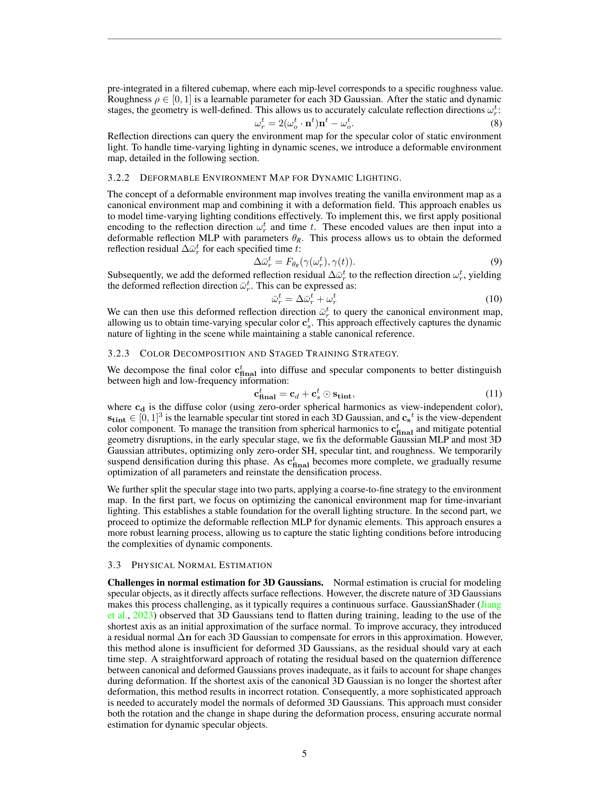
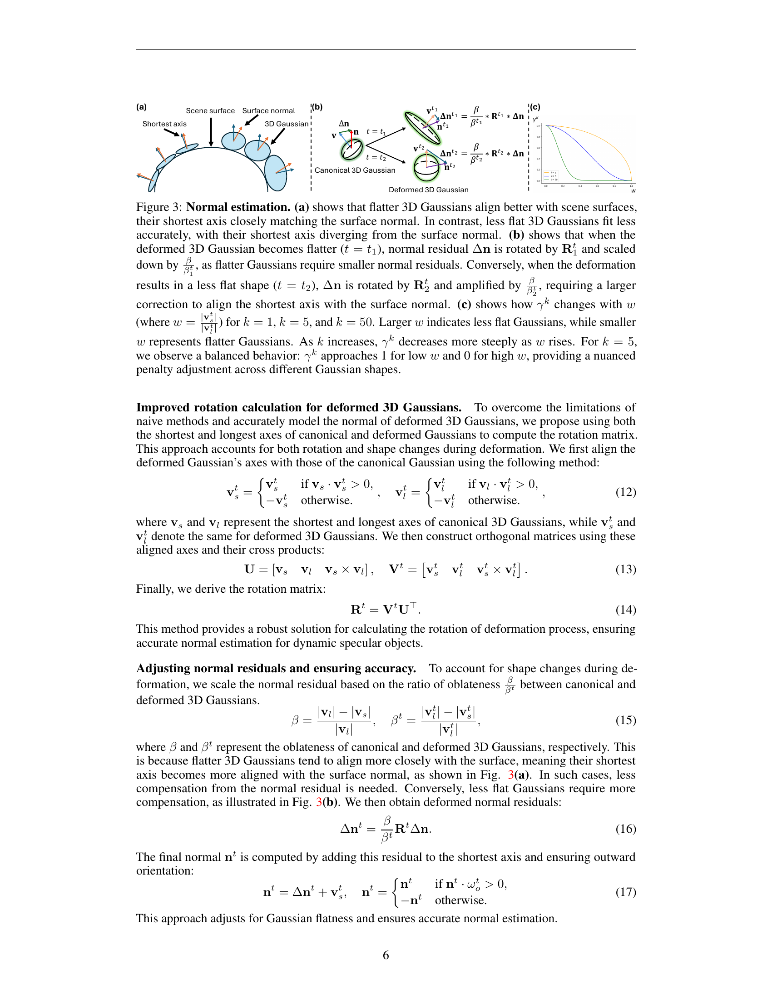
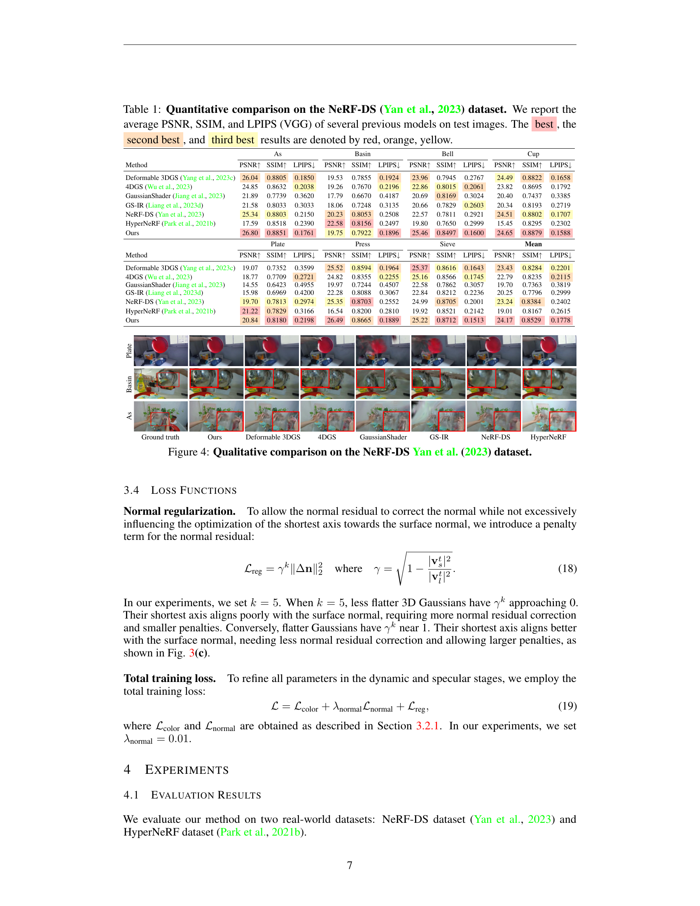
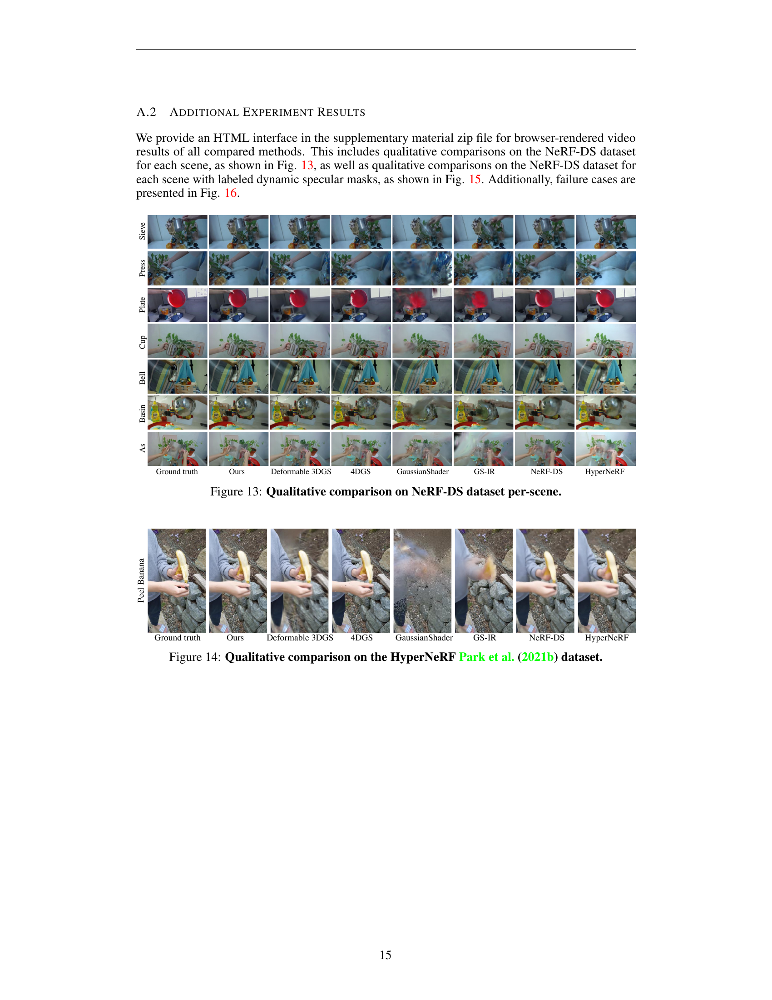
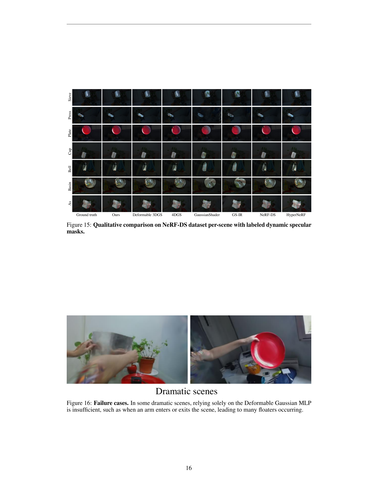

### TL;DR



SpectroMotion is a new method for creating realistic 3D models of scenes with shiny surfaces and moving objects.  Existing methods struggled to handle both the dynamic movement and realistic reflections. SpectroMotion overcomes this by using three main techniques:  It improves how it estimates the direction of surface normals (which are important for calculating reflections), uses a flexible environment map that adjusts to changing light conditions, and trains the model in multiple stages to get better results.  Testing showed SpectroMotion produces higher quality results compared to other approaches, especially for complex scenes.  It's the first 3D Gaussian Splatting method that can render realistic dynamic specular scenes.




 &nbsp; read the paper on arXiv


#### Why does it matter?
Summarizing the academic paper on SpectroMotion: Dynamic 3D Reconstruction of Specular Scenes.
#### Key Takeaways


 SpectroMotion achieves superior dynamic specular scene reconstruction by combining 3D Gaussian Splatting with physically-based rendering and deformation fields. 



 A novel residual correction technique and deformable environment map enhance accurate surface normal computation and adapt to time-varying lighting. 



 A coarse-to-fine training strategy significantly improves both scene geometry and specular color prediction. 


------
#### Visual Insights

 to demonstrate the effectiveness of our approach.")

> The figure shows a qualitative comparison of SpectroMotion's results against other methods, highlighting its superior rendering quality of dynamic specular scenes.


 <table id='1' style='font-size:14px'><tr><td></td><td colspan="3">As</td><td colspan="3">Basin</td><td colspan="3">Bell</td><td colspan="3">Cup</td></tr><tr><td>Method</td><td>PSNR↑</td><td>SSIM↑</td><td>LPIPS↓</td><td>PSNR↑</td><td>SSIM↑</td><td>LPIPS↓</td><td>PSNR↑</td><td>SSIM↑</td><td>LPIPS↓</td><td>PSNR↑</td><td>SSIM↑</td><td>LPIPS↓</td></tr><tr><td>Deformable 3DGS (Yang et al., 2023c)</td><td>26.04</td><td>0.8805</td><td>0.1850</td><td>19.53</td><td>0.7855</td><td>0.1924</td><td>23.96</td><td>0.7945</td><td>0.2767</td><td>24.49</td><td>0.8822</td><td>0.1658</td></tr><tr><td>4DGS (Wu et al., 2023)</td><td>24.85</td><td>0.8632</td><td>0.2038</td><td>19.26</td><td>0.7670</td><td>0.2196</td><td>22.86</td><td>0.8015</td><td>0.2061</td><td>23.82</td><td>0.8695</td><td>0.1792</td></tr><tr><td>GaussianShader (Jiang et al., 2023)</td><td>21.89</td><td>0.7739</td><td>0.3620</td><td>17.79</td><td>0.6670</td><td>0.4187</td><td>20.69</td><td>0.8169</td><td>0.3024</td><td>20.40</td><td>0.7437</td><td>0.3385</td></tr><tr><td>GS-IR (Liang et al., 2023d)</td><td>21.58</td><td>0.8033</td><td>0.3033</td><td>18.06</td><td>0.7248</td><td>0.3135</td><td>20.66</td><td>0.7829</td><td>0.2603</td><td>20.34</td><td>0.8193</td><td>0.2719</td></tr><tr><td>NeRF-DS (Yan et al., 2023)</td><td>25.34</td><td>0.8803</td><td>0.2150</td><td>20.23</td><td>0.8053</td><td>0.2508</td><td>22.57</td><td>0.7811</td><td>0.2921</td><td>24.51</td><td>0.8802</td><td>0.1707</td></tr><tr><td>HyperNeRF (Park et al., 2021b)</td><td>17.59</td><td>0.8518</td><td>0.2390</td><td>22.58</td><td>0.8156</td><td>0.2497</td><td>19.80</td><td>0.7650</td><td>0.2999</td><td>15.45</td><td>0.8295</td><td>0.2302</td></tr><tr><td>Ours</td><td>26.80</td><td>0.8851</td><td>0.1761</td><td>19.75</td><td>0.7922</td><td>0.1896</td><td>25.46</td><td>0.8497</td><td>0.1600</td><td>24.65</td><td>0.8879</td><td>0.1588</td></tr><tr><td></td><td colspan="3">Plate</td><td colspan="3">Press</td><td colspan="3">Sieve</td><td colspan="3">Mean</td></tr><tr><td>Method</td><td>PSNR↑</td><td>SSIM↑</td><td>LPIPS↓</td><td>PSNR↑</td><td>SSIM↑</td><td>LPIPS↓</td><td>PSNR↑</td><td>SSIM↑</td><td>LPIPS↓</td><td>PSNR↑</td><td>SSIM↑</td><td>LPIPS↓</td></tr><tr><td>Deformable 3DGS (Yang et al., 2023c)</td><td>19.07</td><td>0.7352</td><td>0.3599</td><td>25.52</td><td>0.8594</td><td>0.1964</td><td>25.37</td><td>0.8616</td><td>0.1643</td><td>23.43</td><td>0.8284</td><td>0.2201</td></tr><tr><td>4DGS (Wu et al., 2023)</td><td>18.77</td><td>0.7709</td><td>0.2721</td><td>24.82</td><td>0.8355</td><td>0.2255</td><td>25.16</td><td>0.8566</td><td>0.1745</td><td>22.79</td><td>0.8235</td><td>0.2115</td></tr><tr><td>GaussianShader (Jiang et al., 2023)</td><td>14.55</td><td>0.6423</td><td>0.4955</td><td>19.97</td><td>0.7244</td><td>0.4507</td><td>22.58</td><td>0.7862</td><td>0.3057</td><td>19.70</td><td>0.7363</td><td>0.3819</td></tr><tr><td>GS-IR (Liang et al., 2023d)</td><td>15.98</td><td>0.6969</td><td>0.4200</td><td>22.28</td><td>0.8088</td><td>0.3067</td><td>22.84</td><td>0.8212</td><td>0.2236</td><td>20.25</td><td>0.7796</td><td>0.2999</td></tr><tr><td>NeRF-DS (Yan et al., 2023)</td><td>19.70</td><td>0.7813</td><td>0.2974</td><td>25.35</td><td>0.8703</td><td>0.2552</td><td>24.99</td><td>0.8705</td><td>0.2001</td><td>23.24</td><td>0.8384</td><td>0.2402</td></tr><tr><td>HyperNeRF (Park et al., 2021b)</td><td>21.22</td><td>0.7829</td><td>0.3166</td><td>16.54</td><td>0.8200</td><td>0.2810</td><td>19.92</td><td>0.8521</td><td>0.2142</td><td>19.01</td><td>0.8167</td><td>0.2615</td></tr><tr><td>Ours</td><td>20.84</td><td>0.8180</td><td>0.2198</td><td>26.49</td><td>0.8665</td><td>0.1889</td><td>25.22</td><td>0.8712</td><td>0.1513</td><td>24.17</td><td>0.8529</td><td>0.1778</td></tr></table>

> Table 1 quantitatively compares the performance of SpectroMotion against several state-of-the-art methods on the NeRF-DS dataset, reporting average PSNR, SSIM, and LPIPS scores.

### More visual insights

More on figures

 and learnable specular tint Stint per 3D Gaussian to obtain the final color canal. This approach enables the modeling of dynamic specular scenes and high-quality novel view rendering.")

> The figure illustrates the three-stage approach of SpectroMotion for dynamic specular scene reconstruction, showing the process of stabilizing scene geometry, modeling dynamic scenes, and rendering specular reflections.

 shows that flatter 3D Gaussians align better with scene surfaces, their shortest axis closely matching the surface normal. In contrast, less flat 3D Gaussians fit less accurately, with their shortest axis diverging from the surface normal. (b) shows that when the deformed 3D Gaussian becomes flatter (t = t1), normal residual Δn is rotated by R1 and scaled down by βt1/β, as flatter Gaussians require smaller normal residuals. Conversely, when the deformation results in a less flat shape (t = t2), Δn is rotated by R2 and amplified by βt2/β, requiring a larger correction to align the shortest axis with the surface normal. (c) shows how γk changes with ω (where ω = v/v for k = 1, k = 5, and k = 50. Larger ω indicates less flat Gaussians, while smaller ω represents flatter Gaussians. As k increases, γk decreases more steeply as ω rises. For k = 5, we observe a balanced behavior: γk approaches 1 for low ω and 0 for high ω, providing a nuanced penalty adjustment across different Gaussian shapes.")

> Figure 3 illustrates the proposed method for physical normal estimation of deformed 3D Gaussians, highlighting how the approach accounts for both changes in shape and rotation during deformation.

 dataset.")

> Figure 4 shows a qualitative comparison of the proposed method against other state-of-the-art methods on the NeRF-DS dataset, highlighting the superior quality of specular reflections rendered by the proposed method.

 to demonstrate the effectiveness of our approach.")

> Figure 1 compares SpectroMotion's rendering of a dynamic specular scene against prior work, highlighting its improved reflection quality through physical normal estimation, deformable environment maps, and a coarse-to-fine training strategy.

 to demonstrate the effectiveness of our approach.")

> The figure shows a qualitative comparison of SpectroMotion with other methods on rendering a dynamic scene with specular reflections, highlighting its superior performance in recovering high-quality reflections.

> Figure 7 shows a comparison of ground truth images with our rendered test images, highlighting the specular and diffuse components separately.

 to demonstrate the effectiveness of our approach.")

> The figure shows a comparison of dynamic scene reconstruction results using SpectroMotion against existing methods, highlighting improved reflection quality.

 to demonstrate the effectiveness of our approach.")

> Figure 1 shows a comparison of SpectroMotion's dynamic scene reconstruction results against existing methods, highlighting improved specular reflection rendering quality.

> Figure 9 shows a qualitative comparison of the full model against ablation studies removing the coarse-to-fine training strategy, normal loss, normal regularization, and the gamma function.

 to demonstrate the effectiveness of our approach.")

> Figure 1 is a comparison of the results of SpectroMotion against prior work on a dynamic specular scene, highlighting improvements in reflection quality and accuracy.

> The figure shows the architecture of the deformable Gaussian MLP, which takes the Gaussian center and time as input and outputs the position, rotation, and scaling residuals.

> The figure illustrates the architecture of the deformable reflection MLP, showing how positional encoding of reflection direction and time are processed through multiple fully connected layers to produce the deformed reflection residual.

 to demonstrate the effectiveness of our approach.")

> The figure compares the results of SpectroMotion to other methods on a dynamic specular scene, highlighting its superior reflection quality.

 dataset.")

> Figure 4 shows a qualitative comparison of several methods on the NeRF-DS dataset, highlighting the superior quality of reflections produced by SpectroMotion.

 to demonstrate the effectiveness of our approach.")

> Figure 1 shows a comparison of SpectroMotion's rendering of a dynamic specular scene against several other methods, highlighting its superior quality of reflections.

 to demonstrate the effectiveness of our approach.")

> The figure shows a comparison of SpectroMotion's results against other methods, highlighting the improved quality of reflections rendered by SpectroMotion in a dynamic specular scene.

More on tables


 <table id='2' style='font-size:14px'><tr><td></td><td colspan="3">As</td><td colspan="3">Basin</td><td colspan="3">Bell</td><td colspan="3">Cup</td></tr><tr><td>Method</td><td>PSNR↑</td><td>SSIM↑</td><td>LPIPS↓</td><td>PSNR↑</td><td>SSIM↑</td><td>LPIPS↓</td><td>PSNR↑</td><td>SSIM↑</td><td>LPIPS↓</td><td>PSNR↑</td><td>SSIM↑</td><td>LPIPS↓</td></tr><tr><td>Deformable 3DGS (Yang et al., 2023c)</td><td>24.14</td><td>0.7432</td><td>0.2957</td><td>17.45</td><td>0.5530</td><td>0.3138</td><td>19.42</td><td>0.5516</td><td>0.2940</td><td>20.10</td><td>0.5446</td><td>0.3312</td></tr><tr><td>4DGS (Wu et al., 2023)</td><td>22.70</td><td>0.6993</td><td>0.3517</td><td>16.61</td><td>0.4797</td><td>0.4084</td><td>14.64</td><td>0.2596</td><td>0.4467</td><td>18.90</td><td>0.4132</td><td>0.4032</td></tr><tr><td>GaussianShader (Jiang et al., 2023)</td><td>19.27</td><td>0.5652</td><td>0.5232</td><td>15.71</td><td>0.4163</td><td>0.5941</td><td>12.10</td><td>0.1676</td><td>0.6764</td><td>14.90</td><td>0.3634</td><td>0.6146</td></tr><tr><td>GS-IR (Liang et al., 2023d)</td><td>19.32</td><td>0.5857</td><td>0.4782</td><td>15.21</td><td>0.4009</td><td>0.5644</td><td>12.09</td><td>0.1757</td><td>0.6722</td><td>14.80</td><td>0.3445</td><td>0.6046</td></tr><tr><td>NeRF-DS (Yan et al., 2023)</td><td>23.67</td><td>0.7478</td><td>0.3635</td><td>17.98</td><td>0.5537</td><td>0.4211</td><td>14.73</td><td>0.2439</td><td>0.5931</td><td>19.95</td><td>0.5079</td><td>0.3494</td></tr><tr><td>HyperNeRF (Park et al., 2021b)</td><td>17.37</td><td>0.6934</td><td>0.3834</td><td>18.75</td><td>0.5671</td><td>0.4125</td><td>13.93</td><td>0.2292</td><td>0.6051</td><td>15.07</td><td>0.4860</td><td>0.4183</td></tr><tr><td>Ours</td><td>24.51</td><td>0.7534</td><td>0.2896</td><td>17.71</td><td>0.5675</td><td>0.3048</td><td>19.60</td><td>0.5680</td><td>0.2862</td><td>20.28</td><td>0.5473</td><td>0.3176</td></tr><tr><td></td><td colspan="3">Plate</td><td colspan="3">Press</td><td colspan="3">Sieve</td><td colspan="3">Mean</td></tr><tr><td>Method</td><td>PSNR↑</td><td>SSIM↑</td><td>LPIPS↓</td><td>PSNR↑</td><td>SSIM↑</td><td>LPIPS↓</td><td>PSNR↑</td><td>SSIM↑</td><td>LPIPS↓</td><td>PSNR↑</td><td>SSIM↑</td><td>LPIPS↓</td></tr><tr><td>Deformable 3DGS (Yang et al., 2023c)</td><td>16.12</td><td>0.5192</td><td>0.3544</td><td>19.64</td><td>0.6384</td><td>0.3268</td><td>20.74</td><td>0.5283</td><td>0.3109</td><td>19.66</td><td>0.5826</td><td>0.3181</td></tr><tr><td>4DGS (Wu et al., 2023)</td><td>13.93</td><td>0.4095</td><td>0.4229</td><td>20.17</td><td>0.5434</td><td>0.4339</td><td>19.70</td><td>0.4498</td><td>0.3879</td><td>18.09</td><td>0.4649</td><td>0.4078</td></tr><tr><td>GaussianShader (Jiang et al., 2023)</td><td>9.87</td><td>0.2992</td><td>0.6812</td><td>16.84</td><td>0.4408</td><td>0.6093</td><td>16.19</td><td>0.3241</td><td>0.5862</td><td>14.98</td><td>0.3681</td><td>0.6121</td></tr><tr><td>GS-IR (Liang et al., 2023d)</td><td>11.09</td><td>0.3254</td><td>0.6270</td><td>16.43</td><td>0.4083</td><td>0.5776</td><td>16.42</td><td>0.3339</td><td>0.5749</td><td>15.05</td><td>0.3678</td><td>0.5856</td></tr><tr><td>NeRF-DS (Yan et al., 2023)</td><td>14.80</td><td>0.4518</td><td>0.3987</td><td>19.77</td><td>0.5835</td><td>0.5035</td><td>20.28</td><td>0.5173</td><td>0.4067</td><td>18.74</td><td>0.5151</td><td>0.4337</td></tr><tr><td>HyperNeRF (Park et al., 2021b)</td><td>16.03</td><td>0.4629</td><td>0.3775</td><td>14.10</td><td>0.5365</td><td>0.5023</td><td>18.39</td><td>0.5296</td><td>0.3949</td><td>16.23</td><td>0.5007</td><td>0.4420</td></tr><tr><td>Ours</td><td>16.53</td><td>0.5369</td><td>0.3041</td><td>21.70</td><td>0.6630</td><td>0.3252</td><td>20.36</td><td>0.5089</td><td>0.3190</td><td>20.10</td><td>0.5921</td><td>0.3066</td></tr></table>

> Table 2 quantitatively compares the performance of several methods on the NeRF-DS dataset, specifically focusing on dynamic specular objects, using PSNR, SSIM, and LPIPS metrics.


 <table id='1' style='font-size:14px'><tr><td></td><td colspan="3">Broom</td><td colspan="3">3D printer</td><td colspan="3">Chicken</td><td colspan="3">Peel Banana</td><td colspan="3">Mean</td></tr><tr><td>Method</td><td>PSNR↑</td><td>SSIM↑</td><td>LPIPS↓</td><td>PSNR↑</td><td>SSIM↑</td><td>LPIPS↓</td><td>PSNR↑</td><td>SSIM↑</td><td>LPIPS↓</td><td>PSNR↑</td><td>SSIM↑</td><td>LPIPS↓</td><td>PSNR↑</td><td>SSIM↑</td><td>LPIPS↓</td></tr><tr><td>Deformable 3DGS (Yang et al., 2023c)</td><td>22.35</td><td>0.4952</td><td>0.5148</td><td>21.47</td><td>0.6921</td><td>0.2147</td><td>23.55</td><td>0.6747</td><td>0.2334</td><td>21.28</td><td>0.5302</td><td>0.4472</td><td>22.16</td><td>0.5981</td><td>0.3525</td></tr><tr><td>4DGS (Wu et al., 2023)</td><td>21.21</td><td>0.3555</td><td>0.5669</td><td>21.90</td><td>0.6993</td><td>0.3198</td><td>28.69</td><td>0.8143</td><td>0.2772</td><td>27.77</td><td>0.8431</td><td>0.2049</td><td>24.89</td><td>0.6781</td><td>0.3422</td></tr><tr><td>GaussianShader (Jiang et al., 2023)</td><td>17.21</td><td>0.2263</td><td>0.5812</td><td>17.31</td><td>0.5926</td><td>0.5054</td><td>19.70</td><td>0.6520</td><td>0.5004</td><td>19.99</td><td>0.7097</td><td>0.3308</td><td>18.55</td><td>0.5452</td><td>0.4795</td></tr><tr><td>GS-IR (Liang et al., 2023d)</td><td>20.46</td><td>0.3420</td><td>0.5229</td><td>18.24</td><td>0.5745</td><td>0.5204</td><td>20.64</td><td>0.6592</td><td>0.4536</td><td>20.15</td><td>0.7159</td><td>0.3021</td><td>19.87</td><td>0.5729</td><td>0.4498</td></tr><tr><td>NeRF-DS (Yan et al., 2023)</td><td>22.37</td><td>0.4371</td><td>0.5694</td><td>22.16</td><td>0.6973</td><td>0.3134</td><td>27.32</td><td>0.7949</td><td>0.3139</td><td>22.75</td><td>0.6328</td><td>0.3919</td><td>23.65</td><td>0.6405</td><td>0.3972</td></tr><tr><td>HyperNeRF (Park et al., 2021b)</td><td>20.72</td><td>0.4276</td><td>0.5773</td><td>21.94</td><td>0.7003</td><td>0.3090</td><td>27.40</td><td>0.8013</td><td>0.3052</td><td>22.36</td><td>0.6257</td><td>0.3956</td><td>23.11</td><td>0.6387</td><td>0.3968</td></tr><tr><td>Ours</td><td>22.04</td><td>0.5145</td><td>0.4494</td><td>19.96</td><td>0.6444</td><td>0.2397</td><td>22.20</td><td>0.6203</td><td>0.1970</td><td>27.34</td><td>0.8895</td><td>0.1290</td><td>22.89</td><td>0.6672</td><td>0.2538</td></tr></table>

> Table 3 quantitatively compares the performance of several methods on the HyperNeRF dataset using PSNR, SSIM, and LPIPS metrics.

### Full paper



