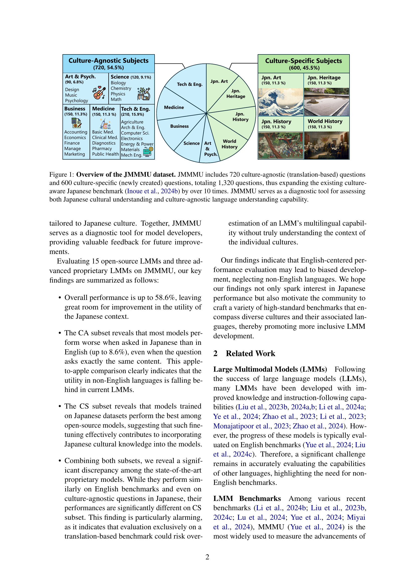
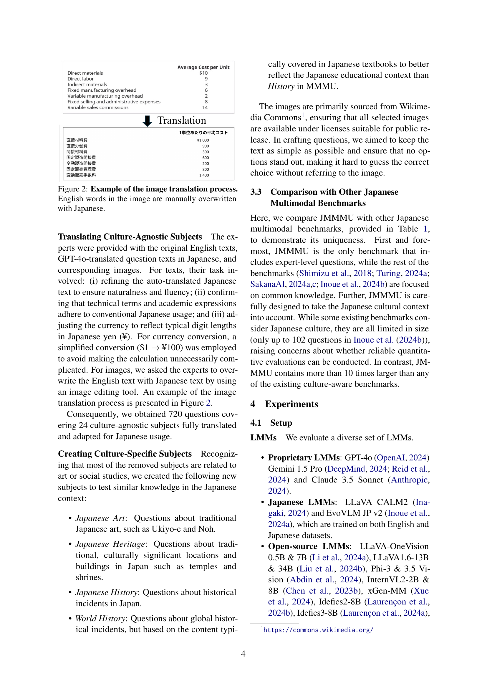
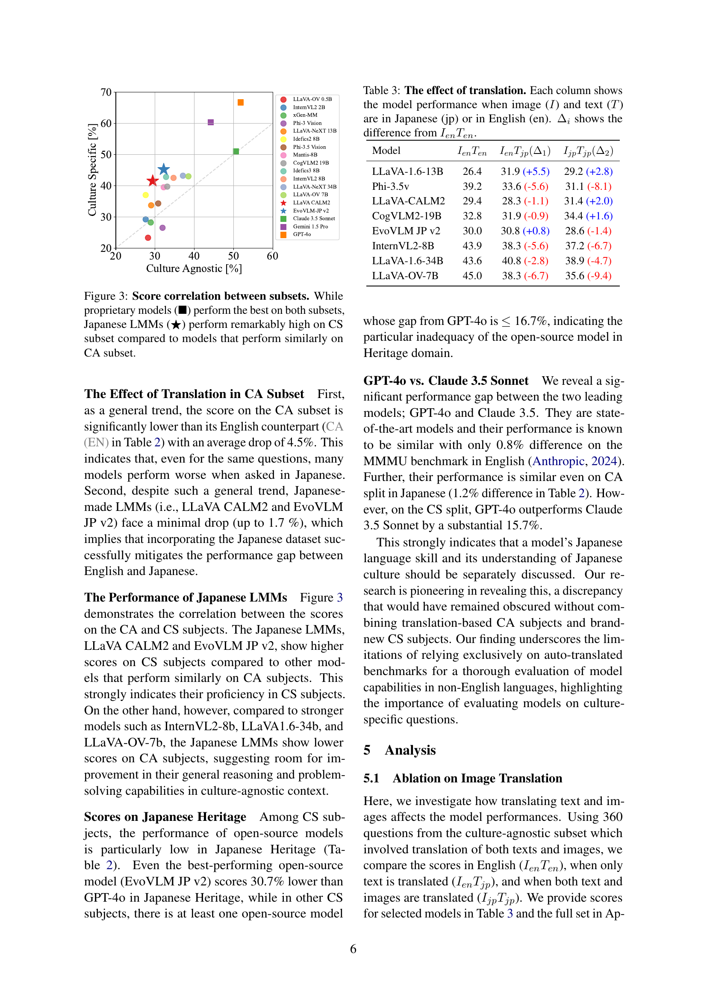
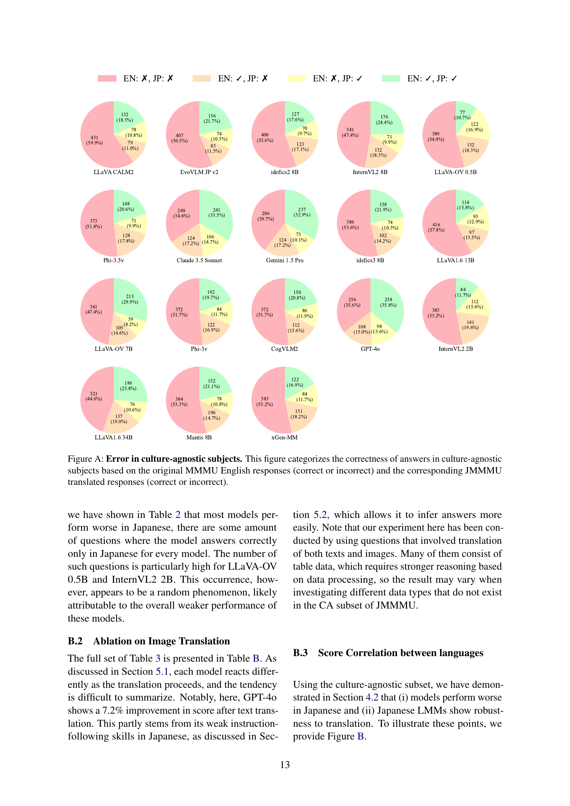
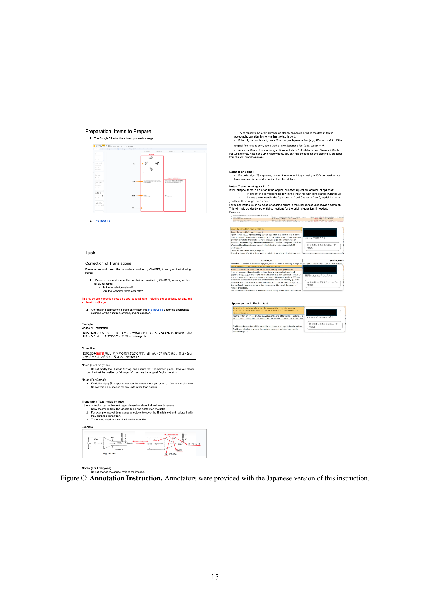
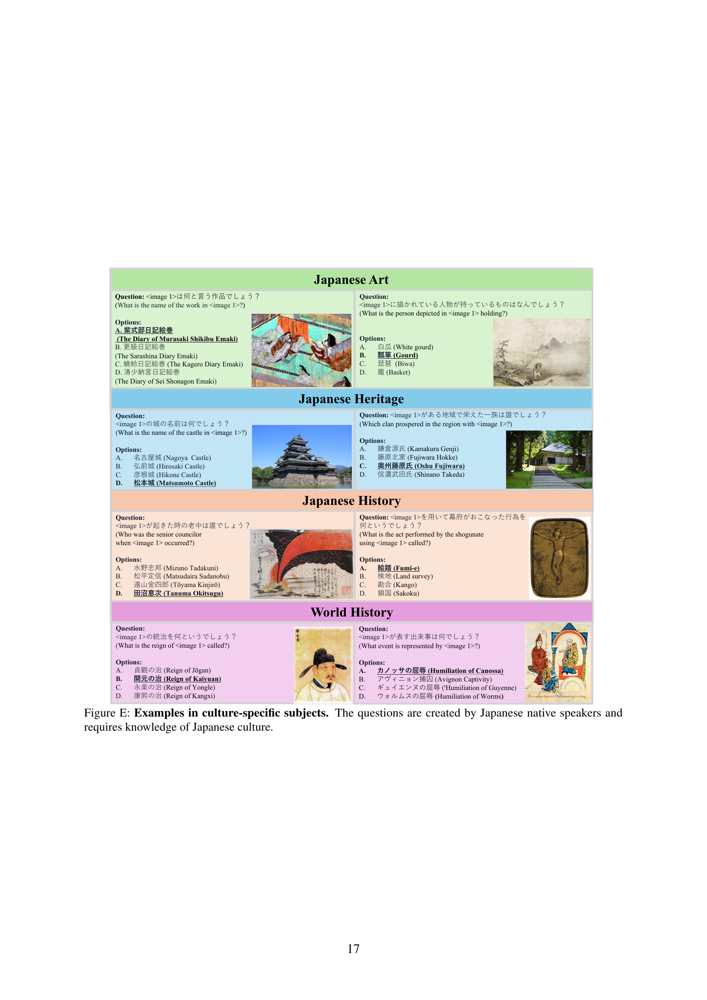

### TL;DR



The research introduces JMMMU, a comprehensive benchmark to evaluate large multimodal models' (LMMs) understanding of Japanese, incorporating both cultural and linguistic aspects.  It comprises a culture-agnostic subset (translated from English MMMU) and a culture-specific subset (uniquely Japanese).  Evaluating 18 LMMs, the study reveals substantial performance drops when evaluating in Japanese, even on translated content, showing limitations in pure language capabilities. The culture-specific subset further uncovers inadequate cultural understanding.  JMMMU serves as a tool for improving LMMs in Japanese and developing more culturally inclusive benchmarks for other languages.




 &nbsp; read the paper on arXiv


#### Why does it matter?
This JSON summarizes the research paper on JMMMU, a new benchmark for evaluating large multimodal models (LMMs) in Japanese, focusing on cultural awareness. It highlights the key contributions, findings, and implications for researchers.
#### Key Takeaways


 JMMMU is the first large-scale Japanese benchmark designed for culture-aware evaluation of LMMs. 



 Performance on JMMMU's culture-specific subset reveals significant gaps in LMMs' cultural understanding, highlighting limitations of existing benchmarks. 



 The benchmark exposes the insufficient depth in cultural understanding of LMMs that perform well on culture-agnostic tasks, suggesting more comprehensive evaluation is needed. 


------
#### Visual Insights

 questions and 600 culture-specific (newly created) questions, totaling 1,320 questions, thus expanding the existing culture-aware Japanese benchmark (Inoue et al., 2024b) by over 10 times. JMMMU serves as a diagnostic tool for assessing both Japanese cultural understanding and culture-agnostic language understanding capability.")

> The figure shows an overview of the JMMMU dataset, illustrating the number of questions, images, and subjects included in the culture-agnostic and culture-specific subsets.

 perform the best on both subsets, Japanese LMMs (★) perform remarkably high on CS subset compared to models that perform similarly on CA subset.")

> The chart shows the correlation between the performance of various large multimodal models on culture-agnostic and culture-specific subsets of a Japanese benchmark, revealing that Japanese models perform particularly well on the culture-specific subset.


<table id='6' style='font-size:14px'><tr><td>Benchmark</td><td>Culture</td><td>Level</td><td>Questions</td><td>Images</td></tr><tr><td>JA-VG-VQA-500 (SakanaAI, 2024b)</td><td></td><td>Common sense</td><td>500</td><td>500</td></tr><tr><td>LLaVA-Bench-in-the-wild (Turing, 2024b)</td><td></td><td>Common sense</td><td>60</td><td>24</td></tr><tr><td>JA-Multi-Image-VQA (SakanaAI, 2024a)</td><td></td><td>Common sense</td><td>55</td><td>39</td></tr><tr><td>JA-VLM-Bench-in-the-wild (SakanaAI, 2024c)</td><td></td><td>Common sense</td><td>50</td><td>42</td></tr><tr><td>Heron Bench (Inoue et al., 2024b)</td><td></td><td>Common sense</td><td>102</td><td>21</td></tr><tr><td>JMMMU (Ours)</td><td></td><td>Expert</td><td>1,320</td><td>1,118</td></tr></table>

> Table 1 compares various Japanese LMM benchmarks based on their cultural focus, evaluation level, number of questions, and images.

### More visual insights

More on figures

 questions and 600 culture-specific (newly created) questions, totaling 1,320 questions, thus expanding the existing culture-aware Japanese benchmark (Inoue et al., 2024b) by over 10 times. JMMMU serves as a diagnostic tool for assessing both Japanese cultural understanding and culture-agnostic language understanding capability.")

> The figure shows a pie chart illustrating the distribution of questions across various subjects in the JMMMU dataset, categorized into culture-agnostic and culture-specific subsets.

 questions and 600 culture-specific (newly created) questions, totaling 1,320 questions, thus expanding the existing culture-aware Japanese benchmark (Inoue et al., 2024b) by over 10 times. JMMMU serves as a diagnostic tool for assessing both Japanese cultural understanding and culture-agnostic language understanding capability.")

> The figure shows an overview of the JMMMU dataset, illustrating the composition of culture-agnostic and culture-specific questions and their distribution across various subjects.

 questions and 600 culture-specific (newly created) questions, totaling 1,320 questions, thus expanding the existing culture-aware Japanese benchmark (Inoue et al., 2024b) by over 10 times. JMMMU serves as a diagnostic tool for assessing both Japanese cultural understanding and culture-agnostic language understanding capability.")

> The figure shows an overview of the JMMMU dataset, detailing its composition of culture-agnostic and culture-specific questions and the number of questions and images.

 questions and 600 culture-specific (newly created) questions, totaling 1,320 questions, thus expanding the existing culture-aware Japanese benchmark (Inoue et al., 2024b) by over 10 times. JMMMU serves as a diagnostic tool for assessing both Japanese cultural understanding and culture-agnostic language understanding capability.")

> The figure shows a breakdown of the JMMMU dataset, illustrating the number of questions and images in culture-agnostic and culture-specific subsets, and highlighting the subjects covered.

 questions and 600 culture-specific (newly created) questions, totaling 1,320 questions, thus expanding the existing culture-aware Japanese benchmark (Inoue et al., 2024b) by over 10 times. JMMMU serves as a diagnostic tool for assessing both Japanese cultural understanding and culture-agnostic language understanding capability.")

> The figure shows a breakdown of the JMMMU dataset, illustrating the number of questions and images included in its culture-agnostic and culture-specific subsets, and highlighting its size and scope compared to existing benchmarks.

 questions and 600 culture-specific (newly created) questions, totaling 1,320 questions, thus expanding the existing culture-aware Japanese benchmark (Inoue et al., 2024b) by over 10 times. JMMMU serves as a diagnostic tool for assessing both Japanese cultural understanding and culture-agnostic language understanding capability.")

> The figure shows a breakdown of the JMMMU dataset, illustrating the number of questions and images in its culture-agnostic and culture-specific subsets, and highlighting its composition across various disciplines.

 questions and 600 culture-specific (newly created) questions, totaling 1,320 questions, thus expanding the existing culture-aware Japanese benchmark (Inoue et al., 2024b) by over 10 times. JMMMU serves as a diagnostic tool for assessing both Japanese cultural understanding and culture-agnostic language understanding capability.")

> The figure shows the overview of the JMMMU dataset, which includes 720 culture-agnostic and 600 culture-specific questions, totaling 1320 questions across various subjects, expanding on existing benchmarks.

 questions and 600 culture-specific (newly created) questions, totaling 1,320 questions, thus expanding the existing culture-aware Japanese benchmark (Inoue et al., 2024b) by over 10 times. JMMMU serves as a diagnostic tool for assessing both Japanese cultural understanding and culture-agnostic language understanding capability.")

> The figure shows a breakdown of the JMMMU dataset, illustrating the number of questions and images in culture-agnostic and culture-specific subsets, and highlighting its expansion compared to existing benchmarks.

 questions and 600 culture-specific (newly created) questions, totaling 1,320 questions, thus expanding the existing culture-aware Japanese benchmark (Inoue et al., 2024b) by over 10 times. JMMMU serves as a diagnostic tool for assessing both Japanese cultural understanding and culture-agnostic language understanding capability.")

> The figure shows a breakdown of the JMMMU dataset, illustrating its composition of culture-agnostic and culture-specific questions across various subject categories.

 questions and 600 culture-specific (newly created) questions, totaling 1,320 questions, thus expanding the existing culture-aware Japanese benchmark (Inoue et al., 2024b) by over 10 times. JMMMU serves as a diagnostic tool for assessing both Japanese cultural understanding and culture-agnostic language understanding capability.")

> The figure shows a visual overview of the JMMMU dataset, illustrating the number of questions, image, and subjects included in both the culture-agnostic and culture-specific subsets.

 perform the best on both subsets, Japanese LMMs (★) perform remarkably high on CS subset compared to models that perform similarly on CA subset.")

> The figure shows the correlation between the performance of Large Multimodal Models (LMMs) on culture-agnostic and culture-specific subsets of a Japanese benchmark.

 questions and 600 culture-specific (newly created) questions, totaling 1,320 questions, thus expanding the existing culture-aware Japanese benchmark (Inoue et al., 2024b) by over 10 times. JMMMU serves as a diagnostic tool for assessing both Japanese cultural understanding and culture-agnostic language understanding capability.")

> The figure shows an overview of the JMMMU dataset, which includes culture-agnostic and culture-specific questions and images to evaluate large multimodal models on Japanese cultural understanding and language capabilities.

 questions and 600 culture-specific (newly created) questions, totaling 1,320 questions, thus expanding the existing culture-aware Japanese benchmark (Inoue et al., 2024b) by over 10 times. JMMMU serves as a diagnostic tool for assessing both Japanese cultural understanding and culture-agnostic language understanding capability.")

> The figure shows the composition of the JMMMU dataset, detailing the number of questions, image count, and the breakdown into culture-agnostic and culture-specific subsets.

 questions and 600 culture-specific (newly created) questions, totaling 1,320 questions, thus expanding the existing culture-aware Japanese benchmark (Inoue et al., 2024b) by over 10 times. JMMMU serves as a diagnostic tool for assessing both Japanese cultural understanding and culture-agnostic language understanding capability.")

> The figure shows an overview of the JMMMU dataset, illustrating the distribution of culture-agnostic and culture-specific questions across various subjects.

 questions and 600 culture-specific (newly created) questions, totaling 1,320 questions, thus expanding the existing culture-aware Japanese benchmark (Inoue et al., 2024b) by over 10 times. JMMMU serves as a diagnostic tool for assessing both Japanese cultural understanding and culture-agnostic language understanding capability.")

> The figure shows an overview of the JMMMU dataset, illustrating the number of questions, images, and the breakdown between culture-agnostic and culture-specific subjects.

 questions and 600 culture-specific (newly created) questions, totaling 1,320 questions, thus expanding the existing culture-aware Japanese benchmark (Inoue et al., 2024b) by over 10 times. JMMMU serves as a diagnostic tool for assessing both Japanese cultural understanding and culture-agnostic language understanding capability.")

> The figure shows an overview of the JMMMU dataset, illustrating its composition of culture-agnostic and culture-specific questions and the subjects covered.

 questions and 600 culture-specific (newly created) questions, totaling 1,320 questions, thus expanding the existing culture-aware Japanese benchmark (Inoue et al., 2024b) by over 10 times. JMMMU serves as a diagnostic tool for assessing both Japanese cultural understanding and culture-agnostic language understanding capability.")

> The figure shows an overview of the JMMMU dataset, illustrating its composition of culture-agnostic and culture-specific questions and the overall number of questions and images.

 questions and 600 culture-specific (newly created) questions, totaling 1,320 questions, thus expanding the existing culture-aware Japanese benchmark (Inoue et al., 2024b) by over 10 times. JMMMU serves as a diagnostic tool for assessing both Japanese cultural understanding and culture-agnostic language understanding capability.")

> The figure shows an overview of the JMMMU dataset, illustrating its composition of culture-agnostic and culture-specific questions, totaling 1320 questions across various subjects.

 questions and 600 culture-specific (newly created) questions, totaling 1,320 questions, thus expanding the existing culture-aware Japanese benchmark (Inoue et al., 2024b) by over 10 times. JMMMU serves as a diagnostic tool for assessing both Japanese cultural understanding and culture-agnostic language understanding capability.")

> The figure shows a breakdown of the JMMMU dataset, illustrating the number of questions and images included in the culture-agnostic and culture-specific subsets.

> The figure shows example questions from the culture-specific subset of the JMMMU benchmark, highlighting the cultural knowledge required to answer them.

 Lack of Knowledge, where the model does not know the necessary information; (b) Image Recognition Errors, where the model fails to correctly interpret the image; (c) Answer Rejection, where the model rejects to answer; and (d) Textual Misunderstanding, where the response is not aligned with the question.")

> Figure 6 shows four examples of GPT-40's errors in JMMMU, categorized by error type: lack of knowledge, image recognition error, answer rejection, and textual misunderstanding.

More on charts

> The chart shows the distribution of error types in GPT-40's responses to culture-specific questions, with the majority (53.8%) being due to a lack of knowledge.

 perform the best on both subsets, Japanese LMMs (★) perform remarkably high on CS subset compared to models that perform similarly on CA subset.")

> The chart shows the correlation between the performance of various Large Multimodal Models (LMMs) on culture-agnostic and culture-specific subsets of a Japanese benchmark, highlighting the superior performance of Japanese LMMs on culture-specific tasks.

More on tables


<table id='1' style='font-size:14px'><tr><td>Models</td><td>Overall (1,320)</td><td>CS (600)</td><td>CA (720)</td><td>CA (EN) (720)</td><td>Jpn. Art (150)</td><td>Jpn. Heritage (150)</td><td>Jpn. History (150)</td><td>World History (150)</td><td>Art & Psych. (90)</td><td>Business (150)</td><td>Science (120)</td><td>Health & Medicine (150)</td><td>Tech & Eng. (210)</td></tr><tr><td>Random</td><td>24.8</td><td>25.0</td><td>24.6</td><td>24.6</td><td>25.0</td><td>25.0</td><td>25.0</td><td>25.0</td><td>25.4</td><td>25.0</td><td>22.8</td><td>25.6</td><td>24.3</td></tr><tr><td>Open Source</td><td></td><td></td><td></td><td></td><td></td><td></td><td></td><td></td><td></td><td></td><td></td><td></td><td></td></tr><tr><td>LLa VA-OV-0.5B</td><td>26.0</td><td>23.3</td><td>28.2</td><td>29.4</td><td>22.7</td><td>22.7</td><td>24.0</td><td>24.0</td><td>26.7</td><td>27.3</td><td>24.2</td><td>30.7</td><td>30.0</td></tr><tr><td>Intern VL2-2B</td><td>28.3</td><td>29.2</td><td>27.6</td><td>31.9</td><td>31.3</td><td>22.7</td><td>30.7</td><td>32.0</td><td>30.0</td><td>30.0</td><td>30.8</td><td>25.3</td><td>24.8</td></tr><tr><td>xGen-MM</td><td>28.6</td><td>28.2</td><td>28.9</td><td>35.7</td><td>30.0</td><td>20.7</td><td>22.7</td><td>39.3</td><td>32.2</td><td>21.3</td><td>22.5</td><td>36.7</td><td>31.0</td></tr><tr><td>Phi-3v</td><td>29.5</td><td>26.5</td><td>31.9</td><td>37.6</td><td>31.3</td><td>18.7</td><td>29.3</td><td>26.7</td><td>26.7</td><td>28.7</td><td>25.8</td><td>37.3</td><td>36.2</td></tr><tr><td>LLaVA-1.6-13B</td><td>31.1</td><td>33.7</td><td>29.0</td><td>29.9</td><td>32.0</td><td>24.0</td><td>32.0</td><td>46.7</td><td>25.6</td><td>28.7</td><td>30.0</td><td>34.0</td><td>26.7</td></tr><tr><td>Idefics2-8B</td><td>31.9</td><td>37.0</td><td>27.6</td><td>35.1</td><td>40.7</td><td>24.0</td><td>30.0</td><td>53.3</td><td>32.2</td><td>22.7</td><td>22.5</td><td>32.0</td><td>29.0</td></tr><tr><td>Phi-3.5v</td><td>32.4</td><td>34.3</td><td>30.8</td><td>39.2</td><td>37.3</td><td>27.3</td><td>35.3</td><td>37.3</td><td>27.8</td><td>31.3</td><td>30.0</td><td>36.7</td><td>28.1</td></tr><tr><td>†LLaVA CALM2</td><td>34.9</td><td>41.5</td><td>29.4</td><td>29.9</td><td>42.7</td><td>36.7</td><td>40.0</td><td>46.7</td><td>27.8</td><td>26.0</td><td>26.7</td><td>34.0</td><td>31.0</td></tr><tr><td>Mantis 8B</td><td>35.5</td><td>39.5</td><td>32.2</td><td>36.0</td><td>42.0</td><td>30.0</td><td>35.3</td><td>50.7</td><td>37.8</td><td>28.0</td><td>31.7</td><td>37.3</td><td>29.5</td></tr><tr><td>CogVLM2-19B</td><td>36.1</td><td>39.7</td><td>33.1</td><td>36.8</td><td>39.3</td><td>24.0</td><td>36.0</td><td>59.3</td><td>28.9</td><td>32.7</td><td>30.8</td><td>30.0</td><td>38.6</td></tr><tr><td>Idefics3-8B</td><td>37.3</td><td>42.8</td><td>32.8</td><td>36.9</td><td>43.3</td><td>24.7</td><td>42.0</td><td>61.3</td><td>34.4</td><td>28.0</td><td>26.7</td><td>38.0</td><td>35.2</td></tr><tr><td>†EvoVLM JP v2</td><td>38.1</td><td>45.2</td><td>32.2</td><td>33.9</td><td>44.0</td><td>40.0</td><td>42.0</td><td>54.7</td><td>32.2</td><td>28.7</td><td>28.3</td><td>38.7</td><td>32.4</td></tr><tr><td>Intern VL2-8B</td><td>38.3</td><td>42.5</td><td>34.7</td><td>43.3</td><td>41.3</td><td>38.0</td><td>35.3</td><td>55.3</td><td>40.0</td><td>36.0</td><td>34.2</td><td>34.0</td><td>32.4</td></tr><tr><td>LLaVA-1.6-34B</td><td>39.8</td><td>43.2</td><td>37.1</td><td>45.7</td><td>42.0</td><td>36.0</td><td>40.7</td><td>54.0</td><td>42.2</td><td>41.3</td><td>25.0</td><td>36.7</td><td>39.0</td></tr><tr><td>LLaVA-OV-7B</td><td>40.5</td><td>43.0</td><td>38.5</td><td>45.1</td><td>36.0</td><td>30.7</td><td>37.3 -</td><td>68.0</td><td>41.1</td><td>36.7 -</td><td>31.7</td><td>38.7</td><td>42.4</td></tr><tr><td>Proprietary</td><td></td><td></td><td></td><td></td><td></td><td></td><td></td><td></td><td></td><td></td><td></td><td></td><td></td></tr><tr><td>Claude 3.5 Sonnet</td><td>50.8</td><td>51.0</td><td>50.6</td><td>52.1</td><td>39.3</td><td>46.7</td><td>54.7</td><td>63.3</td><td>53.3</td><td>56.7</td><td>51.7</td><td>55.3</td><td>41.0</td></tr><tr><td>Gemini 1.5 Pro</td><td>51.5</td><td>60.3</td><td>44.2</td><td>51.1</td><td>54.7</td><td>55.3</td><td>55.3</td><td>76.0</td><td>51.1</td><td>44.0</td><td>44.2</td><td>48.0</td><td>38.6</td></tr><tr><td>GPT-4o</td><td>58.6</td><td>66.7</td><td>51.8</td><td>52.1</td><td>60.7</td><td>70.7</td><td>58.7</td><td>76.7</td><td>53.3</td><td>55.3</td><td>45.8</td><td>61.3</td><td>45.2</td></tr><tr><td>Text Only</td><td></td><td></td><td></td><td></td><td></td><td></td><td></td><td></td><td></td><td></td><td></td><td></td><td></td></tr><tr><td>GPT-4o text</td><td>38.1</td><td>35.5</td><td>40.3</td><td>44.9</td><td>32.7</td><td>32.0</td><td>35.3</td><td>42.0</td><td>38.9</td><td>36.0</td><td>41.7</td><td>45.3</td><td>39.5</td></tr></table>

> Table 2 presents the overall performance of various large multimodal models (LMMs) on the JMMMU benchmark, broken down by model type, subset (culture-agnostic and culture-specific), and individual subject areas, showing the overall performance and highlighting the best-performing models.


 <table id='6' style='font-size:14px'><tr><td>Model</td><td>IenTen</td><td>IenTjp(△1)</td><td>IjpTjp(△2)</td></tr><tr><td>LLaVA-1.6-13B</td><td>26.4</td><td>31.9 (+5.5)</td><td>29.2 (+2.8)</td></tr><tr><td>Phi-3.5v</td><td>39.2</td><td>33.6 (-5.6)</td><td>31.1 (-8.1)</td></tr><tr><td>LLaVA-CALM2</td><td>29.4</td><td>28.3 (-1.1)</td><td>31.4 (+2.0)</td></tr><tr><td>CogVLM2-19B</td><td>32.8</td><td>31.9 (-0.9)</td><td>34.4 (+1.6)</td></tr><tr><td>EvoVLM JP v2</td><td>30.0</td><td>30.8 (+0.8)</td><td>28.6 (-1.4)</td></tr><tr><td>Intern VL2-8B</td><td>43.9</td><td>38.3 (-5.6)</td><td>37.2 (-6.7)</td></tr><tr><td>LLaVA-1.6-34B</td><td>43.6</td><td>40.8 (-2.8)</td><td>38.9 (-4.7)</td></tr><tr><td>LLaVA-OV-7B</td><td>45.0</td><td>38.3 (-6.7)</td><td>35.6 (-9.4)</td></tr></table>

> Table 3 shows the impact of translating image and text on the performance of various LLMs in a culture-agnostic subset of the JMMMU benchmark.


<table id='11' style='font-size:14px'><tr><td></td><td>JMMMU</td><td></td><td colspan="2">Japanese support</td></tr><tr><td>Model</td><td>Overall</td><td>Base LLM</td><td>LLM</td><td>LMM</td></tr><tr><td>Open Source</td><td></td><td></td><td></td><td></td></tr><tr><td>xGen-MM</td><td>28.6</td><td>Phi-3</td><td>X</td><td>X</td></tr><tr><td>Mantis 8B</td><td>35.5</td><td>Llama 3</td><td>X</td><td>X</td></tr><tr><td>Idefics2-8B</td><td>31.9</td><td>Mistral v0.1</td><td>?</td><td>X</td></tr><tr><td>Idefics3-8B</td><td>37.3</td><td>Llama 3</td><td>X</td><td>X</td></tr><tr><td>CogVLM2-19B</td><td>36.1</td><td>Llama 3</td><td>X</td><td>X</td></tr><tr><td>InternVL2-2B</td><td>28.3</td><td>InternLM2</td><td>X</td><td>X</td></tr><tr><td>InternVL2-8B</td><td>38.3</td><td>InternLM2</td><td>X</td><td>X</td></tr><tr><td>LLaVA-1.6 13B</td><td>31.1</td><td>Vicuna v1.5</td><td>X</td><td>X</td></tr><tr><td>LLaVA-1.6 34B</td><td>39.8</td><td>Nous Hermes 2 Yi</td><td>X</td><td>X</td></tr><tr><td>LLaVA-OneVision 0.5B</td><td>26.0</td><td>Qwen2</td><td></td><td>X</td></tr><tr><td>LLaVA-OneVision 7B</td><td>40.5</td><td>Qwen2</td><td></td><td>X</td></tr><tr><td>Phi-3 Vision</td><td>29.5</td><td>Phi-3</td><td>X</td><td>X</td></tr><tr><td>Phi-3.5 Vision</td><td>32.4</td><td>Phi-3.5</td><td></td><td>X</td></tr><tr><td>†LLaVA CALM2</td><td>34.9</td><td>CALM2</td><td></td><td>V</td></tr><tr><td>†EvoVLM JP v2</td><td>38.1</td><td>(merged model) -</td><td></td><td></td></tr><tr><td>Closed Source</td><td></td><td></td><td></td><td></td></tr><tr><td>Claude 3.5 Sonnet</td><td>50.8</td><td>?</td><td>?</td><td>V</td></tr><tr><td>Gemini 1.5 Pro</td><td>51.5</td><td>?</td><td>?</td><td>V</td></tr><tr><td>GPT-4o</td><td>58.6</td><td>?</td><td>?</td><td></td></tr></table>

> Table A summarizes whether each large multimodal model (LMM) officially supports Japanese, indicating official support with a checkmark and lack of support with an X.


 <table id='1' style='font-size:14px'><tr><td></td><td>IenTen</td><td>IenTjp(△1)</td><td>IjpTjp(△2)</td></tr><tr><td>Open source</td><td></td><td></td><td></td></tr><tr><td>LLaVA-OV-0.5B</td><td>28.9</td><td>28.9 (±0.0)</td><td>29.7 (+0.8)</td></tr><tr><td>Intern VL2-2B</td><td>32.5</td><td>29.7 (-2.8)</td><td>28.6 (-3.9)</td></tr><tr><td>xGen-MM</td><td>36.7</td><td>28.3 (-8.4)</td><td>28.3 (-8.4)</td></tr><tr><td>Phi-3v</td><td>35.0</td><td>31.7 (-3.3)</td><td>29.7 (-5.3)</td></tr><tr><td>LLaVA-1.6-13B</td><td>26.4</td><td>31.9 (+5.5)</td><td>29.2 (+2.8)</td></tr><tr><td>Idefics2-8b</td><td>28.9</td><td>28.1 (-0.8)</td><td>28.1 (-0.8)</td></tr><tr><td>Phi-3.5v</td><td>39.2</td><td>33.6 (-5.6)</td><td>31.1 (-8.1)</td></tr><tr><td>†LLaVA-CALM2</td><td>29.4</td><td>28.3 (-1.1)</td><td>31.4 (+2.0)</td></tr><tr><td>Mantis 8B</td><td>32.5</td><td>31.1 (-1.4)</td><td>31.4 (-1.1)</td></tr><tr><td>CogVLM2-19B</td><td>32.8</td><td>31.9 (-0.9)</td><td>34.4 (+1.6)</td></tr><tr><td>Idefics3-8b</td><td>33.1</td><td>31.7 (-1.4)</td><td>29.7 (-3.4)</td></tr><tr><td>†EvoVLM JP v2</td><td>30.0</td><td>30.8 (+0.8)</td><td>28.6 (-1.4)</td></tr><tr><td>Intern VL2-8B</td><td>43.9</td><td>38.3 (-5.6)</td><td>37.2 (-6.7)</td></tr><tr><td>LLaVA-1.6-34B</td><td>43.6</td><td>40.8 (-2.8)</td><td>38.9 (-4.7)</td></tr><tr><td>LLaVA-OV-7B</td><td>45.0</td><td>38.3 (-6.7)</td><td>35.6 (-9.4)</td></tr><tr><td>Proprietary</td><td></td><td></td><td></td></tr><tr><td>Claude 3.5 Sonnet</td><td>53.6</td><td>56.4 (+2.8)</td><td>54.2 (+0.6)</td></tr><tr><td>Gemini1.5Pro</td><td>50.6</td><td>42.2 (-8.4)</td><td>42.2 (-8.4)</td></tr><tr><td>GPT-4o</td><td>48.1</td><td>55.3 (+7.2)</td><td>53.1 (+5.0)</td></tr></table>

> Table 2 presents the overall performance of various LLMs on the JMMMU benchmark, broken down by model type, subset (culture-agnostic and culture-specific), and individual subject areas, showing the average and best performing models.


 <table id='33' style='font-size:18px'><tr><td>A.</td><td>オペラント条件付け (Operant conditioning)</td></tr><tr><td>B.</td><td>古典的条件付け (Classical conditioning)</td></tr><tr><td>C.</td><td>準備された条件付け (Prepared conditioning)</td></tr><tr><td>D.</td><td>自己実現 (Self-actualization)</td></tr><tr><td>E.</td><td>観察学習 (Observational learning)</td></tr></table>

> Table 1 compares various Japanese LMM benchmarks across different aspects such as culture focus, knowledge level, and the number of questions and images.


<table id='40' style='font-size:14px'><tr><td colspan="2">on the stock market in 1932?) Options:</td><td>年度</td><td>インフレ率, %</td><td>株式市場の収益率, %</td><td>T-Bill 収益, %</td></tr><tr><td></td><td></td><td>1929</td><td>-0.2</td><td>-14.5</td><td>4.8</td></tr><tr><td>A.</td><td>-14.33%</td><td>1930</td><td>-6.0</td><td>-28.3</td><td>2.4</td></tr><tr><td>B.</td><td>-23.72%</td><td>1931</td><td>-9.5</td><td>-43.9</td><td>1.1</td></tr><tr><td>C.</td><td>0.45%</td><td>1932</td><td>-10.3</td><td>-9.9</td><td>1.0</td></tr><tr><td>D.</td><td>56.52%</td><td>1933</td><td>0.5</td><td>57.3</td><td>0.3</td></tr></table>

> Table 2 presents the overall performance of various Large Multimodal Models (LMMs) on the JMMMU benchmark, broken down by model type, subset (culture-agnostic or culture-specific), and individual subject area.


<table id='51' style='font-size:16px'><tr><td>A.</td><td>行列の通常の走査 (Normal traversal of the matrix.)</td><td>行列 : 1→ 2→③→4</td></tr><tr><td></td><td>行列の行ごとの走査 (Row-wise traversal of the matrix.)</td><td>5 →6→I ↑ 早 10←11</td></tr><tr><td></td><td>行列の列ごとの走査 (Column-wise traversal of the matrix.)</td><td>13←14← 15←16</td></tr><tr><td></td><td>行列のスパイ ラル走査 (spiral traversal of the matrix.)</td><td>出力 : 1,2,3,4,8,12,16,15,14,13,9,9,5,6, 7,11, 10</td></tr></table>

> This table summarizes whether each large multimodal model (LMM) officially supports Japanese.

### Full paper



