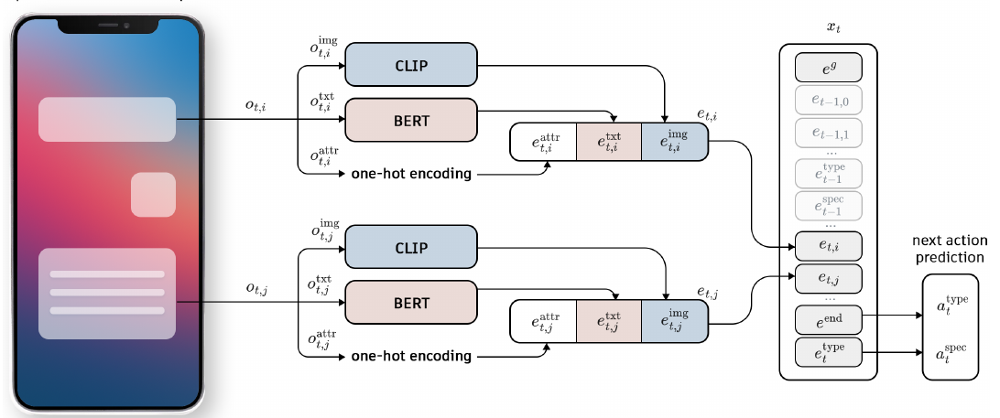
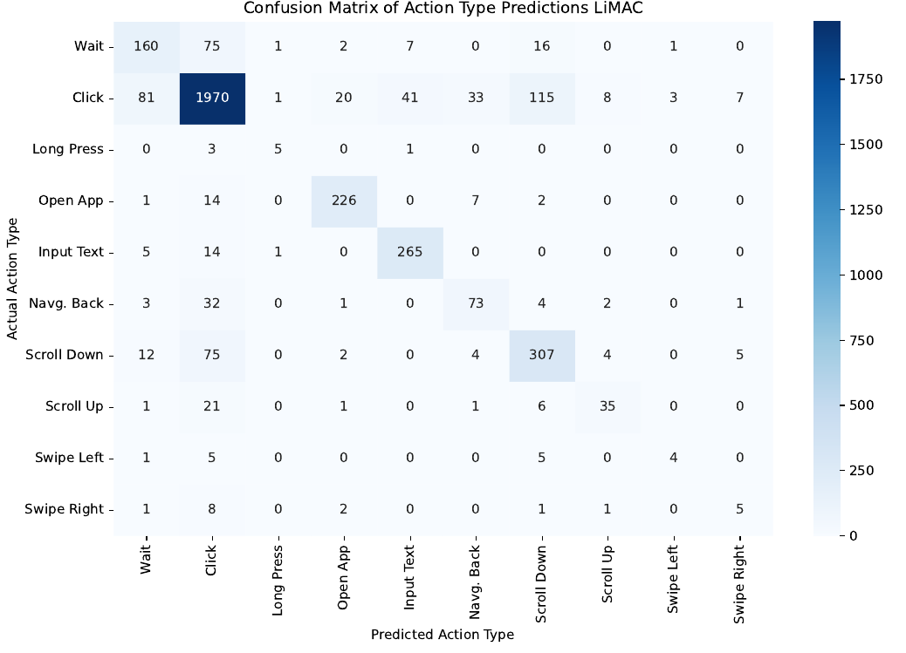
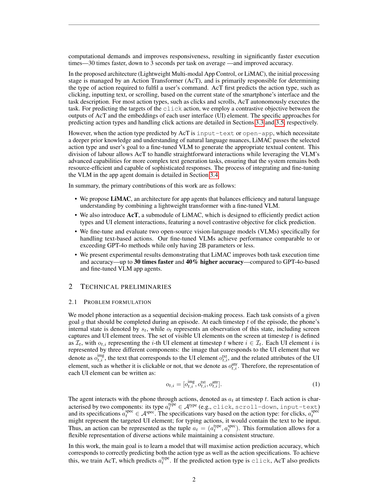
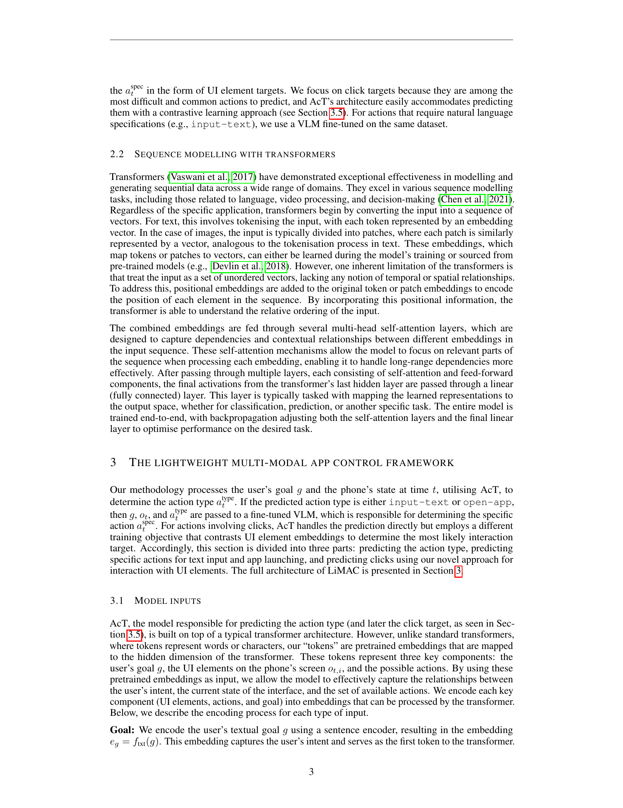
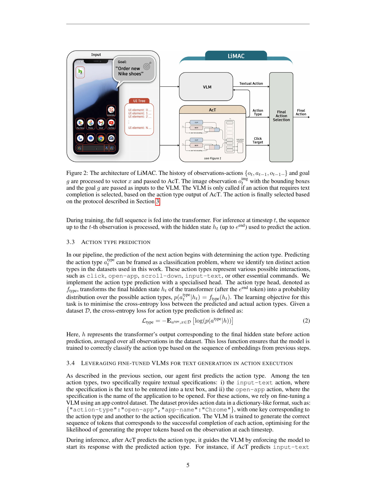
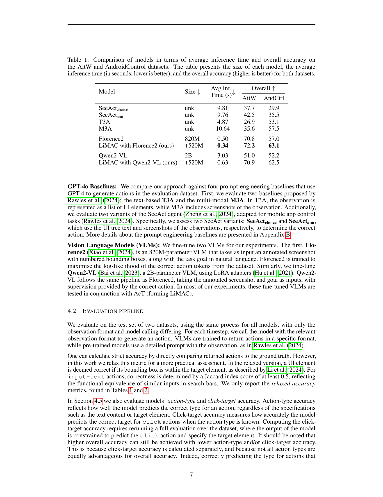
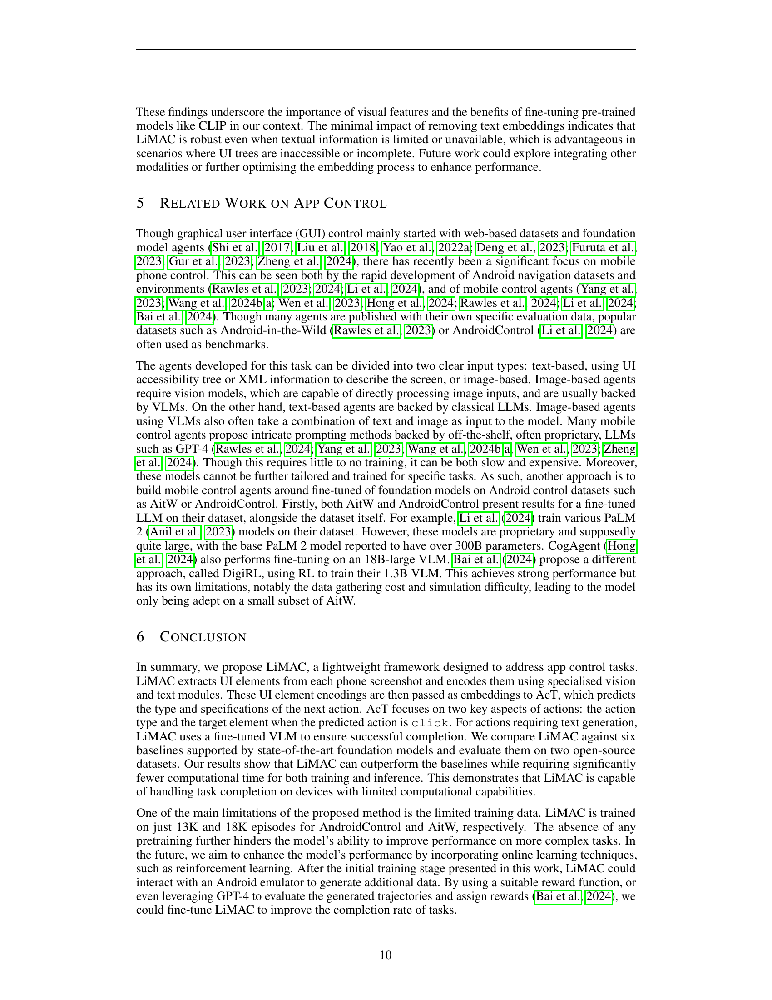
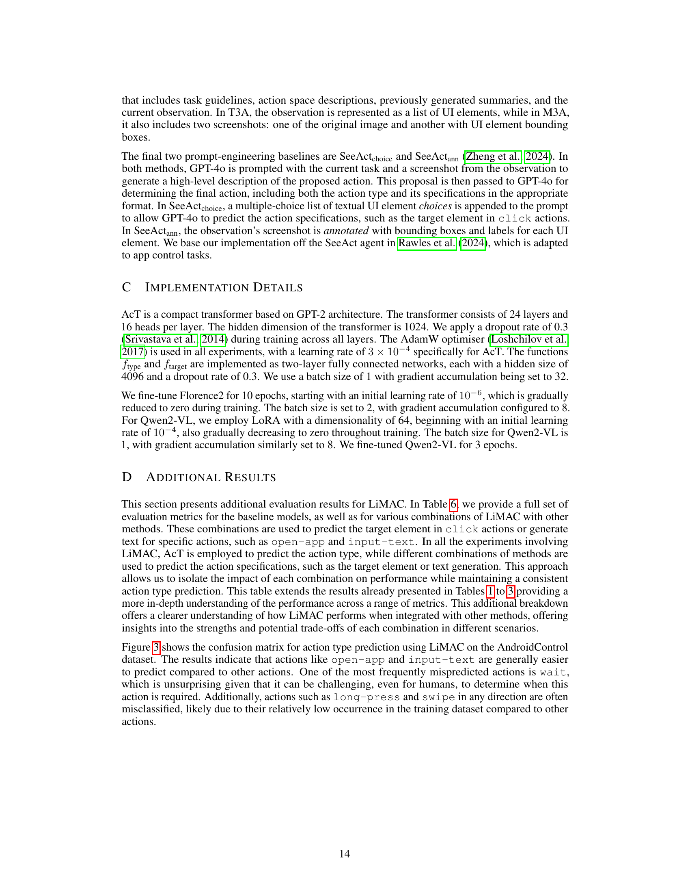

### TL;DR



This paper presents LiMAC, a new system for controlling Android apps using natural language instructions.  Instead of relying on large, slow language models, LiMAC uses a smaller, faster Action Transformer (AcT) combined with a vision-language model (VLM). The AcT handles simple actions like clicking and scrolling, while the VLM is used for more complex tasks requiring language understanding (like writing a text message).  Testing showed LiMAC is much faster (up to 30 times) and more accurate (up to 42% improvement) than using larger language models alone.  This is important because smartphones have limited computing power, making large models impractical for many tasks.  The researchers used two open-source datasets for testing and compared LiMAC's performance to several other methods, showcasing its superior efficiency and accuracy.




 &nbsp; read the paper on arXiv


#### Why does it matter?
This research paper introduces LiMAC, a lightweight, efficient mobile phone control architecture that uses a combination of a small Action Transformer (AcT) and a vision-language model (VLM) to improve accuracy and speed in app control.
#### Key Takeaways


 LiMAC significantly improves accuracy and speed of mobile app control compared to existing methods. 



 LiMAC's hybrid Action Transformer (AcT) and vision-language model (VLM) approach addresses the computational limitations of smartphones. 



 The research demonstrates LiMAC's effectiveness across various Android apps, showcasing its potential for real-world application. 


------
#### Visual Insights

> The figure illustrates the Action Transformer (AcT) architecture, showing how it encodes UI elements, combines them with previous actions and goals, and predicts the next action.

> The chart visualizes the performance of LiMAC's action type prediction model by showing the counts of correctly and incorrectly predicted action types across different categories.


<table id='1' style='font-size:18px'><tr><td rowspan="2">Model</td><td rowspan="2">Size ↓</td><td rowspan="2">Avg Inf. (s)↓ Time</td><td colspan="2">Overall ↑</td></tr><tr><td>AitW</td><td>AndCtrl</td></tr><tr><td>SeeActchoice</td><td>unk</td><td>9.81</td><td>37.7</td><td>29.9</td></tr><tr><td>SeeActann</td><td>unk</td><td>9.76</td><td>42.5</td><td>35.5</td></tr><tr><td>T3A</td><td>unk</td><td>4.87</td><td>26.9</td><td>53.1</td></tr><tr><td>M3A</td><td>unk</td><td>10.64</td><td>35.6</td><td>57.5</td></tr><tr><td>Florence2</td><td>820M</td><td>0.50</td><td>70.8</td><td>57.0</td></tr><tr><td>LiMAC with Florence2 (ours)</td><td>+520M</td><td>0.34</td><td>72.2</td><td>63.1</td></tr><tr><td>Qwen2-VL</td><td>2B</td><td>3.03</td><td>51.0</td><td>52.2</td></tr><tr><td>LiMAC with Qwen2-VL (ours)</td><td>+520M</td><td>0.63</td><td>70.9</td><td>62.5</td></tr></table>

> Table 1 compares the performance of different models on two mobile app control datasets in terms of inference time and overall accuracy.

### More visual insights

More on figures

> The figure illustrates the LiMAC architecture, showing the interaction between the Action Transformer (AcT), the Vision-Language Model (VLM), and the input data (goal and observations).

 and failed action in red (final timestep). The target element of the click in timestep 3 is considered correct under our relaxed accuracy because its bounding box is almost identical to the correct element, and clicking either would have the same effect (opening the text bar). In the final timestep, the agent inputs text 'Detroit' rather than 'Las Vegas', a clear confusion between the origin and destination of the trip stated in the goal, leading to an incorrect prediction.")

> The figure shows an example of a successful episode with a relaxed target element and a failed action, highlighting the model's performance and areas for improvement.

 and overall successful episode. Timestep 4 is considered correct under our relaxed input-text textual component because it is simply the singular form of the correct text, leading to a Jaccard index greater than 0.5 and presumably the same search results. The episode terminates successfully, with all timesteps being considered correct under our evaluation metrics.")

> The figure shows a successful episode of a mobile phone control task, where the agent correctly interacts with various apps to complete a given goal, illustrating the relaxed accuracy metric for input-text actions.

More on tables


<table id='1' style='font-size:20px'><tr><td rowspan="2">Framework</td><td colspan="3">Modules Used</td><td rowspan="2">Avg Inf. ⓢ+ Time</td><td colspan="2">Overall↑</td></tr><tr><td>Type</td><td>Click</td><td>Text</td><td>AitW</td><td>AndCtrl</td></tr><tr><td>T3A only</td><td>T3A</td><td>T3A</td><td>T3A</td><td>4.87</td><td>26.9</td><td>53.1</td></tr><tr><td>LiMAC (ours)</td><td>AcT</td><td>T3A</td><td>T3A</td><td>4.03</td><td>42.7</td><td>65.4</td></tr><tr><td>LiMAC (ours)</td><td>AcT</td><td>AcT</td><td>T3A</td><td>1.04</td><td>69.8</td><td>63.2</td></tr><tr><td>M3A only</td><td>M3A</td><td>M3A</td><td>M3A</td><td>10.64</td><td>35.6</td><td>57.5</td></tr><tr><td>LiMAC (ours)</td><td>AcT</td><td>M3A</td><td>M3A</td><td>8.40</td><td>52.6</td><td>66.8</td></tr><tr><td>LiMAC (ours)</td><td>AcT</td><td>AcT</td><td>M3A</td><td>1.87</td><td>70.0</td><td>62.5</td></tr><tr><td>Florence only</td><td>Florence2</td><td>Florence2</td><td>Florence2</td><td>0.50</td><td>70.8</td><td>57.0</td></tr><tr><td>LiMAC (ours)</td><td>AcT</td><td>Florence2</td><td>Florence2</td><td>0.72</td><td>71.6</td><td>61.1</td></tr><tr><td>LiMAC (ours)</td><td>AcT</td><td>AcT</td><td>Florence2</td><td>0.34</td><td>72.2</td><td>63.1</td></tr><tr><td>Qwen only</td><td>Qwen2-VL</td><td>Qwen2-VL</td><td>Qwen2-VL</td><td>3.03</td><td>51.0</td><td>52.2</td></tr><tr><td>LiMAC (ours)</td><td>AcT</td><td>Qwen2-VL</td><td>Qwen2-VL</td><td>2.64</td><td>55.7</td><td>59.1</td></tr><tr><td>LiMAC (ours)</td><td>AcT</td><td>AcT</td><td>Qwen2-VL</td><td>0.63</td><td>70.9</td><td>62.5</td></tr><tr><td>LiMAC (ours)</td><td>AcT</td><td>M3A</td><td>T3A</td><td>7.57</td><td>52.4</td><td>67.4</td></tr></table>

> Table 1 compares different models' average inference time and overall accuracy on two mobile phone control datasets.


<table id='1' style='font-size:14px'><tr><td rowspan="2">Framework</td><td colspan="3">Modules Used</td><td colspan="2">Action Type</td><td colspan="2">Click Target</td><td colspan="2">Text</td></tr><tr><td>Type</td><td>Click</td><td>Text</td><td>AitW</td><td>AndCtrl</td><td>AitW</td><td>AndCtrl</td><td>AitW</td><td>AndCtrl</td></tr><tr><td>SeeAct only</td><td>SeeActchoice</td><td>SeeActchoice</td><td>SeeActchoice</td><td>67.1</td><td>66.8</td><td>36.9</td><td>48.5</td><td>69.4</td><td>67.1</td></tr><tr><td>SeeAct only</td><td>SeeActann</td><td>SeeActann</td><td>SeeActann</td><td>68.2</td><td>66.8</td><td>44.7</td><td>55.7</td><td>66.0</td><td>61.8</td></tr><tr><td>T3A only</td><td>T3A</td><td>T3A</td><td>T3A</td><td>56.2</td><td>67.7</td><td>33.5</td><td>71.1</td><td>66.5</td><td>78.4</td></tr><tr><td>M3A only</td><td>M3A</td><td>M3A</td><td>M3A</td><td>63.8</td><td>69.8</td><td>48.3</td><td>77.1</td><td>67.3</td><td>74.3</td></tr><tr><td>Qwen only</td><td>Qwen2-VL</td><td>Qwen2-VL</td><td>Qwen2-VL</td><td>81.7</td><td>70.7</td><td>53.2</td><td>55.2</td><td>70.5</td><td>75.7</td></tr><tr><td>LiMAC (ours)</td><td>AcT</td><td>Qwen2-VL</td><td>Qwen2-VL</td><td>86.9</td><td>82.3</td><td>53.2</td><td>55.2</td><td>70.5</td><td>75.7</td></tr><tr><td>LiMAC (ours)</td><td>AcT</td><td>AcT</td><td>Qwen2-VL</td><td>86.9</td><td>82.3</td><td>77.4</td><td>65.4</td><td>70.5</td><td>75.7</td></tr><tr><td>Florence only</td><td>Florence2</td><td>Florence2</td><td>Florence2</td><td>86.4</td><td>79.6</td><td>76.2</td><td>62.0</td><td>84.2</td><td>77.5</td></tr><tr><td>LiMAC (ours)</td><td>AcT</td><td>Florence2</td><td>Florence2</td><td>86.9</td><td>82.3</td><td>76.2</td><td>62.0</td><td>84.2</td><td>77.5</td></tr><tr><td>LiMAC (ours)</td><td>AcT</td><td>AcT</td><td>Florence2</td><td>86.9</td><td>82.3</td><td>77.4</td><td>65.4</td><td>84.2</td><td>77.5</td></tr></table>

> The table compares the performance of different model configurations (including LiMAC and various baselines) across two datasets, evaluating their action type accuracy, click target accuracy, and text accuracy.


 <table id='3' style='font-size:20px'><tr><td></td><td>Size</td><td>Action Type</td><td>Click Target</td><td>Overall</td></tr><tr><td>LiMAC</td><td>520M</td><td>82.3</td><td>65.4</td><td>63.1</td></tr><tr><td>LiMAC (no CLIP FT)</td><td>520M</td><td>81.9</td><td>62.3</td><td>60.0</td></tr><tr><td>LiMAC (no img)</td><td>433M</td><td>82.4</td><td>54.9</td><td>56.0</td></tr><tr><td>LiMAC (no txt)</td><td>410M</td><td>83.2</td><td>65.7</td><td>63.0</td></tr></table>

> Table 4 presents the performance comparison of three ablated versions of LiMAC model, showing the impact of removing image or text embeddings and not fine-tuning CLIP on the overall accuracy.


 <table id='1' style='font-size:16px'><tr><td colspan="3">Modules Used</td><td colspan="2">Action Type</td><td colspan="2">Click Target</td><td colspan="2">Text</td><td colspan="2">Total</td></tr><tr><td>Type</td><td>Click</td><td>Text</td><td>AiTW</td><td>AndCtr</td><td>AiTW</td><td>AndCtr</td><td>AiTW</td><td>AndCtr</td><td>AiTW</td><td>AndCtr</td></tr><tr><td>AcT</td><td>AcT</td><td>Florence2</td><td>86.9</td><td>82.3</td><td>77.4</td><td>65.4</td><td>84.2</td><td>77.5</td><td>72.2</td><td>63.1</td></tr><tr><td>AcT</td><td>Florence2</td><td>Florence2</td><td>86.9</td><td>82.3</td><td>76.2</td><td>62.0</td><td>84.2</td><td>77.5</td><td>71.6</td><td>61.1</td></tr><tr><td>AcT</td><td>AcT</td><td>Qwen2-VL</td><td>86.9</td><td>82.3</td><td>77.4</td><td>65.4</td><td>70.5</td><td>75.7</td><td>70.9</td><td>62.5</td></tr><tr><td>AcT</td><td>Qwen2-VL</td><td>Qwen2-VL</td><td>86.9</td><td>82.3</td><td>53.2</td><td>55.2</td><td>70.5</td><td>75.7</td><td>55.7</td><td>59.1</td></tr><tr><td>AcT</td><td>AcT</td><td>T3A</td><td>85.3</td><td>81.7</td><td>77.6</td><td>65.4</td><td>66.5</td><td>78.4</td><td>69.8</td><td>63.2</td></tr><tr><td>AcT</td><td>T3A</td><td>T3A</td><td>85.3</td><td>81.7</td><td>33.5</td><td>71.1</td><td>66.5</td><td>78.4</td><td>42.7</td><td>65.4</td></tr><tr><td>AcT</td><td>M3A</td><td>T3A</td><td>85.3</td><td>81.7</td><td>48.3</td><td>77.1</td><td>66.5</td><td>78.4</td><td>52.4</td><td>67.4</td></tr><tr><td>AcT</td><td>AcT</td><td>M3A</td><td>85.3</td><td>81.7</td><td>77.6</td><td>65.4</td><td>67.3</td><td>74.3</td><td>70.0</td><td>62.5</td></tr><tr><td>AcT</td><td>T3A</td><td>M3A</td><td>85.3</td><td>81.7</td><td>33.5</td><td>71.1</td><td>67.3</td><td>74.3</td><td>43.0</td><td>64.7</td></tr><tr><td>AcT</td><td>M3A</td><td>M3A</td><td>85.3</td><td>81.7</td><td>48.3</td><td>77.1</td><td>67.3</td><td>74.3</td><td>52.6</td><td>66.8</td></tr><tr><td>AcT</td><td>AcT</td><td>SeeActchoice</td><td>85.3</td><td>81.7</td><td>77.6</td><td>65.4</td><td>69.4</td><td>67.1</td><td>70.5</td><td>62.0</td></tr><tr><td>AcT</td><td>SeeActchoice</td><td>SeeActchoice</td><td>85.3</td><td>81.7</td><td>36.9</td><td>48.5</td><td>69.4</td><td>67.1</td><td>45.7</td><td>53.7</td></tr><tr><td>AcT</td><td>AcT</td><td>SeeActann</td><td>85.3</td><td>81.7</td><td>77.6</td><td>65.4</td><td>66.0</td><td>61.8</td><td>70.0</td><td>61.1</td></tr><tr><td>AcT</td><td>SeeActann</td><td>SeeActann</td><td>85.3</td><td>81.7</td><td>44.7</td><td>55.7</td><td>66.0</td><td>61.8</td><td>49.2</td><td>61.6</td></tr><tr><td>Florence2</td><td>Florence2</td><td>Florence2</td><td>86.4</td><td>79.6</td><td>76.2</td><td>62.0</td><td>84.2</td><td>77.5</td><td>70.8</td><td>57.0</td></tr><tr><td>Qwen2-VL</td><td>Qwen2-VL</td><td>Qwen2-VL</td><td>81.7</td><td>70.7</td><td>53.2</td><td>55.2</td><td>70.5</td><td>75.7</td><td>51.0</td><td>52.2</td></tr><tr><td>T3A</td><td>T3A</td><td>T3A</td><td>56.2</td><td>67.7</td><td>33.5</td><td>71.1</td><td>66.5</td><td>78.4</td><td>26.9</td><td>53.1</td></tr><tr><td>T3A</td><td>M3A</td><td>T3A</td><td>56.2</td><td>67.7</td><td>48.3</td><td>77.1</td><td>66.5</td><td>78.4</td><td>30.9</td><td>55.2</td></tr><tr><td>M3A</td><td>T3A</td><td>T3A</td><td>63.8</td><td>69.8</td><td>33.5</td><td>71.1</td><td>66.5</td><td>78.4</td><td>27.0</td><td>53.5</td></tr><tr><td>M3A</td><td>M3A</td><td>T3A</td><td>63.8</td><td>69.8</td><td>48.3</td><td>77.1</td><td>66.5</td><td>78.4</td><td>35.8</td><td>57.7</td></tr><tr><td>SeeActchoice</td><td>SeeActchoice</td><td>SeeActchoice</td><td>67.1</td><td>66.8</td><td>36.9</td><td>48.5</td><td>69.4</td><td>67.1</td><td>29.5</td><td>38.9</td></tr><tr><td>SeeActann</td><td>SeeActann</td><td>SeeActann</td><td>68.2</td><td>66.8</td><td>44.7</td><td>55.7</td><td>66.0</td><td>61.8</td><td>34.3</td><td>45.7</td></tr></table>

> Table 1 compares various models' average inference time and overall accuracy on two mobile phone control datasets.

### Full paper



