### TL;DR



Deep transformers suffer from attention concentration, where attention focuses on fewer tokens as the network deepens.  This paper introduces ResFormer, which addresses this by adding a residual connection from the first layer's values to all subsequent layers, effectively sharing information across layers and improving performance.  A variant, SVFormer, further enhances efficiency by sharing the same value embeddings across all layers, significantly reducing memory usage (KV cache). Experiments demonstrate that ResFormer and SVFormer significantly improve training and downstream task performance compared to vanilla transformers and other existing methods, especially for longer sequences.  The findings suggest that manipulating value flow in transformers is a promising approach to improving efficiency and addressing attention concentration problems.




 &nbsp; read the paper on arXiv


#### Why does it matter?
The paper proposes ResFormer and SVFormer, novel transformer architectures to mitigate attention concentration and reduce the KV cache, improving training and inference efficiency.
#### Key Takeaways


 ResFormer alleviates attention concentration in deep transformers by adding a residual connection from the first layer's values to subsequent layers. 



 SVFormer further improves efficiency by sharing the same value embeddings across all layers, reducing KV cache by almost 50%. 



 Both ResFormer and SVFormer outperform vanilla transformers and other state-of-the-art methods on various benchmarks. 


------
#### Visual Insights

> Figure 2 simplifies the architecture of five different Transformer variants, showing the key differences in their information flow and operations.

 Illustration of the relative training loss (loss of target model - loss of vanilla Transformer) curve between different Transformer variants; model size is fixed to be 82M. (Middle) The average entropy of token importance across layers in ResFormer vs. the vanilla Transformer, where token importance is derived from the attention matrix. Lower entropy indicates more focused attention on specific tokens. More details can be found in Eqn. 11. (Right) The average entropy of token importance across layers in Llama (8B) (Dubey et al., 2024) and Mistral (7B) (Jiang et al., 2023).")

> The chart displays a comparison of relative training loss, average entropy of token importance across layers for various transformer models, highlighting the impact of ResFormer on attention concentration.


<table id='6' style='font-size:16px'><tr><td>Model</td><td>Max Length</td><td>HellaSwag</td><td>Obqa</td><td>WinoGrande</td><td>ARC-c</td><td>ARC-e</td><td>PIQA</td><td>Avg.</td></tr><tr><td>Transformer</td><td>2,048</td><td>0.263</td><td>0.142</td><td>0.492</td><td>0.199</td><td>0.331</td><td>0.572</td><td>0.333</td></tr><tr><td>ResFormer</td><td>2,048</td><td>0.273</td><td>0.148</td><td>0.512</td><td>0.182</td><td>0.414</td><td>0.604</td><td>0.355</td></tr><tr><td>Transformer</td><td>64,000</td><td>0.267</td><td>0.142</td><td>0.485</td><td>0.179</td><td>0.322</td><td>0.570</td><td>0.328</td></tr><tr><td>ResFormer</td><td>64,000</td><td>0.274</td><td>0.136</td><td>0.513</td><td>0.184</td><td>0.407</td><td>0.588</td><td>0.350</td></tr></table>

> Table 1 presents the zero-shot accuracy of different models on several commonsense reasoning tasks, comparing the performance of the Transformer and ResFormer models.

### More visual insights

More on charts

> The chart compares the average cosine similarity between the outputs of different mapping methods (current attention, identity mapping) and that of Equation 2, showing how well different methods approximate the proposed efficient cross-layer attention.

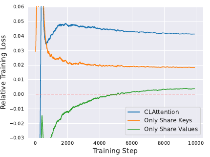

> The chart shows the ablation study on sharing keys or values in every two layers, comparing different information sharing methods with the relative training loss.

 The relative training curve between a 82M ResFormer and Transformer across different training sequence lengths. (Middle) Average training loss for the final 50 steps across different model sizes and the corresponding fitted curves. (Right) The relative training curve across different model size for a fixed 2,048 training sequence length.")

> The chart displays the relative training loss curves of ResFormer and Transformer models across various training sequence lengths and model sizes, illustrating ResFormer's superior performance and training efficiency.

> The chart displays the relative training loss curves for models with residual connections added to queries, keys, and values, respectively, showing that adding a residual connection to the values provides the most benefit.

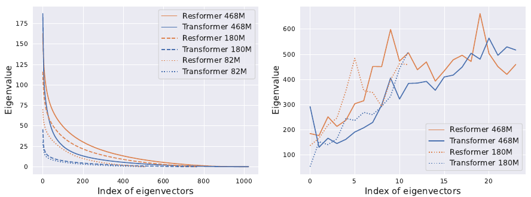

> The chart visualizes the distribution and maximum values of eigenvalues for value vectors in the first layer and across all layers of ResFormer and Transformer models, comparing their representational capacity.

> The chart compares the relative training loss of SVFormer against other KV-efficient methods (GQA and CLA) with different training sequence lengths and KV cache sizes.

> The chart shows the relative training loss of SVFormer for different sequence lengths and predicts the critical point (training steps exceeded) based on linear regression.

> The chart displays the relative training loss curves of SVFormer under various hyperparameter settings (learning rate, warmup steps, model size, and architecture).

 across all layers.")

> The chart displays an ablation study comparing the relative training loss when sharing different components (value, query, or key) from the first layer across all layers in a transformer model.

 The average token similarity of hidden states across layers in ResFormer vs. the vanilla Transformer. (Right) The average token similarity of hidden states across layers in Llama (8B) (Dubey et al., 2024) and Mistral (7B) (Jiang et al., 2023).")

> The chart displays the average token similarity of hidden states across layers for various transformer models, illustrating the over-smoothing effect in deeper layers.

More on tables


<table id='9' style='font-size:16px'><tr><td>Data source</td><td>proportions</td><td>Tokens</td></tr><tr><td>Commoncrawl</td><td>50%</td><td>10 B</td></tr><tr><td>C4</td><td>20%</td><td>4 B</td></tr><tr><td>GitHub</td><td>10%</td><td>2 B</td></tr><tr><td>Books</td><td>5%</td><td>1 B</td></tr><tr><td>ArXiv</td><td>5%</td><td>1 B</td></tr><tr><td>Wikpedia</td><td>5%</td><td>1 B</td></tr><tr><td>StackExchange</td><td>5%</td><td>1 B</td></tr></table>

> Table 2 shows the composition of the pretraining dataset, specifying the data source, proportion, and number of tokens for each source.


<table id='0' style='font-size:14px'><tr><td>Max Sequence Length</td><td>512</td><td>2,048</td><td>8,192</td><td>32,000</td><td>64,000</td></tr><tr><td>Total Batch Size</td><td>4,096</td><td>1,024</td><td>256</td><td>64</td><td>32</td></tr><tr><td>Per-GPU Batch Size</td><td>128</td><td>32</td><td>8</td><td>2</td><td>1</td></tr><tr><td>Gradient Accumulation Step</td><td></td><td></td><td>32</td><td></td><td></td></tr><tr><td>GPUs</td><td></td><td></td><td>8</td><td></td><td></td></tr></table>

> Table 5 presents the validation loss for different models on the whole validation split of slimpajama dataset.


<table id='3' style='font-size:20px'><tr><td>Model Size</td><td>2M</td><td>82M</td><td>180M</td><td>468M</td></tr><tr><td>Layers</td><td>4</td><td>8</td><td>12</td><td>24</td></tr><tr><td>Attention Heads</td><td>2</td><td>8</td><td>12</td><td>16</td></tr><tr><td>Hidden Dimension</td><td>16</td><td>512</td><td>768</td><td>1,024</td></tr><tr><td>FFN Dimension</td><td>56</td><td>1,792</td><td>2,688</td><td>3,584</td></tr><tr><td>Tie Word Embedding</td><td colspan="4">False</td></tr><tr><td>(Peak Learning Rate, Final Learning Rate)</td><td colspan="4">(6e - 4, 6e - 5)</td></tr><tr><td>Learning Rate Schedule</td><td colspan="4">Cosine Decay</td></tr><tr><td>Vocabulary Size</td><td colspan="4">50,277</td></tr><tr><td>Activation Function</td><td colspan="4">SwiGLU</td></tr><tr><td>Position Embedding</td><td colspan="4">RoPE (0 = 10,000)</td></tr><tr><td>Batch Size</td><td colspan="4">2M tokens</td></tr><tr><td>Data Size</td><td colspan="4">20B tokens</td></tr><tr><td>(Warmup Steps, Training Steps)</td><td colspan="4">(120, 10,000)</td></tr><tr><td>Adam B</td><td colspan="4">(0.9, 0.95)</td></tr><tr><td>Dropout</td><td colspan="4">0.0</td></tr><tr><td>Weight Decay</td><td colspan="4">0.1</td></tr></table>

> This table provides the training hyperparameters used for models of different sizes, including the number of layers, attention heads, hidden and FFN dimensions, and learning rate scheduling.


<table id='7' style='font-size:18px'><tr><td>Model</td><td>Common Crawl</td><td>C4</td><td>Github</td><td>Stack Exchange</td><td>Wikipedia</td><td>Book</td><td>Arxiv</td><td>Avg.</td></tr><tr><td>Transformer (82M)</td><td>3.3595</td><td>3.5388</td><td>1.4247</td><td>2.3872</td><td>2.9047</td><td>3.3797</td><td>2.1779</td><td>2.7389</td></tr><tr><td>Transformer (180M)</td><td>3.0961</td><td>3.2834</td><td>1.2451</td><td>2.1651</td><td>2.5897</td><td>3.1309</td><td>2.0001</td><td>2.5015</td></tr><tr><td>Transformer (468M)</td><td>2.8514</td><td>3.0430</td><td>1.0908</td><td>1.9628</td><td>2.2821</td><td>2.8979</td><td>1.8362</td><td>2.2806</td></tr><tr><td>Resformer (82M)</td><td>3.3362</td><td>3.5191</td><td>1.3941</td><td>2.3592</td><td>2.8646</td><td>3.3572</td><td>2.1518</td><td>2.7117</td></tr><tr><td>Resformer (180M)</td><td>3.0631</td><td>3.2504</td><td>1.2200</td><td>2.1350</td><td>2.5435</td><td>3.0994</td><td>1.9732</td><td>2.4692</td></tr><tr><td>Resformer (468M)</td><td>2.8214</td><td>3.0115</td><td>1.0730</td><td>1.9388</td><td>2.2477</td><td>2.8696</td><td>1.8142</td><td>2.2537</td></tr></table>

> Table 5 presents the validation loss for different models on the whole validation split of slimpajama.

### Full paper


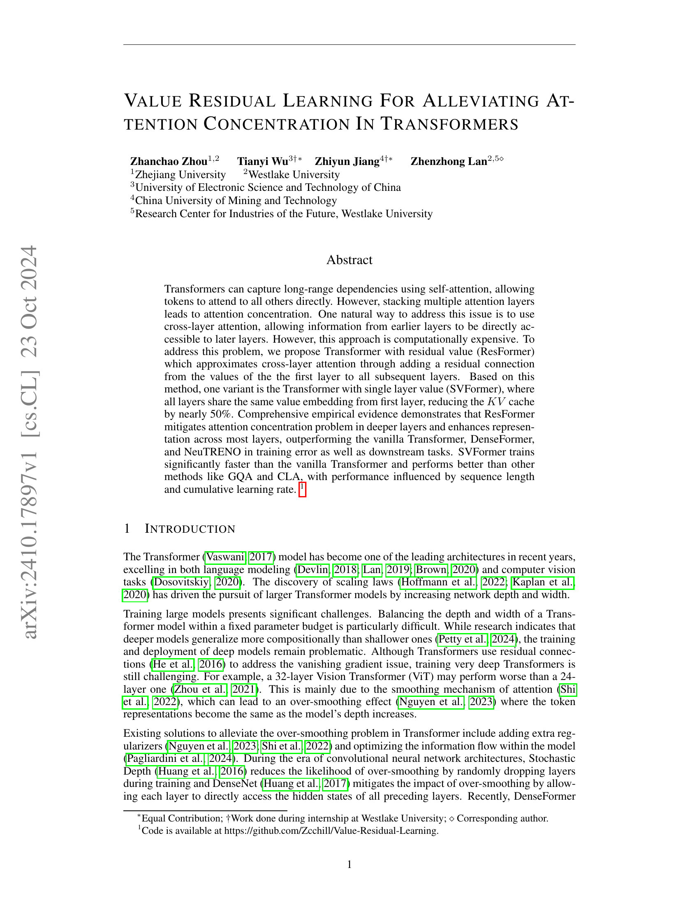
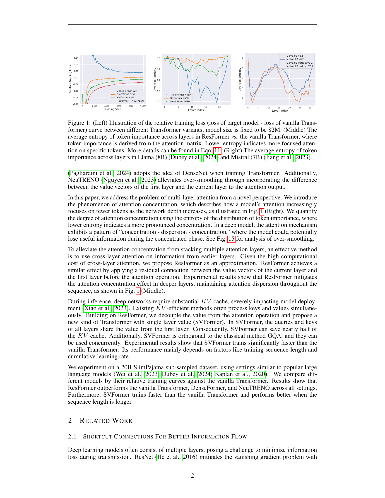
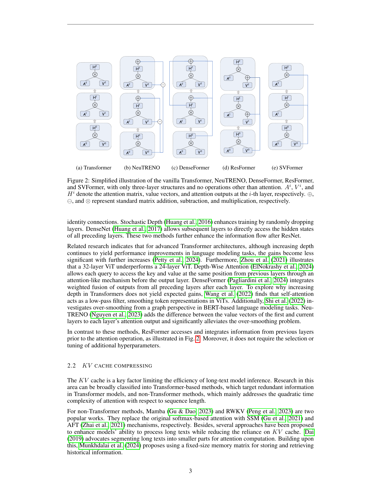
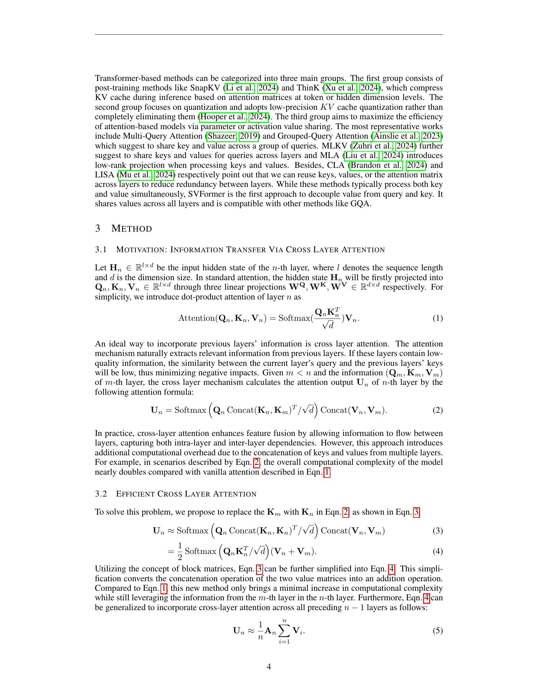
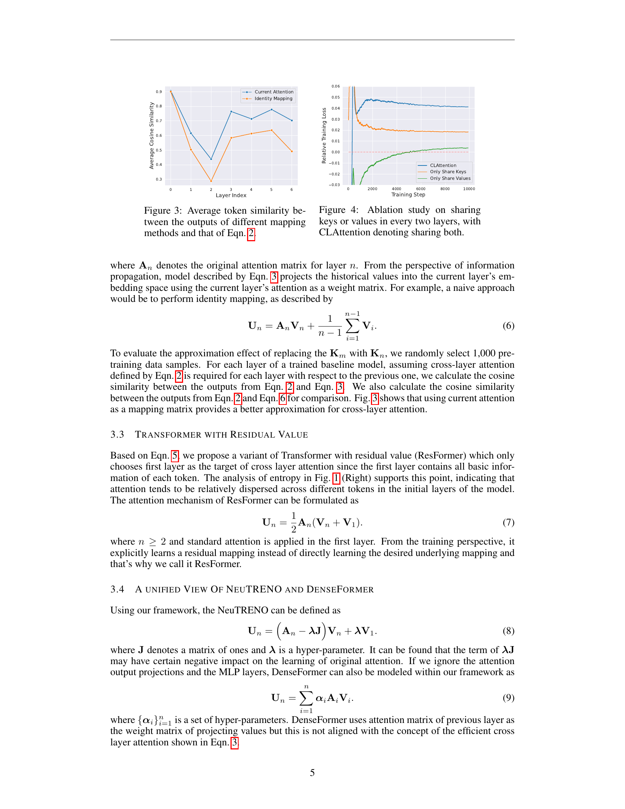
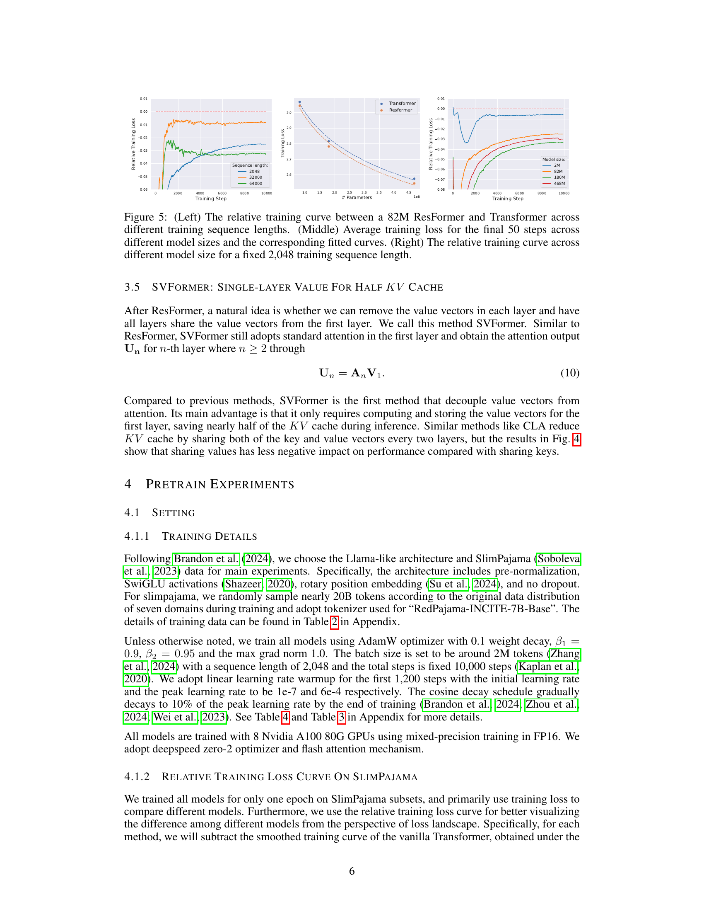
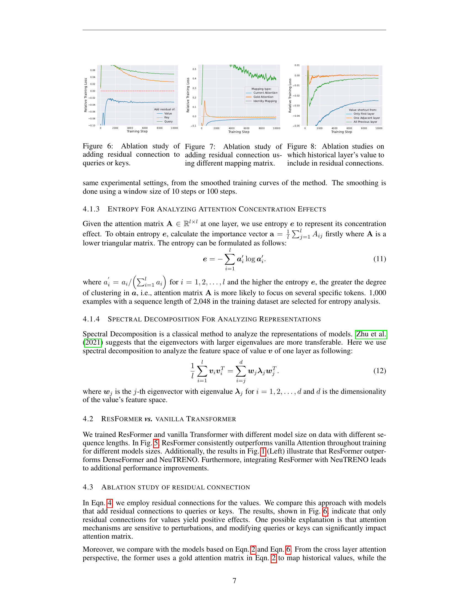

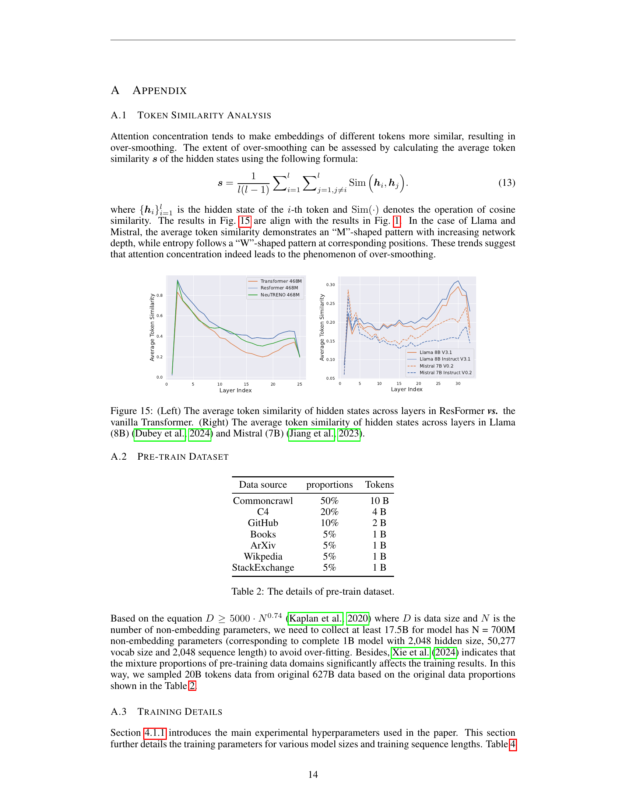
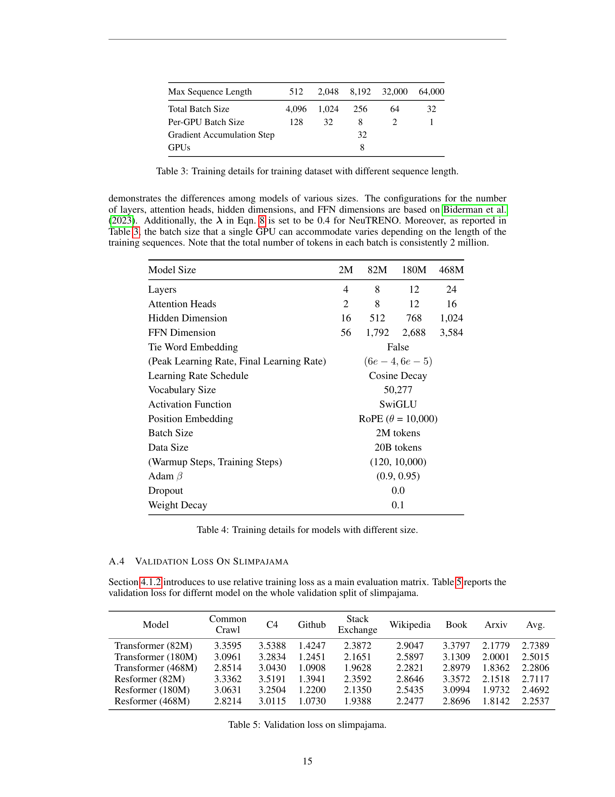
