### TL;DR



This paper introduces WorldSimBench, a new benchmark for evaluating video generation models, specifically those aiming to be 'World Simulators'—models capable of generating realistic and actionable videos.  It addresses the limitations of existing benchmarks by proposing a dual evaluation approach.  First, explicit perceptual evaluation uses human feedback on visual quality to assess the realism and fidelity of generated videos. Second, implicit manipulative evaluation assesses how well the generated videos translate into correct control signals in embodied tasks. The research categorizes predictive models based on their level of embodiment, highlighting the progression from text-only to actionable video generation.  Three representative embodied scenarios—open-ended environment, autonomous driving, and robot manipulation—are used for evaluation.  The authors create a new dataset, HF-Embodied, with fine-grained human feedback to support the perceptual evaluation. Results provide insights into the capabilities and limitations of current World Simulators, offering key directions for future research.




 &nbsp; read the paper on arXiv


#### Why does it matter?
WorldSimBench is a novel dual-evaluation framework for assessing the capabilities of predictive video generation models (World Simulators) from both visual and action-level perspectives.  It introduces a hierarchical classification of predictive models and offers key insights into their strengths and limitations.
#### Key Takeaways


 WorldSimBench provides a dual evaluation (perceptual and manipulative) of video generation models, addressing limitations of existing benchmarks. 



 A hierarchical classification of predictive models based on embodiment level is introduced, clarifying the landscape of predictive modeling. 



 The HF-Embodied Dataset, a video assessment dataset with fine-grained human feedback, is presented, enabling more accurate evaluation. 


------
#### Visual Insights

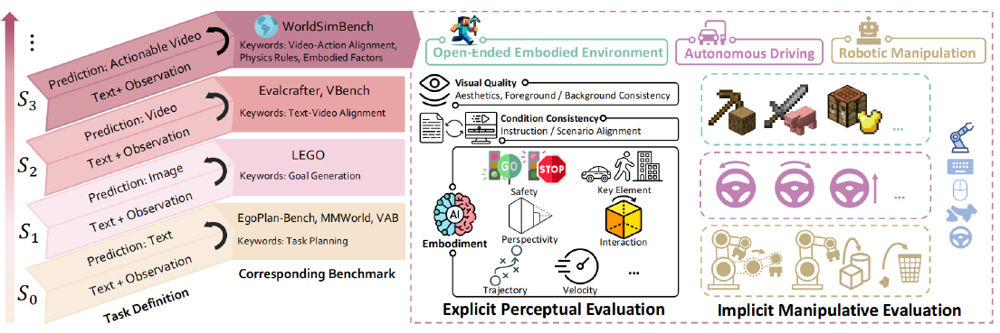

> Figure 1 illustrates the hierarchical capabilities of predictive models, showing the progression from text prediction to actionable video generation and introducing WorldSimBench, a dual evaluation framework.

> The radar chart visualizes the performance of multiple video generation models across different evaluation dimensions within three embodied scenarios.


 <table id='1' style='font-size:14px'><tr><td>Benchmark</td><td>Input Modality</td><td>Output Modality</td><td>Based Method</td><td>Stage</td><td>Interactive Env.</td><td>Evaluation Strategy</td></tr><tr><td>AgentBench Liu et al. 2023b</td><td>Text</td><td>Text</td><td>LLM</td><td>So</td><td>Task-Level</td><td>Human Judgement</td></tr><tr><td>EgoPlan-Bench Chen etal. 2023</td><td>Text & Images</td><td>Text</td><td>MLLM</td><td>So</td><td>N/A</td><td>Multi-choice</td></tr><tr><td>MMWorld He et al. 2024</td><td>Text & Images</td><td>Text</td><td>MLLM</td><td>So</td><td>N/A</td><td>GPT Judgement</td></tr><tr><td>VAB Liu et al. 2024a</td><td>Text & Images</td><td>Text</td><td>MLLM</td><td>So</td><td>Task-Level</td><td>Human Judgement</td></tr><tr><td>LEGO Lai et al. 2023</td><td>Text & Images</td><td>Image</td><td>IGM</td><td>S1</td><td>Task-Level</td><td>Feature Similarity</td></tr><tr><td>VBench Huang etal. 2024</td><td>Text</td><td>Video</td><td>VGM</td><td>S2</td><td>N/A</td><td>Feature Similarity</td></tr><tr><td>EvalCrafter Liu etal. 2024b</td><td>Text & Images</td><td>Video</td><td>VGM</td><td>S2</td><td>N/A</td><td>Feature Similarity</td></tr><tr><td>WorldSimBench</td><td>Text & Images</td><td>Actionable Video</td><td>VGM</td><td>S3</td><td>Action-Level</td><td>Human Preference Evaluator Embodied Metric</td></tr></table>

> Table 1 compares existing predictive model benchmarks based on input/output modalities, methods, stages, interactive environments, and evaluation strategies.

### More visual insights

More on figures

 Instruction Prompt Generation. We use a large collection of video captions from the internet and our predefined embodied evaluation dimensions. These are expanded using GPT and manually verified to create a corresponding Task Instruction Prompt List for data generation and evaluation. (Bottom) HF-Embodied Dataset Generation. Massive internet-sourced embodied videos with captions are used to train data generation models. Fine-grained Human Feedback Annotation is then applied to the embodied videos according to the corresponding Task Instruction Prompt List, covering multiple embodied dimensions.")

> This figure illustrates the process of generating the HF-Embodied dataset for explicit perceptual evaluation, which involves instruction prompt generation, data generation model training, and fine-grained human feedback annotation.

> The figure illustrates the process of Implicit Manipulative Evaluation, decomposing embodied tasks into sub-tasks, using video generation models and video-to-action mapping to evaluate task performance.

> Figure 7 shows a sequence of images from a Minecraft environment illustrating the execution of a task in the Implicit Manipulative Evaluation.

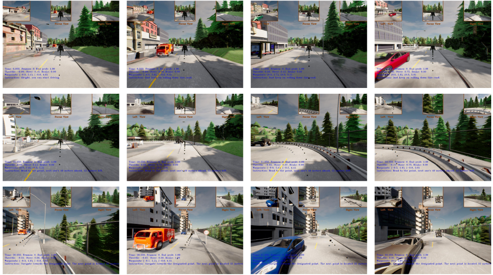

> The figure shows a sequence of frames from an autonomous driving simulation, illustrating the execution process in the Implicit Manipulative Evaluation.

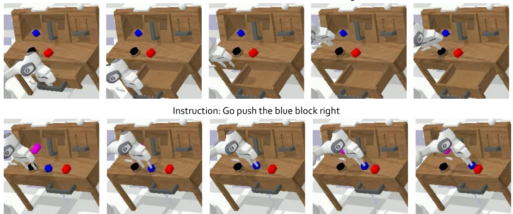

> The figure shows a sequence of images illustrating the steps involved in a robot manipulation task within the Implicit Manipulative Evaluation process.

More on tables


 <table id='1' style='font-size:14px'><tr><td>Embodied Scenario</td><td>GPT-4o</td><td>HPE</td><td>GPT-4o@OpenSora</td><td>HPE@OpenSora</td><td>GPT-4o@Lavie</td><td>HPE@Lavie</td></tr><tr><td>OE@Acc(↑)</td><td>72.8</td><td>89.4</td><td>66.5</td><td>71.6</td><td>78.5</td><td>87.9</td></tr><tr><td>AD @ PLCC(↑)</td><td>0.28</td><td>0.60</td><td>0.03</td><td>0.34</td><td>-0.04</td><td>0.49</td></tr><tr><td>RM@PLCC(↑)</td><td>0.07</td><td>0.43</td><td>-0.06</td><td>0.47</td><td>0.17</td><td>0.44</td></tr></table>

> The table compares the overall performance of the Human Preference Evaluator and GPT-40 across three embodied scenarios (Open-Ended Embodied Environment, Autonomous Driving, and Robot Manipulation) using different evaluation metrics.


<table id='1' style='font-size:14px'><tr><td>Embodied Scenario</td><td>#instructions</td><td>#videos</td><td>#dims</td><td>#actions</td><td>#positive</td><td>#negative</td></tr><tr><td>Open-Ended Embodied Environment</td><td>270</td><td>8401</td><td>7</td><td>11</td><td>121249</td><td>79965</td></tr><tr><td>Autonomous Driving</td><td>5</td><td>15870</td><td>6</td><td>5</td><td>56768</td><td>35044</td></tr><tr><td>Robot Manipulation</td><td>2556</td><td>11430</td><td>7</td><td>26</td><td>70672</td><td>9338</td></tr></table>

> Table 4 presents the analysis of the HF-Embodied Dataset, showing the number of instructions, videos, dimensions, actions, positive samples, and negative samples for each of the three embodied scenarios.


<table id='7' style='font-size:14px'><tr><td>Model</td><td>Open-Sora-Plan</td><td>Lavie</td><td>ModelScope</td><td>OpenSora</td><td>AnimateDiff</td><td>DynamicCrafter</td><td>EasyAnimate</td></tr><tr><td>Short Videos(frames)</td><td>16</td><td>16</td><td>16</td><td>16</td><td>16</td><td>16</td><td>16</td></tr><tr><td>Long Videos(frames)</td><td>64</td><td>48</td><td>60</td><td>48</td><td>64</td><td>60</td><td>64</td></tr></table>

> The table presents the number of training frames used for short and long videos across eight different video generation models.


<table id='0' style='font-size:14px'><tr><td>OE@ Acc(↑)</td><td>BC</td><td>FC</td><td>IA</td><td>SA</td><td>VC</td><td>TJ</td><td>EI</td><td>Overall</td></tr><tr><td rowspan="2">GPT-4o HPE</td><td>60.5</td><td>70.4</td><td>70.9</td><td>67.3</td><td>79.6</td><td>83.7</td><td>85.9</td><td>72.8</td></tr><tr><td>81.2</td><td>87.5</td><td>87.5</td><td>96.4</td><td>94.5</td><td>93.8</td><td>88.8</td><td>89.4</td></tr><tr><td rowspan="2">GPT-4o@OpenSora HPE@OpenSora</td><td>60</td><td>80</td><td>80</td><td>50</td><td>0.0</td><td>100</td><td>88.8</td><td>66.5</td></tr><tr><td>70</td><td>90</td><td>60</td><td>100</td><td>100</td><td>22.2</td><td>80</td><td>71.6</td></tr><tr><td rowspan="2">GPT-4o@Lavie HPE@Lavie</td><td>50</td><td>66.7</td><td>75</td><td>88.8</td><td>87.5</td><td>100</td><td>87.5</td><td>78.5</td></tr><tr><td>80</td><td>80</td><td>80</td><td>100</td><td>100</td><td>75</td><td>100</td><td>87.9</td></tr><tr><td>AD @ PLCC(↑)</td><td>AE</td><td>IA</td><td>PV</td><td>TJ</td><td></td><td>KE</td><td>SF</td><td>Overall</td></tr><tr><td rowspan="2">GPT-4o HPE</td><td>0.37</td><td>0.22</td><td>0.23</td><td></td><td>0.28</td><td>0.37</td><td>0.18</td><td>0.28</td></tr><tr><td>0.71</td><td>0.57</td><td>0.50</td><td>0.58</td><td></td><td>0.65</td><td>0.58</td><td>0.60</td></tr><tr><td rowspan="2">GPT-4o@OpenSora HPE@OpenSora</td><td>0.22</td><td>-0.39</td><td>0.32</td><td></td><td>0.15</td><td>-0.03</td><td>-0.12</td><td>0.03</td></tr><tr><td>0.37</td><td>0.55</td><td>0.34</td><td></td><td>0.06</td><td>0.28</td><td>0.41</td><td>0.34</td></tr><tr><td rowspan="2">GPT-4o@Lavie HPE@Lavie</td><td>0.17</td><td>0.13</td><td>-0.34</td><td></td><td>0.06</td><td>-0.09</td><td>-0.15</td><td>-0.04</td></tr><tr><td>0.28</td><td>1.0</td><td>0.49</td><td>0.37</td><td></td><td>0.12</td><td>0.69</td><td>0.49</td></tr><tr><td>RM@PLCC(↑)</td><td>AE</td><td>BC</td><td>FC</td><td>IA</td><td>PV</td><td>TJ</td><td>EI</td><td>Overall</td></tr><tr><td rowspan="2">GPT-4o HPE</td><td>0.07</td><td>0.18</td><td>0.20</td><td>0.32</td><td>-0.14</td><td>-0.01</td><td>-0.14</td><td>0.07</td></tr><tr><td>0.52</td><td>0.43</td><td>0.43</td><td>0.43</td><td>0.20</td><td>0.56</td><td>0.44</td><td>0.43</td></tr><tr><td rowspan="2">GPT-4o@OpenSora HPE@ OpenSora</td><td>-0.45</td><td>-0.03</td><td>0.08</td><td>0.0</td><td>0.04</td><td>-0.23</td><td>0.14</td><td>-0.06</td></tr><tr><td>0.25</td><td>0.35</td><td>0.05</td><td>0.42</td><td>0.89</td><td>0.89</td><td>0.44</td><td>0.47</td></tr><tr><td rowspan="2">GPT-4o@Lavie HPE@Lavie</td><td>0.11</td><td>-0.07</td><td>0.42</td><td>0.42</td><td>0.21</td><td>0.31</td><td>-0.21</td><td>0.17</td></tr><tr><td>0.33</td><td>0.04</td><td>0.69</td><td>0.40</td><td>0.89</td><td>0.67</td><td>0.06</td><td>0.44</td></tr></table>

> This table compares various existing predictive model benchmarks across different dimensions, including input/output modalities, methods, evaluation strategies, and interaction types.


<table id='3' style='font-size:16px'><tr><td>Model</td><td>BC</td><td>FC</td><td>IA</td><td>SA</td><td>VC</td><td>TJ</td><td>EI</td><td>Overall</td></tr><tr><td>Open-Sora-Plan</td><td>1.4</td><td>1.9</td><td>1.7</td><td>1.7</td><td>2.0</td><td>1.5</td><td>1.6</td><td>1.69</td></tr><tr><td>Lavie</td><td>1.3</td><td>2.0</td><td>1.7</td><td>1.7</td><td>2.0</td><td>2.0</td><td>1.8</td><td>1.79</td></tr><tr><td>ModelScope</td><td>1.9</td><td>2.0</td><td>2.0</td><td>1.7</td><td>2.0</td><td>2.0</td><td>1.75</td><td>1.91</td></tr><tr><td>OpenSora</td><td>1.6</td><td>1.9</td><td>1.6</td><td>1.8</td><td>2.0</td><td>2.0</td><td>1.6</td><td>1.79</td></tr><tr><td>AnimateDiff</td><td>1.3</td><td>1.3</td><td>1.2</td><td>1.7</td><td>1.4</td><td>1.38</td><td>1.55</td><td>1.40</td></tr><tr><td>DynamicCrafter</td><td>1.9</td><td>2.0</td><td>1.5</td><td>2.0</td><td>2.0</td><td>2.0</td><td>1.45</td><td>1.84</td></tr><tr><td>EasyAnimate</td><td>1.4</td><td>1.8</td><td>1.5</td><td>2.0</td><td>2.0</td><td>1.22</td><td>1.45</td><td>1.62</td></tr></table>

> This table compares existing predictive model benchmarks based on input modality, output modality, method, stage, interactive environment, and evaluation strategy.


<table id='1' style='font-size:16px'><tr><td>Model</td><td>AE</td><td>IA</td><td>PV</td><td>TJ</td><td>KE</td><td>SF</td><td>Overall</td></tr><tr><td>Open-Sora-Plan</td><td>1.6</td><td>5.0</td><td>1.55</td><td>1.4</td><td>1.45</td><td>3.2</td><td>2.37</td></tr><tr><td>Lavie</td><td>2.15</td><td>5.0</td><td>2.2</td><td>2.8</td><td>2.1</td><td>5.0</td><td>3.21</td></tr><tr><td>ModelScope</td><td>2.8</td><td>5.0</td><td>3.35</td><td>4.0</td><td>3.0</td><td>5.0</td><td>3.86</td></tr><tr><td>OpenSora</td><td>3.55</td><td>5.0</td><td>4.4</td><td>4.8</td><td>3.65</td><td>5.0</td><td>4.40</td></tr><tr><td>AnimateDiff</td><td>1.55</td><td>5.0</td><td>1.55</td><td>1.0</td><td>1.3</td><td>3.8</td><td>2.37</td></tr><tr><td>DynamicCrafter</td><td>2.6</td><td>4.0</td><td>3.4</td><td>3.8</td><td>2.65</td><td>5.0</td><td>3.57</td></tr><tr><td>EasyAnimate</td><td>1.5</td><td>3.4</td><td>1.4</td><td>1.4</td><td>1.3</td><td>2.6</td><td>1.93</td></tr></table>

> The table presents a comparison of the performance of several video generation models across various evaluation dimensions (Aesthetics, Instruction Alignment, Perspectivity, Trajectory, Key Element, Safety) in the context of Autonomous Driving.


<table id='3' style='font-size:16px'><tr><td>Model</td><td>AE</td><td>BC</td><td>FC</td><td>IA</td><td>PV</td><td>TJ</td><td>EI</td><td>Overall</td></tr><tr><td>Open-Sora-Plan</td><td>4.0</td><td>4.0</td><td>4.0</td><td>1.0</td><td>4.9</td><td>5.0</td><td>4.0</td><td>3.84</td></tr><tr><td>Lavie</td><td>3.8</td><td>3.9</td><td>4.0</td><td>1.8</td><td>4.95</td><td>5.0</td><td>4.1</td><td>3.94</td></tr><tr><td>ModelScope</td><td>3.63</td><td>4.1</td><td>4.0</td><td>1.18</td><td>4.9</td><td>5.0</td><td>4.0</td><td>3.83</td></tr><tr><td>OpenSora</td><td>3.85</td><td>4.0</td><td>3.95</td><td>1.3</td><td>4.75</td><td>5.0</td><td>4.1</td><td>3.85</td></tr><tr><td>AnimateDiff</td><td>3.8</td><td>3.9</td><td>4.0</td><td>1.0</td><td>4.95</td><td>5.0</td><td>4.1</td><td>3.82</td></tr><tr><td>DynamicCrafter</td><td>3.97</td><td>4.08</td><td>4.0</td><td>2.6</td><td>5.0</td><td>5.0</td><td>4.31</td><td>4.14</td></tr><tr><td>EasyAnimate</td><td>3.55</td><td>3.45</td><td>3.65</td><td>1.2</td><td>4.8</td><td>4.3</td><td>3.45</td><td>3.49</td></tr></table>

> This table categorizes the evaluation dimensions for three embodied scenarios (Open-Ended Embodied Environment, Autonomous Driving, and Robot Manipulation) into three aspects: Visual Quality, Condition Consistency, and Embodiment, each with specific sub-dimensions.


<table id='2' style='font-size:14px'><tr><td rowspan="2">Model</td><td rowspan="2">Condition</td><td rowspan="2">AVG</td><td></td><td colspan="3">Specific Tasks</td><td></td></tr><tr><td>Collect Wood</td><td>Collect Dirt</td><td>Collect Seed</td><td>Travel Dis.</td><td>Dig Depth</td></tr><tr><td>Open-Sora-Plan</td><td rowspan="5">Text</td><td>26.38</td><td>19.90</td><td>50.20</td><td>7.30</td><td>342.91</td><td>20.20</td></tr><tr><td>Lavie</td><td>26.06</td><td>23.50</td><td>56.00</td><td>11.60</td><td>270.20</td><td>12.20</td></tr><tr><td>ModelScope</td><td>21.050</td><td>14.00</td><td>52.20</td><td>6.30</td><td>240.72</td><td>8.70</td></tr><tr><td>OpenSora</td><td>27.80</td><td>21.20</td><td>70.20</td><td>10.40</td><td>339.87</td><td>3.20</td></tr><tr><td>AnimateDiff</td><td>13.10</td><td>7.40</td><td>22.90</td><td>3.30</td><td>274.19</td><td>4.50</td></tr><tr><td>Open-Sora-Plan</td><td rowspan="3">Text & Image</td><td>10.28</td><td>11.10</td><td>12.50</td><td>2.60</td><td>195.14</td><td>5.70</td></tr><tr><td>DynamiCrafter</td><td>4.06</td><td>0.40</td><td>0.30</td><td>1.30</td><td>130.04</td><td>5.30</td></tr><tr><td>EasyAnimate</td><td>4.84</td><td>0.20</td><td>0.70</td><td>1.70</td><td>157.12</td><td>5.90</td></tr></table>

> This table compares various existing predictive model benchmarks, highlighting their input/output modalities, methodologies, and interaction levels with the environment.


<table id='4' style='font-size:18px'><tr><td>Model</td><td>DS(↑)</td><td>RC(↑)</td><td>IS(↑)</td><td>VC(↓)</td><td>PC(↓)</td><td>LC(↓)</td><td>RV(↓)</td><td>OI(↓)</td></tr><tr><td>Open-Sora-Plan</td><td>31.054</td><td>38.249</td><td>0.767</td><td>2.400</td><td>0.000</td><td>4.401</td><td>1.133</td><td>3.514</td></tr><tr><td>DynamiCrafter</td><td>24.491</td><td>37.189</td><td>0.599</td><td>5.030</td><td>0.000</td><td>4.896</td><td>0.937</td><td>3.221</td></tr><tr><td>EasyAnimate</td><td>17.414</td><td>28.475</td><td>0.607</td><td>0.000</td><td>0.000</td><td>29.344</td><td>0.000</td><td>1.690</td></tr></table>

> This table presents the evaluation results of three video generation models across eight metrics in the Autonomous Driving scenario of the Implicit Manipulative Evaluation.


<table id='11' style='font-size:18px'><tr><td rowspan="2">Method</td><td colspan="5">Task completed in a row (%) ↑</td><td rowspan="2">Avg. Len. ↑</td></tr><tr><td>1</td><td>2</td><td>3</td><td>4</td><td>5</td></tr><tr><td>Open-Sora-Plan</td><td>0.85</td><td>0.70</td><td>0.60</td><td>0.40</td><td>0.40</td><td>2.95</td></tr><tr><td>DynamiCrafter</td><td>0.95</td><td>0.75</td><td>0.55</td><td>0.25</td><td>0.25</td><td>2.75</td></tr><tr><td>EasyAnimate</td><td>0.90</td><td>0.60</td><td>0.35</td><td>0.10</td><td>0.10</td><td>2.05</td></tr></table>

> Table 1 compares existing predictive model benchmarks across various criteria, including input/output modalities, model type, interaction type, and evaluation strategy.

### Full paper


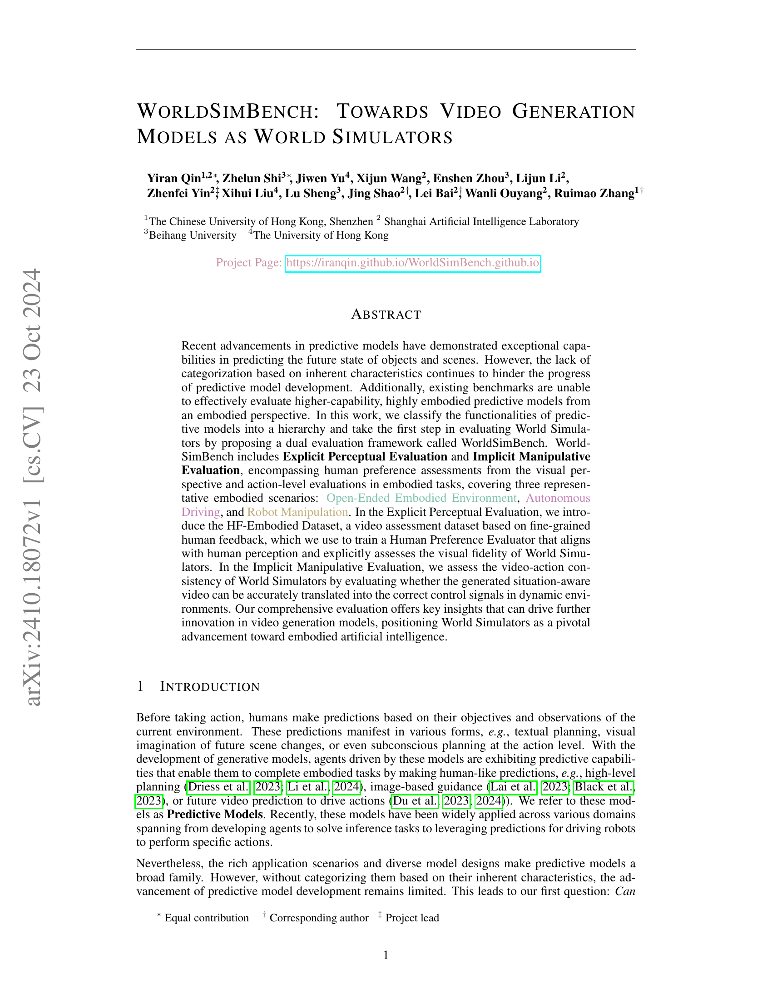

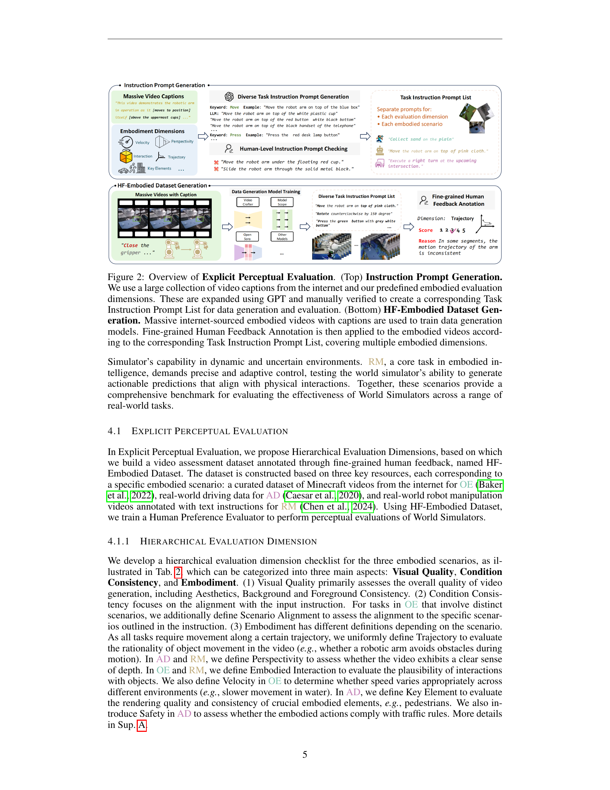
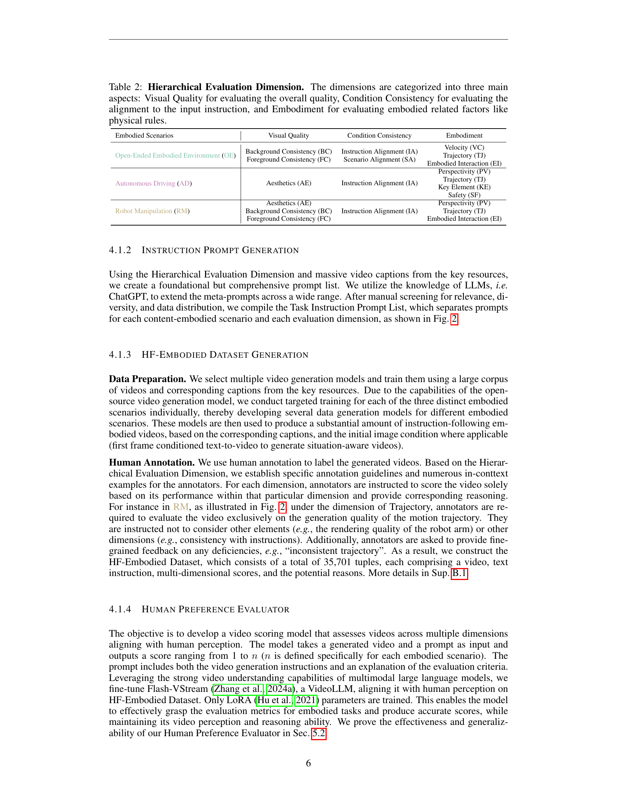
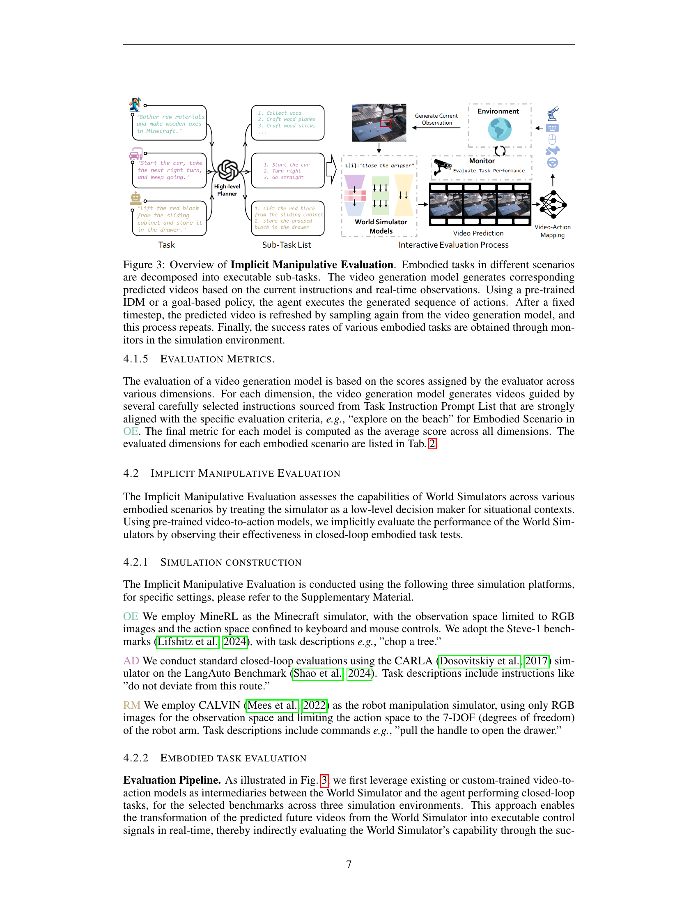
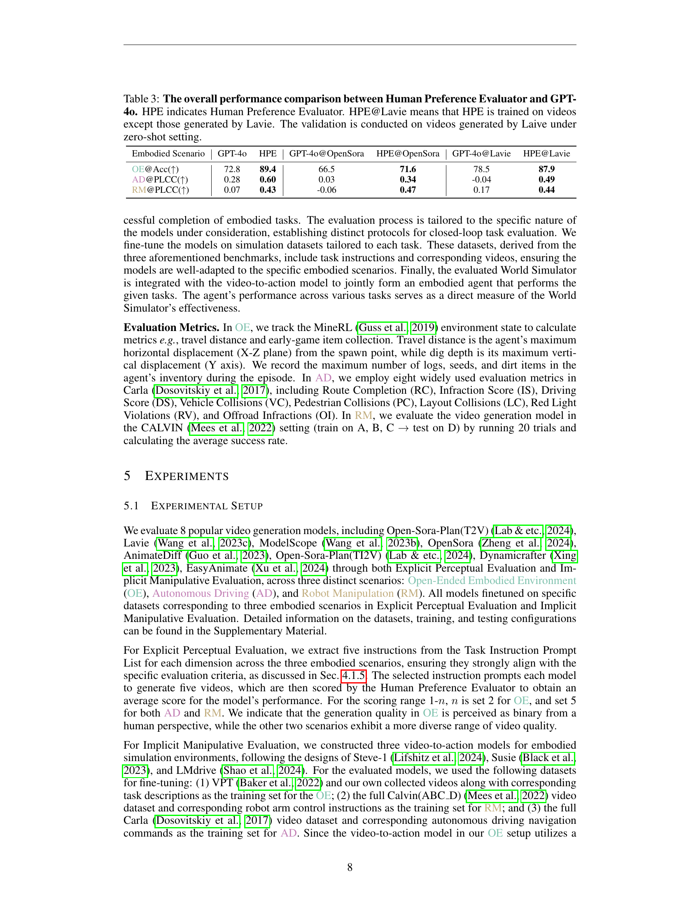

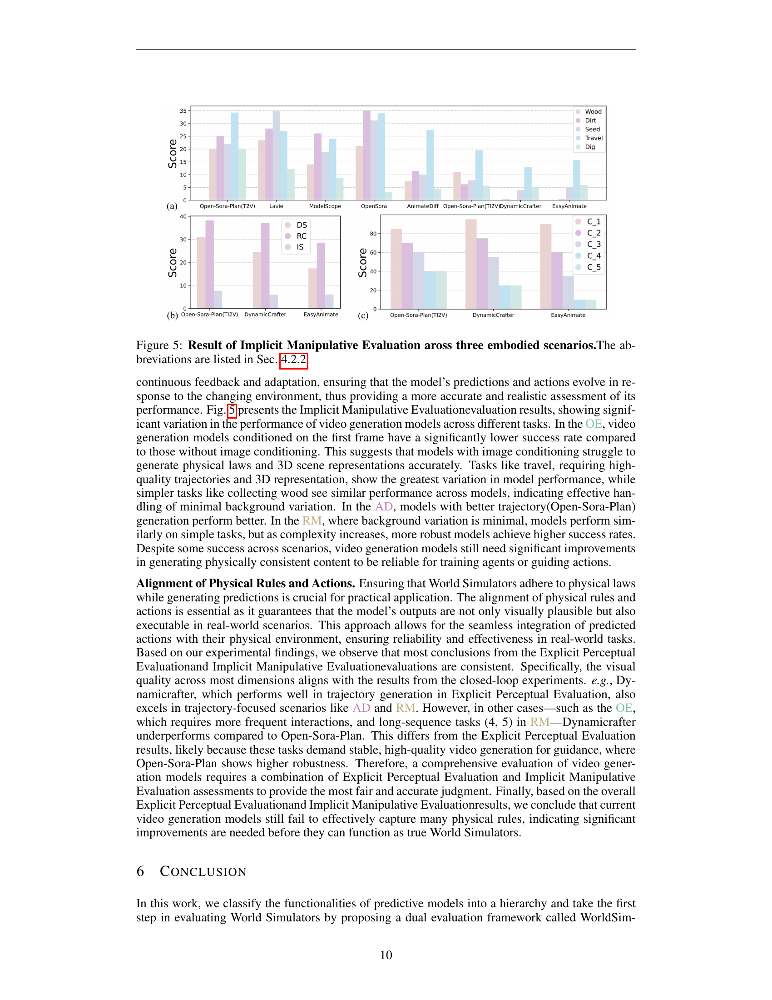
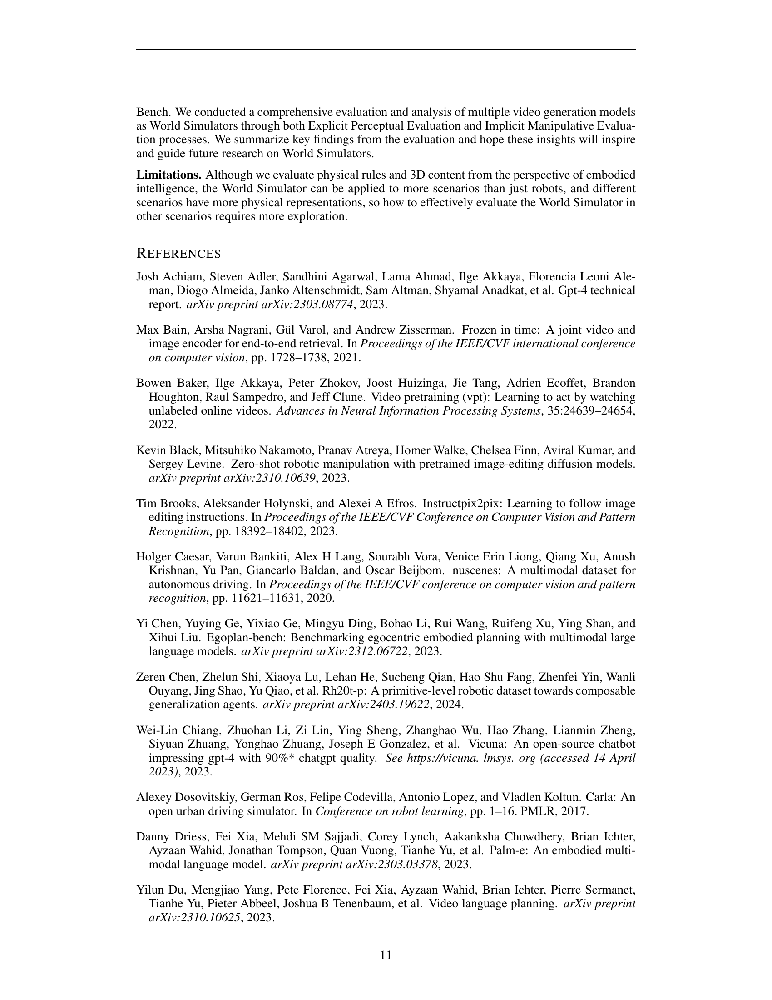

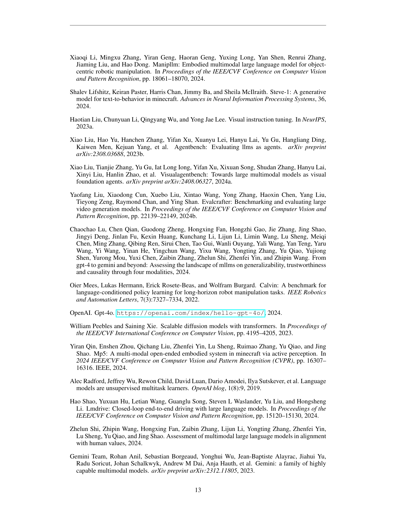

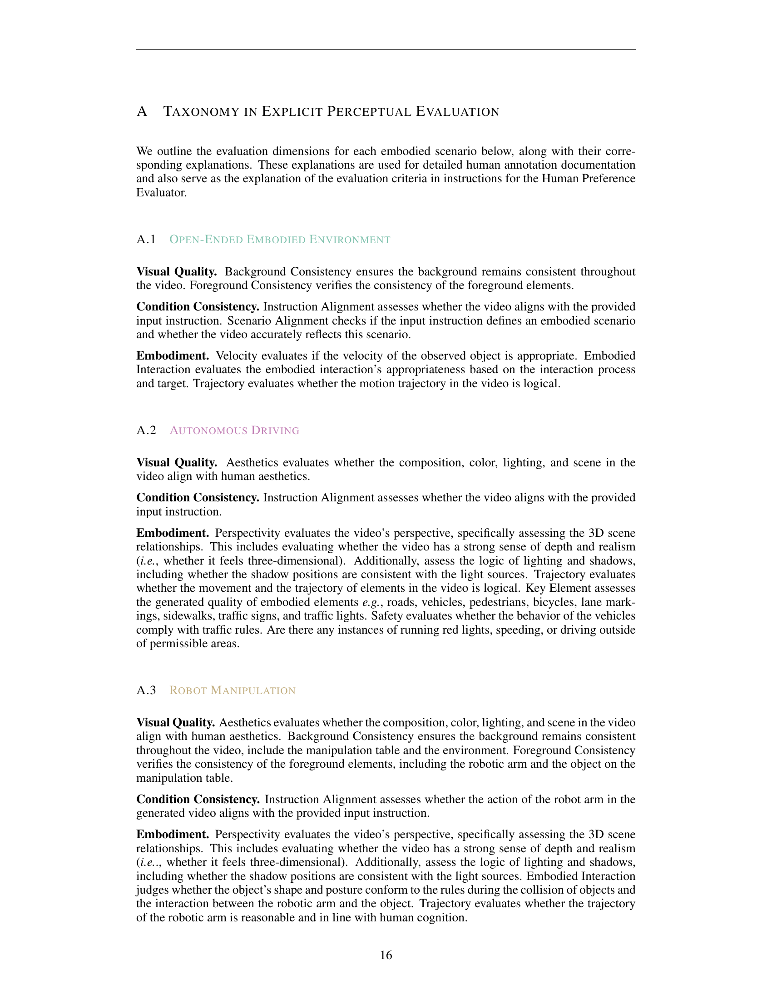

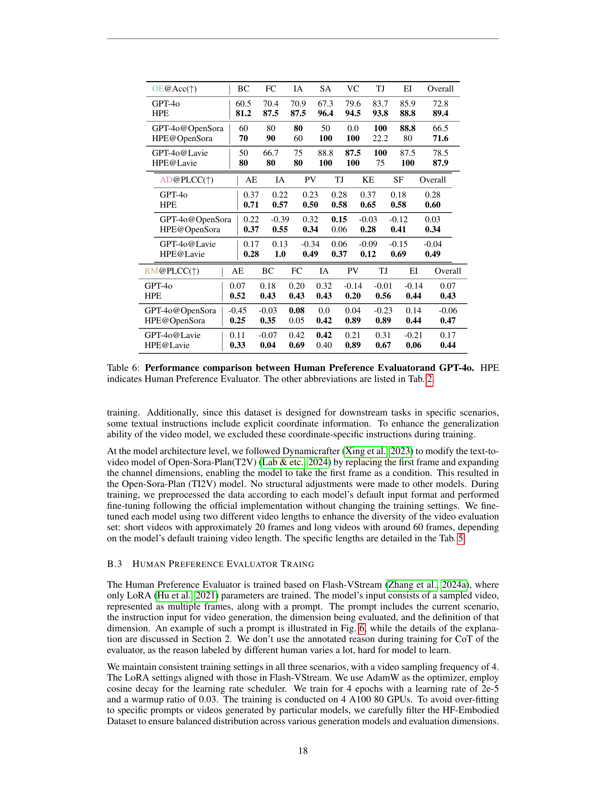
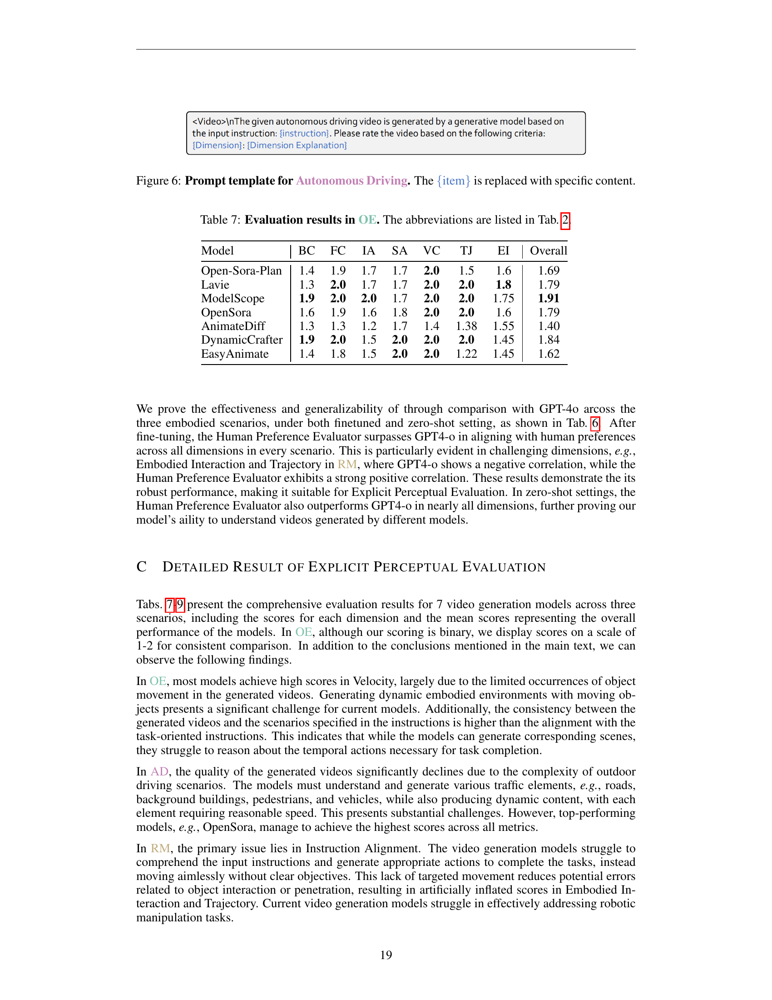

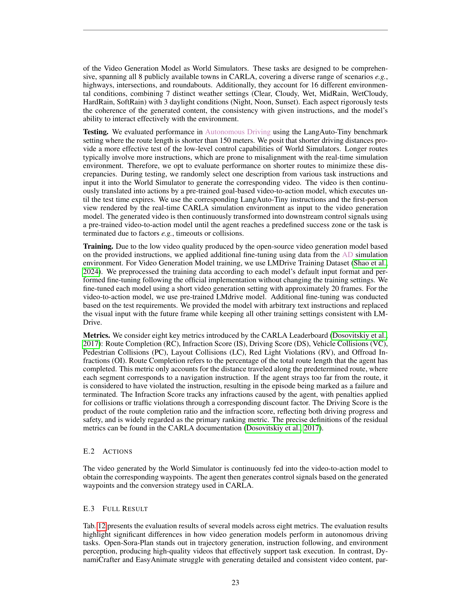

