### TL;DR



The research introduces ZIP-FIT, a new way to select the best training data for language models. Instead of using complex methods, ZIP-FIT uses a simple compression algorithm (gzip) to measure how well potential training data matches the specific task.  The results show that using data selected by ZIP-FIT leads to faster training and better performance on two tasks: turning natural language mathematical statements into formal code (Autoformalization) and generating computer code from natural language descriptions. ZIP-FIT is also faster than other existing data selection techniques.  The study demonstrates that focusing on a smaller, well-aligned dataset is much more effective than using a larger, less relevant one.  This is important because it shows the benefits of careful data selection and highlights the usefulness of compression as a way to gauge data quality for machine learning tasks.




 &nbsp; read the paper on arXiv


#### Why does it matter?
To provide a concise and informative summary of the research paper on ZIP-FIT, a novel data selection method for optimizing language model performance.
#### Key Takeaways


 ZIP-FIT, a novel embedding-free data selection method based on gzip compression, significantly outperforms existing baselines in Autoformalization and code generation tasks. 



 Higher data alignment, as measured by ZIP-FIT, strongly correlates with lower cross-entropy loss and faster model convergence. 



 ZIP-FIT offers a computationally efficient alternative to existing embedding-based methods, making it particularly suitable for resource-constrained environments. 


------
#### Visual Insights

 Obtain both the source and target datasets. (1) Calculate ZIP-FIT Alignment of each source example with the target dataset using gzip compression. (2) Rank all source examples based on these alignment scores. (3) Select the top-K most aligned examples for fine-tuning. (4) Fine-tune a large language model using the selected top-K examples to improve performance on the target task.")

> This figure illustrates the ZIP-FIT algorithm's process for selecting task-specific data by ranking source data examples based on their compression-based alignment with the target dataset and then using the top-k aligned examples to fine-tune a large language model.

 and CodeGemma-2B (bottom row) across different token selection sizes. ZIP-FIT (blue) consistently reduces loss faster than DSIR (green) and D4 (red), achieving up to 85.11% speed improvement at lower token counts. These results demonstrate ZIP-FIT's efficiency in data selection for fine-tuning models on code-geneation tasks.")

> The chart displays the cross-entropy test loss versus the number of training tokens for two code generation models, showing that ZIP-FIT consistently achieves lower loss faster than competing methods.


<table id='6' style='font-size:18px'><tr><td>Sample Text (Beginning)</td><td>Alignment Score</td></tr><tr><td>Across all his bands and projects, Townsend has released twenty @-@ three studio albums and three live albums.</td><td>0.5000</td></tr><tr><td>Require Import CodeDeps. Require Import Ident. Local Open Scope Z_scope. Definition _addr := 1%positive. Definition -g := 2%positive.</td><td>0.4928</td></tr><tr><td>This Photostock Vector Night Sky Background With Full Moon Clouds And Stars Vector Ilgraphicration has 1560 x 1560 pixel resolution...</td><td>0.4926</td></tr><tr><td>module Structure.Logic where ·</td><td>0.4926</td></tr><tr><td>{ dg-do compile } PR fortran/51993 Code contributed by Sebastien Bardeau <bardeau at iram dot fr> module mymod type :: mytyp...</td><td>0.4891</td></tr><tr><td>For over ten years, the St. Louis Mercy home has formed a special connection with a local community theatre: The Muny. This summer the...</td><td>0.4889</td></tr><tr><td>Read("SchreierSims.gi"); LoadPackage("AtlasRep""); MicroSeconds := function() local t; t := IO_gettimeofday(); return t.tv _sec * 1000000 + t.t</td><td>0.4889</td></tr><tr><td>Get the keyId used by this peer (this peer's identifier). This is stored in the key store.</td><td>0.4857</td></tr><tr><td>Initializes and adds a node to the graph. NOTE: At least the type must be supplied for the Node to exist in the graph. Args: graph: The graph...</td><td>0.4853</td></tr><tr><td>def bgra2rgb(img): cv2.cvtColor(img, cv2.COLOR _BGRA2BGR) has an issue removing the alpha channel, this gets rid of wrong trans...</td><td>0.4853</td></tr></table>

> Table 1 displays the beginning characters of the top 20 code samples selected by the ZIP-FIT algorithm for code generation, along with their corresponding ZIP-FIT alignment scores.

### More visual insights

More on charts

 loss for (a) GPT-2 trained on 22k tokens (R2 = 0.90, p = 0.001) and (b) Mistral7B trained on 22k tokens (R2 = 0.75, p = 0.025). Each point represents a dataset, with its position reflecting the dataset's ZIP-FIT alignment score against the ProofNet test set and the resulting CE loss. The dashed red line indicates the linear regression fit, while the dashed grey line shows the pretrained CE loss. Higher alignment scores correspond to lower CE losses, demonstrating that training on better aligned data yields better performance.")

> The chart shows a strong negative correlation between higher ZIP-FIT alignment scores and lower cross-entropy loss for GPT-2 and Mistral7B language models, indicating that training on better-aligned data leads to improved performance.

 loss for (a) GPT-2 trained on 22k tokens (R2 = 0.90, p = 0.001) and (b) Mistral7B trained on 22k tokens (R2 = 0.75, p = 0.025). Each point represents a dataset, with its position reflecting the dataset's ZIP-FIT alignment score against the ProofNet test set and the resulting CE loss. The dashed red line indicates the linear regression fit, while the dashed grey line shows the pretrained CE loss. Higher alignment scores correspond to lower CE losses, demonstrating that training on better aligned data yields better performance.")

> Higher ZIP-FIT alignment scores correlate with lower cross-entropy loss, indicating that training on better-aligned data leads to improved model performance.

 test loss. Different curves correspond to datasets filtered by different alignment scores, indicating their relevance to the target domain. The most aligned data reduce Test CE loss significantly faster than less aligned data. The left panel depicts results using GPT-2, and the right panel uses Mistral7B, demonstrating that using highly aligned data not only accelerates training but also achieves better model performance, validating the effectiveness of ZIP-FIT for data selection in fine-tuning.")

> The chart shows that highly aligned data leads to faster convergence and lower cross-entropy loss during model training for both GPT-2 and Mistral7B language models.

 across different token selection sizes. ZIP-FIT (blue line) consistently outperforms both DSIR (green line) and D4 (red line) across all model and token size configurations, highlighting its ability to process data more efficiently. The percentage labels in each plot indicate the relative speedup of ZIP-FIT over DSIR in reaching the lowest cross-entropy loss, reinforcing the method's scalability and adaptability for domain-specific fine-tuning.")

> The chart shows that ZIP-FIT consistently achieves lower cross-entropy test loss faster than DSIR and D4 across various models and token selection sizes for the AutoFormalization task, demonstrating its efficiency in data selection.

 on datasets filtered by varying alignment thresholds (>0.1, >0.2, >0.3). The dashed line indicates the baseline performance of the pretrained Mistral7B model. Training on data filtered with higher alignment thresholds leads to superior performance, demonstrating the effectiveness of removing misaligned data in fine-tuning.")

> The chart displays the relationship between the number of training tokens and cross-entropy test loss for different data alignment thresholds, demonstrating that using more aligned data leads to faster convergence and lower test loss.

 across various token selection sizes. ZIP-FIT (blue line) consistently surpasses both DSIR (green line) and D4 (red line) across all model and token size configurations, emphasizing its superior data processing efficiency. The percentage labels in each plot denote the relative speedup of ZIP-FIT over DSIR in attaining the lowest cross-entropy loss, further underscoring the method's scalability and adaptability for domain-specific fine-tuning.")

> The chart displays the cross-entropy test loss for three different models across various token selection sizes, demonstrating that ZIP-FIT consistently achieves lower test loss at a faster rate compared to D4 and DSIR.

 across various token selection sizes. ZIP-FIT (blue line) consistently surpasses both DSIR (green line) and D4 (red line) across all model and token size configurations, emphasizing its superior data processing efficiency. The percentage labels in each plot denote the relative speedup of ZIP-FIT over DSIR in attaining the lowest cross-entropy loss, further underscoring the method's scalability and adaptability for domain-specific fine-tuning.")

> The chart compares the performance of ZIP-FIT, DSIR, and D4 in reducing cross-entropy loss during the fine-tuning of three different language models for the Autoformalization task, demonstrating ZIP-FIT's superior efficiency and speed.

 across various token selection sizes. ZIP-FIT (blue line) consistently surpasses both DSIR (green line) and D4 (red line) across all model and token size configurations, emphasizing its superior data processing efficiency. The percentage labels in each plot denote the relative speedup of ZIP-FIT over DSIR in attaining the lowest cross-entropy loss, further underscoring the method's scalability and adaptability for domain-specific fine-tuning.")

> The chart compares the cross-entropy test loss of three different language models fine-tuned using data selected by ZIP-FIT, DSIR, and D4 across varying numbers of training tokens, demonstrating ZIP-FIT's superior efficiency and faster convergence.

 across various token selection sizes. ZIP-FIT (blue line) consistently surpasses both DSIR (green line) and D4 (red line) across all model and token size configurations, emphasizing its superior data processing efficiency. The percentage labels in each plot denote the relative speedup of ZIP-FIT over DSIR in attaining the lowest cross-entropy loss, further underscoring the method's scalability and adaptability for domain-specific fine-tuning.")

> The chart displays the cross-entropy test loss of three different language models using different data selection methods (ZIP-FIT, DSIR, and D4) across varying numbers of training tokens, demonstrating ZIP-FIT's superior performance and efficiency.

 and CodeGemma-2B (bottom row) across different token selection sizes. ZIP-FIT (blue) consistently reduces loss faster than DSIR (green) and D4 (red), achieving up to 85.11% speed improvement at lower token counts. These results demonstrate ZIP-FIT's efficiency in data selection for fine-tuning models on code-geneation tasks.")

> The chart displays the cross-entropy test loss versus the number of training tokens for different models and token selection sizes, showing that ZIP-FIT consistently reduces loss faster than other methods.

 across various token selection sizes. ZIP-FIT (blue line) consistently surpasses both DSIR (green line) and D4 (red line) across all model and token size configurations, emphasizing its superior data processing efficiency. The percentage labels in each plot denote the relative speedup of ZIP-FIT over DSIR in attaining the lowest cross-entropy loss, further underscoring the method's scalability and adaptability for domain-specific fine-tuning.")

> The chart compares the cross-entropy test loss of three different language models (InterLM-Math-Plus-1.8B, Gemma2-2B, and Mistral7B) trained on data selected by ZIP-FIT, DSIR, and D4 across various token selection sizes, demonstrating ZIP-FIT's superior performance and efficiency.

 across various token selection sizes. ZIP-FIT (blue line) consistently surpasses both DSIR (green line) and D4 (red line) across all model and token size configurations, emphasizing its superior data processing efficiency. The percentage labels in each plot denote the relative speedup of ZIP-FIT over DSIR in attaining the lowest cross-entropy loss, further underscoring the method's scalability and adaptability for domain-specific fine-tuning.")

> The chart compares the performance of ZIP-FIT, DSIR, and D4 in reducing cross-entropy loss during the fine-tuning of three different language models for the Autoformalization task, showing ZIP-FIT's superior efficiency and faster convergence.

 across various token selection sizes. ZIP-FIT (blue line) consistently surpasses both DSIR (green line) and D4 (red line) across all model and token size configurations, emphasizing its superior data processing efficiency. The percentage labels in each plot denote the relative speedup of ZIP-FIT over DSIR in attaining the lowest cross-entropy loss, further underscoring the method's scalability and adaptability for domain-specific fine-tuning.")

> The chart compares the performance of ZIP-FIT, DSIR, and D4 in terms of cross-entropy test loss and training speed for different model sizes and datasets in the Autoformalization task, demonstrating ZIP-FIT's superiority.

 across various token selection sizes. ZIP-FIT (blue line) consistently surpasses both DSIR (green line) and D4 (red line) across all model and token size configurations, emphasizing its superior data processing efficiency. The percentage labels in each plot denote the relative speedup of ZIP-FIT over DSIR in attaining the lowest cross-entropy loss, further underscoring the method's scalability and adaptability for domain-specific fine-tuning.")

> The chart compares the cross-entropy test loss of three different language models (InterLM-Math-Plus-1.8B, Gemma2-2B, and Mistral7B) trained using data selected by ZIP-FIT, DSIR, and D4 across various token selection sizes, demonstrating ZIP-FIT's superior efficiency and faster convergence in achieving lower test loss.

 takes 5hs because it uses an embedding model (opt-125m Zhang et al. (2022)), the same one as the original paper Tirumala et al. (2023).")

> The chart compares the cross-entropy test loss and data selection time of ZIP-FIT against DSIR for different models and token sizes, showing that ZIP-FIT achieves lower cross-entropy and faster data selection.

### Full paper


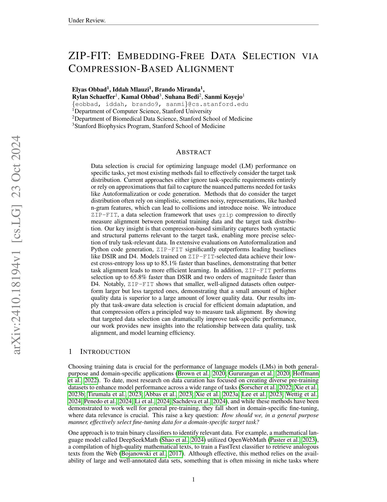
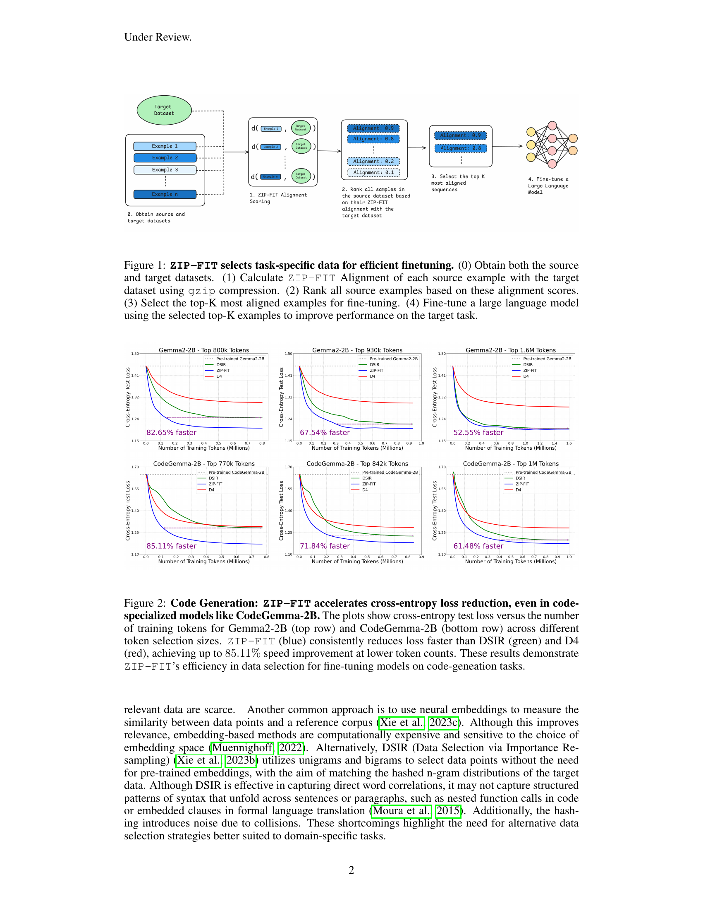
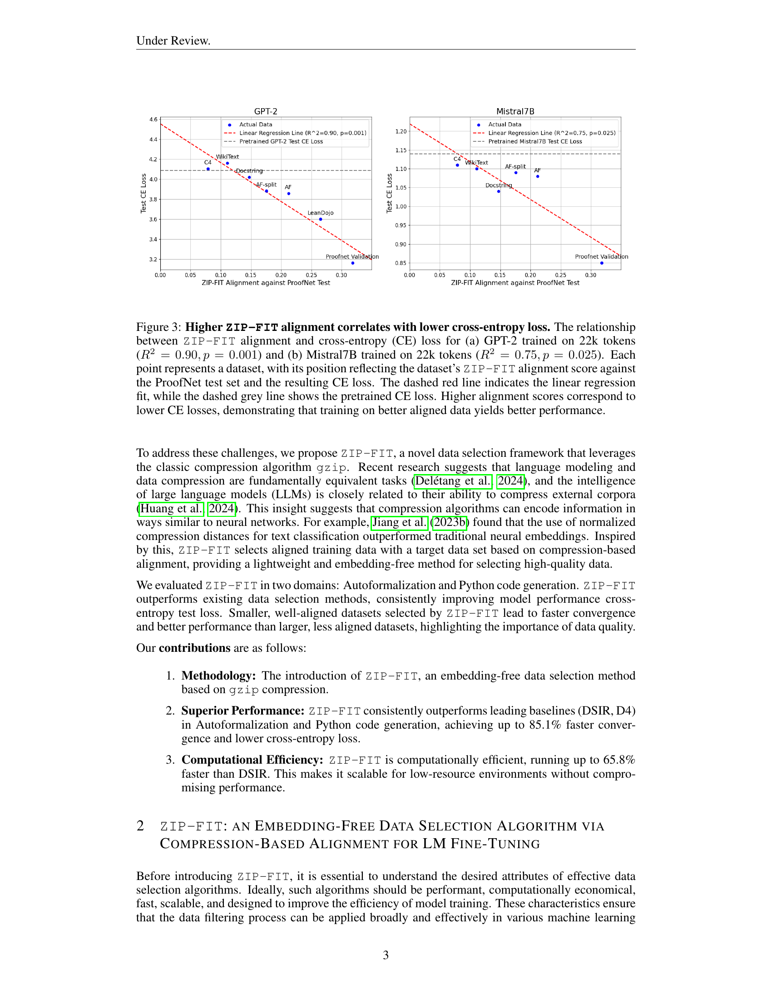
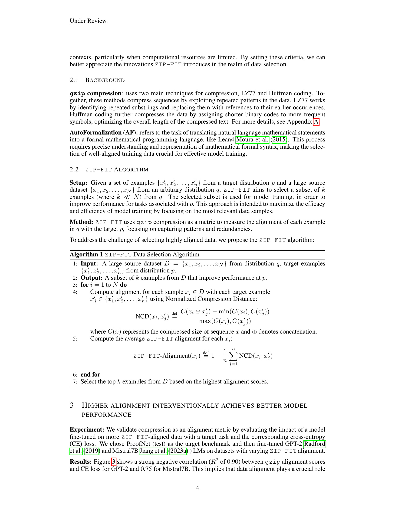

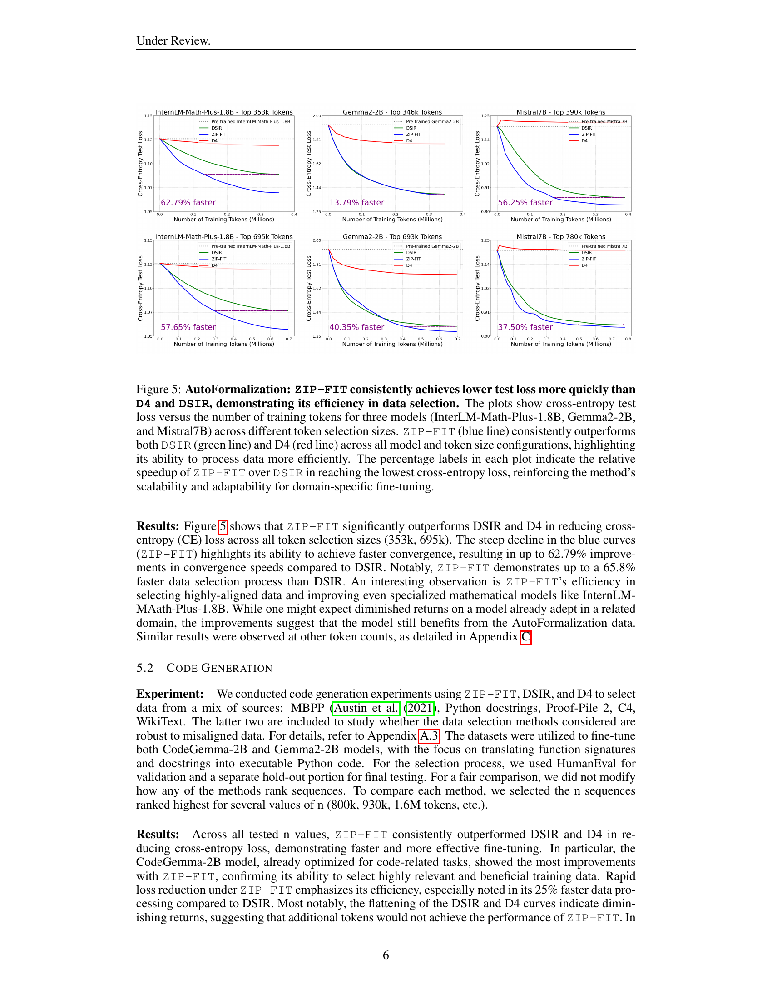

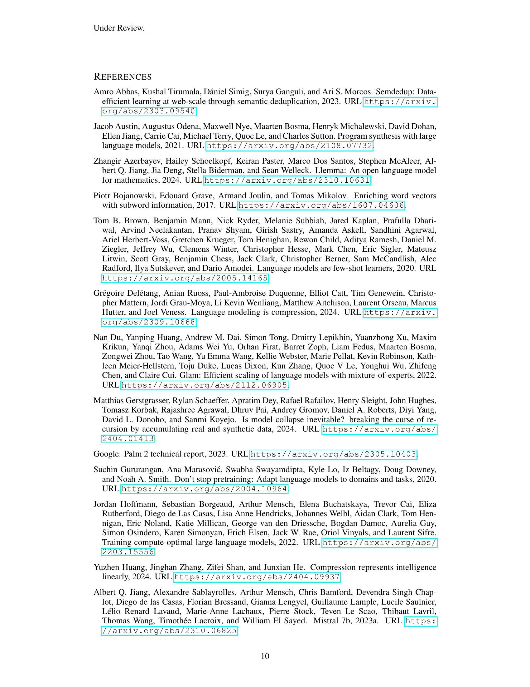

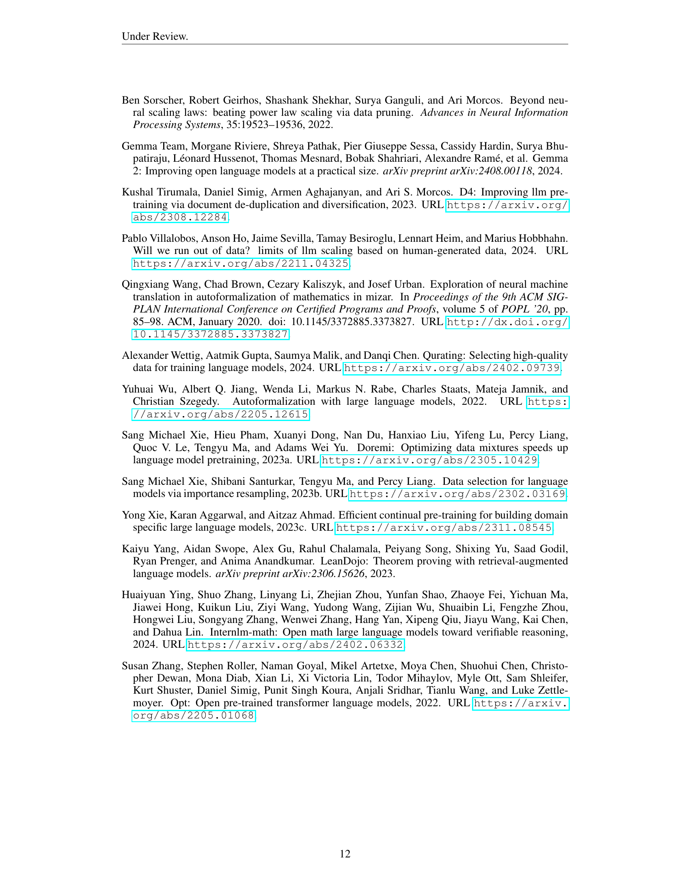
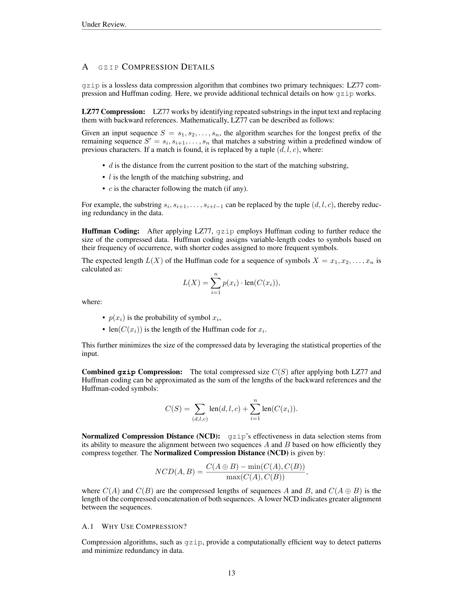

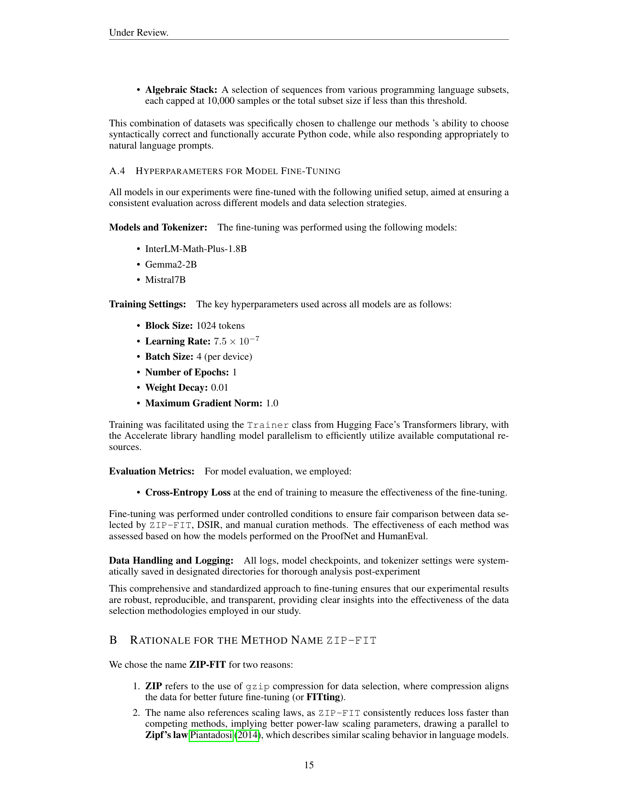

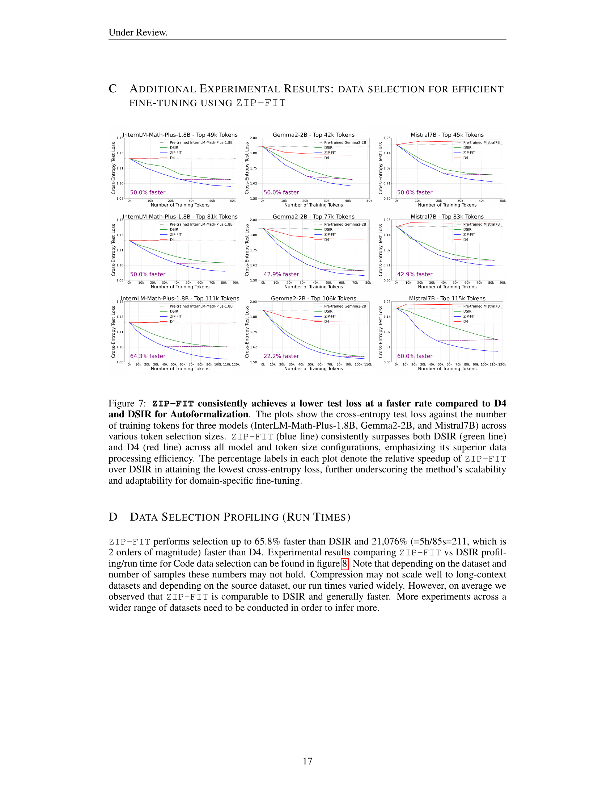
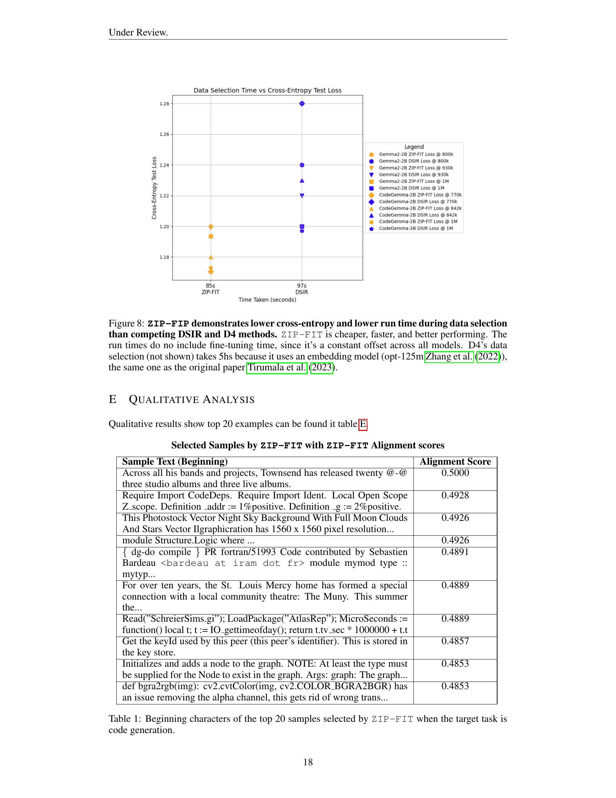

