### TL;DR



This paper tackles the computational inefficiency of traditional Reinforcement Learning from Human Feedback (RLHF) for Large Language Models (LLMs).  Current RLHF methods are online and on-policy, meaning the model generates text, receives feedback, and updates simultaneously.  This is slow. The authors propose asynchronous off-policy RLHF, where sample generation and model training happen concurrently but separately. This allows for using highly optimized libraries for each stage, leading to speed increases. The research explores the impact of off-policy learning on RLHF performance and finds that Online Direct Preference Optimization (Online DPO) is the most robust algorithm in this setting. They demonstrate significant speed improvements (up to 40% faster) on various sized LLMs while matching or exceeding the performance of synchronous methods. The study also examines compute optimization strategies and identifies trade-offs between efficiency and performance. Overall, the paper introduces a promising alternative to conventional RLHF, offering faster and more efficient training of LLMs.




 &nbsp; read the paper on arXiv


#### Why does it matter?
This research paper introduces asynchronous RLHF, a novel approach to training large language models (LLMs) that significantly speeds up the process while maintaining performance.  The paper details the method, its advantages and challenges, as well as results from experiments with various model sizes.
#### Key Takeaways


 Asynchronous RLHF significantly accelerates LLM training without sacrificing performance. 



 Online DPO is robust to off-policy data, making it suitable for asynchronous training. 



 Efficient LLM generation libraries are crucial for maximizing the computational gains of asynchronous RLHF. 


------
#### Visual Insights

 or generation-bound (right). In practice, generation and training speeds differ so a challenge of asynchronous learning is how best to balance usage and leverage idle compute time to further improve training.")

> The figure illustrates training-bound versus generation-bound asynchronous RLHF, highlighting the challenge of balancing generation and training speeds to optimize compute usage.

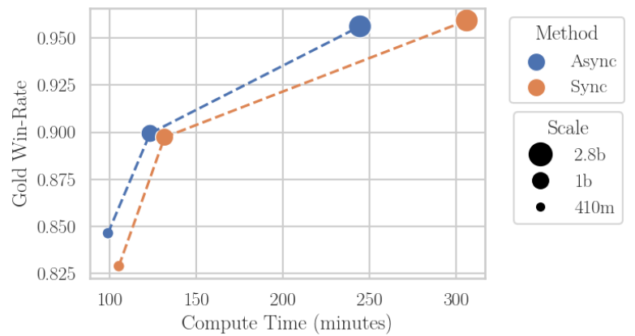

> The chart shows that asynchronous off-policy RLHF training is more computationally efficient than synchronous on-policy RLHF, achieving comparable performance while reducing training time.


<table id='3' style='font-size:16px'><tr><td></td><td>Mila - Quebec AI Institute</td></tr><tr><td></td><td>Universite de Montreal</td></tr><tr><td></td><td>Allen Institute for AI</td></tr><tr><td></td><td>Google Deepmind</td></tr><tr><td></td><td>Canada CIFAR AI Chair</td></tr></table>

> Table 1 presents the win rate and perplexity scores achieved by three different sized models (410m, 1B, and 2.8B) after supervised fine-tuning, before reinforcement learning from human feedback (RLHF) is applied.

### More visual insights

More on charts

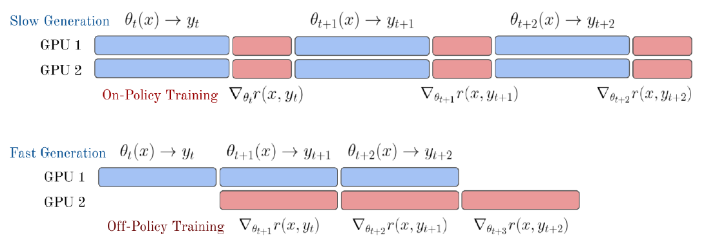

> The chart shows that asynchronous off-policy RLHF is more computationally efficient than synchronous on-policy RLHF across different model scales, achieving similar performance with faster training times.

. As we increase N, our model must take more steps on data generated by the same old policy. This increases off-policyness and reduces win-rate. Left: Gold win-rate over training Middle: KL (perplexity) over training, higher is further from initial model Right: Gold win-rate vs KL")

> The chart illustrates the trade-off between win-rate and KL divergence (a measure of how much the model has drifted from its initial state) in off-policy PPO, showing how performance decreases as the learning becomes more off-policy.

 or Best-of-2 SFT (Right). Performance is shown across levels of off-policyness as mediated by number of mini-batches N∈ {1,2,4,8,16}. With higher N increasing off-policyness, Online DPO retains much more performance than other methods, as evidenced by off-policy points still being clustered close to optimal performance.")

> The chart displays the robustness of different RLHF loss functions (Online DPO, PPO, RLOO, Best-of-2) to varying degrees of off-policyness, showing Online DPO's superior performance.

 improves off-policy robustness as seen by tighter clustering of points. But scaling reward model size (right) does not, even though it reduces overoptimization, achieving reward with smaller KL.")

> The chart displays the relationship between final win-rate, KL divergence, and model size (both policy and reward models) across various levels of off-policy learning.

. Left: At 410m and 1B scales, more updates per batch increases the win-rate achieved at any given episode, making training more data efficient. Right: Across scales, more updates change the pareto frontier and cause models to achieve the same win-rate at a higher KL.")

> The chart shows the effect of multiple training updates per mini-batch on the win-rate and KL divergence in generation-bound asynchronous RLHF across different model scales.

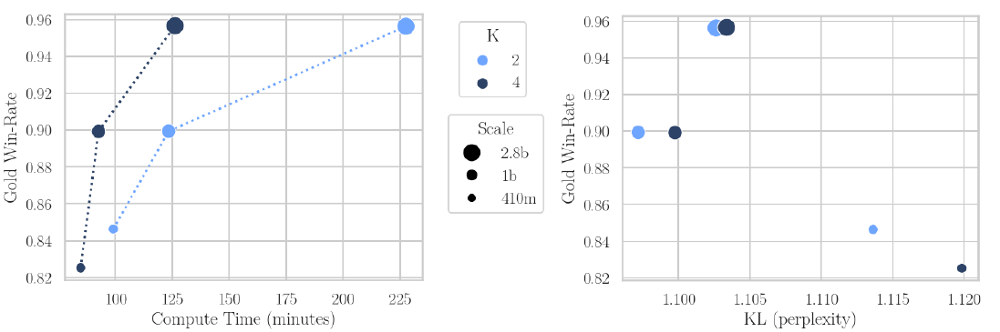

> The chart displays the trade-off between compute efficiency and model performance (measured by KL divergence) when optimizing training-bound RLHF by varying the number of samples generated per prompt.

> The chart compares the performance of synchronous and asynchronous online DPO for training a large language model (LLM), showing that asynchronous learning achieves similar reward scores with lower KL divergence and faster training time.

More on tables


<table id='3' style='font-size:16px'><tr><td>Model</td><td>Win Rate</td><td>KL (Perplexity)</td></tr><tr><td>SFT 410m</td><td>25.36%</td><td>1.075</td></tr><tr><td>SFT 1B</td><td>26.82%</td><td>1.071</td></tr><tr><td>SFT 2.8B</td><td>35.16%</td><td>1.068</td></tr></table>

> Table 1 presents the win rate and KL perplexity of the Pythia models of different sizes after supervised fine-tuning with SFT data, before reinforcement learning from human feedback is applied.


<table id='6' style='font-size:18px'><tr><td>Hyperparameter</td><td>Value</td></tr><tr><td>Learning Rate</td><td>3 x 10-6</td></tr><tr><td>Learning Rate Schedule</td><td>Linear</td></tr><tr><td>Generation Temperature</td><td>0.7</td></tr><tr><td>Batch Size (effective)</td><td>512</td></tr><tr><td>Max Token Length</td><td>1,024</td></tr><tr><td>Max Prompt Token Length</td><td>512</td></tr><tr><td>Response Length</td><td>128</td></tr><tr><td>Number of PPO Epochs</td><td>1</td></tr><tr><td>Total Episodes</td><td>131,072</td></tr><tr><td>KL penalty coefficient</td><td>0.05</td></tr><tr><td>Penalty Reward Value for Completions Without an EOS Token</td><td>-1.0</td></tr></table>

> Table 1 presents the win rate and perplexity scores achieved by three different sized models (410m, 1B, and 2.8B) after undergoing supervised fine-tuning, but before reinforcement learning from human feedback (RLHF).


<table id='0' style='font-size:16px'><tr><td>Hyperparameter</td><td>Value</td></tr><tr><td>Model</td><td>Meta-Llama-3.1-8B</td></tr><tr><td>Max Sequence Length</td><td>4,096</td></tr><tr><td>Batch Size (effective)</td><td>128</td></tr><tr><td>Learning Rate</td><td>5.0 x 10-6</td></tr><tr><td>Learning Rate Schedule</td><td>Linear</td></tr><tr><td>Learning Rate Warmup Ratio</td><td>0.03</td></tr><tr><td>Learning Rate Weight Decay</td><td>0.0</td></tr><tr><td>Number of Epochs</td><td>2</td></tr></table>

> Table 1 presents the win rate and perplexity scores achieved by different sized models after supervised fine-tuning, before reinforcement learning from human feedback (RLHF) is applied.


<table id='3' style='font-size:16px'><tr><td>Hyperparameter</td><td>Value</td></tr><tr><td>Model</td><td>The Trained No Robot SFT Checkpoint</td></tr><tr><td>Learning Rate</td><td>3 x 10-6</td></tr><tr><td>Learning Rate Schedule</td><td>Linear</td></tr><tr><td>Batch Size (effective)</td><td>256</td></tr><tr><td>Max Sequence Length</td><td>1,024</td></tr><tr><td>Number of Epochs</td><td>1</td></tr></table>

> Table 1 presents the win rate and perplexity scores achieved by different sized language models after supervised fine-tuning, prior to reinforcement learning from human feedback (RLHF).


<table id='6' style='font-size:16px'><tr><td>Hyperparameter</td><td>Value</td></tr><tr><td>Model</td><td>The Trained No Robot SFT Checkpoint</td></tr><tr><td>Reward Model</td><td>The Trained RM Checkpoint</td></tr><tr><td>Learning Rate</td><td>8 x 10-7</td></tr><tr><td>Learning Rate Schedule</td><td>Linear</td></tr><tr><td>Generation Temperature</td><td>0.7</td></tr><tr><td>Batch Size (effective)</td><td>256</td></tr><tr><td>Max Token Length</td><td>1,024</td></tr><tr><td>Max Prompt Token Length</td><td>512</td></tr><tr><td>Number of Epochs</td><td>1</td></tr><tr><td>Total Episodes</td><td>100,000</td></tr><tr><td>Beta (DPO coefficient)</td><td>0.03</td></tr><tr><td>Response Length</td><td>1,024</td></tr><tr><td>Penalty Reward Value for Completions</td><td></td></tr><tr><td>Without an EOS Token</td><td>-10.0</td></tr></table>

> The table presents the win rates and average response sequence lengths achieved by different models (SFT, Async Online DPO, Sync Online DPO, and Human) on the No Robots dataset.


<table id='1' style='font-size:18px'><tr><td>Model</td><td>Win Rate</td><td>Average Response Sequence Length</td></tr><tr><td>SFT</td><td>31.80%</td><td>198.40</td></tr><tr><td>Async Online DPO</td><td>57.20%</td><td>290.55</td></tr><tr><td>Sync Online DPO</td><td>57.20%</td><td>286.21</td></tr><tr><td>Human</td><td>N/A</td><td>179.726</td></tr></table>

> Table 6 presents the win rates and average response sequence lengths of three language models (SFT, Async Online DPO, Sync Online DPO) and human-written responses on the No Robots dataset.

### Full paper


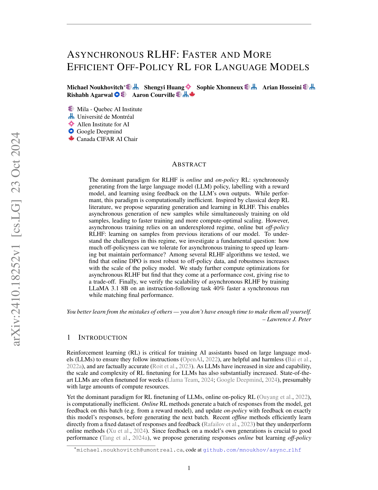

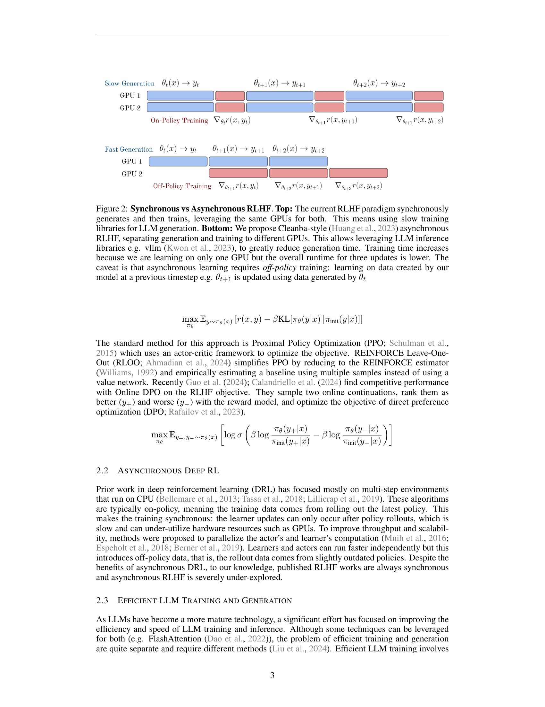

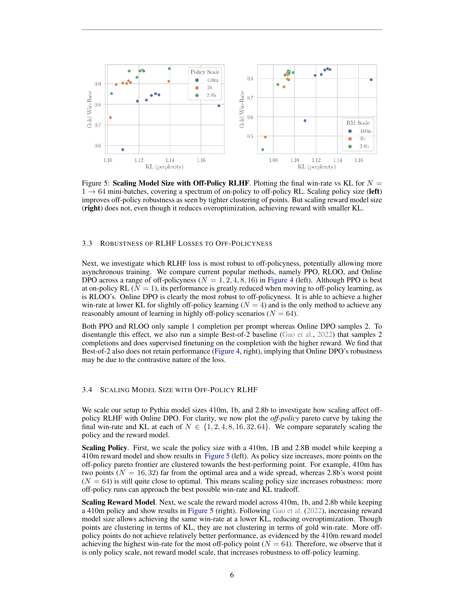
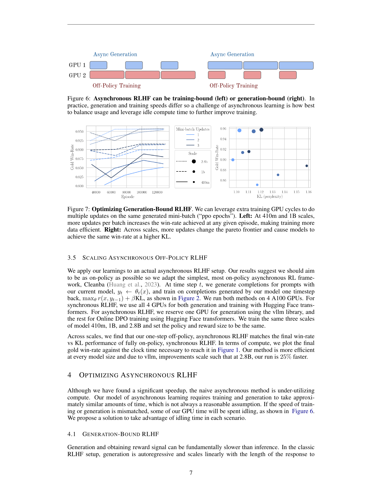

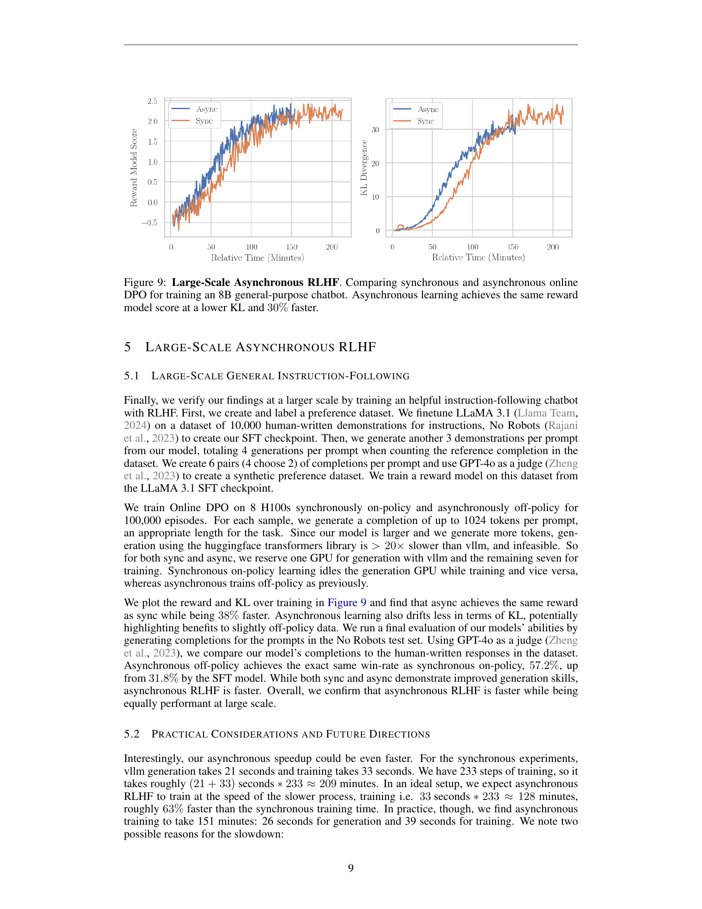

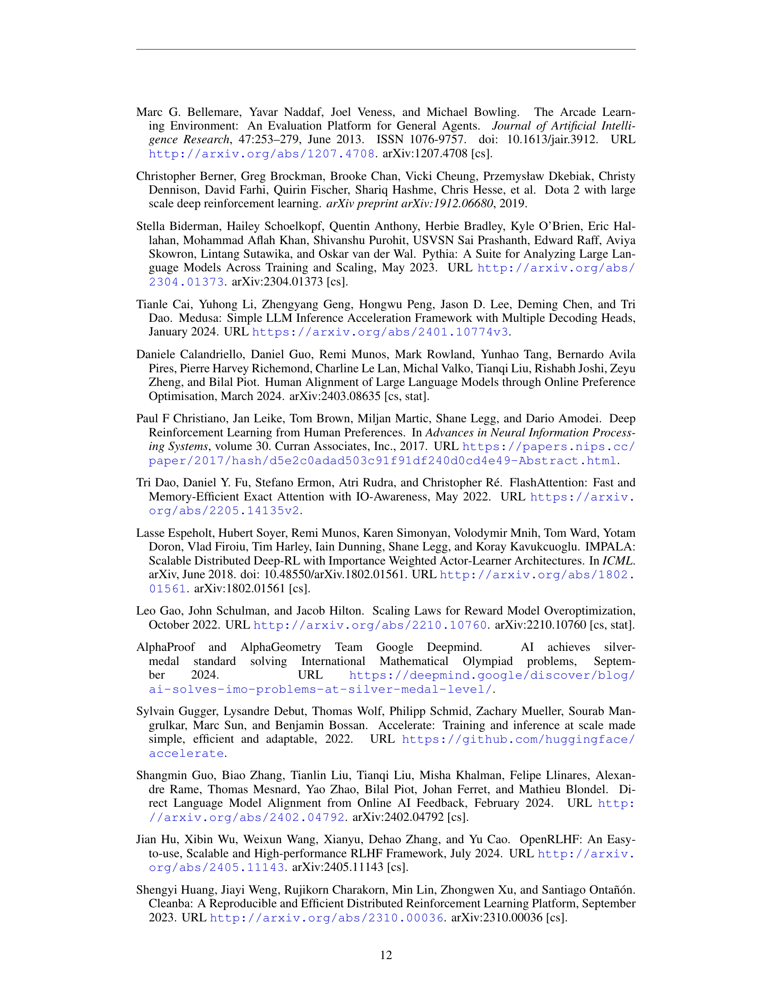

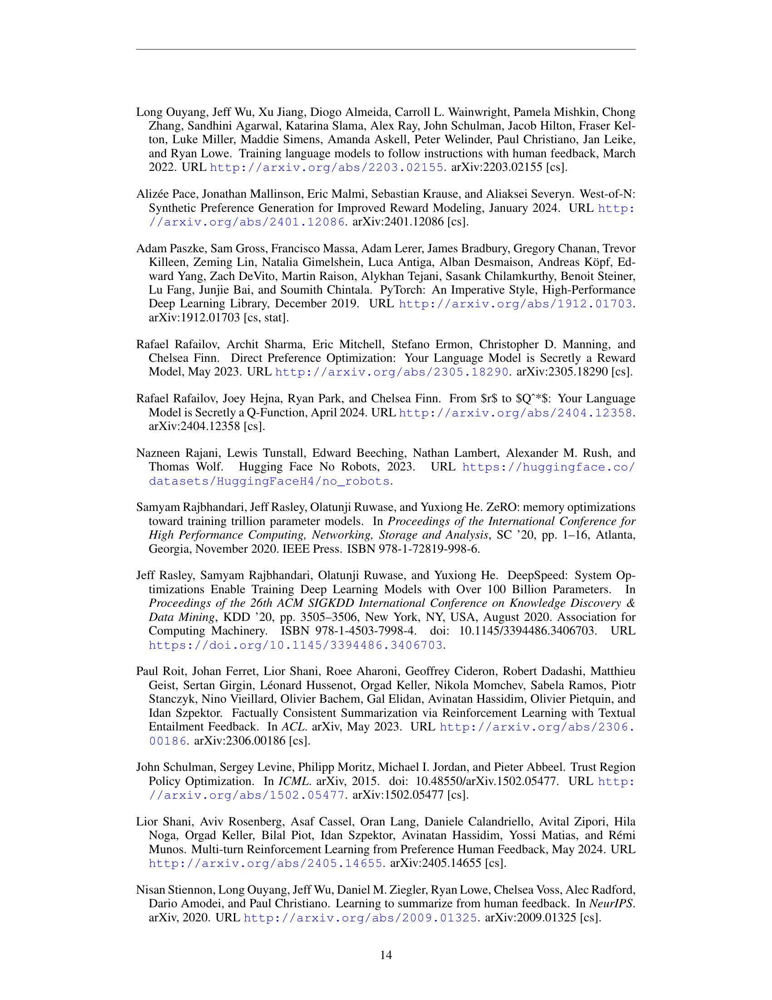
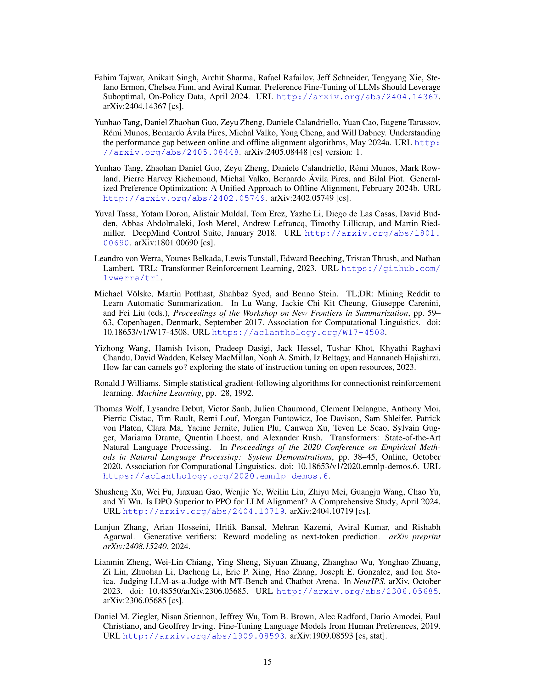

