### TL;DR



This paper tackles the challenge of automatically generating HTML code from UI designs using Large Language Models (LLMs).  Current LLMs struggle with the hierarchical nature of HTML and the visual-to-text translation. WAFFLE, a new fine-tuning approach, is introduced to address these limitations. It utilizes a 'structure-aware attention mechanism' to help the LLM better understand HTML structure and a 'contrastive fine-tuning' approach to improve the alignment between visual UI representations and the textual HTML code.  Experiments on a new benchmark, WebSight-Test, and Design2Code show that WAFFLE significantly improves HTML code generation accuracy.  The improvements are substantial across various evaluation metrics demonstrating the effectiveness of the proposed strategy.




 &nbsp; read the paper on arXiv


#### Why does it matter?
The paper introduces WAFFLE, a novel fine-tuning strategy that significantly improves the accuracy of Multi-Modal Large Language Models (MLLMs) in generating HTML code from UI designs.  This addresses the challenges of representing HTML's hierarchical structure and bridging the visual-textual gap in UI-to-code generation.
#### Key Takeaways


 WAFFLE uses a structure-aware attention mechanism to improve LLMs' understanding of HTML's hierarchical structure. 



 WAFFLE employs contrastive fine-tuning to align LLMs' understanding of UI images and HTML code. 



 WAFFLE outperforms existing methods on HTML match, CW-SSIM, CLIP, and LLEM metrics, demonstrating its effectiveness. 


------
#### Visual Insights

> Figure 1 shows that removing child elements from a parent element does not affect the visual layout of the parent or its siblings.

> The t-SNE plot visualizes the closeness of image and text embeddings generated by Standard FT and WAFFLE-attn, revealing that WAFFLE-attn better aligns image and text features.


<table id='1' style='font-size:18px'><tr><td>Shanchao Liang</td><td>Nan Jiang</td><td>Shangshu Qian</td><td>Lin Tan</td></tr><tr><td>Purdue University</td><td>Purdue University</td><td>Purdue University</td><td>Purdue University</td></tr><tr><td>liang422@purdue.edu</td><td>jiang719@purdue.edu</td><td>qian151 @purdue.edu</td><td>lintan@purdue.edu</td></tr></table>

> Table 2 presents the performance comparison of different fine-tuning techniques on the WebSight-Test dataset, using metrics such as HTML Match, CW-SSIM, CLIP, and LLEM.

### More visual insights

More on figures

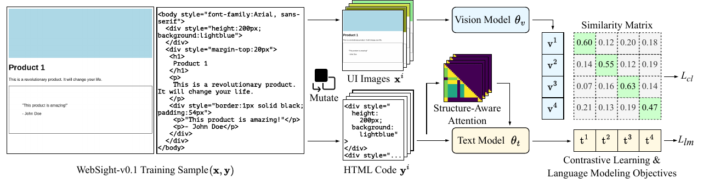

> The figure illustrates the WAFFLE architecture, showing its training data mutation process, structure-aware attention mechanism, and contrastive learning strategy.

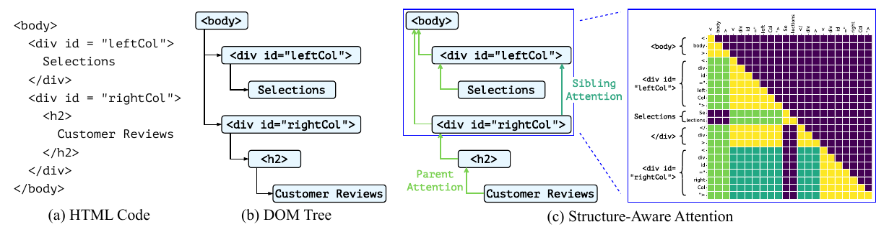

> The figure illustrates WAFFLE's structure-aware attention mechanism, highlighting how tokens focus on parent, sibling, and self elements within the HTML code structure.

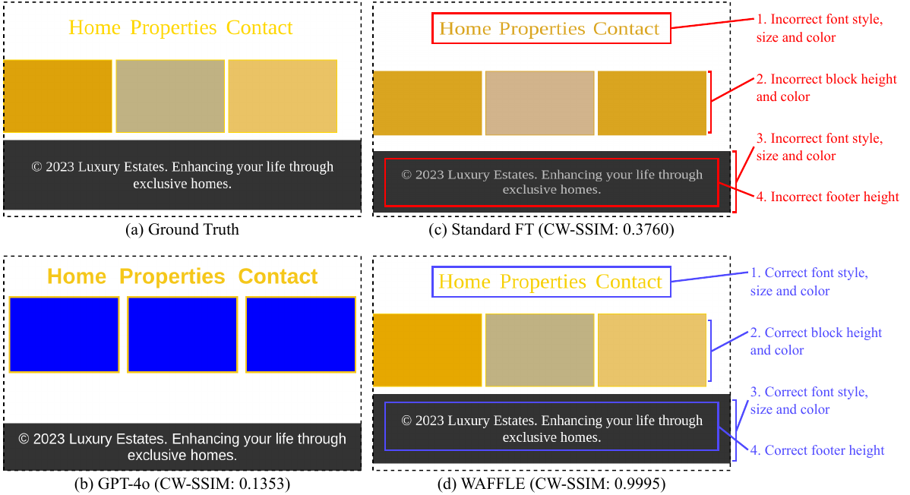

> The figure shows a comparison of webpage generation results from ground truth, GPT-40, standard fine-tuning, and WAFFLE on a sample from the WebSight-Test dataset, highlighting WAFFLE's superior performance.

, the green line almost overlaps with the blue line.")

> The figure illustrates the tuning process of the hyperparameter controlling the effect of structure-aware attention on validation LLEM score and training loss.

More on tables


<table id='0' style='font-size:14px'><tr><td>Artists</td><td>Artists</td></tr><tr><td colspan="2">(a) Rendered webpage from code in (b) (c) Rendered webpage from code in (d)</td></tr><tr><td>#grid { display: grid; grid-template-columns: 1fr 1fr; }</td><td>#grid { display: grid; grid-template-columns: 1fr 2fr; }</td></tr><tr><td>
</td><td>
</td></tr><tr><td>
 
</td><td>
 
</td></tr><tr><td>
 
</td><td>
 
</td></tr><tr><td>
 
</td><td>
 
</td></tr><tr><td>
 
</td><td>
 
</td></tr><tr><td>
 
</td><td>
 
</td></tr><tr><td>
 
 
</td><td>
 
 
</td></tr><tr><td>(b) Snippet of HTML and CSS code</td><td>(d) Small modification on CSS in (b)</td></tr></table>

> Table 2 presents the performance comparison of different techniques on the WebSight-Test dataset using various metrics, including HTML-Match, CW-SSIM, CLIP, and LLEM.


<table id='2' style='font-size:14px'><tr><td colspan="6">CSS</td><td rowspan="2">HTML</td><td rowspan="2">Total</td></tr><tr><td>Color</td><td>Size</td><td>Margin</td><td>Font</td><td>Display</td><td>Position</td></tr><tr><td>12</td><td>11</td><td>19</td><td>10</td><td>1</td><td>2</td><td>I 8</td><td>63</td></tr></table>

> The table shows the most frequent causes of failures in existing web MLLMs, categorized into seven common error types, each with a corresponding number of occurrences.


<table id='0' style='font-size:14px'><tr><td rowspan="2">Backbones</td><td rowspan="2">Techniques</td><td rowspan="2">HTML-Match (%) ↑</td><td rowspan="2">CW-SSIM ↑</td><td rowspan="2">CLIP ↑</td><td colspan="5">Low-Level Element Matching (LLEM) (%) ↑</td></tr><tr><td>Average</td><td>Block-Match</td><td>Text</td><td>Position</td><td>Color</td></tr><tr><td rowspan="3">Gemini 1.5 Pro GPT-4o mini GPT-4o</td><td>Prompting</td><td>9.40</td><td>0.3385</td><td>88.55</td><td>90.16</td><td>94.31</td><td>98.41</td><td>84.73</td><td>83.18</td></tr><tr><td>Prompting</td><td>10.20</td><td>0.3055</td><td>87.72</td><td>87.54</td><td>92.59</td><td>98.48</td><td>82.65</td><td>76.45</td></tr><tr><td>Prompting</td><td>11.40</td><td>0.3666</td><td>89.03</td><td>92.18</td><td>94.66</td><td>98.43</td><td>87.04</td><td>88.60</td></tr><tr><td rowspan="2">Moondream2</td><td>Standard FT</td><td>21.60</td><td>0.4233</td><td>89.92</td><td>90.59</td><td>91.73</td><td>96.98</td><td>87.56</td><td>86.77</td></tr><tr><td>WAFFLE</td><td>27.60</td><td>0.4486</td><td>89.98</td><td>91.72</td><td>92.26</td><td>97.25</td><td>89.55</td><td>87.81</td></tr><tr><td rowspan="2">VLM-WebSight</td><td>Standard FT</td><td>28.00</td><td>0.5023</td><td>93.30</td><td>92.73</td><td>97.95</td><td>90.72</td><td>91.07</td><td>93.45</td></tr><tr><td>WAFFLE</td><td>37.00</td><td>0.6005</td><td>94.57</td><td>95.16</td><td>93.62</td><td>98.16</td><td>93.29</td><td>95.57</td></tr></table>

> Table 2 presents the performance comparison of different techniques on the WebSight-Test dataset, showing improvements achieved by WAFFLE across various metrics like HTML-Match, CW-SSIM, CLIP, and LLEM.


<table id='2' style='font-size:14px'><tr><td rowspan="2">Backbones</td><td rowspan="2">Techniques</td><td rowspan="2">CW-SSIM ↑</td><td rowspan="2">CLIP ↑</td><td colspan="5">Low-Level Element Matching (LLEM) (%) ↑</td></tr><tr><td>Average</td><td>Block-Match</td><td>Text</td><td>Position</td><td>Color</td></tr><tr><td rowspan="3">Gemini 1.5 Pro* GPT-4o-mini GPT-4o</td><td>Prompting</td><td>0.2652</td><td>87.76</td><td>87.17</td><td>91.82</td><td>97.40</td><td>82.67</td><td>76.81</td></tr><tr><td>Prompting</td><td>0.2304</td><td>86.06</td><td>78.84</td><td>70.64</td><td>92.39</td><td>78.55</td><td>73.78</td></tr><tr><td>Prompting</td><td>0.2776</td><td>89.03</td><td>83.67</td><td>75.98</td><td>94.29</td><td>83.38</td><td>81.01</td></tr><tr><td rowspan="2">Moondream2</td><td>Standard FT</td><td>0.1348</td><td>46.63</td><td>40.71</td><td>29.56</td><td>49.41</td><td>40.73</td><td>43.14</td></tr><tr><td>WAFFLE</td><td>0.2142</td><td>79.62</td><td>67.83</td><td>44.32</td><td>83.59</td><td>71.61</td><td>71.81</td></tr><tr><td rowspan="2">VLM-WebSight</td><td>Standard FT</td><td>0.2518</td><td>82.35</td><td>73.00</td><td>55.77</td><td>84.14</td><td>74.74</td><td>77.36</td></tr><tr><td>WAFFLE</td><td>0.2815</td><td>85.98</td><td>77.81</td><td>61.47</td><td>88.20</td><td>79.30</td><td>82.28</td></tr></table>

> Table 3 presents the performance comparison of various fine-tuning strategies on the Design2Code dataset across multiple metrics, including HTML-Match, CW-SSIM, CLIP, and Low-Level Element Matching (LLEM).


<table id='0' style='font-size:14px'><tr><td rowspan="2">Backbones</td><td rowspan="2">Techniques</td><td colspan="4">WebSight-Test</td><td colspan="3">Design2Code</td></tr><tr><td>HTML-Match (%) ↑</td><td>CW-SSIM ↑</td><td>CLIP ↑</td><td>LLEM (%) ↑</td><td>CW-SSIM ↑</td><td>CLIP ↑</td><td>LLEM (%) ↑</td></tr><tr><td rowspan="4">Moondream2</td><td>Standard FT</td><td>21.60</td><td>0.4233</td><td>89.92</td><td>90.59</td><td>0.1348</td><td>46.63</td><td>40.71</td></tr><tr><td>WAFFLE-attn</td><td>23.60</td><td>0.4311</td><td>90.47</td><td>91.34</td><td>0.1821</td><td>67.73</td><td>56.49</td></tr><tr><td>WAFFLE-contra</td><td>26.00</td><td>0.4296</td><td>89.55</td><td>91.21</td><td>0.2100</td><td>76.63</td><td>65.82</td></tr><tr><td>WAFFLE</td><td>27.60</td><td>0.4486</td><td>89.98</td><td>91.72</td><td>0.2142</td><td>79.62</td><td>67.83</td></tr><tr><td rowspan="4">VLM-WebSight</td><td>Standard FT</td><td>28.00</td><td>0.5023</td><td>93.30</td><td>92.73</td><td>0.2518</td><td>82.35</td><td>73.00</td></tr><tr><td>WAFFLE-attn</td><td>30.80</td><td>0.5411</td><td>94.29</td><td>94.20</td><td>0.2480</td><td>85.64</td><td>75.34</td></tr><tr><td>WAFFLE-contra</td><td>35.80</td><td>0.5677</td><td>95.08</td><td>95.30</td><td>0.2653</td><td>85.16</td><td>76.48</td></tr><tr><td>WAFFLE</td><td>37.00</td><td>0.6005</td><td>94.57</td><td>95.16</td><td>0.2815</td><td>85.98</td><td>77.81</td></tr></table>

> Table 4 presents the performance comparison of different ablation models on two benchmark datasets, showing the impact of contrastive learning and structure-aware attention on various metrics.


<table id='2' style='font-size:14px'><tr><td>Techniques</td><td>Rank 1 ↑</td><td>Rank 2 ↑</td><td>Rank 3 ↑</td><td>Avg Rankings ↓</td></tr><tr><td>Standard FT</td><td>7117 (24)</td><td>14|13 (27)</td><td>17|18 (35)</td><td>2.9012.42 (2.66)</td></tr><tr><td>WAFFLE-attn</td><td>15|16 (31)</td><td>9117 (26)</td><td>24116 (40)</td><td>2.55 12.37 (2.46)</td></tr><tr><td>WAFFLE-contra</td><td>38120 (58)</td><td>8111 (19)</td><td>10|15 (25)</td><td>1.67 12.38 (2.02)</td></tr><tr><td>WAFFLE</td><td>27132 (59)</td><td>18112 (30)</td><td>10| 9 (19)</td><td>1.88 l1.85 (1.87)</td></tr></table>

> Table 5 presents human evaluation results on two datasets comparing four different techniques, showing WAFFLE's superior performance.


 <table id='8' style='font-size:14px'><tr><td>Techniques</td><td>Prior</td><td>Current</td><td>Drop (%)</td></tr><tr><td>WAFFLE-attn</td><td>0.8002</td><td>0.5797</td><td>27.55</td></tr><tr><td>WAFFLE</td><td>0.8291</td><td>0.7932</td><td>4.34</td></tr></table>

> Table 5 presents human evaluation results on two datasets using VLM-WebSight, comparing the rankings of generated HTML code from four different techniques.


<table id='14' style='font-size:14px'><tr><td>Class</td><td>Failure Type</td><td>Specification</td></tr><tr><td rowspan="6">CSS</td><td>Color</td><td>Random Color in Range [#000000 , #FFFFFF]</td></tr><tr><td>Size</td><td>Random Size in [0, 500] pixels</td></tr><tr><td>Margin</td><td>Random Size in [0, 100] pixels</td></tr><tr><td>Font</td><td>Random Size in [0, 40] pixels</td></tr><tr><td>Display</td><td>Random Keyword for text-align, display, flex-direction, and justify-content</td></tr><tr><td>Position</td><td>Random Keyword for border-radius, position, top, and right</td></tr><tr><td>HTML</td><td>Structure</td><td>Duplication of a Random HTML Element, excluding <head>, <header>, <html>, <body></td></tr></table>

> This table shows the mutation rules used to mutate the HTML code and CSS styles for each element to create the contrastive learning dataset.


 <table id='3' style='font-size:16px'><tr><td>Techniques</td><td>d(vi, ti) ↓</td><td>sim(vi, ti) ↑</td></tr><tr><td>Standard FT</td><td>1.3395</td><td>0.1027</td></tr><tr><td>WAFFLE-attn</td><td>0.8447</td><td>0.6244</td></tr></table>

> Table 2 presents the performance comparison of different fine-tuning techniques on the WebSight-Test dataset, using metrics like HTML-Match, CW-SSIM, CLIP, and LLEM.


<table id='0' style='font-size:14px'><tr><td>Techniques</td><td>d(vi, c) ↑</td><td>sim(vi, cg) ↓</td></tr><tr><td>Standard FT</td><td>0.1224</td><td>0.9910</td></tr><tr><td>WAFFLE-attn</td><td>0.7590</td><td>0.6202</td></tr></table>

> Table 9 shows the distance and similarity between each averaged image embedding and the centroid of its corresponding group of mutants, using the Moondream2 backbone.

### Full paper


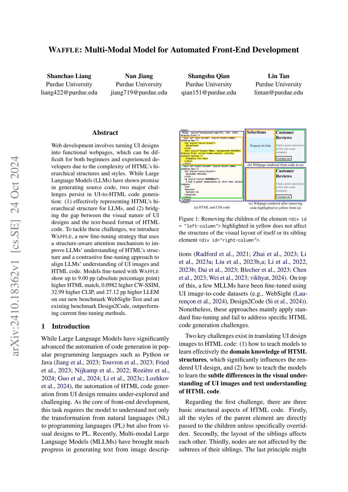
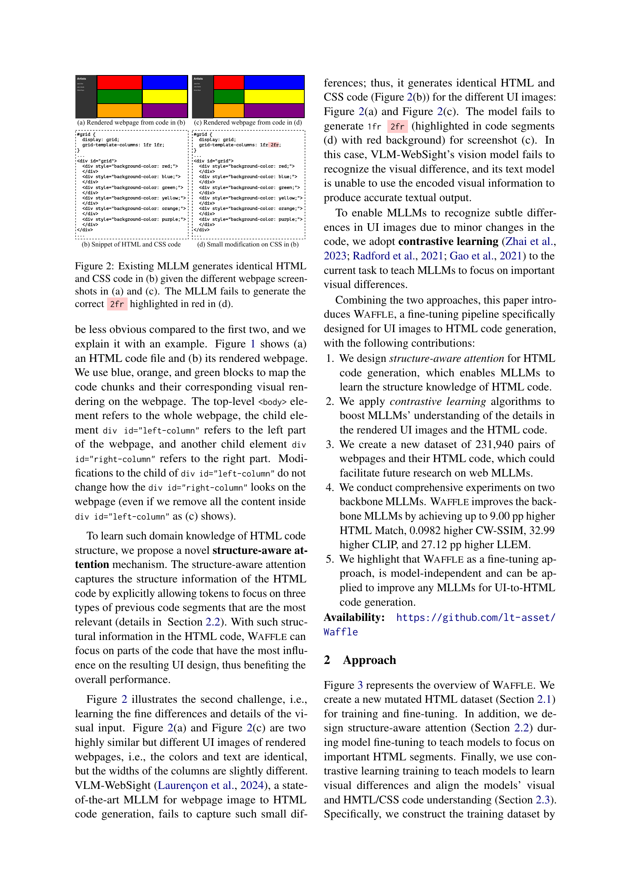
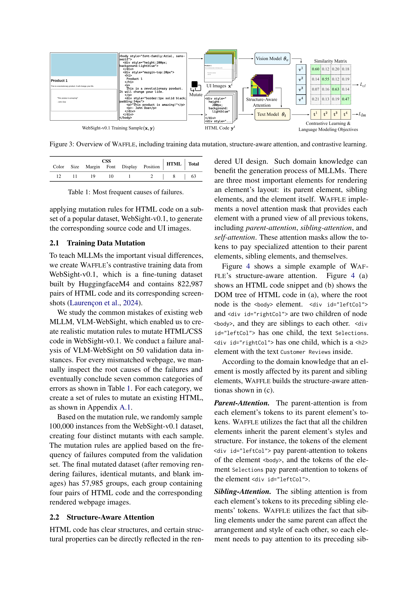
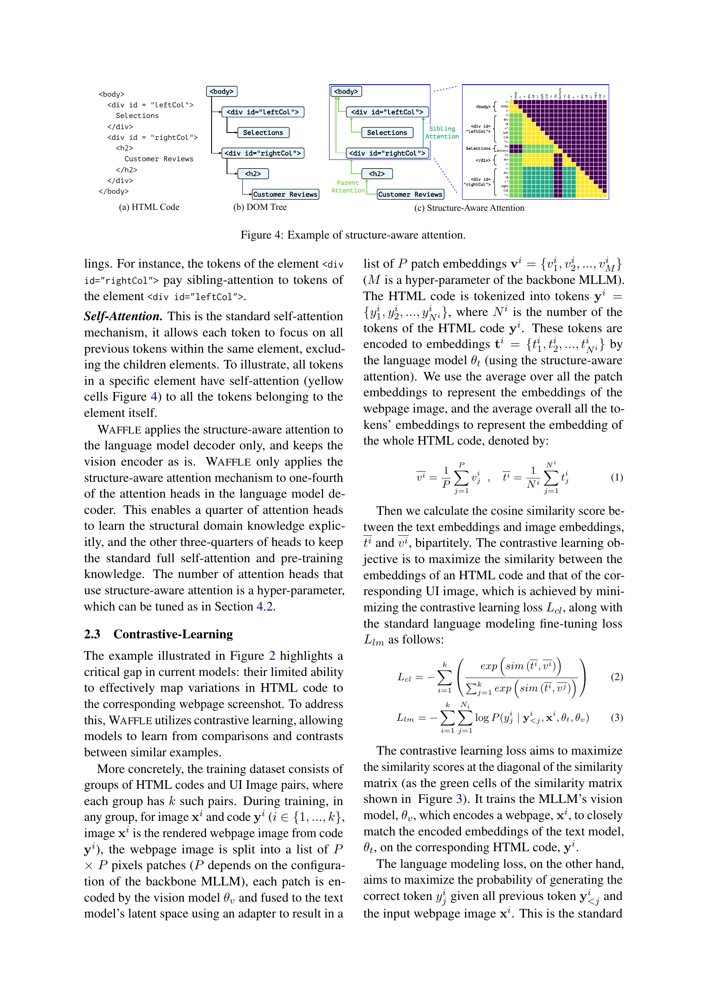
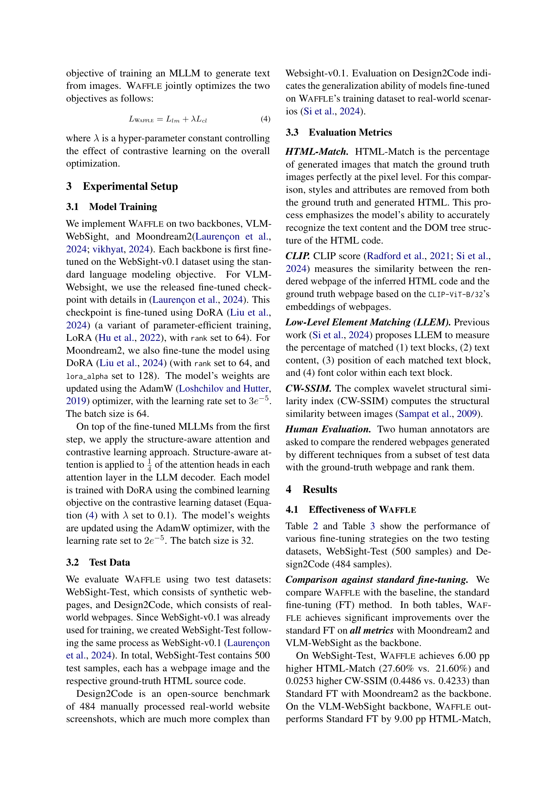

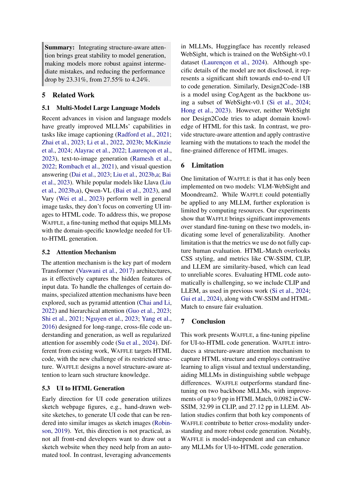

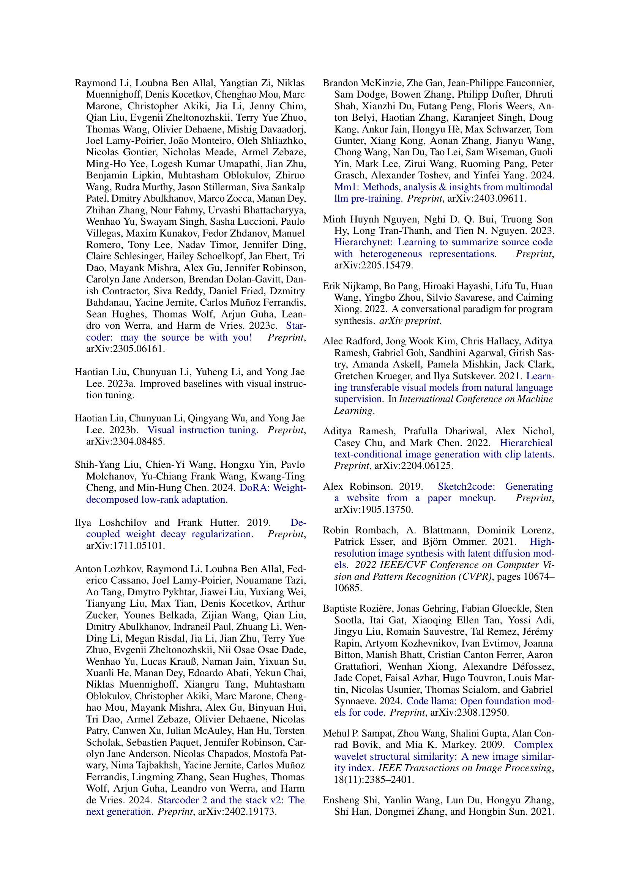
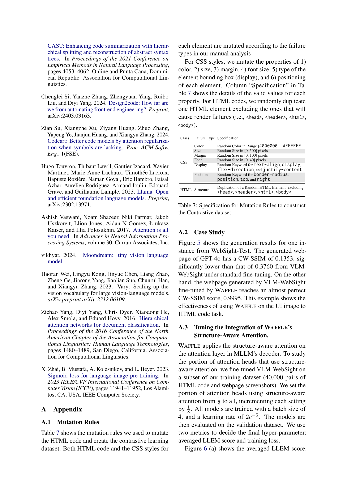
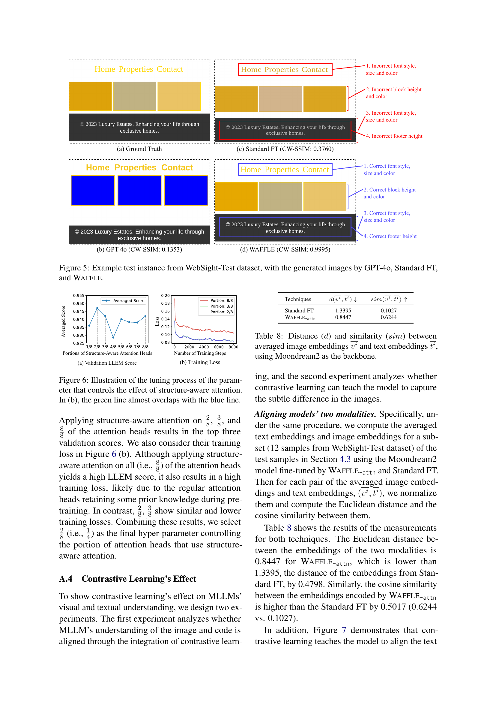
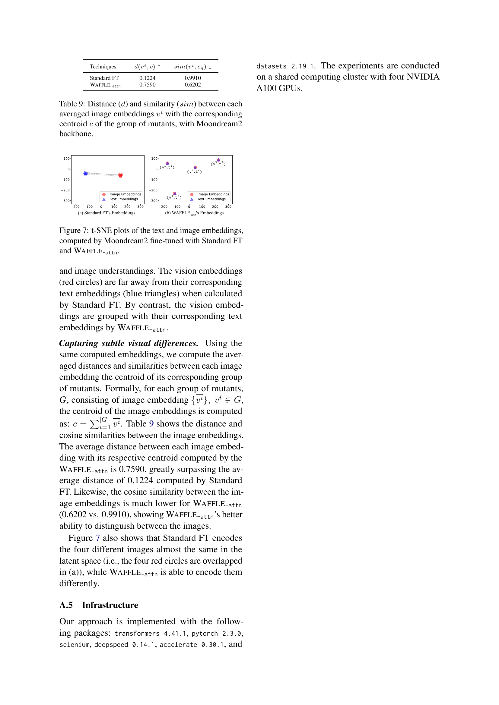
